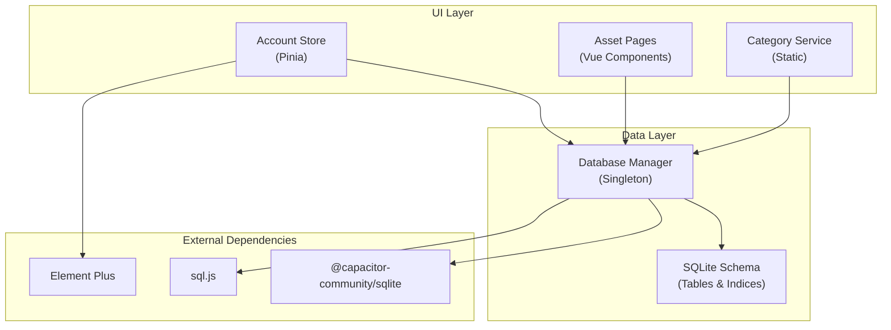
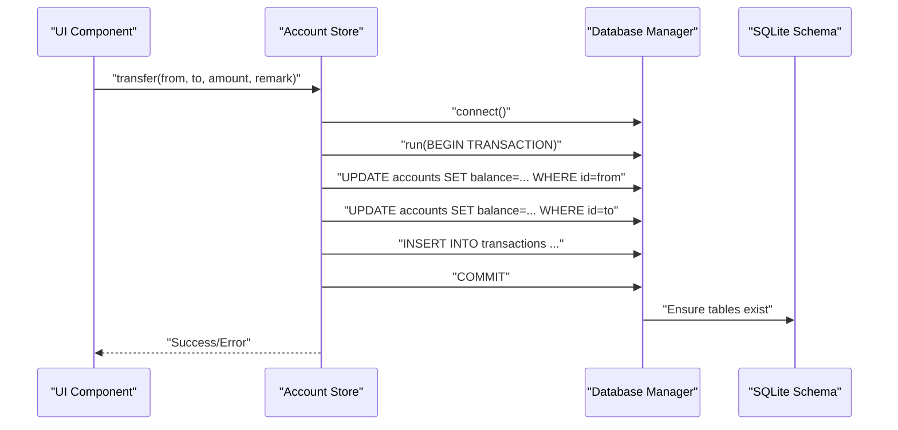
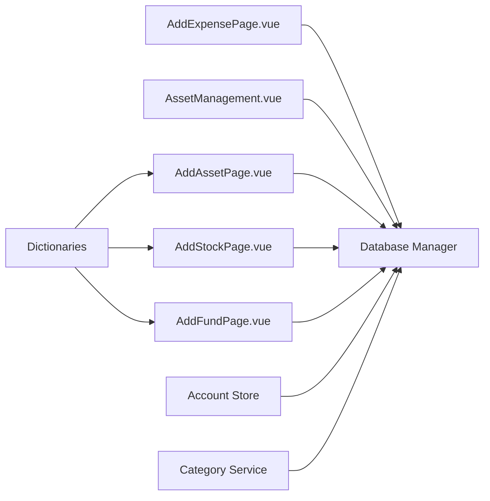

# API Reference

<cite>
**Referenced Files in This Document**
- [categoryService.ts](file://src/services/categoryService.ts)
- [categories.ts](file://src/data/categories.ts)
- [account.ts](file://src/stores/account.ts)
- [index.js](file://src/database/index.js)
- [adapter.js](file://src/database/adapter.js)
- [dictionaries.ts](file://src/utils/dictionaries.ts)
- [AddExpensePage.vue](file://src/components/mobile/expense/AddExpensePage.vue)
- [AssetManagement.vue](file://src/components/mobile/asset/AssetManagement.vue)
- [AddAssetPage.vue](file://src/components/mobile/asset/AddAssetPage.vue)
- [AddStockPage.vue](file://src/components/mobile/asset/AddStockPage.vue)
- [AddFundPage.vue](file://src/components/mobile/asset/AddFundPage.vue)
- [main.js](file://src/main.ts)
- [package.json](file://package.json)
- [version_marker.txt](file://version_marker.txt)
</cite>

## Table of Contents
1. [Introduction](#introduction)
2. [Project Structure](#project-structure)
3. [Core Components](#core-components)
4. [Architecture Overview](#architecture-overview)
5. [Detailed Component Analysis](#detailed-component-analysis)
6. [Dependency Analysis](#dependency-analysis)
7. [Performance Considerations](#performance-considerations)
8. [Troubleshooting Guide](#troubleshooting-guide)
9. [Conclusion](#conclusion)
10. [Appendices](#appendices)

## Introduction
This document describes the internal APIs and services of the Finance App. It focuses on:
- Category management API for CRUD operations, validation, and response formats
- Account management API with transaction endpoints, balance calculations, and lifecycle operations
- Asset and investment tracking APIs for general assets, stocks, and funds, including valuation and performance-related fields
- Data service interfaces, repository patterns, and data transformation utilities
- Parameter specifications, return value schemas, error handling patterns, and authentication requirements
- Code examples for common API usage scenarios and integration patterns
- API versioning, backward compatibility, and deprecation policies

## Project Structure
The Finance App is a Vue 3 + TypeScript application with Pinia stores and a SQLite-based persistence layer. The database abstraction supports both Capacitor SQLite (native) and sql.js (web) environments. Internal APIs are exposed via:
- Services and stores (business logic)
- Direct database queries in components (where applicable)
- Database manager singleton for schema initialization, queries, and migrations

**Diagram sources**
- [index.js:21-374](file://src/database/index.js#L21-L374)
- [account.ts:27-264](file://src/stores/account.ts#L27-L264)
- [categoryService.ts:8-260](file://src/services/categoryService.ts#L8-L260)
- [package.json:19-36](file://package.json#L19-L36)

**Section sources**
- [main.js:1-16](file://src/main.ts#L1-L16)
- [package.json:1-72](file://package.json#L1-L72)

## Core Components
- Category Management Service: Provides category CRUD operations, default category initialization, and database status checks.
- Account Management Store: Manages account lifecycle, balance adjustments, transfers, and transaction logging.
- Database Manager: Singleton that initializes schema, executes queries, runs statements, batches, and transactions, and persists data.
- Asset and Investment Pages: Provide forms and flows for adding general assets, stocks, and funds, and persist data via database manager.

**Section sources**
- [categoryService.ts:8-260](file://src/services/categoryService.ts#L8-L260)
- [account.ts:27-264](file://src/stores/account.ts#L27-L264)
- [index.js:21-374](file://src/database/index.js#L21-L374)
- [AssetManagement.vue:141-183](file://src/components/mobile/asset/AssetManagement.vue#L141-L183)

## Architecture Overview
The internal APIs follow a layered pattern:
- UI components trigger actions
- Actions call the database manager for persistence
- Database manager abstracts platform-specific SQLite implementations
- Schema initialization ensures tables and indices exist

**Diagram sources**
- [account.ts:183-262](file://src/stores/account.ts#L183-L262)
- [index.js:354-374](file://src/database/index.js#L354-L374)

## Detailed Component Analysis

### Category Management API
Purpose: Manage categories (expenses/income) with CRUD operations, default initialization, and database status checks.

Endpoints and Methods
- GET /categories
  - Description: Retrieve all categories optionally filtered by type
  - Query parameters:
    - type: string (optional) - "expense" or "income"
  - Response: array of Category objects
    - id: string
    - name: string
    - icon: string
    - iconText: string
    - type: string
  - Validation: Returns merged default categories plus database categories; duplicates resolved by id
  - Error handling: On failure, falls back to default categories
- GET /categories/:id
  - Description: Get a category by ID
  - Path parameters:
    - id: string
  - Response: Category or null
- POST /categories
  - Description: Create a new category
  - Request body: Category without id
  - Response: boolean (success/failure)
  - Validation: Generates id using timestamp and random suffix
- PUT /categories/:id
  - Description: Update a category
  - Path parameters:
    - id: string
  - Request body: Partial<Category>
  - Response: boolean (success/failure)
  - Validation: Only provided fields are updated; updatedAt is set automatically
- DELETE /categories/:id
  - Description: Delete a category
  - Path parameters:
    - id: string
  - Response: boolean (success/failure)
- GET /categories/_status
  - Description: Check database connectivity
  - Response: { connected: boolean; message: string }
- POST /categories/_init-defaults
  - Description: Initialize default categories if none exist
  - Response: void

Notes
- Categories are merged from defaults and database records; database records override defaults by id
- Default categories include predefined expense and income items
- Initialization checks for existing categories before inserting defaults

**Section sources**
- [categoryService.ts:14-69](file://src/services/categoryService.ts#L14-L69)
- [categoryService.ts:76-94](file://src/services/categoryService.ts#L76-L94)
- [categoryService.ts:101-113](file://src/services/categoryService.ts#L101-L113)
- [categoryService.ts:121-160](file://src/services/categoryService.ts#L121-L160)
- [categoryService.ts:167-175](file://src/services/categoryService.ts#L167-L175)
- [categoryService.ts:181-194](file://src/services/categoryService.ts#L181-L194)
- [categoryService.ts:199-259](file://src/services/categoryService.ts#L199-L259)
- [categories.ts:1-45](file://src/data/categories.ts#L1-L45)

### Account Management API
Purpose: Manage accounts, balances, and transactions.

Endpoints and Methods
- GET /accounts
  - Description: Load all accounts
  - Response: array of Account objects
    - id: string
    - name: string
    - type: string
    - balance: number
    - used_limit?: number
    - total_limit?: number
    - is_liquid?: boolean
    - remark: string
    - created_at?: string
    - updated_at?: string
  - Error handling: Sets store error state and logs
- POST /accounts
  - Description: Create a new account
  - Request body: Account without id
  - Response: void (reloads accounts)
  - Validation: Generates id; sets defaults for numeric fields and is_liquid
- PUT /accounts/:id
  - Description: Update an account
  - Path parameters:
    - id: string
  - Request body: Partial<Account>
  - Response: void (reloads accounts)
- DELETE /accounts/:id
  - Description: Delete an account
  - Path parameters:
    - id: string
  - Response: void (reloads accounts)
- POST /accounts/_balance-adjust
  - Description: Adjust account balance and log transaction
  - Request body:
    - accountId: string
    - type: string
    - amount: number
    - remark: string
  - Response: void (reloads accounts)
  - Validation: Rejects negative resulting balance
- POST /accounts/_transfer
  - Description: Transfer between accounts within a transaction
  - Request body:
    - fromAccountId: string
    - toAccountId: string
    - amount: number
    - remark: string
  - Response: void (reloads accounts)
  - Validation: Prevents same-account transfers; checks sufficient funds; uses transaction block

Transactions and Balance Calculations
- Balance adjustments:
  - New balance = current balance + amount
  - Logs a transaction with type "余额调整" and balance_after
- Transfers:
  - Deducts from sender and adds to receiver
  - Logs two transactions: "转账支出" and "转账收入"
  - Uses BEGIN/COMMIT/ROLLBACK to maintain consistency

**Section sources**
- [account.ts:38-53](file://src/stores/account.ts#L38-L53)
- [account.ts:59-100](file://src/stores/account.ts#L59-L100)
- [account.ts:106-121](file://src/stores/account.ts#L106-L121)
- [account.ts:127-139](file://src/stores/account.ts#L127-L139)
- [account.ts:145-177](file://src/stores/account.ts#L145-L177)
- [account.ts:183-262](file://src/stores/account.ts#L183-L262)

### Asset and Investment Tracking APIs
Purpose: Track general assets, stocks, and funds; support buy/sell operations and related holdings/transactions.

General Assets
- GET /assets/general
  - Description: List general assets
  - Response: array of general asset objects (fields from assets table)
- POST /assets/general
  - Description: Add a general asset
  - Request body:
    - name: string
    - type: string
    - amount: number
    - account_id: string
    - period?: string
  - Response: void

Stocks
- GET /assets/stocks
  - Description: List stocks
  - Response: array of stock objects (fields from stocks table)
- POST /assets/stocks
  - Description: Add a stock (buy)
  - Request body:
    - name: string
    - code: string
    - price: number
    - quantity: number
    - fee?: number
    - transaction_time: string (ISO)
    - account_id: string
  - Response: void
  - Notes: Prevents duplicate stock codes; creates stock_holdings and stock_transactions; updates stock cost_price and quantity

Funds
- GET /assets/funds
  - Description: List funds
  - Response: array of fund objects (fields from funds table)
- POST /assets/funds
  - Description: Add a fund (buy)
  - Request body:
    - name: string
    - code: string
    - cost_nav: number
    - shares: number
    - fee?: number
    - has_lock?: boolean
    - lock_period?: number
    - transaction_time: string (ISO)
    - account_id: string
  - Response: void
  - Notes: Prevents duplicate fund codes; creates fund_holdings and fund_transactions; calculates lock_end_date if locked

Valuation and Performance Metrics
- General assets: amount field holds valuation
- Stocks: valuation derived from costPrice × quantity; performance tracked via costPrice and confirmed_profit
- Funds: valuation derived from cost_nav × shares; performance tracked via cost_nav and confirmed_profit; total_fee maintained

Validation Rules
- General assets: name, type, amount, account_id required; amount > 0; optional period
- Stocks: name, code, price, quantity, transaction_time, account_id required; price > 0; quantity > 0; prevents duplicate code
- Funds: name, code, cost_nav, shares, transaction_time, account_id required; cost_nav > 0; shares > 0; optional fee; optional has_lock with lock_period

**Section sources**
- [AssetManagement.vue:141-183](file://src/components/mobile/asset/AssetManagement.vue#L141-L183)
- [AddAssetPage.vue:96-135](file://src/components/mobile/asset/AddAssetPage.vue#L96-L135)
- [AddStockPage.vue:117-166](file://src/components/mobile/asset/AddStockPage.vue#L117-L166)
- [AddFundPage.vue:129-173](file://src/components/mobile/asset/AddFundPage.vue#L129-L173)

### Data Service Interfaces, Repository Patterns, and Transformation Utilities
Repository Pattern
- Database Manager acts as a repository for all persistence operations:
  - connect/getDB: Ensures a single database connection
  - query/run/batch/executeTransaction: Abstracts SQL execution
  - initialize: Creates tables, indices, and migrates schema
  - getColumns: Inspects table schema for migrations
- CategoryService and Account Store encapsulate domain logic and delegate persistence to Database Manager

Transformation Utilities
- CategoryService merges default categories with database categories, deduplicating by id
- Asset pages transform raw database rows into UI-friendly structures (icons, colors)
- Transaction logging ensures audit trails for balance adjustments and transfers

**Section sources**
- [index.js:21-374](file://src/database/index.js#L21-L374)
- [categoryService.ts:38-60](file://src/services/categoryService.ts#L38-L60)
- [AssetManagement.vue:155-174](file://src/components/mobile/asset/AssetManagement.vue#L155-L174)

### Authentication and Authorization
- No authentication or authorization mechanisms are present in the internal APIs.
- All operations are performed client-side against the local SQLite database.

**Section sources**
- [index.js:21-374](file://src/database/index.js#L21-L374)
- [account.ts:27-264](file://src/stores/account.ts#L27-L264)

### API Versioning, Backward Compatibility, and Deprecation
- Version marker indicates current project state and can be used to restore to a known baseline.
- Database schema migrations are handled during initialization (adding columns and indices).
- Backward compatibility is ensured by checking for column existence before altering tables.

**Section sources**
- [version_marker.txt:1-14](file://version_marker.txt#L1-L14)
- [index.js:694-766](file://src/database/index.js#L694-L766)

## Dependency Analysis
Internal dependencies and coupling:
- UI components depend on the database manager for persistence
- Stores encapsulate business logic and coordinate transactions
- CategoryService depends on database manager and default category lists
- Asset pages depend on database manager and dictionary utilities for validation

**Diagram sources**
- [AddExpensePage.vue:419-455](file://src/components/mobile/expense/AddExpensePage.vue#L419-L455)
- [AssetManagement.vue:141-183](file://src/components/mobile/asset/AssetManagement.vue#L141-L183)
- [AddAssetPage.vue:83-90](file://src/components/mobile/asset/AddAssetPage.vue#L83-L90)
- [AddStockPage.vue:72-79](file://src/components/mobile/asset/AddStockPage.vue#L72-L79)
- [AddFundPage.vue:80-87](file://src/components/mobile/asset/AddFundPage.vue#L80-L87)
- [account.ts:27-264](file://src/stores/account.ts#L27-L264)
- [categoryService.ts:8-260](file://src/services/categoryService.ts#L8-L260)
- [dictionaries.ts:1-90](file://src/utils/dictionaries.ts#L1-L90)

**Section sources**
- [package.json:19-36](file://package.json#L19-L36)

## Performance Considerations
- Database Manager implements caching for query results and throttled persistence for web builds
- Batch operations and transactions reduce overhead and ensure atomicity
- Indexes are created on frequently queried columns to improve performance
- Debounced persistence minimizes write frequency in web environments

**Section sources**
- [index.js:12-18](file://src/database/index.js#L12-L18)
- [index.js:199-264](file://src/database/index.js#L199-L264)
- [index.js:316-347](file://src/database/index.js#L316-L347)
- [index.js:417-416](file://src/database/index.js#L417-L416)

## Troubleshooting Guide
Common issues and resolutions:
- Database connection failures:
  - Use the status endpoint to check connectivity; fallback behavior returns default categories
- Constraint violations:
  - Duplicate stock/fund codes are prevented; ensure unique identifiers
  - Negative balances are rejected during balance adjustments
  - Same-account transfers are blocked
- Transaction errors:
  - Transfers use explicit transaction blocks; any failure triggers rollback
- Schema migration errors:
  - Initialization handles missing columns gracefully; logs and continues

**Section sources**
- [categoryService.ts:181-194](file://src/services/categoryService.ts#L181-L194)
- [AddStockPage.vue:120-124](file://src/components/mobile/asset/AddStockPage.vue#L120-L124)
- [AddFundPage.vue:133-136](file://src/components/mobile/asset/AddFundPage.vue#L133-L136)
- [account.ts:157-159](file://src/stores/account.ts#L157-L159)
- [account.ts:189-190](file://src/stores/account.ts#L189-L190)
- [index.js:694-766](file://src/database/index.js#L694-L766)

## Conclusion
The Finance App exposes internal APIs through services, stores, and components that interact with a unified database manager. These APIs provide robust category management, account lifecycle operations with transactional integrity, and asset/investment tracking with validation and performance fields. The design emphasizes simplicity, platform abstraction, and maintainability.

## Appendices

### Parameter Specifications and Return Schemas

Category Management
- GET /categories?type={expense|income}
  - Response: Category[]
- GET /categories/{id}
  - Response: Category | null
- POST /categories
  - Request: Omit<Category, "id">
  - Response: boolean
- PUT /categories/{id}
  - Request: Partial<Category>
  - Response: boolean
- DELETE /categories/{id}
  - Response: boolean
- GET /categories/_status
  - Response: { connected: boolean; message: string }
- POST /categories/_init-defaults
  - Response: void

Account Management
- GET /accounts
  - Response: Account[]
- POST /accounts
  - Request: Omit<Account, "id" | "created_at" | "updated_at">
  - Response: void
- PUT /accounts/{id}
  - Request: Partial<Omit<Account, "created_at" | "updated_at">>
  - Response: void
- DELETE /accounts/{id}
  - Response: void
- POST /accounts/_balance-adjust
  - Request: { accountId: string; type: string; amount: number; remark: string }
  - Response: void
- POST /accounts/_transfer
  - Request: { fromAccountId: string; toAccountId: string; amount: number; remark: string }
  - Response: void

Asset and Investment
- GET /assets/general
  - Response: GeneralAsset[]
- POST /assets/general
  - Request: { name: string; type: string; amount: number; account_id: string; period?: string }
  - Response: void
- GET /assets/stocks
  - Response: Stock[]
- POST /assets/stocks
  - Request: { name: string; code: string; price: number; quantity: number; fee?: number; transaction_time: string; account_id: string }
  - Response: void
- GET /assets/funds
  - Response: Fund[]
- POST /assets/funds
  - Request: { name: string; code: string; cost_nav: number; shares: number; fee?: number; has_lock?: boolean; lock_period?: number; transaction_time: string; account_id: string }
  - Response: void

### Example Usage Scenarios
- Create a new expense category:
  - POST /categories with fields name, icon, iconText, type
- Adjust account balance:
  - POST /accounts/_balance-adjust with accountId, amount, remark
- Transfer money between accounts:
  - POST /accounts/_transfer with fromAccountId, toAccountId, amount, remark
- Add a general asset:
  - POST /assets/general with name, type, amount, account_id, period?
- Add a stock:
  - POST /assets/stocks with name, code, price, quantity, fee?, transaction_time, account_id
- Add a fund:
  - POST /assets/funds with name, code, cost_nav, shares, fee?, has_lock?, lock_period?, transaction_time, account_id

### Integration Patterns
- UI components call database manager methods directly for quick operations
- Business logic is centralized in stores and services for complex workflows
- Dictionary utilities provide consistent enums for validation and selection controls

**Section sources**
- [dictionaries.ts:1-90](file://src/utils/dictionaries.ts#L1-L90)
- [AddExpensePage.vue:419-455](file://src/components/mobile/expense/AddExpensePage.vue#L419-L455)