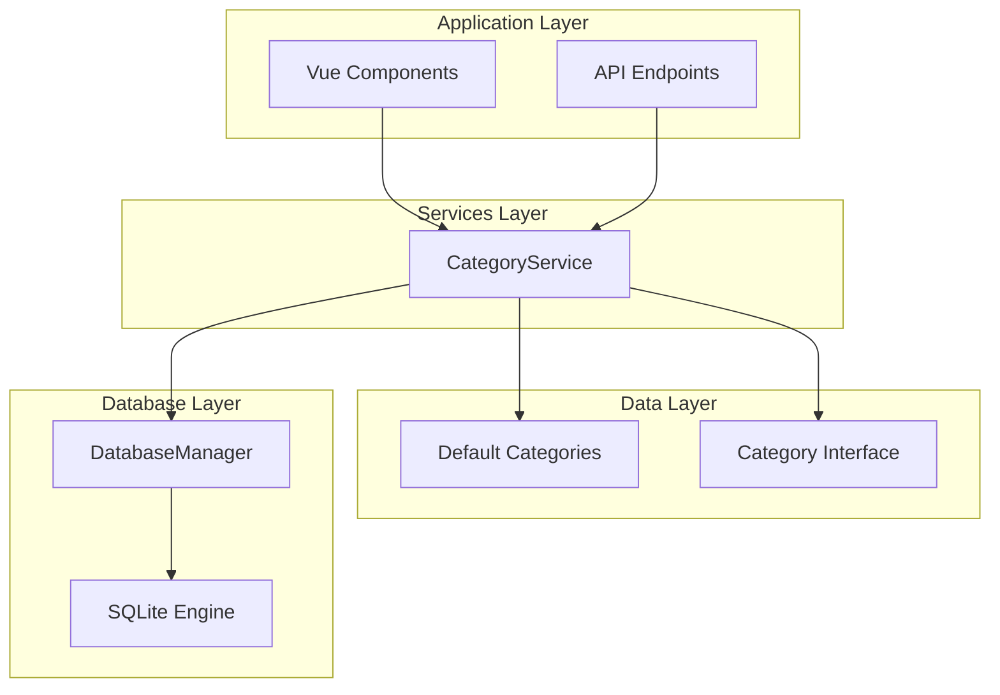
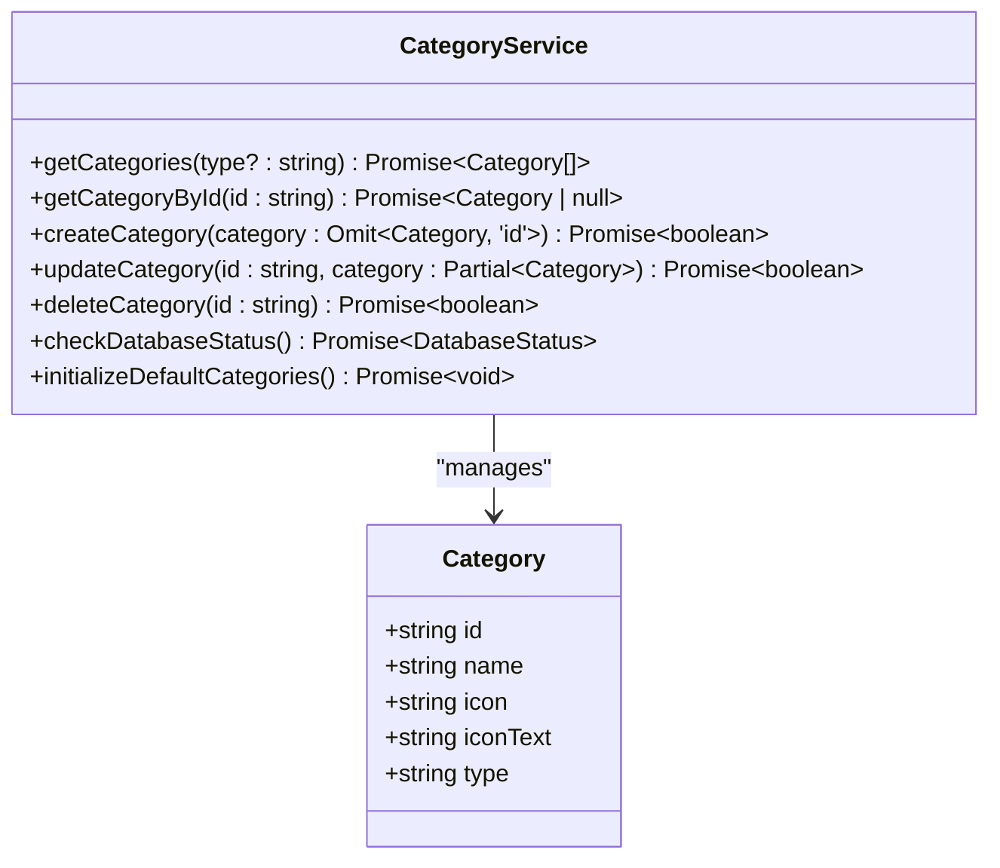
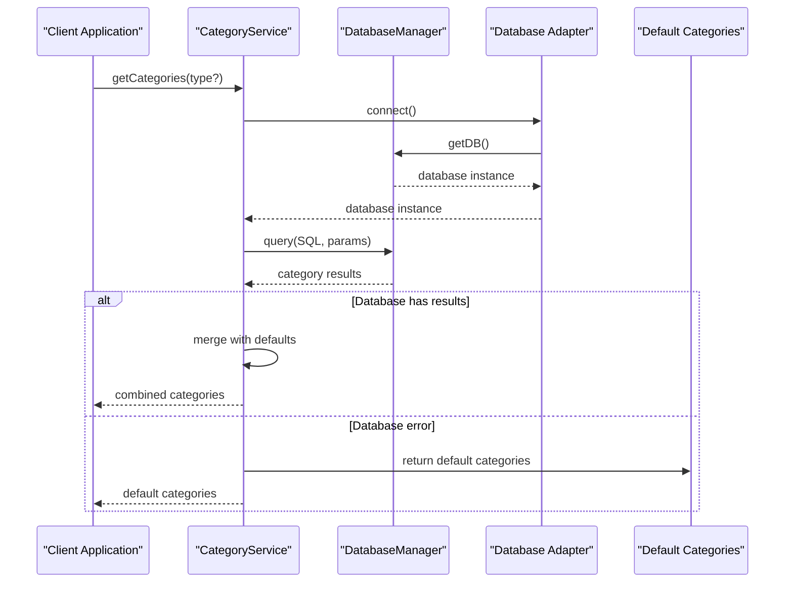
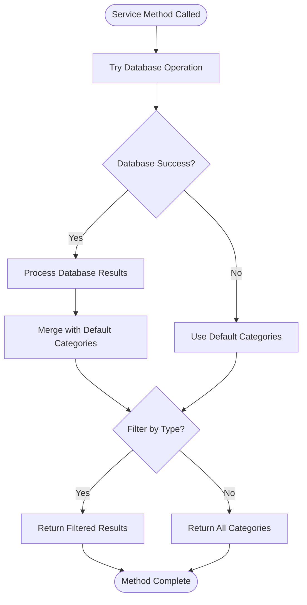
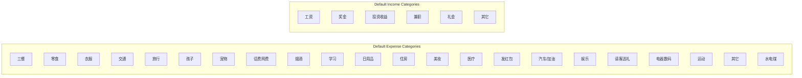
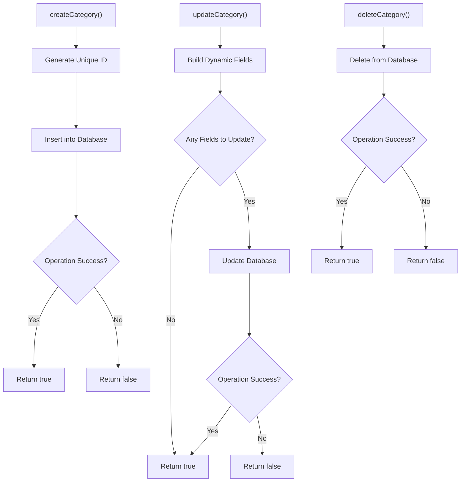
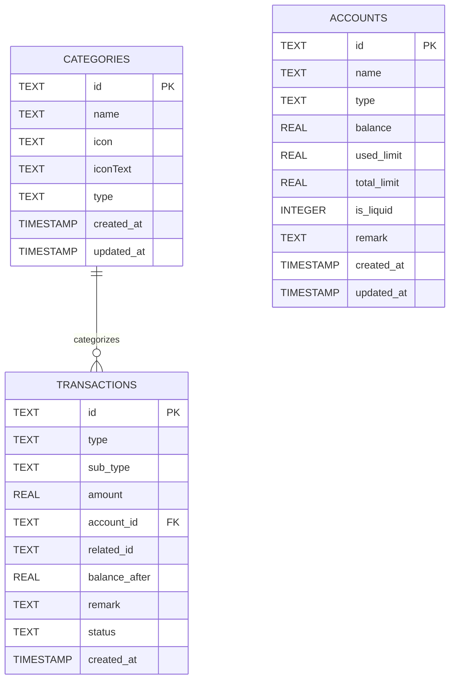
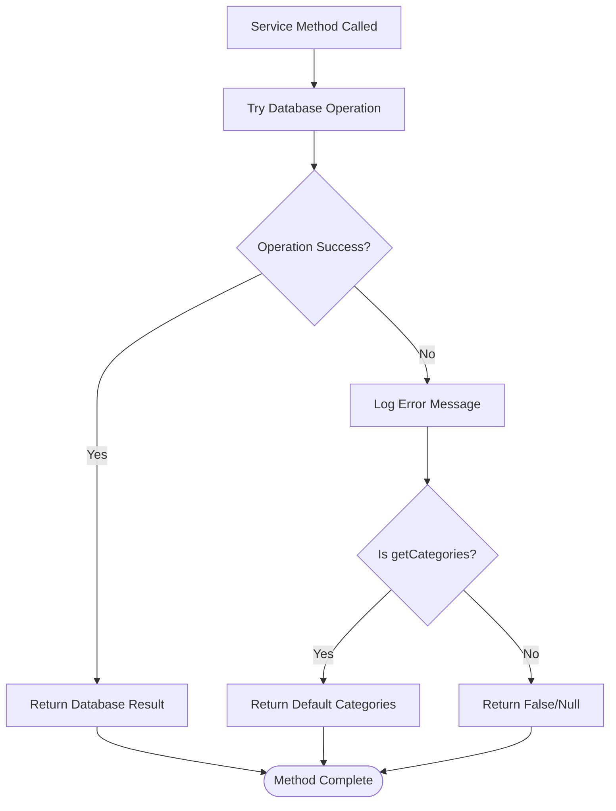
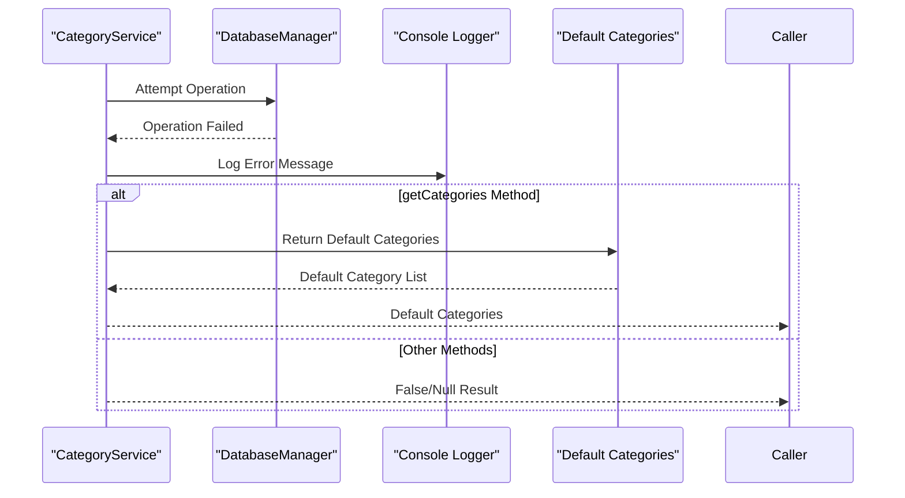
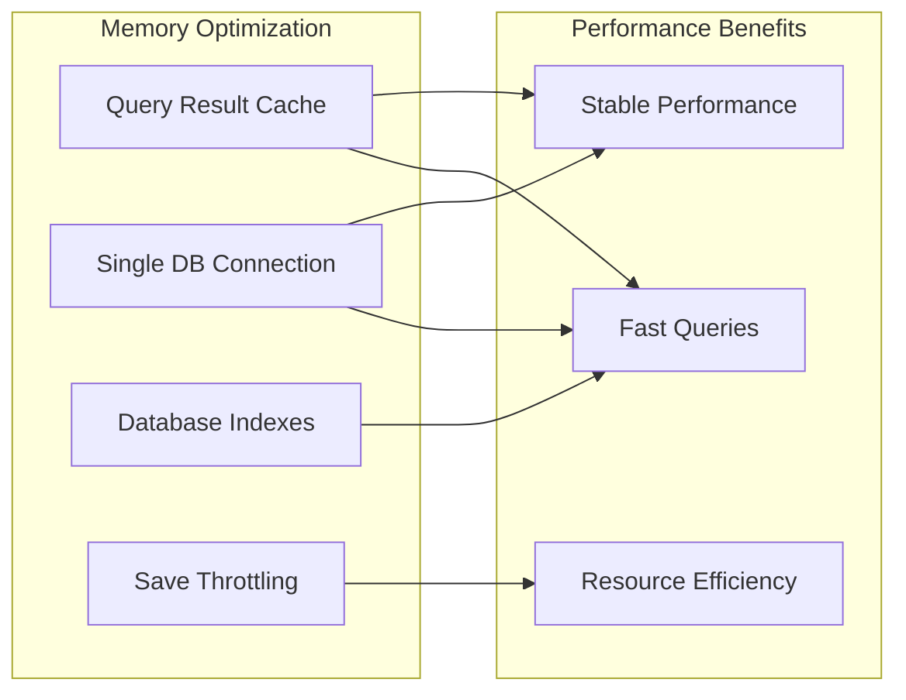

# Category Service API

<cite>
**Referenced Files in This Document**
- [categoryService.ts](file://src/services/categoryService.ts)
- [categories.ts](file://src/data/categories.ts)
- [index.js](file://src/database/index.js)
- [adapter.js](file://src/database/adapter.js)
- [AddExpensePage.vue](file://src/components/mobile/expense/AddExpensePage.vue)
- [ExpenseStats.vue](file://src/components/mobile/expense/ExpenseStats.vue)
- [CategoryItem.vue](file://src/components/mobile/expense/CategoryItem.vue)
</cite>

## Table of Contents
1. [Introduction](#introduction)
2. [Project Structure](#project-structure)
3. [Core Components](#core-components)
4. [Architecture Overview](#architecture-overview)
5. [Detailed Component Analysis](#detailed-component-analysis)
6. [API Reference](#api-reference)
7. [Database Schema](#database-schema)
8. [Error Handling and Fallback Mechanisms](#error-handling-and-fallback-mechanisms)
9. [Usage Examples](#usage-examples)
10. [Performance Considerations](#performance-considerations)
11. [Troubleshooting Guide](#troubleshooting-guide)
12. [Conclusion](#conclusion)

## Introduction

The Category Service API provides comprehensive category management capabilities for financial applications. It handles CRUD operations for expense and income categories, manages default category systems, and ensures robust fallback mechanisms when database operations fail. This service powers the categorization system used throughout the finance application, enabling users to organize their financial transactions effectively.

The service operates with a dual-layer approach: it maintains a persistent database layer for user-defined categories and a default category system that serves as a fallback mechanism. This design ensures that users always have access to meaningful categories even when database connectivity issues occur.

## Project Structure

The Category Service is organized within the application's modular architecture:



**Diagram sources**
- [categoryService.ts:1-260](file://src/services/categoryService.ts#L1-L260)
- [categories.ts:1-45](file://src/data/categories.ts#L1-L45)
- [index.js:1-935](file://src/database/index.js#L1-L935)

**Section sources**
- [categoryService.ts:1-260](file://src/services/categoryService.ts#L1-L260)
- [categories.ts:1-45](file://src/data/categories.ts#L1-L45)

## Core Components

### Category Interface

The Category interface defines the fundamental structure for all category objects:

```typescript
interface Category {
  id: string;
  name: string;
  icon: string;
  iconText: string;
  type: string;
}
```

Properties:
- `id`: Unique identifier for the category (auto-generated for new categories)
- `name`: Display name of the category
- `icon`: Icon class or identifier for UI representation
- `iconText`: Unicode character or emoji for visual display
- `type`: Category classification ('expense' or 'income')

### CategoryService Class

The CategoryService provides static methods for all CRUD operations:



**Diagram sources**
- [categoryService.ts:8-260](file://src/services/categoryService.ts#L8-L260)
- [categories.ts:1-7](file://src/data/categories.ts#L1-L7)

**Section sources**
- [categoryService.ts:8-260](file://src/services/categoryService.ts#L8-L260)
- [categories.ts:1-7](file://src/data/categories.ts#L1-L7)

## Architecture Overview

The Category Service follows a layered architecture pattern with clear separation of concerns:



**Diagram sources**
- [categoryService.ts:14-69](file://src/services/categoryService.ts#L14-L69)
- [index.js:56-190](file://src/database/index.js#L56-L190)
- [adapter.js:14-33](file://src/database/adapter.js#L14-L33)

The architecture ensures:
- **Fallback Mechanism**: Default categories serve as backup when database operations fail
- **Type Safety**: Strong typing through TypeScript interfaces
- **Database Abstraction**: Platform-independent database operations
- **Error Resilience**: Graceful degradation when database connectivity issues occur

## Detailed Component Analysis

### Database Integration

The Category Service integrates with a sophisticated database management system that supports both native and web platforms:



**Diagram sources**
- [categoryService.ts:14-69](file://src/services/categoryService.ts#L14-L69)

**Section sources**
- [categoryService.ts:14-69](file://src/services/categoryService.ts#L14-L69)
- [index.js:420-776](file://src/database/index.js#L420-L776)

### Default Category System

The application ships with predefined categories that serve as the foundation for all new installations:



**Diagram sources**
- [categories.ts:11-45](file://src/data/categories.ts#L11-L45)

**Section sources**
- [categories.ts:11-45](file://src/data/categories.ts#L11-L45)

### Category Management Operations

Each CRUD operation follows a consistent pattern with error handling and fallback mechanisms:



**Diagram sources**
- [categoryService.ts:101-175](file://src/services/categoryService.ts#L101-L175)

**Section sources**
- [categoryService.ts:101-175](file://src/services/categoryService.ts#L101-L175)

## API Reference

### Category Interface

| Property | Type | Description |
|----------|------|-------------|
| `id` | `string` | Unique category identifier |
| `name` | `string` | Display name for the category |
| `icon` | `string` | Icon class or identifier |
| `iconText` | `string` | Unicode character or emoji |
| `type` | `string` | Category type ('expense' or 'income') |

### CategoryService Methods

#### getCategories(type?: string)
**Description**: Retrieves all categories from the database, merging with default categories and applying optional type filtering.

**Parameters**:
- `type` (optional): Filter categories by type ('expense' or 'income')

**Returns**: `Promise<Category[]>` - Array of category objects

**Query Parameters**:
- `type`: String filter for category type

**Response Schema**: Array of Category objects with properties: id, name, icon, iconText, type

**Example Usage**:
```typescript
// Get all categories
const allCategories = await CategoryService.getCategories();

// Get only expense categories
const expenseCategories = await CategoryService.getCategories('expense');

// Get only income categories
const incomeCategories = await CategoryService.getCategories('income');
```

#### getCategoryById(id: string)
**Description**: Retrieves a specific category by its unique identifier.

**Parameters**:
- `id`: String category identifier

**Returns**: `Promise<Category | null>` - Category object or null if not found

**Response Schema**: Category object or null

**Example Usage**:
```typescript
const category = await CategoryService.getCategoryById('cat_1');
```

#### createCategory(category: Omit<Category, 'id'>)
**Description**: Creates a new category with automatic ID generation.

**Parameters**:
- `category`: Category object without id property

**Returns**: `Promise<boolean>` - True if successful, false otherwise

**Request Body Schema**: Category object with id omitted

**Example Usage**:
```typescript
const newCategory = {
  name: 'New Expense Category',
  icon: 'custom-icon',
  iconText: '💰',
  type: 'expense'
};

const success = await CategoryService.createCategory(newCategory);
```

#### updateCategory(id: string, category: Partial<Category>)
**Description**: Updates an existing category with partial field updates.

**Parameters**:
- `id`: String category identifier
- `category`: Partial category object with fields to update

**Returns**: `Promise<boolean>` - True if successful, false otherwise

**Request Body Schema**: Partial Category object

**Example Usage**:
```typescript
// Update only the name field
await CategoryService.updateCategory('cat_1', { name: 'Updated Name' });

// Update multiple fields
await CategoryService.updateCategory('cat_1', {
  name: 'Updated Name',
  icon: 'updated-icon'
});
```

#### deleteCategory(id: string)
**Description**: Removes a category from the database.

**Parameters**:
- `id`: String category identifier

**Returns**: `Promise<boolean>` - True if successful, false otherwise

**Example Usage**:
```typescript
const success = await CategoryService.deleteCategory('cat_1');
```

#### checkDatabaseStatus()
**Description**: Checks the current database connection status.

**Returns**: `Promise<{ connected: boolean; message: string }>` - Connection status and message

**Example Usage**:
```typescript
const status = await CategoryService.checkDatabaseStatus();
console.log(status.message);
```

#### initializeDefaultCategories()
**Description**: Initializes the database with default categories if none exist.

**Returns**: `Promise<void>`

**Example Usage**:
```typescript
await CategoryService.initializeDefaultCategories();
```

**Section sources**
- [categoryService.ts:14-175](file://src/services/categoryService.ts#L14-L175)

## Database Schema

The Category Service operates on a SQLite database with the following schema:



**Diagram sources**
- [index.js:662-688](file://src/database/index.js#L662-L688)

Key database features:
- **Auto-increment disabled**: Uses UUID-like string IDs for cross-platform compatibility
- **Timestamp tracking**: Automatic created_at and updated_at fields
- **Index optimization**: Dedicated indexes for performance
- **Cross-platform support**: Works on both native and web platforms

**Section sources**
- [index.js:662-688](file://src/database/index.js#L662-L688)

## Error Handling and Fallback Mechanisms

The Category Service implements comprehensive error handling with graceful fallback mechanisms:



**Diagram sources**
- [categoryService.ts:61-68](file://src/services/categoryService.ts#L61-L68)

### Fallback Behavior

The service provides intelligent fallback mechanisms:

1. **Database Failure**: When database operations fail, the service returns default categories
2. **Partial Updates**: Update operations return true even when no fields are provided
3. **Graceful Degradation**: All methods continue to function even with database connectivity issues
4. **Type Filtering**: Filtering works consistently whether using database or default categories

### Error Recovery Patterns



**Diagram sources**
- [categoryService.ts:61-68](file://src/services/categoryService.ts#L61-L68)

**Section sources**
- [categoryService.ts:61-68](file://src/services/categoryService.ts#L61-L68)

## Usage Examples

### Basic Category Operations

#### Getting Categories by Type
```typescript
// Get all expense categories
const expenseCategories = await CategoryService.getCategories('expense');

// Get all income categories  
const incomeCategories = await CategoryService.getCategories('income');

// Get all categories without filtering
const allCategories = await CategoryService.getCategories();
```

#### Creating Custom Expense Categories
```typescript
// Add a new custom expense category
const customExpense = {
  name: 'Freelance Work',
  icon: 'freelance-icon',
  iconText: '💼',
  type: 'expense'
};

const success = await CategoryService.createCategory(customExpense);
if (success) {
  console.log('Custom category created successfully');
}
```

#### Retrieving Income Categories
```typescript
// Load income categories for display
const incomeCategories = await CategoryService.getCategories('income');

// Render categories in UI
incomeCategories.forEach(category => {
  console.log(`${category.iconText} ${category.name}`);
});
```

#### Partial Category Updates
```typescript
// Update only the icon for a category
await CategoryService.updateCategory('cat_1', { 
  icon: 'updated-icon-class',
  iconText: '✨'
});

// Update category name only
await CategoryService.updateCategory('cat_1', { 
  name: 'Updated Category Name' 
});
```

### Database Initialization

#### Initializing Default Categories
```typescript
// Initialize default categories if database is empty
await CategoryService.initializeDefaultCategories();

// Verify initialization
const categories = await CategoryService.getCategories();
console.log(`Loaded ${categories.length} categories`);
```

#### Checking Database Status
```typescript
// Check if database is accessible
const status = await CategoryService.checkDatabaseStatus();
console.log(`Database status: ${status.message}`);

if (!status.connected) {
  console.warn('Using fallback mode with default categories');
}
```

### Integration with Vue Components

#### Expense Category Selection
```typescript
// In AddExpensePage.vue
const loadCategories = async () => {
  try {
    // Initialize default categories if needed
    await CategoryService.initializeDefaultCategories();
    
    // Load expense categories for selection
    const expenseCategories = await CategoryService.getCategories('expense');
    categories.value = expenseCategories;
  } catch (error) {
    console.error('Error loading categories:', error);
  }
};
```

#### Category Display Component
```typescript
// In CategoryItem.vue
<template>
  <div class="category-item" :class="{ 'selected': isSelected }">
    <div class="category-icon" :class="category.icon">
      {{ category.iconText }}
    </div>
    <div class="category-name">{{ category.name }}</div>
  </div>
</template>
```

**Section sources**
- [AddExpensePage.vue:203-213](file://src/components/mobile/expense/AddExpensePage.vue#L203-L213)
- [ExpenseStats.vue:261-263](file://src/components/mobile/expense/ExpenseStats.vue#L261-L263)
- [CategoryItem.vue:1-69](file://src/components/mobile/expense/CategoryItem.vue#L1-L69)

## Performance Considerations

### Database Optimization Features

The Category Service leverages several performance optimization strategies:

1. **Connection Pooling**: Single database connection reused throughout the application lifecycle
2. **Query Caching**: Results cached to avoid repeated database queries
3. **Index Optimization**: Dedicated indexes on frequently queried columns
4. **Batch Operations**: Efficient batch processing for bulk operations
5. **Platform-Specific Optimizations**: Native platform optimizations for mobile environments

### Memory Management



**Diagram sources**
- [index.js:13-18](file://src/database/index.js#L13-L18)
- [index.js:413-415](file://src/database/index.js#L413-L415)

### Best Practices

- **Lazy Loading**: Categories are loaded only when needed
- **Error Prevention**: Comprehensive error handling prevents application crashes
- **Graceful Degradation**: Service continues operating with reduced functionality during failures
- **Type Safety**: Full TypeScript support ensures compile-time error detection

**Section sources**
- [index.js:13-18](file://src/database/index.js#L13-L18)
- [index.js:413-415](file://src/database/index.js#L413-L415)

## Troubleshooting Guide

### Common Issues and Solutions

#### Database Connection Problems
**Symptoms**: Categories not loading, service returns default categories
**Solutions**:
1. Check database initialization status
2. Verify database file accessibility
3. Review console error messages
4. Test database connectivity separately

#### Category Creation Failures
**Symptoms**: New categories not appearing in lists
**Solutions**:
1. Verify unique ID generation
2. Check database constraints
3. Review transaction logs
4. Confirm database permissions

#### Performance Issues
**Symptoms**: Slow category loading, UI lag
**Solutions**:
1. Enable query caching
2. Check database indexing
3. Monitor memory usage
4. Review network connectivity (for web builds)

### Debugging Techniques

#### Enabling Debug Mode
```typescript
// Enable detailed logging in database manager
const debugConfig = {
  DEBUG: true,
  SAVE_THROTTLE_MS: 1000
};
```

#### Monitoring Database Operations
```typescript
// Check database status
const status = await CategoryService.checkDatabaseStatus();
console.log('Database Status:', status);

// Monitor category operations
const categories = await CategoryService.getCategories('expense');
console.log('Categories Loaded:', categories.length);
```

#### Error Logging Patterns
The service implements consistent error logging:
- Database operation failures are logged with detailed error messages
- Fallback mechanisms are clearly indicated in logs
- Operation timing and results are tracked for performance monitoring

**Section sources**
- [categoryService.ts:61-68](file://src/services/categoryService.ts#L61-L68)
- [index.js:184-189](file://src/database/index.js#L184-L189)

## Conclusion

The Category Service API provides a robust, scalable solution for financial category management with comprehensive error handling and fallback mechanisms. Its dual-layer architecture ensures reliability across different deployment environments while maintaining excellent performance characteristics.

Key strengths include:
- **Reliability**: Graceful degradation ensures continuous operation
- **Flexibility**: Supports both default and custom categories
- **Performance**: Optimized database operations with caching
- **Type Safety**: Full TypeScript support for development confidence
- **Cross-Platform**: Consistent behavior across native and web platforms

The service successfully balances functionality with resilience, making it an essential component of the financial application's categorization system. Its comprehensive error handling and fallback mechanisms ensure that users always have access to meaningful categories regardless of database connectivity status.