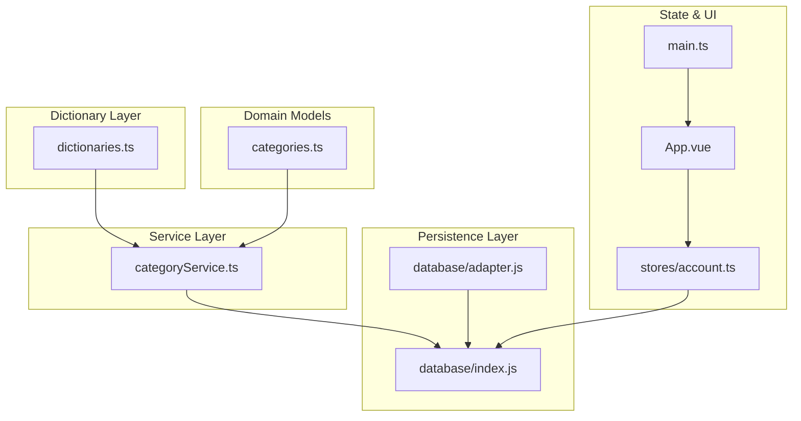
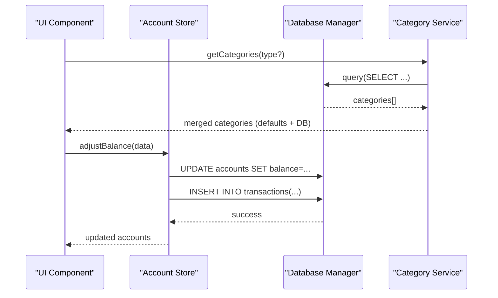
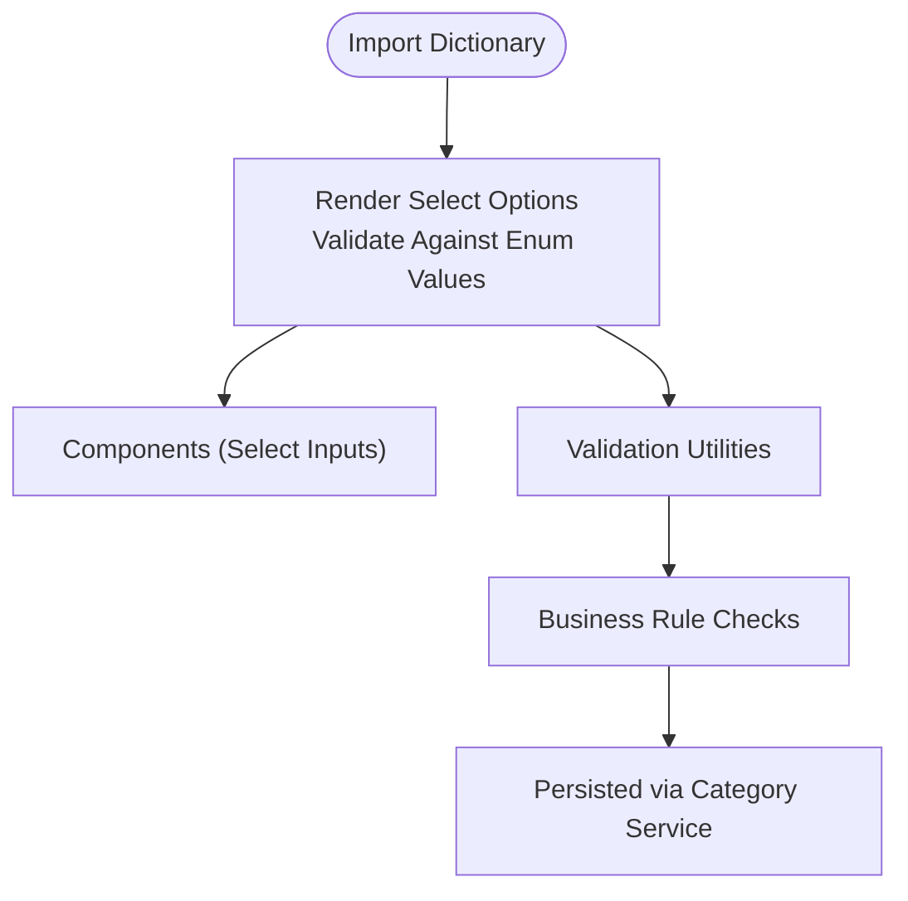
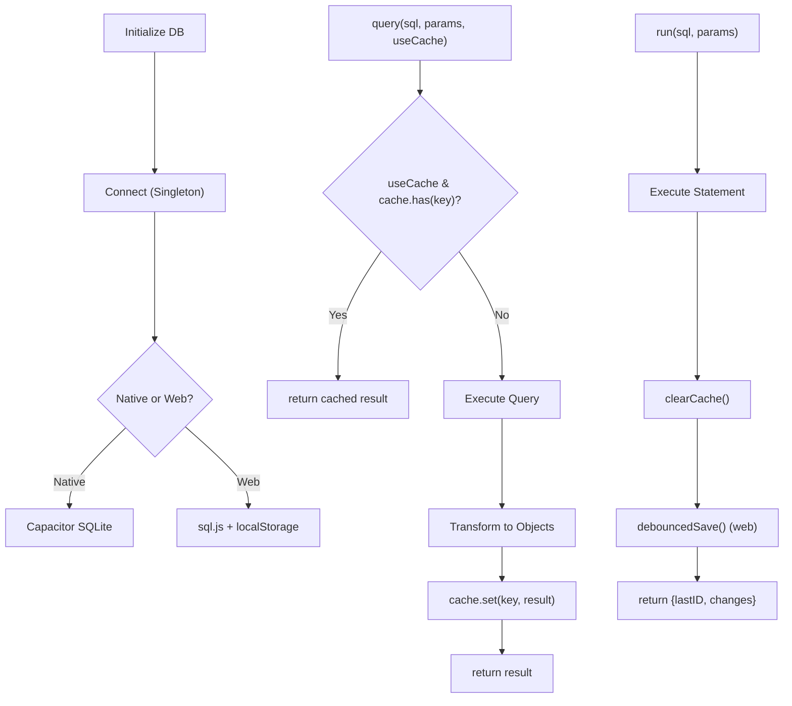
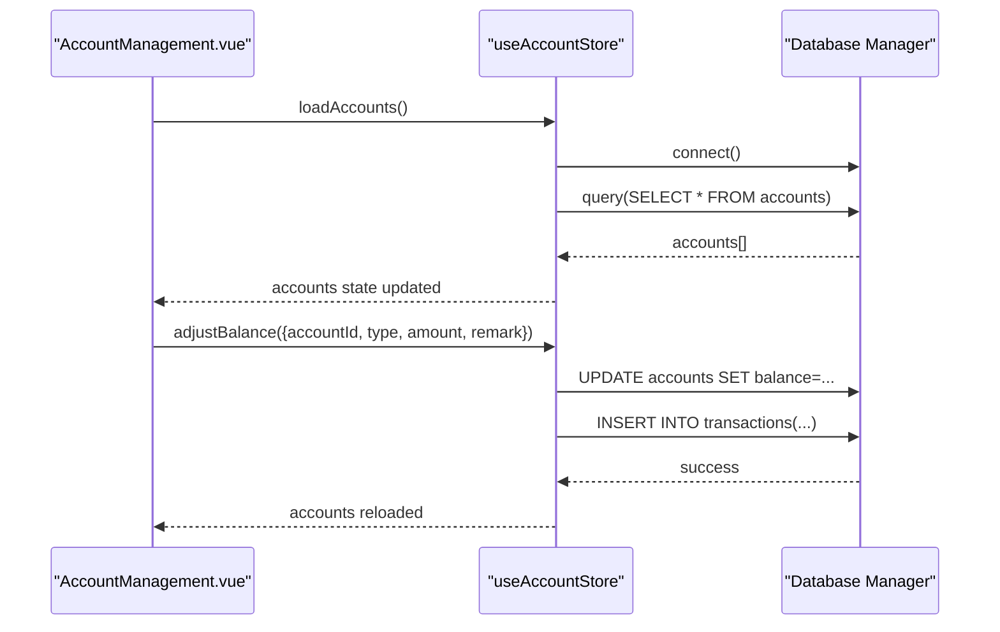
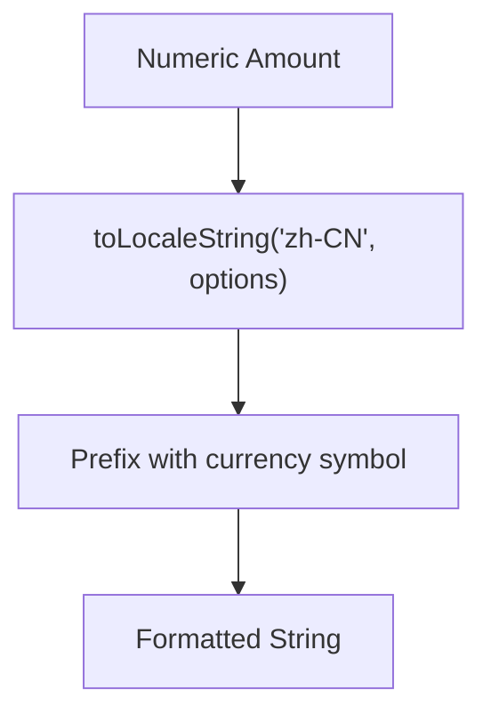
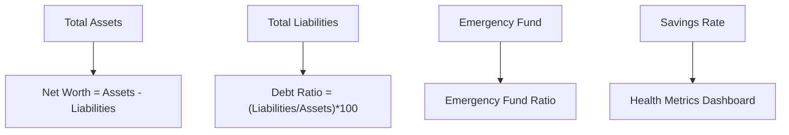
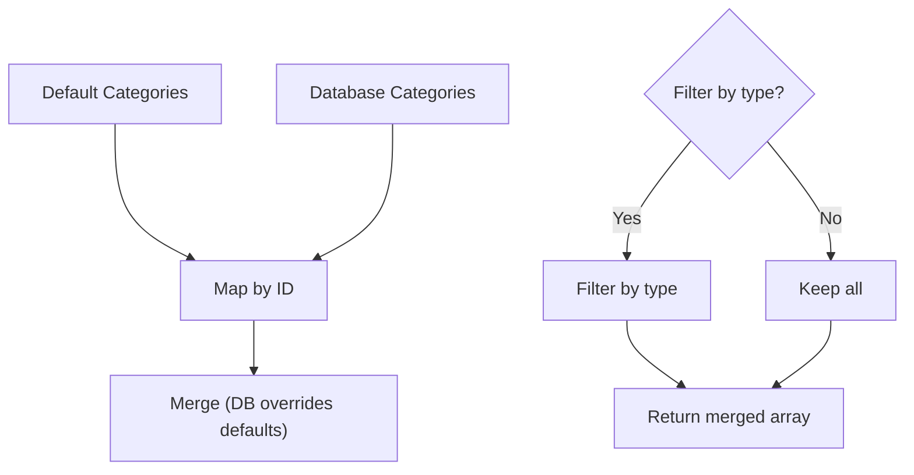
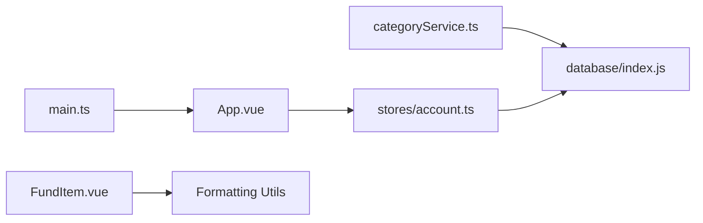

# Data Services API

<cite>
**Referenced Files in This Document**
- [dictionaries.ts](file://src/utils/dictionaries.ts)
- [categoryService.ts](file://src/services/categoryService.ts)
- [categories.ts](file://src/data/categories.ts)
- [index.js](file://src/database/index.js)
- [adapter.js](file://src/database/adapter.js)
- [account.ts](file://src/stores/account.ts)
- [AccountManagement.vue](file://src/components/mobile/account/AccountManagement.vue)
- [ExpensePage.vue](file://src/components/mobile/expense/ExpensePage.vue)
- [AddExpensePage.vue](file://src/components/mobile/expense/AddExpensePage.vue)
- [FundItem.vue](file://src/components/mobile/account/FundItem.vue)
- [FinancialDashboard.vue](file://src/components/mobile/financial/FinancialDashboard.vue)
- [FinancialSandbox.vue](file://src/components/mobile/financial/FinancialSandbox.vue)
- [main.ts](file://src/main.ts)
- [App.vue](file://src/App.vue)
- [package.json](file://package.json)
</cite>

## Table of Contents
1. [Introduction](#introduction)
2. [Project Structure](#project-structure)
3. [Core Components](#core-components)
4. [Architecture Overview](#architecture-overview)
5. [Detailed Component Analysis](#detailed-component-analysis)
6. [Dependency Analysis](#dependency-analysis)
7. [Performance Considerations](#performance-considerations)
8. [Troubleshooting Guide](#troubleshooting-guide)
9. [Conclusion](#conclusion)

## Introduction
This document describes the Data Services API that powers utility functions, data transformations, and business logic operations across the finance application. It covers dictionary services, data validation utilities, formatting functions, financial calculation helpers, currency conversion, statistical computations, transformation pipelines, caching mechanisms, performance optimizations, internationalization support, localization functions, and data export/import capabilities. The guide also includes practical examples of common data manipulation tasks, validation patterns, and utility function usage across the application.

## Project Structure
The Data Services layer is organized around three primary areas:
- Dictionary and lookup services: centralized configuration for domain-specific enumerations
- Database abstraction and persistence: cross-platform SQLite management with caching and performance optimizations
- Business logic stores and components: transformation pipelines, formatting utilities, and UI-driven data operations



**Diagram sources**
- [dictionaries.ts:1-90](file://src/utils/dictionaries.ts#L1-L90)
- [categories.ts:1-45](file://src/data/categories.ts#L1-L45)
- [categoryService.ts:1-260](file://src/services/categoryService.ts#L1-L260)
- [index.js:1-935](file://src/database/index.js#L1-L935)
- [adapter.js:1-34](file://src/database/adapter.js#L1-L34)
- [account.ts:1-265](file://src/stores/account.ts#L1-L265)
- [App.vue:1-195](file://src/App.vue#L1-L195)
- [main.ts:1-16](file://src/main.ts#L1-L16)

**Section sources**
- [dictionaries.ts:1-90](file://src/utils/dictionaries.ts#L1-L90)
- [categories.ts:1-45](file://src/data/categories.ts#L1-L45)
- [categoryService.ts:1-260](file://src/services/categoryService.ts#L1-L260)
- [index.js:1-935](file://src/database/index.js#L1-L935)
- [adapter.js:1-34](file://src/database/adapter.js#L1-L34)
- [account.ts:1-265](file://src/stores/account.ts#L1-L265)
- [App.vue:1-195](file://src/App.vue#L1-L195)
- [main.ts:1-16](file://src/main.ts#L1-L16)

## Core Components
- Dictionary services: centralized lookup collections for account types, liability types, repayment methods, goal types, asset types, and transaction metadata
- Category service: CRUD operations for categories with fallback to default categories and database initialization
- Database manager: cross-platform SQLite abstraction with caching, throttled persistence, batch operations, and transaction support
- Store actions: account operations (add, update, delete, balance adjustments, transfers) with transactional guarantees
- Formatting utilities: localized currency formatting and computed statistics in UI components

**Section sources**
- [dictionaries.ts:6-90](file://src/utils/dictionaries.ts#L6-L90)
- [categoryService.ts:8-260](file://src/services/categoryService.ts#L8-L260)
- [index.js:21-416](file://src/database/index.js#L21-L416)
- [account.ts:34-262](file://src/stores/account.ts#L34-L262)

## Architecture Overview
The Data Services architecture ensures separation of concerns:
- Dictionary services provide immutable configuration for UI and validation
- Category service orchestrates domain data with robust fallbacks
- Database manager abstracts platform differences and optimizes performance
- Stores encapsulate business logic and enforce data consistency
- Components consume formatted data and present localized outputs



**Diagram sources**
- [categoryService.ts:14-69](file://src/services/categoryService.ts#L14-L69)
- [index.js:199-264](file://src/database/index.js#L199-L264)
- [account.ts:145-177](file://src/stores/account.ts#L145-L177)

## Detailed Component Analysis

### Dictionary Services
- Purpose: Centralized enumeration definitions for consistent UI rendering and validation
- Coverage: account types, liability types, repayment methods/statuses, goal types/statuses, asset types, transaction types, and adjustment types
- Usage pattern: Import specific arrays for select inputs and option lists



**Section sources**
- [dictionaries.ts:6-90](file://src/utils/dictionaries.ts#L6-L90)

### Category Management Service
- Purpose: Unified CRUD for categories with default fallback and initialization
- Key operations:
  - getCategories(type?): merges defaults with DB entries, filters by type, handles errors gracefully
  - getCategoryById(id): fetch single category with error logging
  - create/update/delete: parameterized queries with safe field updates
  - checkDatabaseStatus(): connectivity verification with fallback messaging
  - initializeDefaultCategories(): inserts predefined categories if empty

```mermaid
classDiagram
class CategoryService {
+getCategories(type?) Promise~Category[]~
+getCategoryById(id) Promise~Category|null~
+createCategory(category) Promise~boolean~
+updateCategory(id, partial) Promise~boolean~
+deleteCategory(id) Promise~boolean~
+checkDatabaseStatus() Promise~{connected,message}~
+initializeDefaultCategories() Promise~void~
}
class DatabaseManager {
+connect() Promise
+query(sql, params, useCache) Promise~any[]~
+run(sql, params) Promise~{lastID,changes}~
+batch(stmts) Promise~any[]~
+executeTransaction(stmts) Promise
+clearCache() void
}
CategoryService --> DatabaseManager : "uses"
```

**Diagram sources**
- [categoryService.ts:8-260](file://src/services/categoryService.ts#L8-L260)
- [index.js:21-416](file://src/database/index.js#L21-L416)

**Section sources**
- [categoryService.ts:14-69](file://src/services/categoryService.ts#L14-L69)
- [categoryService.ts:76-94](file://src/services/categoryService.ts#L76-L94)
- [categoryService.ts:101-175](file://src/services/categoryService.ts#L101-L175)
- [categoryService.ts:181-194](file://src/services/categoryService.ts#L181-L194)
- [categoryService.ts:199-260](file://src/services/categoryService.ts#L199-L260)

### Database Abstraction and Caching
- Cross-platform SQLite:
  - Native (Capacitor): uses @capacitor-community/sqlite
  - Web (sql.js): in-memory DB with throttled localStorage persistence
- Performance features:
  - Single connection reuse with mutex-like guard
  - Query result caching with cache key generation
  - Debounced save for web persistence
  - Batch execution and transaction support
  - Index creation for performance
- Error handling: structured error messages with platform-aware logs



**Diagram sources**
- [index.js:56-190](file://src/database/index.js#L56-L190)
- [index.js:199-264](file://src/database/index.js#L199-L264)
- [index.js:272-309](file://src/database/index.js#L272-L309)
- [index.js:316-347](file://src/database/index.js#L316-L347)
- [index.js:379-408](file://src/database/index.js#L379-L408)

**Section sources**
- [index.js:21-416](file://src/database/index.js#L21-L416)
- [adapter.js:14-33](file://src/database/adapter.js#L14-L33)

### Store Actions and Financial Calculations
- Account store actions:
  - loadAccounts: fetches all accounts and populates state
  - addAccount: generates ID, inserts record, reloads
  - updateAccount: updates fields safely
  - deleteAccount: removes record
  - adjustBalance: validates balance, updates account, records transaction
  - transfer: multi-step operation with BEGIN/COMMIT/ROLLBACK
- Computed statistics in UI:
  - AccountManagement.vue computes totals, counts, ratios, and displays formatted currency



**Diagram sources**
- [account.ts:38-53](file://src/stores/account.ts#L38-L53)
- [account.ts:59-100](file://src/stores/account.ts#L59-L100)
- [account.ts:145-177](file://src/stores/account.ts#L145-L177)
- [AccountManagement.vue:195-233](file://src/components/mobile/account/AccountManagement.vue#L195-L233)

**Section sources**
- [account.ts:34-262](file://src/stores/account.ts#L34-L262)
- [AccountManagement.vue:195-275](file://src/components/mobile/account/AccountManagement.vue#L195-L275)

### Formatting Functions and Localization
- Currency formatting:
  - FundItem.vue: localized currency display using locale-aware formatting
  - AccountManagement.vue: computed values formatted for presentation
- Localization functions:
  - Application bootstraps Element Plus and sets up platform-specific keyboard behavior
  - Date utilities (date-fns) available for date operations



**Section sources**
- [FundItem.vue:19-21](file://src/components/mobile/account/FundItem.vue#L19-L21)
- [AccountManagement.vue:9](file://src/components/mobile/account/AccountManagement.vue#L9-L9)
- [main.ts:1-16](file://src/main.ts#L1-L16)
- [package.json:26](file://package.json#L26)

### Statistical Computations and Financial Dashboards
- FinancialDashboard.vue: presents financial health metrics (liabilities-income ratio, emergency fund ratio, asset-liability ratio, savings rate)
- FinancialSandbox.vue: simulation parameters and chart rendering for financial scenarios



**Section sources**
- [FinancialDashboard.vue:1-38](file://src/components/mobile/financial/FinancialDashboard.vue#L1-L38)
- [FinancialSandbox.vue:258-362](file://src/components/mobile/financial/FinancialSandbox.vue#L258-L362)

### Data Transformation Pipelines
- Category merging pipeline:
  - Merge default categories with database categories
  - Deduplicate by ID
  - Filter by type when requested
- Account aggregation pipeline:
  - Compute totals, counts, and ratios
  - Format currency for display



**Section sources**
- [categoryService.ts:38-60](file://src/services/categoryService.ts#L38-L60)
- [AccountManagement.vue:195-233](file://src/components/mobile/account/AccountManagement.vue#L195-L233)

### Export/Import and Data Lifecycle
- Export/import:
  - Web platform persists SQLite state to localStorage with throttled save
  - Native platform uses Capacitor SQLite storage
- Data lifecycle:
  - Initialization creates tables and indexes
  - Transactions ensure atomicity for multi-step operations
  - Cache invalidation after writes

**Section sources**
- [index.js:396-408](file://src/database/index.js#L396-L408)
- [index.js:420-776](file://src/database/index.js#L420-L776)
- [index.js:354-374](file://src/database/index.js#L354-L374)

## Dependency Analysis
- External libraries:
  - @capacitor-community/sqlite, sql.js for cross-platform SQLite
  - date-fns for date operations
  - element-plus for UI components
  - pinia for state management
- Internal dependencies:
  - categoryService depends on database module
  - stores depend on database module
  - components depend on stores and formatting utilities



**Diagram sources**
- [categoryService.ts:1](file://src/services/categoryService.ts#L1)
- [index.js:1](file://src/database/index.js#L1)
- [account.ts:1](file://src/stores/account.ts#L1)
- [App.vue:1](file://src/App.vue#L1)
- [main.ts:1](file://src/main.ts#L1)
- [FundItem.vue:19-21](file://src/components/mobile/account/FundItem.vue#L19-L21)

**Section sources**
- [package.json:19-36](file://package.json#L19-L36)
- [categoryService.ts:1](file://src/services/categoryService.ts#L1)
- [account.ts:6](file://src/stores/account.ts#L6)
- [index.js:8-10](file://src/database/index.js#L8-L10)

## Performance Considerations
- Connection pooling and reuse: avoid repeated connections; guard concurrent attempts
- Query caching: enable cache for read-heavy queries; invalidate on write
- Batch operations: group multiple writes to reduce round-trips
- Throttled persistence: debounce localStorage saves on web
- Indexes: pre-created indexes on foreign keys and frequently filtered columns
- Transactions: wrap multi-step operations to maintain consistency and improve throughput

[No sources needed since this section provides general guidance]

## Troubleshooting Guide
- Database connectivity:
  - Use checkDatabaseStatus() to detect connection failures and fallback messaging
- Transaction failures:
  - Ensure proper rollback on errors; verify transaction boundaries
- Cache inconsistencies:
  - Call clearCache() after writes; avoid stale reads
- Platform-specific issues:
  - Capacitor SQLite vs sql.js differences; verify platform detection

**Section sources**
- [categoryService.ts:181-194](file://src/services/categoryService.ts#L181-L194)
- [index.js:354-374](file://src/database/index.js#L354-L374)
- [index.js:413-415](file://src/database/index.js#L413-L415)

## Conclusion
The Data Services API provides a robust, cross-platform foundation for managing dictionaries, categories, persistence, and financial computations. Its layered design promotes maintainability, performance, and reliability across platforms. By leveraging caching, transactions, and consistent formatting utilities, the system supports scalable financial data operations and a polished user experience.