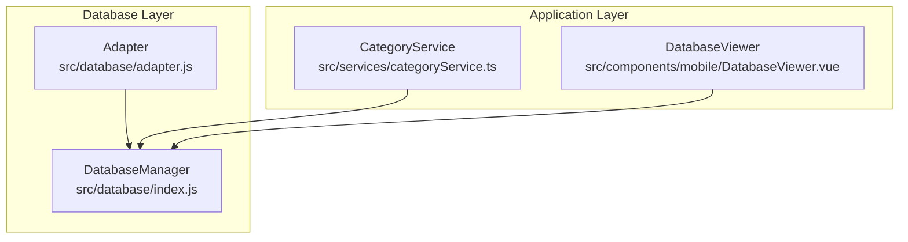
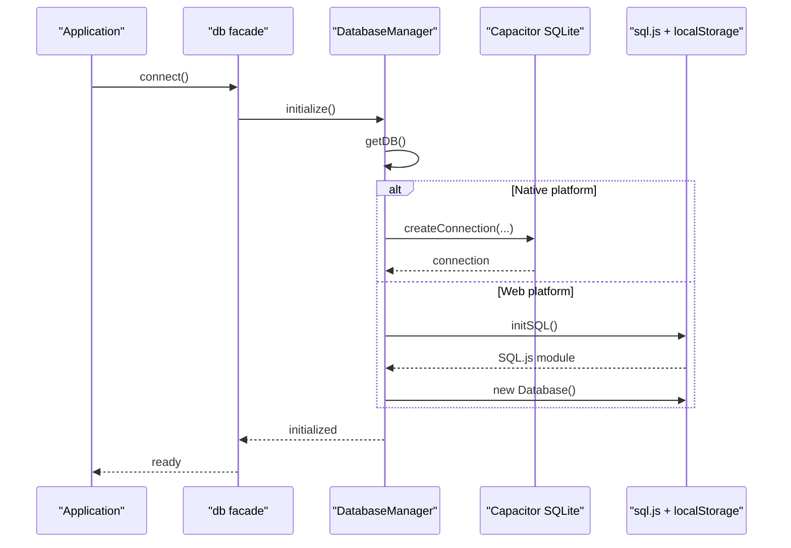
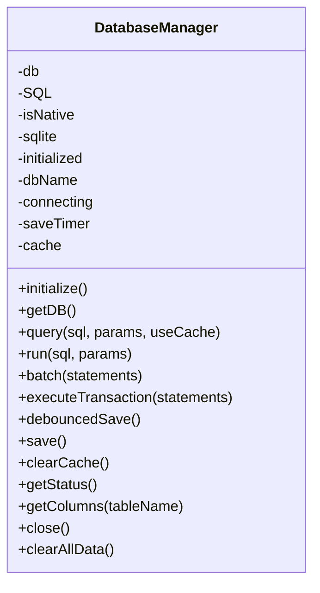
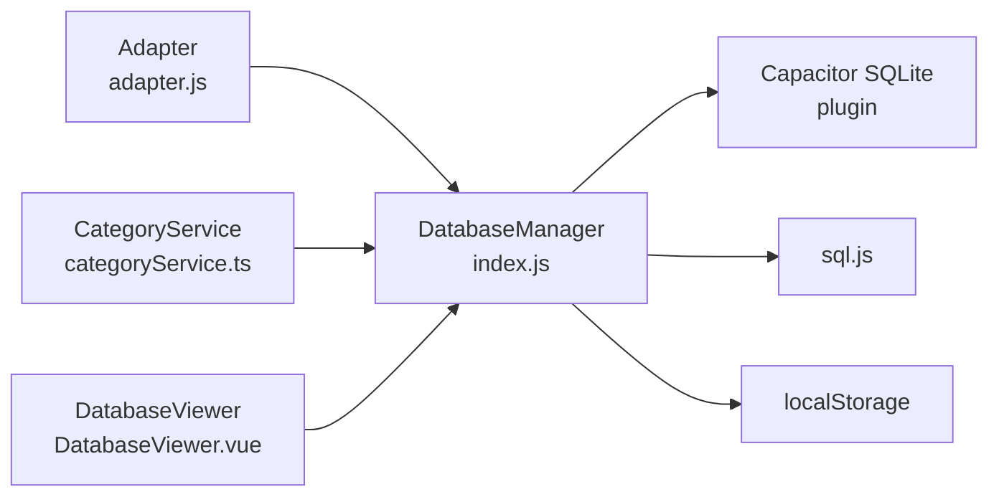

# Database Service API

<cite>
**Referenced Files in This Document**
- [index.js](file://src/database/index.js)
- [adapter.js](file://src/database/adapter.js)
- [categoryService.ts](file://src/services/categoryService.ts)
- [DatabaseViewer.vue](file://src/components/mobile/DatabaseViewer.vue)
</cite>

## Table of Contents
1. [Introduction](#introduction)
2. [Project Structure](#project-structure)
3. [Core Components](#core-components)
4. [Architecture Overview](#architecture-overview)
5. [Detailed Component Analysis](#detailed-component-analysis)
6. [Dependency Analysis](#dependency-analysis)
7. [Performance Considerations](#performance-considerations)
8. [Troubleshooting Guide](#troubleshooting-guide)
9. [Conclusion](#conclusion)
10. [Appendices](#appendices)

## Introduction
This document describes the Database Service API that provides data persistence and retrieval for the finance application. It covers the database adapter interface, connection management, query execution methods, SQL operation wrappers for SELECT, INSERT, UPDATE, DELETE, transaction support, schema management, migration procedures, data integrity constraints, error handling, connection pooling, fallback mechanisms, complex queries, batch operations, backup/restore procedures, and performance optimization strategies.

## Project Structure
The database service is implemented as a single-file module with a companion adapter and is consumed by services and UI components.

**Diagram sources**
- [index.js:1-935](file://src/database/index.js#L1-L935)
- [adapter.js:1-34](file://src/database/adapter.js#L1-L34)
- [categoryService.ts:1-260](file://src/services/categoryService.ts#L1-L260)
- [DatabaseViewer.vue:1-480](file://src/components/mobile/DatabaseViewer.vue#L1-L480)

**Section sources**
- [index.js:1-935](file://src/database/index.js#L1-L935)
- [adapter.js:1-34](file://src/database/adapter.js#L1-L34)
- [categoryService.ts:1-260](file://src/services/categoryService.ts#L1-L260)
- [DatabaseViewer.vue:1-480](file://src/components/mobile/DatabaseViewer.vue#L1-L480)

## Core Components
- DatabaseManager: Central class managing database connections, initialization, queries, runs, batches, transactions, and persistence.
- Adapter: Platform abstraction that selects the correct database implementation (Capacitor SQLite for native, sql.js for web).
- Public db facade: Exported convenience methods for connect, query, run, batch, executeTransaction, close, getStatus, clearAllData.

Key responsibilities:
- Single connection management with platform-aware initialization.
- Parameterized SQL execution with position-based parameters.
- Query caching for read-heavy workloads.
- Batch execution and transaction support.
- Schema initialization and migrations.
- Persistence to localStorage for web environments.
- Status reporting and cleanup.

**Section sources**
- [index.js:21-935](file://src/database/index.js#L21-L935)
- [adapter.js:14-34](file://src/database/adapter.js#L14-L34)

## Architecture Overview
The service abstracts two runtime modes:
- Native mode: Uses Capacitor SQLite plugin for robust, persistent storage.
- Web mode: Uses sql.js with localStorage persistence and throttled saves.

**Diagram sources**
- [index.js:56-190](file://src/database/index.js#L56-L190)

## Detailed Component Analysis

### DatabaseManager
The central class encapsulating all database operations.

- Initialization and connection management
  - Ensures a single connection instance.
  - Prevents concurrent connection attempts.
  - Detects native vs web platform and initializes accordingly.
  - Handles connection retrieval, creation, opening, and closing.

- Query execution
  - query(sql, params, useCache): Executes SELECT-like queries with parameter binding and optional caching.
  - run(sql, params): Executes non-query statements (INSERT/UPDATE/DELETE) with parameter binding.
  - batch(statements): Executes multiple statements atomically in web/native contexts.
  - executeTransaction(statements): Executes a set of statements in a transaction.

- Schema management and migrations
  - initialize(): Creates tables and indexes, performs column additions for existing users.
  - getColumns(tableName): Utility to introspect table schema for migrations.

- Persistence and caching
  - debouncedSave(): Throttles localStorage writes in web mode.
  - save(): Persists database export to localStorage.
  - clearCache(): Clears query cache.
  - getStatus(): Reports connection, initialization, and cache state.

- Data integrity constraints
  - Foreign keys defined in schema for referential integrity.
  - Transactions used for atomic operations.

- Backup and restore
  - Web mode: Database exported to localStorage buffer and reloaded on startup.
  - Native mode: Uses Capacitor SQLite persistence.

- Error handling
  - Centralized try/catch blocks around SQL operations.
  - Throws descriptive errors with original messages preserved.

- Performance features
  - Query cache keyed by SQL + params.
  - Indexes created on frequently queried columns.
  - Debounced persistence to reduce write overhead.

**Diagram sources**
- [index.js:21-891](file://src/database/index.js#L21-L891)

**Section sources**
- [index.js:21-891](file://src/database/index.js#L21-L891)

### Public db Facade
Exports a simple API surface for consumers.

- connect(): Initializes the database.
- query(sql, params, useCache): Executes SELECT-like queries.
- run(sql, params): Executes INSERT/UPDATE/DELETE.
- batch(statements): Executes multiple statements.
- executeTransaction(statements): Executes statements in a transaction.
- close(): Closes the database connection.
- getStatus(): Returns internal status.
- clearAllData(): Clears all tables in a transaction.

**Section sources**
- [index.js:896-935](file://src/database/index.js#L896-L935)

### Adapter
Provides platform detection and database selection.

- getDatabase(): Returns the database implementation based on Capacitor.isNativePlatform().
- initializeDatabase(): Connects and initializes the database.

**Section sources**
- [adapter.js:14-34](file://src/database/adapter.js#L14-L34)

### Usage in Services and UI
- CategoryService: Demonstrates typical CRUD operations using db.query and db.run.
- DatabaseViewer: UI component that queries tables, displays data, checks storage status, and clears data.

**Section sources**
- [categoryService.ts:14-260](file://src/services/categoryService.ts#L14-L260)
- [DatabaseViewer.vue:142-237](file://src/components/mobile/DatabaseViewer.vue#L142-L237)

## Dependency Analysis
- Internal dependencies
  - DatabaseManager depends on Capacitor SQLite plugin for native mode and sql.js for web mode.
  - Uses localStorage for persistence in web mode.
- External dependencies
  - @capacitor/core for platform detection.
  - @capacitor-community/sqlite for native SQLite connectivity.
  - sql.js for web SQLite emulation.

**Diagram sources**
- [index.js:8-10](file://src/database/index.js#L8-L10)
- [adapter.js:5-6](file://src/database/adapter.js#L5-L6)
- [categoryService.ts:1](file://src/services/categoryService.ts#L1)
- [DatabaseViewer.vue:103](file://src/components/mobile/DatabaseViewer.vue#L103)

**Section sources**
- [index.js:8-10](file://src/database/index.js#L8-L10)
- [adapter.js:5-6](file://src/database/adapter.js#L5-L6)
- [categoryService.ts:1](file://src/services/categoryService.ts#L1)
- [DatabaseViewer.vue:103](file://src/components/mobile/DatabaseViewer.vue#L103)

## Performance Considerations
- Query caching: Enabled via useCache flag in query() to avoid repeated SELECTs.
- Indexes: Created on frequently filtered/sorted columns to speed up reads.
- Debounced persistence: Web mode persists database exports with throttling to reduce IO.
- Batch operations: Use batch() to minimize round-trips for multiple statements.
- Transactions: Use executeTransaction() or manual BEGIN/COMMIT for atomicity and reduced overhead.
- Parameter binding: Position-based parameters prevent SQL injection and improve plan reuse.

[No sources needed since this section provides general guidance]

## Troubleshooting Guide
Common issues and remedies:
- Connection failures
  - Verify Capacitor SQLite plugin availability in native builds.
  - Ensure sql.js initialization succeeds in web builds.
- Query errors
  - Confirm parameter arrays match placeholders.
  - Check SQL syntax and table/column names.
- Persistence issues (web)
  - Confirm localStorage availability and quota limits.
  - Use getStatus() to inspect isNative and cache size.
- Transaction failures
  - Wrap operations in executeTransaction() for atomicity.
  - Handle rollback scenarios and partial commits carefully.

**Section sources**
- [index.js:260-263](file://src/database/index.js#L260-L263)
- [index.js:370-373](file://src/database/index.js#L370-L373)
- [index.js:826-834](file://src/database/index.js#L826-L834)

## Conclusion
The Database Service provides a unified, cross-platform abstraction for SQLite-backed persistence. It offers robust connection management, parameterized SQL execution, caching, batching, transactions, and schema migrations. The design supports both native and web environments with clear separation of concerns and strong error handling.

[No sources needed since this section summarizes without analyzing specific files]

## Appendices

### API Reference

- connect()
  - Purpose: Initialize database and ensure connection.
  - Returns: Promise resolving when ready.
  - Notes: Idempotent; subsequent calls return immediately.

- query(sql, params = [], useCache = false)
  - Purpose: Execute SELECT-like queries with parameter binding.
  - Parameters:
    - sql: SQL string with positional placeholders.
    - params: Array of values for placeholders.
    - useCache: Boolean to enable query result caching.
  - Returns: Array of rows (objects with field names).
  - Notes: Converts native result sets to object arrays; caches results keyed by SQL + params.

- run(sql, params = [])
  - Purpose: Execute INSERT/UPDATE/DELETE with parameter binding.
  - Parameters:
    - sql: SQL string with positional placeholders.
    - params: Array of values for placeholders.
  - Returns: Object with lastID and changes counts.
  - Notes: Clears cache after successful run; persists in web mode.

- batch(statements)
  - Purpose: Execute multiple statements in sequence.
  - Parameters:
    - statements: Array of { sql, params } objects.
  - Returns: Array of result objects.
  - Notes: Uses native executeSet for atomicity in native mode; otherwise runs sequentially.

- executeTransaction(statements)
  - Purpose: Execute statements in a transaction.
  - Parameters:
    - statements: Statement set compatible with native executeSet.
  - Returns: Transaction result.
  - Notes: Automatically handles commit/rollback semantics.

- close()
  - Purpose: Close database connection and persist data (web).
  - Returns: Promise resolving when closed.

- getStatus()
  - Purpose: Inspect internal state.
  - Returns: Object with isNative, connected, initialized, connecting, cacheSize.

- clearAllData()
  - Purpose: Delete all data across tables in a single transaction.
  - Returns: Boolean indicating success.

**Section sources**
- [index.js:896-935](file://src/database/index.js#L896-L935)

### SQL Operation Wrappers and Parameter Binding
- SELECT
  - Use query() with WHERE clauses and ORDER BY.
  - Example: SELECT with filtering and ordering.
- INSERT
  - Use run() with INSERT INTO ... VALUES (?, ...).
  - Example: Insert category record.
- UPDATE
  - Use run() with UPDATE ... SET ... WHERE ... .
  - Example: Update category fields conditionally.
- DELETE
  - Use run() with DELETE FROM ... WHERE ... .
  - Example: Remove a category.

**Section sources**
- [categoryService.ts:14-175](file://src/services/categoryService.ts#L14-L175)

### Transactions and Batch Operations
- Transactions
  - Use executeTransaction() for atomic groups of statements.
  - Benefits: Consistent state, reduced overhead.
- Batch
  - Use batch() for multiple independent statements.
  - Benefits: Fewer round-trips, improved throughput.

**Section sources**
- [index.js:354-374](file://src/database/index.js#L354-L374)
- [index.js:316-347](file://src/database/index.js#L316-L347)

### Schema Management and Migrations
- Initialization
  - initialize() creates tables and indexes, then applies column additions for existing users.
- Column introspection
  - getColumns(tableName) queries PRAGMA table_info for dynamic migrations.
- Integrity constraints
  - Foreign keys defined in schema enforce referential integrity.

**Section sources**
- [index.js:420-776](file://src/database/index.js#L420-L776)
- [index.js:785-788](file://src/database/index.js#L785-L788)

### Backup and Restore Procedures
- Web mode
  - Export database to buffer and store in localStorage under a prefixed key.
  - On next load, attempt to reconstruct database from stored buffer.
- Native mode
  - Relies on Capacitor SQLite persistence; no explicit localStorage export is performed.

**Section sources**
- [index.js:156-178](file://src/database/index.js#L156-L178)
- [index.js:396-408](file://src/database/index.js#L396-L408)

### Performance Optimization and Indexing Strategies
- Query cache
  - Enable useCache in query() for repeated reads.
- Indexes
  - Created on frequently filtered/sorted columns (e.g., type, is_liquid, account_id, status).
- Debounced persistence
  - Throttles localStorage writes in web mode to reduce IO.
- Batch and transaction
  - Prefer batch() and executeTransaction() for bulk operations.

**Section sources**
- [index.js:199-264](file://src/database/index.js#L199-L264)
- [index.js:676-689](file://src/database/index.js#L676-L689)
- [index.js:379-391](file://src/database/index.js#L379-L391)
- [index.js:316-374](file://src/database/index.js#L316-L374)

### Complex Queries and Examples
- Multi-table joins
  - Use query() with JOIN clauses and parameter binding.
- Aggregation
  - Use aggregate functions (COUNT, SUM, AVG) with GROUP BY and HAVING.
- Upsert patterns
  - Combine INSERT with ON CONFLICT or conditional UPDATE.

[No sources needed since this section provides general guidance]