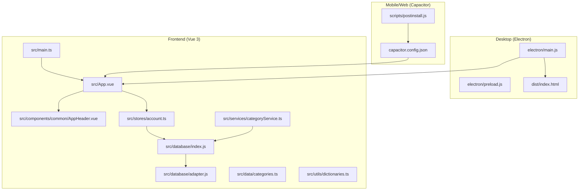
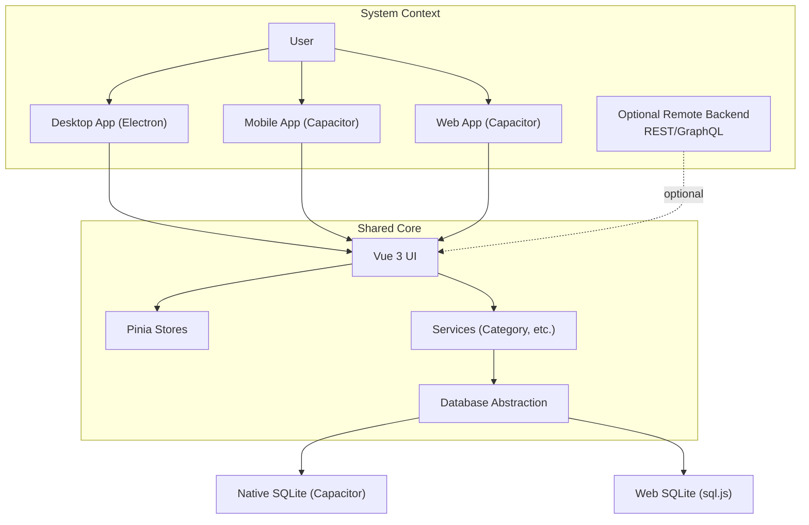
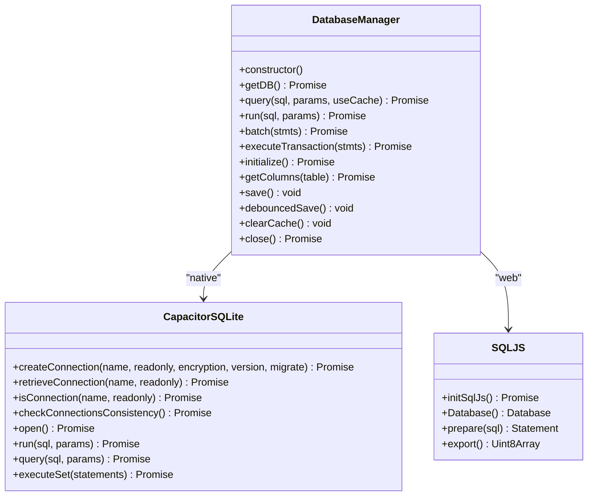
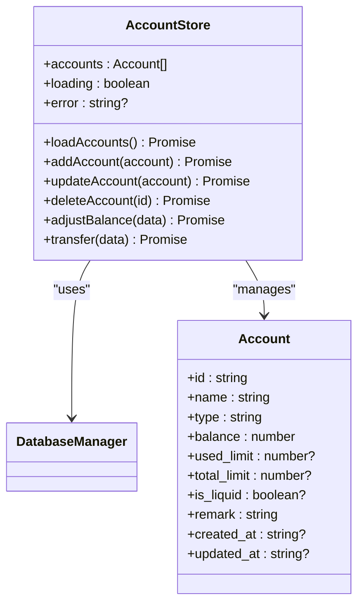
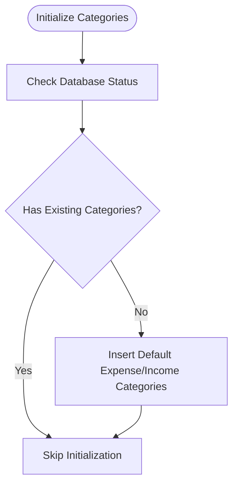
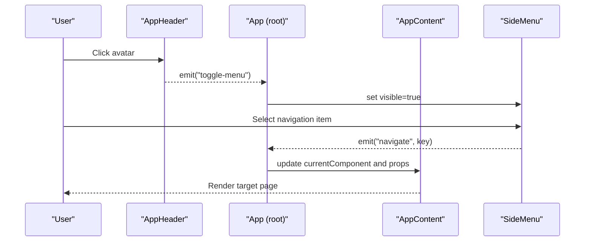
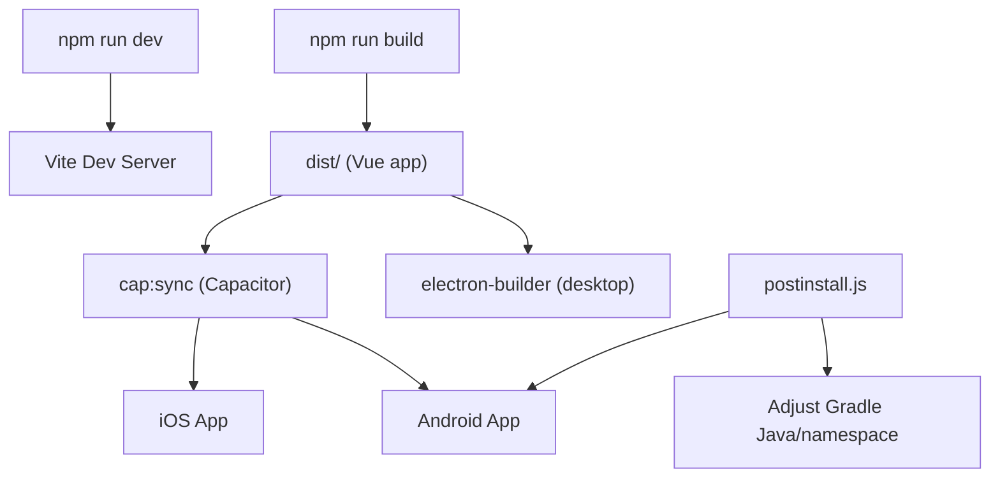
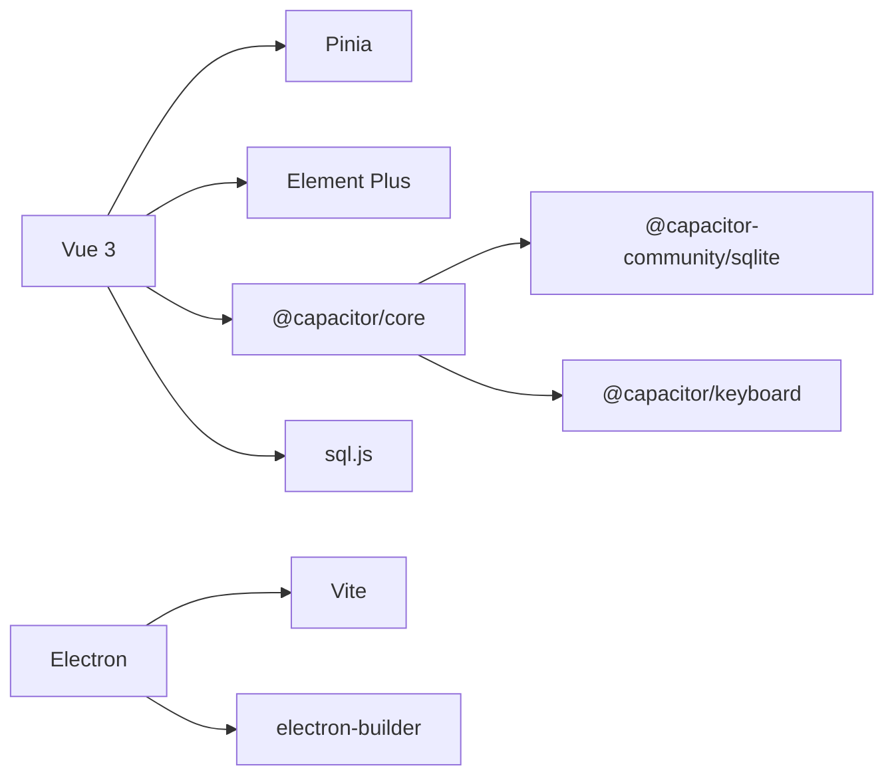

# Architecture Overview

<cite>
**Referenced Files in This Document**
- [package.json](file://package.json)
- [vite.config.ts](file://vite.config.ts)
- [capacitor.config.json](file://capacitor.config.json)
- [electron/main.js](file://electron/main.js)
- [electron/preload.js](file://electron/preload.js)
- [scripts/postinstall.js](file://scripts/postinstall.js)
- [src/main.ts](file://src/main.ts)
- [src/App.vue](file://src/App.vue)
- [src/components/common/AppHeader.vue](file://src/components/common/AppHeader.vue)
- [src/database/index.js](file://src/database/index.js)
- [src/database/adapter.js](file://src/database/adapter.js)
- [src/stores/account.ts](file://src/stores/account.ts)
- [src/services/categoryService.ts](file://src/services/categoryService.ts)
- [src/data/categories.ts](file://src/data/categories.ts)
- [src/utils/dictionaries.ts](file://src/utils/dictionaries.ts)
</cite>

## Table of Contents
1. [Introduction](#introduction)
2. [Project Structure](#project-structure)
3. [Core Components](#core-components)
4. [Architecture Overview](#architecture-overview)
5. [Detailed Component Analysis](#detailed-component-analysis)
6. [Dependency Analysis](#dependency-analysis)
7. [Performance Considerations](#performance-considerations)
8. [Troubleshooting Guide](#troubleshooting-guide)
9. [Conclusion](#conclusion)
10. [Appendices](#appendices)

## Introduction
This document describes the architecture of the Finance App, a cross-platform personal finance application built with a Vue.js frontend and a hybrid runtime leveraging Electron for desktop and Capacitor for mobile/web. The system follows a component-based UI architecture, state management via Pinia, and a unified database abstraction layer that supports both native and web environments. It documents platform separation, service architecture, UI organization, system context, technology trade-offs, scalability considerations, and build/deployment strategies.

## Project Structure
The project is organized around a modern frontend monorepo-like layout:
- Frontend: Vue 3 application bootstrapped with Vite, Pinia for state, Element Plus for UI components.
- Hybrid Runtime: Electron for desktop and Capacitor for mobile/web.
- Data Layer: A single database manager abstraction supporting two backends (Capacitor SQLite on native, sql.js on web).
- Services and Stores: Feature-focused services and Pinia stores encapsulate domain logic and state.
- Utilities: Shared dictionaries and category initialization data.

**Diagram sources**
- [electron/main.js:1-70](file://electron/main.js#L1-L70)
- [electron/preload.js](file://electron/preload.js)
- [capacitor.config.json:1-22](file://capacitor.config.json#L1-L22)
- [scripts/postinstall.js:1-145](file://scripts/postinstall.js#L1-L145)
- [src/main.ts:1-16](file://src/main.ts#L1-L16)
- [src/App.vue:1-195](file://src/App.vue#L1-L195)
- [src/components/common/AppHeader.vue:1-135](file://src/components/common/AppHeader.vue#L1-L135)
- [src/database/index.js:1-935](file://src/database/index.js#L1-L935)
- [src/database/adapter.js:1-34](file://src/database/adapter.js#L1-L34)
- [src/stores/account.ts:1-265](file://src/stores/account.ts#L1-L265)
- [src/services/categoryService.ts:1-260](file://src/services/categoryService.ts#L1-L260)
- [src/data/categories.ts:1-45](file://src/data/categories.ts#L1-L45)
- [src/utils/dictionaries.ts:1-90](file://src/utils/dictionaries.ts#L1-L90)

**Section sources**
- [package.json:1-72](file://package.json#L1-L72)
- [vite.config.ts:1-11](file://vite.config.ts#L1-L11)
- [capacitor.config.json:1-22](file://capacitor.config.json#L1-L22)
- [electron/main.js:1-70](file://electron/main.js#L1-L70)
- [scripts/postinstall.js:1-145](file://scripts/postinstall.js#L1-L145)

## Core Components
- Application bootstrap and platform detection:
  - Vue app creation, Pinia registration, Element Plus installation, and Capacitor platform detection.
- Database abstraction:
  - Unified manager supporting native (Capacitor SQLite) and web (sql.js) backends with caching, throttled persistence, and transaction support.
- State management:
  - Pinia stores encapsulate domain logic (e.g., account CRUD, transfers, balances).
- Services:
  - Category service handles category CRUD and default category initialization.
- UI:
  - Component-driven layout with a top header, dynamic content area, footer navigation, and side menu.
- Build and packaging:
  - Vite for development/build, Electron Builder for desktop, Capacitor CLI for mobile/web.

**Section sources**
- [src/main.ts:1-16](file://src/main.ts#L1-L16)
- [src/database/index.js:1-935](file://src/database/index.js#L1-L935)
- [src/stores/account.ts:1-265](file://src/stores/account.ts#L1-L265)
- [src/services/categoryService.ts:1-260](file://src/services/categoryService.ts#L1-L260)
- [src/App.vue:1-195](file://src/App.vue#L1-L195)

## Architecture Overview
The Finance App employs a hybrid architecture:
- Desktop: Electron hosts the built Vue app, enabling native OS integration and IPC channels.
- Mobile/Web: Capacitor wraps the Vue app as a native shell, exposing SQLite and device APIs.
- Shared Business Logic: The Vue app runs identically across platforms, with the database abstraction layer switching backend automatically.

**Diagram sources**
- [electron/main.js:1-70](file://electron/main.js#L1-L70)
- [capacitor.config.json:1-22](file://capacitor.config.json#L1-L22)
- [src/database/index.js:1-935](file://src/database/index.js#L1-L935)

## Detailed Component Analysis

### Database Abstraction Layer
The database manager provides a unified interface across platforms:
- Platform detection via Capacitor.
- Native path: Uses CapacitorSQLite connection lifecycle and executes statements.
- Web path: Uses sql.js with localStorage persistence and throttled saves.
- Features: Single connection, caching, batch execution, transactions, schema migration, and index maintenance.

**Diagram sources**
- [src/database/index.js:1-935](file://src/database/index.js#L1-L935)

**Section sources**
- [src/database/index.js:1-935](file://src/database/index.js#L1-L935)
- [src/database/adapter.js:1-34](file://src/database/adapter.js#L1-L34)

### State Management with Pinia
The account store demonstrates a typical Pinia pattern:
- Reactive state for accounts, loading, and errors.
- Actions for load, add, update, delete, balance adjustment, and internal transfers.
- Encapsulation of database operations behind the shared database manager.

**Diagram sources**
- [src/stores/account.ts:1-265](file://src/stores/account.ts#L1-L265)
- [src/database/index.js:1-935](file://src/database/index.js#L1-L935)

**Section sources**
- [src/stores/account.ts:1-265](file://src/stores/account.ts#L1-L265)

### Services and Data Initialization
The category service centralizes category operations:
- Fetch categories with optional filtering by type.
- CRUD operations with safe updates and defaults fallback.
- Initialization of default categories and database status checks.

**Diagram sources**
- [src/services/categoryService.ts:1-260](file://src/services/categoryService.ts#L1-L260)
- [src/data/categories.ts:1-45](file://src/data/categories.ts#L1-L45)

**Section sources**
- [src/services/categoryService.ts:1-260](file://src/services/categoryService.ts#L1-L260)
- [src/data/categories.ts:1-45](file://src/data/categories.ts#L1-L45)

### UI Component Organization
The root application composes common UI building blocks:
- AppHeader: Platform-aware header with avatar and branding.
- Dynamic content area: Renders feature-specific pages based on navigation state.
- Footer and SideMenu: Navigation scaffolding.
- Component props: Pass contextual data (year/month, fundId) to specialized views.

**Diagram sources**
- [src/App.vue:1-195](file://src/App.vue#L1-L195)
- [src/components/common/AppHeader.vue:1-135](file://src/components/common/AppHeader.vue#L1-L135)

**Section sources**
- [src/App.vue:1-195](file://src/App.vue#L1-L195)
- [src/components/common/AppHeader.vue:1-135](file://src/components/common/AppHeader.vue#L1-L135)

### Build Pipeline and Deployment Strategies
- Development: Vite dev server; Electron dev script runs both Vue dev and Electron main process concurrently.
- Desktop: Electron Builder packages the built Vue app into installers for Windows (NSIS/portable), macOS (DMG), and Linux (AppImage).
- Mobile/Web: Capacitor syncs the built web assets; Android Gradle configurations are adjusted via a postinstall script to align Java compatibility and namespaces.

**Diagram sources**
- [package.json:1-72](file://package.json#L1-L72)
- [vite.config.ts:1-11](file://vite.config.ts#L1-L11)
- [scripts/postinstall.js:1-145](file://scripts/postinstall.js#L1-L145)

**Section sources**
- [package.json:1-72](file://package.json#L1-L72)
- [vite.config.ts:1-11](file://vite.config.ts#L1-L11)
- [scripts/postinstall.js:1-145](file://scripts/postinstall.js#L1-L145)

## Dependency Analysis
- Runtime dependencies:
  - Vue 3, Pinia, Element Plus for UI and state.
  - Capacitor ecosystem for mobile/web integration.
  - Chart libraries and date utilities for analytics and calendar.
  - sql.js for web SQLite emulation.
- Dev dependencies:
  - Vite, TypeScript, Vue TS compiler, Electron, Electron Builder.
- Platform-specific integrations:
  - Electron main process controls window lifecycle and IPC.
  - Capacitor config defines app metadata, web directory, and plugin settings.
  - Postinstall script ensures Android Gradle compatibility.

**Diagram sources**
- [package.json:1-72](file://package.json#L1-L72)
- [electron/main.js:1-70](file://electron/main.js#L1-L70)
- [capacitor.config.json:1-22](file://capacitor.config.json#L1-L22)

**Section sources**
- [package.json:1-72](file://package.json#L1-L72)
- [electron/main.js:1-70](file://electron/main.js#L1-L70)
- [capacitor.config.json:1-22](file://capacitor.config.json#L1-L22)

## Performance Considerations
- Database:
  - Single connection per session with connection gating to avoid concurrent initialization.
  - Query caching reduces repeated reads; cache cleared on writes.
  - Batch and transaction APIs minimize round-trips and ensure atomicity.
  - Web persistence uses throttled localStorage writes to reduce I/O.
- UI:
  - Component composition keeps rendering focused; dynamic component switching avoids unnecessary re-renders.
- Build:
  - Vite target set to ES2015 for broad browser support.
  - Electron Builder configured for platform-specific targets.

[No sources needed since this section provides general guidance]

## Troubleshooting Guide
- Database initialization failures:
  - The database manager logs initialization steps and throws descriptive errors. Verify platform detection and backend availability.
- Web persistence issues:
  - Throttled saves rely on localStorage; ensure storage quota and permissions are available.
- Android build failures:
  - The postinstall script adjusts Java compatibility and namespaces; verify Gradle files exist and Gradle sync completes.
- Electron window lifecycle:
  - Ensure devtools are enabled during development and production loads the built HTML.

**Section sources**
- [src/database/index.js:1-935](file://src/database/index.js#L1-L935)
- [scripts/postinstall.js:1-145](file://scripts/postinstall.js#L1-L145)
- [electron/main.js:1-70](file://electron/main.js#L1-L70)

## Conclusion
The Finance App’s hybrid architecture cleanly separates presentation, state, and persistence concerns while sharing a unified codebase across desktop, mobile, and web. The database abstraction layer, service architecture, and component-driven UI enable maintainability and scalability. The build and deployment pipeline supports rapid iteration and reliable distribution across platforms.

[No sources needed since this section summarizes without analyzing specific files]

## Appendices

### Technology Stack Decisions and Trade-offs
- Vue 3 + Vite: Fast dev experience and optimized builds.
- Pinia: Lightweight, intuitive state management aligned with Vue 3.
- Capacitor + Electron: Single codebase with native capabilities on mobile/desktop.
- sql.js + Capacitor SQLite: Cross-platform persistence with minimal setup.
- Element Plus: Rich component library with good Vue 3 integration.
- Trade-offs:
  - Web SQLite emulation adds overhead; native SQLite performs better for heavy workloads.
  - Electron adds bundle size; Capacitor enables smaller native shells.

[No sources needed since this section provides general guidance]