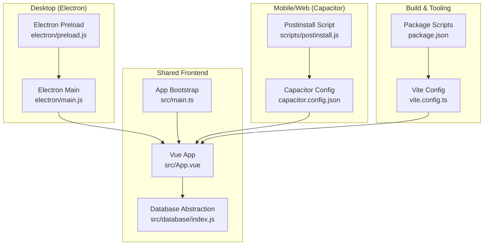
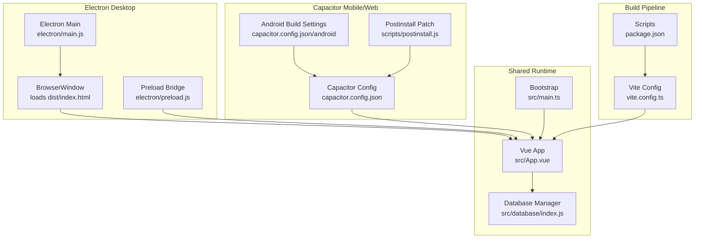
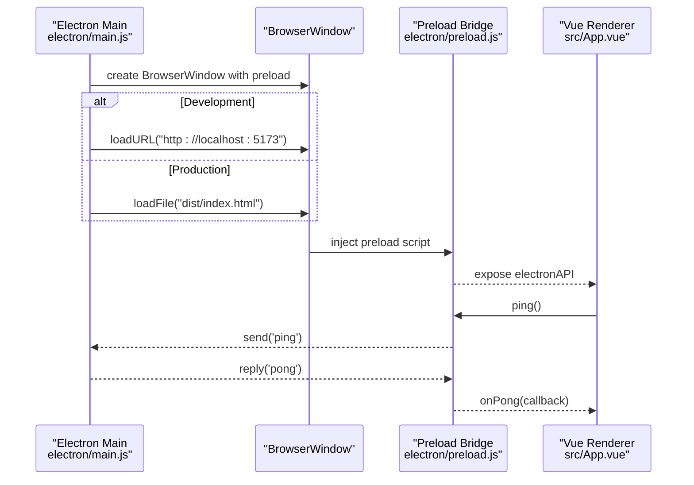
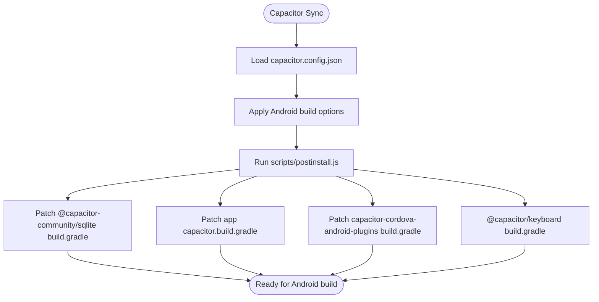
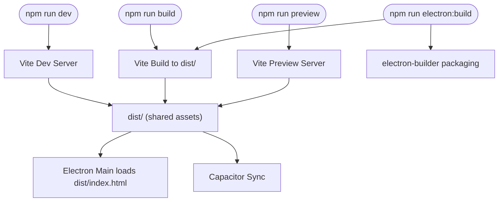
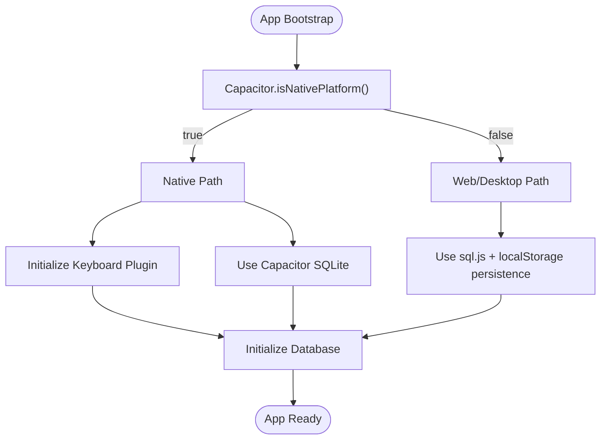
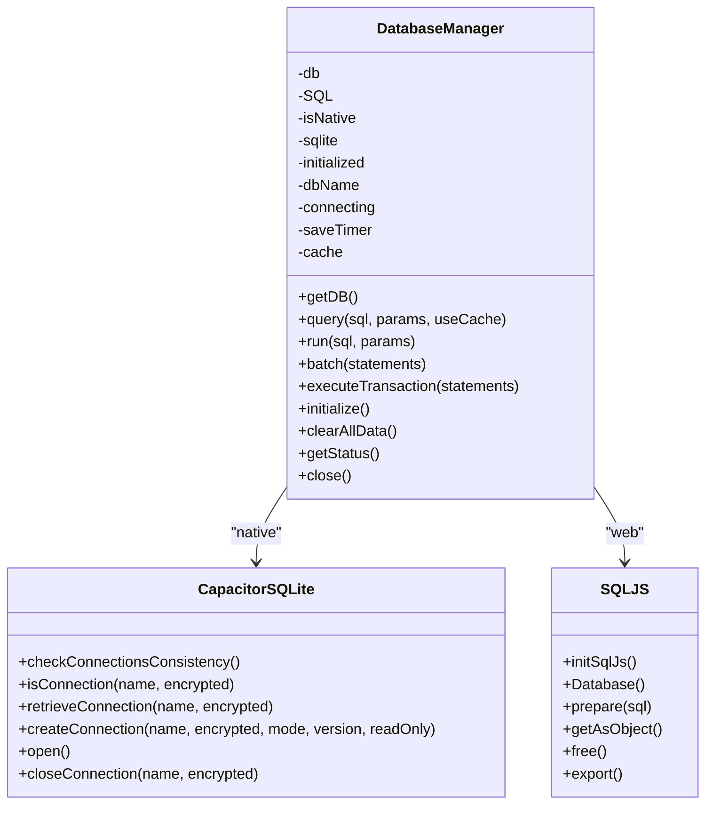
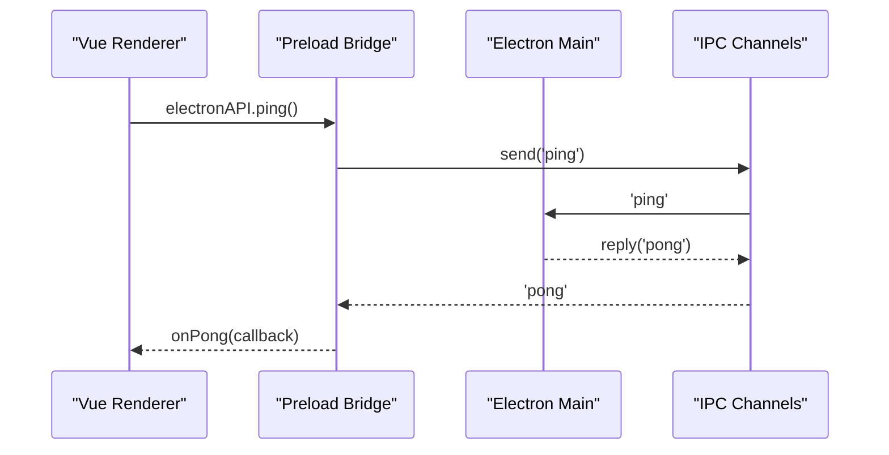
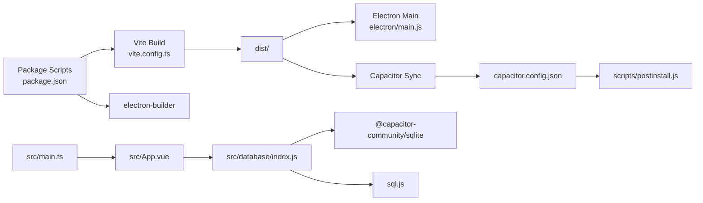

# Cross-Platform Deployment

<cite>
**Referenced Files in This Document**
- [capacitor.config.json](file://capacitor.config.json)
- [electron/main.js](file://electron/main.js)
- [electron/preload.js](file://electron/preload.js)
- [vite.config.ts](file://vite.config.ts)
- [package.json](file://package.json)
- [src/main.ts](file://src/main.ts)
- [src/App.vue](file://src/App.vue)
- [src/database/index.js](file://src/database/index.js)
- [src/database/adapter.js](file://src/database/adapter.js)
- [scripts/postinstall.js](file://scripts/postinstall.js)
</cite>

## Table of Contents
1. [Introduction](#introduction)
2. [Project Structure](#project-structure)
3. [Core Components](#core-components)
4. [Architecture Overview](#architecture-overview)
5. [Detailed Component Analysis](#detailed-component-analysis)
6. [Dependency Analysis](#dependency-analysis)
7. [Performance Considerations](#performance-considerations)
8. [Troubleshooting Guide](#troubleshooting-guide)
9. [Conclusion](#conclusion)

## Introduction
This document describes the cross-platform deployment architecture for the Finance App, which combines a Vue.js frontend with hybrid deployment targets:
- Desktop: Electron for Windows, macOS, and Linux
- Mobile/Web: Capacitor for iOS and Android, plus web browser deployment

The architecture leverages a shared Vue codebase with platform-specific runtime detection and feature implementations. It includes:
- Platform detection using Capacitor.isNativePlatform()
- A unified database abstraction supporting both native SQLite (via Capacitor SQLite) and web SQLite (via sql.js)
- A Vite build pipeline targeting ES2015 for broad compatibility
- Electron main/preload scripts with a controlled security model
- Capacitor configuration for Android and plugin settings

## Project Structure
The repository organizes code by platform and concerns:
- Electron desktop runtime under electron/
- Capacitor configuration and scripts under root
- Shared Vue application under src/
- Build configuration under vite.config.ts and package.json
- Database abstraction under src/database/

**Diagram sources**
- [src/App.vue:1-195](file://src/App.vue#L1-L195)
- [src/main.ts:1-16](file://src/main.ts#L1-L16)
- [src/database/index.js:1-935](file://src/database/index.js#L1-L935)
- [electron/main.js:1-70](file://electron/main.js#L1-L70)
- [electron/preload.js:1-7](file://electron/preload.js#L1-L7)
- [capacitor.config.json:1-22](file://capacitor.config.json#L1-L22)
- [scripts/postinstall.js:1-145](file://scripts/postinstall.js#L1-L145)
- [vite.config.ts:1-11](file://vite.config.ts#L1-L11)
- [package.json:1-72](file://package.json#L1-L72)

**Section sources**
- [src/App.vue:1-195](file://src/App.vue#L1-L195)
- [src/main.ts:1-16](file://src/main.ts#L1-L16)
- [electron/main.js:1-70](file://electron/main.js#L1-L70)
- [electron/preload.js:1-7](file://electron/preload.js#L1-L7)
- [capacitor.config.json:1-22](file://capacitor.config.json#L1-L22)
- [scripts/postinstall.js:1-145](file://scripts/postinstall.js#L1-L145)
- [vite.config.ts:1-11](file://vite.config.ts#L1-L11)
- [package.json:1-72](file://package.json#L1-L72)

## Core Components
- Electron main process manages the desktop window lifecycle and IPC channels
- Electron preload exposes a minimal, secure API surface to the renderer
- Capacitor configuration defines app metadata, web build output, and Android-specific settings
- Vite build pipeline compiles Vue with ES2015 target and relative base path
- Database abstraction adapts to native vs web environments using Capacitor.isNativePlatform()

**Section sources**
- [electron/main.js:1-70](file://electron/main.js#L1-L70)
- [electron/preload.js:1-7](file://electron/preload.js#L1-L7)
- [capacitor.config.json:1-22](file://capacitor.config.json#L1-L22)
- [vite.config.ts:1-11](file://vite.config.ts#L1-L11)
- [src/database/index.js:1-935](file://src/database/index.js#L1-L935)

## Architecture Overview
The Finance App uses a hybrid architecture:
- Vue application bootstrapped in both Electron and Capacitor contexts
- Platform detection determines whether to use native Capacitor SQLite or web SQLite (sql.js)
- Electron provides desktop packaging and distribution via electron-builder
- Capacitor synchronizes the built web assets and configures Android build settings

**Diagram sources**
- [electron/main.js:1-70](file://electron/main.js#L1-L70)
- [electron/preload.js:1-7](file://electron/preload.js#L1-L7)
- [capacitor.config.json:1-22](file://capacitor.config.json#L1-L22)
- [scripts/postinstall.js:1-145](file://scripts/postinstall.js#L1-L145)
- [src/App.vue:1-195](file://src/App.vue#L1-L195)
- [src/main.ts:1-16](file://src/main.ts#L1-L16)
- [src/database/index.js:1-935](file://src/database/index.js#L1-L935)
- [vite.config.ts:1-11](file://vite.config.ts#L1-L11)
- [package.json:1-72](file://package.json#L1-L72)

## Detailed Component Analysis

### Electron Desktop Runtime
The Electron main process creates a BrowserWindow, loads development or production resources, and sets up IPC. The preload script exposes a minimal API surface via contextBridge.

**Diagram sources**
- [electron/main.js:1-70](file://electron/main.js#L1-L70)
- [electron/preload.js:1-7](file://electron/preload.js#L1-L7)
- [src/App.vue:1-195](file://src/App.vue#L1-L195)

**Section sources**
- [electron/main.js:1-70](file://electron/main.js#L1-L70)
- [electron/preload.js:1-7](file://electron/preload.js#L1-L7)

### Capacitor Mobile/Web Runtime
Capacitor configuration defines app identifiers, webDir, and Android build options. The postinstall script patches Android Gradle files to align with Java 17 requirements and adds a namespace to Capacitor SQLite.

**Diagram sources**
- [capacitor.config.json:1-22](file://capacitor.config.json#L1-L22)
- [scripts/postinstall.js:1-145](file://scripts/postinstall.js#L1-L145)

**Section sources**
- [capacitor.config.json:1-22](file://capacitor.config.json#L1-L22)
- [scripts/postinstall.js:1-145](file://scripts/postinstall.js#L1-L145)

### Vite Build Pipeline
The Vite configuration enables the Vue plugin, sets a relative base path, and targets ES2015 for compatibility. The package.json scripts orchestrate development, building, previewing, and desktop packaging.

**Diagram sources**
- [vite.config.ts:1-11](file://vite.config.ts#L1-L11)
- [package.json:1-72](file://package.json#L1-L72)
- [electron/main.js:1-70](file://electron/main.js#L1-L70)

**Section sources**
- [vite.config.ts:1-11](file://vite.config.ts#L1-L11)
- [package.json:1-72](file://package.json#L1-L72)

### Platform Detection and Feature Implementation
The application detects native vs web via Capacitor.isNativePlatform() and adjusts behavior accordingly. On native platforms, it initializes the Capacitor Keyboard plugin and uses Capacitor SQLite. On web/desktop, it uses sql.js and local persistence.

**Diagram sources**
- [src/main.ts:1-16](file://src/main.ts#L1-L16)
- [src/App.vue:155-172](file://src/App.vue#L155-L172)
- [src/database/index.js:1-935](file://src/database/index.js#L1-L935)

**Section sources**
- [src/main.ts:1-16](file://src/main.ts#L1-L16)
- [src/App.vue:155-172](file://src/App.vue#L155-L172)
- [src/database/index.js:1-935](file://src/database/index.js#L1-L935)

### Database Abstraction and Platform-Specific Implementations
The database manager encapsulates platform differences:
- Native: Uses Capacitor SQLite with connection pooling, transactions, and batch operations
- Web: Uses sql.js with localStorage persistence and throttled saves

**Diagram sources**
- [src/database/index.js:1-935](file://src/database/index.js#L1-L935)

**Section sources**
- [src/database/index.js:1-935](file://src/database/index.js#L1-L935)
- [src/database/adapter.js:1-33](file://src/database/adapter.js#L1-L33)

### Electron Preload Security Model
The preload script exposes a minimal API surface using contextBridge and communicates via ipcRenderer. The Electron main process disables contextIsolation and enables nodeIntegration, which is typical for legacy apps but introduces security trade-offs.

**Diagram sources**
- [electron/preload.js:1-7](file://electron/preload.js#L1-L7)
- [electron/main.js:67-69](file://electron/main.js#L67-L69)

**Section sources**
- [electron/preload.js:1-7](file://electron/preload.js#L1-L7)
- [electron/main.js:23-27](file://electron/main.js#L23-L27)

## Dependency Analysis
The deployment stack ties together build tooling, platform runtimes, and database abstractions.

**Diagram sources**
- [vite.config.ts:1-11](file://vite.config.ts#L1-L11)
- [package.json:1-72](file://package.json#L1-L72)
- [electron/main.js:1-70](file://electron/main.js#L1-L70)
- [capacitor.config.json:1-22](file://capacitor.config.json#L1-L22)
- [scripts/postinstall.js:1-145](file://scripts/postinstall.js#L1-L145)
- [src/main.ts:1-16](file://src/main.ts#L1-L16)
- [src/App.vue:1-195](file://src/App.vue#L1-L195)
- [src/database/index.js:1-935](file://src/database/index.js#L1-L935)

**Section sources**
- [package.json:1-72](file://package.json#L1-L72)
- [vite.config.ts:1-11](file://vite.config.ts#L1-L11)
- [electron/main.js:1-70](file://electron/main.js#L1-L70)
- [capacitor.config.json:1-22](file://capacitor.config.json#L1-L22)
- [scripts/postinstall.js:1-145](file://scripts/postinstall.js#L1-L145)
- [src/main.ts:1-16](file://src/main.ts#L1-L16)
- [src/App.vue:1-195](file://src/App.vue#L1-L195)
- [src/database/index.js:1-935](file://src/database/index.js#L1-L935)

## Performance Considerations
- Database caching: The database manager caches query results to reduce repeated work
- Debounced persistence: Web environment persists SQLite snapshots with throttling to minimize writes
- Transactions: Batch operations and explicit transactions improve write throughput
- Connection reuse: Single connection lifecycle prevents redundant initialization
- Build target: ES2015 target ensures compatibility across platforms while keeping bundle sizes reasonable

[No sources needed since this section provides general guidance]

## Troubleshooting Guide
- Electron devtools: Development builds automatically open devtools in Electron main process
- Java compatibility: Android builds require Java 17; the postinstall script patches Gradle files to set source/target compatibility and adds a namespace
- Database initialization errors: Verify Capacitor SQLite availability on native platforms and sql.js initialization on web
- IPC communication: Confirm preload exposes the expected API and main process handles the channel correctly

**Section sources**
- [electron/main.js:31-36](file://electron/main.js#L31-L36)
- [scripts/postinstall.js:41-70](file://scripts/postinstall.js#L41-L70)
- [src/database/index.js:37-50](file://src/database/index.js#L37-L50)
- [electron/preload.js:1-7](file://electron/preload.js#L1-L7)
- [electron/main.js:67-69](file://electron/main.js#L67-L69)

## Conclusion
The Finance App’s cross-platform deployment architecture centers on a shared Vue application with platform-aware runtime behavior. Electron delivers desktop experiences with a minimal preload bridge, while Capacitor enables mobile and web deployments with Android build adjustments. The Vite pipeline produces a portable web bundle consumed by both runtimes. The database abstraction cleanly separates native and web storage paths, enabling consistent data access across platforms.