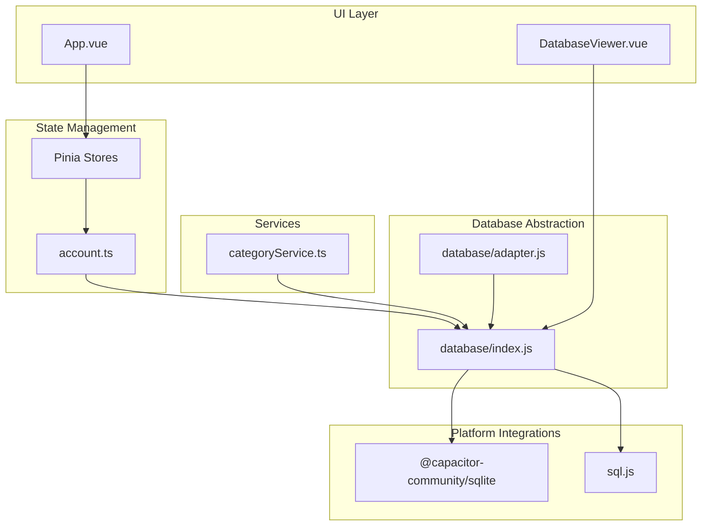
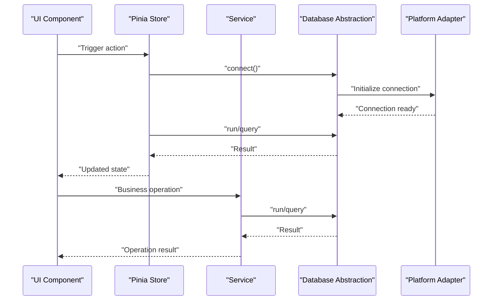
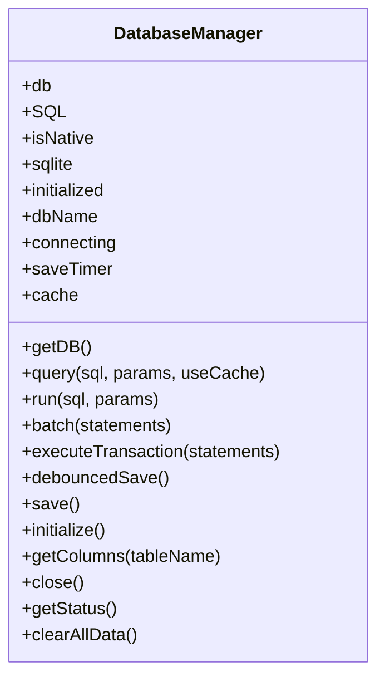
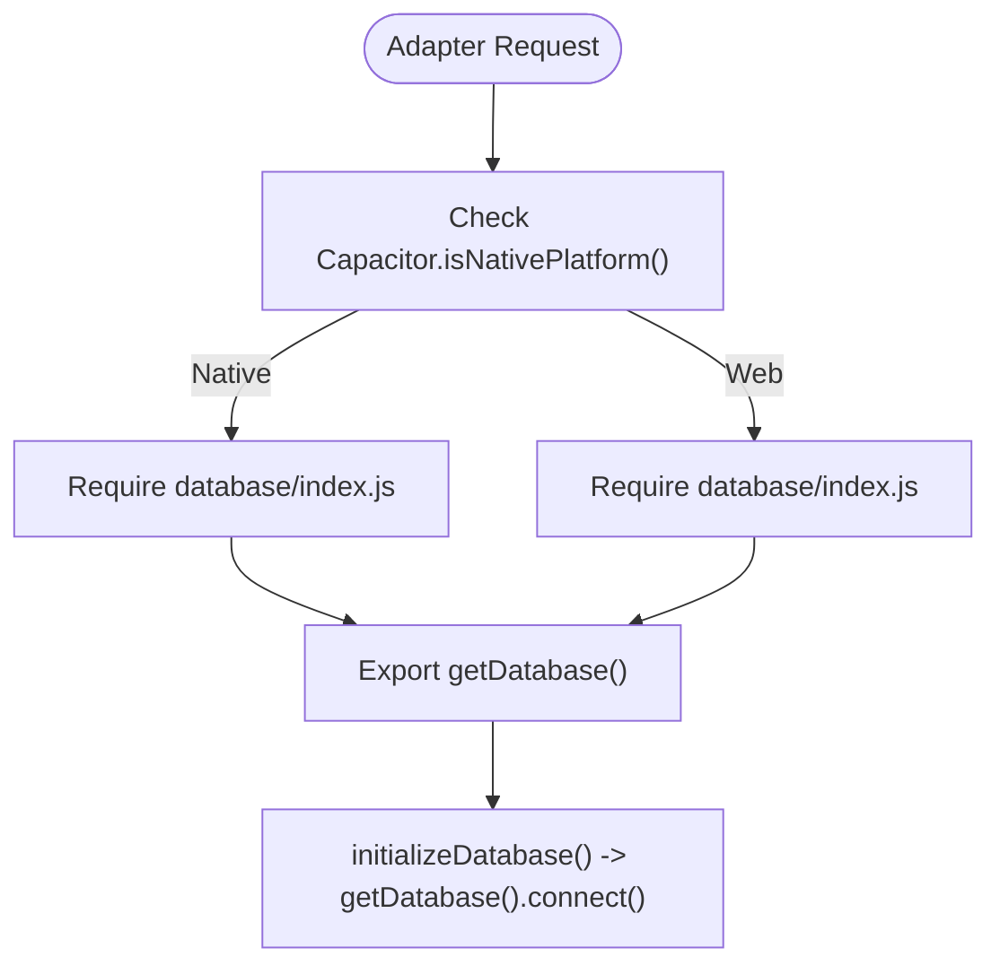
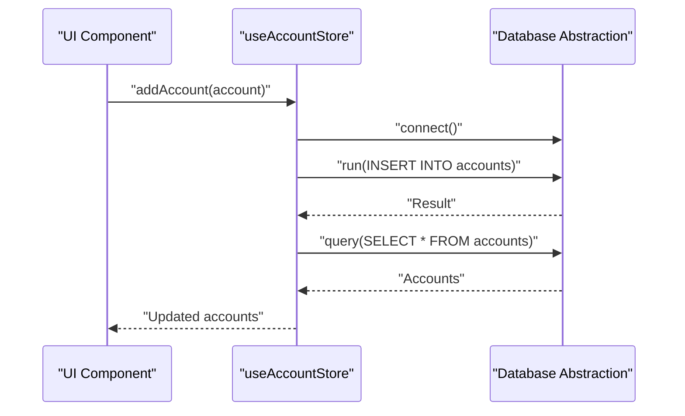
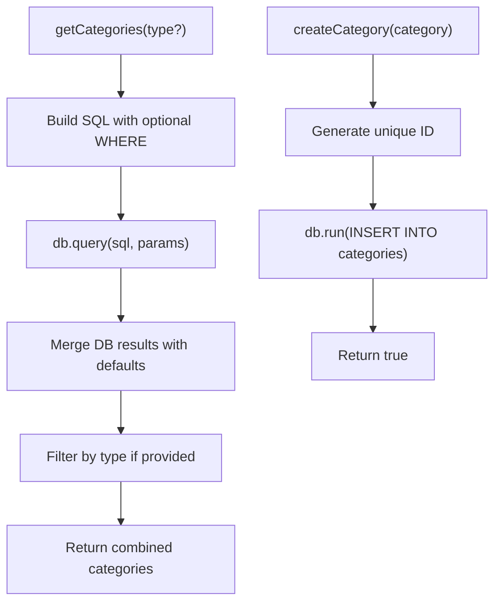
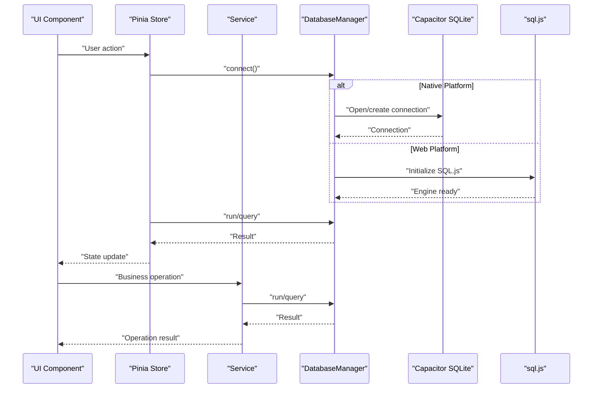
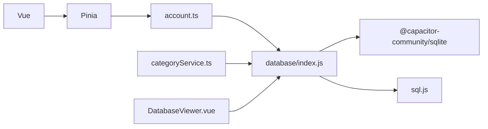

# Data Persistence Layer

<cite>
**Referenced Files in This Document**
- [index.js](file://src/database/index.js)
- [adapter.js](file://src/database/adapter.js)
- [account.ts](file://src/stores/account.ts)
- [categoryService.ts](file://src/services/categoryService.ts)
- [categories.ts](file://src/data/categories.ts)
- [main.ts](file://src/main.ts)
- [App.vue](file://src/App.vue)
- [DatabaseViewer.vue](file://src/components/mobile/DatabaseViewer.vue)
- [package.json](file://package.json)
</cite>

## Table of Contents
1. [Introduction](#introduction)
2. [Project Structure](#project-structure)
3. [Core Components](#core-components)
4. [Architecture Overview](#architecture-overview)
5. [Detailed Component Analysis](#detailed-component-analysis)
6. [Dependency Analysis](#dependency-analysis)
7. [Performance Considerations](#performance-considerations)
8. [Troubleshooting Guide](#troubleshooting-guide)
9. [Conclusion](#conclusion)

## Introduction
This document explains the data persistence architecture of the Finance App, focusing on the database abstraction layer, adapter pattern, store-based state management, and service layer. It details how data flows from UI components through services to the database adapter, covering CRUD operations, validation, error handling, and the separation between local storage and potential cloud synchronization.

## Project Structure
The data persistence stack is organized around a unified database abstraction layer with platform-specific adapters and a Pinia-based store layer for reactive state management. Services encapsulate business logic and coordinate with the database layer.

**Diagram sources**
- [index.js:1-935](file://src/database/index.js#L1-L935)
- [adapter.js:1-34](file://src/database/adapter.js#L1-L34)
- [account.ts:1-265](file://src/stores/account.ts#L1-L265)
- [categoryService.ts:1-260](file://src/services/categoryService.ts#L1-L260)
- [DatabaseViewer.vue:1-480](file://src/components/mobile/DatabaseViewer.vue#L1-L480)
- [main.ts:1-16](file://src/main.ts#L1-L16)

**Section sources**
- [main.ts:1-16](file://src/main.ts#L1-L16)
- [App.vue:1-195](file://src/App.vue#L1-L195)

## Core Components
- Database abstraction layer: Provides a unified interface for SQLite operations across platforms, with caching, throttled persistence, and transaction support.
- Adapter pattern: A thin adapter module that selects the appropriate database implementation depending on the platform.
- Store-based state management: Pinia stores manage reactive state and orchestrate database operations for entities like accounts.
- Service layer: Business logic services (e.g., categoryService) encapsulate CRUD operations and data validation.

**Section sources**
- [index.js:1-935](file://src/database/index.js#L1-L935)
- [adapter.js:1-34](file://src/database/adapter.js#L1-L34)
- [account.ts:1-265](file://src/stores/account.ts#L1-L265)
- [categoryService.ts:1-260](file://src/services/categoryService.ts#L1-L260)

## Architecture Overview
The Finance App employs a layered architecture:
- UI components trigger actions.
- Pinia stores coordinate state updates and database operations.
- Services encapsulate business logic and validate inputs.
- The database abstraction layer handles platform differences and performs SQL operations.
- Transactions and caching optimize performance and ensure consistency.

**Diagram sources**
- [index.js:56-190](file://src/database/index.js#L56-L190)
- [account.ts:38-100](file://src/stores/account.ts#L38-L100)
- [categoryService.ts:14-69](file://src/services/categoryService.ts#L14-L69)

## Detailed Component Analysis

### Database Abstraction Layer (database/index.js)
The database abstraction layer centralizes SQLite operations and provides:
- Single connection management with platform detection.
- Unified query and run APIs with parameter binding.
- Batch execution and transaction support.
- Caching for read-heavy queries.
- Throttled persistence for web environments.
- Schema initialization and migration handling.
- Status reporting and cleanup.

Key capabilities:
- Connection pooling and concurrency control.
- Native vs web platform differentiation.
- Robust error handling and logging.
- Index creation and maintenance for performance.
- Structured migrations for evolving schemas.

**Diagram sources**
- [index.js:21-891](file://src/database/index.js#L21-L891)

**Section sources**
- [index.js:21-891](file://src/database/index.js#L21-L891)

### Adapter Pattern (database/adapter.js)
The adapter module provides a simple abstraction for selecting the correct database implementation:
- Detects native platform and routes to the database manager.
- Exposes initialization and database access functions.

**Diagram sources**
- [adapter.js:1-34](file://src/database/adapter.js#L1-L34)

**Section sources**
- [adapter.js:1-34](file://src/database/adapter.js#L1-L34)

### Store-Based State Management (stores/account.ts)
The account store manages reactive state for accounts and orchestrates CRUD operations:
- Defines the Account interface and store state.
- Loads accounts from the database.
- Adds, updates, and deletes accounts.
- Adjusts balances and records transaction history.
- Performs internal transfers with transaction safety.
- Handles errors and loading states.

**Diagram sources**
- [account.ts:59-100](file://src/stores/account.ts#L59-L100)

**Section sources**
- [account.ts:1-265](file://src/stores/account.ts#L1-L265)

### Service Layer (services/categoryService.ts)
The category service encapsulates business logic for categories:
- Retrieves categories with optional filtering by type.
- Creates, updates, and deletes categories.
- Initializes default categories if none exist.
- Checks database connectivity and falls back gracefully.

**Diagram sources**
- [categoryService.ts:14-69](file://src/services/categoryService.ts#L14-L69)

**Section sources**
- [categoryService.ts:1-260](file://src/services/categoryService.ts#L1-L260)
- [categories.ts:1-45](file://src/data/categories.ts#L1-L45)

### Data Flow Through the System
End-to-end data flow from UI to database:
- UI triggers actions (e.g., add account, create category).
- Stores/services prepare and validate data.
- Database abstraction executes SQL with parameter binding.
- Transactions ensure atomicity for multi-step operations.
- Results are cached and state is updated reactively.

**Diagram sources**
- [index.js:81-178](file://src/database/index.js#L81-L178)
- [account.ts:38-100](file://src/stores/account.ts#L38-L100)
- [categoryService.ts:14-69](file://src/services/categoryService.ts#L14-L69)

## Dependency Analysis
The system relies on the following key dependencies:
- Capacitor SQLite for native database connectivity.
- sql.js for web-based in-memory database with optional persistence.
- Pinia for reactive state management.
- Vue for UI framework integration.

**Diagram sources**
- [package.json:19-36](file://package.json#L19-L36)
- [main.ts:1-16](file://src/main.ts#L1-L16)

**Section sources**
- [package.json:19-36](file://package.json#L19-L36)

## Performance Considerations
- Connection pooling and reuse reduce overhead.
- Query caching improves read performance for repeated reads.
- Batch operations minimize round-trips for multiple writes.
- Transactions ensure atomicity and reduce partial state issues.
- Indexes on frequently queried columns improve query performance.
- Throttled persistence avoids excessive writes in web environments.

[No sources needed since this section provides general guidance]

## Troubleshooting Guide
Common issues and resolutions:
- Connection failures on web platforms: Verify sql.js initialization and localStorage availability. The database viewer can help diagnose storage status.
- Transaction errors: Ensure proper BEGIN/COMMIT/ROLLBACK handling and catch exceptions during commit/rollback.
- Validation errors: Validate inputs in stores/services before invoking database operations.
- Migration failures: Review schema change logic and handle missing columns gracefully.

**Section sources**
- [DatabaseViewer.vue:174-231](file://src/components/mobile/DatabaseViewer.vue#L174-L231)
- [account.ts:183-262](file://src/stores/account.ts#L183-L262)
- [categoryService.ts:181-194](file://src/services/categoryService.ts#L181-L194)

## Conclusion
The Finance App’s data persistence layer combines a robust database abstraction with a clean adapter pattern, reactive store management, and service-layer business logic. This architecture ensures portability across platforms, strong performance through caching and batching, and reliable data integrity via transactions. The separation between local storage and potential cloud synchronization is clearly delineated, enabling future enhancements without disrupting existing functionality.