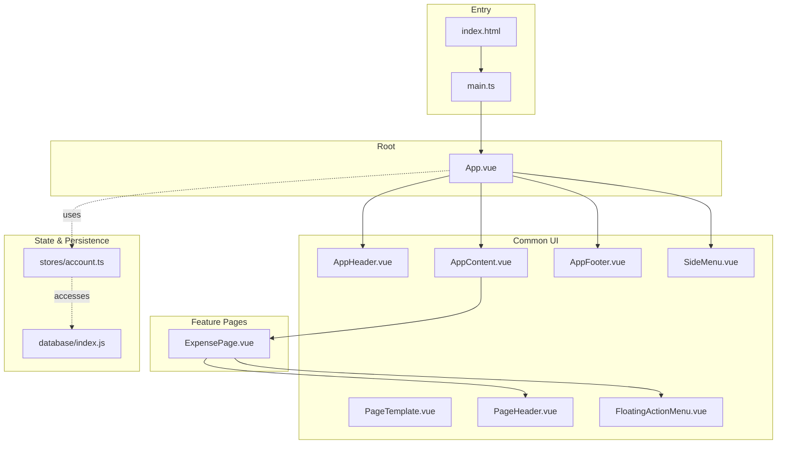
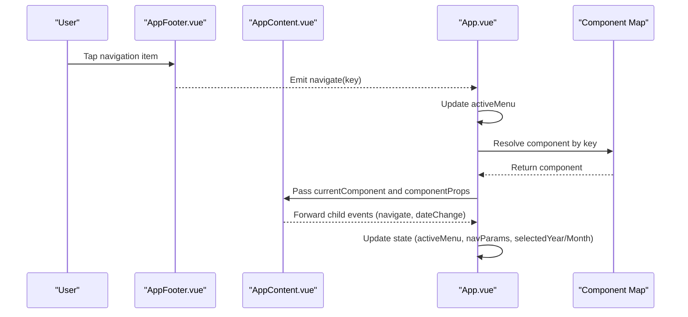
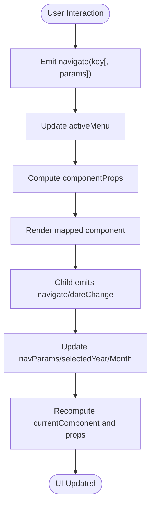
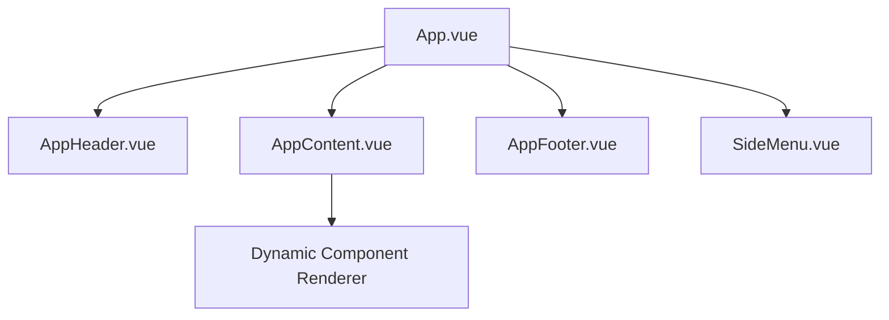
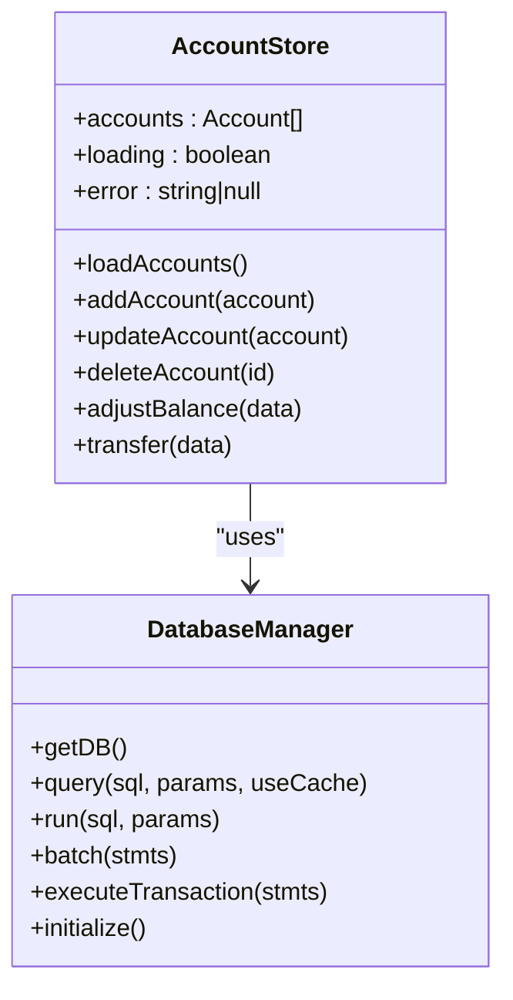
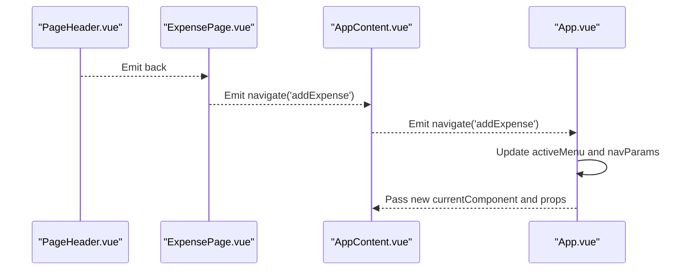
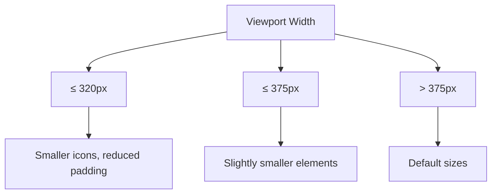
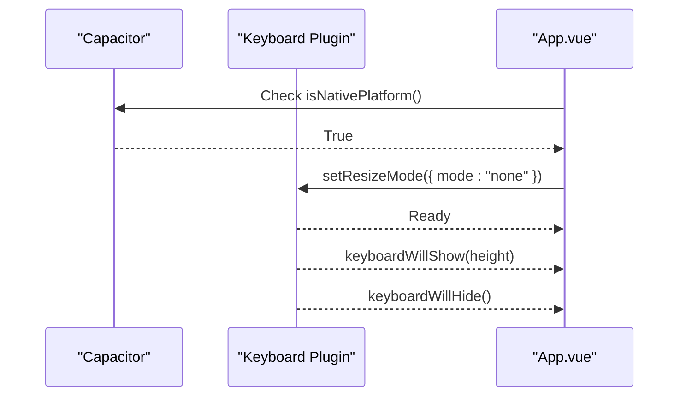
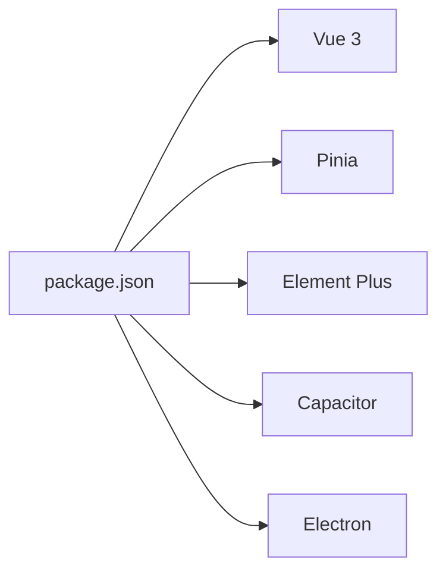

# Frontend Architecture

<cite>
**Referenced Files in This Document**
- [App.vue](file://src/App.vue)
- [main.ts](file://src/main.ts)
- [AppHeader.vue](file://src/components/common/AppHeader.vue)
- [AppContent.vue](file://src/components/common/AppContent.vue)
- [AppFooter.vue](file://src/components/common/AppFooter.vue)
- [SideMenu.vue](file://src/components/common/SideMenu.vue)
- [PageTemplate.vue](file://src/components/common/PageTemplate.vue)
- [PageHeader.vue](file://src/components/common/PageHeader.vue)
- [FloatingActionMenu.vue](file://src/components/common/FloatingActionMenu.vue)
- [ExpensePage.vue](file://src/components/mobile/expense/ExpensePage.vue)
- [account.ts](file://src/stores/account.ts)
- [index.js](file://src/database/index.js)
- [package.json](file://package.json)
- [vite.config.ts](file://vite.config.ts)
- [index.html](file://index.html)
</cite>

## Table of Contents
1. [Introduction](#introduction)
2. [Project Structure](#project-structure)
3. [Core Components](#core-components)
4. [Architecture Overview](#architecture-overview)
5. [Detailed Component Analysis](#detailed-component-analysis)
6. [Dependency Analysis](#dependency-analysis)
7. [Performance Considerations](#performance-considerations)
8. [Troubleshooting Guide](#troubleshooting-guide)
9. [Conclusion](#conclusion)

## Introduction
This document describes the frontend architecture of the Finance App built with Vue 3 and TypeScript. The application follows a component-based architecture centered around a root App component that orchestrates navigation and layout. It implements a reactive navigation system using computed properties and dynamic component mapping for efficient content loading. The design is mobile-first and responsive, leveraging Element Plus for UI primitives and Pinia for state management. Native platform integration is handled via Capacitor, including keyboard resizing behavior for improved UX on mobile devices.

## Project Structure
The project is organized by feature and layer:
- Root entry initializes the Vue app, registers Pinia and Element Plus, and mounts the root component.
- Common UI components provide reusable building blocks for header, content area, footer, and side menu.
- Feature-specific components are grouped under a mobile-focused directory structure.
- Stores encapsulate domain state and actions (e.g., account management).
- Database layer abstracts persistence across web and native environments.

**Diagram sources**
- [index.html:1-13](file://index.html#L1-L13)
- [main.ts:1-16](file://src/main.ts#L1-L16)
- [App.vue:1-195](file://src/App.vue#L1-L195)
- [AppHeader.vue:1-135](file://src/components/common/AppHeader.vue#L1-L135)
- [AppContent.vue:1-51](file://src/components/common/AppContent.vue#L1-L51)
- [AppFooter.vue:1-98](file://src/components/common/AppFooter.vue#L1-L98)
- [SideMenu.vue:1-255](file://src/components/common/SideMenu.vue#L1-L255)
- [PageTemplate.vue:1-103](file://src/components/common/PageTemplate.vue#L1-L103)
- [PageHeader.vue:1-57](file://src/components/common/PageHeader.vue#L1-L57)
- [FloatingActionMenu.vue:1-151](file://src/components/common/FloatingActionMenu.vue#L1-L151)
- [ExpensePage.vue:1-88](file://src/components/mobile/expense/ExpensePage.vue#L1-L88)
- [account.ts:1-265](file://src/stores/account.ts#L1-L265)
- [index.js:1-935](file://src/database/index.js#L1-L935)

**Section sources**
- [index.html:1-13](file://index.html#L1-L13)
- [main.ts:1-16](file://src/main.ts#L1-L16)
- [vite.config.ts:1-11](file://vite.config.ts#L1-L11)

## Core Components
- App.vue: Orchestrates layout, reactive navigation, and passes props to the dynamic content area. Manages component mapping, navigation parameters, and keyboard handling for native platforms.
- AppHeader.vue: Emits toggle events to open the side menu and persists user preferences locally.
- AppContent.vue: Dynamically renders the mapped component and forwards navigation/date change events.
- AppFooter.vue: Bottom navigation bar emitting keys for quick navigation to major sections.
- SideMenu.vue: Overlay menu with navigation items and profile area; emits close and navigate events.
- PageTemplate.vue: A page shell with optional confirm button and slot for content.
- PageHeader.vue: Back navigation and title display.
- FloatingActionMenu.vue: Dynamic floating action button(s) with tooltip labels.

**Section sources**
- [App.vue:1-195](file://src/App.vue#L1-L195)
- [AppHeader.vue:1-135](file://src/components/common/AppHeader.vue#L1-L135)
- [AppContent.vue:1-51](file://src/components/common/AppContent.vue#L1-L51)
- [AppFooter.vue:1-98](file://src/components/common/AppFooter.vue#L1-L98)
- [SideMenu.vue:1-255](file://src/components/common/SideMenu.vue#L1-L255)
- [PageTemplate.vue:1-103](file://src/components/common/PageTemplate.vue#L1-L103)
- [PageHeader.vue:1-57](file://src/components/common/PageHeader.vue#L1-L57)
- [FloatingActionMenu.vue:1-151](file://src/components/common/FloatingActionMenu.vue#L1-L151)

## Architecture Overview
The app uses a root component-driven layout with a reactive navigation model:
- Navigation keys drive a computed mapping to feature components.
- Props are dynamically computed and passed down to the rendered component.
- Events bubble up from content to the root for centralized state updates.
- Native platform integration configures keyboard behavior and ensures consistent UX.

**Diagram sources**
- [AppFooter.vue:1-98](file://src/components/common/AppFooter.vue#L1-L98)
- [AppContent.vue:1-51](file://src/components/common/AppContent.vue#L1-L51)
- [App.vue:64-137](file://src/App.vue#L64-L137)

**Section sources**
- [App.vue:64-137](file://src/App.vue#L64-L137)
- [AppFooter.vue:1-98](file://src/components/common/AppFooter.vue#L1-L98)
- [AppContent.vue:1-51](file://src/components/common/AppContent.vue#L1-L51)

## Detailed Component Analysis

### Reactive Navigation System
- Component mapping: A computed property maps navigation keys to feature components, ensuring dynamic rendering without hard-coded routes.
- Parameter forwarding: A second computed property injects contextual props (e.g., year/month, fundId) based on the active key.
- Event propagation: Child components emit navigate and dateChange events; the root handles state updates and re-renders the appropriate component.

**Diagram sources**
- [App.vue:64-137](file://src/App.vue#L64-L137)

**Section sources**
- [App.vue:64-137](file://src/App.vue#L64-L137)

### Layout Orchestration
- Header/Footer/SideMenu/AppContent form a mobile-first layout with fixed header/footer and scrollable content area.
- SideMenu visibility is controlled by the root; toggling the header avatar opens the menu.
- Content area uses a dynamic component renderer to minimize bundle size and improve perceived performance.

**Diagram sources**
- [App.vue:1-195](file://src/App.vue#L1-L195)
- [AppHeader.vue:1-135](file://src/components/common/AppHeader.vue#L1-L135)
- [AppContent.vue:1-51](file://src/components/common/AppContent.vue#L1-L51)
- [AppFooter.vue:1-98](file://src/components/common/AppFooter.vue#L1-L98)
- [SideMenu.vue:1-255](file://src/components/common/SideMenu.vue#L1-L255)

**Section sources**
- [App.vue:1-195](file://src/App.vue#L1-L195)
- [AppHeader.vue:1-135](file://src/components/common/AppHeader.vue#L1-L135)
- [AppContent.vue:1-51](file://src/components/common/AppContent.vue#L1-L51)
- [AppFooter.vue:1-98](file://src/components/common/AppFooter.vue#L1-L98)
- [SideMenu.vue:1-255](file://src/components/common/SideMenu.vue#L1-L255)

### State Management Patterns
- Pinia store encapsulates account domain logic: CRUD operations, balance adjustments, transfers, and transaction logging.
- Store actions coordinate with the database manager to maintain consistency across native and web environments.
- Reactive state drives UI updates; stores are injected at the root level.

**Diagram sources**
- [account.ts:1-265](file://src/stores/account.ts#L1-L265)
- [index.js:1-935](file://src/database/index.js#L1-L935)

**Section sources**
- [account.ts:1-265](file://src/stores/account.ts#L1-L265)
- [index.js:1-935](file://src/database/index.js#L1-L935)

### Component Communication Through Props and Events
- Parent-to-child: The root passes the resolved component and props to AppContent, which binds them to the dynamic component.
- Child-to-parent: Feature components emit navigate and dateChange; the root updates state and re-renders.
- Menu-to-root: SideMenu emits close and navigate; AppHeader emits toggle-menu.

**Diagram sources**
- [PageHeader.vue:1-57](file://src/components/common/PageHeader.vue#L1-L57)
- [ExpensePage.vue:1-88](file://src/components/mobile/expense/ExpensePage.vue#L1-L88)
- [AppContent.vue:1-51](file://src/components/common/AppContent.vue#L1-L51)
- [App.vue:119-137](file://src/App.vue#L119-L137)

**Section sources**
- [PageHeader.vue:1-57](file://src/components/common/PageHeader.vue#L1-L57)
- [ExpensePage.vue:1-88](file://src/components/mobile/expense/ExpensePage.vue#L1-L88)
- [AppContent.vue:1-51](file://src/components/common/AppContent.vue#L1-L51)
- [App.vue:119-137](file://src/App.vue#L119-L137)

### Responsive Mobile-First Design
- Media queries adjust typography, spacing, and icon sizes for smaller screens.
- Scroll areas hide scrollbars while preserving scrolling behavior.
- Fixed header/footer and overlay side menu ensure consistent navigation affordances.

**Diagram sources**
- [AppHeader.vue:99-134](file://src/components/common/AppHeader.vue#L99-L134)
- [SideMenu.vue:191-254](file://src/components/common/SideMenu.vue#L191-L254)
- [AppFooter.vue:74-97](file://src/components/common/AppFooter.vue#L74-L97)
- [AppContent.vue:35-50](file://src/components/common/AppContent.vue#L35-L50)
- [PageTemplate.vue:93-102](file://src/components/common/PageTemplate.vue#L93-L102)

**Section sources**
- [AppHeader.vue:99-134](file://src/components/common/AppHeader.vue#L99-L134)
- [SideMenu.vue:191-254](file://src/components/common/SideMenu.vue#L191-L254)
- [AppFooter.vue:74-97](file://src/components/common/AppFooter.vue#L74-L97)
- [AppContent.vue:35-50](file://src/components/common/AppContent.vue#L35-L50)
- [PageTemplate.vue:93-102](file://src/components/common/PageTemplate.vue#L93-L102)

### Native Platform Integration and Keyboard Handling
- On native platforms, the app configures the keyboard resize mode to "none" and logs keyboard show/hide events.
- This improves UX by preventing automatic viewport adjustments during keyboard presentation.

**Diagram sources**
- [App.vue:155-172](file://src/App.vue#L155-L172)

**Section sources**
- [App.vue:155-172](file://src/App.vue#L155-L172)

## Dependency Analysis
- Runtime dependencies include Vue 3, Pinia, Element Plus, and Capacitor ecosystem packages.
- Build-time dependencies include Vite and TypeScript tooling.
- The app integrates Electron for desktop builds and Capacitor for mobile/web targets.

**Diagram sources**
- [package.json:1-72](file://package.json#L1-L72)

**Section sources**
- [package.json:1-72](file://package.json#L1-L72)
- [vite.config.ts:1-11](file://vite.config.ts#L1-L11)

## Performance Considerations
- Dynamic component rendering reduces initial bundle size by loading only the active feature.
- Computed props ensure minimal reactivity overhead by passing only necessary data.
- Database manager implements caching and throttled persistence for web environments to reduce I/O contention.
- Avoid unnecessary watchers and keep event handlers shallow to minimize re-render cycles.

## Troubleshooting Guide
- Navigation not updating: Verify the emitted navigate key matches an entry in the component map and that navParams are being stored.
- Props not received: Confirm componentProps computation includes the active key and required parameters.
- Keyboard overlap on mobile: Ensure Capacitor keyboard plugin is initialized and resize mode is set to "none".
- Database errors: Check database initialization and connection logic; confirm table creation and migrations are executed successfully.

**Section sources**
- [App.vue:64-137](file://src/App.vue#L64-L137)
- [index.js:420-776](file://src/database/index.js#L420-L776)

## Conclusion
The Finance App employs a clean, component-based architecture with a reactive navigation system centered on a root component. The design emphasizes mobile-first responsiveness, efficient state management via Pinia, and robust persistence abstraction. Event-driven communication and dynamic component rendering contribute to a scalable and maintainable frontend structure suitable for cross-platform deployment.