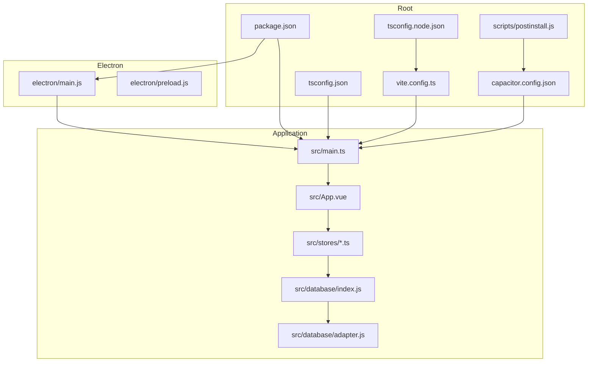
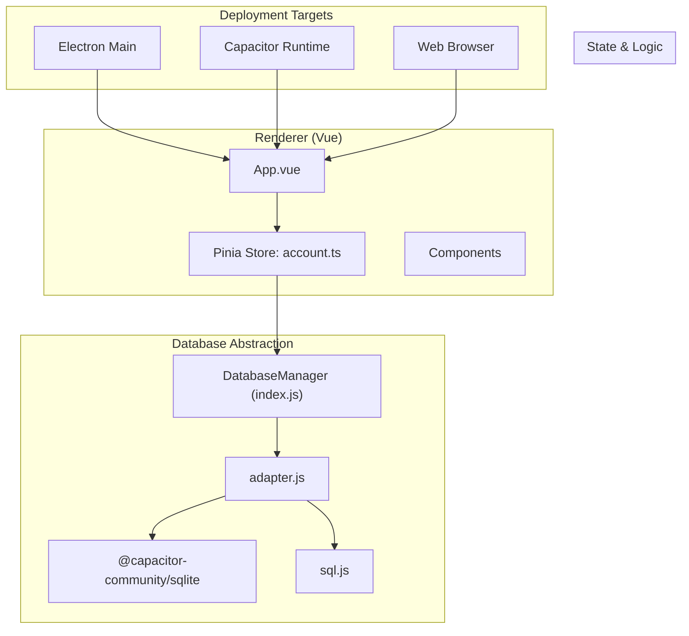
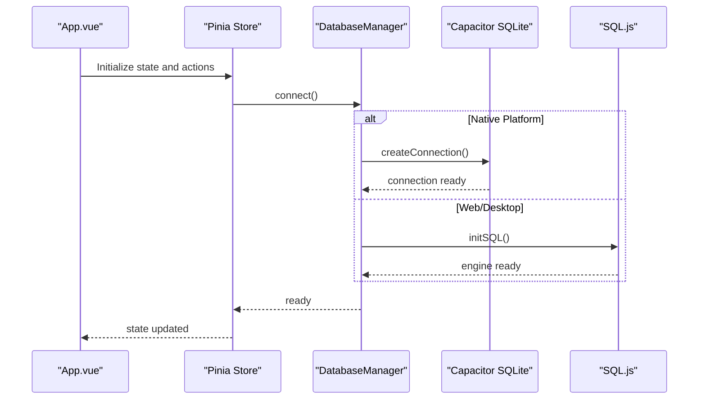
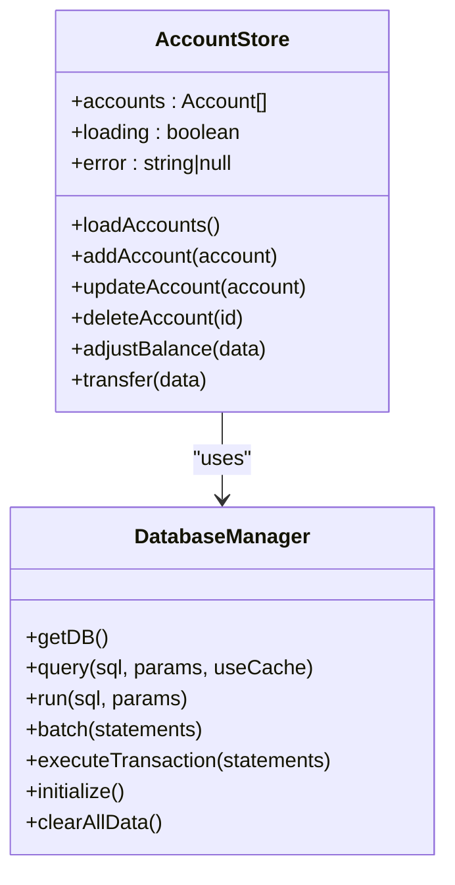
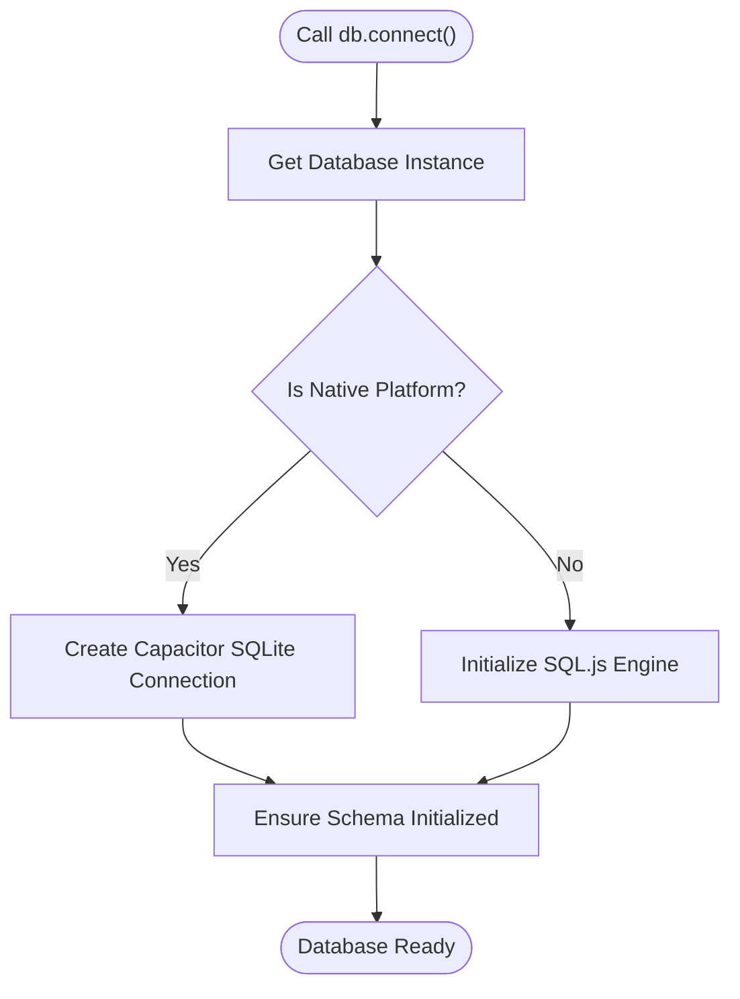
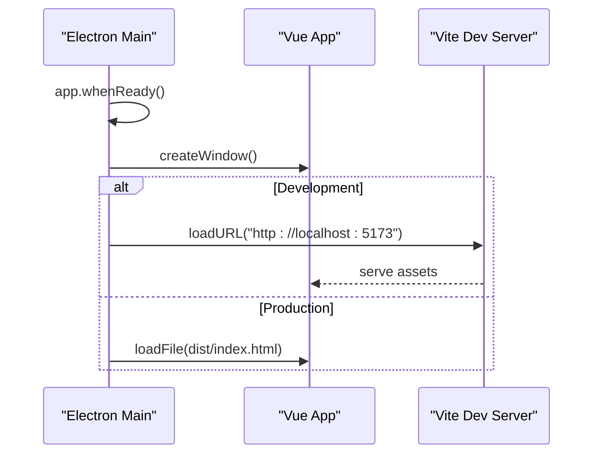
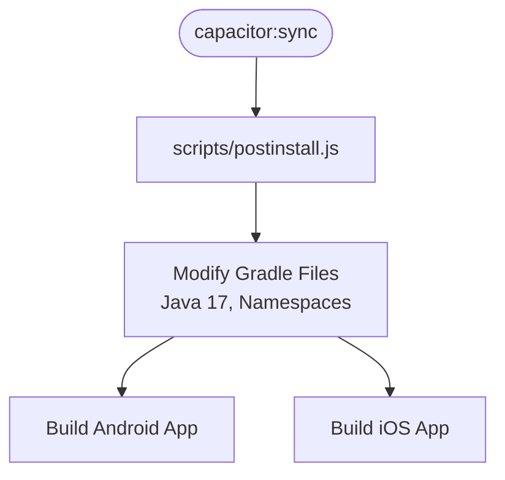
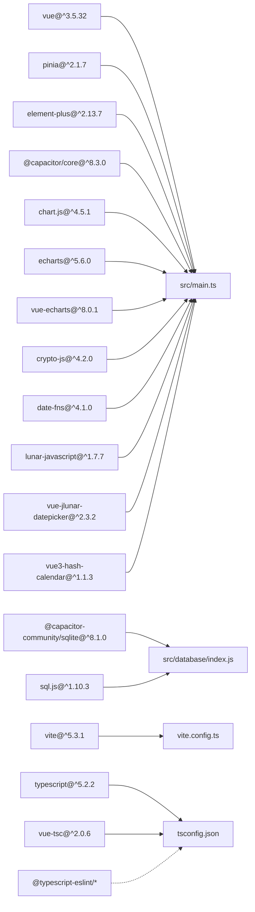
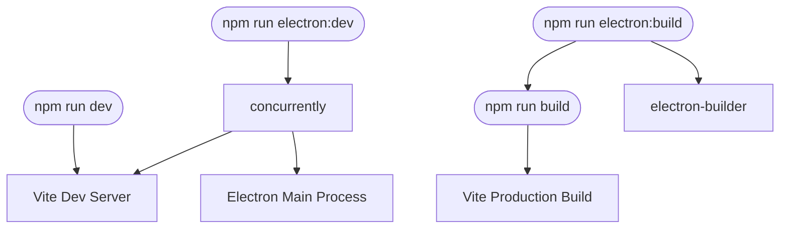

# Technology Stack

<cite>
**Referenced Files in This Document**
- [package.json](file://package.json)
- [vite.config.ts](file://vite.config.ts)
- [tsconfig.json](file://tsconfig.json)
- [tsconfig.node.json](file://tsconfig.node.json)
- [capacitor.config.json](file://capacitor.config.json)
- [electron/main.js](file://electron/main.js)
- [src/main.ts](file://src/main.ts)
- [src/App.vue](file://src/App.vue)
- [src/stores/account.ts](file://src/stores/account.ts)
- [src/database/index.js](file://src/database/index.js)
- [src/database/adapter.js](file://src/database/adapter.js)
- [scripts/postinstall.js](file://scripts/postinstall.js)
</cite>

## Table of Contents
1. [Introduction](#introduction)
2. [Project Structure](#project-structure)
3. [Core Technologies](#core-technologies)
4. [Architecture Overview](#architecture-overview)
5. [Detailed Component Analysis](#detailed-component-analysis)
6. [Dependency Analysis](#dependency-analysis)
7. [Development Workflow](#development-workflow)
8. [Performance Considerations](#performance-considerations)
9. [Troubleshooting Guide](#troubleshooting-guide)
10. [Conclusion](#conclusion)

## Introduction
This document provides a comprehensive technology stack overview for the Finance App. It covers the frontend framework (Vue.js 3 with TypeScript), build tooling (Vite), state management (Pinia), backend/database abstraction layer, desktop deployment (Electron), and cross-platform mobile/web deployment (Capacitor). It also explains TypeScript configuration, ESLint integration, third-party dependencies, version compatibility requirements, build optimization strategies, and development server capabilities.

## Project Structure
The project follows a modern monorepo-like structure with clear separation between Electron main/preload processes, Capacitor mobile/web assets, and the shared Vue application code.

**Diagram sources**
- [package.json:1-72](file://package.json#L1-L72)
- [vite.config.ts:1-11](file://vite.config.ts#L1-L11)
- [tsconfig.json:1-25](file://tsconfig.json#L1-L25)
- [tsconfig.node.json:1-10](file://tsconfig.node.json#L1-L10)
- [capacitor.config.json:1-23](file://capacitor.config.json#L1-L23)
- [scripts/postinstall.js:1-145](file://scripts/postinstall.js#L1-L145)
- [electron/main.js:1-70](file://electron/main.js#L1-L70)
- [src/main.ts:1-16](file://src/main.ts#L1-L16)
- [src/App.vue:1-195](file://src/App.vue#L1-L195)
- [src/stores/account.ts:1-265](file://src/stores/account.ts#L1-L265)
- [src/database/index.js:1-935](file://src/database/index.js#L1-L935)
- [src/database/adapter.js:1-34](file://src/database/adapter.js#L1-L34)

**Section sources**
- [package.json:1-72](file://package.json#L1-L72)
- [vite.config.ts:1-11](file://vite.config.ts#L1-L11)
- [tsconfig.json:1-25](file://tsconfig.json#L1-L25)
- [tsconfig.node.json:1-10](file://tsconfig.node.json#L1-L10)
- [capacitor.config.json:1-23](file://capacitor.config.json#L1-L23)
- [scripts/postinstall.js:1-145](file://scripts/postinstall.js#L1-L145)
- [electron/main.js:1-70](file://electron/main.js#L1-L70)
- [src/main.ts:1-16](file://src/main.ts#L1-L16)
- [src/App.vue:1-195](file://src/App.vue#L1-L195)
- [src/stores/account.ts:1-265](file://src/stores/account.ts#L1-L265)
- [src/database/index.js:1-935](file://src/database/index.js#L1-L935)
- [src/database/adapter.js:1-34](file://src/database/adapter.js#L1-L34)

## Core Technologies
This section documents the primary technologies and their roles in the Finance App architecture.

- Frontend Framework: Vue.js 3 with TypeScript
  - Provides reactive components, composition API, and strong typing for maintainable UI logic.
  - Integrated via Vite plugin and configured for bundler mode with strict TypeScript checks.

- Build Tool and Development Server: Vite
  - Fast development server with optimized HMR and production builds targeting ES2015.
  - Base path configured to support both development and Electron packaging scenarios.

- State Management: Pinia
  - Lightweight, idiomatic state management integrated at application bootstrap.
  - Used extensively in stores for domain-specific state (e.g., accounts, assets, transactions).

- Backend/Database Layer Abstraction: SQLite with dual runtime support
  - Shared database manager supports both Capacitor SQLite (native/mobile) and SQL.js (web/desktop).
  - Provides unified APIs for queries, runs, batches, transactions, caching, and persistence.

- Desktop Deployment: Electron
  - Main process creates BrowserWindow, loads dev server in development, and packaged HTML in production.
  - Preload script enables controlled Node/Electron APIs exposure to renderer.

- Cross-Platform Mobile/Web: Capacitor
  - Configured with Android build options set to Java 17 compatibility.
  - Plugins include SplashScreen and Keyboard with resize disabled for better UX.
  - Post-install script ensures Android Gradle build compatibility for SQLite and Keyboard plugins.

**Section sources**
- [src/main.ts:1-16](file://src/main.ts#L1-L16)
- [vite.config.ts:1-11](file://vite.config.ts#L1-L11)
- [tsconfig.json:1-25](file://tsconfig.json#L1-L25)
- [src/stores/account.ts:1-265](file://src/stores/account.ts#L1-L265)
- [src/database/index.js:1-935](file://src/database/index.js#L1-L935)
- [electron/main.js:1-70](file://electron/main.js#L1-L70)
- [capacitor.config.json:1-23](file://capacitor.config.json#L1-L23)
- [scripts/postinstall.js:1-145](file://scripts/postinstall.js#L1-L145)

## Architecture Overview
The Finance App employs a unidirectional data flow with a centralized database abstraction layer and platform-aware runtime selection.

**Diagram sources**
- [src/App.vue:1-195](file://src/App.vue#L1-L195)
- [src/stores/account.ts:1-265](file://src/stores/account.ts#L1-L265)
- [src/database/index.js:1-935](file://src/database/index.js#L1-L935)
- [src/database/adapter.js:1-34](file://src/database/adapter.js#L1-L34)
- [electron/main.js:1-70](file://electron/main.js#L1-L70)
- [capacitor.config.json:1-23](file://capacitor.config.json#L1-L23)

## Detailed Component Analysis

### Frontend Framework: Vue.js 3 with TypeScript
- Composition API and TypeScript provide type-safe component logic and reactive state.
- Application bootstraps Pinia and UI library (Element Plus) globally.
- Capacitor detection enables platform-specific behavior (e.g., keyboard resizing).

**Diagram sources**
- [src/App.vue:1-195](file://src/App.vue#L1-L195)
- [src/stores/account.ts:1-265](file://src/stores/account.ts#L1-L265)
- [src/database/index.js:1-935](file://src/database/index.js#L1-L935)

**Section sources**
- [src/main.ts:1-16](file://src/main.ts#L1-L16)
- [src/App.vue:1-195](file://src/App.vue#L1-L195)
- [tsconfig.json:1-25](file://tsconfig.json#L1-L25)

### State Management: Pinia
- Centralized stores manage domain-specific state and side effects.
- Example: Account store encapsulates CRUD operations and business logic for accounts and transactions.

**Diagram sources**
- [src/stores/account.ts:1-265](file://src/stores/account.ts#L1-L265)
- [src/database/index.js:1-935](file://src/database/index.js#L1-L935)

**Section sources**
- [src/stores/account.ts:1-265](file://src/stores/account.ts#L1-L265)

### Database Abstraction Layer
- Single DatabaseManager handles both native and web environments.
- Supports initialization, queries, runs, batching, transactions, caching, and persistence.
- Provides platform-specific optimizations and fallbacks.

**Diagram sources**
- [src/database/index.js:1-935](file://src/database/index.js#L1-L935)

**Section sources**
- [src/database/index.js:1-935](file://src/database/index.js#L1-L935)
- [src/database/adapter.js:1-34](file://src/database/adapter.js#L1-L34)

### Desktop Deployment: Electron
- Main process creates BrowserWindow and loads either dev server or packaged HTML.
- Development mode connects to Vite dev server on localhost.
- Production mode serves prebuilt index.html from dist.

**Diagram sources**
- [electron/main.js:1-70](file://electron/main.js#L1-L70)

**Section sources**
- [electron/main.js:1-70](file://electron/main.js#L1-L70)

### Cross-Platform Deployment: Capacitor
- Capacitor configuration defines app identifiers, web directory, and Android build options.
- Post-install script adjusts Gradle build files to use Java 17 and required namespaces for SQLite and Keyboard plugins.

**Diagram sources**
- [capacitor.config.json:1-23](file://capacitor.config.json#L1-L23)
- [scripts/postinstall.js:1-145](file://scripts/postinstall.js#L1-L145)

**Section sources**
- [capacitor.config.json:1-23](file://capacitor.config.json#L1-L23)
- [scripts/postinstall.js:1-145](file://scripts/postinstall.js#L1-L145)

## Dependency Analysis
The project maintains a clean separation of concerns with explicit dependencies for each layer.

**Diagram sources**
- [package.json:19-47](file://package.json#L19-L47)
- [vite.config.ts:1-11](file://vite.config.ts#L1-L11)
- [tsconfig.json:1-25](file://tsconfig.json#L1-L25)

**Section sources**
- [package.json:19-47](file://package.json#L19-L47)
- [vite.config.ts:1-11](file://vite.config.ts#L1-L11)
- [tsconfig.json:1-25](file://tsconfig.json#L1-L25)

## Development Workflow
- Scripts orchestrate development, building, previewing, Electron development, and Capacitor workflows.
- Vite provides fast HMR and optimized builds targeting ES2015.
- TypeScript strict mode enforces robust type safety during development.
- Electron development combines Vite dev server with Electron main process.

**Diagram sources**
- [package.json:7-17](file://package.json#L7-L17)
- [vite.config.ts:1-11](file://vite.config.ts#L1-L11)
- [electron/main.js:1-70](file://electron/main.js#L1-L70)

**Section sources**
- [package.json:7-17](file://package.json#L7-L17)
- [vite.config.ts:1-11](file://vite.config.ts#L1-L11)
- [electron/main.js:1-70](file://electron/main.js#L1-L70)

## Performance Considerations
- Database Manager optimizations include single connection reuse, query caching, throttled persistence for web, and batch/transaction support.
- Index creation on frequently queried columns improves query performance.
- Capacitor SQLite provides native performance on mobile devices; SQL.js offers a pure-web fallback with localStorage persistence.

[No sources needed since this section provides general guidance]

## Troubleshooting Guide
- Electron dev server not loading in development:
  - Verify Vite dev server port and CORS settings.
  - Confirm Electron main process loads local URL in development mode.

- Capacitor Android build failures:
  - Ensure Java 17 compatibility and Gradle namespace configurations are applied by the postinstall script.

- Database initialization errors:
  - Check platform detection and schema creation steps.
  - Verify Capacitor SQLite plugin installation and permissions.

**Section sources**
- [electron/main.js:31-39](file://electron/main.js#L31-L39)
- [scripts/postinstall.js:40-145](file://scripts/postinstall.js#L40-L145)
- [src/database/index.js:420-776](file://src/database/index.js#L420-L776)

## Conclusion
The Finance App leverages a cohesive technology stack combining Vue.js 3 with TypeScript, Vite for rapid development, Pinia for state management, and a unified database abstraction supporting both native and web environments. Electron and Capacitor enable seamless desktop and cross-platform deployments, respectively. The TypeScript configuration enforces strictness, while the build tooling and scripts streamline development and release workflows.