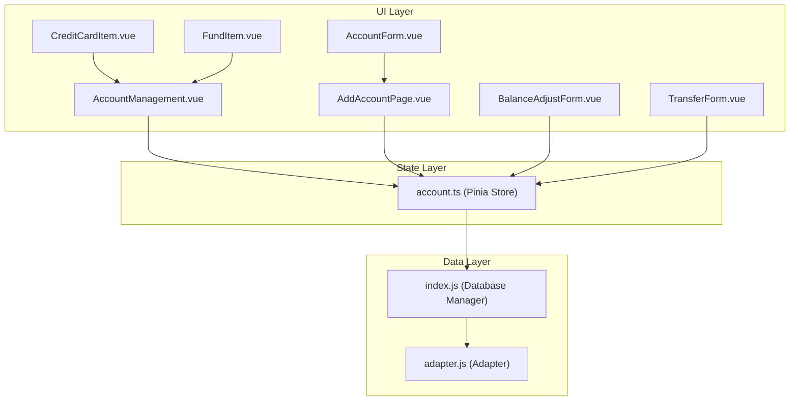
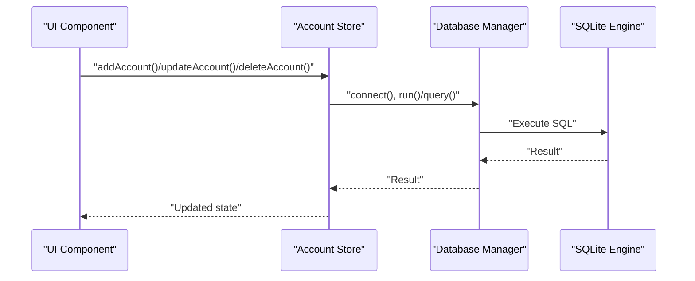
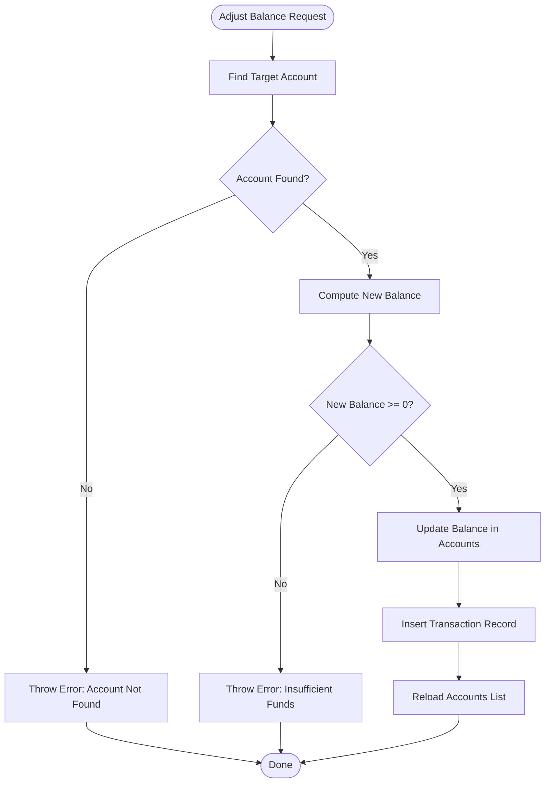
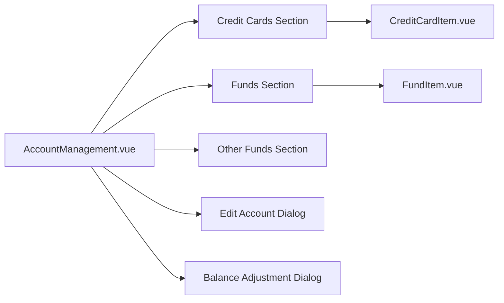
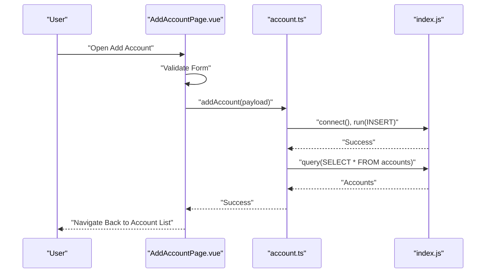
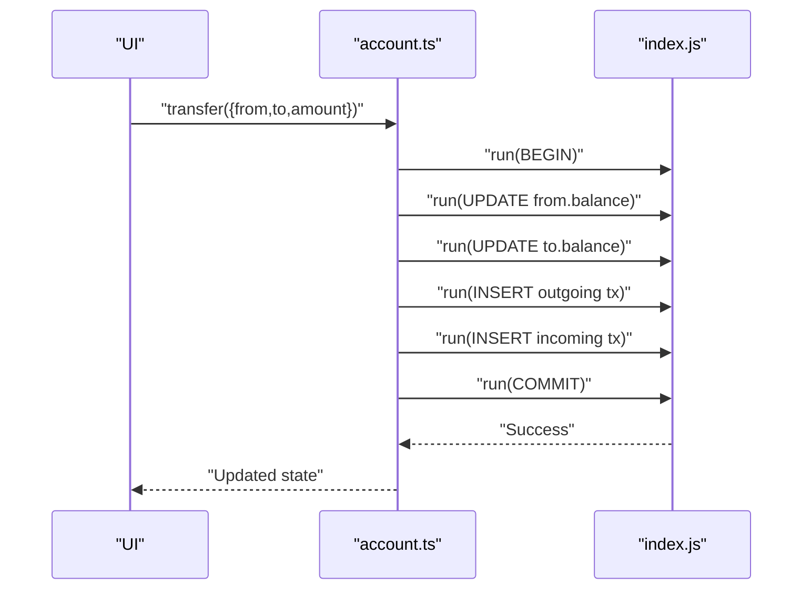
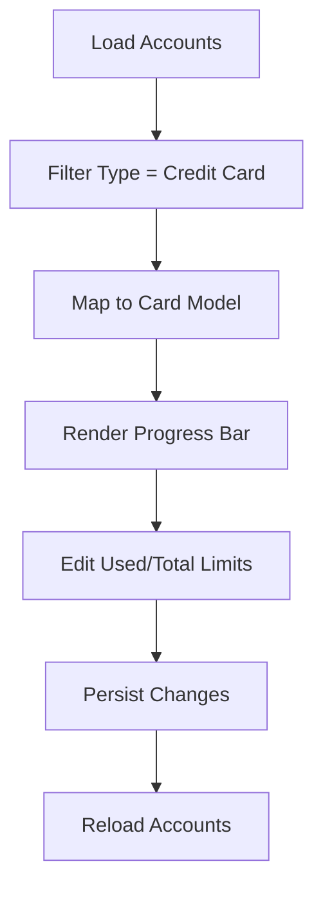
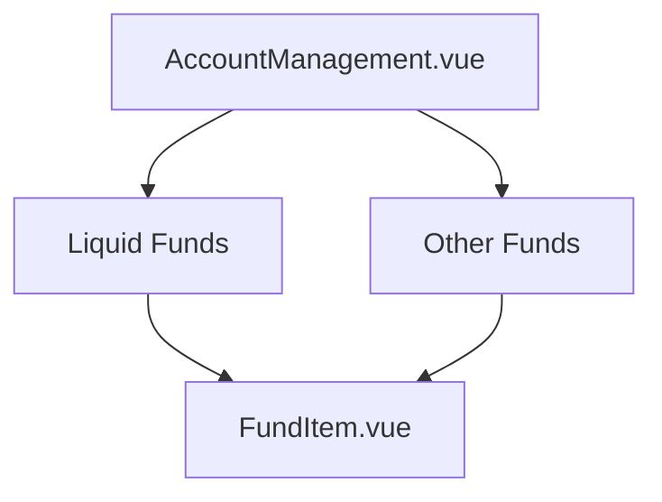
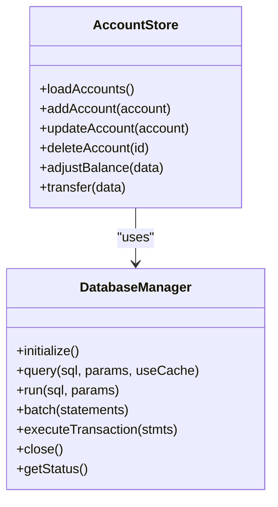
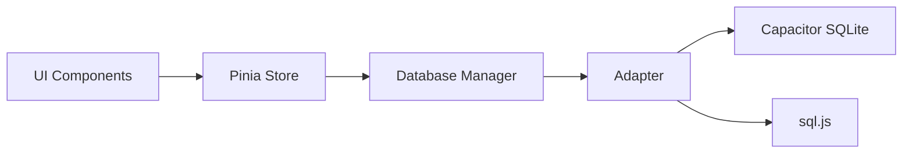

# Account Management

<cite>
**Referenced Files in This Document**
- [account.ts](file://src/stores/account.ts)
- [AccountManagement.vue](file://src/components/mobile/account/AccountManagement.vue)
- [AddAccountPage.vue](file://src/components/mobile/account/AddAccountPage.vue)
- [AccountForm.vue](file://src/components/mobile/account/AccountForm.vue)
- [BalanceAdjustForm.vue](file://src/components/mobile/account/BalanceAdjustForm.vue)
- [TransferForm.vue](file://src/components/mobile/account/TransferForm.vue)
- [CreditCardItem.vue](file://src/components/mobile/account/CreditCardItem.vue)
- [FundItem.vue](file://src/components/mobile/account/FundItem.vue)
- [index.js](file://src/database/index.js)
- [adapter.js](file://src/database/adapter.js)
- [main.ts](file://src/main.ts)
- [App.vue](file://src/App.vue)
- [DatabaseViewer.vue](file://src/components/mobile/DatabaseViewer.vue)
</cite>

## Table of Contents
1. [Introduction](#introduction)
2. [Project Structure](#project-structure)
3. [Core Components](#core-components)
4. [Architecture Overview](#architecture-overview)
5. [Detailed Component Analysis](#detailed-component-analysis)
6. [Dependency Analysis](#dependency-analysis)
7. [Performance Considerations](#performance-considerations)
8. [Troubleshooting Guide](#troubleshooting-guide)
9. [Conclusion](#conclusion)
10. [Appendices](#appendices)

## Introduction
This document provides comprehensive documentation for the Account Management feature of the finance application. It covers the account creation workflow, supported account types, lifecycle management, balance adjustments, transfers, listing interface, credit card management, and data persistence patterns. It also includes practical examples and advanced configuration scenarios.

## Project Structure
The Account Management feature spans Vue components, a Pinia store, and a cross-platform database layer:
- Vue components render the UI for account listing, creation, editing, balance adjustments, and transfers.
- The Pinia store encapsulates account CRUD operations, balance adjustments, and internal transfers.
- The database layer abstracts SQLite connectivity across native and web environments.

**Diagram sources**
- [AccountManagement.vue:158-377](file://src/components/mobile/account/AccountManagement.vue#L158-L377)
- [AddAccountPage.vue:44-96](file://src/components/mobile/account/AddAccountPage.vue#L44-L96)
- [CreditCardItem.vue:22-66](file://src/components/mobile/account/CreditCardItem.vue#L22-L66)
- [FundItem.vue:11-22](file://src/components/mobile/account/FundItem.vue#L11-L22)
- [BalanceAdjustForm.vue:19-38](file://src/components/mobile/account/BalanceAdjustForm.vue#L19-L38)
- [TransferForm.vue:25-54](file://src/components/mobile/account/TransferForm.vue#L25-L54)
- [AccountForm.vue:21-41](file://src/components/mobile/account/AccountForm.vue#L21-L41)
- [account.ts:27-264](file://src/stores/account.ts#L27-L264)
- [index.js:21-891](file://src/database/index.js#L21-L891)
- [adapter.js:14-33](file://src/database/adapter.js#L14-L33)

**Section sources**
- [main.ts:1-16](file://src/main.ts#L1-L16)
- [App.vue:33-89](file://src/App.vue#L33-L89)

## Core Components
- Account Store: Manages account data, CRUD operations, balance adjustments, and internal transfers with database persistence.
- Account Management UI: Renders account cards, credit cards, funds, and provides dialogs for editing and balance adjustments.
- Database Manager: Provides unified SQLite access across platforms with initialization, queries, runs, batching, and transactions.
- Adapter: Selects the appropriate database implementation per platform.

**Section sources**
- [account.ts:27-264](file://src/stores/account.ts#L27-L264)
- [AccountManagement.vue:158-377](file://src/components/mobile/account/AccountManagement.vue#L158-L377)
- [index.js:21-891](file://src/database/index.js#L21-L891)
- [adapter.js:14-33](file://src/database/adapter.js#L14-L33)

## Architecture Overview
The system follows a layered architecture:
- UI components trigger actions via the Pinia store.
- The store connects to the database manager to execute SQL statements.
- The database manager abstracts platform-specific SQLite implementations.

**Diagram sources**
- [account.ts:59-139](file://src/stores/account.ts#L59-L139)
- [index.js:272-309](file://src/database/index.js#L272-L309)

## Detailed Component Analysis

### Account Store (Pinia)
Responsibilities:
- Load accounts from the database.
- Add/update/delete accounts.
- Adjust balances and record transaction entries.
- Perform internal transfers with transaction safety.

Key behaviors:
- Uses database manager for all operations.
- Enforces business rules (e.g., non-negative balance during adjustments).
- Maintains loading and error states.

**Diagram sources**
- [account.ts:145-177](file://src/stores/account.ts#L145-L177)

**Section sources**
- [account.ts:27-264](file://src/stores/account.ts#L27-L264)

### Account Listing Interface
Highlights:
- Net worth summary, asset/liability stats, and borrow/lend metrics.
- Expandable sections for credit cards and funds (including “other funds”).
- Floating action menu for quick actions (add account, internal transfer, database viewer).
- Dialogs for editing and balance adjustments.

**Diagram sources**
- [AccountManagement.vue:158-377](file://src/components/mobile/account/AccountManagement.vue#L158-L377)
- [CreditCardItem.vue:22-66](file://src/components/mobile/account/CreditCardItem.vue#L22-L66)
- [FundItem.vue:11-22](file://src/components/mobile/account/FundItem.vue#L11-L22)

**Section sources**
- [AccountManagement.vue:158-377](file://src/components/mobile/account/AccountManagement.vue#L158-L377)

### Account Creation Workflow
End-to-end flow:
- User navigates to Add Account page.
- Form validates required fields and sets defaults based on type.
- Store persists the new account and refreshes the list.

**Diagram sources**
- [AddAccountPage.vue:75-96](file://src/components/mobile/account/AddAccountPage.vue#L75-L96)
- [account.ts:59-100](file://src/stores/account.ts#L59-L100)
- [index.js:272-309](file://src/database/index.js#L272-L309)

**Section sources**
- [AddAccountPage.vue:44-96](file://src/components/mobile/account/AddAccountPage.vue#L44-L96)
- [AccountForm.vue:21-41](file://src/components/mobile/account/AccountForm.vue#L21-L41)

### Balance Adjustment and Transfer Mechanisms
- Balance Adjustment:
  - Validates account existence and non-negative resulting balance.
  - Updates account balance and inserts a transaction record.
- Internal Transfer:
  - Validates distinct accounts and sufficient funds.
  - Executes a transaction block to update both accounts atomically.
  - Records two transaction entries (outgoing and incoming).

**Diagram sources**
- [account.ts:183-262](file://src/stores/account.ts#L183-L262)
- [index.js:272-309](file://src/database/index.js#L272-L309)

**Section sources**
- [account.ts:145-177](file://src/stores/account.ts#L145-L177)
- [account.ts:183-262](file://src/stores/account.ts#L183-L262)
- [BalanceAdjustForm.vue:19-38](file://src/components/mobile/account/BalanceAdjustForm.vue#L19-L38)
- [TransferForm.vue:25-54](file://src/components/mobile/account/TransferForm.vue#L25-L54)

### Credit Card Management
- Displays credit cards with used/total limits and progress visualization.
- Supports editing of credit card details (name, used limit, total limit).
- Computes utilization percentage for visual indicators.

**Diagram sources**
- [AccountManagement.vue:239-248](file://src/components/mobile/account/AccountManagement.vue#L239-L248)
- [CreditCardItem.vue:58-61](file://src/components/mobile/account/CreditCardItem.vue#L58-L61)

**Section sources**
- [AccountManagement.vue:239-248](file://src/components/mobile/account/AccountManagement.vue#L239-L248)
- [CreditCardItem.vue:22-66](file://src/components/mobile/account/CreditCardItem.vue#L22-L66)

### Fund Management (Funds and Investment Accounts)
- Distinguishes between liquid funds and other funds.
- Renders fund items with name and balance.
- Supports adding funds via dedicated pages and linking to accounts.

**Diagram sources**
- [AccountManagement.vue:250-268](file://src/components/mobile/account/AccountManagement.vue#L250-L268)
- [FundItem.vue:11-22](file://src/components/mobile/account/FundItem.vue#L11-L22)

**Section sources**
- [AccountManagement.vue:250-268](file://src/components/mobile/account/AccountManagement.vue#L250-L268)
- [FundItem.vue:11-22](file://src/components/mobile/account/FundItem.vue#L11-L22)

### Data Persistence Patterns
- Database Initialization:
  - Creates tables for accounts, transactions, assets, stocks, funds, liabilities, goals, health reports, and categories.
  - Adds indexes for performance and performs schema migrations for existing users.
- Cross-Platform Support:
  - Native (Capacitor SQLite) and Web (sql.js) modes.
  - Single adapter abstraction selects the correct implementation.
- Transactions and Batch Operations:
  - Uses BEGIN/COMMIT/ROLLBACK for atomicity.
  - Batch executes multiple statements efficiently.

**Diagram sources**
- [index.js:420-776](file://src/database/index.js#L420-L776)
- [account.ts:38-139](file://src/stores/account.ts#L38-L139)

**Section sources**
- [index.js:420-776](file://src/database/index.js#L420-L776)
- [adapter.js:14-33](file://src/database/adapter.js#L14-L33)

## Dependency Analysis
- UI depends on the Pinia store for state and actions.
- Store depends on the database manager for persistence.
- Database manager abstracts platform differences via the adapter.

**Diagram sources**
- [AccountManagement.vue:158-168](file://src/components/mobile/account/AccountManagement.vue#L158-L168)
- [account.ts:5-6](file://src/stores/account.ts#L5-L6)
- [index.js:8-10](file://src/database/index.js#L8-L10)
- [adapter.js:14-24](file://src/database/adapter.js#L14-L24)

**Section sources**
- [App.vue:64-89](file://src/App.vue#L64-L89)

## Performance Considerations
- Indexes are created on frequently queried columns to improve lookup performance.
- Query caching reduces repeated reads for identical queries.
- Debounced persistence for Web mode prevents excessive writes.
- Batch operations and transactions minimize round-trips and ensure consistency.

[No sources needed since this section provides general guidance]

## Troubleshooting Guide
Common issues and resolutions:
- Account not found during adjustment or transfer:
  - Verify the account exists and IDs are correct.
- Insufficient funds:
  - Ensure the source account has sufficient balance before transferring.
- Transaction failures:
  - Check for proper BEGIN/COMMIT/ROLLBACK handling and re-run the operation.
- Platform-specific errors:
  - Confirm Capacitor SQLite plugin availability on native and sql.js initialization on Web.

**Section sources**
- [account.ts:151-159](file://src/stores/account.ts#L151-L159)
- [account.ts:196-203](file://src/stores/account.ts#L196-L203)
- [index.js:354-374](file://src/database/index.js#L354-L374)

## Conclusion
The Account Management feature provides a robust foundation for managing accounts, balances, and transfers with strong data persistence and cross-platform compatibility. The modular design enables easy extension for advanced scenarios such as credit card statement processing and fund management integrations.

## Appendices

### Practical Examples
- Create a new account:
  - Navigate to Add Account, select type, enter details, submit, and observe the updated list.
- Adjust account balance:
  - Open balance adjustment dialog, choose adjustment type, enter amount, submit, and verify transaction records.
- Perform an internal transfer:
  - Choose from/to accounts, enter amount, submit, and confirm both transaction entries appear.

**Section sources**
- [AddAccountPage.vue:75-96](file://src/components/mobile/account/AddAccountPage.vue#L75-L96)
- [BalanceAdjustForm.vue:19-38](file://src/components/mobile/account/BalanceAdjustForm.vue#L19-L38)
- [TransferForm.vue:25-54](file://src/components/mobile/account/TransferForm.vue#L25-L54)

### Advanced Configuration Scenarios
- Platform selection:
  - The adapter automatically selects Capacitor SQLite for native and sql.js for Web.
- Schema evolution:
  - The database manager applies migrations for new columns and indices on existing installations.
- Data export/import:
  - Use the database viewer to inspect tables and clear data when needed.

**Section sources**
- [adapter.js:14-33](file://src/database/adapter.js#L14-L33)
- [index.js:694-766](file://src/database/index.js#L694-L766)
- [DatabaseViewer.vue:79-122](file://src/components/mobile/DatabaseViewer.vue#L79-L122)