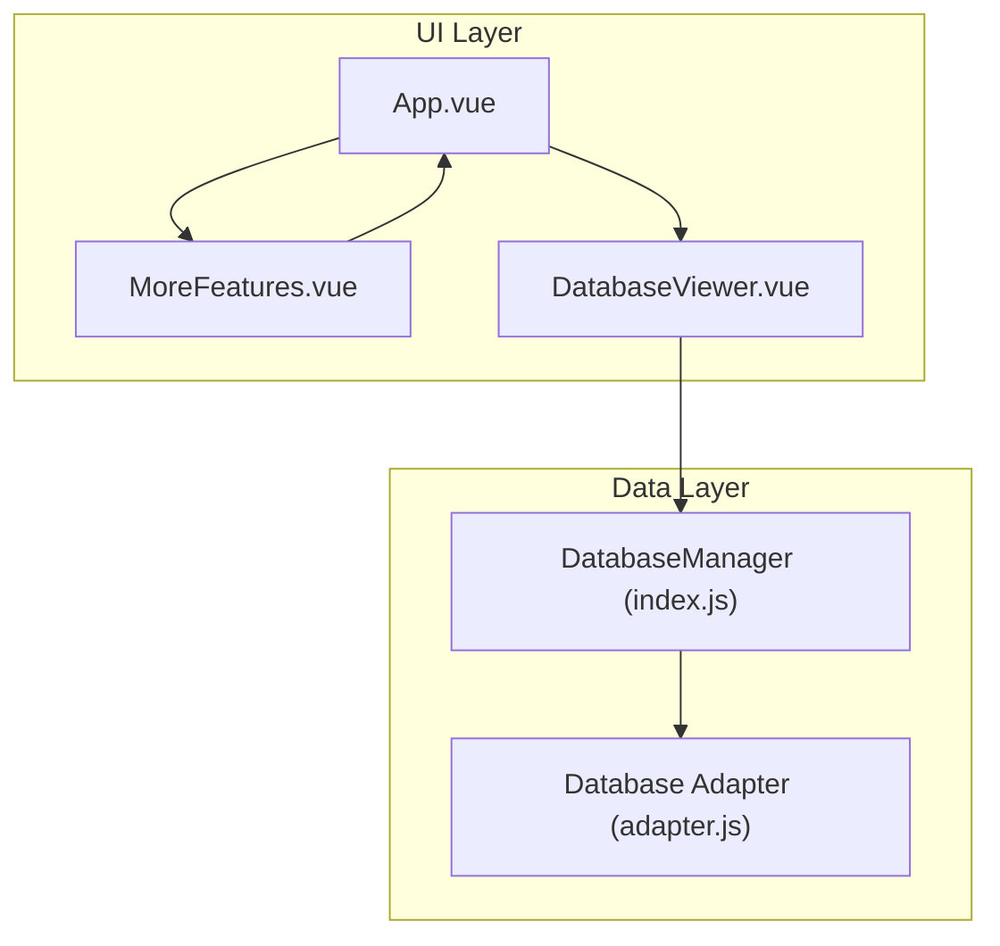
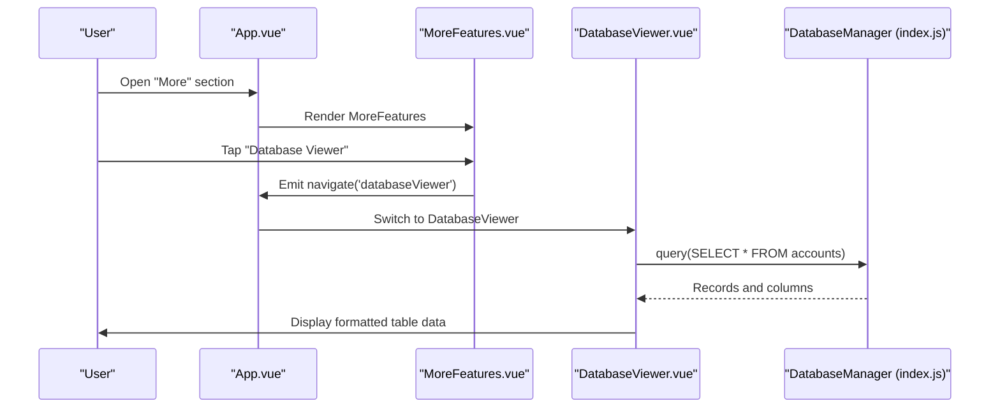
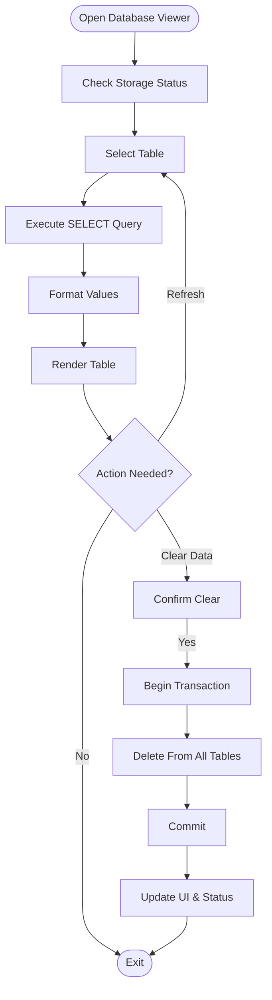
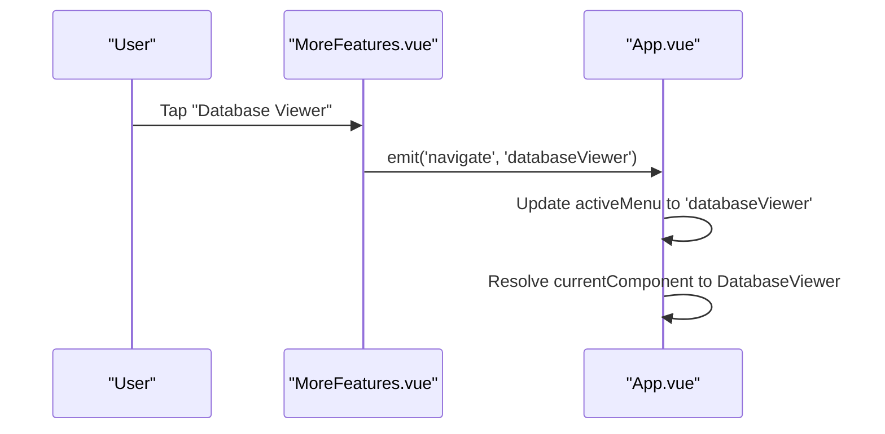
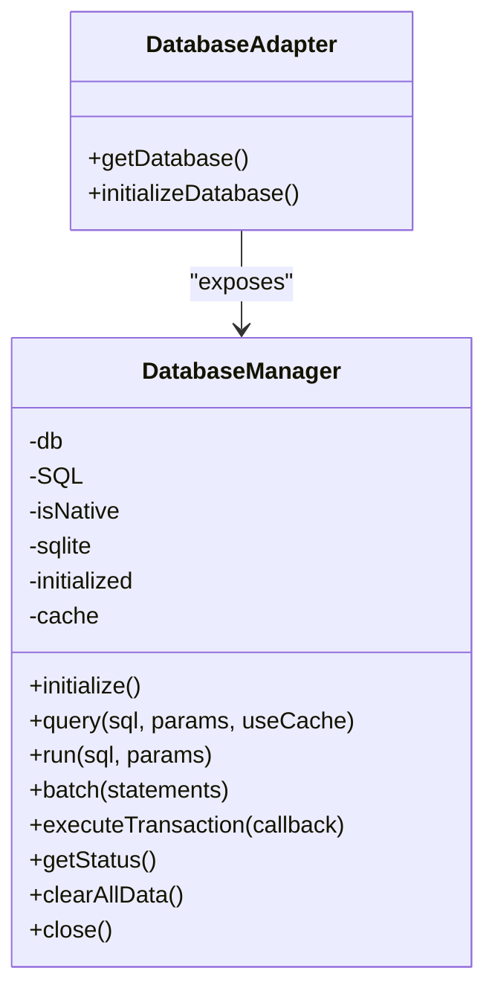
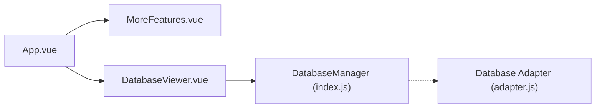

# Additional Features

<cite>
**Referenced Files in This Document**
- [App.vue](file://src/App.vue)
- [MoreFeatures.vue](file://src/components/mobile/more/MoreFeatures.vue)
- [DatabaseViewer.vue](file://src/components/mobile/DatabaseViewer.vue)
- [index.js](file://src/database/index.js)
- [adapter.js](file://src/database/adapter.js)
- [categoryService.ts](file://src/services/categoryService.ts)
- [AccountManagement.vue](file://src/components/mobile/account/AccountManagement.vue)
- [dictionaries.ts](file://src/utils/dictionaries.ts)
- [preload.js](file://electron/preload.js)
</cite>

## Table of Contents
1. [Introduction](#introduction)
2. [Project Structure](#project-structure)
3. [Core Components](#core-components)
4. [Architecture Overview](#architecture-overview)
5. [Detailed Component Analysis](#detailed-component-analysis)
6. [Dependency Analysis](#dependency-analysis)
7. [Performance Considerations](#performance-considerations)
8. [Troubleshooting Guide](#troubleshooting-guide)
9. [Conclusion](#conclusion)

## Introduction
This document covers the Additional Features and Utilities section of the finance application. It focuses on the Database Viewer interface for inspecting application data, querying stored information, and debugging data operations. It also explains the feature organization and navigation within the more section, utility functions, system information displays, and developer tools. Access controls, feature availability, and integration with core application functionality are documented, along with practical examples for power users and system administrators.

## Project Structure
The Additional Features area is organized around:
- A "More" landing page that groups related utilities and quick-access features
- A dedicated Database Viewer for inspecting and managing application data
- A shared database abstraction layer supporting both native and web environments
- Navigation integration from the main app shell

**Diagram sources**
- [App.vue:65-89](file://src/App.vue#L65-L89)
- [MoreFeatures.vue:1-52](file://src/components/mobile/more/MoreFeatures.vue#L1-L52)
- [DatabaseViewer.vue:100-105](file://src/components/mobile/DatabaseViewer.vue#L100-L105)
- [index.js:21-32](file://src/database/index.js#L21-L32)
- [adapter.js:14-24](file://src/database/adapter.js#L14-L24)

**Section sources**
- [App.vue:65-89](file://src/App.vue#L65-L89)
- [MoreFeatures.vue:1-52](file://src/components/mobile/more/MoreFeatures.vue#L1-L52)
- [DatabaseViewer.vue:100-105](file://src/components/mobile/DatabaseViewer.vue#L100-L105)
- [index.js:21-32](file://src/database/index.js#L21-L32)
- [adapter.js:14-24](file://src/database/adapter.js#L14-L24)

## Core Components
- MoreFeatures: Provides quick navigation to financial utilities and sandbox features.
- DatabaseViewer: Allows inspection of core data tables, status checks, and safe data clearing.
- DatabaseManager: Centralized SQLite abstraction with environment-aware persistence and caching.
- Database Adapter: Platform detection and initialization bridge.

Key responsibilities:
- MoreFeatures: Emits navigation events to route to dashboard, knowledge, goals, sandbox, and database viewer.
- DatabaseViewer: Loads selected table data, formats values, checks storage status, and clears data safely.
- DatabaseManager: Handles connection pooling, environment-specific persistence, caching, and transactional operations.
- Database Adapter: Exposes a unified interface for database operations across platforms.

**Section sources**
- [MoreFeatures.vue:58-107](file://src/components/mobile/more/MoreFeatures.vue#L58-L107)
- [DatabaseViewer.vue:100-237](file://src/components/mobile/DatabaseViewer.vue#L100-L237)
- [index.js:21-891](file://src/database/index.js#L21-L891)
- [adapter.js:14-33](file://src/database/adapter.js#L14-L33)

## Architecture Overview
The Additional Features integrate with the main application via a central navigation controller. The Database Viewer relies on the DatabaseManager singleton to abstract platform differences and provide a consistent API for queries, runs, batches, and transactions.

**Diagram sources**
- [App.vue:119-137](file://src/App.vue#L119-L137)
- [MoreFeatures.vue:105-107](file://src/components/mobile/more/MoreFeatures.vue#L105-L107)
- [DatabaseViewer.vue:142-166](file://src/components/mobile/DatabaseViewer.vue#L142-L166)
- [index.js:199-264](file://src/database/index.js#L199-L264)

## Detailed Component Analysis

### Database Viewer
The Database Viewer enables power users and administrators to:
- Inspect core tables (accounts, transactions, categories, assets, stocks, funds, liabilities, financial goals)
- View database status (native vs memory mode, persistence status)
- Refresh data and clear all data safely with a transactional approach
- Check local storage footprint for SQLite persistence

**Diagram sources**
- [DatabaseViewer.vue:175-231](file://src/components/mobile/DatabaseViewer.vue#L175-L231)
- [index.js:839-890](file://src/database/index.js#L839-L890)

Operational highlights:
- Environment awareness: Determines whether running in native or web mode and updates UI accordingly.
- Safe clearing: Uses a transactional block to remove data from all tables and ensures rollback on failure.
- Persistence: On web, exports and saves the database to localStorage with throttled persistence.
- Caching: Leverages DatabaseManager query caching for repeated reads.

**Section sources**
- [DatabaseViewer.vue:115-237](file://src/components/mobile/DatabaseViewer.vue#L115-L237)
- [index.js:199-264](file://src/database/index.js#L199-L264)
- [index.js:839-890](file://src/database/index.js#L839-L890)

### More Features Navigation
The More section organizes quick-access features and routes to specialized pages:
- Dashboard, Knowledge, Goals, Sandbox
- Database Viewer integration via navigation event emission

**Diagram sources**
- [MoreFeatures.vue:105-107](file://src/components/mobile/more/MoreFeatures.vue#L105-L107)
- [App.vue:119-137](file://src/App.vue#L119-L137)
- [App.vue:65-89](file://src/App.vue#L65-L89)

**Section sources**
- [MoreFeatures.vue:26-50](file://src/components/mobile/more/MoreFeatures.vue#L26-L50)
- [MoreFeatures.vue:105-107](file://src/components/mobile/more/MoreFeatures.vue#L105-L107)
- [App.vue:65-89](file://src/App.vue#L65-L89)

### Database Abstraction and Utilities
The database layer provides:
- Single DatabaseManager instance with connection pooling and environment detection
- Unified query/run/batch/transaction APIs
- Index creation and schema migration support
- Status reporting and graceful fallbacks

**Diagram sources**
- [index.js:21-891](file://src/database/index.js#L21-L891)
- [adapter.js:14-33](file://src/database/adapter.js#L14-L33)

**Section sources**
- [index.js:21-891](file://src/database/index.js#L21-L891)
- [adapter.js:14-33](file://src/database/adapter.js#L14-L33)

### Utility Functions and System Information
- Dictionary utilities: Centralized lists for account types, liability types, repayment methods, goal types, asset types, transaction types, and adjustment types.
- Database health checks: Services can verify connectivity and fall back to memory mode when needed.
- Electron integration: Preload exposes a minimal IPC bridge for desktop scenarios.

Practical usage examples:
- Power users can use the Database Viewer to audit balances, transaction volumes, and asset holdings across tables.
- Administrators can trigger a full data reset using the transactional clear operation and confirm persistence status afterward.
- Developers can leverage the unified database APIs to build custom reports or maintenance tools.

**Section sources**
- [dictionaries.ts:6-90](file://src/utils/dictionaries.ts#L6-L90)
- [categoryService.ts:181-194](file://src/services/categoryService.ts#L181-L194)
- [preload.js:1-6](file://electron/preload.js#L1-L6)

## Dependency Analysis
- App.vue maps the 'databaseViewer' key to the DatabaseViewer component and handles navigation.
- MoreFeatures.vue emits navigation events to the parent for routing.
- DatabaseViewer.vue depends on the database module for queries and status checks.
- DatabaseManager encapsulates environment-specific logic and provides a stable API surface.
- Database adapter bridges platform differences.

**Diagram sources**
- [App.vue:65-89](file://src/App.vue#L65-L89)
- [MoreFeatures.vue:105-107](file://src/components/mobile/more/MoreFeatures.vue#L105-L107)
- [DatabaseViewer.vue:103-105](file://src/components/mobile/DatabaseViewer.vue#L103-L105)
- [index.js:21-32](file://src/database/index.js#L21-L32)
- [adapter.js:14-24](file://src/database/adapter.js#L14-L24)

**Section sources**
- [App.vue:65-89](file://src/App.vue#L65-L89)
- [MoreFeatures.vue:105-107](file://src/components/mobile/more/MoreFeatures.vue#L105-L107)
- [DatabaseViewer.vue:103-105](file://src/components/mobile/DatabaseViewer.vue#L103-L105)
- [index.js:21-32](file://src/database/index.js#L21-L32)
- [adapter.js:14-24](file://src/database/adapter.js#L14-L24)

## Performance Considerations
- Query caching: DatabaseManager caches query results keyed by SQL and parameters to reduce redundant work.
- Batch operations: Use batch and transactional execution for bulk inserts/updates/deletes.
- Indexing: Predefined indexes on frequently queried columns improve read performance.
- Throttled persistence: Web environment persists database snapshots with a throttle to avoid excessive writes.
- Connection pooling: Reuse a single connection instance to minimize overhead.

Recommendations:
- Prefer batch and transactional operations for administrative tasks.
- Use query caching for repeated reads during a session.
- Monitor cache size via status reporting and clear cache after destructive operations.

**Section sources**
- [index.js:199-264](file://src/database/index.js#L199-L264)
- [index.js:316-347](file://src/database/index.js#L316-L347)
- [index.js:676-688](file://src/database/index.js#L676-L688)
- [index.js:379-391](file://src/database/index.js#L379-L391)
- [index.js:826-834](file://src/database/index.js#L826-L834)

## Troubleshooting Guide
Common issues and resolutions:
- Database connection failures: The service can check connectivity and fall back to memory mode gracefully. Verify platform detection and environment-specific initialization.
- Data not persisting on web: Ensure localStorage is available and the database is exported periodically. Check the status indicators in the Database Viewer.
- Transaction errors during clear: The clearAllData method wraps deletions in a transaction and rolls back on failure. Review logs for specific table issues.
- Navigation not working: Confirm the 'databaseViewer' key is mapped in the component resolver and that the emit event is handled by the parent.

**Section sources**
- [categoryService.ts:181-194](file://src/services/categoryService.ts#L181-L194)
- [DatabaseViewer.vue:175-199](file://src/components/mobile/DatabaseViewer.vue#L175-L199)
- [index.js:839-890](file://src/database/index.js#L839-L890)
- [App.vue:65-89](file://src/App.vue#L65-L89)

## Conclusion
The Additional Features section provides a cohesive set of utilities centered on data visibility and administrative control. The Database Viewer offers a powerful, safe way to inspect and manage application data, backed by a robust, environment-aware database abstraction. Together with the More section navigation and utility dictionaries, these components enable both power users and administrators to maintain and debug the application effectively.