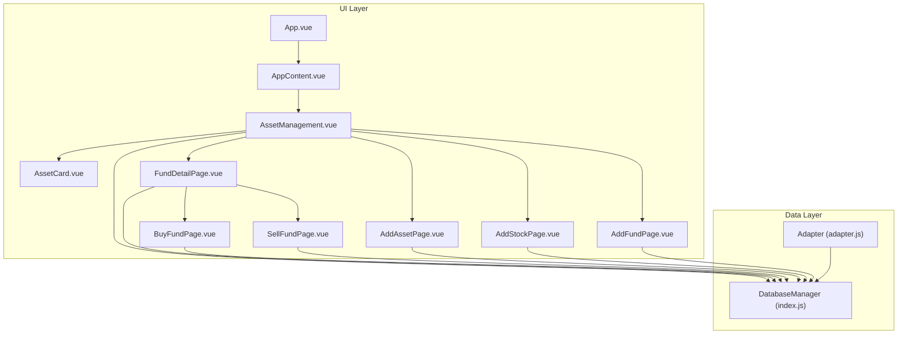
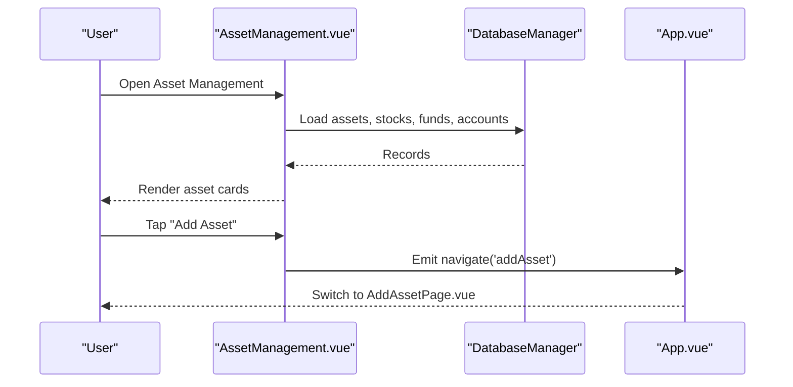
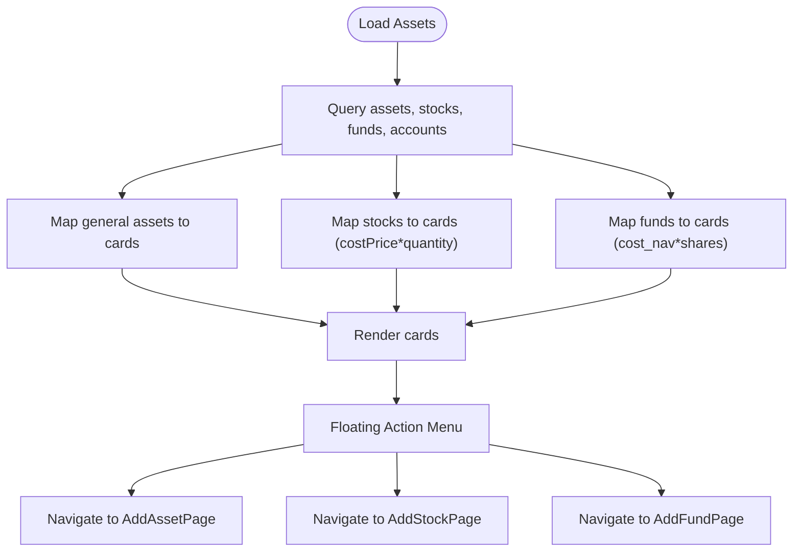
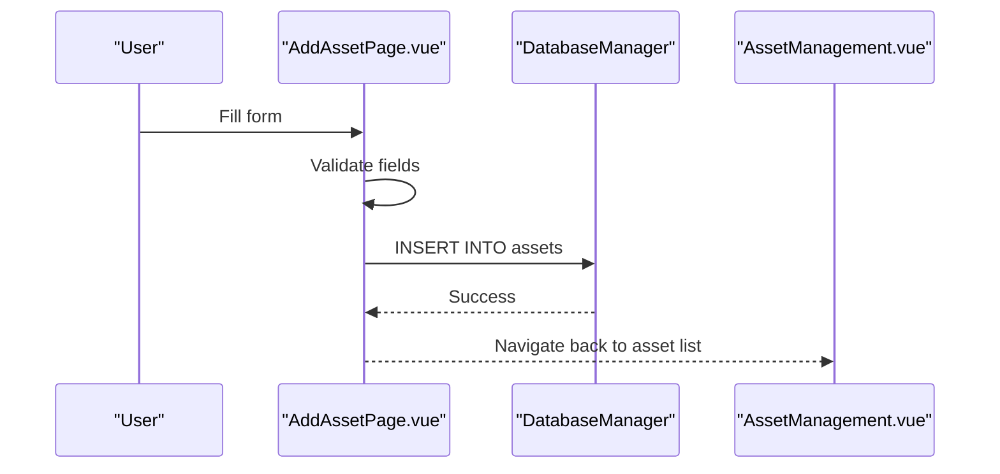
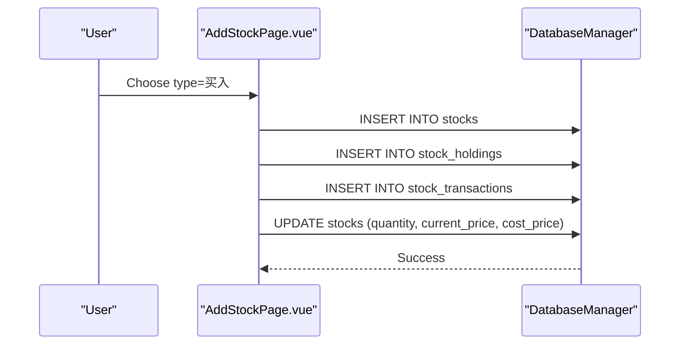
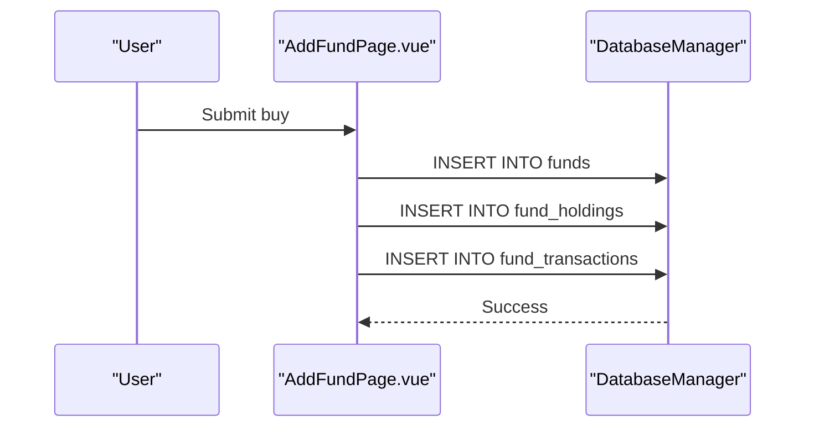
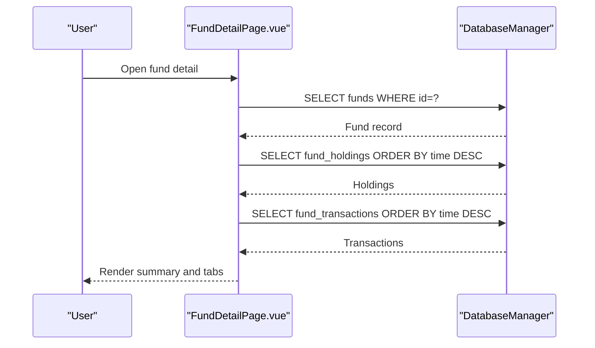
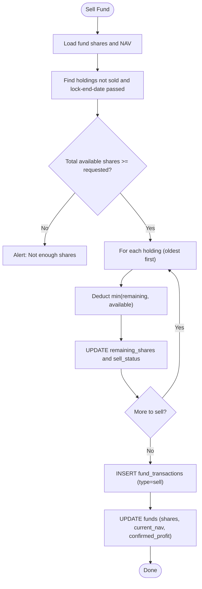
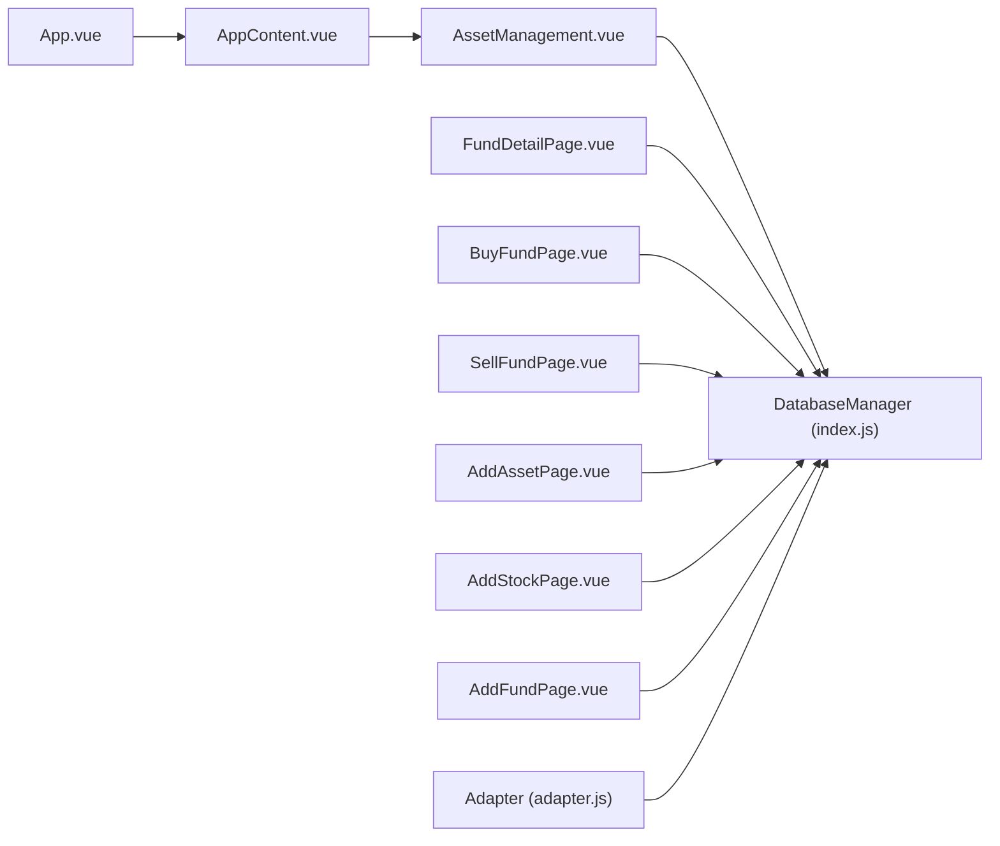

# Asset Management

<cite>
**Referenced Files in This Document**
- [AssetManagement.vue](file://src/components/mobile/asset/AssetManagement.vue)
- [AssetCard.vue](file://src/components/mobile/asset/AssetCard.vue)
- [AddAssetPage.vue](file://src/components/mobile/asset/AddAssetPage.vue)
- [AddStockPage.vue](file://src/components/mobile/asset/AddStockPage.vue)
- [AddFundPage.vue](file://src/components/mobile/asset/AddFundPage.vue)
- [FundDetailPage.vue](file://src/components/mobile/asset/FundDetailPage.vue)
- [BuyFundPage.vue](file://src/components/mobile/asset/BuyFundPage.vue)
- [SellFundPage.vue](file://src/components/mobile/asset/SellFundPage.vue)
- [App.vue](file://src/App.vue)
- [AppContent.vue](file://src/components/common/AppContent.vue)
- [index.js](file://src/database/index.js)
- [adapter.js](file://src/database/adapter.js)
- [main.ts](file://src/main.ts)
</cite>

## Table of Contents
1. [Introduction](#introduction)
2. [Project Structure](#project-structure)
3. [Core Components](#core-components)
4. [Architecture Overview](#architecture-overview)
5. [Detailed Component Analysis](#detailed-component-analysis)
6. [Dependency Analysis](#dependency-analysis)
7. [Performance Considerations](#performance-considerations)
8. [Troubleshooting Guide](#troubleshooting-guide)
9. [Conclusion](#conclusion)
10. [Appendices](#appendices)

## Introduction
This document describes the Asset Management feature of the finance application. It covers how assets are added for different asset types (general assets, stocks, and mutual funds), how portfolios are tracked, and how fund management is handled via buying and selling transactions. It also explains valuation methods, gain/loss calculations, and how the system supports portfolio diversification analysis and risk-awareness. Practical workflows and scenarios are included to help users set up assets and manage investments effectively.

## Project Structure
The Asset Management feature is implemented as a set of Vue Single File Components (SFCs) under the mobile asset module, integrated into the main application routing and navigation system. Data persistence is handled by a unified database manager supporting both native and web environments.

**Diagram sources**
- [App.vue:65-89](file://src/App.vue#L65-L89)
- [AppContent.vue:3-8](file://src/components/common/AppContent.vue#L3-L8)
- [AssetManagement.vue:101-227](file://src/components/mobile/asset/AssetManagement.vue#L101-L227)
- [index.js:21-374](file://src/database/index.js#L21-L374)
- [adapter.js:14-33](file://src/database/adapter.js#L14-L33)

**Section sources**
- [App.vue:65-89](file://src/App.vue#L65-L89)
- [AppContent.vue:3-8](file://src/components/common/AppContent.vue#L3-L8)
- [AssetManagement.vue:101-227](file://src/components/mobile/asset/AssetManagement.vue#L101-L227)
- [index.js:21-374](file://src/database/index.js#L21-L374)
- [adapter.js:14-33](file://src/database/adapter.js#L14-L33)

## Core Components
- AssetManagement.vue: Displays asset cards for general assets, stocks, and funds; provides floating action buttons to add new assets and navigates to detail pages.
- AssetCard.vue: Reusable card component rendering asset title, primary and secondary amounts, icon, and color.
- AddAssetPage.vue: Form for adding general assets with type, amount, period, and linked account.
- AddStockPage.vue: Form for adding stock holdings and creating stock transactions (buy/sell).
- AddFundPage.vue: Form for adding new funds and creating fund holdings and transactions (buy/sell).
- FundDetailPage.vue: Portfolio detail page for funds, showing cost/current NAV, shares, confirmed/hold returns, and transaction history tabs.
- BuyFundPage.vue: Secondary purchase form for existing funds, updating holdings and NAV statistics.
- SellFundPage.vue: Sell form for funds, enforcing lock-up periods and FIFO-like sale logic across holdings.
- DatabaseManager (index.js): Unified SQLite manager supporting Capacitor SQLite (native) and sql.js (web), with initialization, queries, runs, batching, and transactions.
- Adapter (adapter.js): Platform-specific database accessor used by components.

**Section sources**
- [AssetManagement.vue:1-227](file://src/components/mobile/asset/AssetManagement.vue#L1-L227)
- [AssetCard.vue:1-180](file://src/components/mobile/asset/AssetCard.vue#L1-L180)
- [AddAssetPage.vue:1-227](file://src/components/mobile/asset/AddAssetPage.vue#L1-L227)
- [AddStockPage.vue:1-295](file://src/components/mobile/asset/AddStockPage.vue#L1-L295)
- [AddFundPage.vue:1-315](file://src/components/mobile/asset/AddFundPage.vue#L1-L315)
- [FundDetailPage.vue:1-829](file://src/components/mobile/asset/FundDetailPage.vue#L1-L829)
- [BuyFundPage.vue:1-261](file://src/components/mobile/asset/BuyFundPage.vue#L1-L261)
- [SellFundPage.vue:1-299](file://src/components/mobile/asset/SellFundPage.vue#L1-L299)
- [index.js:21-374](file://src/database/index.js#L21-L374)
- [adapter.js:14-33](file://src/database/adapter.js#L14-L33)

## Architecture Overview
The application uses a centralized navigation system. App.vue maintains a component map keyed by route identifiers and passes parameters to child components. AssetManagement.vue loads data from the database and renders cards. Navigation events bubble up from child components to App.vue, which updates the active view.

**Diagram sources**
- [App.vue:119-137](file://src/App.vue#L119-L137)
- [AssetManagement.vue:141-183](file://src/components/mobile/asset/AssetManagement.vue#L141-L183)
- [index.js:199-264](file://src/database/index.js#L199-L264)

**Section sources**
- [App.vue:65-89](file://src/App.vue#L65-L89)
- [App.vue:119-137](file://src/App.vue#L119-L137)
- [AssetManagement.vue:141-183](file://src/components/mobile/asset/AssetManagement.vue#L141-L183)
- [index.js:199-264](file://src/database/index.js#L199-L264)

## Detailed Component Analysis

### Asset Portfolio Tracking and Cards
- Asset cards aggregate three asset categories:
  - General assets: amount, optional monthly income indicator.
  - Stocks: amount computed as cost price × quantity; secondary amount shows cost price.
  - Funds: amount computed as cost NAV × shares; secondary amount shows cost NAV.
- The floating action menu allows quick navigation to add asset types.

**Diagram sources**
- [AssetManagement.vue:145-183](file://src/components/mobile/asset/AssetManagement.vue#L145-L183)
- [AssetManagement.vue:211-227](file://src/components/mobile/asset/AssetManagement.vue#L211-L227)

**Section sources**
- [AssetManagement.vue:101-227](file://src/components/mobile/asset/AssetManagement.vue#L101-L227)
- [AssetCard.vue:24-65](file://src/components/mobile/asset/AssetCard.vue#L24-L65)

### Asset Addition Workflows

#### General Asset (AddAssetPage)
- Fields: name, type, amount, period (optional), linked account.
- Validation enforces presence of name/type/amount/account; special handling for “公积金” requiring a specific account type.
- On submit, inserts into assets table with computed id and timestamps.

**Diagram sources**
- [AddAssetPage.vue:96-135](file://src/components/mobile/asset/AddAssetPage.vue#L96-L135)
- [index.js:272-309](file://src/database/index.js#L272-L309)

**Section sources**
- [AddAssetPage.vue:96-135](file://src/components/mobile/asset/AddAssetPage.vue#L96-L135)
- [index.js:272-309](file://src/database/index.js#L272-L309)

#### Stock Asset (AddStockPage)
- Fields: name, code, price, quantity, fee, transaction time, linked account.
- Duplicate stock code prevention; on buy:
  - Insert stock record with initial quantity and cost price.
  - Create stock holding record and transaction record.
  - Update stock with quantity, current price, and cost price.
- Sell creates a transaction record.

**Diagram sources**
- [AddStockPage.vue:116-203](file://src/components/mobile/asset/AddStockPage.vue#L116-L203)
- [index.js:272-309](file://src/database/index.js#L272-L309)

**Section sources**
- [AddStockPage.vue:116-203](file://src/components/mobile/asset/AddStockPage.vue#L116-L203)
- [index.js:272-309](file://src/database/index.js#L272-L309)

#### Mutual Fund (AddFundPage)
- Fields: name, code, cost NAV, shares, fee, lock flag and period, transaction time, linked account.
- Duplicate fund code prevention; on buy:
  - Insert fund record with shares, NAVs, fees, lock info.
  - Create fund holding record and transaction record.
- Sell validates total shares and lock-up constraints, then decrements remaining shares across holdings and records sales.

**Diagram sources**
- [AddFundPage.vue:128-223](file://src/components/mobile/asset/AddFundPage.vue#L128-L223)
- [index.js:272-309](file://src/database/index.js#L272-L309)

**Section sources**
- [AddFundPage.vue:128-223](file://src/components/mobile/asset/AddFundPage.vue#L128-L223)
- [SellFundPage.vue:104-207](file://src/components/mobile/asset/SellFundPage.vue#L104-L207)
- [index.js:272-309](file://src/database/index.js#L272-L309)

### Fund Detail View and Transaction History
- Displays fund metadata: name, code, cost NAV, current NAV, shares, confirmed/hold/total returns.
- Tabs:
  - Holdings: per-holding NAV, shares, remaining shares, fee, status, lock info.
  - Buy/Sell: transaction NAV, shares, amount, fee, timestamps.
- Floating action menu exposes Buy/Sell actions.

**Diagram sources**
- [FundDetailPage.vue:281-413](file://src/components/mobile/asset/FundDetailPage.vue#L281-L413)
- [index.js:199-264](file://src/database/index.js#L199-L264)

**Section sources**
- [FundDetailPage.vue:12-180](file://src/components/mobile/asset/FundDetailPage.vue#L12-L180)
- [FundDetailPage.vue:281-413](file://src/components/mobile/asset/FundDetailPage.vue#L281-L413)

### Fund Management: Buying and Selling
- Secondary Purchase (BuyFundPage):
  - Creates a new fund holding and transaction.
  - Updates fund shares, current NAV, cost NAV, and total fees.
- Sell (SellFundPage):
  - Validates available shares and lock-up constraints.
  - Applies FIFO-like logic across holdings to decrement remaining shares and mark statuses.
  - Updates fund shares, current NAV, and confirmed profit.

**Diagram sources**
- [SellFundPage.vue:137-207](file://src/components/mobile/asset/SellFundPage.vue#L137-L207)
- [BuyFundPage.vue:148-162](file://src/components/mobile/asset/BuyFundPage.vue#L148-L162)

**Section sources**
- [BuyFundPage.vue:105-169](file://src/components/mobile/asset/BuyFundPage.vue#L105-L169)
- [SellFundPage.vue:104-207](file://src/components/mobile/asset/SellFundPage.vue#L104-L207)

### Valuation Methods, Gain/Loss, and Returns
- General assets: valuation equals recorded amount; optional monthly income indicator.
- Stocks: valuation equals cost price × quantity; realized/unrealized gains/losses derived from transaction history and current price updates (not shown in current code).
- Funds: valuation equals cost NAV × shares; returns computed as:
  - Hold return = (current NAV − cost NAV) × shares
  - Confirmed return reflects proceeds from sales minus fees
  - Total return = hold return + confirmed return

These computations are performed in the fund detail loader and displayed in the UI.

**Section sources**
- [AssetManagement.vue:27-41](file://src/components/mobile/asset/AssetManagement.vue#L27-L41)
- [FundDetailPage.vue:300-318](file://src/components/mobile/asset/FundDetailPage.vue#L300-L318)

### Portfolio Diversification and Risk Awareness
- The current implementation does not compute sector/bucket allocations or risk scores. Portfolio diversification analysis and risk assessment features are not present in the referenced code.
- FinancialDashboard.vue demonstrates health metrics (not asset allocation) and could serve as a model for future integration.

**Section sources**
- [FinancialDashboard.vue:1-279](file://src/components/mobile/financial/FinancialDashboard.vue#L1-L279)

### Tax Implication Tracking
- There is no explicit tax computation or tracking logic in the asset management components. Tax implications are not implemented in the referenced code.

**Section sources**
- [AddFundPage.vue:128-223](file://src/components/mobile/asset/AddFundPage.vue#L128-L223)
- [SellFundPage.vue:104-207](file://src/components/mobile/asset/SellFundPage.vue#L104-L207)

### Practical Examples and Scenarios
- Adding a general asset:
  - Navigate to Add Asset, select type (e.g., “工资”), enter amount and period, choose linked account, submit.
- Adding a stock:
  - Navigate to Add Stock, enter name/code/price/quantity/fee/time, choose account, submit. Buying adds holdings and updates cost basis; selling records a transaction.
- Adding a fund:
  - Navigate to Add Fund, enter name/code/cost NAV/shares/fee/lock info/time, choose account, submit. Buying adds holdings and updates NAVs; selling enforces lock-ups and FIFO logic.
- Viewing fund details:
  - Tap a fund card to open Fund Detail, review NAV/share balances, returns, and transaction tabs.

**Section sources**
- [AddAssetPage.vue:96-135](file://src/components/mobile/asset/AddAssetPage.vue#L96-L135)
- [AddStockPage.vue:116-203](file://src/components/mobile/asset/AddStockPage.vue#L116-L203)
- [AddFundPage.vue:128-223](file://src/components/mobile/asset/AddFundPage.vue#L128-L223)
- [FundDetailPage.vue:281-413](file://src/components/mobile/asset/FundDetailPage.vue#L281-L413)

## Dependency Analysis
- Navigation and routing:
  - App.vue maps route keys to components and forwards navigation events.
  - AppContent.vue renders the active component and relays navigation/dateChange events.
- Data access:
  - All components depend on DatabaseManager for queries and writes.
  - Adapter abstracts platform differences (Capacitor SQLite vs sql.js).

**Diagram sources**
- [App.vue:65-89](file://src/App.vue#L65-L89)
- [AppContent.vue:3-8](file://src/components/common/AppContent.vue#L3-L8)
- [index.js:21-374](file://src/database/index.js#L21-L374)
- [adapter.js:14-33](file://src/database/adapter.js#L14-L33)

**Section sources**
- [App.vue:65-89](file://src/App.vue#L65-L89)
- [AppContent.vue:3-8](file://src/components/common/AppContent.vue#L3-L8)
- [index.js:21-374](file://src/database/index.js#L21-L374)
- [adapter.js:14-33](file://src/database/adapter.js#L14-L33)

## Performance Considerations
- DatabaseManager implements caching and throttled persistence for web environments, and uses positional parameters for queries/runs to avoid injection risks.
- Batch operations and transactions are supported to reduce round-trips.
- Indexes are created on frequently queried columns to improve performance.

Recommendations:
- Use transactions for multi-step operations (e.g., stock/fund buys/sells) to maintain consistency.
- Consider periodic cache invalidation after bulk updates.
- Defer heavy computations (e.g., NAV recalculation) to background tasks if needed.

**Section sources**
- [index.js:12-18](file://src/database/index.js#L12-L18)
- [index.js:200-264](file://src/database/index.js#L200-L264)
- [index.js:316-347](file://src/database/index.js#L316-L347)
- [index.js:676-688](file://src/database/index.js#L676-L688)

## Troubleshooting Guide
Common issues and resolutions:
- Duplicate asset/fund entries:
  - Prevented by checking existing codes before insert; alert the user if duplicate detected.
- Insufficient shares for sale:
  - Enforce total available shares and lock-up constraints; notify user if sale exceeds available or is locked.
- Invalid inputs:
  - Validate required fields and numeric ranges; show alerts for missing or invalid data.
- Database errors:
  - Catch and log errors during query/run; surface user-friendly messages.

**Section sources**
- [AddStockPage.vue:116-124](file://src/components/mobile/asset/AddStockPage.vue#L116-L124)
- [AddFundPage.vue:128-136](file://src/components/mobile/asset/AddFundPage.vue#L128-L136)
- [SellFundPage.vue:124-154](file://src/components/mobile/asset/SellFundPage.vue#L124-L154)
- [index.js:260-263](file://src/database/index.js#L260-L263)

## Conclusion
The Asset Management feature provides a robust foundation for managing general assets, stocks, and mutual funds. It supports adding assets, tracking portfolio values, and performing fund purchases and sales with proper transaction logging and NAV updates. While valuation and returns are computed in the fund detail view, advanced features like portfolio diversification analysis, risk scoring, and tax tracking are not currently implemented and would require extension of the existing data models and UI.

## Appendices

### Database Schema Highlights (Asset Types)
- assets: id, type, name, amount, account_id, period, timestamps.
- stocks: id, name, code, quantity, current_price, cost_price, confirmed_profit, first_buy_date, account_id, timestamps.
- funds: id, name, code, shares, current_nav, cost_nav, confirmed_profit, total_fee, first_buy_date, has_lock, lock_period, account_id, timestamps.
- Supporting tables: stock_holdings, stock_transactions, fund_holdings, fund_transactions.

**Section sources**
- [index.js:469-602](file://src/database/index.js#L469-L602)