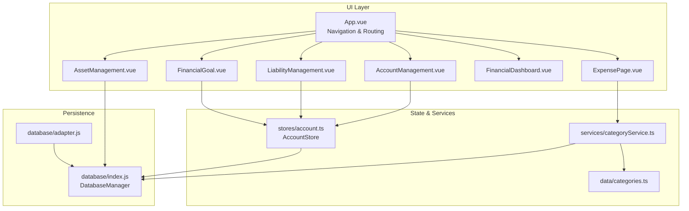
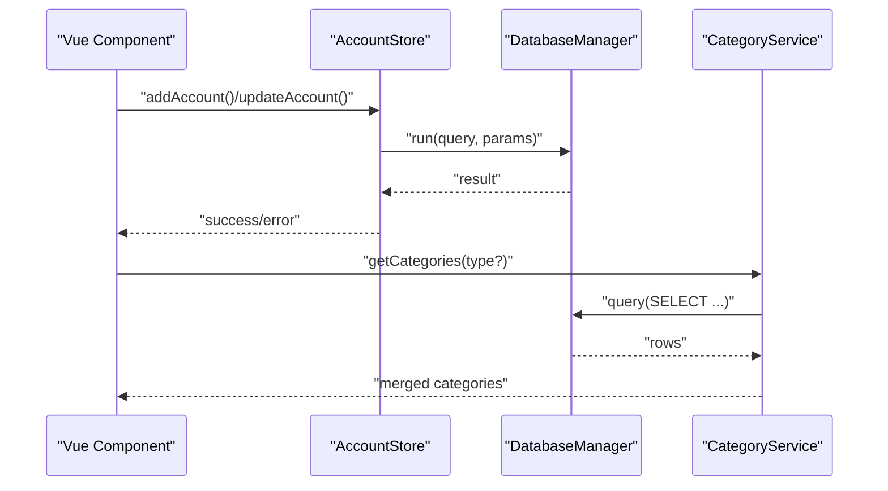
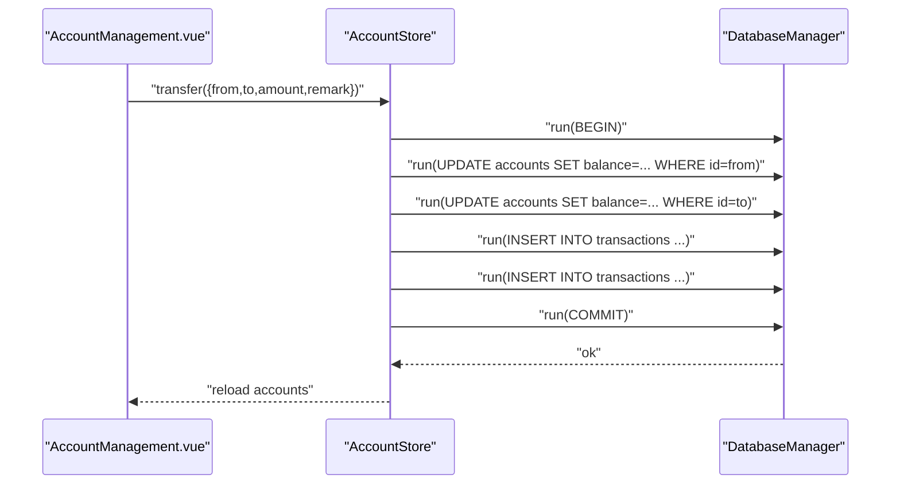
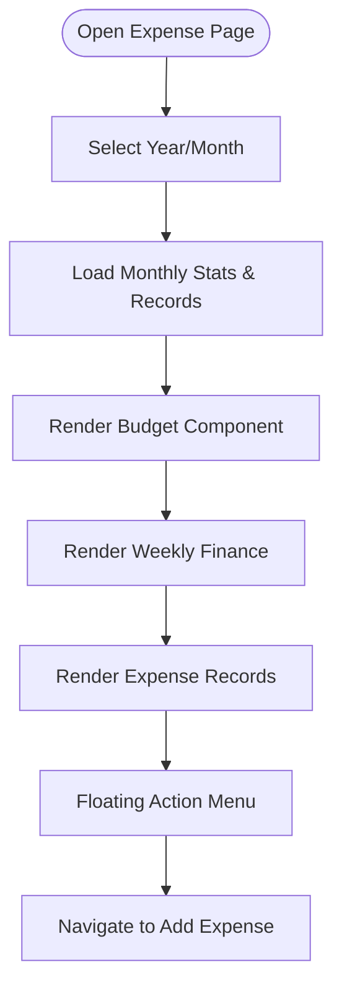
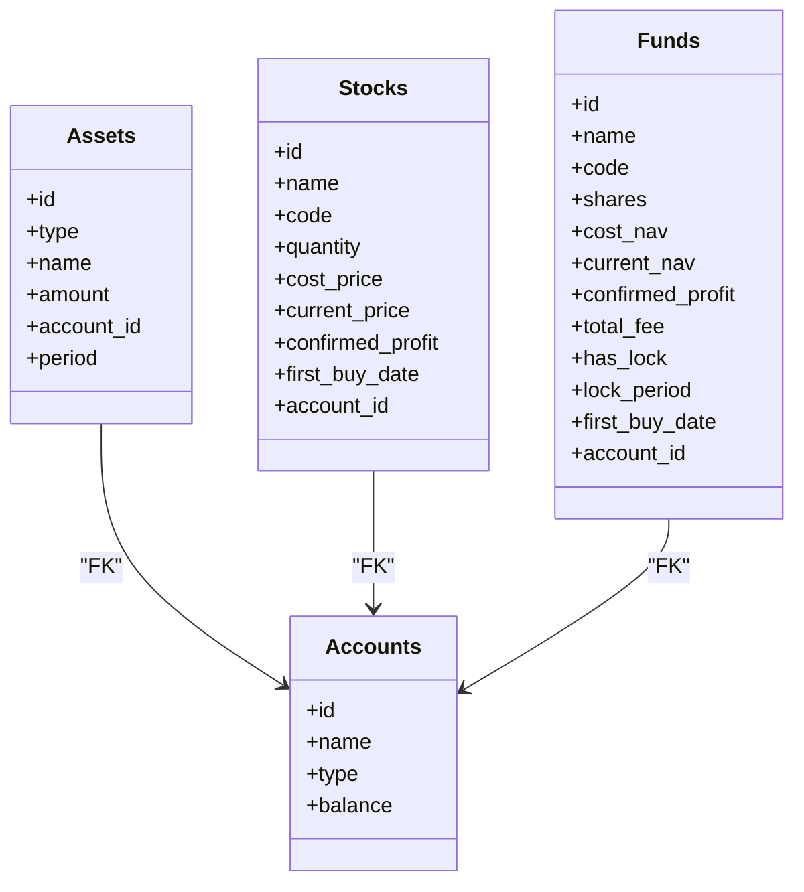
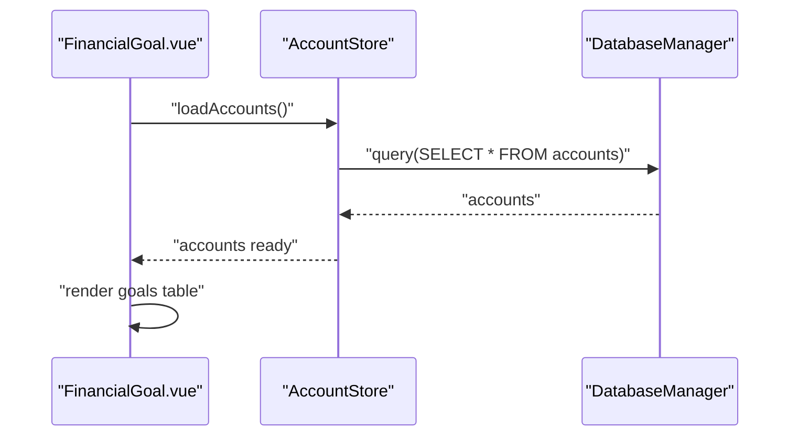
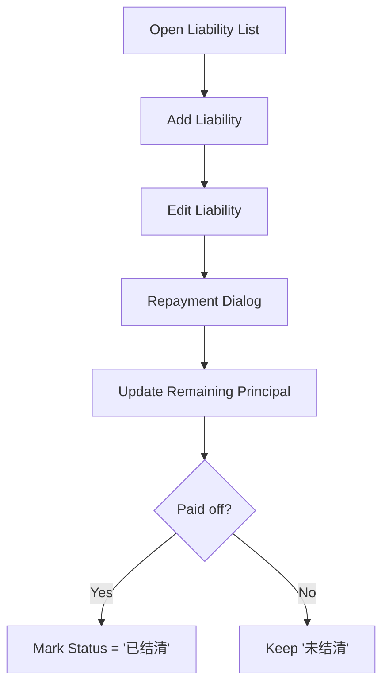
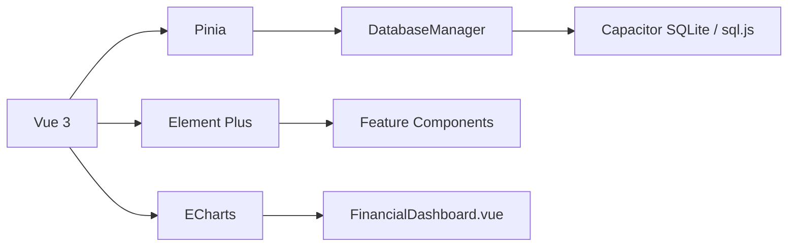

# Core Features

<cite>
**Referenced Files in This Document**
- [App.vue](file://src/App.vue)
- [main.ts](file://src/main.ts)
- [account.ts](file://src/stores/account.ts)
- [categoryService.ts](file://src/services/categoryService.ts)
- [categories.ts](file://src/data/categories.ts)
- [index.js](file://src/database/index.js)
- [adapter.js](file://src/database/adapter.js)
- [AccountManagement.vue](file://src/components/mobile/account/AccountManagement.vue)
- [ExpensePage.vue](file://src/components/mobile/expense/ExpensePage.vue)
- [FinancialDashboard.vue](file://src/components/mobile/financial/FinancialDashboard.vue)
- [AssetManagement.vue](file://src/components/mobile/asset/AssetManagement.vue)
- [LiabilityManagement.vue](file://src/components/mobile/liability/LiabilityManagement.vue)
- [FinancialGoal.vue](file://src/components/mobile/financial/FinancialGoal.vue)
- [package.json](file://package.json)
</cite>

## Table of Contents
1. [Introduction](#introduction)
2. [Project Structure](#project-structure)
3. [Core Components](#core-components)
4. [Architecture Overview](#architecture-overview)
5. [Detailed Component Analysis](#detailed-component-analysis)
6. [Dependency Analysis](#dependency-analysis)
7. [Performance Considerations](#performance-considerations)
8. [Troubleshooting Guide](#troubleshooting-guide)
9. [Conclusion](#conclusion)
10. [Appendices](#appendices)

## Introduction
This document explains the core financial management features of the Finance App, focusing on:
- Account management: creation, balance tracking, internal transfers, and adjustments
- Expense tracking: categorization, budgeting scaffolding, and spending analytics
- Asset management: general assets, investment tracking (stocks and funds), and portfolio-related views
- Financial dashboard: real-time insights, trend analysis, and goal tracking
- Liability management: debt tracking and repayment planning
It also covers user workflows, data models, and integration patterns across the Vue + Pinia + SQLite stack, with practical examples and advanced configurations.

## Project Structure
The Finance App is a Vue 3 SPA with Pinia for state management, Element Plus for UI, and a unified database layer supporting both Capacitor SQLite (native) and sql.js (web). Navigation is centralized via a single App container that maps routes to feature components.

**Diagram sources**
- [App.vue:65-89](file://src/App.vue#L65-L89)
- [account.ts:27-265](file://src/stores/account.ts#L27-L265)
- [categoryService.ts:8-260](file://src/services/categoryService.ts#L8-L260)
- [categories.ts:1-45](file://src/data/categories.ts#L1-L45)
- [index.js:21-374](file://src/database/index.js#L21-L374)
- [adapter.js:14-33](file://src/database/adapter.js#L14-L33)

**Section sources**
- [App.vue:65-117](file://src/App.vue#L65-L117)
- [main.ts:1-16](file://src/main.ts#L1-L16)

## Core Components
- Account Management Store: CRUD accounts, balance adjustments, internal transfers, and loading balances
- Category Service: manage categories (expenses/income), default initialization, and database connectivity checks
- Database Manager: unified SQLite layer with native and web support, migrations, caching, and transactions
- Feature Pages: Account, Expense, Asset, Liability, Dashboard, and Goal pages

**Section sources**
- [account.ts:27-265](file://src/stores/account.ts#L27-L265)
- [categoryService.ts:8-260](file://src/services/categoryService.ts#L8-L260)
- [index.js:420-776](file://src/database/index.js#L420-L776)

## Architecture Overview
The app follows a layered architecture:
- Presentation: Vue components render UI and orchestrate navigation
- State: Pinia stores encapsulate business logic and coordinate with the database
- Persistence: DatabaseManager abstracts SQLite operations across platforms
- Services: CategoryService centralizes category operations and defaults

**Diagram sources**
- [account.ts:59-121](file://src/stores/account.ts#L59-L121)
- [index.js:272-309](file://src/database/index.js#L272-L309)
- [categoryService.ts:14-69](file://src/services/categoryService.ts#L14-L69)

## Detailed Component Analysis

### Account Management System
- Responsibilities
  - Load accounts and compute derived metrics (net worth, asset/liability totals)
  - Adjust balances and record transaction history
  - Perform internal transfers with atomicity guarantees
  - Provide dialogs for editing and balance adjustment
- Data Model
  - Accounts table with id, name, type, balance, limits, liquidity flag, remarks, timestamps
  - Transactions table linking to accounts with type, amount, balance_after, remark, status, timestamps
- Workflows
  - New account creation: generate id, insert into accounts, reload list
  - Balance adjustment: validate new balance >= 0, update balance, insert transaction
  - Internal transfer: BEGIN, update balances, insert two transactions, COMMIT or ROLLBACK
- Practical Examples
  - Adding a cash account with initial balance
  - Transferring from a bank account to a credit card account
  - Adjusting a negative balance to zero with a remark
- Advanced Configurations
  - Liquidity flag to distinguish liquid vs. illiquid funds
  - Credit cards with used_limit/total_limit fields
  - Transaction status tracking for reconciliation

**Diagram sources**
- [account.ts:183-262](file://src/stores/account.ts#L183-L262)
- [index.js:354-374](file://src/database/index.js#L354-L374)

**Section sources**
- [account.ts:27-265](file://src/stores/account.ts#L27-L265)
- [AccountManagement.vue:194-377](file://src/components/mobile/account/AccountManagement.vue#L194-L377)
- [index.js:434-467](file://src/database/index.js#L434-L467)

### Expense Tracking and Budgeting
- Categorization
  - Categories table supports expense/income types with icons and texts
  - Service merges default categories with persisted ones and filters by type
- Budgeting
  - Budget component present in template; logic to be wired to stores/database
- Analytics
  - Monthly stats and weekly finance components integrated into the expense page
- Workflows
  - Select year/month to filter records
  - Navigate to add expense form
- Practical Examples
  - Filtering expenses by month/year
  - Creating a new expense with category selection
- Advanced Configurations
  - Default category initialization on first run
  - Database connectivity fallback behavior

**Diagram sources**
- [ExpensePage.vue:1-88](file://src/components/mobile/expense/ExpensePage.vue#L1-L88)

**Section sources**
- [categoryService.ts:8-260](file://src/services/categoryService.ts#L8-L260)
- [categories.ts:1-45](file://src/data/categories.ts#L1-L45)
- [ExpensePage.vue:1-88](file://src/components/mobile/expense/ExpensePage.vue#L1-L88)

### Asset Management
- Capabilities
  - General assets, stocks, and funds with separate lists
  - Asset cards show primary and secondary amounts
  - Navigation to add asset, stock, or fund
- Data Models
  - assets, stocks, funds tables with foreign keys to accounts
  - stock_holdings and stock_transactions, fund_holdings and fund_transactions for detailed tracking
- Workflows
  - Load assets/accounts asynchronously
  - Navigate to fund detail page with fundId param
- Practical Examples
  - Adding a new stock purchase
  - Viewing fund holdings and transactions
- Advanced Configurations
  - Separate NAV and cost NAV for funds
  - Lock periods and fees for fund transactions

**Diagram sources**
- [index.js:469-602](file://src/database/index.js#L469-L602)

**Section sources**
- [AssetManagement.vue:1-381](file://src/components/mobile/asset/AssetManagement.vue#L1-L381)
- [index.js:469-602](file://src/database/index.js#L469-L602)

### Financial Dashboard and Goals
- Dashboard
  - Financial health metrics and trend chart
  - Time range selector for growth trend
- Goals
  - Financial goals table with type, target, monthly contribution, period, status
  - Associate goals with accounts
- Workflows
  - Add/edit goals, compute monthly contribution automatically
  - Track progress and mark completion
- Practical Examples
  - Planning a 3-year savings goal
  - Monitoring emergency fund ratio

**Diagram sources**
- [FinancialGoal.vue:142-178](file://src/components/mobile/financial/FinancialGoal.vue#L142-L178)
- [account.ts:38-53](file://src/stores/account.ts#L38-L53)

**Section sources**
- [FinancialDashboard.vue:1-279](file://src/components/mobile/financial/FinancialDashboard.vue#L1-L279)
- [FinancialGoal.vue:1-288](file://src/components/mobile/financial/FinancialGoal.vue#L1-L288)
- [account.ts:27-53](file://src/stores/account.ts#L27-L53)

### Liability Management
- Capabilities
  - Track principal, interest rate, repayment method, period, repayment day
  - Bind to an account
  - Make repayments and update remaining principal/status
- Data Model
  - liabilities table with status, interest flag, and repayment metadata
- Workflows
  - Add/edit liability, open repayment dialog, persist updates
- Practical Examples
  - Recording a mortgage with equal-installment payments
  - Tracking a personal loan with flexible repayments

**Diagram sources**
- [LiabilityManagement.vue:205-358](file://src/components/mobile/liability/LiabilityManagement.vue#L205-L358)

**Section sources**
- [LiabilityManagement.vue:1-377](file://src/components/mobile/liability/LiabilityManagement.vue#L1-L377)
- [index.js:604-626](file://src/database/index.js#L604-L626)

## Dependency Analysis
- Runtime dependencies include Vue 3, Pinia, Element Plus, ECharts, and SQLite integrations
- Database abstraction supports Capacitor SQLite (native) and sql.js (web) transparently
- Category service depends on database queries and provides default category initialization

**Diagram sources**
- [package.json:19-36](file://package.json#L19-L36)
- [index.js:8-11](file://src/database/index.js#L8-L11)

**Section sources**
- [package.json:19-36](file://package.json#L19-L36)
- [adapter.js:14-33](file://src/database/adapter.js#L14-L33)

## Performance Considerations
- DatabaseManager implements caching, throttled persistence (web), and batch/transaction APIs to reduce IO overhead
- Indexes are created on frequently queried columns (accounts, transactions, goals, liabilities)
- Use of computed values minimizes re-computation in UI
- Debounced saves prevent excessive writes in web mode

**Section sources**
- [index.js:12-18](file://src/database/index.js#L12-L18)
- [index.js:417-418](file://src/database/index.js#L417-L418)
- [index.js:676-688](file://src/database/index.js#L676-L688)

## Troubleshooting Guide
- Database connectivity errors: the CategoryService provides a status check and falls back to memory mode messaging
- Transaction failures: AccountStore wraps transfers in a transaction block and rolls back on errors
- Navigation issues: App.vue centralizes routing and passes navigation params; verify component props mapping

**Section sources**
- [categoryService.ts:181-194](file://src/services/categoryService.ts#L181-L194)
- [account.ts:205-257](file://src/stores/account.ts#L205-L257)
- [App.vue:119-137](file://src/App.vue#L119-L137)

## Conclusion
The Finance App provides a cohesive set of financial management features built on a robust data layer and modular UI. Account management, expense tracking, asset management, dashboard analytics, goals, and liabilities are integrated through a unified database and clear component boundaries. The architecture supports both native and web environments, with performance-conscious database operations and straightforward workflows for common and advanced use cases.

## Appendices
- Example: Adding a new account
  - Use AccountStore.addAccount with name, type, optional balance/limits, liquidity flag, remark
  - Verify the new account appears in AccountManagement.vue
- Example: Performing an internal transfer
  - Use AccountStore.transfer with fromAccountId, toAccountId, amount, remark
  - Confirm both accounts reflect updated balances and two transaction entries
- Example: Creating a new expense
  - Navigate to add expense from ExpensePage
  - Select category from CategoryService-provided list
  - Persist and observe MonthlyStats update
- Example: Tracking a liability
  - Add liability with principal, interest flag, repayment method, period, repayment day
  - Make repayments to reduce remaining principal and update status when paid off
- Example: Planning a financial goal
  - Set target amount, period, and associated account
  - Compute monthly contribution and track progress