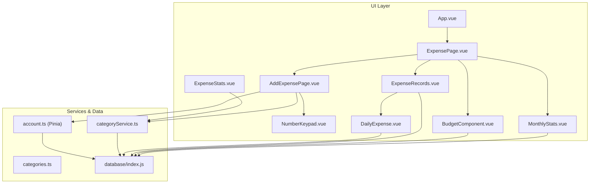
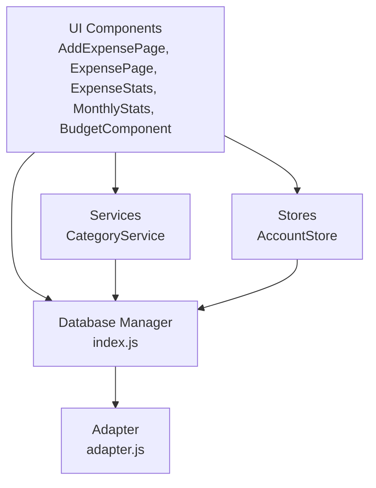
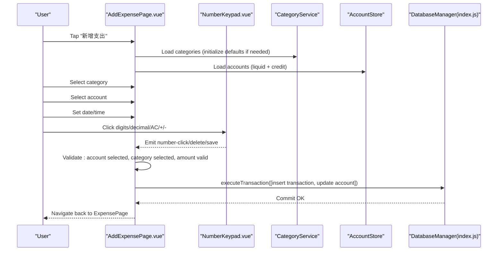
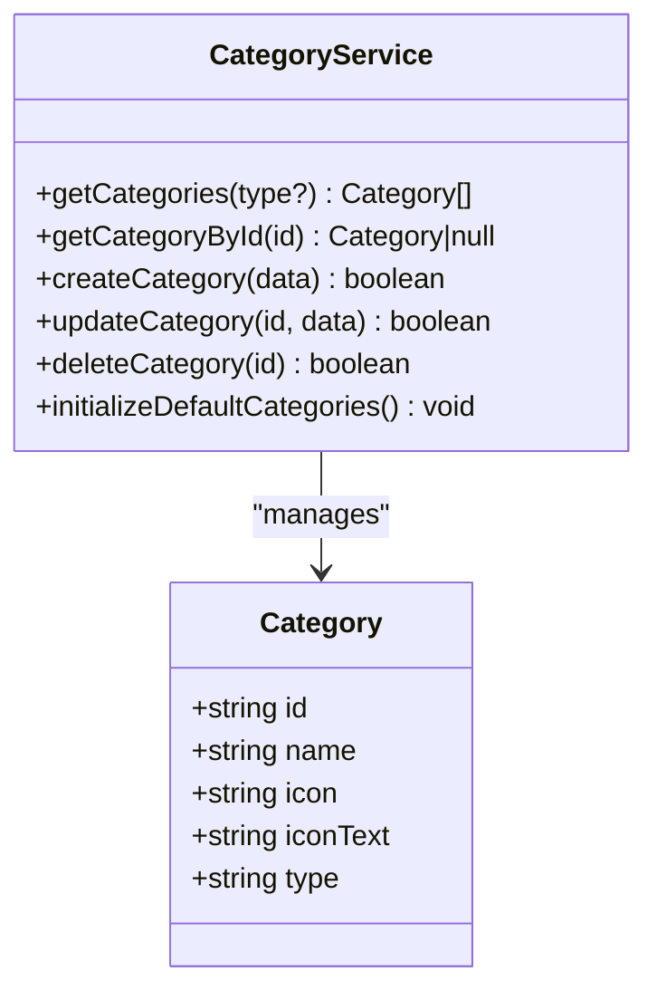
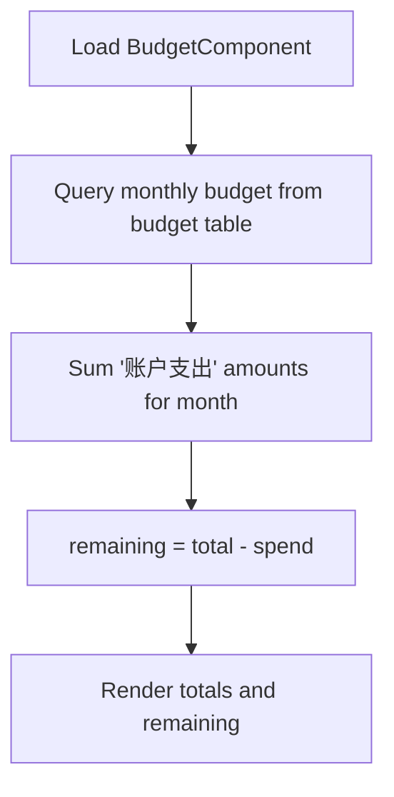
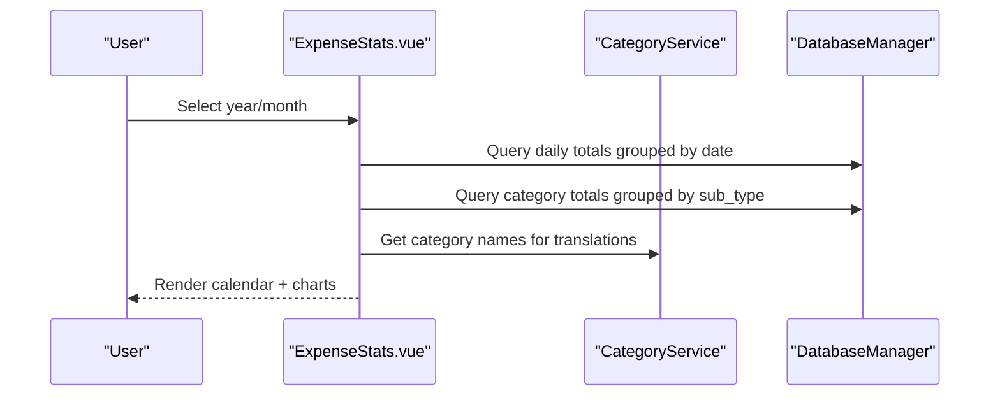
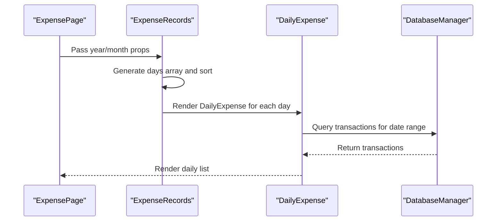
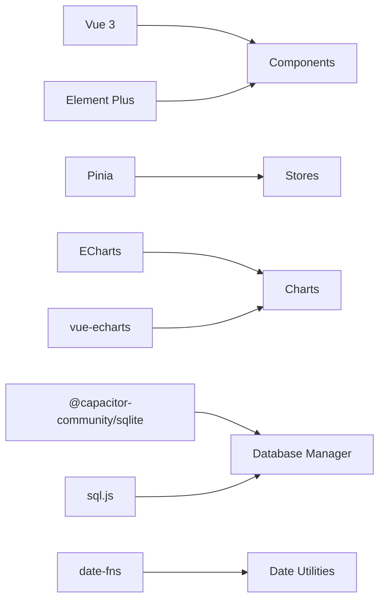

# Expense Tracking

<cite>
**Referenced Files in This Document**
- [AddExpensePage.vue](file://src/components/mobile/expense/AddExpensePage.vue)
- [NumberKeypad.vue](file://src/components/mobile/expense/NumberKeypad.vue)
- [ExpensePage.vue](file://src/components/mobile/expense/ExpensePage.vue)
- [ExpenseRecords.vue](file://src/components/mobile/expense/ExpenseRecords.vue)
- [DailyExpense.vue](file://src/components/mobile/expense/DailyExpense.vue)
- [ExpenseStats.vue](file://src/components/mobile/expense/ExpenseStats.vue)
- [MonthlyStats.vue](file://src/components/mobile/expense/MonthlyStats.vue)
- [BudgetComponent.vue](file://src/components/mobile/expense/BudgetComponent.vue)
- [categories.ts](file://src/data/categories.ts)
- [categoryService.ts](file://src/services/categoryService.ts)
- [account.ts](file://src/stores/account.ts)
- [index.js](file://src/database/index.js)
- [adapter.js](file://src/database/adapter.js)
- [App.vue](file://src/App.vue)
- [main.ts](file://src/main.ts)
- [package.json](file://package.json)
</cite>

## Table of Contents
1. [Introduction](#introduction)
2. [Project Structure](#project-structure)
3. [Core Components](#core-components)
4. [Architecture Overview](#architecture-overview)
5. [Detailed Component Analysis](#detailed-component-analysis)
6. [Dependency Analysis](#dependency-analysis)
7. [Performance Considerations](#performance-considerations)
8. [Troubleshooting Guide](#troubleshooting-guide)
9. [Conclusion](#conclusion)
10. [Appendices](#appendices)

## Introduction
This document explains the Expense Tracking system in the Finance App. It covers the end-to-end expense recording workflow (manual entry, category selection, amount input via numeric keypad), the categorization system with predefined categories and custom category management, budgeting functionality (monthly budgets, spending limits, and budget alerts), statistics and reporting (daily, weekly, and monthly spending analysis), the expense records interface (filtering, sorting, and search), financial insights and trend analysis, category management, expense validation rules, and data visualization patterns. Practical examples illustrate typical workflows for entering expenses and managing budgets.

## Project Structure
The expense tracking feature is implemented as a set of Vue components under the mobile expense module, backed by a local SQLite database and Pinia stores. The main navigation wires components together and passes date context for monthly views.



**Diagram sources**
- [App.vue:65-89](file://src/App.vue#L65-L89)
- [ExpensePage.vue:1-88](file://src/components/mobile/expense/ExpensePage.vue#L1-L88)
- [AddExpensePage.vue:108-488](file://src/components/mobile/expense/AddExpensePage.vue#L108-L488)
- [NumberKeypad.vue:1-106](file://src/components/mobile/expense/NumberKeypad.vue#L1-L106)
- [ExpenseRecords.vue:14-97](file://src/components/mobile/expense/ExpenseRecords.vue#L14-L97)
- [DailyExpense.vue:25-106](file://src/components/mobile/expense/DailyExpense.vue#L25-L106)
- [ExpenseStats.vue:74-433](file://src/components/mobile/expense/ExpenseStats.vue#L74-L433)
- [MonthlyStats.vue:25-104](file://src/components/mobile/expense/MonthlyStats.vue#L25-L104)
- [BudgetComponent.vue:20-76](file://src/components/mobile/expense/BudgetComponent.vue#L20-L76)
- [categoryService.ts:8-260](file://src/services/categoryService.ts#L8-L260)
- [categories.ts:1-45](file://src/data/categories.ts#L1-L45)
- [account.ts:27-265](file://src/stores/account.ts#L27-L265)
- [index.js:21-800](file://src/database/index.js#L21-L800)

**Section sources**
- [App.vue:65-117](file://src/App.vue#L65-L117)
- [ExpensePage.vue:1-88](file://src/components/mobile/expense/ExpensePage.vue#L1-L88)
- [package.json:19-36](file://package.json#L19-L36)

## Core Components
- ExpensePage: Orchestrates monthly overview, budget summary, weekly finance highlights, and expense records grid.
- AddExpensePage: Handles manual expense entry with category selection, account selection, datetime picker, remarks, and numeric keypad input.
- NumberKeypad: Virtual numeric keypad supporting digits, decimal point, plus/minus operations, AC clear, and Save confirmation.
- ExpenseRecords + DailyExpense: Renders a month’s worth of days and lists per-day expenses.
- ExpenseStats: Provides calendar-based daily totals, daily line chart, and category pie chart.
- MonthlyStats: Computes monthly income, expense, and balance.
- BudgetComponent: Shows monthly budget summary and remaining budget (placeholder logic included).
- CategoryService + categories.ts: Manages predefined categories and custom category CRUD operations.
- AccountStore: Loads accounts, validates balances/limits, and updates balances during transactions.
- Database: Centralized SQLite manager supporting Capacitor SQLite and sql.js, with transactions and caching.

**Section sources**
- [ExpensePage.vue:1-88](file://src/components/mobile/expense/ExpensePage.vue#L1-L88)
- [AddExpensePage.vue:108-488](file://src/components/mobile/expense/AddExpensePage.vue#L108-L488)
- [NumberKeypad.vue:1-106](file://src/components/mobile/expense/NumberKeypad.vue#L1-L106)
- [ExpenseRecords.vue:14-97](file://src/components/mobile/expense/ExpenseRecords.vue#L14-L97)
- [DailyExpense.vue:25-106](file://src/components/mobile/expense/DailyExpense.vue#L25-L106)
- [ExpenseStats.vue:74-433](file://src/components/mobile/expense/ExpenseStats.vue#L74-L433)
- [MonthlyStats.vue:25-104](file://src/components/mobile/expense/MonthlyStats.vue#L25-L104)
- [BudgetComponent.vue:20-76](file://src/components/mobile/expense/BudgetComponent.vue#L20-L76)
- [categoryService.ts:8-260](file://src/services/categoryService.ts#L8-L260)
- [categories.ts:1-45](file://src/data/categories.ts#L1-L45)
- [account.ts:27-265](file://src/stores/account.ts#L27-L265)
- [index.js:21-800](file://src/database/index.js#L21-L800)

## Architecture Overview
The system follows a layered architecture:
- UI Layer: Vue components for expense entry, records, stats, and budget.
- Service Layer: CategoryService for category management and initialization.
- Store Layer: Pinia account store for account data and operations.
- Persistence Layer: SQLite database via a unified adapter supporting Capacitor SQLite and Web sql.js.



**Diagram sources**
- [AddExpensePage.vue:108-488](file://src/components/mobile/expense/AddExpensePage.vue#L108-L488)
- [ExpensePage.vue:1-88](file://src/components/mobile/expense/ExpensePage.vue#L1-L88)
- [ExpenseStats.vue:74-433](file://src/components/mobile/expense/ExpenseStats.vue#L74-L433)
- [MonthlyStats.vue:25-104](file://src/components/mobile/expense/MonthlyStats.vue#L25-L104)
- [BudgetComponent.vue:20-76](file://src/components/mobile/expense/BudgetComponent.vue#L20-L76)
- [categoryService.ts:8-260](file://src/services/categoryService.ts#L8-L260)
- [account.ts:27-265](file://src/stores/account.ts#L27-L265)
- [index.js:21-800](file://src/database/index.js#L21-L800)
- [adapter.js:14-34](file://src/database/adapter.js#L14-L34)

## Detailed Component Analysis

### Expense Recording Workflow
End-to-end flow for manual expense entry:
- Open AddExpensePage.
- Select a category from CategoryItem grid.
- Choose an account from the account selector (filters liquid and credit accounts).
- Set date/time via the datetime picker dialog.
- Enter amount using the NumberKeypad (supports decimals, plus/minus, AC clear).
- Save triggers validation and a transactional write to the database.



**Diagram sources**
- [AddExpensePage.vue:108-488](file://src/components/mobile/expense/AddExpensePage.vue#L108-L488)
- [NumberKeypad.vue:32-37](file://src/components/mobile/expense/NumberKeypad.vue#L32-L37)
- [categoryService.ts:199-260](file://src/services/categoryService.ts#L199-L260)
- [account.ts:38-53](file://src/stores/account.ts#L38-L53)
- [index.js:354-374](file://src/database/index.js#L354-L374)

**Section sources**
- [AddExpensePage.vue:108-488](file://src/components/mobile/expense/AddExpensePage.vue#L108-L488)
- [NumberKeypad.vue:1-106](file://src/components/mobile/expense/NumberKeypad.vue#L1-L106)
- [categoryService.ts:14-69](file://src/services/categoryService.ts#L14-L69)
- [account.ts:38-53](file://src/stores/account.ts#L38-L53)
- [index.js:354-374](file://src/database/index.js#L354-L374)

### Numeric Keypad Logic
The keypad supports:
- Digit input and decimal point.
- Plus/minus operators with expression building.
- AC to reset calculator state.
- Save to finalize amount and validate.

```mermaid
flowchart TD
Start(["Keypad Interaction"]) --> Choice{"Event Type"}
Choice --> |Digit| Append["Append digit to currentInput"]
Choice --> |Decimal| Dot["Add '.' if not present"]
Choice --> |Operator (+/-)| Op["Set operator and shift currentInput to previousInput"]
Choice --> |AC| Reset["Reset calculator state"]
Choice --> |Save| Finalize["Compute result if pending, validate amount"]
Append --> Update["Update display"]
Dot --> Update
Op --> Update
Reset --> End(["Idle"])
Update --> End
Finalize --> End
```

**Diagram sources**
- [AddExpensePage.vue:239-362](file://src/components/mobile/expense/AddExpensePage.vue#L239-L362)
- [NumberKeypad.vue:32-37](file://src/components/mobile/expense/NumberKeypad.vue#L32-L37)

**Section sources**
- [AddExpensePage.vue:239-362](file://src/components/mobile/expense/AddExpensePage.vue#L239-L362)
- [NumberKeypad.vue:1-106](file://src/components/mobile/expense/NumberKeypad.vue#L1-L106)

### Expense Categorization System
- Predefined categories are bundled and merged with database categories, ensuring defaults are always present.
- Categories are loaded by type ("expense") and rendered in a grid for quick selection.
- Custom categories can be created, updated, and deleted via CategoryService.



**Diagram sources**
- [categoryService.ts:8-260](file://src/services/categoryService.ts#L8-L260)
- [categories.ts:1-45](file://src/data/categories.ts#L1-L45)

**Section sources**
- [categoryService.ts:14-69](file://src/services/categoryService.ts#L14-L69)
- [categoryService.ts:199-260](file://src/services/categoryService.ts#L199-L260)
- [categories.ts:9-45](file://src/data/categories.ts#L9-L45)

### Budgeting Functionality
- Monthly budget summary displays total budget and remaining budget.
- Placeholder logic currently uses a fixed budget; actual budget queries and spending calculations are implemented.
- Budget alerts can be integrated by comparing remaining budget against thresholds.



**Diagram sources**
- [BudgetComponent.vue:35-76](file://src/components/mobile/expense/BudgetComponent.vue#L35-L76)

**Section sources**
- [BudgetComponent.vue:1-127](file://src/components/mobile/expense/BudgetComponent.vue#L1-L127)

### Expense Statistics and Reporting
- Daily totals: Calendar view highlights days with expenses; per-day line chart shows spending trends.
- Category breakdown: Pie chart shows proportion of spending by category, with fallback when no data.
- Monthly overview: Income vs expense and net balance computed for the selected month.



**Diagram sources**
- [ExpenseStats.vue:126-211](file://src/components/mobile/expense/ExpenseStats.vue#L126-L211)
- [ExpenseStats.vue:259-341](file://src/components/mobile/expense/ExpenseStats.vue#L259-L341)
- [ExpenseStats.vue:421-426](file://src/components/mobile/expense/ExpenseStats.vue#L421-L426)
- [categoryService.ts:14-69](file://src/services/categoryService.ts#L14-L69)

**Section sources**
- [ExpenseStats.vue:74-433](file://src/components/mobile/expense/ExpenseStats.vue#L74-L433)
- [MonthlyStats.vue:55-94](file://src/components/mobile/expense/MonthlyStats.vue#L55-L94)

### Expense Records Interface
- ExpenseRecords generates the list of days for the selected month and sorts them.
- DailyExpense fetches and renders per-day transactions, joining with accounts and categories.



**Diagram sources**
- [ExpensePage.vue:1-88](file://src/components/mobile/expense/ExpensePage.vue#L1-L88)
- [ExpenseRecords.vue:28-97](file://src/components/mobile/expense/ExpenseRecords.vue#L28-L97)
- [DailyExpense.vue:52-106](file://src/components/mobile/expense/DailyExpense.vue#L52-L106)

**Section sources**
- [ExpenseRecords.vue:14-97](file://src/components/mobile/expense/ExpenseRecords.vue#L14-L97)
- [DailyExpense.vue:25-106](file://src/components/mobile/expense/DailyExpense.vue#L25-L106)

### Financial Insights and Trend Analysis
- Daily line chart visualizes spending over the selected month.
- Category pie chart shows spending distribution; labels include translated category names.
- Calendar view highlights days with expenses and current day.

**Section sources**
- [ExpenseStats.vue:343-397](file://src/components/mobile/expense/ExpenseStats.vue#L343-L397)
- [ExpenseStats.vue:259-341](file://src/components/mobile/expense/ExpenseStats.vue#L259-L341)

### Category Management
- Create/update/delete categories via CategoryService.
- Initialize default categories if none exist.
- Merge default and database categories to ensure availability.

**Section sources**
- [categoryService.ts:101-175](file://src/services/categoryService.ts#L101-L175)
- [categoryService.ts:199-260](file://src/services/categoryService.ts#L199-L260)
- [categories.ts:9-45](file://src/data/categories.ts#L9-L45)

### Expense Validation Rules
- Account selection mandatory.
- Category selection mandatory.
- Amount required and must be a positive number.
- For liquid accounts: sufficient balance check.
- For credit cards: available limit check.

**Section sources**
- [AddExpensePage.vue:364-418](file://src/components/mobile/expense/AddExpensePage.vue#L364-L418)

### Data Visualization Patterns
- ECharts integration for line and pie charts.
- Responsive chart sizing and tooltips.
- Calendar widget for daily expense visualization.

**Section sources**
- [ExpenseStats.vue:78-87](file://src/components/mobile/expense/ExpenseStats.vue#L78-L87)
- [ExpenseStats.vue:58-69](file://src/components/mobile/expense/ExpenseStats.vue#L58-L69)

## Dependency Analysis
External libraries and integrations:
- Vue 3 + Element Plus for UI.
- ECharts + vue-echarts for charts.
- Pinia for state management.
- Capacitor SQLite and sql.js for cross-platform persistence.
- date-fns for date utilities.



**Diagram sources**
- [package.json:19-36](file://package.json#L19-L36)
- [main.ts:1-16](file://src/main.ts#L1-L16)

**Section sources**
- [package.json:19-36](file://package.json#L19-L36)
- [main.ts:1-16](file://src/main.ts#L1-L16)

## Performance Considerations
- Database caching: Query results are cached and cleared on writes to reduce redundant reads.
- Transactions: Batched writes and transactional execution ensure atomicity and reduce overhead.
- Indexes: Strategic indexes on frequently queried columns improve query performance.
- Platform-specific optimizations: Capacitor SQLite for native and sql.js for web with throttled persistence.

**Section sources**
- [index.js:200-303](file://src/database/index.js#L200-L303)
- [index.js:354-374](file://src/database/index.js#L354-L374)
- [index.js:418-776](file://src/database/index.js#L418-L776)

## Troubleshooting Guide
Common issues and resolutions:
- Database connection failures: The database manager checks connectivity and falls back to safe defaults; verify platform detection and plugin installation.
- Transaction errors: The system logs automatic rollbacks; inspect the transaction statements and parameter binding.
- Category initialization: If categories appear missing, trigger initialization to seed defaults.
- Account validation: Ensure accounts are loaded before attempting expense creation; verify account types and limits.

**Section sources**
- [index.js:181-194](file://src/database/index.js#L181-L194)
- [index.js:354-374](file://src/database/index.js#L354-L374)
- [categoryService.ts:199-260](file://src/services/categoryService.ts#L199-L260)
- [account.ts:38-53](file://src/stores/account.ts#L38-L53)

## Conclusion
The Expense Tracking system provides a robust, cross-platform solution for recording, categorizing, and analyzing personal expenses. It integrates a virtual numeric keypad, category management, account validation, and rich visualizations. While budgeting is partially implemented, the foundation is in place to add configurable monthly budgets and budget alerts. The modular component design and centralized database manager support future enhancements such as filtering/sorting/search on records and deeper financial insights.

## Appendices

### Practical Examples

- Manual expense entry workflow
  - Steps: Open AddExpensePage → Select category → Select account → Set date/time → Enter amount using NumberKeypad → Save → Transaction committed.
  - Validation: Account and category required; amount must be valid; balance/limit checked for selected account type.

- Budget management scenario
  - Steps: Configure monthly budget (placeholder logic) → Track spending via MonthlyStats → Compare remaining budget → Trigger alerts when threshold reached.

- Expense statistics walkthrough
  - Steps: Open ExpenseStats → Select year/month → View calendar highlights → Inspect daily line chart → Review category pie chart → Export or share insights.

**Section sources**
- [AddExpensePage.vue:364-482](file://src/components/mobile/expense/AddExpensePage.vue#L364-L482)
- [MonthlyStats.vue:55-94](file://src/components/mobile/expense/MonthlyStats.vue#L55-L94)
- [ExpenseStats.vue:126-211](file://src/components/mobile/expense/ExpenseStats.vue#L126-L211)