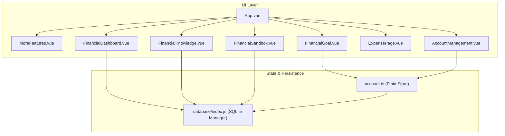
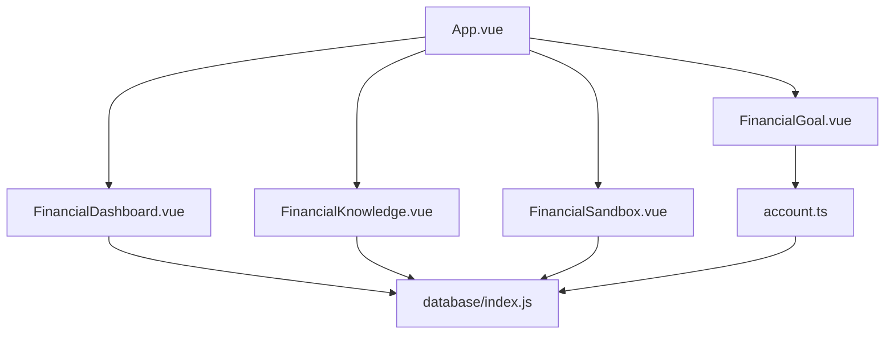
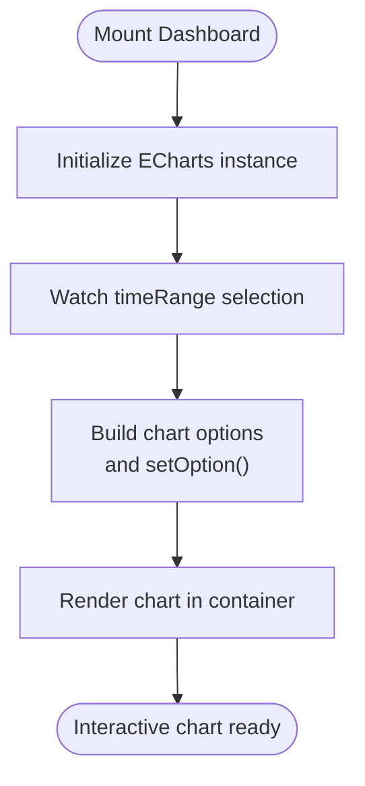
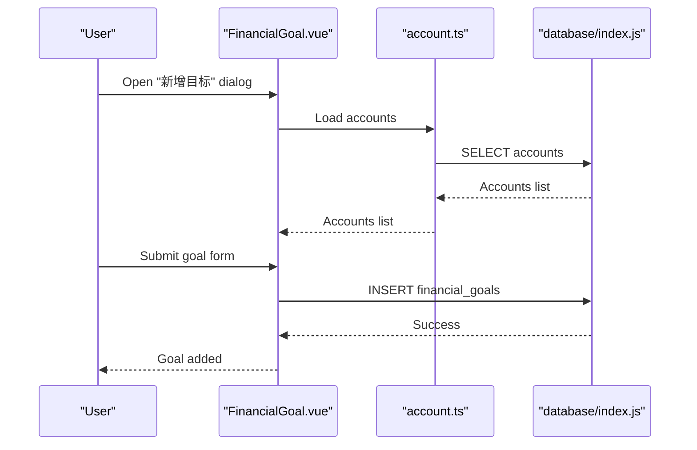
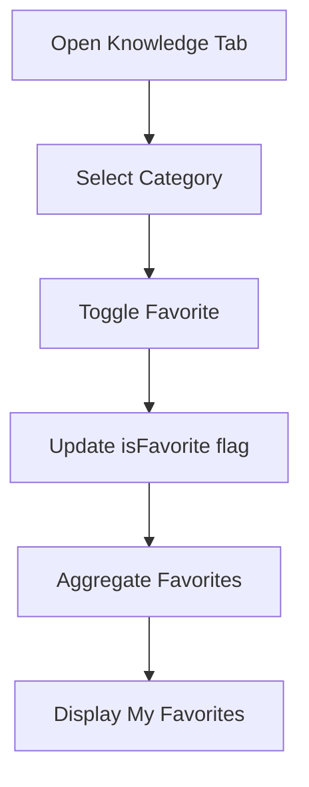
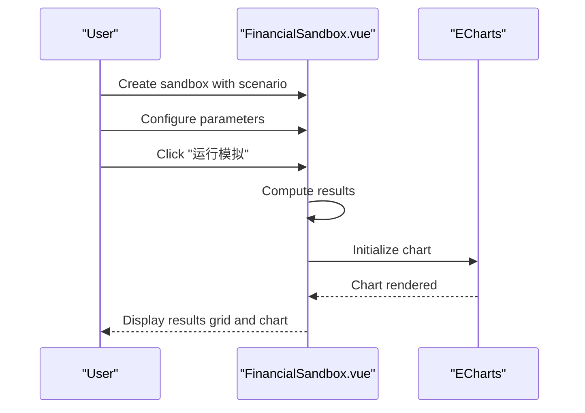
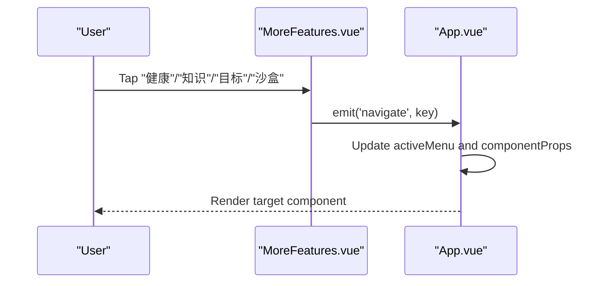
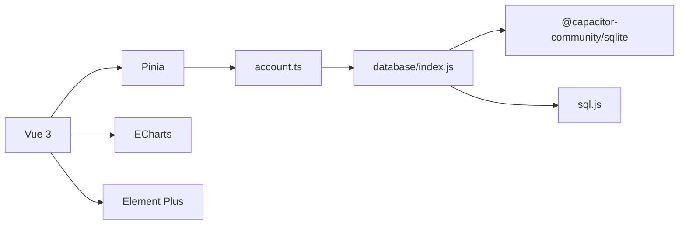

# Financial Dashboard

<cite>
**Referenced Files in This Document**
- [FinancialDashboard.vue](file://src/components/mobile/financial/FinancialDashboard.vue)
- [FinancialGoal.vue](file://src/components/mobile/financial/FinancialGoal.vue)
- [FinancialKnowledge.vue](file://src/components/mobile/financial/FinancialKnowledge.vue)
- [FinancialSandbox.vue](file://src/components/mobile/financial/FinancialSandbox.vue)
- [App.vue](file://src/App.vue)
- [account.ts](file://src/stores/account.ts)
- [index.js](file://src/database/index.js)
- [ExpensePage.vue](file://src/components/mobile/expense/ExpensePage.vue)
- [AccountManagement.vue](file://src/components/mobile/account/AccountManagement.vue)
- [MoreFeatures.vue](file://src/components/mobile/more/MoreFeatures.vue)
- [main.js](file://src/main.ts)
- [package.json](file://package.json)
- [main.js](file://electron/main.js)
</cite>

## Table of Contents
1. [Introduction](#introduction)
2. [Project Structure](#project-structure)
3. [Core Components](#core-components)
4. [Architecture Overview](#architecture-overview)
5. [Detailed Component Analysis](#detailed-component-analysis)
6. [Dependency Analysis](#dependency-analysis)
7. [Performance Considerations](#performance-considerations)
8. [Troubleshooting Guide](#troubleshooting-guide)
9. [Conclusion](#conclusion)
10. [Appendices](#appendices)

## Introduction
This document describes the Financial Dashboard and Analytics system, focusing on:
- Dashboard layout with financial health metrics, account summaries, and spending trends
- Financial goal tracking with goal setting, progress monitoring, and milestone management
- Financial education features with categorized knowledge and favorites
- Financial sandbox environment for scenario modeling and strategy testing
- Real-time data visualization via charts and interactive dashboards
- Practical examples of dashboard customization and financial planning workflows

The system is built with Vue 3, Pinia for state management, Element Plus for UI, ECharts for visualization, and a SQLite-backed persistence layer supporting both web and native environments.

## Project Structure
The application follows a feature-based structure under src/components/mobile, with dedicated folders for account, asset, expense, financial, liability, and more features. The financial module contains the core analytics and planning components.

**Diagram sources**
- [App.vue:65-89](file://src/App.vue#L65-L89)
- [MoreFeatures.vue:26-49](file://src/components/mobile/more/MoreFeatures.vue#L26-L49)
- [FinancialDashboard.vue:1-75](file://src/components/mobile/financial/FinancialDashboard.vue#L1-L75)
- [FinancialGoal.vue:1-140](file://src/components/mobile/financial/FinancialGoal.vue#L1-L140)
- [FinancialKnowledge.vue:1-105](file://src/components/mobile/financial/FinancialKnowledge.vue#L1-L105)
- [FinancialSandbox.vue:1-122](file://src/components/mobile/financial/FinancialSandbox.vue#L1-L122)
- [ExpensePage.vue:1-88](file://src/components/mobile/expense/ExpensePage.vue#L1-L88)
- [AccountManagement.vue:1-200](file://src/components/mobile/account/AccountManagement.vue#L1-L200)
- [account.ts:27-265](file://src/stores/account.ts#L27-L265)
- [index.js:420-776](file://src/database/index.js#L420-L776)

**Section sources**
- [App.vue:65-89](file://src/App.vue#L65-L89)
- [MoreFeatures.vue:26-49](file://src/components/mobile/more/MoreFeatures.vue#L26-L49)

## Core Components
- Financial Dashboard: Presents financial health metrics and a trend chart for net asset growth across monthly, quarterly, and yearly ranges.
- Financial Goals: Allows creation, editing, and investment tracking against financial targets linked to accounts.
- Financial Knowledge: Provides categorized educational content with favorites and a searchable knowledge base.
- Financial Sandbox: Enables scenario modeling with predefined situations and custom parameters, visualizing outcomes.

**Section sources**
- [FinancialDashboard.vue:10-73](file://src/components/mobile/financial/FinancialDashboard.vue#L10-L73)
- [FinancialGoal.vue:11-35](file://src/components/mobile/financial/FinancialGoal.vue#L11-L35)
- [FinancialKnowledge.vue:10-102](file://src/components/mobile/financial/FinancialKnowledge.vue#L10-L102)
- [FinancialSandbox.vue:11-23](file://src/components/mobile/financial/FinancialSandbox.vue#L11-L23)

## Architecture Overview
The system integrates UI components with a centralized database manager and a Pinia store for account data. Navigation is handled centrally, enabling seamless transitions between views.

**Diagram sources**
- [App.vue:65-89](file://src/App.vue#L65-L89)
- [FinancialDashboard.vue:77-170](file://src/components/mobile/financial/FinancialDashboard.vue#L77-L170)
- [FinancialGoal.vue:142-269](file://src/components/mobile/financial/FinancialGoal.vue#L142-L269)
- [FinancialKnowledge.vue:107-215](file://src/components/mobile/financial/FinancialKnowledge.vue#L107-L215)
- [FinancialSandbox.vue:124-269](file://src/components/mobile/financial/FinancialSandbox.vue#L124-L269)
- [account.ts:27-265](file://src/stores/account.ts#L27-L265)
- [index.js:21-190](file://src/database/index.js#L21-L190)

## Detailed Component Analysis

### Financial Dashboard
- Metrics: Liabilities-to-income ratio, emergency fund adequacy, asset-to-liability ratio, savings rate, net asset growth, and a composite financial health score.
- Visualization: Line chart for net asset growth with selectable time range (monthly, quarterly, yearly).
- Status indicators: Color-coded statuses derived from thresholds for each metric.

**Diagram sources**
- [FinancialDashboard.vue:109-170](file://src/components/mobile/financial/FinancialDashboard.vue#L109-L170)

**Section sources**
- [FinancialDashboard.vue:10-73](file://src/components/mobile/financial/FinancialDashboard.vue#L10-L73)
- [FinancialDashboard.vue:172-208](file://src/components/mobile/financial/FinancialDashboard.vue#L172-L208)

### Financial Goals
- Data model: Goals stored in a dedicated table with fields for name, type, target amount, monthly contribution, period, associated account, and status.
- UI: Table view with CRUD actions; dialogs for adding/editing goals and logging investments.
- Behavior: Monthly contribution auto-computed from target amount divided by period; supports linking to accounts via a store.

**Diagram sources**
- [FinancialGoal.vue:174-178](file://src/components/mobile/financial/FinancialGoal.vue#L174-L178)
- [account.ts:38-53](file://src/stores/account.ts#L38-L53)
- [index.js:628-644](file://src/database/index.js#L628-L644)

**Section sources**
- [FinancialGoal.vue:11-35](file://src/components/mobile/financial/FinancialGoal.vue#L11-L35)
- [FinancialGoal.vue:186-210](file://src/components/mobile/financial/FinancialGoal.vue#L186-L210)
- [FinancialGoal.vue:241-269](file://src/components/mobile/financial/FinancialGoal.vue#L241-L269)
- [index.js:628-644](file://src/database/index.js#L628-L644)

### Financial Knowledge
- Content: Books, science articles, opinion pieces, low-fee education, and basic finance terms.
- Features: Toggle favorites across categories; “My Favorites” tab aggregates saved items.
- UI: Responsive card grid with hover effects and action buttons.

**Diagram sources**
- [FinancialKnowledge.vue:203-214](file://src/components/mobile/financial/FinancialKnowledge.vue#L203-L214)

**Section sources**
- [FinancialKnowledge.vue:10-102](file://src/components/mobile/financial/FinancialKnowledge.vue#L10-L102)
- [FinancialKnowledge.vue:203-214](file://src/components/mobile/financial/FinancialKnowledge.vue#L203-L214)

### Financial Sandbox
- Scenarios: Predefined situations (e.g., unemployment, interest rate increase, market drop, extra savings, early repayment) and custom simulations.
- Simulation: Configurable parameters (income changes, expense changes, market movement, interest rate shifts) with results visualization.
- Visualization: Combined line/bar chart for net assets and monthly cash flow.

**Diagram sources**
- [FinancialSandbox.vue:154-172](file://src/components/mobile/financial/FinancialSandbox.vue#L154-L172)
- [FinancialSandbox.vue:218-269](file://src/components/mobile/financial/FinancialSandbox.vue#L218-L269)

**Section sources**
- [FinancialSandbox.vue:11-23](file://src/components/mobile/financial/FinancialSandbox.vue#L11-L23)
- [FinancialSandbox.vue:158-172](file://src/components/mobile/financial/FinancialSandbox.vue#L158-L172)
- [FinancialSandbox.vue:218-269](file://src/components/mobile/financial/FinancialSandbox.vue#L218-L269)

### Navigation and Integration
- Central navigation: App.vue maps menu keys to components and passes contextual props (e.g., year/month for expense pages).
- Footer/menu integration: MoreFeatures.vue exposes quick links to dashboard, knowledge, goals, and sandbox.

**Diagram sources**
- [MoreFeatures.vue:105-107](file://src/components/mobile/more/MoreFeatures.vue#L105-L107)
- [App.vue:119-137](file://src/App.vue#L119-L137)
- [App.vue:65-89](file://src/App.vue#L65-L89)

**Section sources**
- [App.vue:65-89](file://src/App.vue#L65-L89)
- [MoreFeatures.vue:26-49](file://src/components/mobile/more/MoreFeatures.vue#L26-L49)

## Dependency Analysis
- UI libraries: Element Plus for UI components; Vue 3 and Pinia for reactivity/state.
- Visualization: ECharts for charts and graphs.
- Persistence: SQLite via Capacitor SQLite (native) and sql.js (web), abstracted behind a unified database manager.
- Stores: Pinia store encapsulates account CRUD and transactional operations.

**Diagram sources**
- [package.json:19-36](file://package.json#L19-L36)
- [main.js:13-16](file://src/main.ts#L13-L16)
- [index.js:8-11](file://src/database/index.js#L8-L11)
- [account.ts:5-6](file://src/stores/account.ts#L5-L6)

**Section sources**
- [package.json:19-36](file://package.json#L19-L36)
- [main.js:13-16](file://src/main.ts#L13-L16)
- [index.js:8-11](file://src/database/index.js#L8-L11)
- [account.ts:5-6](file://src/stores/account.ts#L5-L6)

## Performance Considerations
- Database caching: Query results are cached to reduce repeated reads; cache is cleared on write operations.
- Debounced persistence (web): sql.js writes are throttled to localStorage to avoid frequent disk I/O.
- Indexes: Strategic indexes on foreign keys and status fields improve query performance for accounts, transactions, goals, and liabilities.
- Lazy initialization: Database connections are reused and singletons to minimize overhead.

**Section sources**
- [index.js:200-209](file://src/database/index.js#L200-L209)
- [index.js:379-408](file://src/database/index.js#L379-L408)
- [index.js:676-688](file://src/database/index.js#L676-L688)

## Troubleshooting Guide
- Database connectivity errors: Verify platform detection and connection flow; ensure Capacitor SQLite is properly synced for native builds.
- Transaction failures: Review rollback logic and error propagation in account transfers and balance adjustments.
- Chart rendering issues: Confirm chart container refs are mounted before initializing ECharts; ensure options are rebuilt on data changes.
- Navigation anomalies: Validate component mapping and prop forwarding for date-sensitive components.

**Section sources**
- [index.js:81-190](file://src/database/index.js#L81-L190)
- [account.ts:183-262](file://src/stores/account.ts#L183-L262)
- [FinancialDashboard.vue:117-122](file://src/components/mobile/financial/FinancialDashboard.vue#L117-L122)
- [App.vue:119-137](file://src/App.vue#L119-L137)

## Conclusion
The Financial Dashboard and Analytics system provides a cohesive suite of financial insights, planning, and experimentation tools. It combines a responsive UI with robust data persistence, enabling users to track financial health, manage goals, learn financial concepts, and test scenarios—all within a single application.

## Appendices

### Practical Examples

- Dashboard customization
  - Adjust metric thresholds and status labels in the dashboard component to reflect personal or regional standards.
  - Extend the time range selector to include additional periods (e.g., weekly) and update chart data accordingly.

  **Section sources**
  - [FinancialDashboard.vue:172-208](file://src/components/mobile/financial/FinancialDashboard.vue#L172-L208)
  - [FinancialDashboard.vue:124-169](file://src/components/mobile/financial/FinancialDashboard.vue#L124-L169)

- Financial planning workflows
  - Set up a goal with a defined target and period; the system auto-calculates monthly contributions.
  - Link the goal to a liquid account for automatic investment tracking.
  - Monitor progress via the dashboard’s financial health metrics and adjust contributions as needed.

  **Section sources**
  - [FinancialGoal.vue:180-184](file://src/components/mobile/financial/FinancialGoal.vue#L180-L184)
  - [FinancialGoal.vue:241-249](file://src/components/mobile/financial/FinancialGoal.vue#L241-L249)
  - [FinancialDashboard.vue:10-58](file://src/components/mobile/financial/FinancialDashboard.vue#L10-L58)

- Scenario modeling
  - Choose a predefined scenario (e.g., “Unemployment 3 months”) or create a custom one.
  - Modify parameters such as income change, expense change, and market movement to observe outcomes.
  - Export results for external analysis or sharing.

  **Section sources**
  - [FinancialSandbox.vue:135-192](file://src/components/mobile/financial/FinancialSandbox.vue#L135-L192)
  - [FinancialSandbox.vue:218-234](file://src/components/mobile/financial/FinancialSandbox.vue#L218-L234)

- Real-time data visualization
  - Use ECharts to render interactive charts for net asset growth and sandbox results.
  - Ensure responsive sizing and dynamic updates when switching time ranges or simulation parameters.

  **Section sources**
  - [FinancialDashboard.vue:117-170](file://src/components/mobile/financial/FinancialDashboard.vue#L117-L170)
  - [FinancialSandbox.vue:236-269](file://src/components/mobile/financial/FinancialSandbox.vue#L236-L269)

- Financial education
  - Browse categories (books, science, opinions, fees, terms) and mark favorites for later review.
  - Use the “My Favorites” tab to quickly revisit curated content.

  **Section sources**
  - [FinancialKnowledge.vue:10-102](file://src/components/mobile/financial/FinancialKnowledge.vue#L10-L102)
  - [FinancialKnowledge.vue:203-214](file://src/components/mobile/financial/FinancialKnowledge.vue#L203-L214)

- Electron packaging
  - The Electron main process creates a window, loads development or production URLs, and handles IPC communication.

  **Section sources**
  - [electron/main.js:19-45](file://electron/main.js#L19-L45)
  - [electron/main.js:67-69](file://electron/main.js#L67-L69)