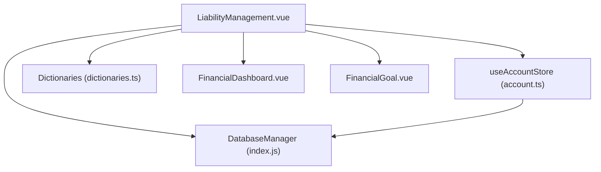
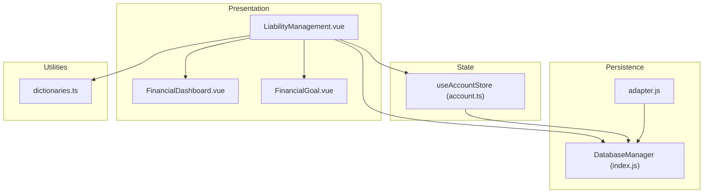
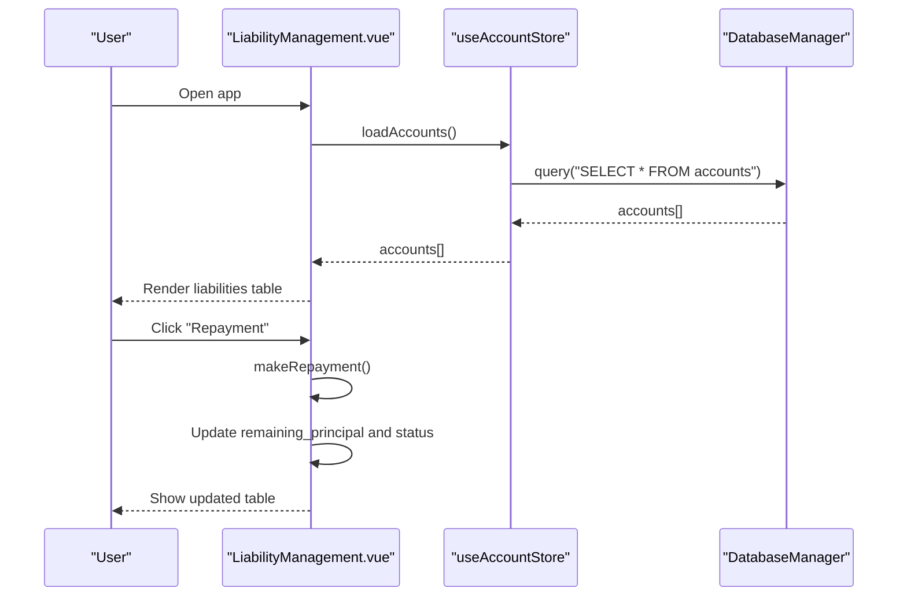
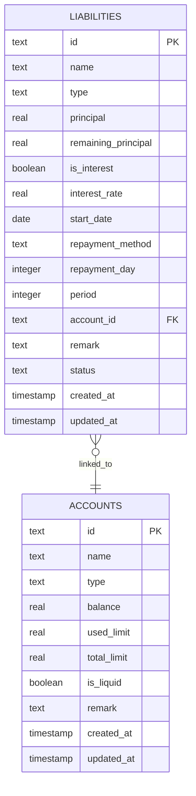
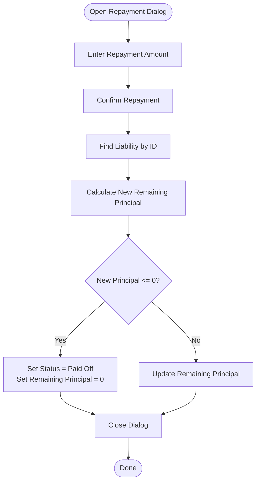
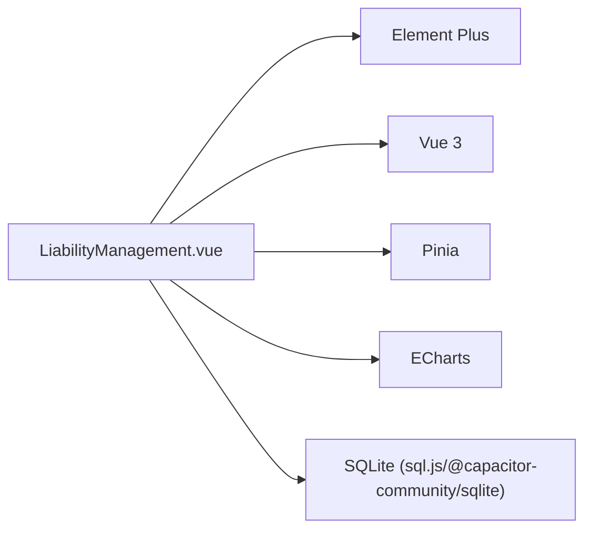

# Liability Management

<cite>
**Referenced Files in This Document**
- [LiabilityManagement.vue](file://src/components/mobile/liability/LiabilityManagement.vue)
- [account.ts](file://src/stores/account.ts)
- [index.js](file://src/database/index.js)
- [adapter.js](file://src/database/adapter.js)
- [FinancialDashboard.vue](file://src/components/mobile/financial/FinancialDashboard.vue)
- [FinancialGoal.vue](file://src/components/mobile/financial/FinancialGoal.vue)
- [dictionaries.ts](file://src/utils/dictionaries.ts)
- [package.json](file://package.json)
</cite>

## Table of Contents
1. [Introduction](#introduction)
2. [Project Structure](#project-structure)
3. [Core Components](#core-components)
4. [Architecture Overview](#architecture-overview)
5. [Detailed Component Analysis](#detailed-component-analysis)
6. [Dependency Analysis](#dependency-analysis)
7. [Performance Considerations](#performance-considerations)
8. [Troubleshooting Guide](#troubleshooting-guide)
9. [Conclusion](#conclusion)
10. [Appendices](#appendices)

## Introduction
This document describes the Liability Management feature of the finance application. It covers how the system tracks financial obligations (debts) such as credit cards, loans, and other liabilities; how it supports debt repayment planning via payment schedules, interest calculations, and payoff strategies; and how it enables monitoring of payment history and delinquency alerts. It also documents categorization by type, interest rates, and due dates, along with debt consolidation features and payoff optimization recommendations. Practical workflows and scenarios are included to help users understand how to track and manage their debts effectively.

## Project Structure
The Liability Management feature is implemented as a Vue single-file component with supporting infrastructure for data persistence and state management. The component integrates with:
- A Pinia store for account data
- An internal database manager for SQLite-backed persistence
- Utility dictionaries for consistent enumerations

**Diagram sources**
- [LiabilityManagement.vue:1-377](file://src/components/mobile/liability/LiabilityManagement.vue#L1-L377)
- [account.ts:1-265](file://src/stores/account.ts#L1-L265)
- [index.js:1-935](file://src/database/index.js#L1-L935)
- [dictionaries.ts:39-89](file://src/utils/dictionaries.ts#L39-L89)
- [FinancialDashboard.vue:1-279](file://src/components/mobile/financial/FinancialDashboard.vue#L1-L279)
- [FinancialGoal.vue:1-288](file://src/components/mobile/financial/FinancialGoal.vue#L1-L288)

**Section sources**
- [LiabilityManagement.vue:1-377](file://src/components/mobile/liability/LiabilityManagement.vue#L1-L377)
- [account.ts:1-265](file://src/stores/account.ts#L1-L265)
- [index.js:1-935](file://src/database/index.js#L1-L935)
- [dictionaries.ts:39-89](file://src/utils/dictionaries.ts#L39-L89)
- [FinancialDashboard.vue:1-279](file://src/components/mobile/financial/FinancialDashboard.vue#L1-L279)
- [FinancialGoal.vue:1-288](file://src/components/mobile/financial/FinancialGoal.vue#L1-L288)

## Core Components
- Liability Management UI: Provides CRUD operations for liabilities, repayment actions, and displays key metrics such as principal, remaining principal, interest rate, repayment method, and status.
- Account Store: Supplies account data for binding liabilities to funding accounts and supports account-related operations used during repayment.
- Database Manager: Manages SQLite initialization, migrations, queries, and transactions for persistent storage of liabilities and related entities.
- Dictionaries: Centralizes enumerations for liability status and repayment types to ensure consistency across components.
- Financial Dashboard: Offers financial health metrics that contextualize liabilities within personal finance health.
- Financial Goal: Supports goal-driven debt reduction strategies by linking targets to accounts and tracking progress.

**Section sources**
- [LiabilityManagement.vue:1-377](file://src/components/mobile/liability/LiabilityManagement.vue#L1-L377)
- [account.ts:1-265](file://src/stores/account.ts#L1-L265)
- [index.js:604-627](file://src/database/index.js#L604-L627)
- [dictionaries.ts:39-49](file://src/utils/dictionaries.ts#L39-L49)
- [FinancialDashboard.vue:1-279](file://src/components/mobile/financial/FinancialDashboard.vue#L1-L279)
- [FinancialGoal.vue:1-288](file://src/components/mobile/financial/FinancialGoal.vue#L1-L288)

## Architecture Overview
The Liability Management feature follows a layered architecture:
- Presentation Layer: Vue component renders forms, tables, and dialogs for managing liabilities and repayments.
- Domain Layer: Business logic for repayment updates and status transitions resides in the component’s script block.
- Persistence Layer: DatabaseManager encapsulates SQLite operations, ensuring cross-platform compatibility and data integrity.
- State Layer: Pinia store manages account state and exposes methods to load and update account data used by the liability UI.

**Diagram sources**
- [LiabilityManagement.vue:1-377](file://src/components/mobile/liability/LiabilityManagement.vue#L1-L377)
- [account.ts:1-265](file://src/stores/account.ts#L1-L265)
- [index.js:1-935](file://src/database/index.js#L1-L935)
- [adapter.js:1-34](file://src/database/adapter.js#L1-L34)
- [dictionaries.ts:39-89](file://src/utils/dictionaries.ts#L39-L89)
- [FinancialDashboard.vue:1-279](file://src/components/mobile/financial/FinancialDashboard.vue#L1-L279)
- [FinancialGoal.vue:1-288](file://src/components/mobile/financial/FinancialGoal.vue#L1-L288)

## Detailed Component Analysis

### Liability Management UI
Responsibilities:
- Display liabilities in a sortable, filterable table with key attributes (principal, remaining principal, interest rate, repayment method, status).
- Provide dialogs for adding/editing liabilities with fields for type, principal, interest flag, rate, start date, repayment method, repayment day, period, linked account, remarks, and status.
- Enable repayment actions with normal and early payoff modes.
- Update remaining principal and status upon successful repayment.

Key behaviors:
- On mount, loads accounts and initializes with sample liabilities.
- Repayment logic reduces remaining principal and sets status to “paid off” when fully settled.

**Diagram sources**
- [LiabilityManagement.vue:243-358](file://src/components/mobile/liability/LiabilityManagement.vue#L243-L358)
- [account.ts:34-53](file://src/stores/account.ts#L34-L53)
- [index.js:199-264](file://src/database/index.js#L199-L264)

**Section sources**
- [LiabilityManagement.vue:1-377](file://src/components/mobile/liability/LiabilityManagement.vue#L1-L377)

### Database Schema for Liabilities
The liabilities table captures essential attributes for debt tracking and repayment planning:
- Identity: id, name
- Obligation: type, principal, remaining_principal, is_interest, interest_rate, start_date
- Schedule: repayment_method, repayment_day, period
- Association: account_id (foreign key to accounts)
- Metadata: remark, status, timestamps

**Diagram sources**
- [index.js:604-627](file://src/database/index.js#L604-L627)

**Section sources**
- [index.js:604-627](file://src/database/index.js#L604-L627)

### Repayment Logic Flow
The repayment action updates the remaining principal and status:
- Retrieve the selected liability
- Subtract repayment amount from remaining principal
- If remaining principal becomes zero or negative, mark as paid off

**Diagram sources**
- [LiabilityManagement.vue:345-358](file://src/components/mobile/liability/LiabilityManagement.vue#L345-L358)

**Section sources**
- [LiabilityManagement.vue:345-358](file://src/components/mobile/liability/LiabilityManagement.vue#L345-L358)

### Debt Repayment Planning and Payoff Strategies
Supported repayment methods:
- Equal Principal and Interest (EPI)
- Equal Principal (EP)
- Revolving (as needed)

Guidance:
- EPI spreads interest and principal across fixed installments, simplifying budgeting.
- EP pays down principal faster, reducing total interest over time.
- Revolving allows flexible payments; interest may accrue daily or monthly depending on terms.

Note: The UI currently simulates repayment updates. Full amortization scheduling and payoff optimization would require extending the backend with calculation logic and persisting schedule records.

**Section sources**
- [LiabilityManagement.vue:76-81](file://src/components/mobile/liability/LiabilityManagement.vue#L76-L81)

### Liability Categorization and Attributes
Categories supported for liabilities:
- Mortgage, Auto Loan, Credit Card, Consumer Loan, Renovation Loan, Student Loan, Online Lending, E-commerce Installments, Rent Installments, Personal Borrowing, Operating Loan, Other Liabilities

Attributes tracked:
- Type, Principal, Remaining Principal, Interest Flag, Annual Interest Rate, Start Date, Repayment Method, Repayment Day, Period, Linked Account, Remarks, Status

**Section sources**
- [LiabilityManagement.vue:48-62](file://src/components/mobile/liability/LiabilityManagement.vue#L48-L62)
- [LiabilityManagement.vue:112-126](file://src/components/mobile/liability/LiabilityManagement.vue#L112-L126)

### Debt Consolidation and Payoff Optimization Recommendations
Current capabilities:
- The UI supports grouping liabilities by account and viewing balances.
- Financial Goal component enables setting targets for debt reduction.

Recommendations:
- Consolidation: Aggregate high-rate unsecured debt into lower-rate secured debt or personal loan to reduce weighted average interest rate.
- Payoff strategies: Consider debt avalanche (highest APR first) or snowball (smallest balance first) approaches; align with Financial Goal targets.
- Monitoring: Track monthly cash flow impact and adjust contributions to financial goals accordingly.

**Section sources**
- [FinancialGoal.vue:1-288](file://src/components/mobile/financial/FinancialGoal.vue#L1-L288)
- [FinancialDashboard.vue:1-279](file://src/components/mobile/financial/FinancialDashboard.vue#L1-L279)

### Payment History Tracking and Delinquency Alerts
Tracking:
- Associate liabilities with funding accounts to record repayment transactions.
- Use Financial Dashboard metrics (liabilities-to-income ratio, asset-liability ratio) to assess risk exposure.

Alerts:
- Define thresholds for overdue periods and high utilization ratios to trigger notifications.
- Integrate with Financial Goal progress to highlight missed targets impacting payoff timelines.

**Section sources**
- [FinancialDashboard.vue:1-279](file://src/components/mobile/financial/FinancialDashboard.vue#L1-L279)
- [FinancialGoal.vue:1-288](file://src/components/mobile/financial/FinancialGoal.vue#L1-L288)

### Debt Management Strategies, Minimum Payments, and Early Payoff Benefits
Strategies:
- Minimum payment: Calculate based on remaining principal, interest rate, and repayment method.
- Early payoff: Reduces total interest paid and shortens term; improves credit score and reduces financial stress.

Benefits:
- Lower total interest over life of loan.
- Faster equity build-up (for secured loans).
- Improved debt-to-income ratio and financial health scores.

**Section sources**
- [LiabilityManagement.vue:76-81](file://src/components/mobile/liability/LiabilityManagement.vue#L76-L81)

### Practical Workflows and Scenarios
Workflow 1: Add a new liability
- Open “Add Liability” dialog
- Select type, enter principal, set interest flag and rate, choose repayment method and period, select linked account
- Save and observe the liability appear in the table

Workflow 2: Make a repayment
- Select a liability and click “Repayment”
- Enter amount and repayment type (normal or early)
- Confirm; remaining principal updates and status may change to paid off

Workflow 3: Plan for payoff
- Set a financial goal aligned with debt reduction
- Allocate monthly contributions toward the goal
- Monitor financial health metrics to assess progress

**Section sources**
- [LiabilityManagement.vue:42-104](file://src/components/mobile/liability/LiabilityManagement.vue#L42-L104)
- [LiabilityManagement.vue:179-201](file://src/components/mobile/liability/LiabilityManagement.vue#L179-L201)
- [FinancialGoal.vue:37-72](file://src/components/mobile/financial/FinancialGoal.vue#L37-L72)

## Dependency Analysis
External libraries and integrations:
- Element Plus: UI components for forms, tables, and dialogs
- ECharts: Charts for financial dashboard trends
- Pinia: State management for accounts
- sql.js and @capacitor-community/sqlite: Cross-platform SQLite support
- Vue 3: Reactive UI framework

**Diagram sources**
- [package.json:19-36](file://package.json#L19-L36)
- [LiabilityManagement.vue:1-377](file://src/components/mobile/liability/LiabilityManagement.vue#L1-L377)
- [FinancialDashboard.vue:1-279](file://src/components/mobile/financial/FinancialDashboard.vue#L1-L279)

**Section sources**
- [package.json:19-36](file://package.json#L19-L36)

## Performance Considerations
- Database caching: The DatabaseManager maintains an in-memory cache keyed by SQL and parameters to reduce repeated queries.
- Debounced persistence (web): Web builds defer SQLite persistence to localStorage with throttling to avoid frequent writes.
- Indexes: Predefined indexes on foreign keys and status improve query performance for liabilities and related entities.

Recommendations:
- Batch updates for bulk repayments
- Use pagination for large liability lists
- Clear caches after significant mutations

**Section sources**
- [index.js:301-303](file://src/database/index.js#L301-L303)
- [index.js:379-391](file://src/database/index.js#L379-L391)
- [index.js:676-688](file://src/database/index.js#L676-L688)

## Troubleshooting Guide
Common issues and resolutions:
- Cannot connect to database
  - Ensure platform-specific initialization is invoked; Capacitor SQLite vs. sql.js
  - Verify database initialization and table creation steps

- Account not found when repaying
  - Confirm account exists and is loaded via the account store
  - Re-fetch accounts if stale

- Repayment does not update
  - Check that the liability exists and ID matches
  - Verify remaining principal arithmetic and status update logic

- Financial metrics not reflecting changes
  - Refresh financial dashboard data or re-run calculations
  - Confirm goal progress updates after repayments

**Section sources**
- [adapter.js:14-33](file://src/database/adapter.js#L14-L33)
- [account.ts:34-53](file://src/stores/account.ts#L34-L53)
- [LiabilityManagement.vue:345-358](file://src/components/mobile/liability/LiabilityManagement.vue#L345-L358)

## Conclusion
The Liability Management feature provides a solid foundation for tracking and managing debts, including repayment actions, categorization, and integration with financial goals and health metrics. While the current implementation focuses on UI-driven repayment updates and basic scheduling, extending it with full amortization engines, payoff optimization, and automated alerts would significantly enhance its capabilities for comprehensive debt management.

## Appendices

### Enumerations Reference
- Liability Status: Unpaid, Paid Off
- Repayment Types: Normal, Early Payoff

**Section sources**
- [dictionaries.ts:39-49](file://src/utils/dictionaries.ts#L39-L49)