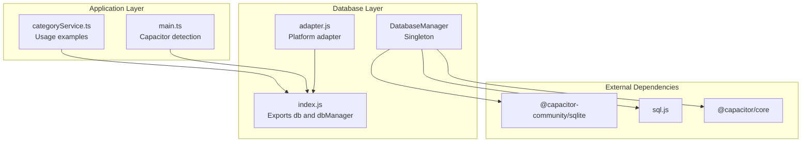
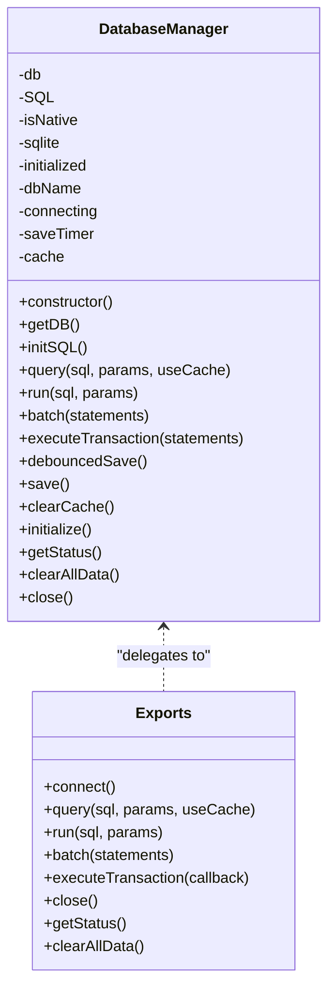
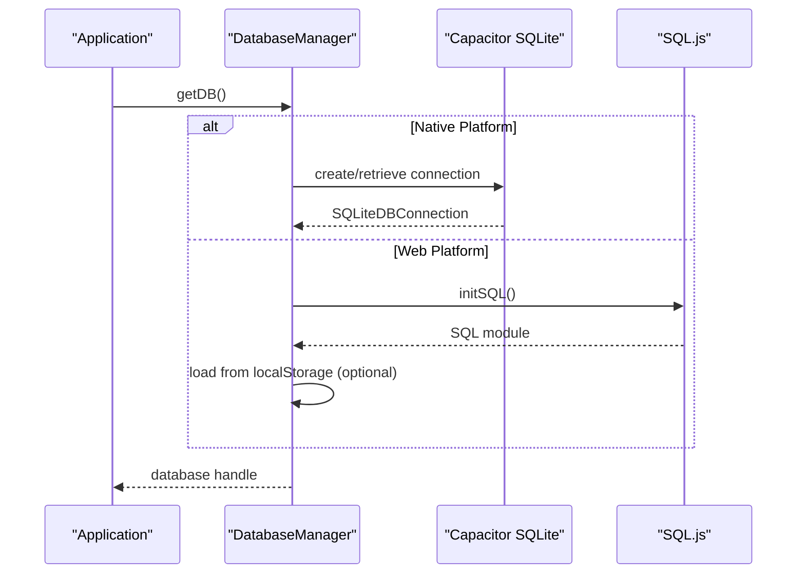
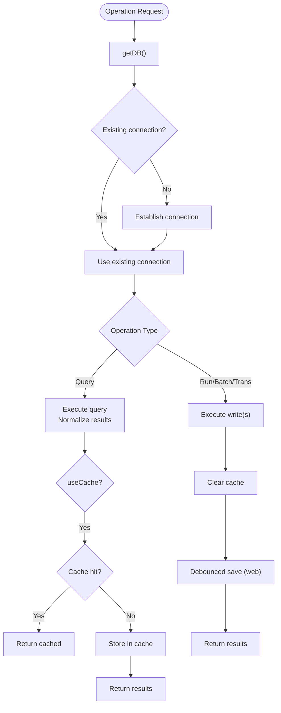
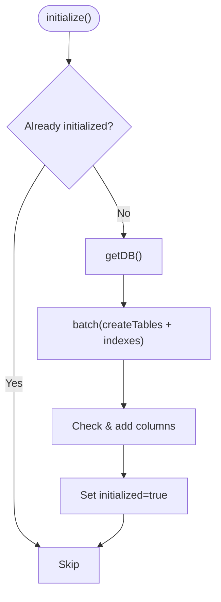
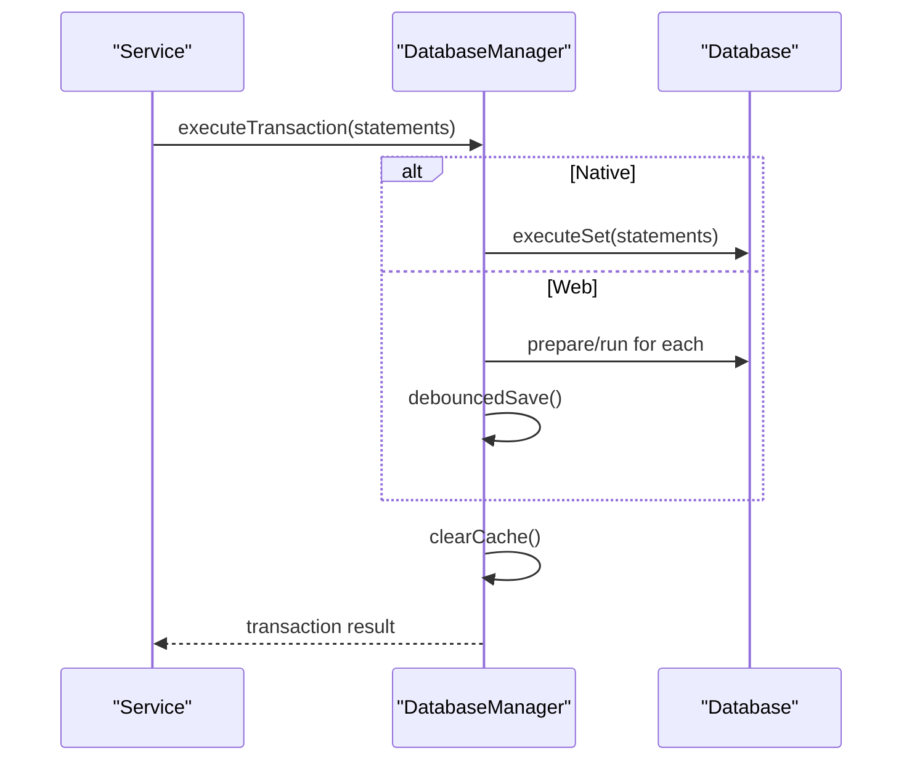
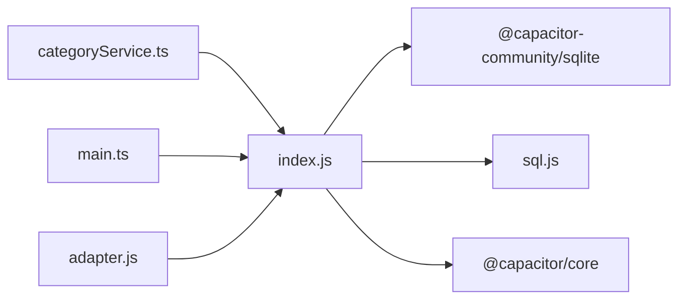

# Data Access Layer

<cite>
**Referenced Files in This Document**
- [index.js](file://src/database/index.js)
- [adapter.js](file://src/database/adapter.js)
- [categoryService.ts](file://src/services/categoryService.ts)
- [package.json](file://package.json)
- [main.ts](file://src/main.ts)
</cite>

## Table of Contents
1. [Introduction](#introduction)
2. [Project Structure](#project-structure)
3. [Core Components](#core-components)
4. [Architecture Overview](#architecture-overview)
5. [Detailed Component Analysis](#detailed-component-analysis)
6. [Dependency Analysis](#dependency-analysis)
7. [Performance Considerations](#performance-considerations)
8. [Troubleshooting Guide](#troubleshooting-guide)
9. [Conclusion](#conclusion)

## Introduction
This document explains the Data Access Layer implementation for the Finance App, focusing on the DatabaseManager class that provides a unified API for database operations across platforms. It covers the singleton pattern usage, platform-specific implementations for Capacitor SQLite (mobile) and SQL.js (web), and the dual-strategy approach with native SQLite for mobile and web-based SQL.js with localStorage persistence. It documents the unified API surface (query, run, batch, executeTransaction), connection management, caching mechanisms, performance optimizations, error handling, and migration strategies.

## Project Structure
The Data Access Layer is centered around a single module that exports a unified interface and a DatabaseManager singleton. Supporting files include a minimal adapter and usage examples in services.

**Diagram sources**
- [index.js:1-935](file://src/database/index.js#L1-L935)
- [adapter.js:1-34](file://src/database/adapter.js#L1-L34)
- [categoryService.ts:1-260](file://src/services/categoryService.ts#L1-L260)
- [main.ts:1-16](file://src/main.ts#L1-L16)

**Section sources**
- [index.js:1-935](file://src/database/index.js#L1-L935)
- [adapter.js:1-34](file://src/database/adapter.js#L1-L34)
- [categoryService.ts:1-260](file://src/services/categoryService.ts#L1-L260)
- [main.ts:1-16](file://src/main.ts#L1-L16)

## Core Components
- DatabaseManager: Implements the singleton pattern, manages platform detection, connection lifecycle, caching, and unified API for database operations.
- Unified API: Provides query, run, batch, executeTransaction, and auxiliary helpers (initialize, getStatus, clearAllData).
- Platform Strategy: Uses Capacitor SQLite on native platforms and SQL.js with localStorage persistence on web environments.
- Caching: Query result caching via an internal Map to reduce repeated reads.
- Persistence: Native platforms persist via Capacitor SQLite; web platforms export/import a buffer to/from localStorage with throttled saves.

**Section sources**
- [index.js:20-935](file://src/database/index.js#L20-L935)

## Architecture Overview
The DatabaseManager encapsulates platform differences behind a consistent interface. On native platforms, it uses Capacitor SQLite for robust, native database connectivity. On web platforms, it initializes SQL.js and persists data to localStorage with debounced writes.

**Diagram sources**
- [index.js:20-935](file://src/database/index.js#L20-L935)

**Section sources**
- [index.js:20-935](file://src/database/index.js#L20-L935)

## Detailed Component Analysis

### DatabaseManager Singleton
- Purpose: Centralizes database connection, platform detection, caching, and operation dispatch.
- Singleton Pattern: Instantiated once globally and exported as both a convenience object and the manager instance.
- Platform Detection: Uses Capacitor.isNativePlatform() to select the correct backend.
- Connection Lifecycle: Ensures only one connection is active; prevents concurrent connection attempts; handles retrieval vs. creation of connections on native platforms.

Key behaviors:
- getDB(): Returns an existing connection or establishes a new one, with concurrency guards.
- initSQL(): Lazily initializes SQL.js on web platforms.
- query(): Supports positional parameters, caches results, and normalizes results to arrays of objects.
- run(): Executes write operations and clears cache afterward.
- batch(): Executes multiple statements atomically where applicable.
- executeTransaction(): Delegates to native transaction APIs when available.
- Persistence: Debounced save to localStorage on web; native platforms rely on Capacitor SQLite persistence.

**Section sources**
- [index.js:20-190](file://src/database/index.js#L20-L190)
- [index.js:192-374](file://src/database/index.js#L192-L374)
- [index.js:376-408](file://src/database/index.js#L376-L408)
- [index.js:418-776](file://src/database/index.js#L418-L776)

### Unified API Surface
- query(sql, params = [], useCache = false): Executes SELECT-like statements, returns normalized rows, with optional caching.
- run(sql, params = []): Executes INSERT/UPDATE/DELETE; returns lastID and changes; clears cache.
- batch(statements): Executes an array of { sql, params } statements; returns per-statement results; clears cache.
- executeTransaction(statements): Executes a transaction set; clears cache; persists on web platforms.
- Additional helpers: initialize(), getStatus(), clearAllData(), close().

Usage examples in the codebase:
- CategoryService demonstrates CRUD operations using db.query and db.run.
- Status checks use db.connect and db.query to validate connectivity.

**Section sources**
- [index.js:192-374](file://src/database/index.js#L192-L374)
- [index.js:896-931](file://src/database/index.js#L896-L931)
- [categoryService.ts:14-175](file://src/services/categoryService.ts#L14-L175)
- [categoryService.ts:181-194](file://src/services/categoryService.ts#L181-L194)

### Platform-Specific Implementations
- Native (Capacitor SQLite):
  - Uses SQLiteConnection and SQLiteDBConnection.
  - Retrieves or creates connections; opens databases; runs statements.
  - executeTransaction delegates to native transaction APIs.
- Web (SQL.js):
  - Initializes SQL.js module lazily.
  - Loads database from localStorage if present; otherwise creates a new in-memory database.
  - Persists changes to localStorage with a throttle timer; debouncedSave() coordinates timing.

**Diagram sources**
- [index.js:56-190](file://src/database/index.js#L56-L190)

**Section sources**
- [index.js:56-190](file://src/database/index.js#L56-L190)

### Connection Management and Caching
- Single Connection: Ensures a single active connection per process; prevents race conditions during connection establishment.
- Caching: Query results cached in an internal Map keyed by SQL+params; cache cleared on write operations.
- Throttled Persistence: Web platform persists to localStorage after a delay to minimize write frequency.

**Diagram sources**
- [index.js:56-374](file://src/database/index.js#L56-L374)

**Section sources**
- [index.js:56-374](file://src/database/index.js#L56-L374)

### Migration and Schema Evolution
- initialize(): Creates tables and indexes; performs incremental migrations for existing users by checking column existence and adding missing columns.
- getColumns(): Utility to introspect table schema for migration decisions.

**Diagram sources**
- [index.js:418-776](file://src/database/index.js#L418-L776)

**Section sources**
- [index.js:418-776](file://src/database/index.js#L418-L776)

### Transaction Handling and Batch Processing
- executeTransaction(statements): Uses native transaction capabilities when available; clears cache and persists on web.
- batch(statements): Iterates through statement sets; returns per-statement results; clears cache and persists on web.

**Diagram sources**
- [index.js:354-374](file://src/database/index.js#L354-L374)

**Section sources**
- [index.js:316-374](file://src/database/index.js#L316-L374)

### CRUD Examples in Application Services
- CategoryService demonstrates:
  - Retrieval: db.query with optional filters and ordering.
  - Creation: db.run with INSERT.
  - Update: db.run with dynamic UPDATE composition.
  - Deletion: db.run with DELETE.
  - Health check: db.connect and db.query to validate connectivity.

These examples illustrate the unified API’s practical usage across typical CRUD scenarios.

**Section sources**
- [categoryService.ts:14-175](file://src/services/categoryService.ts#L14-L175)
- [categoryService.ts:181-194](file://src/services/categoryService.ts#L181-L194)

## Dependency Analysis
- External libraries:
  - @capacitor-community/sqlite: Native SQLite plugin integration.
  - sql.js: Web-based SQLite engine.
  - @capacitor/core: Platform detection and runtime metadata.
- Internal dependencies:
  - index.js exports a convenience object and the manager instance.
  - adapter.js provides a minimal platform adapter abstraction.
  - categoryService.ts consumes the unified API.

**Diagram sources**
- [index.js:1-10](file://src/database/index.js#L1-L10)
- [adapter.js:1-6](file://src/database/adapter.js#L1-L6)
- [categoryService.ts:1](file://src/services/categoryService.ts#L1)
- [main.ts:8](file://src/main.ts#L8)

**Section sources**
- [package.json:19-36](file://package.json#L19-L36)
- [index.js:1-10](file://src/database/index.js#L1-L10)
- [adapter.js:1-6](file://src/database/adapter.js#L1-L6)
- [categoryService.ts:1](file://src/services/categoryService.ts#L1)
- [main.ts:8](file://src/main.ts#L8)

## Performance Considerations
- Connection Concurrency: Prevents multiple simultaneous connection attempts; reduces contention.
- Query Caching: Reduces repeated reads for identical queries; cache invalidated on writes.
- Batch Operations: Groups multiple statements to minimize round-trips; clears cache afterward.
- Debounced Persistence: Limits localStorage writes on web to improve responsiveness.
- Indexes: Pre-created indexes on frequently queried columns to speed up SELECT operations.
- Parameter Binding: Uses positional parameters consistently across platforms to avoid overhead.

[No sources needed since this section provides general guidance]

## Troubleshooting Guide
Common issues and remedies:
- Connection Failures:
  - Native: Verify Capacitor SQLite plugin installation and permissions; inspect logs from getDB().
  - Web: Ensure SQL.js initialization succeeds; confirm localStorage availability.
- Query Errors:
  - Validate SQL syntax and parameter order; use positional parameters.
  - Check cache invalidation after writes.
- Transaction Errors:
  - On native, rely on executeTransaction for atomicity; on web, ensure statements are compatible with SQL.js.
- Persistence Issues (Web):
  - Confirm debouncedSave timer is not conflicting; verify localStorage quota and availability.

Operational diagnostics:
- getStatus(): Inspect connection state, initialization status, and cache size.
- clearAllData(): Use for testing; wraps deletions in a transaction and clears cache.

**Section sources**
- [index.js:826-834](file://src/database/index.js#L826-L834)
- [index.js:839-890](file://src/database/index.js#L839-L890)

## Conclusion
The Data Access Layer centers on a robust DatabaseManager singleton that abstracts platform differences, provides a unified API for database operations, and optimizes performance through caching, batching, and throttled persistence. The design cleanly separates native and web implementations while maintaining a consistent developer experience. The included migration and health-check utilities support long-term maintainability and reliability.