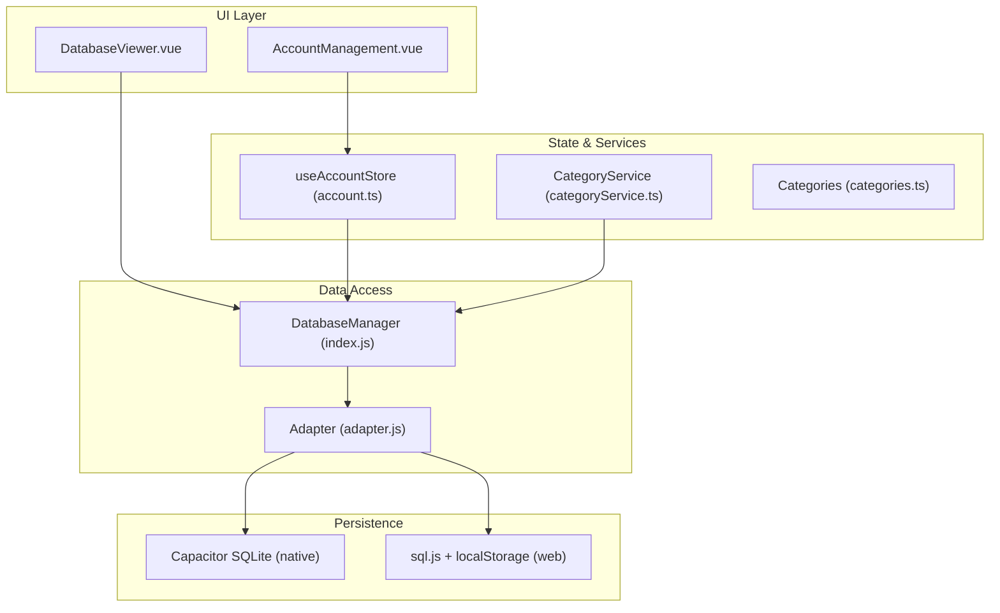
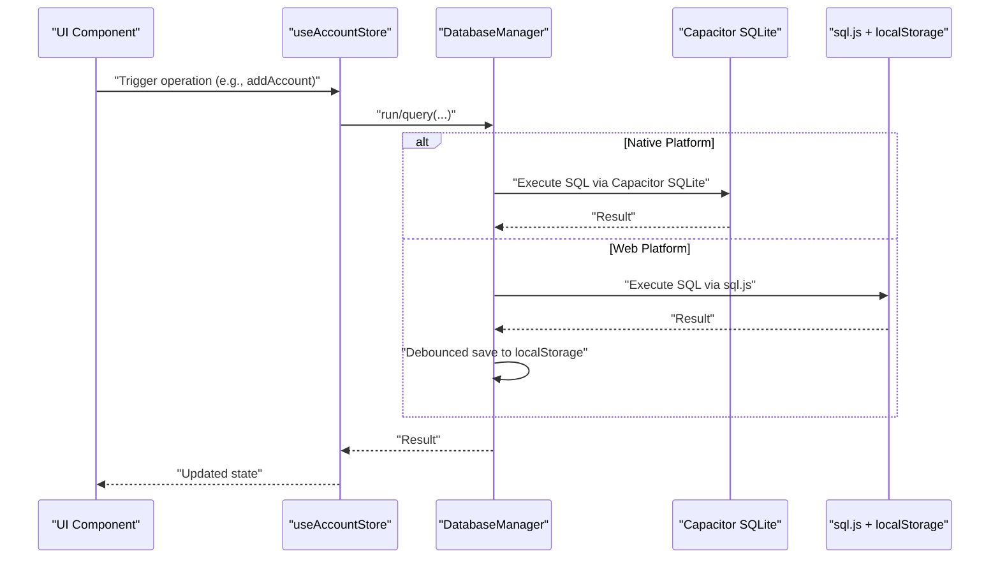
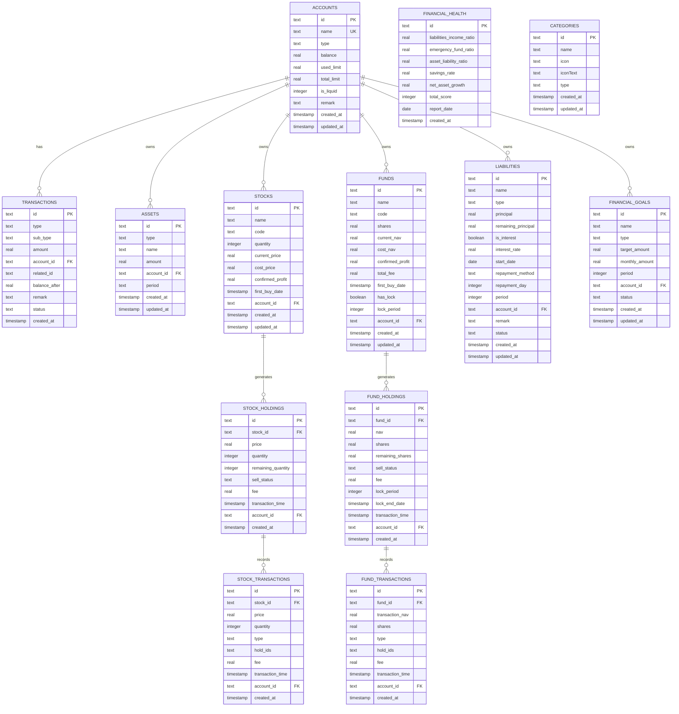
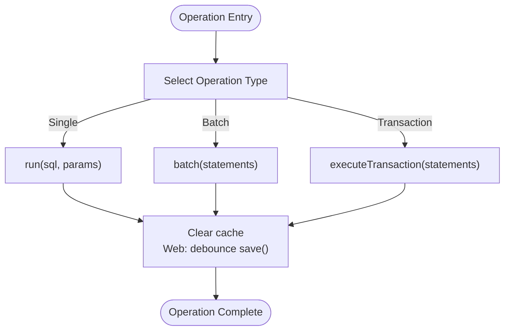
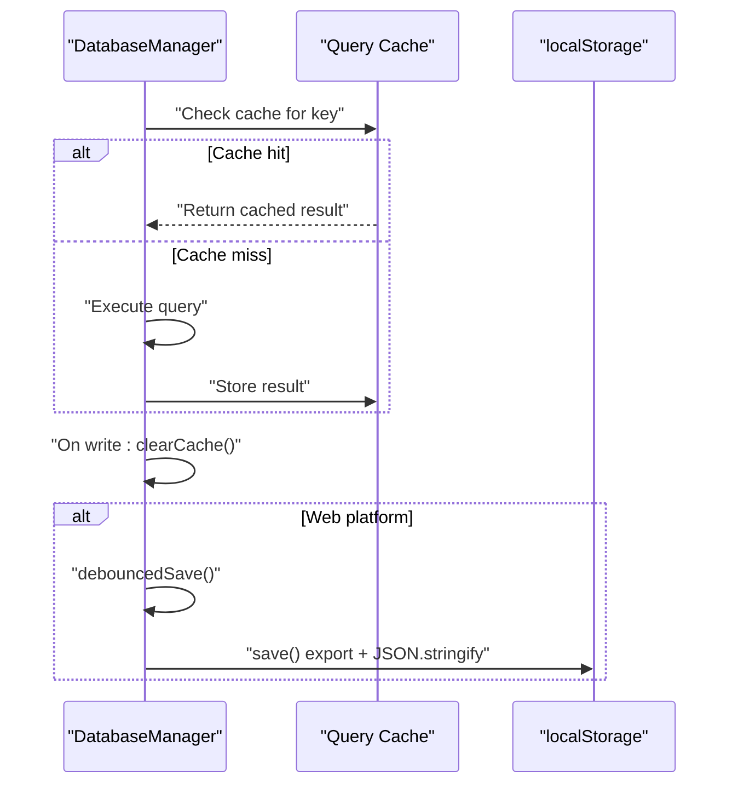
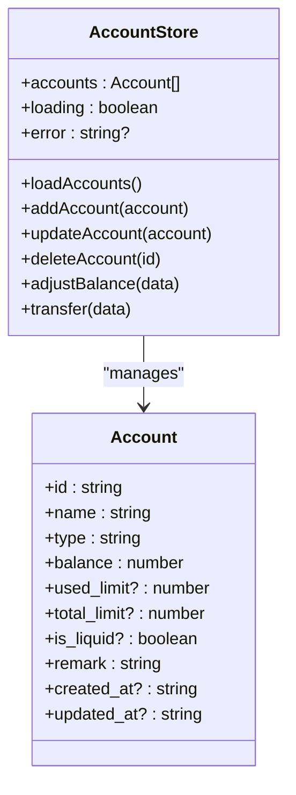
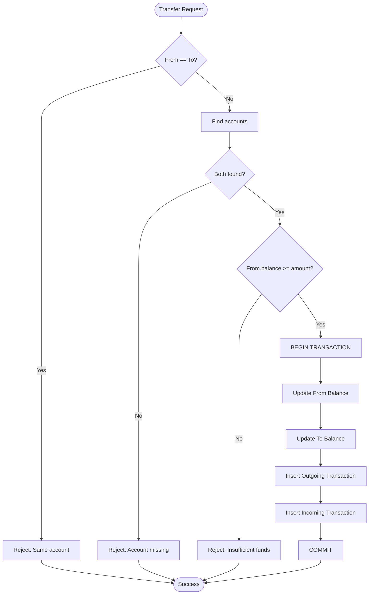
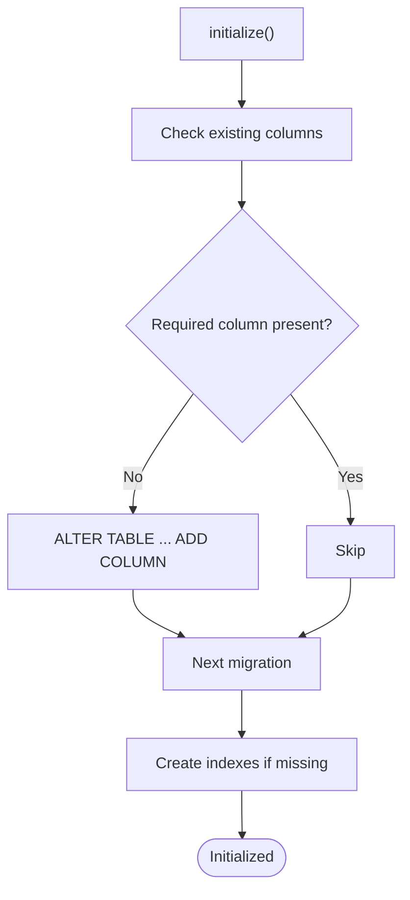
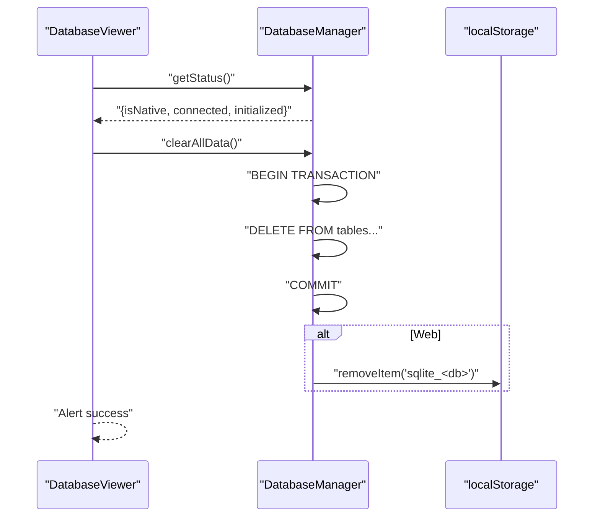
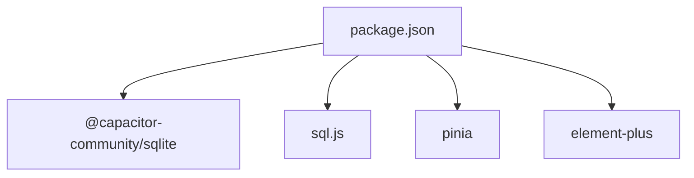

# Data Management

<cite>
**Referenced Files in This Document**
- [index.js](file://src/database/index.js)
- [adapter.js](file://src/database/adapter.js)
- [account.ts](file://src/stores/account.ts)
- [categories.ts](file://src/data/categories.ts)
- [categoryService.ts](file://src/services/categoryService.ts)
- [DatabaseViewer.vue](file://src/components/mobile/DatabaseViewer.vue)
- [AccountManagement.vue](file://src/components/mobile/account/AccountManagement.vue)
- [dictionaries.ts](file://src/utils/dictionaries.ts)
- [main.ts](file://src/main.ts)
- [package.json](file://package.json)
</cite>

## Table of Contents
1. [Introduction](#introduction)
2. [Project Structure](#project-structure)
3. [Core Components](#core-components)
4. [Architecture Overview](#architecture-overview)
5. [Detailed Component Analysis](#detailed-component-analysis)
6. [Dependency Analysis](#dependency-analysis)
7. [Performance Considerations](#performance-considerations)
8. [Troubleshooting Guide](#troubleshooting-guide)
9. [Conclusion](#conclusion)
10. [Appendices](#appendices)

## Introduction
This document describes the data management architecture of the Finance App, focusing on the database schema design, entity relationships, and data models for accounts, transactions, assets, and categories. It documents the persistence strategy using SQLite via two pathways: Capacitor SQLite for native environments and sql.js for web environments. It also covers data access patterns, caching, transactions, state management with Pinia stores, validation rules, business logic constraints, and operational procedures such as migrations, backup/restore, and data export/import.

## Project Structure
The data management layer is organized around:
- A centralized database manager that abstracts SQLite operations across platforms
- Pinia stores for reactive state and account operations
- Services for domain-specific logic (e.g., categories)
- UI components that trigger data operations and display results
- Utility dictionaries for controlled vocabularies

**Diagram sources**
- [index.js:1-935](file://src/database/index.js#L1-L935)
- [adapter.js:1-34](file://src/database/adapter.js#L1-L34)
- [account.ts:1-265](file://src/stores/account.ts#L1-L265)
- [categoryService.ts:1-260](file://src/services/categoryService.ts#L1-L260)
- [categories.ts:1-45](file://src/data/categories.ts#L1-L45)
- [DatabaseViewer.vue:1-480](file://src/components/mobile/DatabaseViewer.vue#L1-L480)
- [AccountManagement.vue:1-650](file://src/components/mobile/account/AccountManagement.vue#L1-L650)

**Section sources**
- [index.js:1-935](file://src/database/index.js#L1-L935)
- [adapter.js:1-34](file://src/database/adapter.js#L1-L34)
- [account.ts:1-265](file://src/stores/account.ts#L1-L265)
- [categoryService.ts:1-260](file://src/services/categoryService.ts#L1-L260)
- [categories.ts:1-45](file://src/data/categories.ts#L1-L45)
- [DatabaseViewer.vue:1-480](file://src/components/mobile/DatabaseViewer.vue#L1-L480)
- [AccountManagement.vue:1-650](file://src/components/mobile/account/AccountManagement.vue#L1-L650)

## Core Components
- DatabaseManager: Centralized SQLite abstraction with platform detection, connection lifecycle, query execution, batching, transactions, caching, and persistence hooks.
- Pinia Account Store: Reactive store for accounts with CRUD actions, balance adjustments, and internal transfers.
- Category Service: Encapsulates category CRUD, initialization of default categories, and retrieval with fallback logic.
- UI Components: Trigger data operations and render derived metrics (e.g., net worth, debt ratio).

Key responsibilities:
- Cross-platform compatibility via Capacitor SQLite and sql.js
- Transactional integrity for multi-step operations
- Caching and throttled persistence for web environments
- Controlled vocabularies via dictionaries

**Section sources**
- [index.js:1-935](file://src/database/index.js#L1-L935)
- [account.ts:1-265](file://src/stores/account.ts#L1-L265)
- [categoryService.ts:1-260](file://src/services/categoryService.ts#L1-L260)
- [dictionaries.ts:1-90](file://src/utils/dictionaries.ts#L1-L90)

## Architecture Overview
The system supports two runtime modes:
- Native mode: Uses Capacitor SQLite for persistent, local-first storage.
- Web mode: Uses sql.js with localStorage for persistence and simulated “memory” mode when unavailable.

**Diagram sources**
- [index.js:56-190](file://src/database/index.js#L56-L190)
- [index.js:272-309](file://src/database/index.js#L272-L309)
- [index.js:379-408](file://src/database/index.js#L379-L408)
- [account.ts:59-100](file://src/stores/account.ts#L59-L100)

## Detailed Component Analysis

### Database Schema and Entity Relationships
The schema defines normalized tables for accounts, transactions, assets, and categories, with supporting tables for stocks, funds, liabilities, financial goals, and financial health reports. Foreign keys link related entities to accounts.

**Diagram sources**
- [index.js:434-688](file://src/database/index.js#L434-L688)

**Section sources**
- [index.js:434-688](file://src/database/index.js#L434-L688)

### Data Access Patterns and Transactions
- Single operations: run(sql, params) for INSERT/UPDATE/DELETE.
- Batch operations: batch(statements) for multiple statements.
- Transactions: executeTransaction(statements) leverages underlying transaction support.
- Queries: query(sql, params, useCache) with optional query result caching.

**Diagram sources**
- [index.js:272-309](file://src/database/index.js#L272-L309)
- [index.js:316-347](file://src/database/index.js#L316-L347)
- [index.js:354-374](file://src/database/index.js#L354-L374)
- [index.js:413-415](file://src/database/index.js#L413-L415)
- [index.js:379-408](file://src/database/index.js#L379-L408)

**Section sources**
- [index.js:272-309](file://src/database/index.js#L272-L309)
- [index.js:316-347](file://src/database/index.js#L316-L347)
- [index.js:354-374](file://src/database/index.js#L354-L374)
- [index.js:413-415](file://src/database/index.js#L413-L415)
- [index.js:379-408](file://src/database/index.js#L379-L408)

### Caching and Persistence Strategy
- Query cache: Map-based cache keyed by SQL+params; cleared on write operations.
- Web persistence: Debounced save to localStorage with throttle interval; exported buffer stored as JSON array.
- Native persistence: Capacitor SQLite handles persistence automatically.

**Diagram sources**
- [index.js:199-264](file://src/database/index.js#L199-L264)
- [index.js:413-415](file://src/database/index.js#L413-L415)
- [index.js:379-408](file://src/database/index.js#L379-L408)

**Section sources**
- [index.js:199-264](file://src/database/index.js#L199-L264)
- [index.js:413-415](file://src/database/index.js#L413-L415)
- [index.js:379-408](file://src/database/index.js#L379-L408)

### State Management with Pinia Stores
The account store encapsulates:
- Reactive state: accounts array, loading/error flags
- Actions: loadAccounts, addAccount, updateAccount, deleteAccount, adjustBalance, transfer
- Business logic: balance validation, intra-account transfer constraints, transaction boundaries

**Diagram sources**
- [account.ts:27-265](file://src/stores/account.ts#L27-L265)

**Section sources**
- [account.ts:27-265](file://src/stores/account.ts#L27-L265)

### Data Validation Rules and Business Logic Constraints
- Account balance adjustment enforces non-negative resulting balances.
- Internal transfers enforce:
  - Different source and destination accounts
  - Sufficient funds in the source account
  - Atomic transaction for both updates and dual transaction records
- Categories service ensures idempotent defaults and merges with persisted categories.
- UI components compute derived metrics (e.g., net worth, debt ratio) from reactive store state.

**Diagram sources**
- [account.ts:183-262](file://src/stores/account.ts#L183-L262)

**Section sources**
- [account.ts:145-177](file://src/stores/account.ts#L145-L177)
- [account.ts:183-262](file://src/stores/account.ts#L183-L262)
- [categoryService.ts:199-260](file://src/services/categoryService.ts#L199-L260)
- [AccountManagement.vue:195-233](file://src/components/mobile/account/AccountManagement.vue#L195-L233)

### Examples of CRUD Operations, Queries, and Bulk Operations
- Create account:
  - Store action constructs payload and inserts into accounts.
  - Returns to list accounts.
- Read accounts:
  - Store action queries all accounts and binds to reactive state.
- Update account:
  - Store action updates fields and reloads list.
- Delete account:
  - Store action deletes by id and reloads list.
- Adjust balance:
  - Updates account balance and inserts a transaction record.
- Transfer:
  - Multi-statement transaction updating balances and inserting two transaction records.
- Category CRUD:
  - Service methods insert/update/delete categories with dynamic field updates.
- Bulk operations:
  - Batch insert default categories during initialization.

Paths:
- [addAccount:59-100](file://src/stores/account.ts#L59-L100)
- [loadAccounts:38-53](file://src/stores/account.ts#L38-L53)
- [updateAccount:106-121](file://src/stores/account.ts#L106-L121)
- [deleteAccount:127-139](file://src/stores/account.ts#L127-L139)
- [adjustBalance:145-177](file://src/stores/account.ts#L145-L177)
- [transfer:183-262](file://src/stores/account.ts#L183-L262)
- [createCategory:101-113](file://src/services/categoryService.ts#L101-L113)
- [updateCategory:121-160](file://src/services/categoryService.ts#L121-L160)
- [deleteCategory:167-175](file://src/services/categoryService.ts#L167-L175)
- [initializeDefaultCategories:199-260](file://src/services/categoryService.ts#L199-L260)

**Section sources**
- [account.ts:38-139](file://src/stores/account.ts#L38-L139)
- [account.ts:145-262](file://src/stores/account.ts#L145-L262)
- [categoryService.ts:101-175](file://src/services/categoryService.ts#L101-L175)
- [categoryService.ts:199-260](file://src/services/categoryService.ts#L199-L260)

### Data Migration Strategies
- Column addition checks: On initialization, the manager checks for required columns and adds them if missing.
- Index creation: Ensures optimal query performance by creating indexes on frequently filtered/sorted columns.
- Graceful degradation: Continues operation even if migration steps fail.

**Diagram sources**
- [index.js:694-776](file://src/database/index.js#L694-L776)
- [index.js:676-688](file://src/database/index.js#L676-L688)

**Section sources**
- [index.js:694-776](file://src/database/index.js#L694-L776)
- [index.js:676-688](file://src/database/index.js#L676-L688)

### Backup, Restore, and Export/Import
- Backup/Restore:
  - DatabaseViewer allows refreshing data and checking storage status.
  - Clear-all-data triggers transactional deletion across tables and clears localStorage on web.
- Export/Import:
  - Web mode exports SQLite buffer to localStorage; import is implicit via loading the buffer on startup.
  - Native mode relies on Capacitor SQLite’s persistence model.

**Diagram sources**
- [DatabaseViewer.vue:175-231](file://src/components/mobile/DatabaseViewer.vue#L175-L231)
- [index.js:839-890](file://src/database/index.js#L839-L890)

**Section sources**
- [DatabaseViewer.vue:175-231](file://src/components/mobile/DatabaseViewer.vue#L175-L231)
- [index.js:839-890](file://src/database/index.js#L839-L890)

## Dependency Analysis
External libraries and integrations:
- Capacitor SQLite for native persistence
- sql.js for web SQL engine
- Pinia for state management
- Element Plus for UI components

**Diagram sources**
- [package.json:19-35](file://package.json#L19-L35)

**Section sources**
- [package.json:19-35](file://package.json#L19-L35)

## Performance Considerations
- Connection reuse and single-instance pattern prevent redundant connections.
- Query caching reduces repeated reads for identical queries.
- Batch and transactional operations minimize round-trips and ensure atomicity.
- Indexes on foreign keys and frequently queried columns improve query performance.
- Debounced persistence avoids excessive writes in web environments.

[No sources needed since this section provides general guidance]

## Troubleshooting Guide
Common issues and remedies:
- Connection failures:
  - Verify Capacitor platform detection and connection consistency checks.
  - Ensure Capacitor SQLite plugin is properly installed and synced.
- Query errors:
  - Check parameter binding order and types.
  - Validate foreign key constraints when inserting related records.
- Transaction failures:
  - Confirm BEGIN/COMMIT/ROLLBACK sequences and handle partial rollbacks.
- Web persistence issues:
  - Confirm localStorage availability and capacity.
  - Use DatabaseViewer to inspect storage status and clear data if corrupted.

**Section sources**
- [index.js:56-190](file://src/database/index.js#L56-L190)
- [index.js:272-309](file://src/database/index.js#L272-L309)
- [index.js:354-374](file://src/database/index.js#L354-L374)
- [DatabaseViewer.vue:175-231](file://src/components/mobile/DatabaseViewer.vue#L175-L231)

## Conclusion
The Finance App employs a robust, cross-platform data management strategy centered on a unified DatabaseManager, normalized relational schema, and reactive state management. It balances performance with reliability through caching, batching, transactions, and platform-aware persistence. The architecture supports safe migrations, operational diagnostics, and straightforward backup/restore workflows.

[No sources needed since this section summarizes without analyzing specific files]

## Appendices

### Appendix A: Reactive Data Binding in UI
- AccountManagement computes derived metrics (net worth, debt ratio) from the reactive account store.
- Dialogs bind form inputs to store actions for create/update/adjust operations.

**Section sources**
- [AccountManagement.vue:195-233](file://src/components/mobile/account/AccountManagement.vue#L195-L233)
- [AccountManagement.vue:334-377](file://src/components/mobile/account/AccountManagement.vue#L334-L377)

### Appendix B: Controlled Vocabularies
- Dictionaries define canonical lists for account types, liability types, repayment methods, statuses, and more.

**Section sources**
- [dictionaries.ts:1-90](file://src/utils/dictionaries.ts#L1-L90)

### Appendix C: Initialization and Registration
- Pinia is registered globally; Capacitor platform detection is performed early.

**Section sources**
- [main.ts:1-16](file://src/main.ts#L1-L16)