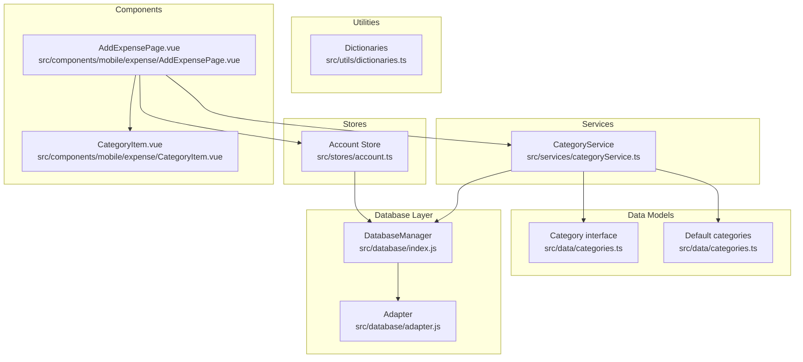
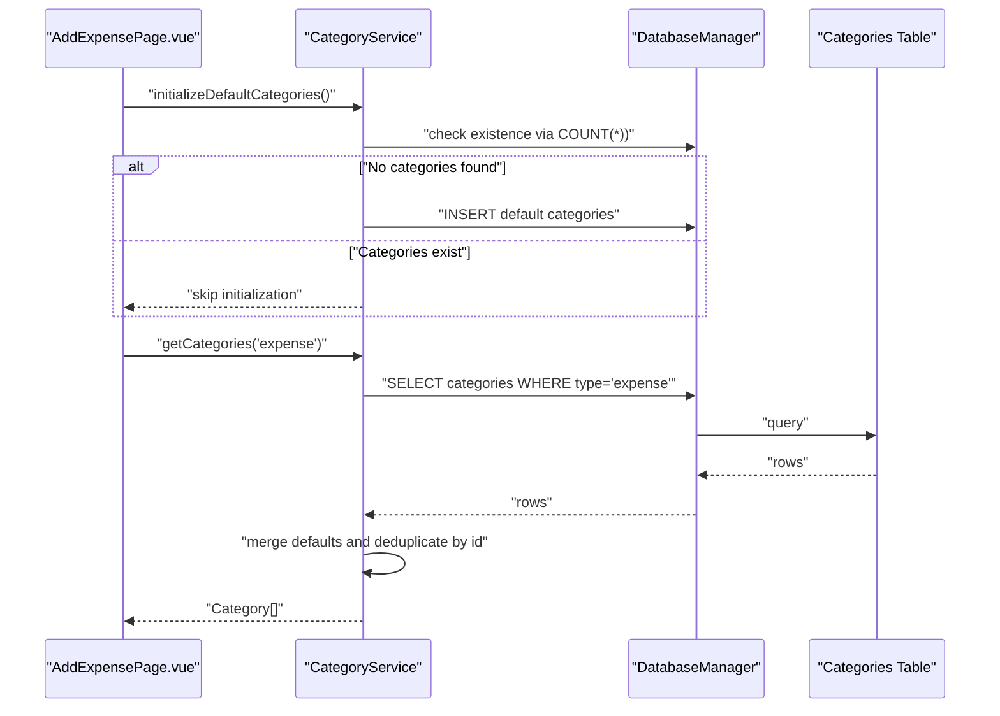
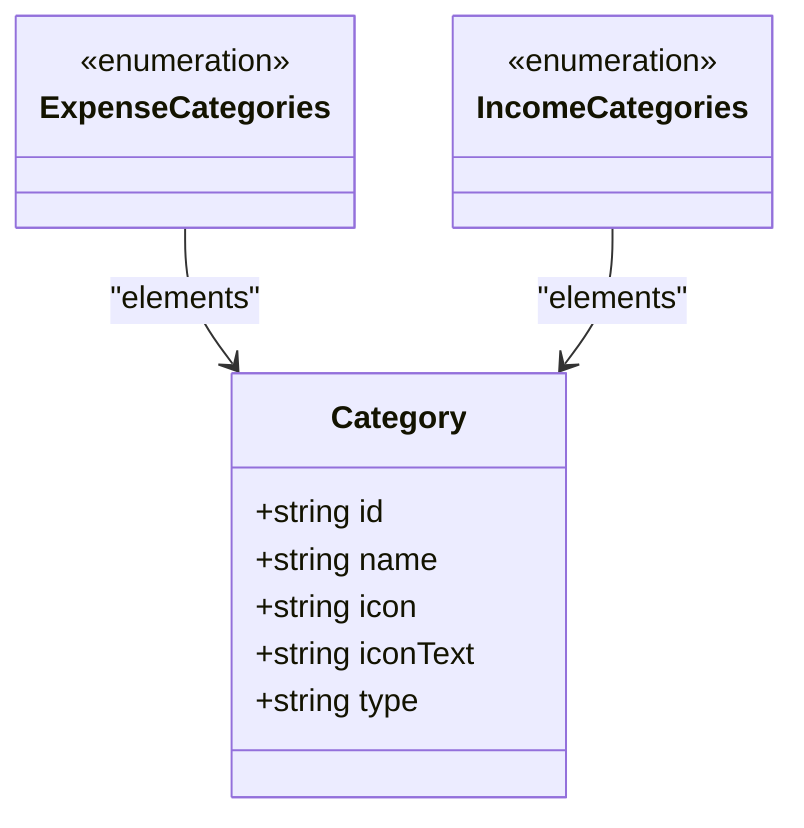
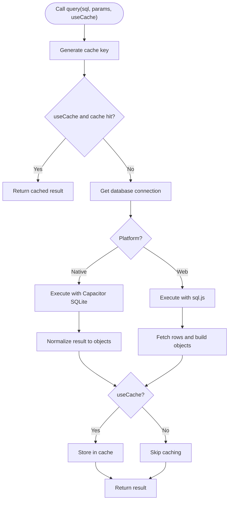
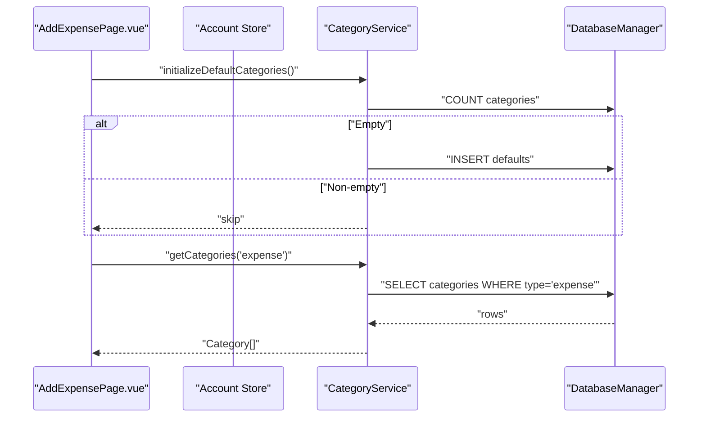
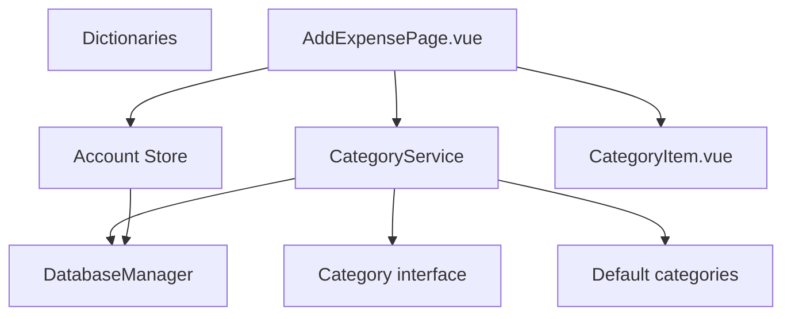

# Data Services

<cite>
**Referenced Files in This Document**
- [categoryService.ts](file://src/services/categoryService.ts)
- [categories.ts](file://src/data/categories.ts)
- [dictionaries.ts](file://src/utils/dictionaries.ts)
- [index.js](file://src/database/index.js)
- [adapter.js](file://src/database/adapter.js)
- [AddExpensePage.vue](file://src/components/mobile/expense/AddExpensePage.vue)
- [CategoryItem.vue](file://src/components/mobile/expense/CategoryItem.vue)
- [account.ts](file://src/stores/account.ts)
- [main.ts](file://src/main.ts)
</cite>

## Table of Contents
1. [Introduction](#introduction)
2. [Project Structure](#project-structure)
3. [Core Components](#core-components)
4. [Architecture Overview](#architecture-overview)
5. [Detailed Component Analysis](#detailed-component-analysis)
6. [Dependency Analysis](#dependency-analysis)
7. [Performance Considerations](#performance-considerations)
8. [Troubleshooting Guide](#troubleshooting-guide)
9. [Conclusion](#conclusion)
10. [Appendices](#appendices)

## Introduction
This document provides comprehensive technical documentation for the data services and utility functions in the finance application. It focuses on:
- Category management service implementation, including CRUD operations, lookup, and business logic
- Dictionary utilities for data validation and formatting
- Service interfaces, dependency injection patterns, and service lifecycle management
- Examples of service usage, error handling, and integration with components
- Caching strategies, data transformation utilities, and performance optimization techniques
- Testing patterns, mock implementations, and service composition strategies

The documentation is structured to be accessible to both developers and stakeholders, with code-level diagrams and practical integration examples.

## Project Structure
The data-related code is organized into focused modules:
- Services: centralized business logic for categories
- Data models: shared interfaces and default datasets
- Utilities: dictionary collections for validation and formatting
- Database: cross-platform SQLite abstraction with caching and persistence
- Stores: Pinia store for account data
- Components: UI integration points that consume services and stores



**Diagram sources**
- [categoryService.ts:1-260](file://src/services/categoryService.ts#L1-L260)
- [categories.ts:1-45](file://src/data/categories.ts#L1-L45)
- [dictionaries.ts:1-90](file://src/utils/dictionaries.ts#L1-L90)
- [index.js:1-935](file://src/database/index.js#L1-L935)
- [adapter.js:1-34](file://src/database/adapter.js#L1-L34)
- [account.ts:1-265](file://src/stores/account.ts#L1-L265)
- [AddExpensePage.vue:1-855](file://src/components/mobile/expense/AddExpensePage.vue#L1-L855)
- [CategoryItem.vue:1-69](file://src/components/mobile/expense/CategoryItem.vue#L1-L69)

**Section sources**
- [main.ts:1-16](file://src/main.ts#L1-L16)

## Core Components
This section documents the primary data services and utilities, their responsibilities, and how they integrate with the application.

- CategoryService: Provides category CRUD operations, lookup by ID, default category initialization, and database connectivity checks. It merges default categories with persisted categories and ensures uniqueness by ID.
- Category data model: Defines the Category interface and default category arrays for initialization.
- Dictionary utilities: Centralized collection of predefined lists for validation and UI formatting (account types, liability types, goal types, etc.).
- DatabaseManager: Cross-platform SQLite abstraction with caching, batch operations, transactions, and persistence strategies for both native and web environments.
- Account Store: Manages account data via the database layer and exposes actions for CRUD operations and transfers.
- Components: Integrate CategoryService and Account Store to render category grids and manage expense creation.

**Section sources**
- [categoryService.ts:1-260](file://src/services/categoryService.ts#L1-L260)
- [categories.ts:1-45](file://src/data/categories.ts#L1-L45)
- [dictionaries.ts:1-90](file://src/utils/dictionaries.ts#L1-L90)
- [index.js:1-935](file://src/database/index.js#L1-L935)
- [account.ts:1-265](file://src/stores/account.ts#L1-L265)
- [AddExpensePage.vue:1-855](file://src/components/mobile/expense/AddExpensePage.vue#L1-L855)
- [CategoryItem.vue:1-69](file://src/components/mobile/expense/CategoryItem.vue#L1-L69)

## Architecture Overview
The system follows a layered architecture:
- Presentation layer: Vue components consume services and stores
- Business logic layer: CategoryService encapsulates category operations
- Data access layer: DatabaseManager abstracts SQLite operations
- Persistence layer: SQLite tables for categories and other entities



**Diagram sources**
- [AddExpensePage.vue:203-213](file://src/components/mobile/expense/AddExpensePage.vue#L203-L213)
- [categoryService.ts:199-259](file://src/services/categoryService.ts#L199-L259)
- [index.js:199-264](file://src/database/index.js#L199-L264)

## Detailed Component Analysis

### CategoryService
CategoryService centralizes category management with robust error handling and fallback logic. It:
- Merges default categories with database-backed categories, deduplicating by ID
- Supports filtering by type and returns a unified list
- Provides CRUD operations with transaction-safe updates
- Initializes default categories if none exist
- Checks database connectivity and returns meaningful status messages

```mermaid
classDiagram
class CategoryService {
+getCategories(type?) Promise~Category[]~
+getCategoryById(id) Promise~Category|null~
+createCategory(category) Promise~boolean~
+updateCategory(id, category) Promise~boolean~
+deleteCategory(id) Promise~boolean~
+checkDatabaseStatus() Promise~{connected,message}~
+initializeDefaultCategories() Promise~void~
}
class DatabaseManager {
+getDB() Promise
+query(sql, params, useCache=false) Promise~Array~
+run(sql, params) Promise~Object~
+batch(statements) Promise~Array~
+executeTransaction(statements) Promise
+clearCache() void
}
class Category {
+string id
+string name
+string icon
+string iconText
+string type
}
CategoryService --> DatabaseManager : "uses"
CategoryService --> Category : "returns"
```

**Diagram sources**
- [categoryService.ts:8-260](file://src/services/categoryService.ts#L8-L260)
- [index.js:21-935](file://src/database/index.js#L21-L935)
- [categories.ts:1-7](file://src/data/categories.ts#L1-L7)

Key implementation highlights:
- getCategories: Builds dynamic SQL with optional type filter, merges defaults and DB records, and filters by type if provided.
- getCategoryById: Safe lookup with null return on failure.
- create/update/delete: Parameterized queries with error logging and boolean return for caller-side handling.
- initializeDefaultCategories: Inserts default categories only if the table is empty.
- checkDatabaseStatus: Attempts a simple query to validate connectivity and returns a structured status.

**Section sources**
- [categoryService.ts:14-69](file://src/services/categoryService.ts#L14-L69)
- [categoryService.ts:76-94](file://src/services/categoryService.ts#L76-L94)
- [categoryService.ts:101-113](file://src/services/categoryService.ts#L101-L113)
- [categoryService.ts:121-160](file://src/services/categoryService.ts#L121-L160)
- [categoryService.ts:167-175](file://src/services/categoryService.ts#L167-L175)
- [categoryService.ts:181-194](file://src/services/categoryService.ts#L181-L194)
- [categoryService.ts:199-259](file://src/services/categoryService.ts#L199-L259)

### Category Data Model and Defaults
The Category interface defines the shape of category entities, while default category arrays provide initialization data for both expense and income categories.



**Diagram sources**
- [categories.ts:1-45](file://src/data/categories.ts#L1-L45)

Integration note:
- CategoryService merges these defaults with database records during retrieval, ensuring consistent availability of categories even if the database is temporarily unavailable.

**Section sources**
- [categories.ts:1-45](file://src/data/categories.ts#L1-L45)

### Dictionary Utilities
Dictionary utilities provide centralized, typed lists for validation and UI formatting. They include:
- Account types, liability types, repayment methods, statuses, goal types/statuses, asset types, transaction types, and adjustment types

These dictionaries enable consistent validation and rendering across components.

**Section sources**
- [dictionaries.ts:1-90](file://src/utils/dictionaries.ts#L1-L90)

### DatabaseManager (Cross-Platform SQLite Abstraction)
DatabaseManager provides a unified interface for SQLite across native and web platforms:
- Single connection management with retry and concurrency guards
- Query caching with configurable cache keys
- Batch execution and transaction support
- Platform-specific persistence strategies (Capacitor SQLite for native, sql.js with localStorage for web)
- Index-based performance optimizations



**Diagram sources**
- [index.js:199-264](file://src/database/index.js#L199-L264)
- [index.js:215-252](file://src/database/index.js#L215-L252)

Operational details:
- Connection pooling and concurrency guard prevent race conditions during connection establishment.
- Query caching reduces repeated database hits for identical queries.
- Transactions and batch operations improve throughput and data consistency.
- Debounced persistence for web platform ensures efficient writes without blocking UI.

**Section sources**
- [index.js:21-935](file://src/database/index.js#L21-L935)

### Adapter Pattern for Platform Differences
The adapter module abstracts platform differences:
- Detects native vs web platform
- Returns the appropriate database implementation
- Exposes initialization helpers

This pattern enables seamless switching between platforms without changing service consumers.

**Section sources**
- [adapter.js:1-34](file://src/database/adapter.js#L1-L34)

### Account Store Integration
The Account Store demonstrates service usage patterns:
- Loads accounts via the database layer
- Performs CRUD operations with transaction safety
- Integrates with CategoryService for category initialization and retrieval



**Diagram sources**
- [AddExpensePage.vue:203-213](file://src/components/mobile/expense/AddExpensePage.vue#L203-L213)
- [categoryService.ts:199-259](file://src/services/categoryService.ts#L199-L259)
- [index.js:199-264](file://src/database/index.js#L199-L264)

**Section sources**
- [account.ts:38-53](file://src/stores/account.ts#L38-L53)
- [account.ts:106-121](file://src/stores/account.ts#L106-L121)
- [AddExpensePage.vue:203-213](file://src/components/mobile/expense/AddExpensePage.vue#L203-L213)

## Dependency Analysis
This section maps dependencies between components and services to understand coupling and cohesion.



Observations:
- CategoryService depends on DatabaseManager and Category model; it is cohesive around category operations.
- Components depend on CategoryService and Account Store, enabling loose coupling through service abstractions.
- Dictionaries are standalone utilities consumed by components and services for validation/formatting.

**Diagram sources**
- [categoryService.ts:1-260](file://src/services/categoryService.ts#L1-L260)
- [index.js:1-935](file://src/database/index.js#L1-L935)
- [categories.ts:1-45](file://src/data/categories.ts#L1-L45)
- [dictionaries.ts:1-90](file://src/utils/dictionaries.ts#L1-L90)
- [account.ts:1-265](file://src/stores/account.ts#L1-L265)
- [AddExpensePage.vue:1-855](file://src/components/mobile/expense/AddExpensePage.vue#L1-L855)
- [CategoryItem.vue:1-69](file://src/components/mobile/expense/CategoryItem.vue#L1-L69)

**Section sources**
- [categoryService.ts:1-260](file://src/services/categoryService.ts#L1-L260)
- [index.js:1-935](file://src/database/index.js#L1-L935)
- [categories.ts:1-45](file://src/data/categories.ts#L1-L45)
- [dictionaries.ts:1-90](file://src/utils/dictionaries.ts#L1-L90)
- [account.ts:1-265](file://src/stores/account.ts#L1-L265)
- [AddExpensePage.vue:1-855](file://src/components/mobile/expense/AddExpensePage.vue#L1-L855)
- [CategoryItem.vue:1-69](file://src/components/mobile/expense/CategoryItem.vue#L1-L69)

## Performance Considerations
- Query caching: DatabaseManager caches query results keyed by SQL and parameters to reduce repeated reads.
- Batch operations: Use batch for multiple inserts/updates to minimize round-trips.
- Transactions: Group related operations to ensure atomicity and reduce overhead.
- Indexes: Predefined indexes on frequently queried columns improve SELECT performance.
- Debounced persistence (web): Throttles localStorage writes to avoid UI blocking.
- Deduplication: CategoryService merges defaults and DB records using Map keyed by ID to avoid duplicates.

[No sources needed since this section provides general guidance]

## Troubleshooting Guide
Common issues and resolutions:
- Database connectivity failures: CategoryService.checkDatabaseStatus returns a structured status; fallback to default categories occurs on errors.
- Category retrieval errors: getCategories logs errors and falls back to default categories; verify database initialization and table creation.
- Transaction failures: AddExpensePage saves expenses using executeTransaction; errors trigger automatic rollback and user feedback.
- Validation errors: Components validate user input (e.g., amount, account selection) before invoking services.

**Section sources**
- [categoryService.ts:181-194](file://src/services/categoryService.ts#L181-L194)
- [categoryService.ts:61-68](file://src/services/categoryService.ts#L61-L68)
- [AddExpensePage.vue:464-469](file://src/components/mobile/expense/AddExpensePage.vue#L464-L469)

## Conclusion
The data services and utilities in this application provide a robust, cross-platform foundation for category management and data validation. CategoryService encapsulates business logic with strong error handling and fallbacks, while DatabaseManager offers a unified, performant data access layer. Dictionary utilities streamline validation and formatting. Components integrate these services seamlessly, and the architecture supports testing and future enhancements through clear separation of concerns.

[No sources needed since this section summarizes without analyzing specific files]

## Appendices

### Service Interfaces and Composition Strategies
- CategoryService: Stateless static methods for category operations; composed with DatabaseManager and Category model.
- Account Store: Composes database operations with reactive state management via Pinia.
- Component integration: Components import CategoryService and Account Store to render UI and persist data.

**Section sources**
- [categoryService.ts:8-260](file://src/services/categoryService.ts#L8-L260)
- [account.ts:27-265](file://src/stores/account.ts#L27-L265)
- [AddExpensePage.vue:114-117](file://src/components/mobile/expense/AddExpensePage.vue#L114-L117)

### Testing Patterns and Mock Implementations
Recommended patterns:
- Mock DatabaseManager: Replace db.query/db.run with mocked implementations to simulate success/failure scenarios.
- Test CategoryService: Verify merge logic, deduplication, and fallback behavior under various error conditions.
- Component tests: Stub CategoryService and Account Store to isolate UI logic and validate user interactions.

[No sources needed since this section provides general guidance]