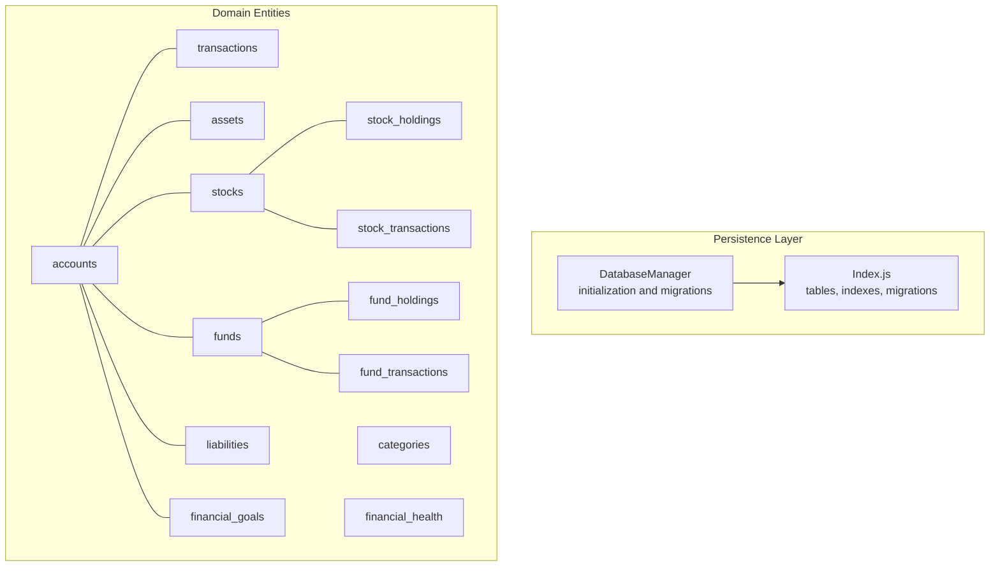
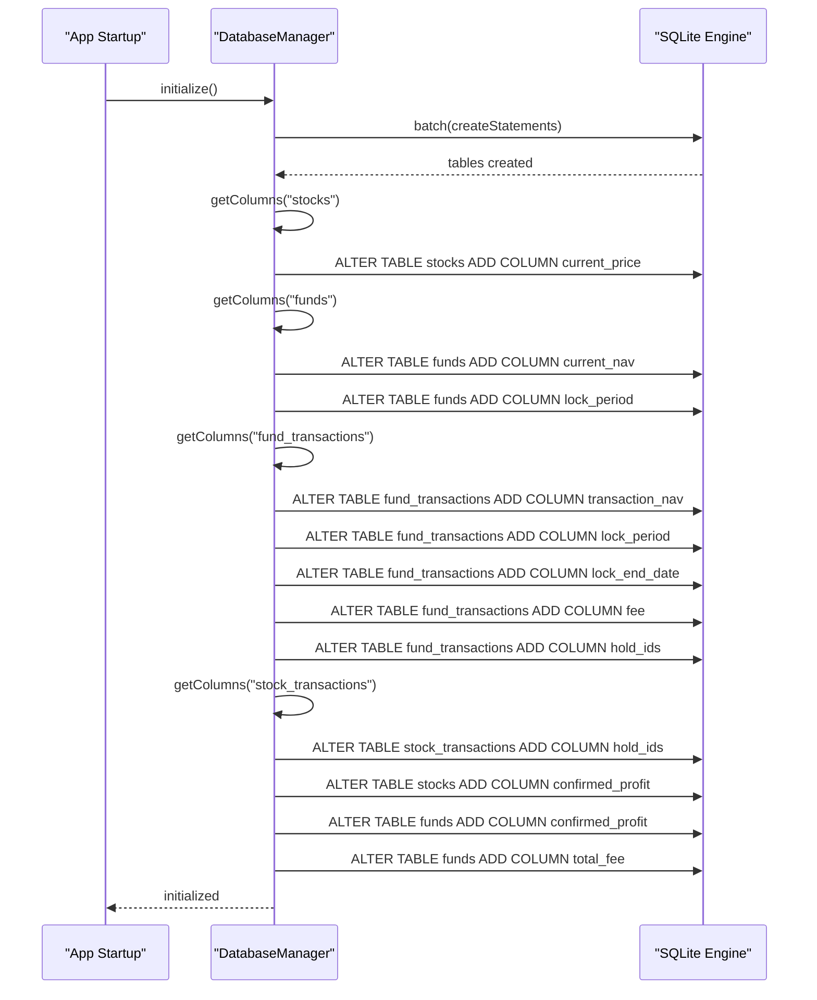
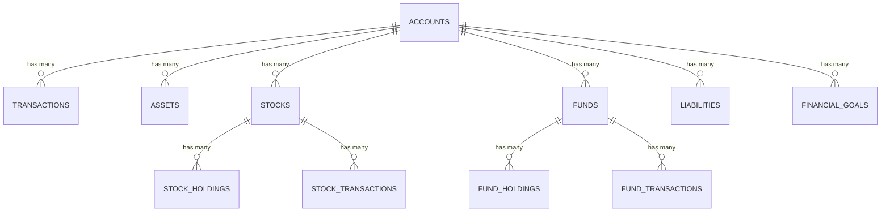
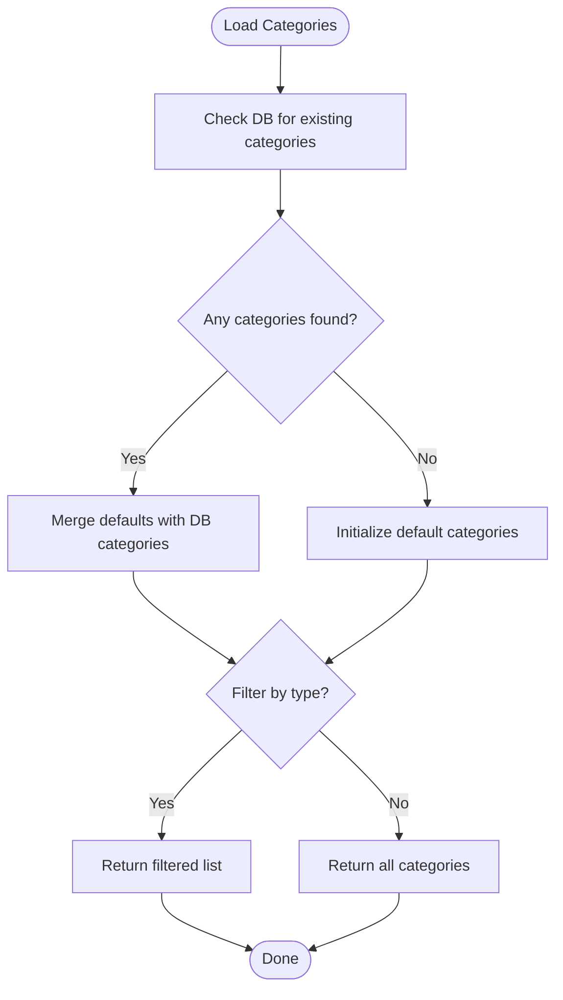
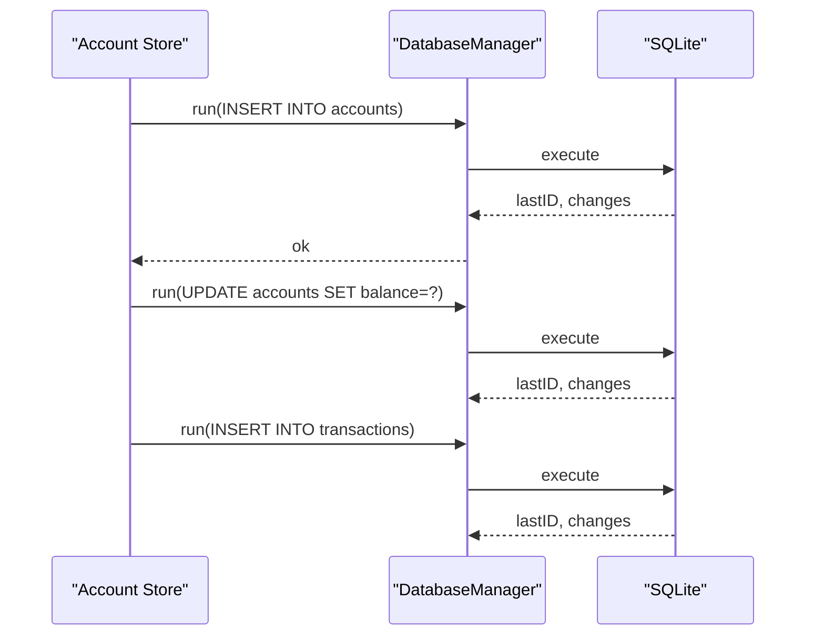
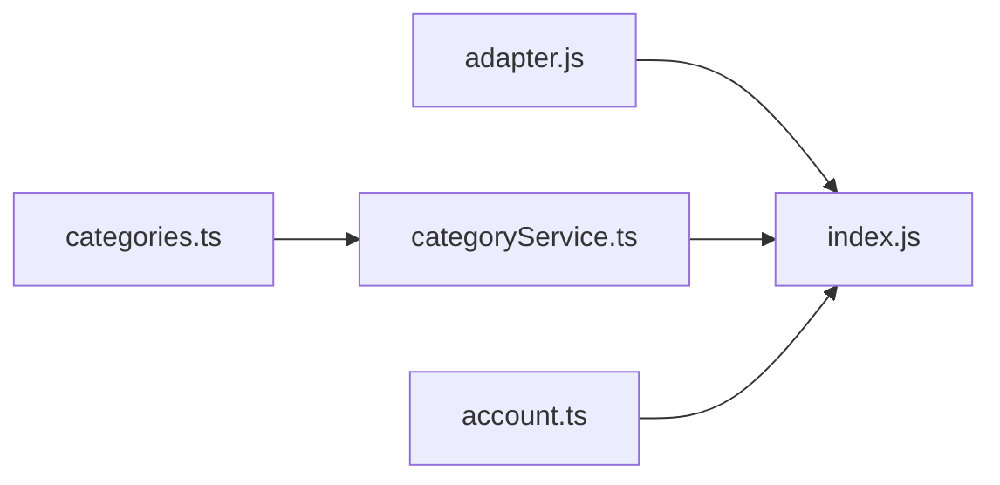

# Database Schema

<cite>
**Referenced Files in This Document**
- [index.js](file://src/database/index.js)
- [adapter.js](file://src/database/adapter.js)
- [categories.ts](file://src/data/categories.ts)
- [categoryService.ts](file://src/services/categoryService.ts)
- [account.ts](file://src/stores/account.ts)
</cite>

## Table of Contents
1. [Introduction](#introduction)
2. [Project Structure](#project-structure)
3. [Core Components](#core-components)
4. [Architecture Overview](#architecture-overview)
5. [Detailed Component Analysis](#detailed-component-analysis)
6. [Dependency Analysis](#dependency-analysis)
7. [Performance Considerations](#performance-considerations)
8. [Troubleshooting Guide](#troubleshooting-guide)
9. [Conclusion](#conclusion)
10. [Appendices](#appendices)

## Introduction
This document provides comprehensive database schema documentation for the Finance App. It details all table structures, primary and foreign keys, indexes, constraints, and the entity-relationship model. It also explains the category system for income and expense tracking, outlines table creation SQL, common queries, and data flow patterns, and addresses schema evolution strategies and backward compatibility considerations.

## Project Structure
The Finance App uses a unified SQLite-based persistence layer that supports both native (Capacitor SQLite) and web (sql.js) environments. The schema is initialized programmatically via a single initialization routine that creates all tables, indexes, and applies incremental schema updates for backward compatibility.

**Diagram sources**
- [index.js:418-776](file://src/database/index.js#L418-L776)

**Section sources**
- [index.js:418-776](file://src/database/index.js#L418-L776)

## Core Components
This section documents each table’s structure, including primary keys, foreign keys, indexes, constraints, and default values. It also explains how accounts link to transactions, assets, stocks, funds, and liabilities.

- accounts
  - Purpose: Stores user financial accounts (checking, credit cards, investment accounts).
  - Primary Key: id
  - Columns:
    - id: Text, PK
    - name: Text, Not Null, Unique
    - type: Text, Not Null
    - balance: Real, Default 0
    - used_limit: Real, Default 0
    - total_limit: Real, Default 0
    - is_liquid: Integer (boolean), Default 1
    - remark: Text
    - created_at: Timestamp, Default Current Timestamp
    - updated_at: Timestamp, Default Current Timestamp
  - Indexes:
    - idx_accounts_type
    - idx_accounts_is_liquid

- transactions
  - Purpose: Records all financial movements linked to an account.
  - Primary Key: id
  - Foreign Keys:
    - account_id -> accounts(id)
  - Columns:
    - id: Text, PK
    - type: Text, Not Null
    - sub_type: Text
    - amount: Real, Not Null
    - account_id: Text
    - related_id: Text
    - balance_after: Real, Not Null
    - remark: Text
    - status: Text, Default "正常"
    - created_at: Timestamp, Default Current Timestamp
  - Indexes:
    - idx_transactions_account_id
    - idx_transactions_created_at

- assets
  - Purpose: Tracks personal assets associated with an account.
  - Primary Key: id
  - Foreign Keys:
    - account_id -> accounts(id)
  - Columns:
    - id: Text, PK
    - type: Text, Not Null
    - name: Text, Not Null
    - amount: Real, Default 0
    - account_id: Text
    - period: Text
    - created_at: Timestamp, Default Current Timestamp
    - updated_at: Timestamp, Default Current Timestamp
  - Indexes:
    - idx_assets_account_id

- stocks
  - Purpose: Holds stock holdings per account.
  - Primary Key: id
  - Foreign Keys:
    - account_id -> accounts(id)
  - Columns:
    - id: Text, PK
    - name: Text, Not Null
    - code: Text
    - quantity: Integer, Default 0
    - current_price: Real, Default 0
    - cost_price: Real, Default 0
    - confirmed_profit: Real, Default 0
    - first_buy_date: Timestamp
    - account_id: Text
    - created_at: Timestamp, Default Current Timestamp
    - updated_at: Timestamp, Default Current Timestamp
  - Indexes:
    - idx_stocks_account_id

- stock_holdings
  - Purpose: Tracks individual stock purchase/sale holdings.
  - Primary Key: id
  - Foreign Keys:
    - stock_id -> stocks(id)
    - account_id -> accounts(id)
  - Columns:
    - id: Text, PK
    - stock_id: Text, Not Null
    - price: Real, Not Null
    - quantity: Integer, Not Null
    - remaining_quantity: Integer, Not Null
    - sell_status: Text, Default "未卖出"
    - fee: Real, Default 0
    - transaction_time: Timestamp, Not Null
    - account_id: Text
    - created_at: Timestamp, Default Current Timestamp

- stock_transactions
  - Purpose: Records stock buy/sell transactions.
  - Primary Key: id
  - Foreign Keys:
    - stock_id -> stocks(id)
    - account_id -> accounts(id)
  - Columns:
    - id: Text, PK
    - stock_id: Text, Not Null
    - price: Real, Not Null
    - quantity: Integer, Not Null
    - type: Text, Not Null
    - hold_ids: Text
    - fee: Real, Default 0
    - transaction_time: Timestamp, Not Null
    - account_id: Text
    - created_at: Timestamp, Default Current Timestamp

- funds
  - Purpose: Tracks mutual fund holdings per account.
  - Primary Key: id
  - Foreign Keys:
    - account_id -> accounts(id)
  - Columns:
    - id: Text, PK
    - name: Text, Not Null
    - code: Text
    - shares: Real, Default 0
    - current_nav: Real, Default 0
    - cost_nav: Real, Default 0
    - confirmed_profit: Real, Default 0
    - total_fee: Real, Default 0
    - first_buy_date: Timestamp
    - has_lock: Boolean, Default 0
    - lock_period: Integer, Default 0
    - account_id: Text
    - created_at: Timestamp, Default Current Timestamp
    - updated_at: Timestamp, Default Current Timestamp
  - Indexes:
    - idx_funds_account_id

- fund_holdings
  - Purpose: Tracks individual fund purchase/sale holdings.
  - Primary Key: id
  - Foreign Keys:
    - fund_id -> funds(id)
    - account_id -> accounts(id)
  - Columns:
    - id: Text, PK
    - fund_id: Text, Not Null
    - nav: Real, Not Null
    - shares: Real, Not Null
    - remaining_shares: Real, Not Null
    - sell_status: Text, Default "未卖出"
    - fee: Real, Default 0
    - lock_period: Integer, Default 0
    - lock_end_date: Timestamp
    - transaction_time: Timestamp, Not Null
    - account_id: Text
    - created_at: Timestamp, Default Current Timestamp

- fund_transactions
  - Purpose: Records fund buy/sell transactions.
  - Primary Key: id
  - Foreign Keys:
    - fund_id -> funds(id)
    - account_id -> accounts(id)
  - Columns:
    - id: Text, PK
    - fund_id: Text, Not Null
    - transaction_nav: Real, Not Null
    - shares: Real, Not Null
    - type: Text, Not Null
    - hold_ids: Text
    - fee: Real, Default 0
    - lock_period: Integer, Default 0
    - lock_end_date: Timestamp
    - transaction_time: Timestamp, Not Null
    - account_id: Text
    - created_at: Timestamp, Default Current Timestamp

- liabilities
  - Purpose: Stores debt and loan records linked to an account.
  - Primary Key: id
  - Foreign Keys:
    - account_id -> accounts(id)
  - Columns:
    - id: Text, PK
    - name: Text, Not Null
    - type: Text, Not Null
    - principal: Real, Not Null
    - remaining_principal: Real, Not Null
    - is_interest: Boolean, Default 1
    - interest_rate: Real, Default 0
    - start_date: Date, Not Null
    - repayment_method: Text, Not Null
    - repayment_day: Integer
    - period: Integer
    - account_id: Text
    - remark: Text
    - status: Text, Default "未结清"
    - created_at: Timestamp, Default Current Timestamp
    - updated_at: Timestamp, Default Current Timestamp
  - Indexes:
    - idx_liabilities_account_id
    - idx_liabilities_status

- financial_goals
  - Purpose: Tracks user-defined financial goals linked to an account.
  - Primary Key: id
  - Foreign Keys:
    - account_id -> accounts(id)
  - Columns:
    - id: Text, PK
    - name: Text, Not Null
    - type: Text, Not Null
    - target_amount: Real, Not Null
    - monthly_amount: Real, Not Null
    - period: Integer, Not Null
    - account_id: Text
    - status: Text, Default "未开始"
    - created_at: Timestamp, Default Current Timestamp
    - updated_at: Timestamp, Default Current Timestamp
  - Indexes:
    - idx_financial_goals_account_id
    - idx_financial_goals_status

- financial_health
  - Purpose: Stores computed financial health metrics.
  - Primary Key: id
  - Columns:
    - id: Text, PK
    - liabilities_income_ratio: Real
    - emergency_fund_ratio: Real
    - asset_liability_ratio: Real
    - savings_rate: Real
    - net_asset_growth: Real
    - total_score: Integer
    - report_date: Date, Not Null
    - created_at: Timestamp, Default Current Timestamp

- categories
  - Purpose: Defines income and expense categories.
  - Primary Key: id
  - Columns:
    - id: Text, PK
    - name: Text, Not Null
    - icon: Text
    - iconText: Text
    - type: Text, Not Null
    - created_at: Timestamp, Default Current Timestamp
    - updated_at: Timestamp, Default Current Timestamp
  - Indexes:
    - idx_categories_type

Constraints and Defaults
- All tables include created_at and updated_at timestamps with defaults set to the current timestamp.
- accounts.name is unique.
- Default statuses: transactions.status = "正常", liabilities.status = "未结清", financial_goals.status = "未开始".
- Boolean fields represented as integers (1/0) in SQLite.

**Section sources**
- [index.js:434-688](file://src/database/index.js#L434-L688)

## Architecture Overview
The schema is initialized once during app startup. The initialization routine:
- Creates all tables and indexes.
- Applies incremental schema migrations for existing users to add missing columns.
- Ensures backward compatibility by checking column existence before altering.

**Diagram sources**
- [index.js:694-766](file://src/database/index.js#L694-L766)

**Section sources**
- [index.js:694-766](file://src/database/index.js#L694-L766)

## Detailed Component Analysis

### Entity-Relationship Model
Accounts are central to the schema. Each account can have:
- Multiple transactions (one-to-many)
- Multiple assets (one-to-many)
- Multiple stocks (one-to-many)
- Multiple funds (one-to-many)
- Multiple liabilities (one-to-many)
- Multiple financial goals (one-to-many)

Stocks and funds have supporting tables:
- stock_holdings and stock_transactions for stock tracking
- fund_holdings and fund_transactions for fund tracking

**Diagram sources**
- [index.js:434-688](file://src/database/index.js#L434-L688)

**Section sources**
- [index.js:434-688](file://src/database/index.js#L434-L688)

### Category System
The categories table supports income and expense tracking. The category service:
- Merges default categories with user-defined categories.
- Returns unique categories by id.
- Supports CRUD operations on categories.

**Diagram sources**
- [categoryService.ts:14-69](file://src/services/categoryService.ts#L14-L69)
- [categories.ts:11-44](file://src/data/categories.ts#L11-L44)

**Section sources**
- [categoryService.ts:14-69](file://src/services/categoryService.ts#L14-L69)
- [categories.ts:11-44](file://src/data/categories.ts#L11-L44)

### Data Flow Patterns
Common patterns observed in the codebase:

- Account lifecycle
  - Create account -> Insert into accounts
  - Adjust balance -> Update accounts.balance and insert into transactions
  - Internal transfer -> BEGIN TRANSACTION -> update balances -> insert two transactions -> COMMIT

- Stock and fund operations
  - Buy/Sell -> Insert into stock/fund_transactions and related holding tables
  - Updates -> Modify current_price/current_nav and recalculate profits

- Category management
  - Initialize defaults if none exist
  - CRUD operations via CategoryService

**Diagram sources**
- [account.ts:59-100](file://src/stores/account.ts#L59-L100)
- [account.ts:145-177](file://src/stores/account.ts#L145-L177)

**Section sources**
- [account.ts:59-100](file://src/stores/account.ts#L59-L100)
- [account.ts:145-177](file://src/stores/account.ts#L145-L177)

## Dependency Analysis
- DatabaseManager encapsulates all persistence logic and exposes a simple interface for queries, runs, batches, and transactions.
- The adapter module currently delegates to the same index.js implementation, indicating a unified backend regardless of platform.
- CategoryService depends on the categories table and default category lists.
- Account store coordinates account operations and ensures referential integrity by linking to accounts.

**Diagram sources**
- [adapter.js:14-33](file://src/database/adapter.js#L14-L33)
- [categoryService.ts:1-3](file://src/services/categoryService.ts#L1-L3)
- [account.ts:6](file://src/stores/account.ts#L6)

**Section sources**
- [adapter.js:14-33](file://src/database/adapter.js#L14-L33)
- [categoryService.ts:1-3](file://src/services/categoryService.ts#L1-L3)
- [account.ts:6](file://src/stores/account.ts#L6)

## Performance Considerations
- Indexes are created on frequently queried columns (e.g., account_id, created_at, status) to improve query performance.
- Query caching is supported via an internal cache keyed by SQL and parameters.
- Batch operations and transactions are used to reduce overhead and maintain consistency.
- Web environment uses a throttled save mechanism to localStorage to avoid frequent writes.

[No sources needed since this section provides general guidance]

## Troubleshooting Guide
- Initialization failures: The initialization routine logs errors and throws descriptive messages. Verify platform detection and database connectivity.
- Migration issues: If columns are missing, the initializer adds them automatically. Confirm that ALTER TABLE succeeds and that default values are applied.
- Transaction failures: The account store wraps critical operations in transactions and rolls back on errors. Check for constraint violations or insufficient balances.
- Category retrieval: If categories are empty, the service initializes defaults. Ensure the default lists are present and the database is reachable.

**Section sources**
- [index.js:772-775](file://src/database/index.js#L772-L775)
- [index.js:694-766](file://src/database/index.js#L694-L766)
- [account.ts:208-257](file://src/stores/account.ts#L208-L257)
- [categoryService.ts:199-259](file://src/services/categoryService.ts#L199-L259)

## Conclusion
The Finance App employs a robust, SQLite-backed schema designed for both native and web environments. The schema emphasizes relational integrity, performance through strategic indexing, and backward compatibility via incremental migrations. The category system supports flexible income/expense tracking, while the account-centric design cleanly links transactions, assets, equities, funds, liabilities, and goals.

[No sources needed since this section summarizes without analyzing specific files]

## Appendices

### Appendix A: Table Creation SQL
The initialization routine executes a batch of CREATE TABLE statements for all tables and indexes. The exact SQL is embedded in the initialization method.

**Section sources**
- [index.js:434-688](file://src/database/index.js#L434-L688)

### Appendix B: Common Queries
- Get all accounts: SELECT * FROM accounts
- Get transactions for an account: SELECT * FROM transactions WHERE account_id = ? ORDER BY created_at DESC
- Get stock holdings for an account: SELECT h.*, s.name FROM stock_holdings h JOIN stocks s ON h.stock_id = s.id WHERE h.account_id = ?
- Get fund holdings for an account: SELECT h.*, f.name FROM fund_holdings h JOIN funds f ON h.fund_id = f.id WHERE h.account_id = ?
- Get categories by type: SELECT id, name, icon, iconText, type FROM categories WHERE type = ? ORDER BY created_at ASC
- Get financial goals for an account: SELECT * FROM financial_goals WHERE account_id = ? ORDER BY created_at ASC

**Section sources**
- [account.ts:44](file://src/stores/account.ts#L44)
- [account.ts:228](file://src/stores/account.ts#L228)
- [categoryService.ts:14-26](file://src/services/categoryService.ts#L14-L26)
- [index.js:684-688](file://src/database/index.js#L684-L688)

### Appendix C: Schema Evolution Strategies
- Incremental migrations: The initializer checks for column existence and adds missing ones with defaults.
- Backward compatibility: New optional columns are introduced without breaking existing installations.
- Versioning: The migration logic can be extended to track schema versions and apply targeted upgrades.

**Section sources**
- [index.js:694-766](file://src/database/index.js#L694-L766)