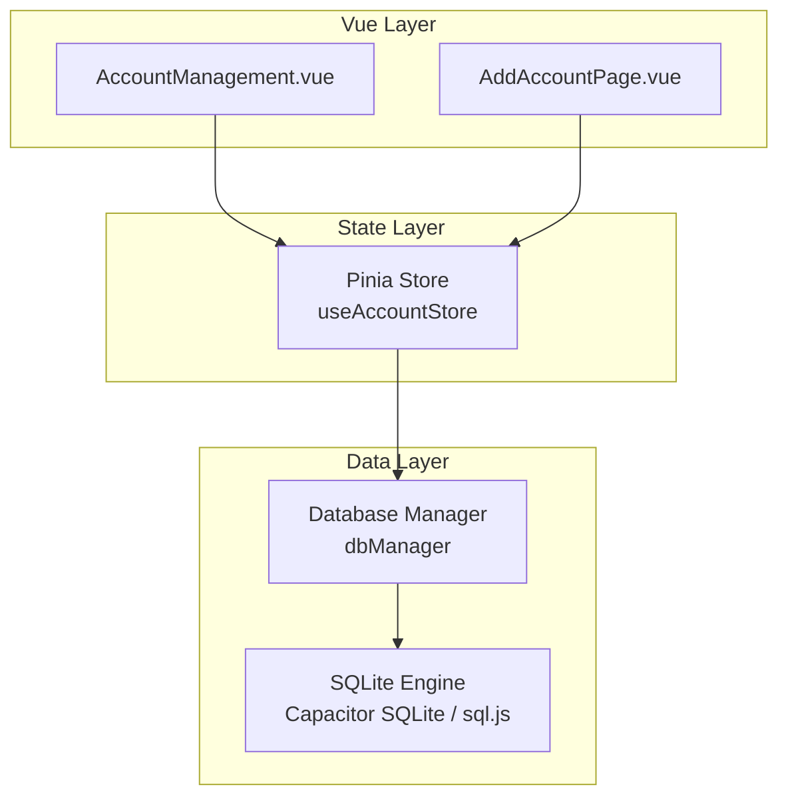
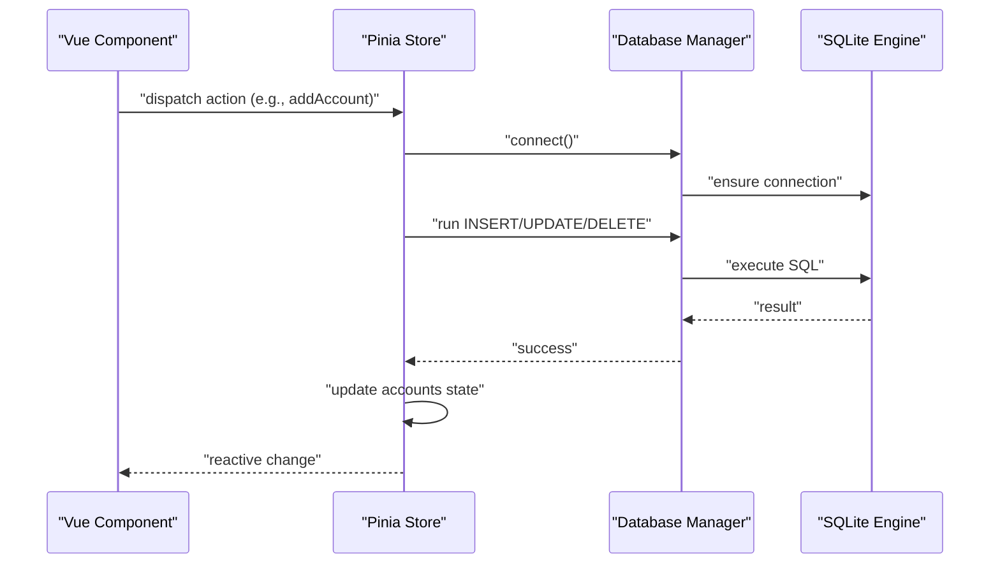
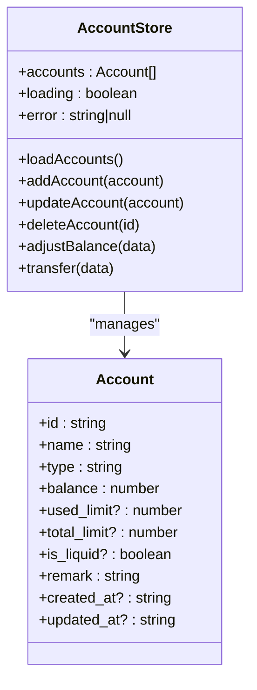
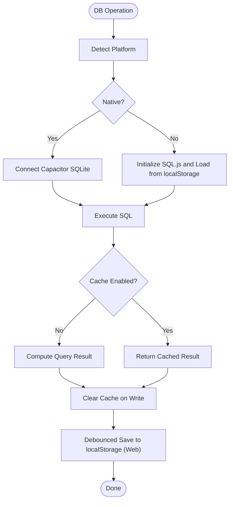
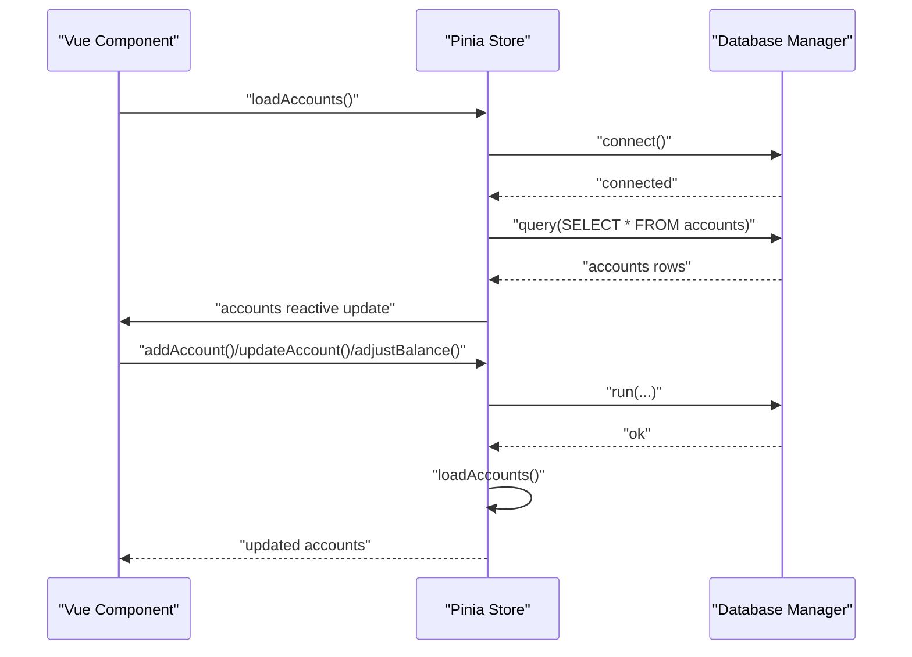
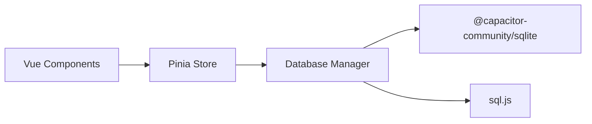

# State Management

<cite>
**Referenced Files in This Document**
- [account.ts](file://src/stores/account.ts)
- [index.js](file://src/database/index.js)
- [adapter.js](file://src/database/adapter.js)
- [main.ts](file://src/main.ts)
- [AccountManagement.vue](file://src/components/mobile/account/AccountManagement.vue)
- [AddAccountPage.vue](file://src/components/mobile/account/AddAccountPage.vue)
- [package.json](file://package.json)
</cite>

## Table of Contents
1. [Introduction](#introduction)
2. [Project Structure](#project-structure)
3. [Core Components](#core-components)
4. [Architecture Overview](#architecture-overview)
5. [Detailed Component Analysis](#detailed-component-analysis)
6. [Dependency Analysis](#dependency-analysis)
7. [Performance Considerations](#performance-considerations)
8. [Troubleshooting Guide](#troubleshooting-guide)
9. [Conclusion](#conclusion)
10. [Appendices](#appendices)

## Introduction
This document explains the state management architecture for the Finance App using Pinia stores, focusing on the account store. It covers reactive state management, computed properties, actions, state persistence, reactivity patterns, data synchronization with the database, store composition, module organization, and integration with Vue components. It also documents best practices for state normalization, caching strategies, performance optimization, state hydration from the database, offline state management, and conflict resolution strategies.

## Project Structure
The state management stack centers around a single Pinia store for accounts and a unified database abstraction that supports both native and web environments. Vue components consume the store via composables and drive state updates through actions.

**Diagram sources**
- [main.ts:13-15](file://src/main.ts#L13-L15)
- [account.ts:27-32](file://src/stores/account.ts#L27-L32)
- [index.js:21-32](file://src/database/index.js#L21-L32)

**Section sources**
- [main.ts:13-15](file://src/main.ts#L13-L15)
- [account.ts:27-32](file://src/stores/account.ts#L27-L32)
- [index.js:21-32](file://src/database/index.js#L21-L32)

## Core Components
- Pinia Account Store: Reactive state for accounts, loading, and errors; async actions for CRUD and balance adjustments; automatic synchronization with the database.
- Database Manager: Unified abstraction over SQLite with platform detection, connection pooling, caching, throttled persistence, and transaction support.
- Vue Components: Consume the store via composables, render computed aggregates, and trigger actions for mutations.

Key responsibilities:
- Reactive state: accounts array, loading flag, error messages.
- Actions: loadAccounts, addAccount, updateAccount, deleteAccount, adjustBalance, transfer.
- Computed properties: derived metrics (net worth, totals, ratios) in components.
- Persistence: database-backed storage with platform-aware initialization and persistence.

**Section sources**
- [account.ts:27-32](file://src/stores/account.ts#L27-L32)
- [account.ts:34-262](file://src/stores/account.ts#L34-L262)
- [index.js:21-32](file://src/database/index.js#L21-L32)
- [AccountManagement.vue:194-233](file://src/components/mobile/account/AccountManagement.vue#L194-L233)

## Architecture Overview
The store orchestrates state transitions initiated by user interactions in Vue components. Actions perform database operations and then synchronize the in-memory state. Components observe reactive state and re-render automatically.

**Diagram sources**
- [account.ts:59-100](file://src/stores/account.ts#L59-L100)
- [index.js:56-190](file://src/database/index.js#L56-L190)

**Section sources**
- [account.ts:59-100](file://src/stores/account.ts#L59-L100)
- [index.js:56-190](file://src/database/index.js#L56-L190)

## Detailed Component Analysis

### Account Store Implementation
The account store defines:
- Reactive state: accounts array, loading flag, error message.
- Actions: loadAccounts, addAccount, updateAccount, deleteAccount, adjustBalance, transfer.
- Asynchronous flows: database connectivity, transaction handling, and state refresh.

**Diagram sources**
- [account.ts:11-22](file://src/stores/account.ts#L11-L22)
- [account.ts:27-32](file://src/stores/account.ts#L27-L32)
- [account.ts:34-262](file://src/stores/account.ts#L34-L262)

Key implementation patterns:
- Async actions encapsulate database operations and state updates.
- Error handling sets error state and logs failures.
- After mutating operations, loadAccounts refreshes the in-memory state from the database.

Best practices observed:
- Centralized database access via a single abstraction.
- Explicit loading flags for UX feedback.
- Clear separation of concerns between store actions and database operations.

**Section sources**
- [account.ts:27-32](file://src/stores/account.ts#L27-L32)
- [account.ts:34-262](file://src/stores/account.ts#L34-L262)

### Database Abstraction and Persistence
The database manager provides:
- Platform detection (native vs web).
- Single connection lifecycle with reuse and concurrency guards.
- Query caching and cache invalidation.
- Throttled persistence for web environments.
- Batch execution and transaction helpers.
- Schema initialization and migrations.

**Diagram sources**
- [index.js:21-32](file://src/database/index.js#L21-L32)
- [index.js:56-190](file://src/database/index.js#L56-L190)
- [index.js:199-264](file://src/database/index.js#L199-L264)
- [index.js:379-408](file://src/database/index.js#L379-L408)

Operational highlights:
- Single connection per session with retry and guard mechanisms.
- Query cache keyed by SQL and parameters; cleared on write operations.
- Debounced persistence for web builds to reduce localStorage churn.
- Transactions supported via BEGIN/COMMIT/ROLLBACK with robust error handling.

**Section sources**
- [index.js:21-32](file://src/database/index.js#L21-L32)
- [index.js:56-190](file://src/database/index.js#L56-L190)
- [index.js:199-264](file://src/database/index.js#L199-L264)
- [index.js:379-408](file://src/database/index.js#L379-L408)

### Vue Component Integration
Components integrate the store through composables and reactive computed properties. They trigger actions on user interactions and render derived state.

**Diagram sources**
- [AccountManagement.vue:334-340](file://src/components/mobile/account/AccountManagement.vue#L334-L340)
- [AddAccountPage.vue:75-96](file://src/components/mobile/account/AddAccountPage.vue#L75-L96)
- [account.ts:38-53](file://src/stores/account.ts#L38-L53)

Observed patterns:
- Components call store actions on mount and activation hooks.
- Form components pass prepared payloads to store actions.
- Derived computations (totals, ratios) are computed from store state.

**Section sources**
- [AccountManagement.vue:334-340](file://src/components/mobile/account/AccountManagement.vue#L334-L340)
- [AddAccountPage.vue:75-96](file://src/components/mobile/account/AddAccountPage.vue#L75-L96)
- [account.ts:38-53](file://src/stores/account.ts#L38-L53)

### State Mutations, Async Actions, and Selectors
- State mutations: actions mutate accounts, loading, and error fields.
- Async actions: all store actions are async and coordinate with the database.
- Selectors: components compute derived values from store state (e.g., totals, ratios).

Examples (paths):
- Load accounts: [account.ts:38-53](file://src/stores/account.ts#L38-L53)
- Add account: [account.ts:59-100](file://src/stores/account.ts#L59-L100)
- Update account: [account.ts:106-121](file://src/stores/account.ts#L106-L121)
- Delete account: [account.ts:127-139](file://src/stores/account.ts#L127-L139)
- Adjust balance: [account.ts:145-177](file://src/stores/account.ts#L145-L177)
- Transfer: [account.ts:183-262](file://src/stores/account.ts#L183-L262)
- Derived computations: [AccountManagement.vue:194-233](file://src/components/mobile/account/AccountManagement.vue#L194-L233)

**Section sources**
- [account.ts:38-177](file://src/stores/account.ts#L38-L177)
- [account.ts:183-262](file://src/stores/account.ts#L183-L262)
- [AccountManagement.vue:194-233](file://src/components/mobile/account/AccountManagement.vue#L194-L233)

### Offline State Management and Hydration
- Hydration: on app start, components call loadAccounts to hydrate state from the database.
- Offline capability: the database manager supports both native SQLite and sql.js for web, enabling offline operation.
- Persistence: web builds persist the database to localStorage with throttling to avoid frequent writes.

Recommendations:
- Initialize database during app bootstrap and ensure loadAccounts runs on mount/activation.
- Use loading flags to provide feedback during hydration and network operations.
- Consider optimistic updates with rollback on failure for better UX.

**Section sources**
- [AccountManagement.vue:334-340](file://src/components/mobile/account/AccountManagement.vue#L334-L340)
- [index.js:149-178](file://src/database/index.js#L149-L178)
- [index.js:379-408](file://src/database/index.js#L379-L408)

### Conflict Resolution Strategies
- Transaction boundaries: the transfer action wraps multiple updates in a transaction with explicit rollback on failure.
- Idempotency: actions refresh state after mutations to reconcile with database state.
- Validation: actions validate inputs (e.g., sufficient balance) and surface errors.

**Section sources**
- [account.ts:183-262](file://src/stores/account.ts#L183-L262)

## Dependency Analysis
- Pinia store depends on the database abstraction for all persistence operations.
- Vue components depend on the store for state and actions.
- The database abstraction depends on platform-specific SQLite implementations.

**Diagram sources**
- [main.ts:13-15](file://src/main.ts#L13-L15)
- [account.ts:5-6](file://src/stores/account.ts#L5-L6)
- [index.js:8-10](file://src/database/index.js#L8-L10)

**Section sources**
- [main.ts:13-15](file://src/main.ts#L13-L15)
- [account.ts:5-6](file://src/stores/account.ts#L5-L6)
- [index.js:8-10](file://src/database/index.js#L8-L10)

## Performance Considerations
- Caching: query results are cached by SQL+params; cache invalidated on writes.
- Throttled persistence: web builds debounce localStorage writes to reduce overhead.
- Single connection: reuse a single connection instance to minimize overhead.
- Batch operations: use batch APIs for multiple writes to reduce round-trips.
- Indexes: precomputed indexes on frequently queried columns improve query performance.

Recommendations:
- Prefer computed properties for derived values to avoid recomputation.
- Use loading flags to defer heavy UI updates until after hydration.
- Minimize redundant reloads by checking local state before re-querying.

**Section sources**
- [index.js:199-264](file://src/database/index.js#L199-L264)
- [index.js:379-408](file://src/database/index.js#L379-L408)
- [index.js:432-689](file://src/database/index.js#L432-L689)

## Troubleshooting Guide
Common issues and resolutions:
- Connection failures: ensure db.connect() is awaited before queries; check platform detection and initialization order.
- Transaction errors: verify BEGIN/COMMIT/ROLLBACK sequences and handle rollback on commit failures.
- Stale state: after mutations, always call loadAccounts to refresh reactive state.
- Performance regressions: monitor cache hit rate and consider adding indexes for new queries.

Actions to take:
- Log errors in actions and set error state for user feedback.
- Verify platform-specific behavior (native vs web) when diagnosing persistence issues.
- Confirm that components call loadAccounts on mount/activation hooks.

**Section sources**
- [account.ts:38-53](file://src/stores/account.ts#L38-L53)
- [account.ts:183-262](file://src/stores/account.ts#L183-L262)
- [index.js:56-190](file://src/database/index.js#L56-L190)

## Conclusion
The Finance App employs a clean separation of concerns: Vue components manage UI and user interactions, the Pinia store manages reactive state and orchestrates async operations, and the database manager provides a robust, platform-aware persistence layer. By leveraging caching, transactions, and hydration patterns, the system achieves reliable state synchronization and strong offline capabilities.

## Appendices

### Best Practices Checklist
- Keep state flat and normalized where possible; derive complex values via computed properties.
- Use transactions for multi-step operations to maintain consistency.
- Invalidate caches after writes to prevent stale reads.
- Provide loading indicators and error messaging for async operations.
- Initialize database and hydrate state early in app lifecycle.

### Example Paths
- Store definition and actions: [account.ts:27-262](file://src/stores/account.ts#L27-L262)
- Database manager: [index.js:21-935](file://src/database/index.js#L21-L935)
- Component hydration: [AccountManagement.vue:334-340](file://src/components/mobile/account/AccountManagement.vue#L334-L340)
- Component actions: [AddAccountPage.vue:75-96](file://src/components/mobile/account/AddAccountPage.vue#L75-L96)