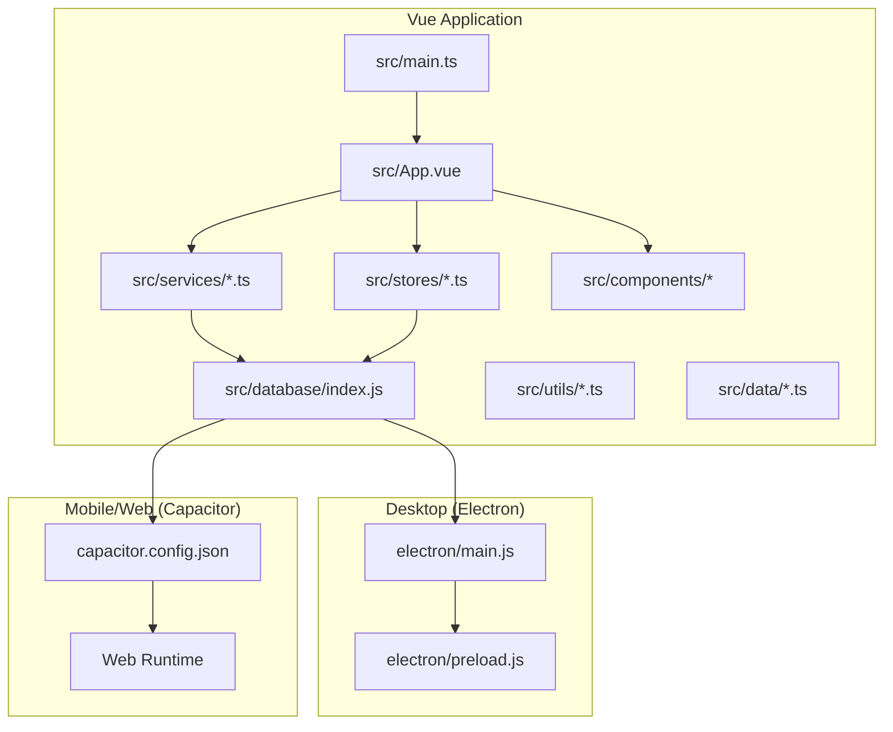
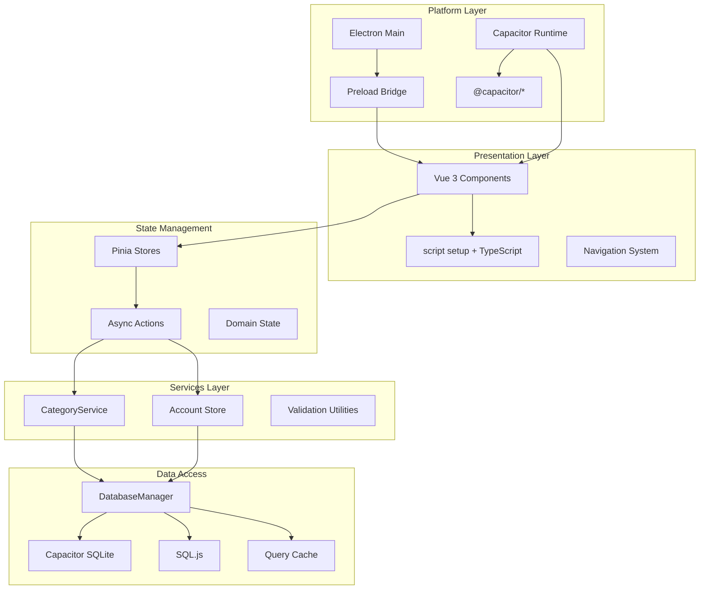
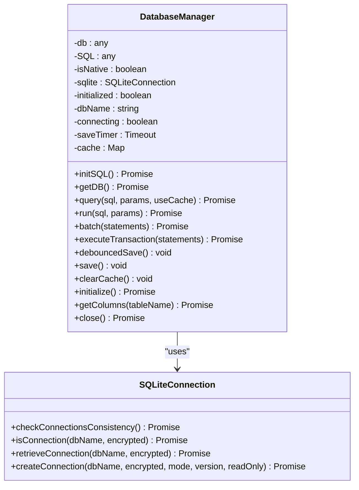
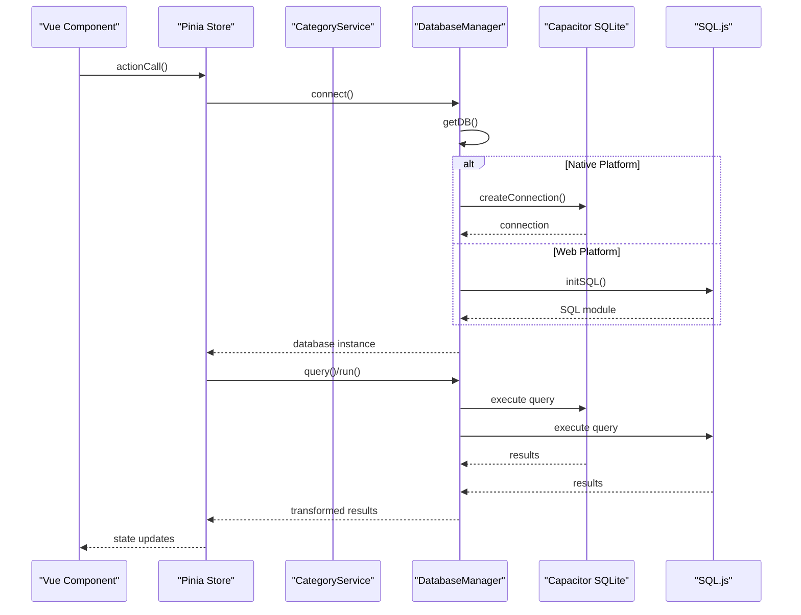
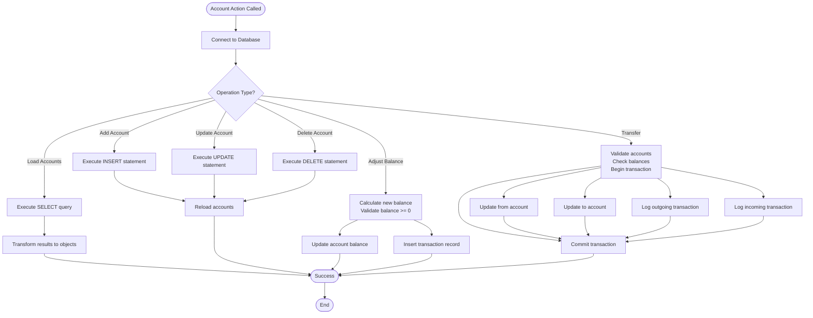
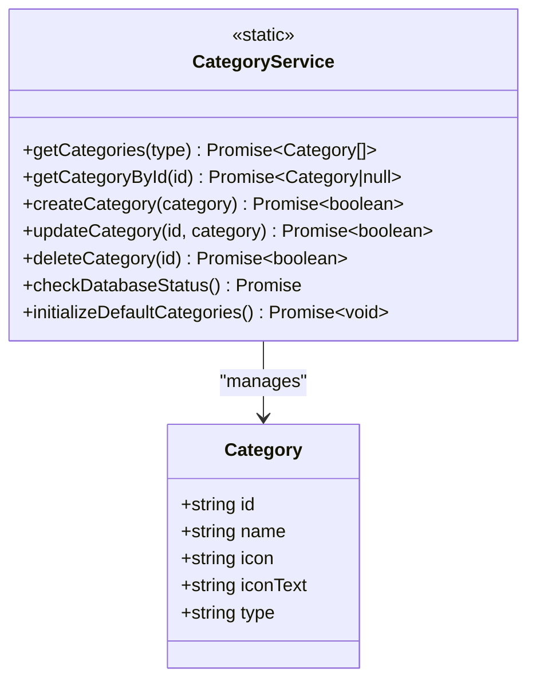
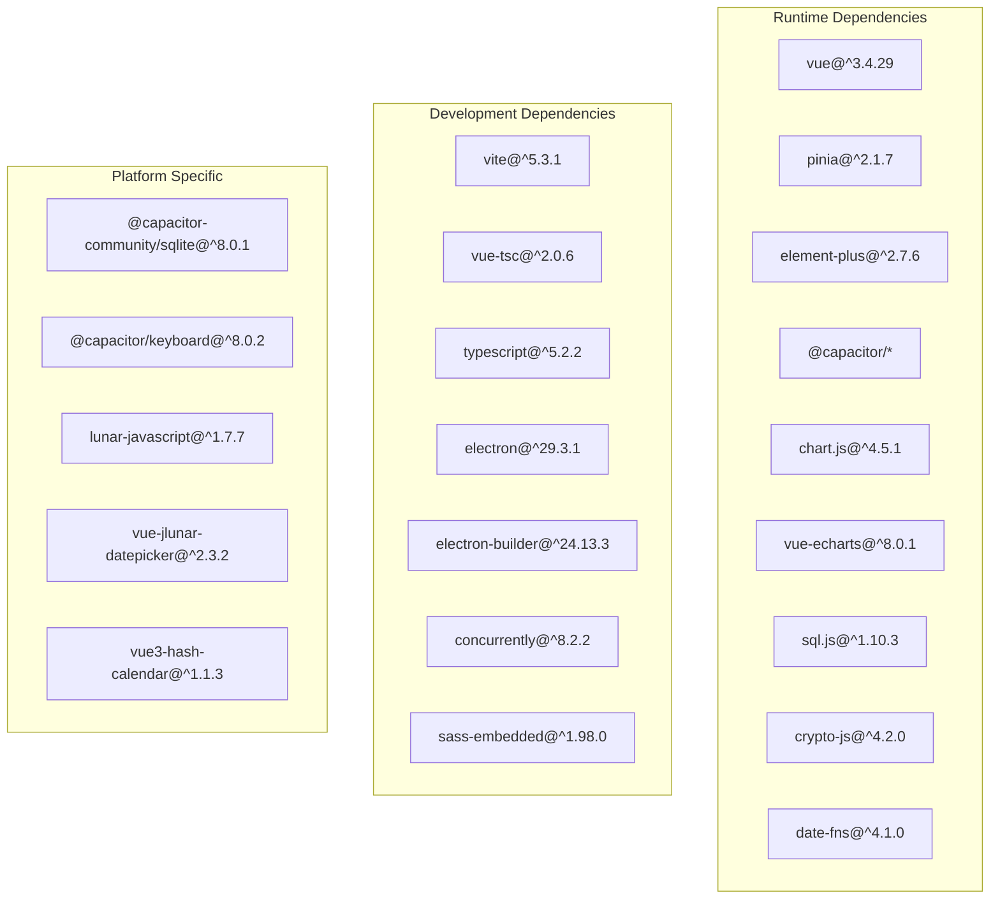

# Development Guide

<cite>
**Referenced Files in This Document**
- [package.json](file://package.json)
- [vite.config.ts](file://vite.config.ts)
- [src/main.ts](file://src/main.ts)
- [src/App.vue](file://src/App.vue)
- [electron/main.js](file://electron/main.js)
- [electron/preload.js](file://electron/preload.js)
- [capacitor.config.json](file://capacitor.config.json)
- [src/stores/account.ts](file://src/stores/account.ts)
- [src/services/categoryService.ts](file://src/services/categoryService.ts)
- [src/database/index.js](file://src/database/index.js)
- [src/data/categories.ts](file://src/data/categories.ts)
- [src/utils/dictionaries.ts](file://src/utils/dictionaries.ts)
- [scripts/postinstall.js](file://scripts/postinstall.js)
- [tsconfig.json](file://tsconfig.json)
</cite>

## Table of Contents
1. [Introduction](#introduction)
2. [Project Structure](#project-structure)
3. [Core Components](#core-components)
4. [Architecture Overview](#architecture-overview)
5. [Detailed Component Analysis](#detailed-component-analysis)
6. [Dependency Analysis](#dependency-analysis)
7. [Performance Considerations](#performance-considerations)
8. [Testing Strategies](#testing-strategies)
9. [Debugging Techniques](#debugging-techniques)
10. [Development Workflow](#development-workflow)
11. [Coding Standards and Best Practices](#coding-stands-and-best-practices)
12. [Cross-Platform Development](#cross-platform-development)
13. [Adding New Features](#adding-new-features)
14. [Modifying Existing Components](#modifying-existing-components)
15. [Build System and Deployment](#build-system-and-deployment)
16. [Troubleshooting Guide](#troubleshooting-guide)
17. [Conclusion](#conclusion)

## Introduction
This development guide provides comprehensive instructions for contributing to the Finance App. It covers the development workflow, coding standards, architectural patterns, testing strategies, debugging techniques, build system configuration, and cross-platform deployment using Vue.js, TypeScript, Vite, Pinia, Capacitor, and Electron. The guide also includes practical templates and best practices for maintaining code quality and optimizing performance.

## Project Structure
The project follows a feature-based structure with clear separation of concerns:
- Electron main process and preload scripts for desktop packaging
- Capacitor configuration for cross-platform mobile/web support
- Vue 3 application with TypeScript and Pinia for state management
- Modular component organization under src/components
- Centralized stores, services, and utilities
- Database abstraction supporting both native and web environments



**Diagram sources**
- [electron/main.js:1-70](file://electron/main.js#L1-L70)
- [electron/preload.js:1-7](file://electron/preload.js#L1-L7)
- [capacitor.config.json:1-22](file://capacitor.config.json#L1-L22)
- [src/main.ts:1-16](file://src/main.ts#L1-L16)
- [src/App.vue:1-195](file://src/App.vue#L1-L195)
- [src/database/index.js:1-935](file://src/database/index.js#L1-L935)

**Section sources**
- [package.json:1-72](file://package.json#L1-L72)
- [vite.config.ts:1-11](file://vite.config.ts#L1-L11)
- [capacitor.config.json:1-22](file://capacitor.config.json#L1-L22)

## Core Components
The Finance App is built around several core components and patterns:

### Application Bootstrap
The application initializes Vue, Pinia, and Element Plus, with Capacitor detection for native platform features.

### State Management
Pinia stores manage domain-specific state with async actions for database operations.

### Services Layer
Type-safe service classes encapsulate business logic and data access patterns.

### Database Abstraction
Unified database manager supports both Capacitor SQLite (native) and SQL.js (web) with caching and persistence strategies.

**Section sources**
- [src/main.ts:1-16](file://src/main.ts#L1-L16)
- [src/App.vue:22-173](file://src/App.vue#L22-L173)
- [src/stores/account.ts:1-265](file://src/stores/account.ts#L1-L265)
- [src/services/categoryService.ts:1-260](file://src/services/categoryService.ts#L1-L260)
- [src/database/index.js:1-935](file://src/database/index.js#L1-L935)

## Architecture Overview
The Finance App employs a hybrid architecture combining Electron for desktop, Capacitor for cross-platform, and Vue for the UI layer.



**Diagram sources**
- [src/App.vue:22-173](file://src/App.vue#L22-L173)
- [src/stores/account.ts:27-265](file://src/stores/account.ts#L27-L265)
- [src/services/categoryService.ts:8-260](file://src/services/categoryService.ts#L8-L260)
- [src/database/index.js:21-935](file://src/database/index.js#L21-L935)
- [electron/main.js:1-70](file://electron/main.js#L1-L70)
- [electron/preload.js:1-7](file://electron/preload.js#L1-L7)
- [capacitor.config.json:1-22](file://capacitor.config.json#L1-L22)

## Detailed Component Analysis

### Database Manager
The DatabaseManager provides unified database operations across platforms with performance optimizations.



**Diagram sources**
- [src/database/index.js:21-935](file://src/database/index.js#L21-L935)

#### Database Operations Flow


**Diagram sources**
- [src/stores/account.ts:38-100](file://src/stores/account.ts#L38-L100)
- [src/services/categoryService.ts:14-69](file://src/services/categoryService.ts#L14-L69)
- [src/database/index.js:56-190](file://src/database/index.js#L56-L190)

**Section sources**
- [src/database/index.js:1-935](file://src/database/index.js#L1-L935)

### Account Management Store
The Account Store manages financial account operations with comprehensive error handling and transaction support.



**Diagram sources**
- [src/stores/account.ts:38-265](file://src/stores/account.ts#L38-L265)

**Section sources**
- [src/stores/account.ts:1-265](file://src/stores/account.ts#L1-L265)

### Category Service
The CategoryService provides robust categorization with default fallbacks and database initialization.



**Diagram sources**
- [src/services/categoryService.ts:8-260](file://src/services/categoryService.ts#L8-L260)
- [src/data/categories.ts:1-45](file://src/data/categories.ts#L1-L45)

**Section sources**
- [src/services/categoryService.ts:1-260](file://src/services/categoryService.ts#L1-L260)
- [src/data/categories.ts:1-45](file://src/data/categories.ts#L1-L45)

## Dependency Analysis
The project uses a modern JavaScript stack with deliberate dependency choices for cross-platform compatibility.



**Diagram sources**
- [package.json:19-47](file://package.json#L19-L47)

**Section sources**
- [package.json:1-72](file://package.json#L1-L72)

## Performance Considerations
The application implements several performance optimization strategies:

### Database Performance
- Single connection per platform with connection pooling
- Query result caching with cache invalidation
- Batch operations for bulk inserts/updates
- Index creation for frequently queried columns
- Debounced persistence for web environment

### Memory Management
- Lazy loading of components via dynamic imports
- Conditional rendering based on navigation state
- Proper cleanup of event listeners and timers
- Efficient data structures (Maps for deduplication)

### Build Optimizations
- ES2015 target for modern browser support
- Vite's fast development server with HMR
- Tree shaking through ES modules
- Minimal bundle size through selective imports

## Testing Strategies
While formal unit tests are not present in the current codebase, the architecture supports several testing approaches:

### Unit Testing Approach
- Pinia stores can be tested independently
- Service classes with pure functions
- Database operations can be mocked
- Component testing with Vue Test Utils

### Integration Testing
- End-to-end testing with Cypress or Playwright
- Cross-platform testing on real devices/emulators
- Database migration testing
- Performance regression testing

### Mock Strategies
```typescript
// Example mock patterns for testing
const mockDatabase = {
  query: jest.fn(),
  run: jest.fn(),
  batch: jest.fn()
};

const mockStore = useAccountStore();
Object.assign(mockStore, {
  accounts: mockAccounts,
  loading: false,
  error: null
});
```

## Debugging Techniques
Effective debugging requires understanding the multi-layered architecture:

### Desktop Debugging (Electron)
- Enable developer tools in development mode
- Use IPC communication logging
- Inspect main process vs renderer process
- Hot reload during development

### Mobile/Web Debugging
- Capacitor DevTools for iOS/Android
- Browser developer tools for web builds
- Network tab for database queries
- Console logging with structured data

### Database Debugging
- Enable debug mode in DatabaseManager
- Monitor query execution times
- Track cache hit rates
- Inspect transaction logs

## Development Workflow
The recommended development workflow follows these steps:

### Environment Setup
1. Install dependencies using pnpm
2. Configure Capacitor for target platforms
3. Set up development servers for both web and Electron
4. Verify database initialization

### Feature Development
1. Create new Vue components in appropriate folders
2. Implement Pinia store actions for state management
3. Add service methods for business logic
4. Write database migrations if schema changes
5. Test across platforms (web, mobile, desktop)

### Code Quality
1. Follow TypeScript strict mode rules
2. Use ESLint/Prettier for formatting
3. Write meaningful commit messages
4. Create pull requests with clear descriptions
5. Include screenshots for UI changes

## Coding Standards and Best Practices

### TypeScript Guidelines
- Enable strict mode in tsconfig.json
- Use interfaces for data structures
- Leverage discriminated unions for navigation
- Implement proper error handling
- Use readonly arrays for immutable data

### Vue.js Conventions
- Use Composition API with script setup
- Implement component naming with feature prefixes
- Use PascalCase for component names
- Leverage reactive refs/computed properly
- Keep components focused and single-responsibility

### Naming Conventions
- Components: FeaturePrefix + ComponentName (e.g., MobileAccountManagement)
- Stores: useFeatureStore pattern
- Services: FeatureService suffix
- Files: kebab-case for directories, PascalCase for components

### Code Organization
- Group related components in feature folders
- Separate concerns between presentation and logic
- Use barrel exports for component libraries
- Maintain consistent prop/event naming

## Cross-Platform Development
The Finance App targets three platforms with shared codebase:

### Platform Detection
```typescript
import { Capacitor } from '@capacitor/core';

if (Capacitor.isNativePlatform()) {
  // Native-specific code
} else {
  // Web-specific code
}
```

### Platform-Specific Features
- Native platform: Capacitor plugins, local storage
- Web platform: IndexedDB fallback, localStorage persistence
- Desktop: Electron integration, file system access

### Build Targets
- Web: Modern browsers with ES2015+ features
- Android: API level 21+, Java 17 compatibility
- iOS: Latest iOS versions
- Desktop: Windows (NSIS/portable), macOS (DMG), Linux (AppImage)

**Section sources**
- [src/main.ts:9-11](file://src/main.ts#L9-L11)
- [capacitor.config.json:14-21](file://capacitor.config.json#L14-L21)
- [scripts/postinstall.js:40-142](file://scripts/postinstall.js#L40-L142)

## Adding New Features
Follow this systematic approach for feature development:

### 1. Planning Phase
- Define feature requirements and acceptance criteria
- Identify affected components and stores
- Plan database schema changes if needed
- Create wireframes/mockups

### 2. Database Layer
- Add new tables or modify existing ones
- Create migration scripts for existing users
- Implement CRUD operations in DatabaseManager
- Add indexes for performance

### 3. Service Layer
- Create service class with static methods
- Implement business logic validation
- Handle error scenarios gracefully
- Support both native and web environments

### 4. State Management
- Add new store or extend existing store
- Implement async actions with proper error handling
- Manage loading states and error messages
- Ensure proper cache invalidation

### 5. Presentation Layer
- Create new Vue components
- Implement responsive design
- Add proper form validation
- Ensure accessibility compliance

### 6. Navigation Integration
- Add route mapping in App.vue
- Implement navigation guards if needed
- Handle deep linking scenarios
- Update side menu and footer navigation

### 7. Testing and Validation
- Write unit tests for new functionality
- Test across all target platforms
- Validate performance impact
- Document API changes

## Modifying Existing Components
When modifying existing components, follow these guidelines:

### Component Updates
1. Identify breaking changes and migration paths
2. Maintain backward compatibility where possible
3. Update TypeScript interfaces if needed
4. Test component interactions with parent/child components

### Store Modifications
1. Preserve existing state structure
2. Add new actions alongside existing ones
3. Update error handling patterns
4. Maintain consistent return types

### Service Changes
1. Keep method signatures stable
2. Add optional parameters for new features
3. Update default values appropriately
4. Document behavioral changes

### Database Migrations
1. Always check for existing data
2. Provide safe migration paths
3. Handle partial failures gracefully
4. Test with production-like datasets

## Build System and Deployment
The project uses Vite for development and Electron Builder for packaging:

### Development Scripts
- `npm run dev`: Start Vite development server
- `npm run electron:dev`: Run Electron with hot reload
- `npm run build`: Build for production
- `npm run electron:build`: Package Electron app

### Build Configuration
- Vite config enables Vue plugin and sets ES2015 target
- Base path set to relative for cross-platform compatibility
- TypeScript compilation handled by vue-tsc

### Electron Configuration
- Main process handles window creation and IPC
- Preload script exposes secure APIs
- Development mode loads localhost:5173
- Production mode loads bundled HTML

### Capacitor Integration
- WebDir configured to 'dist'
- Splash screen and keyboard plugins enabled
- Android build options set to Java 17
- Mixed content allowed for external resources

**Section sources**
- [package.json:7-17](file://package.json#L7-L17)
- [vite.config.ts:5-11](file://vite.config.ts#L5-L11)
- [electron/main.js:31-39](file://electron/main.js#L31-L39)
- [capacitor.config.json:4-5](file://capacitor.config.json#L4-L5)

## Troubleshooting Guide

### Common Issues and Solutions

#### Database Connection Problems
- **Issue**: SQLite connection fails on first load
- **Solution**: Check DatabaseManager initialization and platform detection
- **Prevention**: Implement retry logic and graceful fallback

#### Capacitor Plugin Issues
- **Issue**: Plugins not working on Android
- **Solution**: Verify postinstall script execution and Java version compatibility
- **Prevention**: Regularly update Capacitor packages

#### Electron Development Problems
- **Issue**: Hot reload not working
- **Solution**: Verify Vite configuration and Electron main process settings
- **Prevention**: Keep development dependencies updated

#### Performance Issues
- **Issue**: Slow component rendering
- **Solution**: Implement lazy loading and optimize database queries
- **Prevention**: Monitor performance metrics regularly

### Debugging Tools
- Browser developer tools for web debugging
- Electron DevTools for desktop debugging
- Capacitor DevTools for mobile debugging
- Database inspection tools for data validation

**Section sources**
- [src/database/index.js:13-18](file://src/database/index.js#L13-L18)
- [scripts/postinstall.js:40-142](file://scripts/postinstall.js#L40-L142)
- [electron/main.js:31-39](file://electron/main.js#L31-L39)

## Conclusion
The Finance App provides a robust foundation for cross-platform financial management applications. Its architecture supports scalability, maintainability, and performance across web, mobile, and desktop platforms. By following the development guidelines, coding standards, and best practices outlined in this document, contributors can effectively extend the application's functionality while maintaining code quality and user experience.

The combination of Vue.js with TypeScript, Pinia for state management, Capacitor for cross-platform capabilities, and Electron for desktop packaging creates a powerful development stack suitable for complex financial applications. Regular maintenance, performance monitoring, and adherence to the established patterns will ensure the continued success of the Finance App ecosystem.