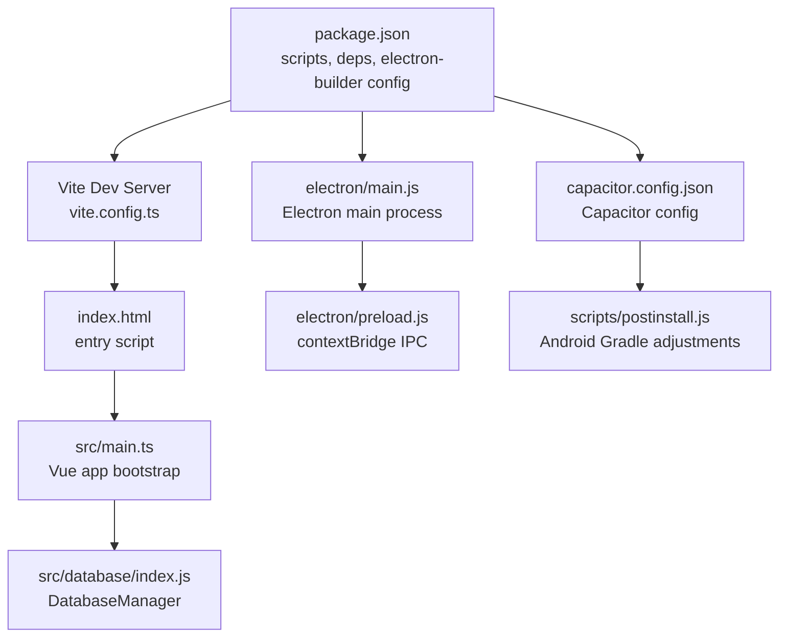
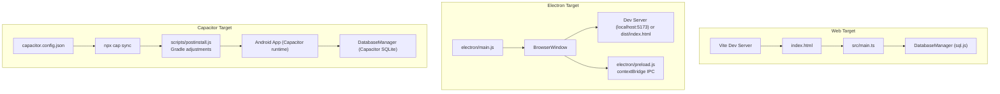
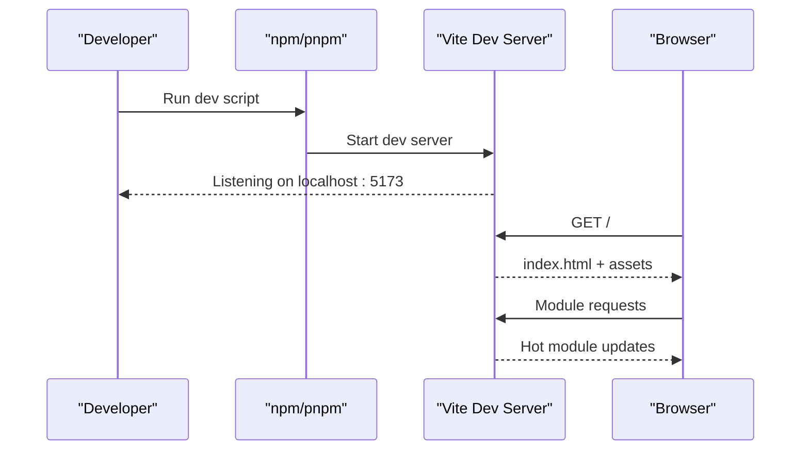
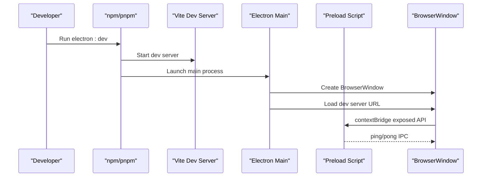
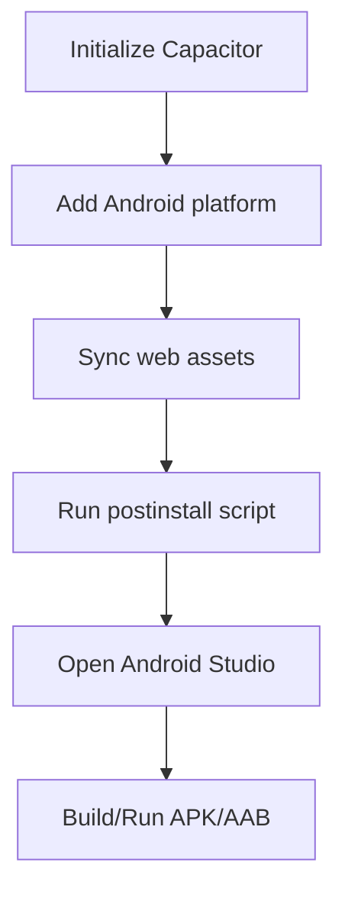
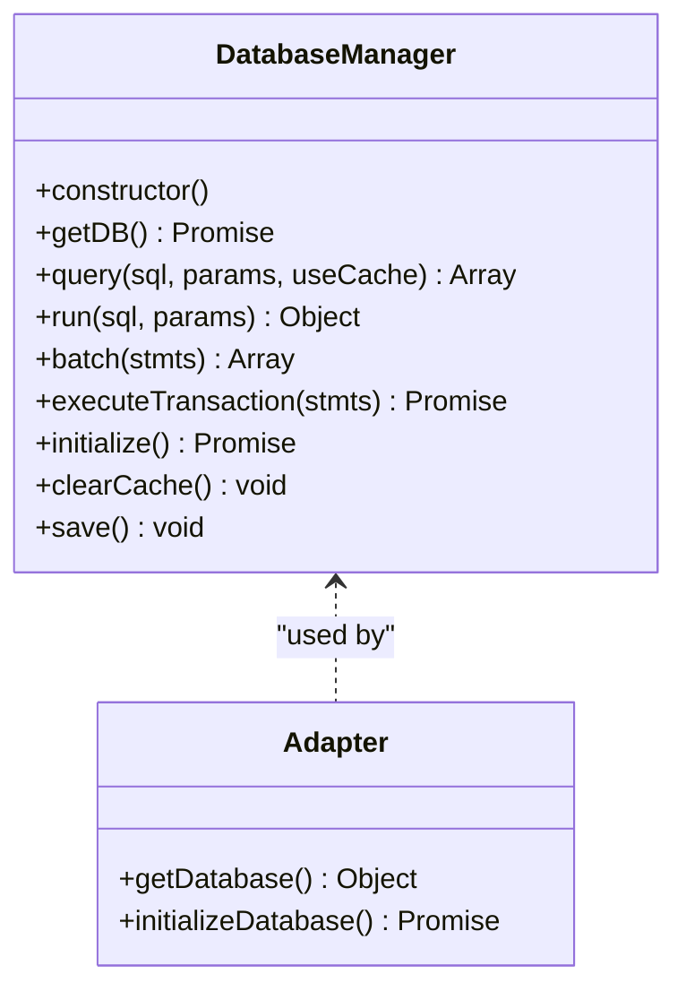
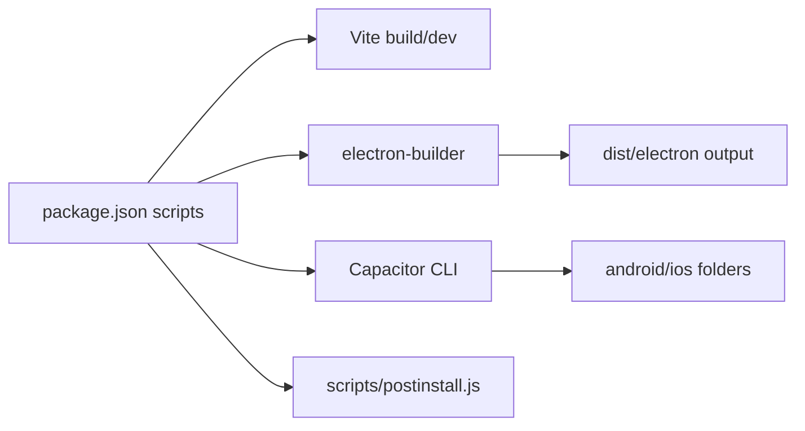

# Getting Started

<cite>
**Referenced Files in This Document**
- [package.json](file://package.json)
- [vite.config.ts](file://vite.config.ts)
- [capacitor.config.json](file://capacitor.config.json)
- [electron/main.js](file://electron/main.js)
- [electron/preload.js](file://electron/preload.js)
- [scripts/postinstall.js](file://scripts/postinstall.js)
- [index.html](file://index.html)
- [src/main.ts](file://src/main.ts)
- [src/database/index.js](file://src/database/index.js)
- [src/database/adapter.js](file://src/database/adapter.js)
- [.npmrc](file://.npmrc)
- [.gitignore](file://.gitignore)
- [tsconfig.json](file://tsconfig.json)
- [tsconfig.node.json](file://tsconfig.node.json)
</cite>

## Table of Contents
1. [Introduction](#introduction)
2. [Project Structure](#project-structure)
3. [Core Components](#core-components)
4. [Architecture Overview](#architecture-overview)
5. [Detailed Component Analysis](#detailed-component-analysis)
6. [Dependency Analysis](#dependency-analysis)
7. [Performance Considerations](#performance-considerations)
8. [Troubleshooting Guide](#troubleshooting-guide)
9. [Conclusion](#conclusion)
10. [Appendices](#appendices)

## Introduction
This guide helps you set up, run, and build the Finance App across multiple targets: web, Electron, and Capacitor (Android). It covers environment prerequisites, installation steps, development workflows, production builds, and deployment considerations. The project uses Vue 3, TypeScript, Vite, Pinia, Element Plus, and integrates a cross-platform database layer supporting both web (sql.js) and native (Capacitor SQLite) environments.

## Project Structure
The repository is organized around a modern frontend stack with optional native packaging via Electron and Capacitor. Key areas:
- Web app entry and build: Vite configuration, HTML entry, and TypeScript setup
- Native/desktop packaging: Electron main/preload processes
- Cross-platform database: Unified adapter and manager supporting web/native
- Capacitor configuration and Android toolchain integration

**Diagram sources**
- [package.json:1-72](file://package.json#L1-L72)
- [vite.config.ts:1-11](file://vite.config.ts#L1-L11)
- [index.html:1-13](file://index.html#L1-L13)
- [src/main.ts:1-16](file://src/main.ts#L1-L16)
- [src/database/index.js:1-120](file://src/database/index.js#L1-L120)
- [electron/main.js:1-70](file://electron/main.js#L1-L70)
- [electron/preload.js:1-7](file://electron/preload.js#L1-L7)
- [capacitor.config.json:1-22](file://capacitor.config.json#L1-L22)
- [scripts/postinstall.js:1-145](file://scripts/postinstall.js#L1-L145)

**Section sources**
- [package.json:1-72](file://package.json#L1-L72)
- [vite.config.ts:1-11](file://vite.config.ts#L1-L11)
- [index.html:1-13](file://index.html#L1-L13)
- [src/main.ts:1-16](file://src/main.ts#L1-L16)
- [src/database/index.js:1-120](file://src/database/index.js#L1-L120)
- [electron/main.js:1-70](file://electron/main.js#L1-L70)
- [electron/preload.js:1-7](file://electron/preload.js#L1-L7)
- [capacitor.config.json:1-22](file://capacitor.config.json#L1-L22)
- [scripts/postinstall.js:1-145](file://scripts/postinstall.js#L1-L145)

## Core Components
- Build and scripts: Vite-based web build, Electron dev/build, Capacitor init/sync/open, and postinstall adjustments
- Runtime bootstrap: Vue app initialization with Pinia and Element Plus; Capacitor detection for native vs web
- Database abstraction: Single DatabaseManager supporting Capacitor SQLite (native) and sql.js (web) with caching and throttled persistence
- Electron integration: Main process creates BrowserWindow, loads dev server or built HTML, and exposes IPC bridge via preload

**Section sources**
- [package.json:7-17](file://package.json#L7-L17)
- [src/main.ts:1-16](file://src/main.ts#L1-L16)
- [src/database/index.js:20-190](file://src/database/index.js#L20-L190)
- [electron/main.js:19-45](file://electron/main.js#L19-L45)
- [electron/preload.js:1-7](file://electron/preload.js#L1-L7)

## Architecture Overview
The Finance App supports three primary targets:
- Web: Vite dev server with hot reload; production build outputs static assets
- Electron: Desktop app wrapping the web build; main process loads dev server during development or packaged HTML in production
- Capacitor: Hybrid app targeting Android; syncs web assets and adjusts Gradle settings via postinstall

**Diagram sources**
- [vite.config.ts:5-11](file://vite.config.ts#L5-L11)
- [index.html:9-12](file://index.html#L9-L12)
- [src/main.ts:13-16](file://src/main.ts#L13-L16)
- [src/database/index.js:8-11](file://src/database/index.js#L8-L11)
- [electron/main.js:30-39](file://electron/main.js#L30-L39)
- [electron/preload.js:1-7](file://electron/preload.js#L1-L7)
- [capacitor.config.json:1-22](file://capacitor.config.json#L1-L22)
- [scripts/postinstall.js:1-145](file://scripts/postinstall.js#L1-L145)

## Detailed Component Analysis

### Environment Requirements
- Node.js and npm/pnpm: The project defines a module entry and uses npm scripts. A pnpm configuration is present to hoist and relax peer dependency checks.
- TypeScript: Compiler options and bundler mode are configured for ESNext modules and Vue/TSX/Vue files.
- Platform-specific dependencies:
  - Electron: Used for desktop packaging and dev server orchestration
  - Capacitor: Core and Android runtime plus CLI; SQLite community plugin and keyboard plugin
  - Web toolchain: Vite, Vue plugin, TypeScript compiler, and Vue type checking

**Section sources**
- [package.json:19-47](file://package.json#L19-L47)
- [.npmrc:1-4](file://.npmrc#L1-L4)
- [tsconfig.json:1-25](file://tsconfig.json#L1-L25)
- [tsconfig.node.json:1-10](file://tsconfig.node.json#L1-L10)

### Web Setup and Development
- Install dependencies using your preferred package manager (npm or pnpm)
- Start the Vite dev server
- Open http://localhost:5173 to view the app
- The HTML entry injects the Vue app and sets a relative base for assets

**Diagram sources**
- [package.json:8](file://package.json#L8)
- [vite.config.ts:5-11](file://vite.config.ts#L5-L11)
- [index.html:9-12](file://index.html#L9-L12)

**Section sources**
- [package.json:8](file://package.json#L8)
- [vite.config.ts:5-11](file://vite.config.ts#L5-L11)
- [index.html:9-12](file://index.html#L9-L12)

### Electron Development and Build
- Development: The dev script runs Vite; a dedicated script concurrently launches the Electron main process, connecting to the dev server
- Production build: The build script bundles the web app; the Electron build script packages it with electron-builder
- Main process behavior:
  - Creates a BrowserWindow with preload script
  - Loads the dev server in development or the packaged HTML in production
  - Exposes a simple IPC channel for testing

**Diagram sources**
- [package.json:11](file://package.json#L11)
- [electron/main.js:30-39](file://electron/main.js#L30-L39)
- [electron/preload.js:1-7](file://electron/preload.js#L1-L7)

**Section sources**
- [package.json:11](file://package.json#L11)
- [electron/main.js:19-45](file://electron/main.js#L19-L45)
- [electron/preload.js:1-7](file://electron/preload.js#L1-L7)

### Capacitor Setup and Android Build
- Initialize Capacitor and add Android platform
- Sync web assets into Capacitor and run postinstall to adjust Gradle configurations for Java 17 compatibility
- Open Android Studio to build/run the Android app
- Capacitor config specifies app ID, app name, web directory, and Android build options

**Diagram sources**
- [package.json:13-16](file://package.json#L13-L16)
- [capacitor.config.json:1-22](file://capacitor.config.json#L1-L22)
- [scripts/postinstall.js:1-145](file://scripts/postinstall.js#L1-L145)

**Section sources**
- [package.json:13-16](file://package.json#L13-L16)
- [capacitor.config.json:1-22](file://capacitor.config.json#L1-L22)
- [scripts/postinstall.js:1-145](file://scripts/postinstall.js#L1-L145)

### Database Layer and Platform Abstraction
- The DatabaseManager abstracts storage across platforms:
  - Native (Capacitor): Uses Capacitor SQLite connection and executes statements
  - Web (sql.js): Initializes sql.js, optionally restores from localStorage, persists periodically
- Features include single connection reuse, query caching, throttled persistence, and transaction support
- The adapter module detects the native platform and routes to the unified manager

**Diagram sources**
- [src/database/index.js:20-375](file://src/database/index.js#L20-L375)
- [src/database/adapter.js:14-33](file://src/database/adapter.js#L14-L33)

**Section sources**
- [src/database/index.js:8-11](file://src/database/index.js#L8-L11)
- [src/database/index.js:20-190](file://src/database/index.js#L20-L190)
- [src/database/index.js:418-419](file://src/database/index.js#L418-L419)
- [src/database/adapter.js:14-33](file://src/database/adapter.js#L14-L33)

## Dependency Analysis
- Scripts orchestrate the build pipeline:
  - dev: Vite dev server
  - build: Vite production build
  - preview: Serve built assets locally
  - electron:dev: Concurrently run dev and Electron main process
  - electron:build: Build web assets then package with electron-builder
  - Capacitor commands: init, add android, sync, open android
  - postinstall: Adjust Gradle files for Java 17 compatibility
- Electron builder configuration defines product metadata, output directory, and platform targets (Windows NSIS/portable, macOS DMG, Linux AppImage)
- Capacitor config defines app identity, web directory, and Android build options (Java 17 compatibility)

**Diagram sources**
- [package.json:7-17](file://package.json#L7-L17)
- [package.json:48-70](file://package.json#L48-L70)

**Section sources**
- [package.json:7-17](file://package.json#L7-L17)
- [package.json:48-70](file://package.json#L48-L70)

## Performance Considerations
- DatabaseManager employs:
  - Single connection reuse to avoid redundant initialization
  - Query result caching with cache clearing after writes
  - Throttled persistence for web (localStorage) to reduce write frequency
- Capacitor SQLite and sql.js are selected per platform automatically, minimizing runtime overhead
- Vite target is set to ES2015 for broad compatibility

**Section sources**
- [src/database/index.js:30-32](file://src/database/index.js#L30-L32)
- [src/database/index.js:200-209](file://src/database/index.js#L200-L209)
- [src/database/index.js:379-391](file://src/database/index.js#L379-L391)
- [vite.config.ts:8-10](file://vite.config.ts#L8-L10)

## Troubleshooting Guide
- Node/npm/pnpm environment
  - Use a supported Node.js version compatible with the project’s toolchain
  - If using pnpm, the repository enables hoisting and disables strict peers to ease dependency resolution
- Capacitor Android build failures
  - Ensure Java 17 is installed and configured; the postinstall script modifies Gradle files to use Java 17 compatibility
  - Re-run sync and postinstall after adding or updating Capacitor plugins
- Electron dev server not loading
  - Confirm the dev server is running on port 5173 before launching Electron
  - Verify the main process loads the dev URL in development mode and packaged HTML in production
- Database initialization errors
  - On first run, the DatabaseManager initializes tables and indices; ensure the app has permission to persist data (localStorage for web, Capacitor SQLite for native)
- Ignored files and caches
  - The repository ignores node_modules, dist, and OS-generated files; remove ignored caches if stale builds occur

**Section sources**
- [.npmrc:1-4](file://.npmrc#L1-L4)
- [scripts/postinstall.js:55-63](file://scripts/postinstall.js#L55-L63)
- [electron/main.js:30-39](file://electron/main.js#L30-L39)
- [src/database/index.js:420-427](file://src/database/index.js#L420-L427)
- [.gitignore:10-50](file://.gitignore#L10-L50)

## Conclusion
You now have the essentials to install dependencies, run the development server, and build for web, Electron, and Capacitor. The unified database layer ensures consistent data handling across platforms, while the scripts and configs streamline setup and deployment. Refer to the section sources for precise command references and configuration locations.

## Appendices

### Quick Commands Reference
- Install dependencies: [package.json:7](file://package.json#L7)
- Start web dev server: [package.json:8](file://package.json#L8)
- Preview production build: [package.json:10](file://package.json#L10)
- Electron development: [package.json:11](file://package.json#L11)
- Electron production build: [package.json:12](file://package.json#L12)
- Capacitor init/add/sync/open: [package.json:13-16](file://package.json#L13-L16)
- Postinstall adjustments: [package.json:17](file://package.json#L17)

### Configuration References
- Vite config: [vite.config.ts:5-11](file://vite.config.ts#L5-L11)
- Capacitor config: [capacitor.config.json:1-22](file://capacitor.config.json#L1-L22)
- Electron main: [electron/main.js:30-39](file://electron/main.js#L30-L39)
- Electron preload: [electron/preload.js:1-7](file://electron/preload.js#L1-L7)
- Database manager: [src/database/index.js:20-190](file://src/database/index.js#L20-L190)
- Adapter: [src/database/adapter.js:14-33](file://src/database/adapter.js#L14-L33)
- TypeScript configs: [tsconfig.json:1-25](file://tsconfig.json#L1-L25), [tsconfig.node.json:1-10](file://tsconfig.node.json#L1-L10)
- Ignore patterns: [.gitignore:10-50](file://.gitignore#L10-L50)