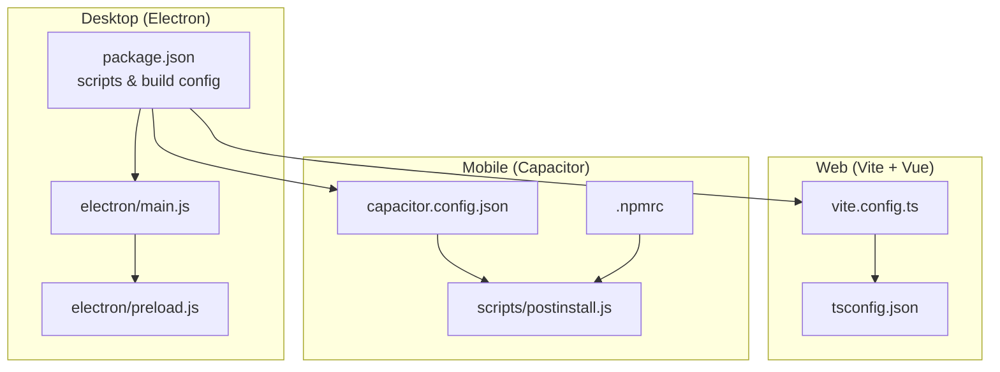
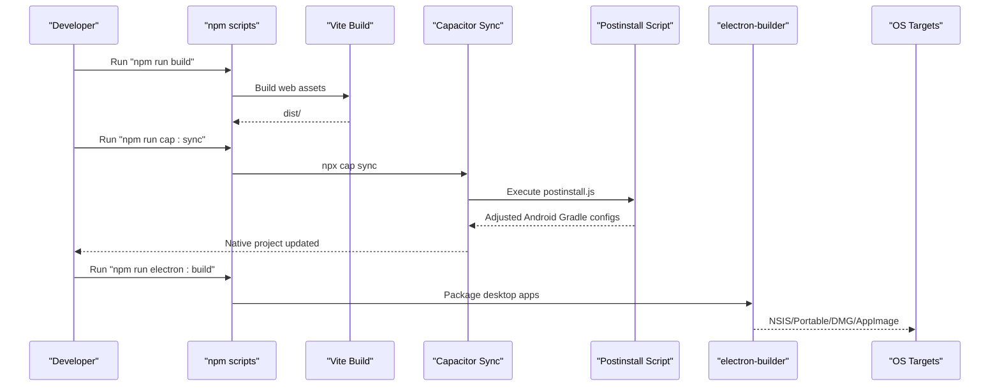
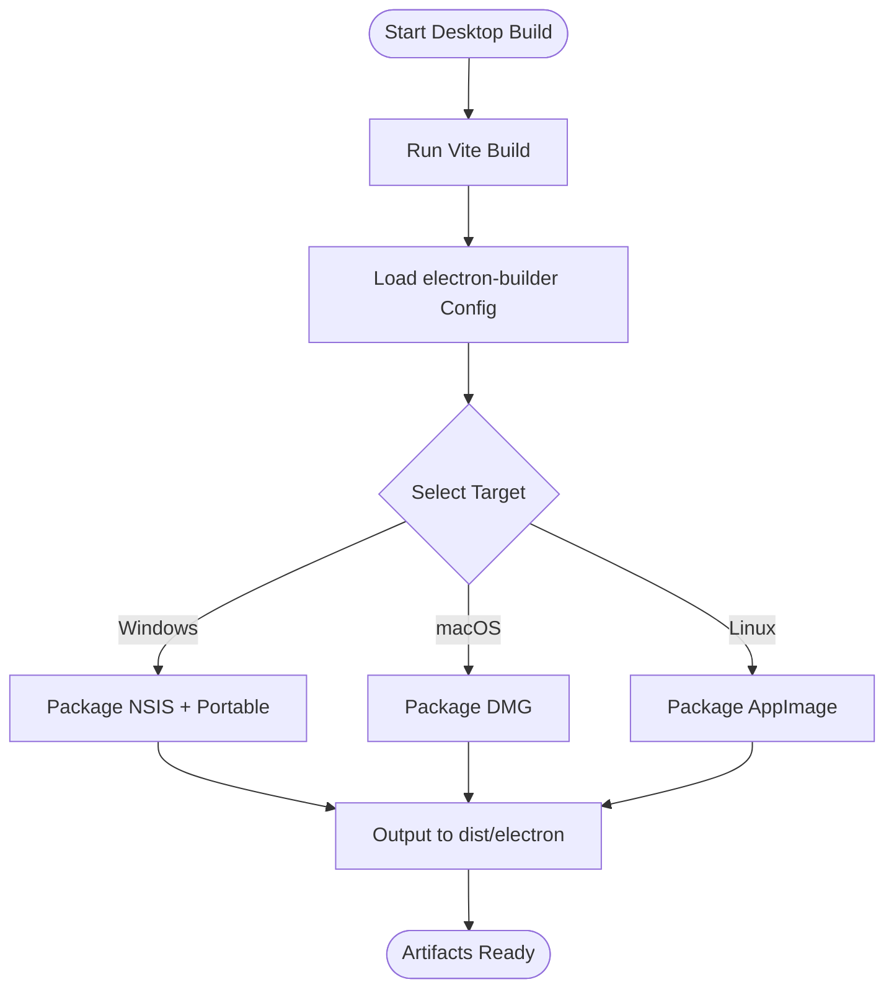
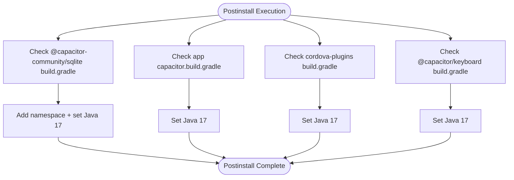
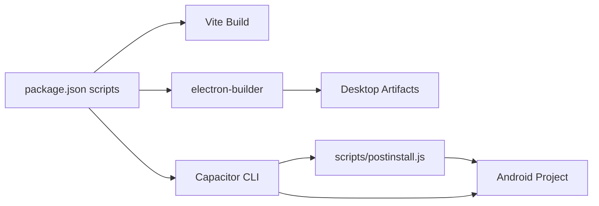

# Build Automation & CI/CD

<cite>
**Referenced Files in This Document**
- [package.json](file://package.json)
- [vite.config.ts](file://vite.config.ts)
- [capacitor.config.json](file://capacitor.config.json)
- [.npmrc](file://.npmrc)
- [scripts/postinstall.js](file://scripts/postinstall.js)
- [electron/main.js](file://electron/main.js)
- [electron/preload.js](file://electron/preload.js)
- [tsconfig.json](file://tsconfig.json)
- [version_marker.txt](file://version_marker.txt)
</cite>

## Table of Contents
1. [Introduction](#introduction)
2. [Project Structure](#project-structure)
3. [Core Components](#core-components)
4. [Architecture Overview](#architecture-overview)
5. [Detailed Component Analysis](#detailed-component-analysis)
6. [Dependency Analysis](#dependency-analysis)
7. [Performance Considerations](#performance-considerations)
8. [Troubleshooting Guide](#troubleshooting-guide)
9. [Conclusion](#conclusion)
10. [Appendices](#appendices)

## Introduction
This document describes the build automation and CI/CD capabilities for the finance application. It covers npm scripts for development, building, and packaging across desktop and mobile targets, post-installation customization for Capacitor Android builds, dependency management, environment-specific configurations, and practical guidance for implementing CI/CD pipelines on GitHub Actions. It also outlines quality gates, code coverage, security scanning, semantic versioning, changelog generation, multi-channel releases, rollback strategies, A/B testing, and production monitoring.

## Project Structure
The project combines a Vite-powered Vue 3 web application with Electron for desktop distribution and Capacitor for mobile web runtime. Build and packaging are orchestrated via npm scripts, with electron-builder used for desktop artifacts and Capacitor commands for mobile.

**Diagram sources**
- [package.json](file://package.json)
- [vite.config.ts](file://vite.config.ts)
- [capacitor.config.json](file://capacitor.config.json)
- [scripts/postinstall.js](file://scripts/postinstall.js)
- [electron/main.js](file://electron/main.js)
- [electron/preload.js](file://electron/preload.js)
- [.npmrc](file://.npmrc)
- [tsconfig.json](file://tsconfig.json)

**Section sources**
- [package.json](file://package.json)
- [vite.config.ts](file://vite.config.ts)
- [capacitor.config.json](file://capacitor.config.json)
- [scripts/postinstall.js](file://scripts/postinstall.js)
- [electron/main.js](file://electron/main.js)
- [electron/preload.js](file://electron/preload.js)
- [.npmrc](file://.npmrc)
- [tsconfig.json](file://tsconfig.json)

## Core Components
- Desktop build and packaging: npm scripts orchestrate Vite build followed by electron-builder to produce Windows (NSIS/portable), macOS (DMG), and Linux (AppImage) artifacts.
- Mobile build and sync: Capacitor CLI commands initialize, add platforms, and synchronize web assets; a postinstall script adjusts Android Gradle configurations for compatibility.
- Development server: Vite dev server runs the Vue application; Electron dev script launches both frontend and Electron main process concurrently.
- Environment-specific behavior: Electron main process loads local dev server in development and bundled HTML in production.

Key npm scripts and roles:
- dev: starts Vite dev server for web development.
- build: produces optimized web assets for distribution.
- preview: serves built assets locally for testing.
- electron:dev: concurrently runs Vite dev and Electron main process for desktop dev.
- electron:build: runs web build then electron-builder to package desktop apps.
- cap:init/cap:add:android/cap:sync/cap:open:android: Capacitor lifecycle commands.
- postinstall: executes scripts/postinstall.js to adjust Android Gradle files.

**Section sources**
- [package.json](file://package.json)
- [electron/main.js](file://electron/main.js)

## Architecture Overview
The build pipeline integrates three primary paths:
- Web: Vite compiles Vue sources with TypeScript support and emits platform-optimized assets.
- Desktop: Electron loads the web bundle or dev server depending on NODE_ENV; electron-builder packages per OS target.
- Mobile: Capacitor synchronizes web assets into native projects and applies Android Gradle adjustments via postinstall.

**Diagram sources**
- [package.json](file://package.json)
- [scripts/postinstall.js](file://scripts/postinstall.js)
- [electron/main.js](file://electron/main.js)

## Detailed Component Analysis

### Desktop Build and Packaging (Electron)
- Build flow:
  - Web assets produced by Vite are packaged by electron-builder according to configuration in package.json under the "build" key.
  - Targets configured: Windows (NSIS and portable), macOS (DMG), Linux (AppImage).
  - Output directory configured under dist/electron.
- Runtime behavior:
  - Electron main process detects NODE_ENV to load either the dev server (development) or the bundled index.html (production).
  - Preload exposes a minimal IPC bridge for communication between main and renderer worlds.

**Diagram sources**
- [package.json](file://package.json)
- [electron/main.js](file://electron/main.js)

**Section sources**
- [package.json](file://package.json)
- [electron/main.js](file://electron/main.js)
- [electron/preload.js](file://electron/preload.js)

### Mobile Build and Postinstall (Capacitor)
- Capacitor configuration:
  - WebDir set to dist; bundledWebRuntime disabled; Android buildOptions specify Java 17 compatibility.
  - Plugins configured for SplashScreen and Keyboard resize behavior.
- Postinstall script responsibilities:
  - Modifies Gradle build files for @capacitor-community/sqlite, @capacitor/keyboard, and related Cordova plugin modules.
  - Ensures Java 17 compatibility by updating sourceCompatibility and targetCompatibility.
  - Adds missing namespace declarations for specific modules when absent.
- NPM configuration:
  - .npmrc enables hoisting and disables strict peer dependencies to reduce resolution conflicts during Capacitor builds.

**Diagram sources**
- [scripts/postinstall.js](file://scripts/postinstall.js)
- [capacitor.config.json](file://capacitor.config.json)
- [.npmrc](file://.npmrc)

**Section sources**
- [scripts/postinstall.js](file://scripts/postinstall.js)
- [capacitor.config.json](file://capacitor.config.json)
- [.npmrc](file://.npmrc)

### Web Build and Environment Configuration
- Vite configuration:
  - Uses @vitejs/plugin-vue with base set to relative path for asset correctness.
  - Build target set to ES2015 for broad browser compatibility.
- TypeScript configuration:
  - Compiler options tuned for strictness and bundler mode.
  - Includes Vue, TSX, and TS sources under src; references node tsconfig.

**Section sources**
- [vite.config.ts](file://vite.config.ts)
- [tsconfig.json](file://tsconfig.json)

### Versioning and Release Artifacts
- Version marker:
  - version_marker.txt provides a human-readable snapshot of the project state and baseline version metadata.
- Suggested semantic versioning workflow:
  - Tag releases on Git with semantic version tags (e.g., v1.2.3).
  - electron-builder reads version from package.json; update package.json version prior to release builds.
  - Maintain a changelog (e.g., CHANGELOG.md) and update it alongside version bumps.

**Section sources**
- [version_marker.txt](file://version_marker.txt)
- [package.json](file://package.json)

## Dependency Analysis
- Internal dependencies:
  - Electron main process depends on Vite-built assets and preload bridge.
  - Capacitor relies on synchronized web assets and postinstall-adjusted Gradle files.
- External dependencies:
  - electron-builder handles OS-specific packaging.
  - Capacitor Android requires Java 17 compatibility as enforced by postinstall and Capacitor config.
- Coupling and cohesion:
  - Scripts are cohesive around their domain (desktop vs. mobile) and loosely coupled via shared web assets.
  - Postinstall centralizes Android Gradle adjustments to minimize drift across environments.

**Diagram sources**
- [package.json](file://package.json)
- [scripts/postinstall.js](file://scripts/postinstall.js)

**Section sources**
- [package.json](file://package.json)
- [scripts/postinstall.js](file://scripts/postinstall.js)

## Performance Considerations
- Build performance:
  - Keep Vite target at ES2015 to balance compatibility and bundle size.
  - Use concurrent development tasks (as in electron:dev) to reduce iteration cycles.
- Packaging performance:
  - Limit electron-builder included files to necessary assets to reduce artifact size.
  - Prefer portable Windows builds for quick distribution when appropriate.
- Mobile build performance:
  - Ensure Java 17 Gradle compatibility avoids repeated rebuild failures.
  - Minimize Capacitor plugin count to reduce sync overhead.

## Troubleshooting Guide
Common issues and resolutions:
- Android build fails due to Java version mismatch:
  - Verify Capacitor Android buildOptions and postinstall adjustments align with Java 17.
- Capacitor sync errors after dependency updates:
  - Re-run npx cap sync and confirm postinstall executed.
- Electron dev server not loading in development:
  - Confirm NODE_ENV is set appropriately; Electron main process expects http://localhost:5173 during development.
- Missing namespace in Gradle modules:
  - Postinstall adds namespace declarations; re-run postinstall if missing.

**Section sources**
- [scripts/postinstall.js](file://scripts/postinstall.js)
- [capacitor.config.json](file://capacitor.config.json)
- [electron/main.js](file://electron/main.js)

## Conclusion
The project’s build automation centers on Vite for web assets, electron-builder for desktop packaging, and Capacitor for mobile with targeted Gradle adjustments via a postinstall script. The npm scripts provide a streamlined developer experience for local development and cross-platform packaging. Extending this foundation with CI/CD involves automating tests, builds, and releases across platforms while enforcing quality gates and security checks.

## Appendices

### CI/CD Pipeline Guidance (GitHub Actions)
Note: The following outlines recommended workflows and does not prescribe specific YAML content. Adapt to your repository needs.

- Quality gates:
  - Enforce linting and type-checking on pull requests.
  - Gate merges until tests pass and code coverage meets thresholds.
- Automated testing:
  - Run unit and component tests on multiple OS runners.
  - For Electron, use headless browsers or virtual displays for renderer tests; isolate main process tests.
  - For Capacitor, run platform-specific tests on emulators/simulators where applicable.
- Build verification:
  - Build web assets with Vite.
  - Build desktop artifacts with electron-builder for Windows/macOS/Linux.
  - Sync and build Android/iOS with Capacitor; apply postinstall adjustments in CI.
- Release automation:
  - On version tags, publish artifacts to release pages or package registries.
  - Use semantic versioning and maintain a changelog updated per commit.
- Multi-channel deployments:
  - Use separate workflows for alpha/beta/release channels.
  - Store channel-specific secrets and artifact destinations.
- Rollback strategies:
  - Maintain signed artifacts and versioned releases.
  - Provide a simple script to redeploy previous known-good version.
- A/B testing:
  - Use feature flags or environment variables to toggle experimental features.
  - Track metrics and telemetry to compare variants.
- Monitoring and observability:
  - Integrate crash reporting and analytics in production builds.
  - Collect logs and performance metrics from desktop and mobile clients.

### Practical Implementation Notes
- Use matrix builds to test multiple Node and OS versions.
- Cache dependencies (pnpm/npm) and Vite/Capacitor build outputs to speed up pipelines.
- Store secrets for code signing (Windows/macOS) and notarization (macOS) securely.
- Automate security scanning (SAST/DAST) and dependency vulnerability checks.