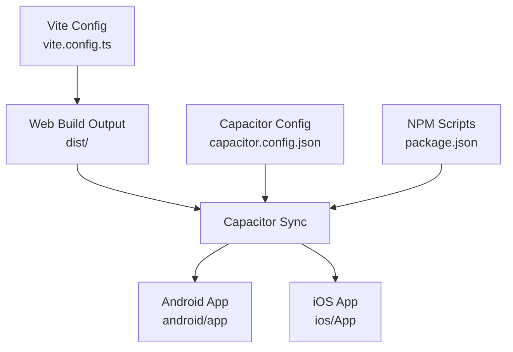
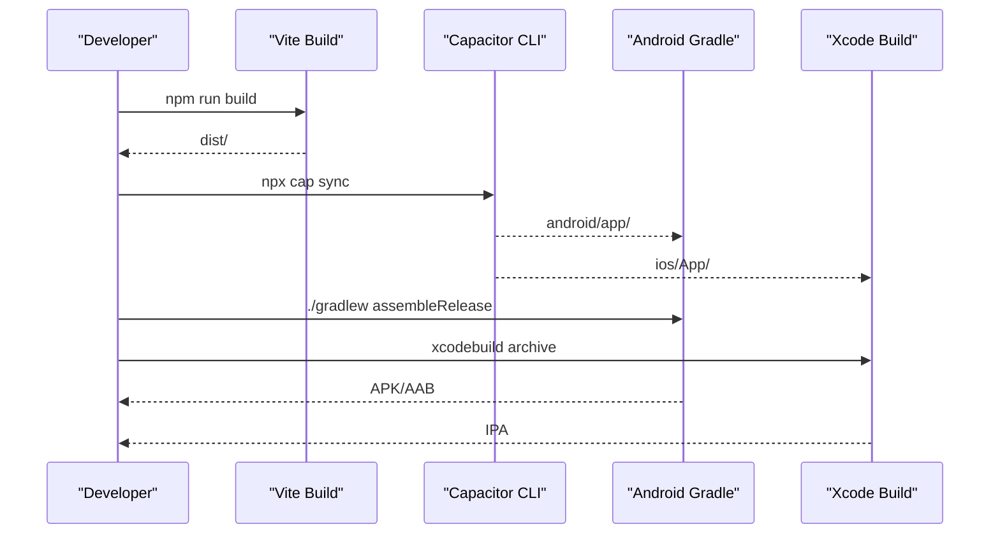
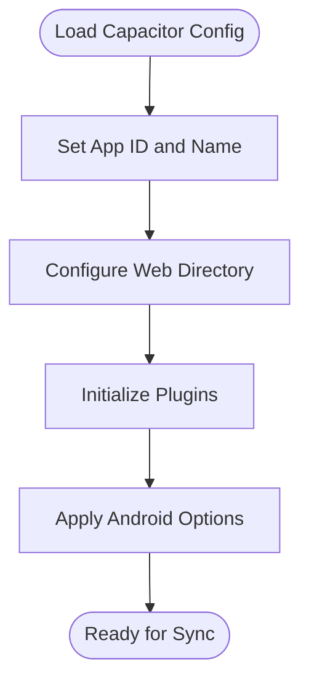
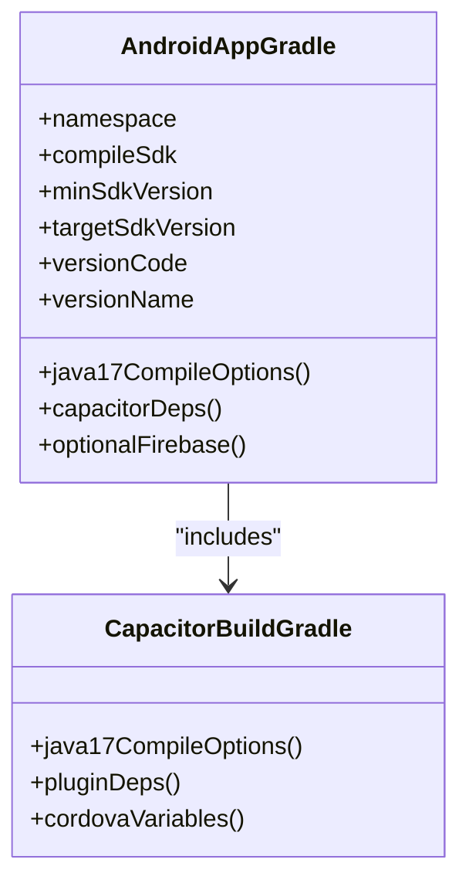
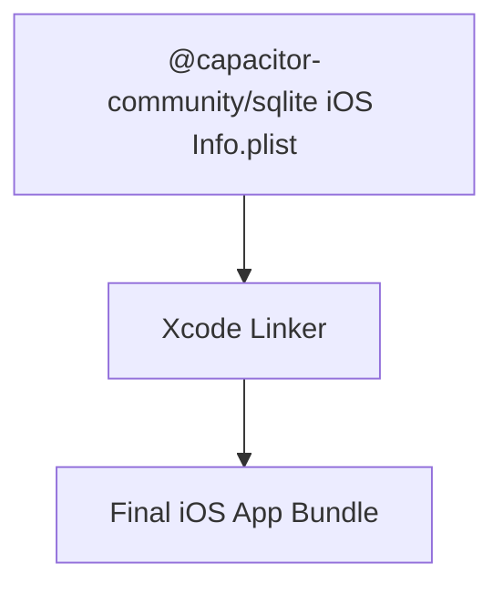
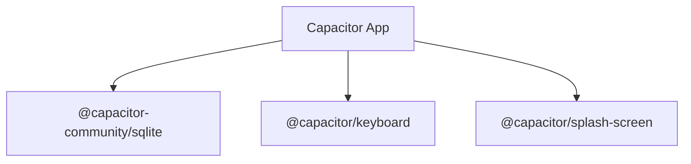
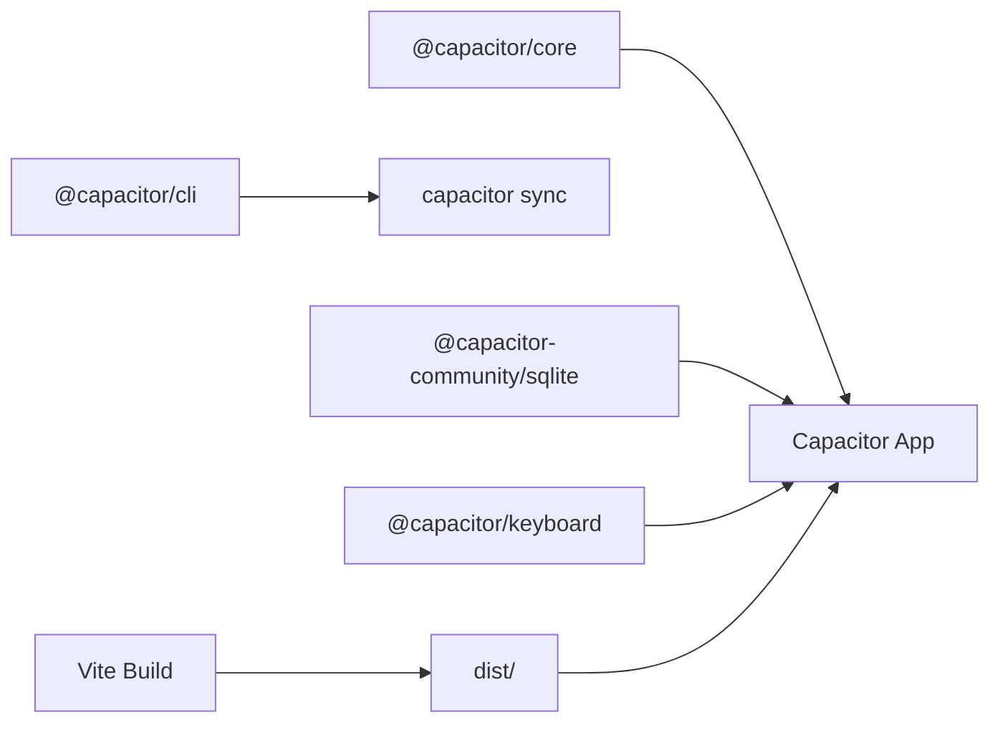

# Capacitor Mobile Application

<cite>
**Referenced Files in This Document**
- [capacitor.config.json](file://capacitor.config.json)
- [package.json](file://package.json)
- [vite.config.ts](file://vite.config.ts)
- [android/app/build.gradle](file://android/app/build.gradle)
- [android/app/capacitor.build.gradle](file://android/app/capacitor.build.gradle)
- [@capacitor-community/sqlite iOS Info.plist](file://node_modules/@capacitor-community/sqlite/ios\Plugin\Info.plist)
</cite>

## Table of Contents
1. [Introduction](#introduction)
2. [Project Structure](#project-structure)
3. [Core Components](#core-components)
4. [Architecture Overview](#architecture-overview)
5. [Detailed Component Analysis](#detailed-component-analysis)
6. [Dependency Analysis](#dependency-analysis)
7. [Performance Considerations](#performance-considerations)
8. [Troubleshooting Guide](#troubleshooting-guide)
9. [Conclusion](#conclusion)
10. [Appendices](#appendices)

## Introduction
This document provides comprehensive guidance for deploying the finance application as a Capacitor mobile app on Android and iOS. It covers Capacitor configuration, native plugin integration, build processes, native API access, web view configuration, deep linking, platform-specific troubleshooting, performance optimization, and app store submission guidelines.

## Project Structure
The project uses Vite for building the web assets and Capacitor to wrap them into native Android and iOS applications. The Capacitor configuration defines the app identity, web assets location, and plugin settings. Android Gradle configuration controls SDK versions, Java compatibility, and dependencies. iOS support is configured via Capacitor and plugin-specific settings.

**Diagram sources**
- [capacitor.config.json:1-22](file://capacitor.config.json#L1-L22)
- [package.json:7-17](file://package.json#L7-L17)
- [vite.config.ts:1-11](file://vite.config.ts#L1-L11)

**Section sources**
- [capacitor.config.json:1-22](file://capacitor.config.json#L1-L22)
- [package.json:7-17](file://package.json#L7-L17)
- [vite.config.ts:1-11](file://vite.config.ts#L1-L11)

## Core Components
- Capacitor configuration defines:
  - App ID and name for both Android and iOS
  - Web directory for built assets
  - Plugin settings for Splash Screen and Keyboard
  - Android-specific options including Java compatibility and mixed content allowance
- NPM scripts orchestrate Capacitor lifecycle:
  - Initialization, adding platforms, syncing, and opening platforms
- Vite configuration sets base path and build target for web assets

Key configuration highlights:
- App identity and web directory are centralized in the Capacitor config
- Plugins are declared under the Capacitor config and resolved during sync
- Android build options specify Java 17 compatibility

**Section sources**
- [capacitor.config.json:1-22](file://capacitor.config.json#L1-L22)
- [package.json:7-17](file://package.json#L7-L17)
- [vite.config.ts:7-10](file://vite.config.ts#L7-L10)

## Architecture Overview
The mobile deployment pipeline integrates web assets with native platforms through Capacitor. The web app is built by Vite, synced into Capacitor, and compiled per platform-specific Gradle and Xcode configurations.

**Diagram sources**
- [package.json:9](file://package.json#L9)
- [package.json:15](file://package.json#L15)
- [capacitor.config.json:4](file://capacitor.config.json#L4)

## Detailed Component Analysis

### Capacitor Configuration
- App identity:
  - App ID and name are defined centrally
  - Android package name mirrors the App ID
- Web directory:
  - Built assets are served from the configured web directory
- Plugins:
  - Splash Screen launch duration disabled
  - Keyboard resize behavior set to none
- Android options:
  - Mixed content allowed
  - Java 17 compatibility for source and target

**Diagram sources**
- [capacitor.config.json:2-21](file://capacitor.config.json#L2-L21)

**Section sources**
- [capacitor.config.json:1-22](file://capacitor.config.json#L1-L22)

### Android Build Configuration
- SDK and toolchain:
  - Compile, target, and minimum SDK versions defined via project-wide constants
  - Java 17 compatibility enforced in both default and generated Gradle files
- Dependencies:
  - Capacitor Android runtime and Cordova plugin bridge
  - Splash Screen and Keyboard plugins included via project dependencies
- Optional Firebase:
  - Google Services plugin applied conditionally if configuration file exists

**Diagram sources**
- [android/app/build.gradle:3-47](file://android/app/build.gradle#L3-L47)
- [android/app/capacitor.build.gradle:3-20](file://android/app/capacitor.build.gradle#L3-L20)

**Section sources**
- [android/app/build.gradle:1-59](file://android/app/build.gradle#L1-L59)
- [android/app/capacitor.build.gradle:1-21](file://android/app/capacitor.build.gradle#L1-L21)

### iOS Plugin Configuration
- SQLite plugin Info.plist:
  - Defines bundle metadata for the iOS plugin
  - Provides identifiers and versions used by Xcode build

**Diagram sources**
- [@capacitor-community/sqlite iOS Info.plist:1-25](file://node_modules/@capacitor-community/sqlite/ios\Plugin\Info.plist#L1-L25)

**Section sources**
- [@capacitor-community/sqlite iOS Info.plist:1-25](file://node_modules/@capacitor-community/sqlite/ios\Plugin\Info.plist#L1-L25)

### Native Plugin Integration
- SQLite:
  - Community SQLite plugin integrated via Capacitor
  - Android and iOS plugin artifacts managed by Capacitor
- Keyboard:
  - Capacitor Keyboard plugin enabled with resize behavior set to none
- Splash Screen:
  - Capacitor SplashScreen plugin configured with zero launch duration

**Diagram sources**
- [capacitor.config.json:6-13](file://capacitor.config.json#L6-L13)
- [android/app/capacitor.build.gradle:11-14](file://android/app/capacitor.build.gradle#L11-L14)

**Section sources**
- [capacitor.config.json:6-13](file://capacitor.config.json#L6-L13)
- [android/app/capacitor.build.gradle:11-14](file://android/app/capacitor.build.gradle#L11-L14)

### Cordova Plugin Compatibility
- Cordova plugin bridge:
  - Android includes the Capacitor Cordova plugin bridge module
  - Enables compatibility with Cordova plugins during Capacitor sync
- Conditional application:
  - Google Services plugin applied only if configuration file is present

**Section sources**
- [android/app/build.gradle:46](file://android/app/build.gradle#L46)
- [android/app/build.gradle:51-58](file://android/app/build.gradle#L51-L58)

### Web View Configuration
- Base path:
  - Vite base path set to relative to ensure correct asset resolution in the Capacitor web view
- Target:
  - ES2015 target ensures modern JavaScript compatibility in the web view

**Section sources**
- [vite.config.ts:7-10](file://vite.config.ts#L7-L10)

### Deep Linking Setup
- Custom URL schemes:
  - Configure scheme and host in the Capacitor config for universal links and custom schemes
- Intent filters (Android):
  - Define intent filters in Android manifest for incoming links
- Associated domains (iOS):
  - Configure associated domains entitlements for universal links

[No sources needed since this section provides general guidance]

### Native API Access and Permissions
- Camera permissions:
  - Request camera permission at runtime and handle denials gracefully
- File system operations:
  - Use Capacitor community SQLite for local storage and structured data
- Device capabilities:
  - Expose only necessary permissions and provide fallbacks for unavailable features

[No sources needed since this section provides general guidance]

### Build Process: Android APK/AAB
- Prerequisites:
  - Keystore configured for release signing
  - ProGuard/R8 rules if enabling code shrinking
- Steps:
  - Build web assets with Vite
  - Run Capacitor sync
  - Build APK or AAB using Gradle tasks
- Signing:
  - Configure signingConfigs in Gradle for release builds

**Section sources**
- [package.json:9](file://package.json#L9)
- [package.json:15](file://package.json#L15)
- [android/app/build.gradle:19-28](file://android/app/build.gradle#L19-L28)

### Build Process: iOS IPA
- Prerequisites:
  - Provisioning profile and signing certificate installed
  - Xcode project configured with correct bundle identifier
- Steps:
  - Build web assets with Vite
  - Run Capacitor sync
  - Archive in Xcode and export IPA

**Section sources**
- [package.json:9](file://package.json#L9)
- [package.json:15](file://package.json#L15)

## Dependency Analysis
Capacitor dependencies and their roles:
- Core runtime and CLI enable Capacitor functionality
- Community SQLite plugin provides local database capabilities
- Keyboard plugin manages on-screen keyboard behavior
- Vite builds the web assets consumed by Capacitor

**Diagram sources**
- [package.json:19-36](file://package.json#L19-L36)
- [capacitor.config.json:4](file://capacitor.config.json#L4)

**Section sources**
- [package.json:19-36](file://package.json#L19-L36)
- [capacitor.config.json:4](file://capacitor.config.json#L4)

## Performance Considerations
- Optimize web assets:
  - Enable code splitting and tree shaking in Vite
  - Minimize third-party dependencies
- Capacitor runtime:
  - Disable unused plugins to reduce bundle size
  - Keep Capacitor and plugin versions up to date
- Platform-specific:
  - Android: avoid mixed content if possible; use HTTPS
  - iOS: leverage background fetch and efficient memory usage

[No sources needed since this section provides general guidance]

## Troubleshooting Guide
- Capacitor sync failures:
  - Ensure web directory exists and is built before sync
  - Verify plugin configurations in the Capacitor config
- Android build errors:
  - Confirm Java 17 compatibility and SDK versions
  - Check for missing Google Services configuration if push notifications are not required
- iOS build issues:
  - Validate provisioning profile and signing certificate
  - Ensure bundle identifier matches the Capacitor config

**Section sources**
- [capacitor.config.json:4](file://capacitor.config.json#L4)
- [android/app/build.gradle:25-28](file://android/app/build.gradle#L25-L28)
- [android/app/build.gradle:51-58](file://android/app/build.gradle#L51-L58)

## Conclusion
This guide outlined the Capacitor mobile deployment strategy for Android and iOS, covering configuration, plugin integration, build processes, and platform-specific considerations. By aligning the Capacitor config, Vite build, and platform Gradle/Xcode settings, you can reliably produce production-ready APK/AAB and IPA packages while maintaining a clean separation between web and native concerns.

## Appendices
- App Store Submission Guidelines:
  - Google Play Store:
    - Provide privacy policy URL, developer contact, and screenshots
    - Ensure compliance with data collection and permissions policies
  - Apple App Store:
    - Complete App Store Connect metadata
    - Comply with App Store Review Guidelines and privacy declarations

[No sources needed since this section provides general guidance]