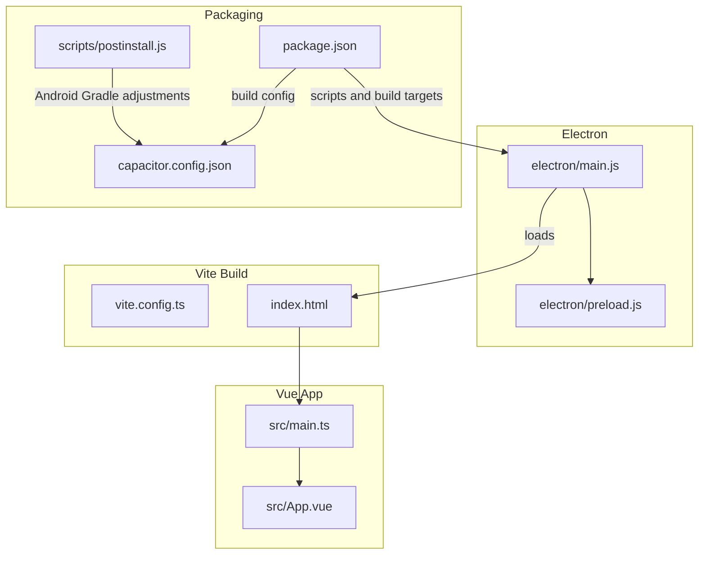
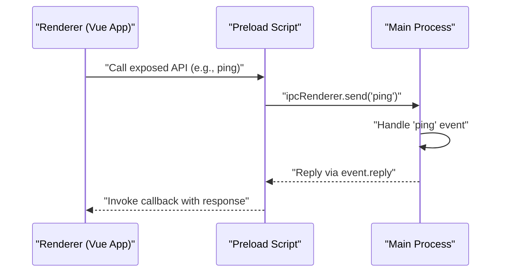
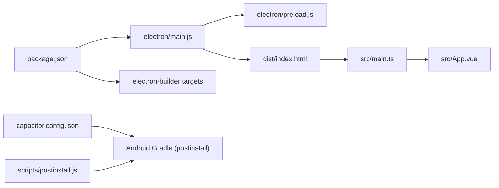

# Electron Desktop Application

<cite>
**Referenced Files in This Document**
- [electron/main.js](file://electron/main.js)
- [electron/preload.js](file://electron/preload.js)
- [package.json](file://package.json)
- [vite.config.ts](file://vite.config.ts)
- [scripts/postinstall.js](file://scripts/postinstall.js)
- [index.html](file://index.html)
- [src/main.ts](file://src/main.ts)
- [src/App.vue](file://src/App.vue)
- [capacitor.config.json](file://capacitor.config.json)
- [tsconfig.json](file://tsconfig.json)
- [tsconfig.node.json](file://tsconfig.node.json)
</cite>

## Table of Contents
1. [Introduction](#introduction)
2. [Project Structure](#project-structure)
3. [Core Components](#core-components)
4. [Architecture Overview](#architecture-overview)
5. [Detailed Component Analysis](#detailed-component-analysis)
6. [Dependency Analysis](#dependency-analysis)
7. [Performance Considerations](#performance-considerations)
8. [Troubleshooting Guide](#troubleshooting-guide)
9. [Conclusion](#conclusion)
10. [Appendices](#appendices)

## Introduction
This document explains how the Electron desktop application is configured and deployed. It covers the main process window creation and lifecycle, IPC communication setup, preload security model, development versus production builds, platform packaging targets, and distribution strategies. It also highlights security considerations, sandboxing options, and performance optimization techniques for desktop deployment.

## Project Structure
The project combines a Vite-built web application with an Electron main process and a preload script. The Electron main process creates the BrowserWindow, loads either a local development server or a packaged HTML file, and exposes IPC handlers. The preload script safely exposes a minimal API surface to the renderer via contextBridge. Capacitor configuration supports cross-platform runtime features and Android build adjustments handled by a postinstall script.

**Diagram sources**
- [electron/main.js:1-70](file://electron/main.js#L1-L70)
- [electron/preload.js:1-7](file://electron/preload.js#L1-L7)
- [vite.config.ts:1-11](file://vite.config.ts#L1-L11)
- [index.html:1-13](file://index.html#L1-L13)
- [src/main.ts:1-16](file://src/main.ts#L1-L16)
- [src/App.vue:1-195](file://src/App.vue#L1-L195)
- [package.json:1-72](file://package.json#L1-L72)
- [capacitor.config.json:1-22](file://capacitor.config.json#L1-L22)
- [scripts/postinstall.js:1-145](file://scripts/postinstall.js#L1-L145)

**Section sources**
- [package.json:1-72](file://package.json#L1-L72)
- [vite.config.ts:1-11](file://vite.config.ts#L1-L11)
- [index.html:1-13](file://index.html#L1-L13)
- [src/main.ts:1-16](file://src/main.ts#L1-L16)
- [src/App.vue:1-195](file://src/App.vue#L1-L195)
- [capacitor.config.json:1-22](file://capacitor.config.json#L1-L22)
- [scripts/postinstall.js:1-145](file://scripts/postinstall.js#L1-L145)

## Core Components
- Electron main process: Creates the BrowserWindow, sets webPreferences, handles lifecycle events, and registers IPC handlers.
- Preload script: Exposes a controlled API surface to the renderer using contextBridge and ipcRenderer.
- Vite build: Produces a static site consumed by the Electron app in production.
- Packaging configuration: Defines app identifiers, product name, output directories, and platform-specific targets.

Key implementation references:
- Main process window creation and lifecycle: [electron/main.js:19-61](file://electron/main.js#L19-L61)
- IPC handler registration: [electron/main.js:67-69](file://electron/main.js#L67-L69)
- Preload exposure: [electron/preload.js:3-6](file://electron/preload.js#L3-L6)
- Vite build configuration: [vite.config.ts:5-11](file://vite.config.ts#L5-L11)
- Electron packaging targets: [package.json:48-70](file://package.json#L48-L70)

**Section sources**
- [electron/main.js:19-61](file://electron/main.js#L19-L61)
- [electron/main.js:67-69](file://electron/main.js#L67-L69)
- [electron/preload.js:3-6](file://electron/preload.js#L3-L6)
- [vite.config.ts:5-11](file://vite.config.ts#L5-L11)
- [package.json:48-70](file://package.json#L48-L70)

## Architecture Overview
The Electron app runs a single BrowserWindow that loads either a local development server during development or a packaged HTML file in production. The renderer communicates with the main process through IPC channels exposed by the preload script.

**Diagram sources**
- [electron/preload.js:3-6](file://electron/preload.js#L3-L6)
- [electron/main.js:67-69](file://electron/main.js#L67-L69)

**Section sources**
- [electron/preload.js:3-6](file://electron/preload.js#L3-L6)
- [electron/main.js:67-69](file://electron/main.js#L67-L69)

## Detailed Component Analysis

### Main Process: Window Creation and Lifecycle
- Creates a BrowserWindow with fixed dimensions and webPreferences pointing to the preload script.
- Enables Node.js integration and disables context isolation in webPreferences.
- Loads a development URL when NODE_ENV equals development; otherwise loads a packaged HTML file.
- Handles activate and window-all-closed events according to platform conventions.

Security and lifecycle references:
- Window creation and webPreferences: [electron/main.js:19-28](file://electron/main.js#L19-L28)
- Development vs production load: [electron/main.js:30-39](file://electron/main.js#L30-L39)
- App lifecycle: [electron/main.js:48-61](file://electron/main.js#L48-L61)

**Section sources**
- [electron/main.js:19-28](file://electron/main.js#L19-L28)
- [electron/main.js:30-39](file://electron/main.js#L30-L39)
- [electron/main.js:48-61](file://electron/main.js#L48-L61)

### IPC Communication Setup
- Registers an IPC listener for a "ping" channel and replies to the renderer.
- Renderer triggers the IPC via the preload-exposed API.

References:
- IPC listener: [electron/main.js:67-69](file://electron/main.js#L67-L69)
- Renderer-side invocation: [electron/preload.js:4](file://electron/preload.js#L4)

**Section sources**
- [electron/main.js:67-69](file://electron/main.js#L67-L69)
- [electron/preload.js:4](file://electron/preload.js#L4)

### Preload Security Model and Exposed API
- Uses contextBridge to expose a minimal API surface to the renderer.
- Provides a typed ping method and an event listener registration helper.
- The preload script itself is small and focused, reducing attack surface.

References:
- Exposed API definition: [electron/preload.js:3-6](file://electron/preload.js#L3-L6)

**Section sources**
- [electron/preload.js:3-6](file://electron/preload.js#L3-L6)

### Development vs Production Builds
- Development: Loads a local Vite dev server URL and opens DevTools automatically.
- Production: Loads a packaged HTML file from the dist directory after building with Vite.

References:
- Dev/prod loading logic: [electron/main.js:30-39](file://electron/main.js#L30-L39)
- Vite base path and target: [vite.config.ts:7-10](file://vite.config.ts#L7-L10)
- Index entry for dev: [index.html:11](file://index.html#L11)

**Section sources**
- [electron/main.js:30-39](file://electron/main.js#L30-L39)
- [vite.config.ts:7-10](file://vite.config.ts#L7-L10)
- [index.html:11](file://index.html#L11)

### Platform-Specific Packaging Targets
- Windows: NSIS installer and portable ZIP.
- macOS: DMG image.
- Linux: AppImage.

References:
- Packaging targets: [package.json:58-69](file://package.json#L58-L69)

**Section sources**
- [package.json:58-69](file://package.json#L58-L69)

### Capacitor and Android Build Adjustments
- Capacitor configuration defines the web directory and plugin settings.
- Postinstall script adjusts Android Gradle build files to use Java 17 and set namespaces for specific modules.

References:
- Capacitor config: [capacitor.config.json:1-22](file://capacitor.config.json#L1-L22)
- Postinstall Gradle edits: [scripts/postinstall.js:40-142](file://scripts/postinstall.js#L40-L142)

**Section sources**
- [capacitor.config.json:1-22](file://capacitor.config.json#L1-L22)
- [scripts/postinstall.js:40-142](file://scripts/postinstall.js#L40-L142)

### Vue Application Integration
- The renderer app initializes Pinia and ElementPlus, mounts to the DOM, and integrates with Capacitor runtime checks.
- The Electron main process loads the built web app produced by Vite.

References:
- Renderer bootstrap: [src/main.ts:13-16](file://src/main.ts#L13-L16)
- App composition: [src/App.vue:64-117](file://src/App.vue#L64-L117)

**Section sources**
- [src/main.ts:13-16](file://src/main.ts#L13-L16)
- [src/App.vue:64-117](file://src/App.vue#L64-L117)

## Dependency Analysis
The Electron main process depends on the preload script for secure renderer access and on Vite’s built output for production delivery. Packaging metadata in package.json governs distribution targets. Capacitor configuration and the postinstall script coordinate Android build compatibility.

**Diagram sources**
- [electron/main.js:19-61](file://electron/main.js#L19-L61)
- [electron/preload.js:3-6](file://electron/preload.js#L3-L6)
- [package.json:48-70](file://package.json#L48-L70)
- [capacitor.config.json:1-22](file://capacitor.config.json#L1-L22)
- [scripts/postinstall.js:1-145](file://scripts/postinstall.js#L1-L145)
- [src/main.ts:13-16](file://src/main.ts#L13-L16)
- [src/App.vue:64-117](file://src/App.vue#L64-L117)

**Section sources**
- [electron/main.js:19-61](file://electron/main.js#L19-L61)
- [electron/preload.js:3-6](file://electron/preload.js#L3-L6)
- [package.json:48-70](file://package.json#L48-L70)
- [capacitor.config.json:1-22](file://capacitor.config.json#L1-L22)
- [scripts/postinstall.js:1-145](file://scripts/postinstall.js#L1-L145)
- [src/main.ts:13-16](file://src/main.ts#L13-L16)
- [src/App.vue:64-117](file://src/App.vue#L64-L117)

## Performance Considerations
- Keep preload logic minimal to reduce renderer initialization overhead.
- Disable DevTools in production to avoid unnecessary overhead.
- Use production builds and enable minification via Vite configuration.
- Avoid heavy synchronous operations in the main process; delegate to workers if needed.
- Prefer lazy-loading non-critical features in the renderer to improve startup time.

[No sources needed since this section provides general guidance]

## Troubleshooting Guide
- Renderer cannot communicate with main process:
  - Verify preload exposes the expected API and that the BrowserWindow webPreferences preload path is correct.
  - Confirm the IPC channel name matches between preload and main.
  - References: [electron/preload.js:3-6](file://electron/preload.js#L3-L6), [electron/main.js:67-69](file://electron/main.js#L67-L69)
- App does not load in production:
  - Ensure Vite built output exists and the main process loads the correct packaged HTML path.
  - References: [electron/main.js:36-39](file://electron/main.js#L36-L39), [vite.config.ts:7-10](file://vite.config.ts#L7-L10)
- Android build failures:
  - Confirm postinstall script modified Gradle files and Java compatibility settings.
  - References: [scripts/postinstall.js:40-142](file://scripts/postinstall.js#L40-L142), [capacitor.config.json:17-20](file://capacitor.config.json#L17-L20)

**Section sources**
- [electron/preload.js:3-6](file://electron/preload.js#L3-L6)
- [electron/main.js:67-69](file://electron/main.js#L67-L69)
- [electron/main.js:36-39](file://electron/main.js#L36-L39)
- [vite.config.ts:7-10](file://vite.config.ts#L7-L10)
- [scripts/postinstall.js:40-142](file://scripts/postinstall.js#L40-L142)
- [capacitor.config.json:17-20](file://capacitor.config.json#L17-L20)

## Conclusion
The Electron application uses a straightforward main process with a minimal preload bridge to expose IPC capabilities. The Vite build pipeline produces a static site loaded by the main process in production, while development leverages a local dev server. Packaging targets are defined per platform, and Capacitor-related Android builds are adjusted by a postinstall script. Security-wise, the current configuration enables Node.js integration and disables context isolation, which introduces risk—recommendations for hardening are provided below.

[No sources needed since this section summarizes without analyzing specific files]

## Appendices

### Security Best Practices and Sandboxing Recommendations
- Disable Node.js integration and enable context isolation in webPreferences to isolate the renderer from Node APIs.
- Remove or minimize preload exposure; only expose strictly necessary channels.
- Validate and sanitize all IPC payloads on the main process side.
- Use CSP headers and disable eval-based code execution in the renderer.
- Sign and notarize distributables on macOS and sign installers on Windows.
- Consider enabling sandbox mode for the BrowserWindow to further restrict renderer privileges.

[No sources needed since this section provides general guidance]

### Auto-Updater Integration and Distribution Strategies
- The current repository does not include an auto-updater implementation. To integrate updates:
  - Use Electron’s autoUpdater or electron-updater for delta or full releases.
  - Host update feeds on a CDN or HTTPS endpoint.
  - Implement signed release artifacts and maintain version manifests.
  - For enterprise distribution, consider internal update servers and staged rollouts.

[No sources needed since this section provides general guidance]

### TypeScript and Build Configuration Notes
- TypeScript compiler options emphasize strictness and bundler-mode resolution.
- Vite configuration sets a modern target and local base path for assets.

References:
- TypeScript options: [tsconfig.json:2-22](file://tsconfig.json#L2-L22)
- Node-specific TS config: [tsconfig.node.json:1-10](file://tsconfig.node.json#L1-L10)
- Vite base and target: [vite.config.ts:7-10](file://vite.config.ts#L7-L10)

**Section sources**
- [tsconfig.json:2-22](file://tsconfig.json#L2-L22)
- [tsconfig.node.json:1-10](file://tsconfig.node.json#L1-L10)
- [vite.config.ts:7-10](file://vite.config.ts#L7-L10)