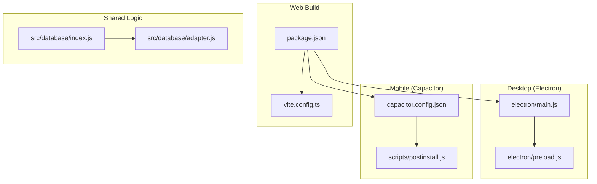
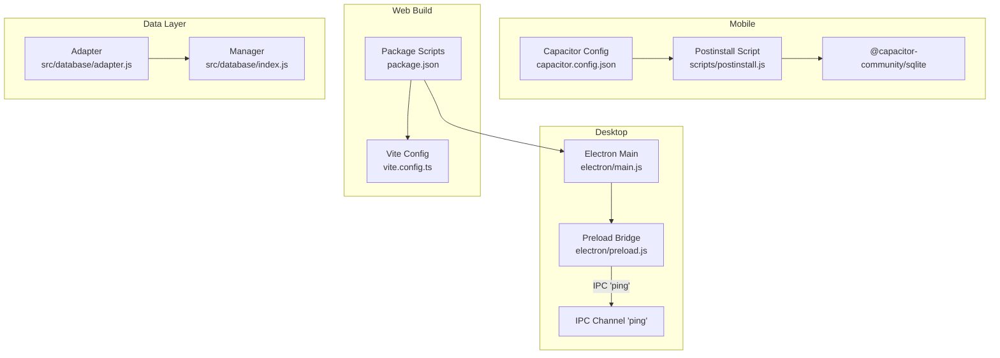
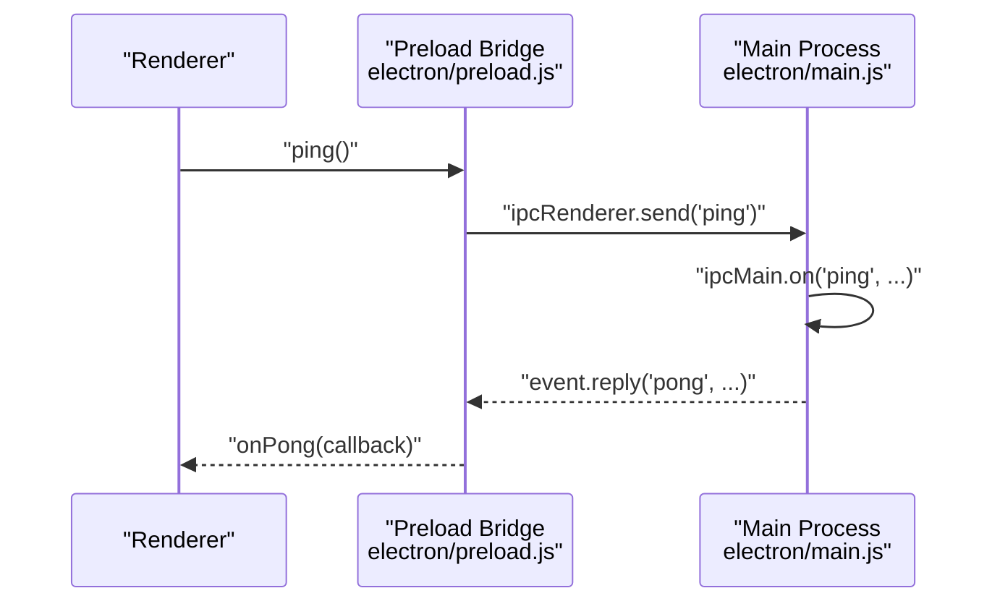
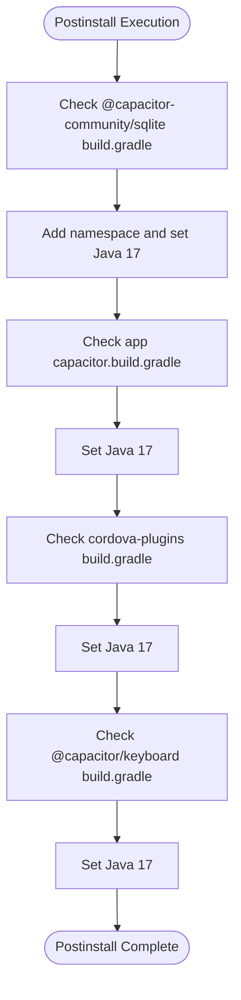
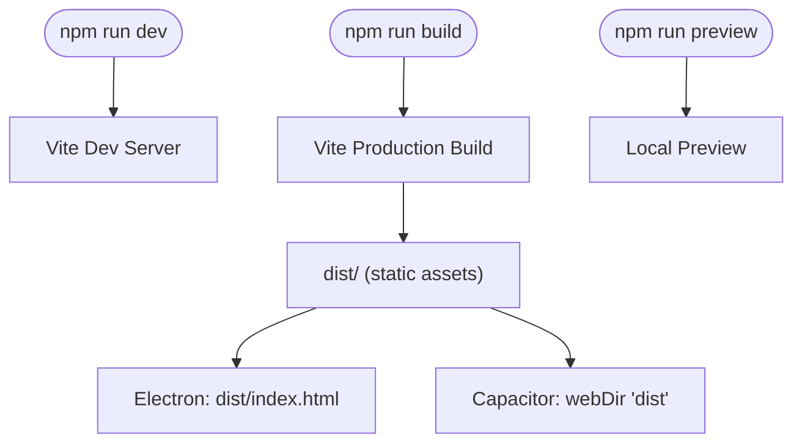
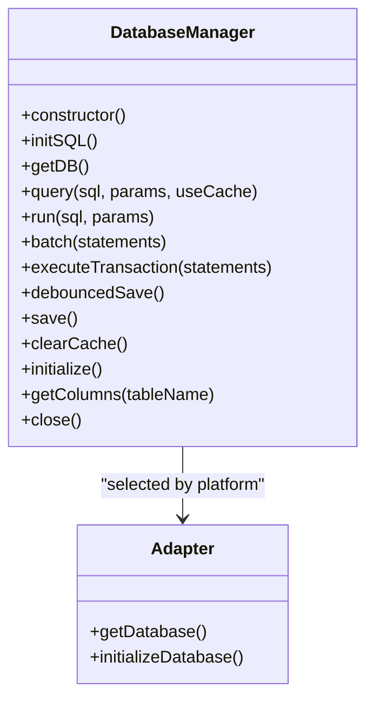
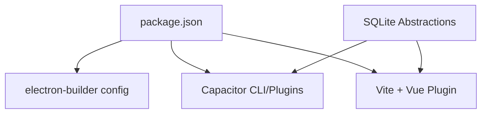

# Platform Deployment

<cite>
**Referenced Files in This Document**
- [package.json](file://package.json)
- [vite.config.ts](file://vite.config.ts)
- [capacitor.config.json](file://capacitor.config.json)
- [electron/main.js](file://electron/main.js)
- [electron/preload.js](file://electron/preload.js)
- [scripts/postinstall.js](file://scripts/postinstall.js)
- [src/database/adapter.js](file://src/database/adapter.js)
- [src/database/index.js](file://src/database/index.js)
</cite>

## Table of Contents
1. [Introduction](#introduction)
2. [Project Structure](#project-structure)
3. [Core Components](#core-components)
4. [Architecture Overview](#architecture-overview)
5. [Detailed Component Analysis](#detailed-component-analysis)
6. [Dependency Analysis](#dependency-analysis)
7. [Performance Considerations](#performance-considerations)
8. [Troubleshooting Guide](#troubleshooting-guide)
9. [Conclusion](#conclusion)
10. [Appendices](#appendices)

## Introduction
This document provides comprehensive deployment guidance for the Finance App across multiple platforms. It covers:
- Electron desktop application setup, main process configuration, preload scripts, and security considerations
- Capacitor mobile deployment for Android/iOS, including native plugin integration and platform-specific configurations
- Vite build pipeline, asset optimization, and production bundling strategies
- Cross-platform considerations, platform-specific features, and deployment targeting
- Build scripts, CI/CD integration, and automated deployment processes
- Platform-specific troubleshooting, performance optimization, and distribution strategies

## Project Structure
The project follows a hybrid architecture combining a Vue 3 frontend with cross-platform runtime integrations:
- Electron main process and preload scripts for desktop builds
- Capacitor configuration for Android/iOS integration
- Vite build pipeline for development and production bundling
- Shared database abstraction supporting both native and web environments

**Diagram sources**
- [package.json:1-72](file://package.json#L1-L72)
- [vite.config.ts:1-11](file://vite.config.ts#L1-L11)
- [capacitor.config.json:1-22](file://capacitor.config.json#L1-L22)
- [electron/main.js:1-70](file://electron/main.js#L1-L70)
- [electron/preload.js:1-7](file://electron/preload.js#L1-L7)
- [scripts/postinstall.js:1-145](file://scripts/postinstall.js#L1-L145)
- [src/database/adapter.js:1-34](file://src/database/adapter.js#L1-L34)
- [src/database/index.js:1-935](file://src/database/index.js#L1-L935)

**Section sources**
- [package.json:1-72](file://package.json#L1-L72)
- [vite.config.ts:1-11](file://vite.config.ts#L1-L11)
- [capacitor.config.json:1-22](file://capacitor.config.json#L1-L22)
- [electron/main.js:1-70](file://electron/main.js#L1-L70)
- [electron/preload.js:1-7](file://electron/preload.js#L1-L7)
- [scripts/postinstall.js:1-145](file://scripts/postinstall.js#L1-L145)
- [src/database/adapter.js:1-34](file://src/database/adapter.js#L1-L34)
- [src/database/index.js:1-935](file://src/database/index.js#L1-L935)

## Core Components
- Electron main process manages window lifecycle, development/production loading, and IPC channels
- Preload script exposes a secure bridge to renderer via contextBridge
- Capacitor configuration defines app identity, web directory, plugin settings, and Android build options
- Postinstall script adjusts Gradle build settings for Capacitor SQLite and related plugins
- Vite configuration enables Vue plugin, local base path, and ES2015 target
- Database adapter selects platform-specific storage implementation and initializes connections

**Section sources**
- [electron/main.js:1-70](file://electron/main.js#L1-L70)
- [electron/preload.js:1-7](file://electron/preload.js#L1-L7)
- [capacitor.config.json:1-22](file://capacitor.config.json#L1-L22)
- [scripts/postinstall.js:1-145](file://scripts/postinstall.js#L1-L145)
- [vite.config.ts:1-11](file://vite.config.ts#L1-L11)
- [src/database/adapter.js:1-34](file://src/database/adapter.js#L1-L34)

## Architecture Overview
The Finance App supports three primary deployment targets:
- Desktop: Electron with a preload bridge for secure IPC
- Mobile: Capacitor-backed Android/iOS with SQLite plugin integration
- Web: Vite-built SPA served locally or statically

**Diagram sources**
- [electron/main.js:1-70](file://electron/main.js#L1-L70)
- [electron/preload.js:1-7](file://electron/preload.js#L1-L7)
- [capacitor.config.json:1-22](file://capacitor.config.json#L1-L22)
- [scripts/postinstall.js:1-145](file://scripts/postinstall.js#L1-L145)
- [vite.config.ts:1-11](file://vite.config.ts#L1-L11)
- [package.json:1-72](file://package.json#L1-L72)
- [src/database/adapter.js:1-34](file://src/database/adapter.js#L1-L34)
- [src/database/index.js:1-935](file://src/database/index.js#L1-L935)

## Detailed Component Analysis

### Electron Desktop Application
- Main process creates a BrowserWindow with preload script and toggles development vs production loading
- Security posture: nodeIntegration enabled and contextIsolation disabled in preload; use preload bridge for IPC
- IPC channel 'ping' demonstrates bidirectional communication between renderer and main process

**Diagram sources**
- [electron/main.js:1-70](file://electron/main.js#L1-L70)
- [electron/preload.js:1-7](file://electron/preload.js#L1-L7)

**Section sources**
- [electron/main.js:1-70](file://electron/main.js#L1-L70)
- [electron/preload.js:1-7](file://electron/preload.js#L1-L7)

### Capacitor Mobile Deployment
- App identity and web directory configured; bundledWebRuntime disabled for dynamic updates
- Plugins configured: SplashScreen launch duration disabled, Keyboard resize set to none
- Android build options specify Java 17 compatibility and allowMixedContent enabled
- Postinstall script ensures Gradle files for SQLite and related plugins use Java 17 and proper namespace

**Diagram sources**
- [scripts/postinstall.js:1-145](file://scripts/postinstall.js#L1-L145)

**Section sources**
- [capacitor.config.json:1-22](file://capacitor.config.json#L1-L22)
- [scripts/postinstall.js:1-145](file://scripts/postinstall.js#L1-L145)

### Vite Build Pipeline
- Vue plugin enabled for single-page application development
- Base path set to relative ('./') for flexible deployment locations
- Target set to ES2015 for broad browser support

**Diagram sources**
- [vite.config.ts:1-11](file://vite.config.ts#L1-L11)
- [package.json:7-17](file://package.json#L7-L17)

**Section sources**
- [vite.config.ts:1-11](file://vite.config.ts#L1-L11)
- [package.json:7-17](file://package.json#L7-L17)

### Database Abstraction and Cross-Platform Storage
- Platform detection via Capacitor.isNativePlatform()
- Native path: Capacitor SQLite connection with connection consistency checks and encryption settings
- Web path: SQL.js initialization with localStorage persistence and throttled save mechanism
- Shared query interface supports positional parameters, caching, and transactional operations

**Diagram sources**
- [src/database/index.js:1-935](file://src/database/index.js#L1-L935)
- [src/database/adapter.js:1-34](file://src/database/adapter.js#L1-L34)

**Section sources**
- [src/database/adapter.js:1-34](file://src/database/adapter.js#L1-L34)
- [src/database/index.js:1-935](file://src/database/index.js#L1-L935)

## Dependency Analysis
- Electron desktop packaging configured via electron-builder settings in package.json build block
- Capacitor CLI and plugins included as dev and runtime dependencies
- Vite and Vue plugin form the web build toolchain
- SQLite abstractions rely on @capacitor-community/sqlite for native and sql.js for web

**Diagram sources**
- [package.json:48-70](file://package.json#L48-L70)
- [package.json:37-47](file://package.json#L37-L47)

**Section sources**
- [package.json:48-70](file://package.json#L48-L70)
- [package.json:37-47](file://package.json#L37-L47)

## Performance Considerations
- Database caching: Query results cached per statement to reduce repeated execution
- Debounced persistence: Web environment saves database state with throttle to minimize write frequency
- Indexes: Strategic indexes on frequently queried columns improve query performance
- Connection reuse: Single connection maintained to avoid overhead of repeated connections
- ES2015 target: Ensures modern JavaScript features while maintaining compatibility

[No sources needed since this section provides general guidance]

## Troubleshooting Guide
- Electron security warnings: Current configuration disables context isolation and enables Node integration; use preload bridge exclusively for IPC
- Android build failures: Verify Java 17 compatibility and Gradle namespace settings applied by postinstall script
- Capacitor SQLite initialization: Ensure Capacitor SQLite plugin is properly installed and configured
- Database persistence: Confirm localStorage availability in web builds; fallback to in-memory when unavailable
- Packaging errors: Validate electron-builder configuration and output directory settings

**Section sources**
- [electron/main.js:23-28](file://electron/main.js#L23-L28)
- [scripts/postinstall.js:40-70](file://scripts/postinstall.js#L40-L70)
- [src/database/index.js:379-408](file://src/database/index.js#L379-L408)
- [package.json:48-70](file://package.json#L48-L70)

## Conclusion
The Finance App leverages a cohesive build and deployment strategy spanning desktop, mobile, and web platforms. Electron provides a desktop runtime with a secure preload bridge, Capacitor integrates mobile capabilities with SQLite persistence, and Vite delivers optimized web builds. The shared database abstraction ensures consistent data handling across platforms, while platform-specific scripts and configurations address build-time requirements.

[No sources needed since this section summarizes without analyzing specific files]

## Appendices
- Distribution strategies:
  - Desktop: Use electron-builder targets (NSIS, portable, dmg, AppImage) as configured
  - Mobile: Publish Android APK/AAB and iOS IPA through respective stores after signing
  - Web: Serve dist/ directory from static hosting or CDN
- CI/CD integration: Define jobs to install dependencies, run Vite build, execute Electron packaging, and sync Capacitor for mobile platforms

**Section sources**
- [package.json:48-70](file://package.json#L48-L70)
- [package.json:7-17](file://package.json#L7-L17)