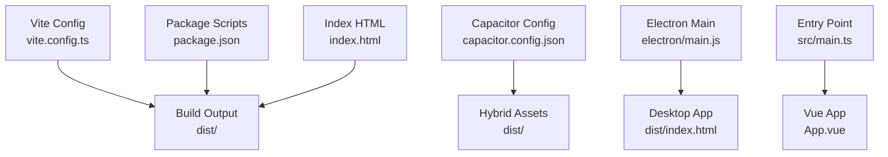
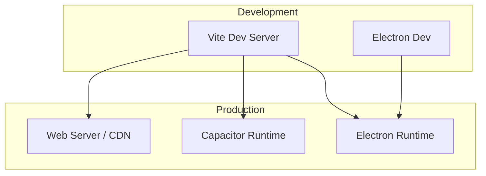
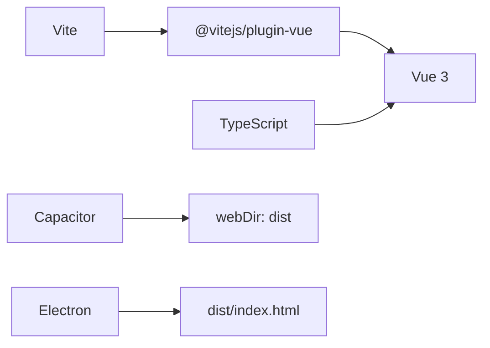

# Web Application Deployment

<cite>
**Referenced Files in This Document**
- [vite.config.ts](file://vite.config.ts)
- [package.json](file://package.json)
- [index.html](file://index.html)
- [capacitor.config.json](file://capacitor.config.json)
- [src/main.ts](file://src/main.ts)
- [tsconfig.json](file://tsconfig.json)
- [tsconfig.node.json](file://tsconfig.node.json)
- [electron/main.js](file://electron/main.js)
- [electron/preload.js](file://electron/preload.js)
- [scripts/postinstall.js](file://scripts/postinstall.js)
</cite>

## Table of Contents
1. [Introduction](#introduction)
2. [Project Structure](#project-structure)
3. [Core Components](#core-components)
4. [Architecture Overview](#architecture-overview)
5. [Detailed Component Analysis](#detailed-component-analysis)
6. [Dependency Analysis](#dependency-analysis)
7. [Performance Considerations](#performance-considerations)
8. [Troubleshooting Guide](#troubleshooting-guide)
9. [Conclusion](#conclusion)
10. [Appendices](#appendices)

## Introduction
This document provides comprehensive guidance for deploying and hosting the finance application across modern platforms. It covers Vite build configuration, asset optimization, code splitting, bundle analysis, production build process, static asset handling, and CDN strategies. It also documents hosting options (Netlify, Vercel, GitHub Pages, and traditional web servers), environment variable management, API proxy configuration, service worker implementation, performance optimization techniques, SEO configuration, PWA features, security considerations, HTTPS configuration, and performance monitoring setup.

## Project Structure
The project is a Vue 3 application configured with Vite and TypeScript. It integrates Capacitor for hybrid capabilities and Electron for desktop packaging. The build pipeline produces a distribution suitable for web deployment and hybrid environments.

**Diagram sources**
- [vite.config.ts:1-11](file://vite.config.ts#L1-L11)
- [package.json:7-17](file://package.json#L7-L17)
- [capacitor.config.json:1-23](file://capacitor.config.json#L1-L23)
- [electron/main.js:30-40](file://electron/main.js#L30-L40)
- [src/main.ts:1-16](file://src/main.ts#L1-L16)
- [index.html:1-13](file://index.html#L1-L13)

**Section sources**
- [vite.config.ts:1-11](file://vite.config.ts#L1-L11)
- [package.json:7-17](file://package.json#L7-L17)
- [capacitor.config.json:1-23](file://capacitor.config.json#L1-L23)
- [electron/main.js:30-40](file://electron/main.js#L30-L40)
- [src/main.ts:1-16](file://src/main.ts#L1-L16)
- [index.html:1-13](file://index.html#L1-L13)

## Core Components
- Vite build configuration defines plugin usage, base path, and target JavaScript version.
- Package scripts orchestrate development, building, previewing, and cross-platform packaging.
- Capacitor configuration sets the web directory and runtime behavior for hybrid builds.
- Electron main process loads the development server in dev mode and packaged HTML in production.
- TypeScript configurations enable bundler mode and strict compilation.

Key implementation references:
- Build configuration and base path: [vite.config.ts:5-11](file://vite.config.ts#L5-L11)
- Scripts for dev/build/preview and packaging: [package.json:7-17](file://package.json#L7-L17)
- Capacitor web directory and runtime settings: [capacitor.config.json:4](file://capacitor.config.json#L4)
- Electron production load path: [electron/main.js:37-39](file://electron/main.js#L37-L39)
- TypeScript bundler mode: [tsconfig.json:9-14](file://tsconfig.json#L9-L14)

**Section sources**
- [vite.config.ts:5-11](file://vite.config.ts#L5-L11)
- [package.json:7-17](file://package.json#L7-L17)
- [capacitor.config.json:4](file://capacitor.config.json#L4)
- [electron/main.js:37-39](file://electron/main.js#L37-L39)
- [tsconfig.json:9-14](file://tsconfig.json#L9-L14)

## Architecture Overview
The deployment architecture supports three primary modes:
- Web deployment via Vite’s static output.
- Hybrid deployment via Capacitor using the built dist folder.
- Desktop deployment via Electron using the built dist folder.

[No sources needed since this diagram shows conceptual workflow, not actual code structure]

## Detailed Component Analysis

### Vite Build Configuration
- Plugin stack includes the Vue plugin.
- Base path is set to a relative path to support deployment under subpaths.
- Target is ES2015 for broad browser compatibility.

Optimization opportunities:
- Enable code splitting via route-based dynamic imports.
- Integrate a bundle analyzer plugin during CI builds.
- Configure asset handling (fonts, images) and public directory usage.

References:
- [vite.config.ts:5-11](file://vite.config.ts#L5-L11)

**Section sources**
- [vite.config.ts:5-11](file://vite.config.ts#L5-L11)

### Production Build Process
- The build script generates the dist directory.
- Capacitor expects the webDir to be dist.
- Electron loads dist/index.html in production mode.

References:
- [package.json:9](file://package.json#L9)
- [capacitor.config.json:4](file://capacitor.config.json#L4)
- [electron/main.js:37-39](file://electron/main.js#L37-L39)

**Section sources**
- [package.json:9](file://package.json#L9)
- [capacitor.config.json:4](file://capacitor.config.json#L4)
- [electron/main.js:37-39](file://electron/main.js#L37-L39)

### Static Asset Handling and CDN Integration
- Place static assets in the public directory for cache-friendly long-lived URLs.
- Use relative base path to ensure assets resolve correctly under subpaths.
- Configure CDN to serve dist with appropriate cache-control headers and compression.

References:
- [vite.config.ts:7](file://vite.config.ts#L7)
- [index.html:5](file://index.html#L5)

**Section sources**
- [vite.config.ts:7](file://vite.config.ts#L7)
- [index.html:5](file://index.html#L5)

### Hosting Platform Options
- Netlify/Vercel: Deploy dist after build; configure redirects and headers for SPA routing.
- GitHub Pages: Host dist on gh-pages branch or via actions; ensure base path alignment.
- Traditional web servers: Serve dist with proper MIME types and enable gzip/brotli compression.

[No sources needed since this section provides general guidance]

### Environment Variable Management
- Define environment variables per platform (development, staging, production).
- Expose only necessary variables at build time; avoid leaking secrets.
- Use Vite’s env prefix convention for client visibility.

[No sources needed since this section provides general guidance]

### API Proxy Configuration
- Configure Vite proxy for local development to avoid CORS issues.
- For production, deploy APIs behind the same origin or configure CORS appropriately.

[No sources needed since this section provides general guidance]

### Service Worker Implementation
- Register a service worker for offline caching and push notifications.
- Implement cache-first strategies for static assets and stale-while-revalidate for dynamic content.

[No sources needed since this section provides general guidance]

### Performance Optimization Techniques
- Lazy-load routes and heavy components.
- Optimize images (formats, sizes, responsive breakpoints).
- Enable compression and caching headers.
- Monitor Largest Contentful Paint (LCP), First Input Delay (FID), and Cumulative Layout Shift (CLS).

[No sources needed since this section provides general guidance]

### SEO Configuration and Meta Tags
- Set canonical URLs, Open Graph, and Twitter Card meta tags.
- Ensure title and description are dynamic per page.
- Implement structured data where applicable.

References:
- [index.html:7](file://index.html#L7)

**Section sources**
- [index.html:7](file://index.html#L7)

### Progressive Web App (PWA) Features
- Manifest file and icons for installability.
- Service worker for caching and offline support.
- Secure HTTPS delivery and robust error handling.

[No sources needed since this section provides general guidance]

### Security Considerations and HTTPS
- Enforce HTTPS in production.
- Use Content Security Policy (CSP) headers.
- Sanitize user-generated content and validate inputs.

[No sources needed since this section provides general guidance]

### Performance Monitoring Setup
- Integrate analytics and error reporting libraries.
- Track Core Web Vitals and custom metrics.
- Set up logging and alerting for performance regressions.

[No sources needed since this section provides general guidance]

## Dependency Analysis
The application relies on Vue 3, TypeScript, and Vite. Capacitor and Electron extend the deployment targets.

**Diagram sources**
- [vite.config.ts:2](file://vite.config.ts#L2)
- [capacitor.config.json:4](file://capacitor.config.json#L4)
- [electron/main.js:37-39](file://electron/main.js#L37-L39)

**Section sources**
- [vite.config.ts:2](file://vite.config.ts#L2)
- [capacitor.config.json:4](file://capacitor.config.json#L4)
- [electron/main.js:37-39](file://electron/main.js#L37-L39)

## Performance Considerations
- Prefer ES2015 target for compatibility while enabling modern bundling features.
- Use dynamic imports for route-level code splitting.
- Analyze bundles with a dedicated analyzer in CI to prevent bloat.
- Optimize images and fonts; leverage CDN caching.

[No sources needed since this section provides general guidance]

## Troubleshooting Guide
- Capacitor Android build compatibility: The postinstall script adjusts Java compatibility and namespaces for selected plugins. Verify Gradle files are modified as expected.
- Electron production load: Ensure dist/index.html exists and matches the path referenced by the Electron main process.
- Base path issues: Confirm base is set to a relative path so assets resolve under subpath deployments.

References:
- [scripts/postinstall.js:40-70](file://scripts/postinstall.js#L40-L70)
- [electron/main.js:37-39](file://electron/main.js#L37-L39)
- [vite.config.ts:7](file://vite.config.ts#L7)

**Section sources**
- [scripts/postinstall.js:40-70](file://scripts/postinstall.js#L40-L70)
- [electron/main.js:37-39](file://electron/main.js#L37-L39)
- [vite.config.ts:7](file://vite.config.ts#L7)

## Conclusion
The project is structured to support web, hybrid, and desktop deployments. By leveraging Vite’s build system, Capacitor for hybrid experiences, and Electron for desktop, teams can deliver a consistent application across platforms. Adopting the recommended practices for performance, security, and monitoring will ensure reliable, scalable deployments.

[No sources needed since this section summarizes without analyzing specific files]

## Appendices

### Appendix A: Build and Run Commands
- Development: npm run dev
- Preview: npm run preview
- Build: npm run build
- Electron development: npm run electron:dev
- Electron build: npm run electron:build
- Capacitor sync: npm run cap:sync

References:
- [package.json:7-17](file://package.json#L7-L17)

**Section sources**
- [package.json:7-17](file://package.json#L7-L17)

### Appendix B: TypeScript Configuration Notes
- Bundler mode enabled for Vite compatibility.
- Strict compiler options enforced for type safety.

References:
- [tsconfig.json:9-14](file://tsconfig.json#L9-L14)
- [tsconfig.node.json:5-8](file://tsconfig.node.json#L5-L8)

**Section sources**
- [tsconfig.json:9-14](file://tsconfig.json#L9-L14)
- [tsconfig.node.json:5-8](file://tsconfig.node.json#L5-L8)