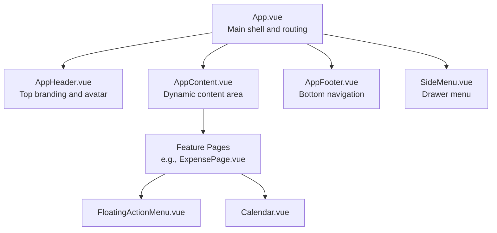
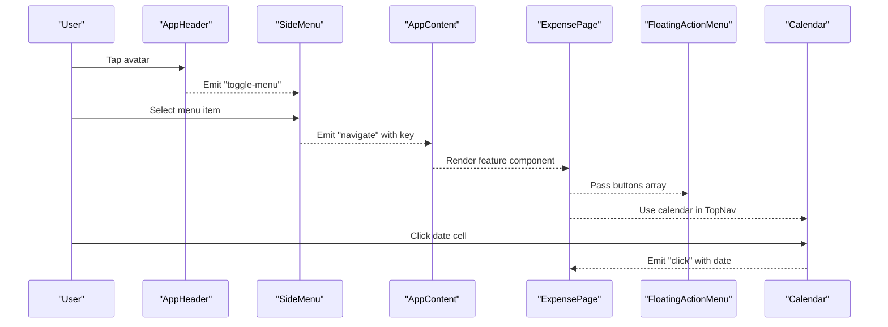
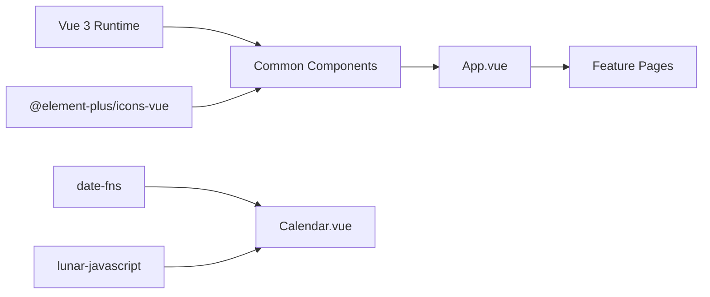

# Common Components

<cite>
**Referenced Files in This Document**
- [App.vue](file://src/App.vue)
- [AppHeader.vue](file://src/components/common/AppHeader.vue)
- [AppFooter.vue](file://src/components/common/AppFooter.vue)
- [SideMenu.vue](file://src/components/common/SideMenu.vue)
- [PageTemplate.vue](file://src/components/common/PageTemplate.vue)
- [AppContent.vue](file://src/components/common/AppContent.vue)
- [PageHeader.vue](file://src/components/common/PageHeader.vue)
- [FloatingActionMenu.vue](file://src/components/common/FloatingActionMenu.vue)
- [Calendar.vue](file://src/components/common/Calendar.vue)
- [ExpensePage.vue](file://src/components/mobile/expense/ExpensePage.vue)
- [TopNav.vue](file://src/components/mobile/expense/TopNav.vue)
- [package.json](file://package.json)
</cite>

## Table of Contents
1. [Introduction](#introduction)
2. [Project Structure](#project-structure)
3. [Core Components](#core-components)
4. [Architecture Overview](#architecture-overview)
5. [Detailed Component Analysis](#detailed-component-analysis)
6. [Dependency Analysis](#dependency-analysis)
7. [Performance Considerations](#performance-considerations)
8. [Troubleshooting Guide](#troubleshooting-guide)
9. [Conclusion](#conclusion)
10. [Appendices](#appendices)

## Introduction
This document describes the common UI components that form the application’s design system. It covers the header, footer, side menu, page template, content wrapper, page header, floating action menu, and calendar components. For each component, we document props, events, slots, styling options, and accessibility features. We also provide usage examples demonstrating proper integration patterns, component composition, responsive design considerations, and cross-platform compatibility.

## Project Structure
The common components live under src/components/common and are consumed by the main application shell and feature pages. The main application orchestrates navigation, state, and content rendering.

**Diagram sources**
- [App.vue:1-195](file://src/App.vue#L1-L195)
- [AppHeader.vue:1-135](file://src/components/common/AppHeader.vue#L1-L135)
- [AppContent.vue:1-51](file://src/components/common/AppContent.vue#L1-L51)
- [AppFooter.vue:1-98](file://src/components/common/AppFooter.vue#L1-L98)
- [SideMenu.vue:1-255](file://src/components/common/SideMenu.vue#L1-L255)
- [ExpensePage.vue:1-88](file://src/components/mobile/expense/ExpensePage.vue#L1-L88)
- [FloatingActionMenu.vue:1-151](file://src/components/common/FloatingActionMenu.vue#L1-L151)
- [Calendar.vue:1-477](file://src/components/common/Calendar.vue#L1-L477)

**Section sources**
- [App.vue:1-195](file://src/App.vue#L1-L195)

## Core Components
This section summarizes each component’s role, props, events, slots, styling hooks, and accessibility features.

- AppHeader
  - Role: Top bar with branding and user avatar trigger.
  - Props: None.
  - Events: toggle-menu.
  - Slots: None.
  - Styling: Scoped CSS for layout, hover effects, and responsive adjustments.
  - Accessibility: Uses images with alt attributes; click target is explicit.

- AppFooter
  - Role: Bottom tab navigation for primary sections.
  - Props: None.
  - Events: navigate with payload key.
  - Slots: None.
  - Styling: Scoped CSS for spacing, hover states, and responsive adjustments.
  - Accessibility: Icons and labels; hover feedback; consistent sizing.

- SideMenu
  - Role: Slide-out drawer with user profile and menu items.
  - Props: visible (boolean).
  - Events: close, navigate with payload key.
  - Slots: None.
  - Styling: Fixed overlay and animated slide-in panel; responsive width and typography.
  - Accessibility: Overlay click closes; keyboard-friendly hover targets.

- PageTemplate
  - Role: Standard page container with header and optional confirm button.
  - Props: title (string), showConfirmButton (boolean), confirmText (string), confirmDisabled (boolean).
  - Events: back, confirm.
  - Slots: Default slot for page content.
  - Styling: Flex layout with scrollable content area and disabled scrollbar.
  - Accessibility: Back button emits event; confirm button disabled state handled.

- AppContent
  - Role: Dynamic content renderer that forwards child events.
  - Props: currentComponent (any), componentProps (Record).
  - Events: navigate with key, dateChange with { year, month }.
  - Slots: None.
  - Styling: Scrollable area with hidden scrollbar; responsive padding.
  - Accessibility: Delegates focus and interactions to child components.

- PageHeader
  - Role: Page-level header with back action and title.
  - Props: title (string).
  - Events: back.
  - Slots: None.
  - Styling: Clean header with centered title and placeholder for trailing actions.
  - Accessibility: Icon button with hover emphasis.

- FloatingActionMenu
  - Role: Single or grouped floating action buttons with tooltips.
  - Props: buttons (ActionButton[] with text, icon, action).
  - Events: None (actions invoked directly).
  - Slots: None.
  - Styling: Fixed positioning with hover animations and tooltip labels.
  - Accessibility: Hover tooltips; visible contrast; consistent sizing.

- Calendar
  - Role: Full-featured calendar with lunar and solar data, holiday support, and expense indicators.
  - Props: width (string), height (string), expenses (Object).
  - Events: click with selected date object.
  - Slots: None.
  - Styling: Responsive grid layout with gradient header and footer card.
  - Accessibility: Clickable cells; active/current day markers; hover states.

**Section sources**
- [AppHeader.vue:1-135](file://src/components/common/AppHeader.vue#L1-L135)
- [AppFooter.vue:1-98](file://src/components/common/AppFooter.vue#L1-L98)
- [SideMenu.vue:1-255](file://src/components/common/SideMenu.vue#L1-L255)
- [PageTemplate.vue:1-103](file://src/components/common/PageTemplate.vue#L1-L103)
- [AppContent.vue:1-51](file://src/components/common/AppContent.vue#L1-L51)
- [PageHeader.vue:1-57](file://src/components/common/PageHeader.vue#L1-L57)
- [FloatingActionMenu.vue:1-151](file://src/components/common/FloatingActionMenu.vue#L1-L151)
- [Calendar.vue:1-477](file://src/components/common/Calendar.vue#L1-L477)

## Architecture Overview
The main application composes common components to render a unified interface. Navigation is centralized in App.vue, which maps keys to feature components and passes props for date contexts. Feature pages integrate page templates and floating menus.

**Diagram sources**
- [App.vue:1-195](file://src/App.vue#L1-L195)
- [AppHeader.vue:1-135](file://src/components/common/AppHeader.vue#L1-L135)
- [SideMenu.vue:1-255](file://src/components/common/SideMenu.vue#L1-L255)
- [AppContent.vue:1-51](file://src/components/common/AppContent.vue#L1-L51)
- [ExpensePage.vue:1-88](file://src/components/mobile/expense/ExpensePage.vue#L1-L88)
- [FloatingActionMenu.vue:1-151](file://src/components/common/FloatingActionMenu.vue#L1-L151)
- [Calendar.vue:1-477](file://src/components/common/Calendar.vue#L1-L477)

## Detailed Component Analysis

### AppHeader
- Purpose: Provide branding and user avatar trigger to toggle the side menu.
- Props: None.
- Events: toggle-menu.
- Styling: Flex layout with logo and avatar; hover scaling; responsive font sizes.
- Accessibility: Avatar image has alt text; click target is explicit.

Usage example (integration):
- Parent component emits toggle-menu to control SideMenu visibility.

**Section sources**
- [AppHeader.vue:1-135](file://src/components/common/AppHeader.vue#L1-L135)
- [App.vue:1-195](file://src/App.vue#L1-L195)

### AppFooter
- Purpose: Bottom tab navigation for major sections.
- Props: None.
- Events: navigate(key).
- Styling: Centered icons and labels; hover color transitions; responsive adjustments.

Usage example (integration):
- Parent listens for navigate and updates active menu.

**Section sources**
- [AppFooter.vue:1-98](file://src/components/common/AppFooter.vue#L1-L98)
- [App.vue:1-195](file://src/App.vue#L1-L195)

### SideMenu
- Purpose: Slide-out drawer with user profile and navigation items.
- Props: visible (boolean).
- Events: close, navigate(key).
- Styling: Fixed overlay and animated slide-in panel; responsive width and typography.

Usage example (integration):
- Parent binds visible prop and handles close/navigate events.

**Section sources**
- [SideMenu.vue:1-255](file://src/components/common/SideMenu.vue#L1-L255)
- [App.vue:1-195](file://src/App.vue#L1-L195)

### PageTemplate
- Purpose: Standard page layout with header and optional confirm button.
- Props: title, showConfirmButton, confirmText, confirmDisabled.
- Events: back, confirm.
- Slots: Default slot for page content.
- Styling: Flex column with scrollable content area and hidden scrollbar.

Usage example (integration):
- Feature pages wrap content inside PageTemplate and bind confirm button state.

**Section sources**
- [PageTemplate.vue:1-103](file://src/components/common/PageTemplate.vue#L1-L103)

### AppContent
- Purpose: Dynamic content renderer forwarding child events.
- Props: currentComponent, componentProps.
- Events: navigate(key), dateChange({ year, month }).
- Slots: None.
- Styling: Scrollable area with hidden scrollbar; responsive padding.

Usage example (integration):
- Parent sets currentComponent and componentProps; forwards navigate/dateChange.

**Section sources**
- [AppContent.vue:1-51](file://src/components/common/AppContent.vue#L1-L51)
- [App.vue:1-195](file://src/App.vue#L1-L195)

### PageHeader
- Purpose: Page-level header with back action and title.
- Props: title.
- Events: back.
- Slots: None.
- Styling: Clean header with centered title and placeholder for trailing actions.

Usage example (integration):
- Feature pages pass title and handle back event.

**Section sources**
- [PageHeader.vue:1-57](file://src/components/common/PageHeader.vue#L1-L57)

### FloatingActionMenu
- Purpose: Single or grouped floating action buttons with tooltips.
- Props: buttons (ActionButton[] with text, icon, action).
- Events: None (actions invoked directly).
- Slots: None.
- Styling: Fixed positioning with hover animations and tooltip labels.

Usage example (integration):
- Feature pages pass buttons array to render quick actions.

**Section sources**
- [FloatingActionMenu.vue:1-151](file://src/components/common/FloatingActionMenu.vue#L1-L151)
- [ExpensePage.vue:1-88](file://src/components/mobile/expense/ExpensePage.vue#L1-L88)

### Calendar
- Purpose: Full-featured calendar with lunar/solar data, holidays, and expense indicators.
- Props: width, height, expenses.
- Events: click(date).
- Slots: None.
- Styling: Responsive grid layout with gradient header and footer card.

Usage example (integration):
- Feature pages pass width/height and listen for click events to update state.

**Section sources**
- [Calendar.vue:1-477](file://src/components/common/Calendar.vue#L1-L477)
- [TopNav.vue:1-211](file://src/components/mobile/expense/TopNav.vue#L1-L211)

## Dependency Analysis
Common components rely on Vue 3 Composition API, Element Plus icons, and third-party libraries for date and calendar logic.

**Diagram sources**
- [package.json:19-36](file://package.json#L19-L36)
- [Calendar.vue:68-72](file://src/components/common/Calendar.vue#L68-L72)
- [App.vue:22-31](file://src/App.vue#L22-L31)

**Section sources**
- [package.json:19-36](file://package.json#L19-L36)
- [Calendar.vue:68-72](file://src/components/common/Calendar.vue#L68-L72)
- [App.vue:22-31](file://src/App.vue#L22-L31)

## Performance Considerations
- Virtualization: Not applicable for current components; keep lists short.
- Rendering: Use v-if to conditionally render heavy overlays (e.g., SideMenu).
- Event handling: Debounce resize listeners where appropriate (already handled in Calendar).
- Scrolling: Hidden scrollbars are used; ensure content remains accessible.
- Animations: Minimal CSS transitions; avoid heavy transforms on many elements.

## Troubleshooting Guide
- SideMenu does not close
  - Ensure parent toggles visible prop and listens to close event.
  - Verify overlay click handler is present.

- AppFooter navigation not working
  - Confirm parent listens to navigate and updates active menu accordingly.

- FloatingActionMenu not visible
  - Ensure buttons array is provided and not empty.
  - Check fixed positioning and z-index stacking context.

- Calendar click event not firing
  - Verify click handler is attached and receives date object.
  - Confirm component is mounted and not hidden.

- AppHeader avatar click not triggering menu
  - Ensure toggle-menu event is emitted and parent toggles menu visibility.

**Section sources**
- [SideMenu.vue:1-255](file://src/components/common/SideMenu.vue#L1-L255)
- [AppFooter.vue:1-98](file://src/components/common/AppFooter.vue#L1-L98)
- [FloatingActionMenu.vue:1-151](file://src/components/common/FloatingActionMenu.vue#L1-L151)
- [Calendar.vue:1-477](file://src/components/common/Calendar.vue#L1-L477)
- [AppHeader.vue:1-135](file://src/components/common/AppHeader.vue#L1-L135)

## Conclusion
The common components provide a cohesive design system with clear roles and straightforward APIs. They integrate seamlessly through App.vue, enabling consistent navigation, layout, and interactions across feature pages. The components are designed with responsiveness and accessibility in mind, and their props/events/slots enable flexible composition.

## Appendices

### Component Composition Patterns
- Shell-to-feature integration
  - App.vue manages active menu, date context, and component mapping.
  - AppContent renders the current feature component and forwards events.
  - Feature pages compose PageTemplate and FloatingActionMenu as needed.

- Example: Expense page
  - Wraps content in PageTemplate.
  - Integrates FloatingActionMenu with action buttons.
  - Uses Calendar indirectly via TopNav.

**Section sources**
- [App.vue:64-137](file://src/App.vue#L64-L137)
- [ExpensePage.vue:1-88](file://src/components/mobile/expense/ExpensePage.vue#L1-L88)
- [TopNav.vue:1-211](file://src/components/mobile/expense/TopNav.vue#L1-L211)

### Cross-Platform Compatibility
- Web and Electron
  - App.vue uses Capacitor runtime checks; Electron main process configured in package.json.
- Mobile (Capacitor)
  - Keyboard plugin is initialized for native platforms.
- Icons and styling
  - Element Plus icons and scoped styles ensure consistent visuals across environments.

**Section sources**
- [App.vue:155-172](file://src/App.vue#L155-L172)
- [package.json:48-71](file://package.json#L48-L71)