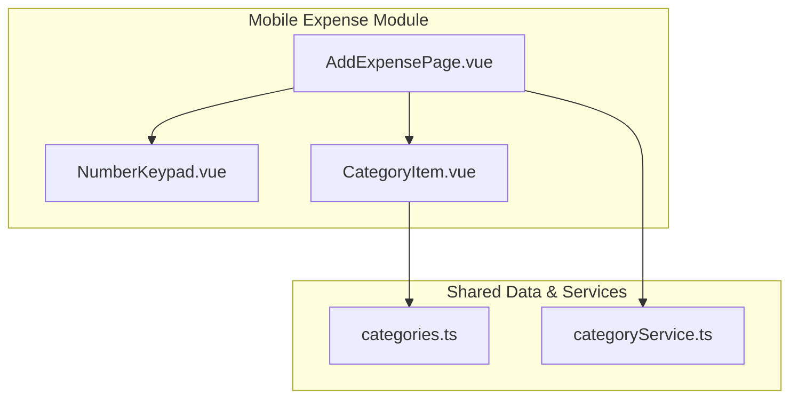
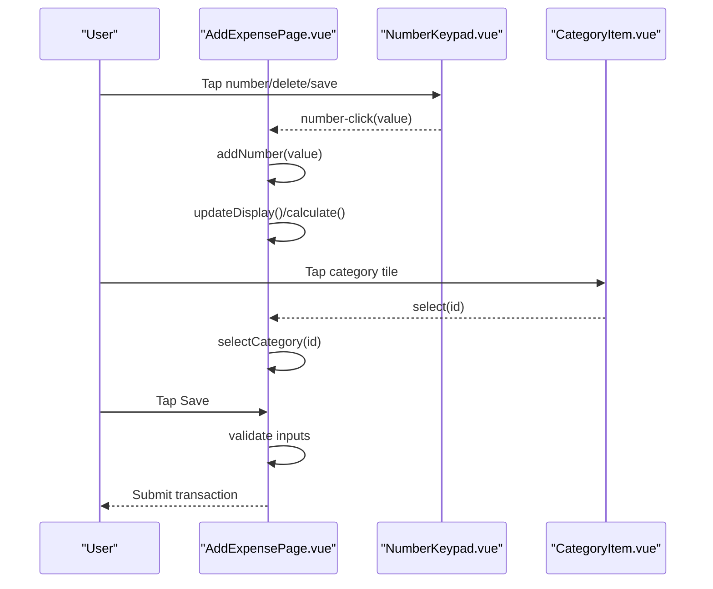
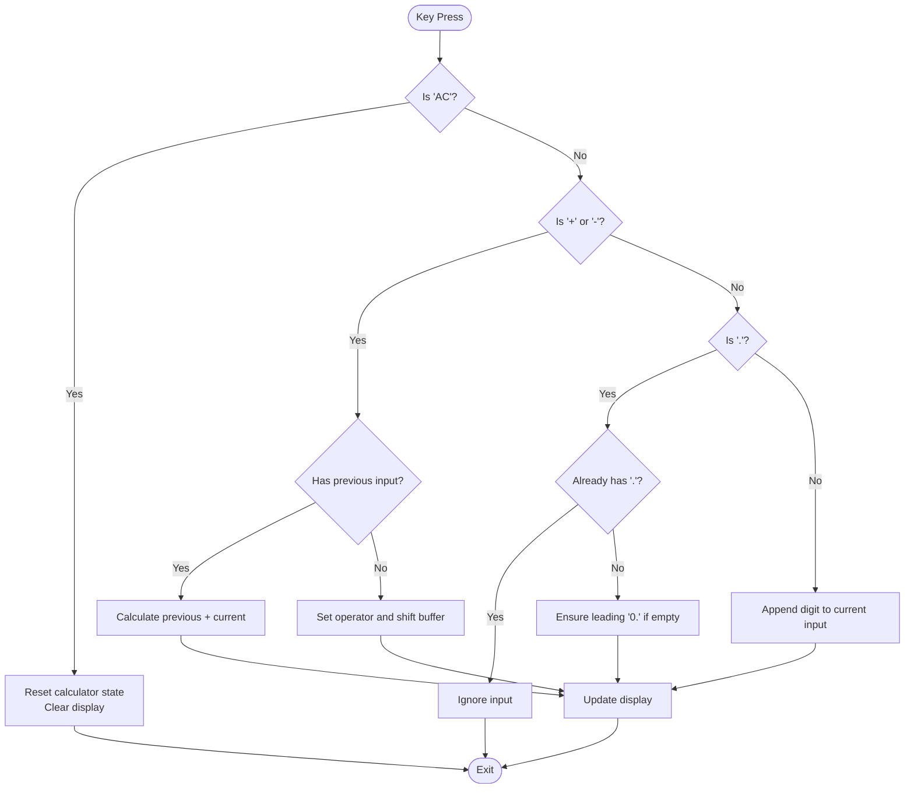
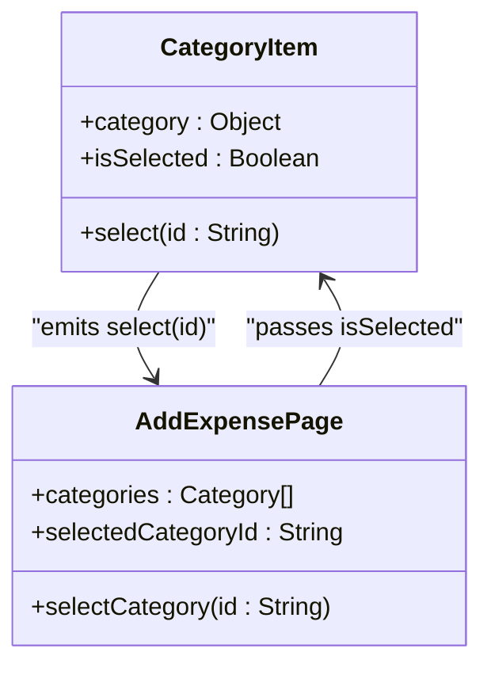
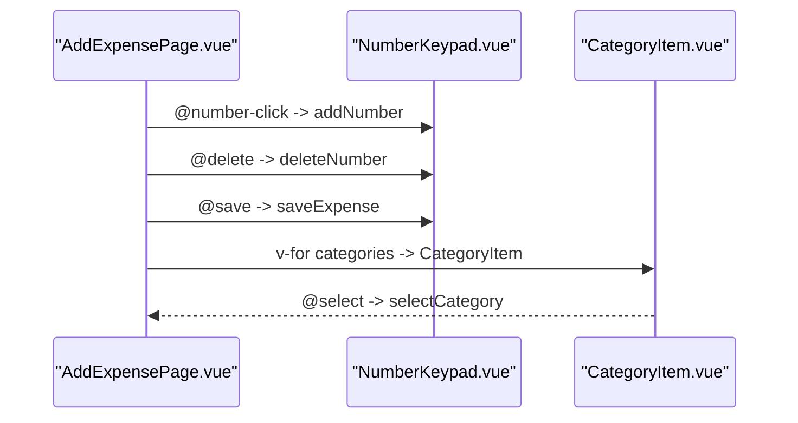
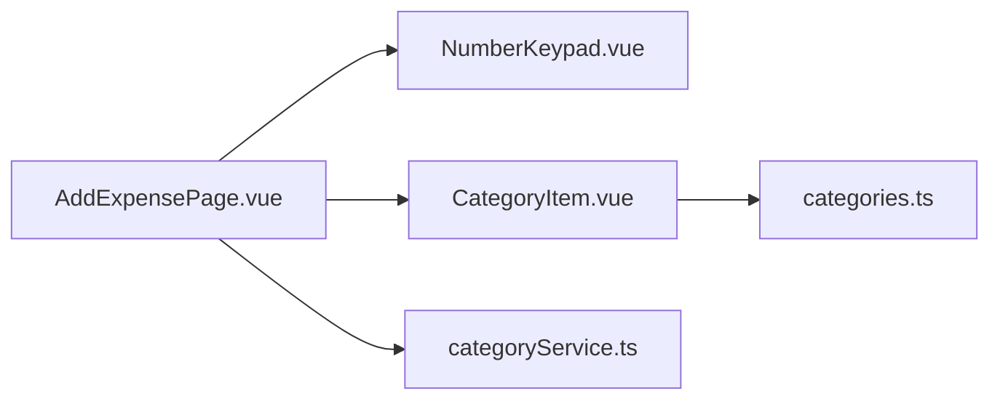

# Mobile Input Components

<cite>
**Referenced Files in This Document**
- [NumberKeypad.vue](file://src/components/mobile/expense/NumberKeypad.vue)
- [CategoryItem.vue](file://src/components/mobile/expense/CategoryItem.vue)
- [AddExpensePage.vue](file://src/components/mobile/expense/AddExpensePage.vue)
- [categories.ts](file://src/data/categories.ts)
- [categoryService.ts](file://src/services/categoryService.ts)
</cite>

## Table of Contents
1. [Introduction](#introduction)
2. [Project Structure](#project-structure)
3. [Core Components](#core-components)
4. [Architecture Overview](#architecture-overview)
5. [Detailed Component Analysis](#detailed-component-analysis)
6. [Dependency Analysis](#dependency-analysis)
7. [Performance Considerations](#performance-considerations)
8. [Troubleshooting Guide](#troubleshooting-guide)
9. [Conclusion](#conclusion)
10. [Appendices](#appendices)

## Introduction
This document provides comprehensive documentation for mobile-first input components focused on touch interfaces. It covers two primary components:
- Number Keypad: A virtual numeric keypad tailored for mobile input, supporting digit entry, decimal point handling, and arithmetic operations.
- Category Item: A selectable category tile used for choosing expense/income categories with visual selection states.

The documentation details component props, event handling, keyboard input support, touch interaction patterns, styling customization, animations, responsive behavior, accessibility considerations, and practical usage examples integrated with forms and data binding.

## Project Structure
The mobile input components reside under the mobile expense module and integrate with shared data and services:
- NumberKeypad.vue: Virtual keypad component emitting user actions.
- CategoryItem.vue: Category tile with selection state and click handler.
- AddExpensePage.vue: Example page integrating both components within a form-like layout.
- categories.ts: Category model and default category lists.
- categoryService.ts: Service for fetching and managing categories.

**Diagram sources**
- [NumberKeypad.vue:1-106](file://src/components/mobile/expense/NumberKeypad.vue#L1-L106)
- [CategoryItem.vue:1-69](file://src/components/mobile/expense/CategoryItem.vue#L1-L69)
- [AddExpensePage.vue:1-106](file://src/components/mobile/expense/AddExpensePage.vue#L1-L106)
- [categories.ts:1-45](file://src/data/categories.ts#L1-L45)
- [categoryService.ts:1-260](file://src/services/categoryService.ts#L1-L260)

**Section sources**
- [NumberKeypad.vue:1-106](file://src/components/mobile/expense/NumberKeypad.vue#L1-L106)
- [CategoryItem.vue:1-69](file://src/components/mobile/expense/CategoryItem.vue#L1-L69)
- [AddExpensePage.vue:1-106](file://src/components/mobile/expense/AddExpensePage.vue#L1-L106)
- [categories.ts:1-45](file://src/data/categories.ts#L1-L45)
- [categoryService.ts:1-260](file://src/services/categoryService.ts#L1-L260)

## Core Components
This section outlines the purpose, props, events, and behavior of each component.

### Number Keypad Component
Purpose:
- Provides a virtual numeric keypad optimized for mobile touch input.
- Emits events for digit presses, delete/backspace, and save confirmation.

Props:
- None (no props required; emits actions)

Events:
- number-click(value: string): Emitted when a key is pressed. Values include digits '0'–'9', operators '+', '-', decimal '.', and control keys 'AC' (all clear) and 'save'.
- delete: Emitted when the delete key is pressed.
- save: Emitted when the save key is pressed.

Keyboard input support:
- The keypad itself does not intercept keyboard input. However, the parent form integrates a read-only input with inputmode set to decimal to trigger the device’s native numeric keyboard on mobile browsers.

Touch gesture recognition:
- Uses click handlers for all keys. No swipe or long-press gestures are implemented.

Validation handled by parent:
- The parent page validates account selection, category selection, and amount positivity before saving.

Styling customization:
- Keys are styled with consistent sizing and spacing. The save key uses a distinct color scheme. Hover effects are present for desktop parity.

Responsive behavior:
- Responsive media queries adjust key height and font size for smaller screens.

Accessibility:
- No explicit ARIA attributes or screen reader announcements are implemented. Consider adding aria-labels and roles for improved accessibility.

Usage example (integration):
- See AddExpensePage.vue for how the keypad is wired to form state and validation logic.

**Section sources**
- [NumberKeypad.vue:1-106](file://src/components/mobile/expense/NumberKeypad.vue#L1-L106)
- [AddExpensePage.vue:98-104](file://src/components/mobile/expense/AddExpensePage.vue#L98-L104)
- [AddExpensePage.vue:239-399](file://src/components/mobile/expense/AddExpensePage.vue#L239-L399)

### Category Item Component
Purpose:
- Displays a category tile with icon and name.
- Supports selection state via a boolean prop and emits selection events.

Props:
- category: Object with id, name, icon class, and iconText.
- isSelected: Boolean indicating whether the item is currently selected.

Events:
- select(id: string): Emitted when the item is clicked, carrying the category id.

Interaction patterns:
- Click handler triggers selection event.
- Visual selection state is indicated by background, shadow, and color changes.

Styling customization:
- Icon and label sizes, colors, and transitions are defined in scoped styles.
- Selected state applies a blue theme with elevation.

Responsive behavior:
- Grid layout adapts to screen width; icon and label sizes reduce on smaller screens.

Accessibility:
- No explicit ARIA attributes. Consider adding role="button" and aria-pressed for screen readers.

Usage example (integration):
- See AddExpensePage.vue for rendering a grid of CategoryItem components bound to category data and selection state.

**Section sources**
- [CategoryItem.vue:1-69](file://src/components/mobile/expense/CategoryItem.vue#L1-L69)
- [AddExpensePage.vue:10-20](file://src/components/mobile/expense/AddExpensePage.vue#L10-L20)
- [categories.ts:1-45](file://src/data/categories.ts#L1-L45)

## Architecture Overview
The components are orchestrated within a page that manages form state and validation. The NumberKeypad is controlled by the page’s calculator state, while CategoryItem participates in category selection.

**Diagram sources**
- [AddExpensePage.vue:239-399](file://src/components/mobile/expense/AddExpensePage.vue#L239-L399)
- [NumberKeypad.vue:33-37](file://src/components/mobile/expense/NumberKeypad.vue#L33-L37)
- [CategoryItem.vue:19-21](file://src/components/mobile/expense/CategoryItem.vue#L19-L21)

## Detailed Component Analysis

### Number Keypad Implementation Details
Processing logic:
- Digit handling: Appends digits to the current input buffer.
- Decimal point handling: Prevents multiple decimals and ensures leading zero when needed.
- Operators (+/-): Sets operator state and performs immediate calculation when applicable.
- AC (All Clear): Resets calculator state and clears the display.
- Delete: Removes last character or operator depending on state.
- Save: Triggers validation and submission.

**Diagram sources**
- [AddExpensePage.vue:239-336](file://src/components/mobile/expense/AddExpensePage.vue#L239-L336)

**Section sources**
- [AddExpensePage.vue:239-336](file://src/components/mobile/expense/AddExpensePage.vue#L239-L336)
- [NumberKeypad.vue:33-37](file://src/components/mobile/expense/NumberKeypad.vue#L33-L37)

### Category Item Implementation Details
Selection state management:
- isSelected prop toggles a CSS class that modifies background, shadow, and text/icon colors.
- Click handler emits the category id to the parent.

**Diagram sources**
- [CategoryItem.vue:9-21](file://src/components/mobile/expense/CategoryItem.vue#L9-L21)
- [AddExpensePage.vue:192-200](file://src/components/mobile/expense/AddExpensePage.vue#L192-L200)

**Section sources**
- [CategoryItem.vue:1-69](file://src/components/mobile/expense/CategoryItem.vue#L1-L69)
- [AddExpensePage.vue:192-200](file://src/components/mobile/expense/AddExpensePage.vue#L192-L200)

### Parent Page Integration
AddExpensePage demonstrates:
- Data binding for amount display and category selection.
- Event wiring to NumberKeypad and CategoryItem.
- Validation prior to saving, including account availability checks and amount positivity.

**Diagram sources**
- [AddExpensePage.vue:98-104](file://src/components/mobile/expense/AddExpensePage.vue#L98-L104)
- [AddExpensePage.vue:10-20](file://src/components/mobile/expense/AddExpensePage.vue#L10-L20)
- [NumberKeypad.vue:33-37](file://src/components/mobile/expense/NumberKeypad.vue#L33-L37)
- [CategoryItem.vue:19-21](file://src/components/mobile/expense/CategoryItem.vue#L19-L21)

**Section sources**
- [AddExpensePage.vue:98-104](file://src/components/mobile/expense/AddExpensePage.vue#L98-L104)
- [AddExpensePage.vue:10-20](file://src/components/mobile/expense/AddExpensePage.vue#L10-L20)

## Dependency Analysis
Relationships:
- AddExpensePage depends on NumberKeypad and CategoryItem for input.
- CategoryItem relies on Category model definitions.
- CategoryService supplies category data to the page.

**Diagram sources**
- [AddExpensePage.vue:1-106](file://src/components/mobile/expense/AddExpensePage.vue#L1-L106)
- [NumberKeypad.vue:1-106](file://src/components/mobile/expense/NumberKeypad.vue#L1-L106)
- [CategoryItem.vue:1-69](file://src/components/mobile/expense/CategoryItem.vue#L1-L69)
- [categories.ts:1-45](file://src/data/categories.ts#L1-L45)
- [categoryService.ts:1-260](file://src/services/categoryService.ts#L1-L260)

**Section sources**
- [AddExpensePage.vue:113-116](file://src/components/mobile/expense/AddExpensePage.vue#L113-L116)
- [CategoryItem.vue:9-17](file://src/components/mobile/expense/CategoryItem.vue#L9-L17)
- [categories.ts:1-45](file://src/data/categories.ts#L1-L45)
- [categoryService.ts:14-69](file://src/services/categoryService.ts#L14-L69)

## Performance Considerations
- Rendering cost: Category grid uses v-for over a small list; negligible overhead.
- Event handling: Click handlers are lightweight; avoid unnecessary re-renders by passing stable references for category items.
- Keyboard input: Using inputmode="decimal" reduces layout thrashing by leveraging native numeric keyboards.
- Animations: Minimal CSS transitions and keyframes; keep them simple for smooth mobile performance.
- Data fetching: CategoryService caches defaults and falls back gracefully if database is unavailable.

## Troubleshooting Guide
Common issues and resolutions:
- Amount not updating:
  - Ensure number-click events are wired to addNumber and deleteNumber.
  - Verify updateDisplay is invoked after state changes.
- Duplicate decimal entries:
  - Confirm decimal handling prevents multiple dots in current input.
- Negative amounts:
  - "-" is treated as unary minus only when input is empty and no operator exists.
- Save fails:
  - Check account selection, category selection, and amount positivity.
  - Validate account balance or credit limit constraints before submission.
- Categories not appearing:
  - Initialize default categories if the database is empty.
  - Confirm categoryService.getCategories returns expected results.

**Section sources**
- [AddExpensePage.vue:239-399](file://src/components/mobile/expense/AddExpensePage.vue#L239-L399)
- [categoryService.ts:199-259](file://src/services/categoryService.ts#L199-L259)

## Conclusion
The NumberKeypad and CategoryItem components provide a solid foundation for mobile-first input experiences. They are intentionally minimal and delegate complex validation and persistence to the parent page and service layer. Extending these components involves adding accessibility attributes, gesture support, and richer validation while maintaining simplicity and responsiveness.

## Appendices

### Props and Events Reference

- NumberKeypad
  - Props: None
  - Events:
    - number-click(value: string)
    - delete
    - save

- CategoryItem
  - Props:
    - category: { id: string, name: string, icon: string, iconText: string }
    - isSelected: boolean
  - Events:
    - select(id: string)

**Section sources**
- [NumberKeypad.vue:33-37](file://src/components/mobile/expense/NumberKeypad.vue#L33-L37)
- [CategoryItem.vue:9-21](file://src/components/mobile/expense/CategoryItem.vue#L9-L21)

### Usage Examples

- Integrating NumberKeypad in a form:
  - Bind the keypad’s events to local methods that update the amount display and calculator state.
  - Wire the save event to a validation and submission routine.

- Integrating CategoryItem in a grid:
  - Render CategoryItem for each category with isSelected reflecting the current selection.
  - Emit select events to update the selected category id.

**Section sources**
- [AddExpensePage.vue:98-104](file://src/components/mobile/expense/AddExpensePage.vue#L98-L104)
- [AddExpensePage.vue:10-20](file://src/components/mobile/expense/AddExpensePage.vue#L10-L20)

### Accessibility Enhancements
Recommended additions:
- Add aria-labels to keypad keys for screen readers.
- Add role="button" and aria-pressed to CategoryItem for selection state.
- Provide focus indicators and keyboard navigation fallbacks.
- Announce state changes (e.g., selected category, amount updates) using live regions.

[No sources needed since this section provides general guidance]

### Styling Customization Options
- Adjust key sizing, spacing, and typography via media queries.
- Customize colors for selected state and hover states.
- Modify animations and transitions for smoother interactions.

**Section sources**
- [NumberKeypad.vue:40-106](file://src/components/mobile/expense/NumberKeypad.vue#L40-L106)
- [CategoryItem.vue:24-69](file://src/components/mobile/expense/CategoryItem.vue#L24-L69)
- [AddExpensePage.vue:804-853](file://src/components/mobile/expense/AddExpensePage.vue#L804-L853)

### Creating Similar Mobile-First Input Solutions
Guidelines:
- Keep components stateless where possible; pass props and emit events.
- Use inputmode and platform-native keyboards for optimal mobile UX.
- Implement responsive breakpoints early and test across device widths.
- Add accessibility attributes and consider haptic feedback for critical actions.
- Encapsulate validation and persistence logic in parent components or services.

[No sources needed since this section provides general guidance]