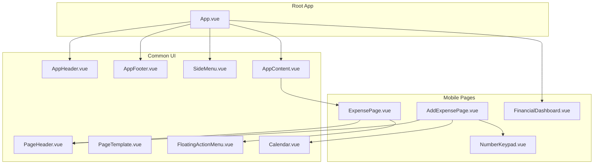
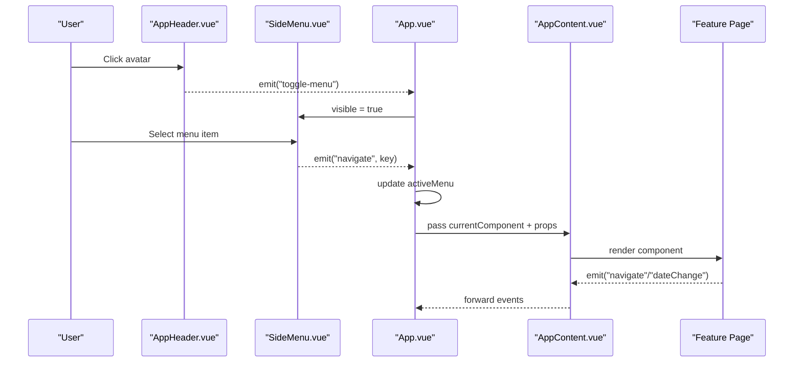
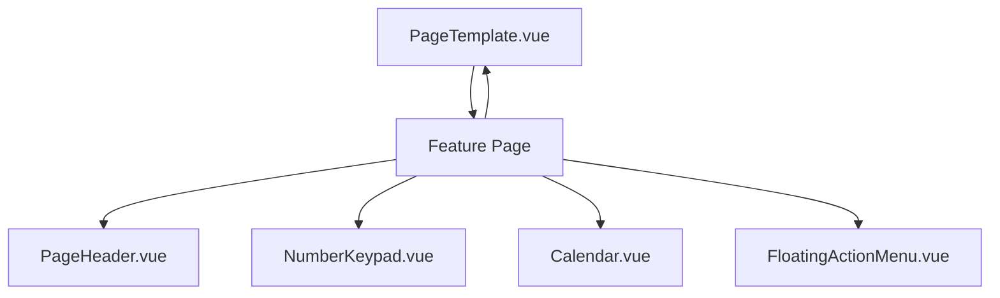

# UI Components

<cite>
**Referenced Files in This Document**
- [App.vue](file://src/App.vue)
- [AppHeader.vue](file://src/components/common/AppHeader.vue)
- [AppFooter.vue](file://src/components/common/AppFooter.vue)
- [SideMenu.vue](file://src/components/common/SideMenu.vue)
- [AppContent.vue](file://src/components/common/AppContent.vue)
- [PageHeader.vue](file://src/components/common/PageHeader.vue)
- [PageTemplate.vue](file://src/components/common/PageTemplate.vue)
- [FloatingActionMenu.vue](file://src/components/common/FloatingActionMenu.vue)
- [Calendar.vue](file://src/components/common/Calendar.vue)
- [NumberKeypad.vue](file://src/components/mobile/expense/NumberKeypad.vue)
- [ExpensePage.vue](file://src/components/mobile/expense/ExpensePage.vue)
- [AddExpensePage.vue](file://src/components/mobile/expense/AddExpensePage.vue)
- [FinancialDashboard.vue](file://src/components/mobile/financial/FinancialDashboard.vue)
- [package.json](file://package.json)
- [vite.config.ts](file://vite.config.ts)
</cite>

## Table of Contents
1. [Introduction](#introduction)
2. [Project Structure](#project-structure)
3. [Core Components](#core-components)
4. [Architecture Overview](#architecture-overview)
5. [Detailed Component Analysis](#detailed-component-analysis)
6. [Dependency Analysis](#dependency-analysis)
7. [Performance Considerations](#performance-considerations)
8. [Troubleshooting Guide](#troubleshooting-guide)
9. [Conclusion](#conclusion)
10. [Appendices](#appendices)

## Introduction
This document describes the UI component library used in the finance application. It covers reusable navigation elements (header, footer, side menu), layout components (page template), and specialized input components (number keypad, calendar). For each component, we explain props, events, slots, styling, theming, responsiveness, accessibility, cross-browser compatibility, and extension guidelines. We also illustrate integration patterns with the overall application architecture and provide usage examples via file references.

## Project Structure
The UI components are organized under src/components/common for shared UI building blocks and src/components/mobile for feature-specific pages. The root application orchestrates navigation and content rendering.

**Diagram sources**
- [App.vue:1-195](file://src/App.vue#L1-L195)
- [AppHeader.vue:1-135](file://src/components/common/AppHeader.vue#L1-L135)
- [AppFooter.vue:1-98](file://src/components/common/AppFooter.vue#L1-L98)
- [SideMenu.vue:1-255](file://src/components/common/SideMenu.vue#L1-L255)
- [AppContent.vue:1-51](file://src/components/common/AppContent.vue#L1-L51)
- [PageHeader.vue:1-57](file://src/components/common/PageHeader.vue#L1-L57)
- [PageTemplate.vue:1-103](file://src/components/common/PageTemplate.vue#L1-L103)
- [FloatingActionMenu.vue:1-151](file://src/components/common/FloatingActionMenu.vue#L1-L151)
- [Calendar.vue:1-477](file://src/components/common/Calendar.vue#L1-L477)
- [NumberKeypad.vue:1-106](file://src/components/mobile/expense/NumberKeypad.vue#L1-L106)
- [ExpensePage.vue:1-88](file://src/components/mobile/expense/ExpensePage.vue#L1-L88)
- [AddExpensePage.vue:1-200](file://src/components/mobile/expense/AddExpensePage.vue#L1-L200)
- [FinancialDashboard.vue:1-200](file://src/components/mobile/financial/FinancialDashboard.vue#L1-L200)

**Section sources**
- [App.vue:1-195](file://src/App.vue#L1-L195)
- [package.json:1-72](file://package.json#L1-L72)
- [vite.config.ts:1-11](file://vite.config.ts#L1-L11)

## Core Components
This section summarizes the primary UI components and their roles.

- AppHeader: Renders the top header with avatar and logo; emits a toggle event to open the side menu.
- AppFooter: Bottom tab bar with navigation events for major sections.
- SideMenu: Slide-in drawer with user profile and navigation items; emits close and navigate events.
- AppContent: Dynamic content host that renders the active page component and forwards navigation/date-change events.
- PageHeader: Standardized page header with back action and title.
- PageTemplate: Page scaffold with optional confirm button and slot for content.
- FloatingActionMenu: Single or expandable floating action button(s) with tooltips.
- Calendar: Full-featured calendar with lunar/jieqi data, weekend/holiday highlighting, and expense overlay.
- NumberKeypad: Numeric keypad for amount input with delete/save actions.

**Section sources**
- [AppHeader.vue:1-135](file://src/components/common/AppHeader.vue#L1-L135)
- [AppFooter.vue:1-98](file://src/components/common/AppFooter.vue#L1-L98)
- [SideMenu.vue:1-255](file://src/components/common/SideMenu.vue#L1-L255)
- [AppContent.vue:1-51](file://src/components/common/AppContent.vue#L1-L51)
- [PageHeader.vue:1-57](file://src/components/common/PageHeader.vue#L1-L57)
- [PageTemplate.vue:1-103](file://src/components/common/PageTemplate.vue#L1-L103)
- [FloatingActionMenu.vue:1-151](file://src/components/common/FloatingActionMenu.vue#L1-L151)
- [Calendar.vue:1-477](file://src/components/common/Calendar.vue#L1-L477)
- [NumberKeypad.vue:1-106](file://src/components/mobile/expense/NumberKeypad.vue#L1-L106)

## Architecture Overview
The application composes a top-level shell with navigation and content routing. Navigation is handled centrally in App.vue, which selects the current page component and passes props. Child pages use PageHeader/PageTemplate for consistent headers and scaffolding. Specialized inputs like NumberKeypad and Calendar are integrated into feature pages.

**Diagram sources**
- [App.vue:119-153](file://src/App.vue#L119-L153)
- [AppHeader.vue:45-47](file://src/components/common/AppHeader.vue#L45-L47)
- [SideMenu.vue:86-89](file://src/components/common/SideMenu.vue#L86-L89)
- [AppContent.vue:3-8](file://src/components/common/AppContent.vue#L3-L8)

**Section sources**
- [App.vue:64-117](file://src/App.vue#L64-L117)
- [AppContent.vue:12-22](file://src/components/common/AppContent.vue#L12-L22)

## Detailed Component Analysis

### AppHeader
- Purpose: Top header with user avatar and app logo; triggers menu toggle.
- Props: None.
- Events: Emits "toggle-menu".
- Slots: None.
- Styling/Theming: Uses a brand blue background with hover scaling on avatar; responsive font sizes and image sizes.
- Accessibility: Avatar clickable; alt text present on images.
- Cross-browser: Uses standard CSS; relies on Element Plus icons via CDN in templates.

Usage example references:
- [App.vue:4](file://src/App.vue#L4)

**Section sources**
- [AppHeader.vue:1-135](file://src/components/common/AppHeader.vue#L1-L135)

### AppFooter
- Purpose: Bottom navigation with five tabs for major sections.
- Props: None.
- Events: Emits "navigate" with a key string.
- Slots: None.
- Styling/Theming: White background with subtle shadow; hover effects; deep icon targeting for Element Plus icons.
- Responsive: Adjusts icon and label sizes for narrow screens.

Usage example references:
- [App.vue:15](file://src/App.vue#L15)

**Section sources**
- [AppFooter.vue:1-98](file://src/components/common/AppFooter.vue#L1-L98)

### SideMenu
- Purpose: Slide-in side menu with user profile and navigation items.
- Props: visible (boolean).
- Events: Emits "close" and "navigate" with a key string.
- Slots: None.
- Styling/Theming: Overlay backdrop; animated slide-in panel; hover styles; responsive adjustments.
- Accessibility: Focusable items; click-to-close overlay.

Usage example references:
- [App.vue:18](file://src/App.vue#L18)

**Section sources**
- [SideMenu.vue:1-255](file://src/components/common/SideMenu.vue#L1-L255)

### AppContent
- Purpose: Hosts the current page component and forwards navigation/date-change events.
- Props: currentComponent, componentProps.
- Events: Emits "navigate" and "dateChange".
- Slots: None.
- Styling/Theming: Scroll container with hidden scrollbar; responsive padding.

Usage example references:
- [App.vue:7-12](file://src/App.vue#L7-L12)

**Section sources**
- [AppContent.vue:1-51](file://src/components/common/AppContent.vue#L1-L51)

### PageHeader
- Purpose: Standardized page header with back arrow and title.
- Props: title (string).
- Events: Emits "back".
- Slots: None.
- Styling/Theming: Clean white header with bottom border; hover effect on icon.

Usage example references:
- [ExpensePage.vue:4](file://src/components/mobile/expense/ExpensePage.vue#L4)
- [AddExpensePage.vue:4](file://src/components/mobile/expense/AddExpensePage.vue#L4)

**Section sources**
- [PageHeader.vue:1-57](file://src/components/common/PageHeader.vue#L1-L57)

### PageTemplate
- Purpose: Page scaffold with optional confirm button and named slot for content.
- Props: title (string), showConfirmButton (boolean), confirmText (string), confirmDisabled (boolean).
- Events: Emits "back" and "confirm".
- Slots: default slot for page content.
- Styling/Theming: Column layout; content area scrollable; confirm section with branded button.

Usage example references:
- [AddExpensePage.vue:1-106](file://src/components/mobile/expense/AddExpensePage.vue#L1-L106)

**Section sources**
- [PageTemplate.vue:1-103](file://src/components/common/PageTemplate.vue#L1-L103)

### FloatingActionMenu
- Purpose: Single or expandable floating action button(s) with tooltips.
- Props: buttons (array of objects with text, icon, action).
- Events: None (invokes provided actions).
- Slots: None.
- Styling/Theming: Circular buttons with shadow; tooltip on hover; fade-in animation.

Usage example references:
- [ExpensePage.vue:19](file://src/components/mobile/expense/ExpensePage.vue#L19)

**Section sources**
- [FloatingActionMenu.vue:1-151](file://src/components/common/FloatingActionMenu.vue#L1-L151)

### Calendar
- Purpose: Interactive calendar with lunar/jieqi data, weekend/holiday highlighting, and expense overlay.
- Props: width (string), height (string), expenses (object mapping dates to amounts).
- Events: Emits "click" with selected date object.
- Slots: None.
- Styling/Theming: Gradient header, grid body, optional footer; themed colors for today/rest/expense cells.
- Responsiveness: Adapts footer visibility and typography on smaller screens.
- Cross-browser: Uses date-fns and lunar-javascript; Element Plus icons.

Usage example references:
- [AddExpensePage.vue:30-44](file://src/components/mobile/expense/AddExpensePage.vue#L30-L44)

**Section sources**
- [Calendar.vue:1-477](file://src/components/common/Calendar.vue#L1-L477)

### NumberKeypad
- Purpose: Numeric keypad optimized for amount input with delete/save actions.
- Props: None.
- Events: Emits "number-click" with value string, "delete", and "save".
- Slots: None.
- Styling/Theming: Grid of rounded buttons; special styling for delete/save; hover transitions.
- Responsiveness: Adjusts size and spacing for narrow screens.

Usage example references:
- [AddExpensePage.vue:99-104](file://src/components/mobile/expense/AddExpensePage.vue#L99-L104)

**Section sources**
- [NumberKeypad.vue:1-106](file://src/components/mobile/expense/NumberKeypad.vue#L1-L106)

### Conceptual Overview
The following diagram shows how a typical feature page integrates page scaffolding, specialized inputs, and floating actions.

[No sources needed since this diagram shows conceptual workflow, not actual code structure]

## Dependency Analysis
External libraries and their roles:
- Vue 3 runtime and composition API for components.
- Element Plus icons for UI icons.
- date-fns for date calculations.
- lunar-javascript for lunar/jieqi data.
- Chart.js and vue-echarts for charts.
- sass-embedded for SCSS compilation.
- Capacitor for native platform features.

Build targets:
- Vite with ES2015 target for broad browser support.

**Section sources**
- [package.json:19-36](file://package.json#L19-L36)
- [vite.config.ts:8-10](file://vite.config.ts#L8-L10)

## Performance Considerations
- Calendar computes a fixed 42-day grid and caches lunar/jieqi data per cell; avoid unnecessary re-computation by passing memoized props.
- NumberKeypad emits discrete events; keep parent handlers lightweight.
- FloatingActionMenu conditionally renders a single button or a menu; prefer single action when possible to reduce DOM nodes.
- Hidden scrollbars are applied to content areas; ensure long lists are virtualized if performance becomes an issue.
- Use component lazy-loading for heavy feature pages to reduce initial bundle size.

[No sources needed since this section provides general guidance]

## Troubleshooting Guide
- Icons not rendering: Ensure Element Plus icons are imported and available in the component scope.
- Calendar not updating: Verify that the expenses prop is reactive and passed down correctly; check date string formats match yyyy-MM-dd.
- SideMenu not closing: Confirm that the parent handles the "close" event and toggles the visible prop.
- NumberKeypad actions not firing: Ensure event listeners are attached to the component and that the parent updates state accordingly.
- FloatingActionMenu tooltips missing: Confirm that the menu is expanded and that the CSS for hover tooltips is loaded.

**Section sources**
- [Calendar.vue:234-243](file://src/components/common/Calendar.vue#L234-L243)
- [NumberKeypad.vue:33-37](file://src/components/mobile/expense/NumberKeypad.vue#L33-L37)
- [FloatingActionMenu.vue:56-58](file://src/components/common/FloatingActionMenu.vue#L56-L58)

## Conclusion
The UI component library provides a cohesive set of navigation, layout, and input components that integrate seamlessly with the application’s routing and state management. By following the documented props, events, and styling patterns, developers can extend existing components or build new ones that remain consistent with the app’s design and performance goals.

[No sources needed since this section summarizes without analyzing specific files]

## Appendices

### Usage Examples (by file reference)
- AppHeader integration: [App.vue:4](file://src/App.vue#L4)
- AppFooter integration: [App.vue:15](file://src/App.vue#L15)
- SideMenu integration: [App.vue:18](file://src/App.vue#L18)
- PageHeader usage: [ExpensePage.vue:4](file://src/components/mobile/expense/ExpensePage.vue#L4), [AddExpensePage.vue:4](file://src/components/mobile/expense/AddExpensePage.vue#L4)
- PageTemplate usage: [AddExpensePage.vue:1-106](file://src/components/mobile/expense/AddExpensePage.vue#L1-L106)
- FloatingActionMenu usage: [ExpensePage.vue:19](file://src/components/mobile/expense/ExpensePage.vue#L19)
- Calendar usage: [AddExpensePage.vue:30-44](file://src/components/mobile/expense/AddExpensePage.vue#L30-L44)
- NumberKeypad usage: [AddExpensePage.vue:99-104](file://src/components/mobile/expense/AddExpensePage.vue#L99-L104)
- FinancialDashboard chart: [FinancialDashboard.vue:109-170](file://src/components/mobile/financial/FinancialDashboard.vue#L109-L170)

### Extension Guidelines
- Reuse PageHeader/PageTemplate to maintain consistent headers and scaffolding.
- For new navigation items, extend SideMenu with appropriate icons and keys; wire them in App.vue navigation mapping.
- For new specialized inputs, follow NumberKeypad/Calendar patterns: define typed emits, keep props minimal, and encapsulate styling in scoped styles.
- For charts or heavy widgets, initialize in mounted hooks and clean up on unmount (as shown in FinancialDashboard).

[No sources needed since this section provides general guidance]