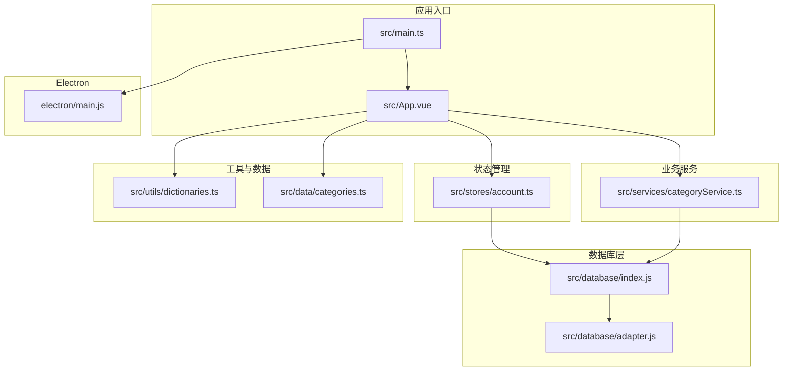
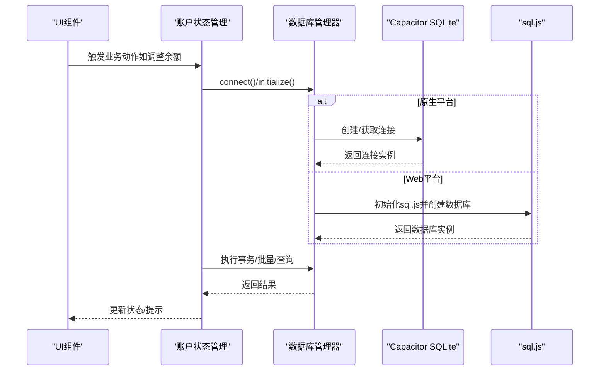
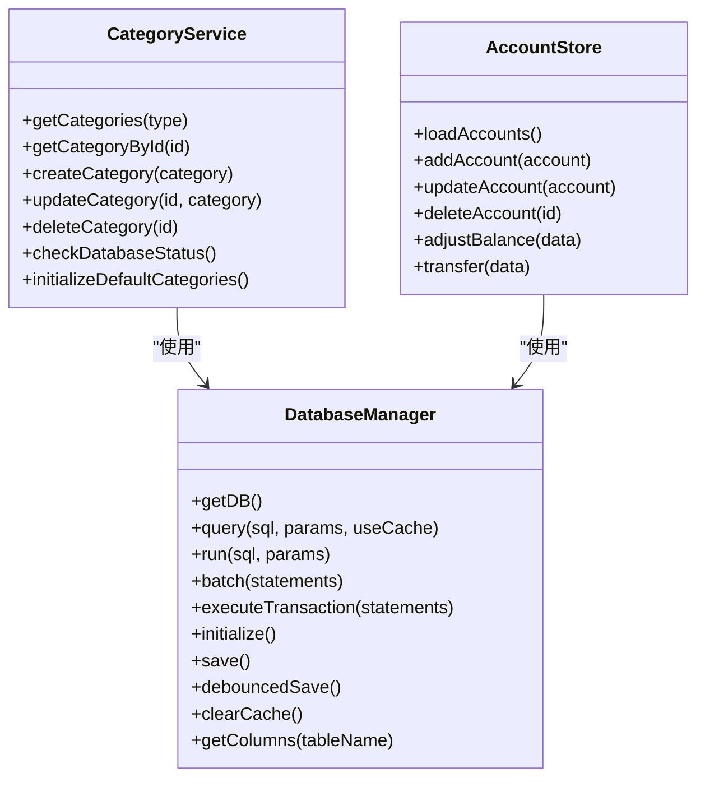
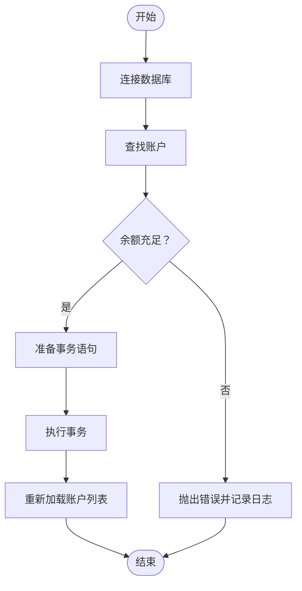
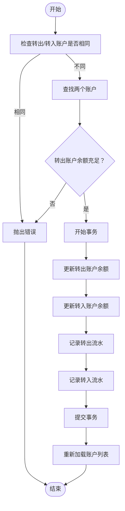

# API参考

<cite>
**本文档引用的文件**
- [src/database/index.js](file://src/database/index.js)
- [src/database/adapter.js](file://src/database/adapter.js)
- [src/services/categoryService.ts](file://src/services/categoryService.ts)
- [src/stores/account.ts](file://src/stores/account.ts)
- [src/utils/dictionaries.ts](file://src/utils/dictionaries.ts)
- [src/data/categories.ts](file://src/data/categories.ts)
- [src/App.vue](file://src/App.vue)
- [src/components/mobile/account/AccountManagement.vue](file://src/components/mobile/account/AccountManagement.vue)
- [src/components/mobile/expense/ExpensePage.vue](file://src/components/mobile/expense/ExpensePage.vue)
- [src/main.ts](file://src/main.ts)
- [electron/main.js](file://electron/main.js)
- [package.json](file://package.json)
</cite>

## 目录
1. [简介](#简介)
2. [项目结构](#项目结构)
3. [核心组件](#核心组件)
4. [架构总览](#架构总览)
5. [详细组件分析](#详细组件分析)
6. [依赖关系分析](#依赖关系分析)
7. [性能考量](#性能考量)
8. [故障排查指南](#故障排查指南)
9. [结论](#结论)
10. [附录](#附录)

## 简介
本API参考面向财务应用程序的前端与数据库层，涵盖数据库操作API、业务服务API、状态管理API以及跨平台运行时支持。文档对各模块的职责、方法签名、参数类型、返回值格式、异常处理、调用方式（同步/异步）、版本与兼容策略、错误码与处理指南、性能特性与使用限制、安全与权限控制、测试与调试方法、扩展与定制指导进行全面说明，帮助开发者准确、完整地使用与扩展系统。

## 项目结构
项目采用Vue 3 + Pinia + Capacitor架构，数据库层通过统一的数据库管理器适配移动端Capacitor SQLite与Web端sql.js，业务服务与状态管理分别封装在独立模块中，UI通过组件化组织。

**图表来源**
- [src/main.ts:1-16](file://src/main.ts#L1-L16)
- [src/App.vue:1-195](file://src/App.vue#L1-L195)
- [src/stores/account.ts:1-273](file://src/stores/account.ts#L1-L273)
- [src/services/categoryService.ts:1-260](file://src/services/categoryService.ts#L1-L260)
- [src/database/index.js:1-935](file://src/database/index.js#L1-L935)
- [src/database/adapter.js:1-34](file://src/database/adapter.js#L1-L34)
- [src/utils/dictionaries.ts:1-90](file://src/utils/dictionaries.ts#L1-L90)
- [src/data/categories.ts:1-45](file://src/data/categories.ts#L1-L45)
- [electron/main.js:1-70](file://electron/main.js#L1-L70)

**章节来源**
- [src/main.ts:1-16](file://src/main.ts#L1-L16)
- [src/App.vue:1-195](file://src/App.vue#L1-L195)
- [src/database/index.js:1-935](file://src/database/index.js#L1-L935)
- [src/database/adapter.js:1-34](file://src/database/adapter.js#L1-L34)
- [src/stores/account.ts:1-273](file://src/stores/account.ts#L1-L273)
- [src/services/categoryService.ts:1-260](file://src/services/categoryService.ts#L1-L260)
- [src/utils/dictionaries.ts:1-90](file://src/utils/dictionaries.ts#L1-L90)
- [src/data/categories.ts:1-45](file://src/data/categories.ts#L1-L45)
- [electron/main.js:1-70](file://electron/main.js#L1-L70)

## 核心组件
- 数据库管理器：统一提供连接、初始化、CRUD、批处理、事务、缓存与持久化能力，适配原生与Web环境。
- 分类服务：提供分类的增删改查、默认分类初始化、数据库状态检查等。
- 账户状态管理：封装账户列表加载、新增、更新、删除、余额调整、内部转账等业务动作。
- 工具与数据：集中管理枚举字典与默认分类数据。
- 应用入口与组件：负责应用初始化、路由与页面组件的挂载与交互。

**章节来源**
- [src/database/index.js:21-800](file://src/database/index.js#L21-L800)
- [src/services/categoryService.ts:8-260](file://src/services/categoryService.ts#L8-L260)
- [src/stores/account.ts:27-273](file://src/stores/account.ts#L27-L273)
- [src/utils/dictionaries.ts:6-90](file://src/utils/dictionaries.ts#L6-L90)
- [src/data/categories.ts:1-45](file://src/data/categories.ts#L1-L45)

## 架构总览
系统通过数据库管理器抽象底层差异，业务服务与状态管理通过统一接口访问数据库；UI通过组件与状态管理交互，应用入口负责初始化与运行时配置。

**图表来源**
- [src/stores/account.ts:145-185](file://src/stores/account.ts#L145-L185)
- [src/database/index.js:56-190](file://src/database/index.js#L56-L190)
- [src/database/index.js:215-309](file://src/database/index.js#L215-L309)

**章节来源**
- [src/stores/account.ts:145-185](file://src/stores/account.ts#L145-L185)
- [src/database/index.js:56-190](file://src/database/index.js#L56-L190)
- [src/database/index.js:215-309](file://src/database/index.js#L215-L309)

## 详细组件分析

### 数据库管理器 API
- 职责
  - 单例连接管理，避免重复连接与竞态。
  - 原生（Capacitor SQLite）与Web（sql.js）双栈适配。
  - 提供查询、执行、批处理、事务、缓存与持久化能力。
  - 初始化数据库表结构与字段迁移。

- 关键方法与规范
  - getDB()
    - 功能：获取数据库连接（单例）。
    - 参数：无。
    - 返回：Promise<数据库实例>。
    - 异常：连接失败抛出错误。
    - 调用方式：异步。
  - query(sql, params=[], useCache=false)
    - 功能：执行查询，支持缓存。
    - 参数：
      - sql: string，SQL查询语句。
      - params: any[]，位置参数数组。
      - useCache: boolean，是否使用查询缓存。
    - 返回：Promise<Array>，查询结果数组（对象数组）。
    - 异常：查询失败抛出错误。
    - 调用方式：异步。
  - run(sql, params=[])
    - 功能：执行写入/修改语句。
    - 参数：同上。
    - 返回：Promise<Object>，包含lastID与changes。
    - 异常：执行失败抛出错误。
    - 调用方式：异步。
  - batch(statements)
    - 功能：批处理多条SQL。
    - 参数：statements: Array<{sql, params}>。
    - 返回：Promise<Array>，每条语句执行结果。
    - 异常：批处理失败抛出错误。
    - 调用方式：异步。
  - executeTransaction(statements)
    - 功能：执行事务（自动事务）。
    - 参数：statements: Function或语句集。
    - 返回：Promise<any>，回调返回值。
    - 异常：事务失败抛出错误。
    - 调用方式：异步。
  - initialize()
    - 功能：初始化数据库表结构与索引，处理字段迁移。
    - 参数：无。
    - 返回：Promise<void>。
    - 异常：初始化失败抛出错误。
    - 调用方式：异步。
  - save()/debouncedSave()
    - 功能：Web端延迟持久化至localStorage。
    - 参数：无。
    - 返回：void。
    - 异常：持久化失败记录日志。
    - 调用方式：异步（延迟触发）。
  - clearCache()
    - 功能：清理查询缓存。
    - 参数：无。
    - 返回：void。
    - 异常：无。
    - 调用方式：同步。
  - getColumns(tableName)
    - 功能：获取表字段列表。
    - 参数：tableName: string。
    - 返回：Promise<Array<string>>。
    - 异常：查询失败抛出错误。
    - 调用方式：异步。

- 版本与兼容策略
  - 通过Capacitor平台检测自动切换实现。
  - 对历史字段进行迁移（如新增字段），保证向后兼容。
  - Web端通过sql.js与localStorage实现离线持久化。

- 性能特性
  - 查询缓存（Map）。
  - 批处理与事务减少往返。
  - 索引优化（多表建立索引）。
  - Web端节流持久化（默认1秒）。

- 安全与权限
  - 默认无加密连接（可按需扩展）。
  - Web端数据存储于localStorage，注意敏感信息保护。

- 错误处理
  - 统一捕获并抛出带明确信息的错误。
  - 原生与Web分支分别处理连接与执行错误。

**章节来源**
- [src/database/index.js:21-800](file://src/database/index.js#L21-L800)

### 分类服务 API
- 职责：分类的增删改查、默认分类初始化、数据库状态检查。

- 关键方法与规范
  - getCategories(type?)
    - 功能：获取分类列表，合并默认分类与数据库分类，去重后返回。
    - 参数：type?: string（可选，按类型过滤）。
    - 返回：Promise<Category[]>。
    - 异常：失败时返回默认分类。
    - 调用方式：异步。
  - getCategoryById(id)
    - 功能：按ID获取分类。
    - 参数：id: string。
    - 返回：Promise<Category|null>。
    - 异常：失败返回null。
    - 调用方式：异步。
  - createCategory(category)
    - 功能：创建分类。
    - 参数：category: Omit<Category,'id'>。
    - 返回：Promise<boolean>。
    - 异常：失败返回false。
    - 调用方式：异步。
  - updateCategory(id, category)
    - 功能：更新分类（动态字段拼接）。
    - 参数：id: string, category: Partial<Category>。
    - 返回：Promise<boolean>。
    - 异常：失败返回false。
    - 调用方式：异步。
  - deleteCategory(id)
    - 功能：删除分类。
    - 参数：id: string。
    - 返回：Promise<boolean>。
    - 异常：失败返回false。
    - 调用方式：异步。
  - checkDatabaseStatus()
    - 功能：检查数据库连接状态。
    - 参数：无。
    - 返回：Promise<{connected: boolean, message: string}>。
    - 异常：无，返回状态信息。
    - 调用方式：异步。
  - initializeDefaultCategories()
    - 功能：初始化默认分类（若数据库为空）。
    - 参数：无。
    - 返回：Promise<void>。
    - 异常：失败记录日志。
    - 调用方式：异步。

- 数据模型
  - Category接口：id, name, icon, iconText, type。

- 使用示例
  - 获取分类：await CategoryService.getCategories('expense')
  - 创建分类：await CategoryService.createCategory({name, icon, iconText, type})
  - 初始化默认分类：await CategoryService.initializeDefaultCategories()

**章节来源**
- [src/services/categoryService.ts:8-260](file://src/services/categoryService.ts#L8-L260)
- [src/data/categories.ts:1-45](file://src/data/categories.ts#L1-L45)

### 账户状态管理 API
- 职责：账户列表管理、新增、更新、删除、余额调整、内部转账。

- 关键方法与规范
  - loadAccounts()
    - 功能：加载账户列表。
    - 参数：无。
    - 返回：Promise<void>。
    - 异常：设置store.error并记录日志。
    - 调用方式：异步。
  - addAccount(account)
    - 功能：新增账户并重新加载。
    - 参数：account: any（含name/type/balance等）。
    - 返回：Promise<void>。
    - 异常：抛出错误并设置store.error。
    - 调用方式：异步。
  - updateAccount(account)
    - 功能：更新账户。
    - 参数：account: any。
    - 返回：Promise<void>。
    - 异常：设置store.error并记录日志。
    - 调用方式：异步。
  - deleteAccount(id)
    - 功能：删除账户并重新加载。
    - 参数：id: string。
    - 返回：Promise<void>。
    - 异常：设置store.error并记录日志。
    - 调用方式：异步。
  - adjustBalance(data)
    - 功能：余额调整（事务执行）。
    - 参数：data: {accountId, type, amount, remark}。
    - 返回：Promise<void>。
    - 异常：设置store.error并记录日志。
    - 调用方式：异步。
  - transfer(data)
    - 功能：内部转账（事务执行，含回滚）。
    - 参数：data: {fromAccountId, toAccountId, amount, remark}。
    - 返回：Promise<void>。
    - 异常：设置store.error并记录日志。
    - 调用方式：异步。

- 数据模型
  - Account接口：id, name, type, balance, used_limit?, total_limit?, is_liquid?, remark, created_at?, updated_at?

- 使用示例
  - 新增账户：await accountStore.addAccount({name, type, balance, remark})
  - 调整余额：await accountStore.adjustBalance({accountId, type, amount, remark})
  - 内部转账：await accountStore.transfer({fromAccountId, toAccountId, amount, remark})

**章节来源**
- [src/stores/account.ts:27-273](file://src/stores/account.ts#L27-L273)

### 工具与数据 API
- 字典管理：集中管理账户类型、负债类型、还款方式、负债状态、还款类型、财务目标类型、财务目标状态、资产类型、交易类型、调整类型等枚举。
- 默认分类：提供默认支出与收入分类数据，用于初始化。

**章节来源**
- [src/utils/dictionaries.ts:6-90](file://src/utils/dictionaries.ts#L6-L90)
- [src/data/categories.ts:9-45](file://src/data/categories.ts#L9-L45)

### 应用入口与组件 API
- 应用入口：初始化Pinia、ElementPlus，挂载根组件。
- 页面组件：ExpensePage、AccountManagement等通过状态管理与数据库交互，暴露导航与日期变更事件。

**章节来源**
- [src/main.ts:1-16](file://src/main.ts#L1-L16)
- [src/App.vue:65-137](file://src/App.vue#L65-L137)
- [src/components/mobile/expense/ExpensePage.vue:1-88](file://src/components/mobile/expense/ExpensePage.vue#L1-L88)
- [src/components/mobile/account/AccountManagement.vue:1-200](file://src/components/mobile/account/AccountManagement.vue#L1-L200)

## 依赖关系分析

**图表来源**
- [src/database/index.js:21-800](file://src/database/index.js#L21-L800)
- [src/services/categoryService.ts:8-260](file://src/services/categoryService.ts#L8-L260)
- [src/stores/account.ts:27-273](file://src/stores/account.ts#L27-L273)

**章节来源**
- [src/database/index.js:21-800](file://src/database/index.js#L21-L800)
- [src/services/categoryService.ts:8-260](file://src/services/categoryService.ts#L8-L260)
- [src/stores/account.ts:27-273](file://src/stores/account.ts#L27-L273)

## 性能考量
- 连接与并发
  - 单例连接避免重复创建；连接中状态避免并发连接。
- 查询与缓存
  - 查询缓存（Map）减少重复查询；合理使用useCache参数。
- 批处理与事务
  - 批处理与事务减少网络/IO往返，提升吞吐。
- 索引优化
  - 多表建立常用查询索引，降低查询成本。
- Web端持久化
  - 节流保存（默认1秒）减少localStorage写入频率。
- 资源与内存
  - Web端sql.js实例与缓存需在合适时机释放，避免内存泄漏。

[本节为通用性能建议，无需具体文件分析]

## 故障排查指南
- 数据库连接失败
  - 现象：连接异常或初始化失败。
  - 排查：检查平台判断、Capacitor插件安装、Web端sql.js初始化。
  - 处理：捕获错误并降级提示，必要时清空缓存重试。
- 查询/执行异常
  - 现象：query/run/batch/transaction报错。
  - 排查：核对SQL语法、参数绑定顺序、表结构与字段。
  - 处理：捕获错误并记录日志，返回友好提示。
- Web端数据丢失
  - 现象：刷新后数据消失。
  - 排查：检查localStorage可用性与容量。
  - 处理：确认debouncedSave触发与节流设置。
- 事务回滚
  - 现象：转账或余额调整失败。
  - 排查：检查事务开始、提交与回滚逻辑。
  - 处理：确保异常时执行回滚，避免脏数据。

**章节来源**
- [src/database/index.js:184-189](file://src/database/index.js#L184-L189)
- [src/database/index.js:260-264](file://src/database/index.js#L260-L264)
- [src/stores/account.ts:255-265](file://src/stores/account.ts#L255-L265)

## 结论
本API参考系统性梳理了数据库层、业务服务与状态管理的关键接口，明确了调用方式、参数与返回、异常处理、性能与安全要点，并提供了版本兼容与故障排查指导。开发者可据此快速集成与扩展财务应用的核心能力。

[本节为总结性内容，无需具体文件分析]

## 附录

### API调用流程图（余额调整）

**图表来源**
- [src/stores/account.ts:145-185](file://src/stores/account.ts#L145-L185)

### API调用流程图（内部转账）

**图表来源**
- [src/stores/account.ts:191-270](file://src/stores/account.ts#L191-L270)

### 错误码与错误处理指南
- 常见错误场景
  - 数据库连接失败：返回错误并提示“数据库连接失败”。
  - 账户不存在：返回错误并提示“账户不存在”。
  - 余额不足：返回错误并提示“余额不足”。
  - 转出账户与转入账户相同：返回错误并提示“不能相同”。
- 处理建议
  - UI层统一捕获并展示错误信息。
  - 事务失败时执行回滚，避免数据不一致。
  - Web端持久化失败记录日志，不影响核心流程。

**章节来源**
- [src/stores/account.ts:95-99](file://src/stores/account.ts#L95-L99)
- [src/stores/account.ts:151-153](file://src/stores/account.ts#L151-L153)
- [src/stores/account.ts:196-198](file://src/stores/account.ts#L196-L198)
- [src/stores/account.ts:209-211](file://src/stores/account.ts#L209-L211)

### 版本管理与兼容策略
- 版本号：参见package.json中的version字段。
- 兼容策略
  - 平台自动适配：原生与Web端自动切换实现。
  - 字段迁移：对历史字段进行增量添加与兼容。
  - 依赖升级：遵循依赖版本范围，逐步升级以保证稳定性。

**章节来源**
- [package.json:1-72](file://package.json#L1-L72)
- [src/database/index.js:694-766](file://src/database/index.js#L694-L766)

### 安全与权限控制
- 当前实现
  - 默认无加密连接。
  - Web端数据存储于localStorage，需注意敏感信息保护。
- 建议
  - 对敏感数据进行本地加密存储。
  - 在Electron环境下启用安全策略与上下文隔离。

**章节来源**
- [src/database/index.js:129-134](file://src/database/index.js#L129-L134)
- [electron/main.js:23-27](file://electron/main.js#L23-L27)

### 测试与调试技巧
- 单元测试
  - 对数据库操作进行Mock或使用内存数据库进行单元测试。
  - 对业务服务方法进行断言测试（输入/输出/异常）。
- 集成测试
  - 覆盖关键流程（余额调整、转账、分类管理）。
- 调试技巧
  - 启用DEBUG日志观察连接与查询行为。
  - 使用浏览器开发者工具监控localStorage与sql.js内存占用。
  - Electron环境下打开开发者工具定位问题。

**章节来源**
- [src/database/index.js:13-18](file://src/database/index.js#L13-L18)
- [electron/main.js:34-36](file://electron/main.js#L34-L36)

### 扩展与定制指导
- 数据库层
  - 新增表：在initialize中添加建表语句与索引。
  - 字段迁移：在initialize中增加ALTER TABLE逻辑。
- 业务层
  - 新增服务：遵循现有Service模式，封装CRUD与业务逻辑。
  - 状态管理：新增Store时保持与数据库交互的一致性。
- UI层
  - 新增页面：参照现有页面组件，使用状态管理与数据库交互。
  - 事件与参数：遵循navigate与dateChange事件约定。

**章节来源**
- [src/database/index.js:432-689](file://src/database/index.js#L432-L689)
- [src/services/categoryService.ts:199-260](file://src/services/categoryService.ts#L199-L260)
- [src/stores/account.ts:27-273](file://src/stores/account.ts#L27-L273)
- [src/App.vue:65-137](file://src/App.vue#L65-L137)