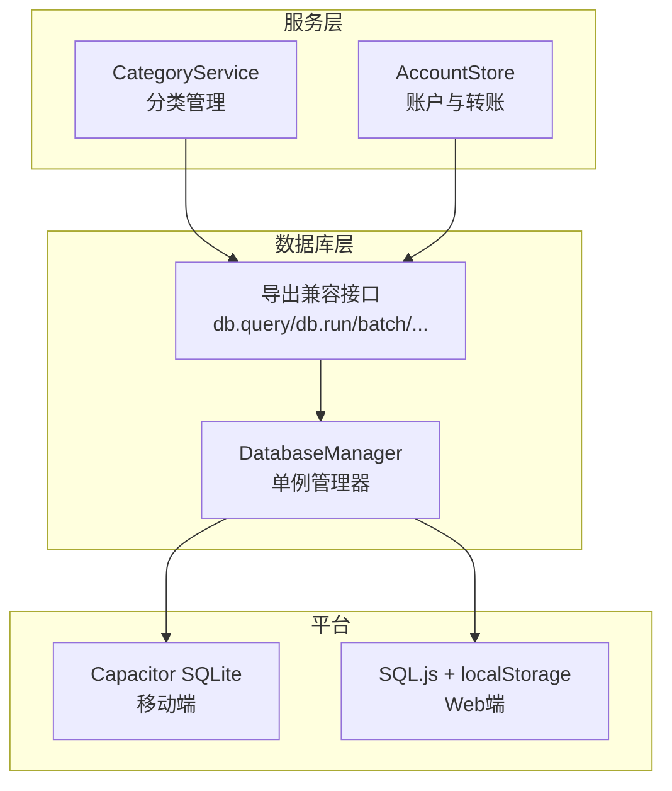
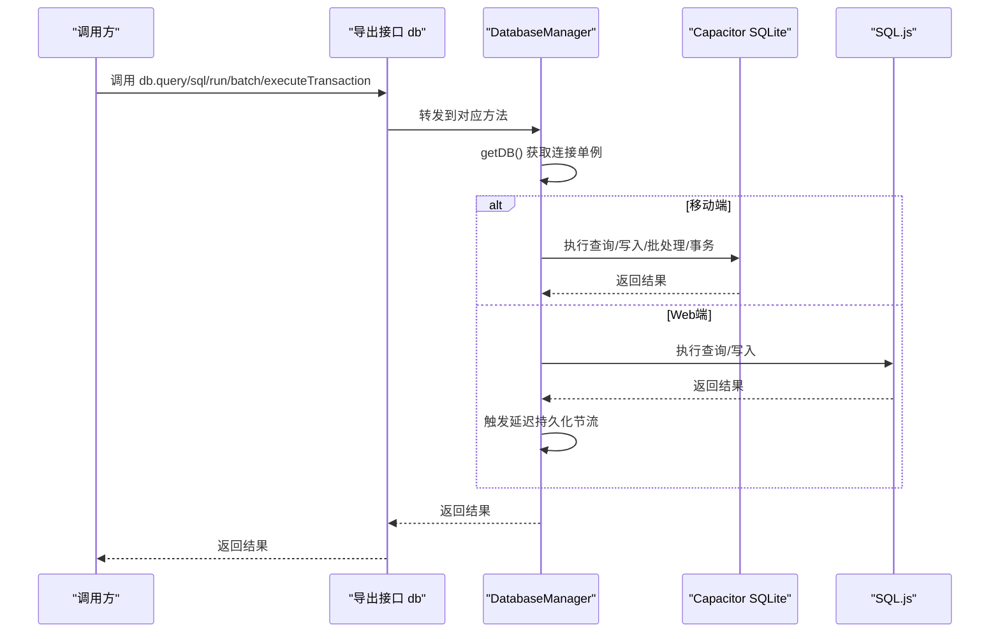
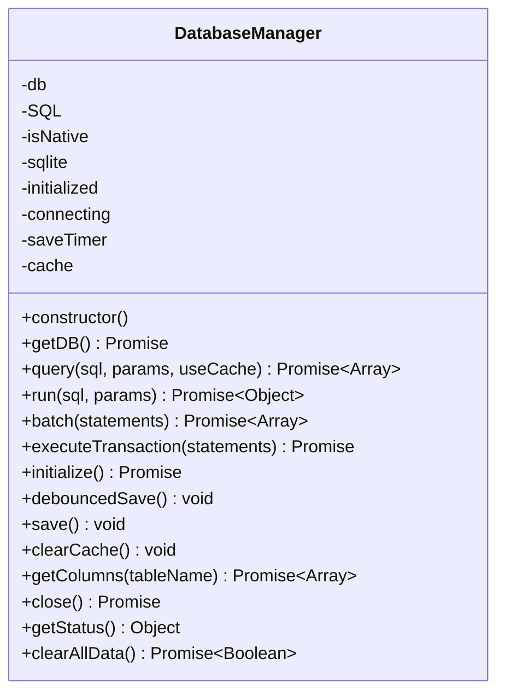
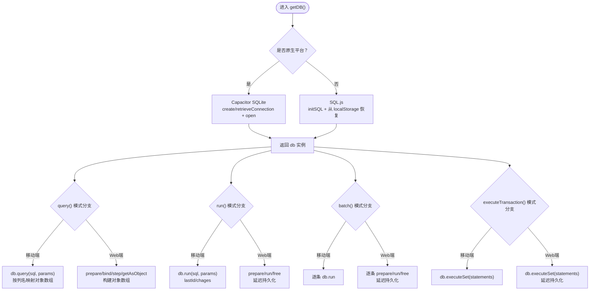
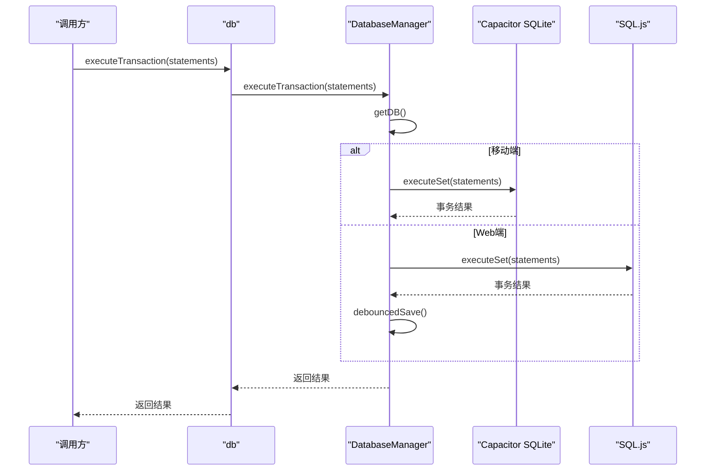
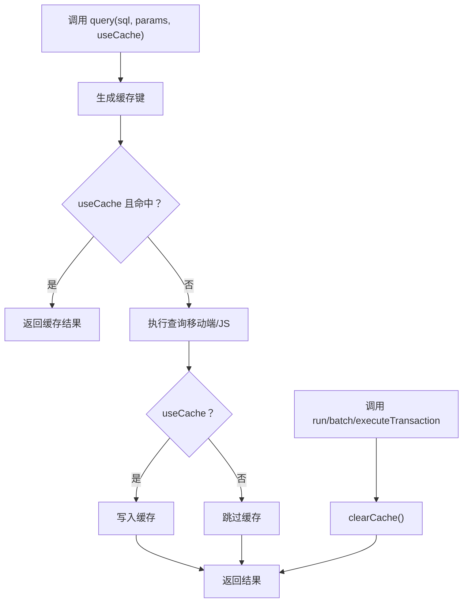
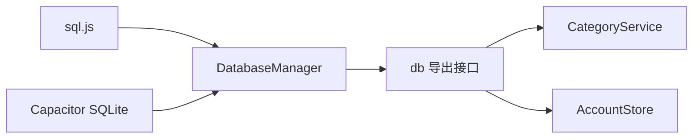

# 数据库API

<cite>
**本文引用的文件**
- [src/database/index.js](file://src/database/index.js)
- [src/database/adapter.js](file://src/database/adapter.js)
- [src/services/categoryService.ts](file://src/services/categoryService.ts)
- [src/stores/account.ts](file://src/stores/account.ts)
</cite>

## 目录
1. [简介](#简介)
2. [项目结构](#项目结构)
3. [核心组件](#核心组件)
4. [架构总览](#架构总览)
5. [详细组件分析](#详细组件分析)
6. [依赖关系分析](#依赖关系分析)
7. [性能考量](#性能考量)
8. [故障排除指南](#故障排除指南)
9. [结论](#结论)
10. [附录](#附录)

## 简介
本文件系统性梳理 Finance App 的数据库API，重点围绕 DatabaseManager 类及其导出的兼容接口，详细说明以下核心方法：
- getDB()：获取数据库连接（单例）
- query()：执行查询并支持可选查询缓存
- run()：执行写入/修改语句
- batch()：批处理执行多条语句
- executeTransaction()：执行事务（基于底层 executeSet 的自动事务）
- initialize()：初始化数据库表结构与索引
- 其他辅助方法：debouncedSave/save/clearCache/getColumns/close/getStatus/clearAllData

同时，文档对比 Capacitor SQLite（移动端）与 SQL.js（Web端）两种模式下的行为差异，涵盖事务、批处理、查询缓存、持久化策略、错误处理、性能优化与最佳实践，并给出调试与故障排除建议。

## 项目结构
数据库相关代码集中在 src/database 目录，配合服务层与状态层使用：
- src/database/index.js：DatabaseManager 类与导出的兼容接口
- src/database/adapter.js：平台适配器（当前返回统一入口）
- src/services/categoryService.ts：分类服务对数据库API的典型使用示例
- src/stores/account.ts：账户与转账场景中对事务与批量操作的使用示例

图表来源
- [src/database/index.js:893-934](file://src/database/index.js#L893-L934)
- [src/database/adapter.js:14-33](file://src/database/adapter.js#L14-L33)
- [src/services/categoryService.ts:1-260](file://src/services/categoryService.ts#L1-L260)
- [src/stores/account.ts:141-185](file://src/stores/account.ts#L141-L185)

章节来源
- [src/database/index.js:1-935](file://src/database/index.js#L1-L935)
- [src/database/adapter.js:1-34](file://src/database/adapter.js#L1-L34)
- [src/services/categoryService.ts:1-260](file://src/services/categoryService.ts#L1-L260)
- [src/stores/account.ts:141-185](file://src/stores/account.ts#L141-L185)

## 核心组件
- DatabaseManager：负责数据库连接、初始化、CRUD、事务、批处理、缓存与持久化
- 导出兼容接口 db：提供与外部模块一致的 API（connect/query/run/batch/executeTransaction/close/getStatus/clearAllData）

关键能力：
- 单例连接管理：避免重复连接与并发冲突
- 双模式支持：Capacitor SQLite（移动端）与 SQL.js（Web端）
- 查询缓存：query() 支持 useCache 参数
- 延迟持久化：Web端通过节流定时器将数据库导出到 localStorage
- 事务与批处理：executeTransaction() 与 batch() 统一走底层 executeSet/run
- 结构迁移：initialize() 中的建表与字段升级逻辑

章节来源
- [src/database/index.js:21-32](file://src/database/index.js#L21-L32)
- [src/database/index.js:893-934](file://src/database/index.js#L893-L934)

## 架构总览
DatabaseManager 在构造时根据 Capacitor.isNativePlatform() 判断运行环境，分别接入 Capacitor SQLite 或 SQL.js。查询与执行路径在 getDB() 中统一，随后根据 isNative 分支调用底层 API；Web端在执行写入后触发延迟持久化。

图表来源
- [src/database/index.js:56-190](file://src/database/index.js#L56-L190)
- [src/database/index.js:199-309](file://src/database/index.js#L199-L309)
- [src/database/index.js:316-374](file://src/database/index.js#L316-L374)
- [src/database/index.js:379-408](file://src/database/index.js#L379-L408)

## 详细组件分析

### DatabaseManager 类
DatabaseManager 是数据库访问的核心，提供如下公共方法与能力：
- 构造与状态：isNative、db、sqlite、initialized、connecting、cache、saveTimer 等
- getDB()：单例连接获取，移动端使用 Capacitor SQLite，Web端使用 SQL.js 并从 localStorage 恢复
- query(sql, params=[], useCache=false)：查询并可选缓存
- run(sql, params=[])：执行写入/修改
- batch(statements)：批处理执行多条语句
- executeTransaction(statements)：基于 executeSet 的自动事务
- initialize()：建表、索引与结构迁移
- 辅助：debouncedSave()/save()、clearCache()、getColumns()、close()、getStatus()、clearAllData()

图表来源
- [src/database/index.js:21-32](file://src/database/index.js#L21-L32)
- [src/database/index.js:56-190](file://src/database/index.js#L56-L190)
- [src/database/index.js:199-309](file://src/database/index.js#L199-L309)
- [src/database/index.js:316-374](file://src/database/index.js#L316-L374)
- [src/database/index.js:417-776](file://src/database/index.js#L417-L776)
- [src/database/index.js:785-891](file://src/database/index.js#L785-L891)

章节来源
- [src/database/index.js:21-32](file://src/database/index.js#L21-L32)
- [src/database/index.js:56-190](file://src/database/index.js#L56-L190)
- [src/database/index.js:199-309](file://src/database/index.js#L199-L309)
- [src/database/index.js:316-374](file://src/database/index.js#L316-L374)
- [src/database/index.js:417-776](file://src/database/index.js#L417-L776)
- [src/database/index.js:785-891](file://src/database/index.js#L785-L891)

### 导出兼容接口 db
导出的 db 对象提供与外部模块一致的 API，内部转发至 dbManager 实例：
- connect() -> dbManager.initialize()
- query(sql, params=[], useCache=false)
- run(sql, params=[])
- batch(statements)
- executeTransaction(callback)
- close() -> dbManager.close()
- getStatus() -> dbManager.getStatus()
- clearAllData() -> dbManager.clearAllData()

章节来源
- [src/database/index.js:893-934](file://src/database/index.js#L893-L934)

### 方法签名与行为说明

#### getDB()
- 功能：获取数据库连接（单例），移动端使用 Capacitor SQLite，Web端使用 SQL.js 并尝试从 localStorage 恢复
- 返回：Promise，解析为数据库连接实例
- 并发控制：内部通过 connecting 标志避免重复连接
- 错误处理：捕获连接异常并抛出带明确信息的错误

章节来源
- [src/database/index.js:56-190](file://src/database/index.js#L56-L190)

#### query(sql, params=[], useCache=false)
- 功能：执行查询，支持可选查询缓存
- 参数：
  - sql：SQL 查询语句
  - params：查询参数数组（位置参数）
  - useCache：是否使用查询缓存
- 返回：查询结果数组（对象数组）
- 行为差异：
  - 移动端：底层返回值可能已是对象数组，若非则按列名映射为对象
  - Web端：SQL.js prepare/bind/step/getAsObject 循环构建对象数组
- 缓存：命中缓存直接返回，否则执行后写入缓存

章节来源
- [src/database/index.js:199-264](file://src/database/index.js#L199-L264)

#### run(sql, params=[])
- 功能：执行写入/修改语句
- 参数：
  - sql：SQL 语句
  - params：参数数组（位置参数）
- 返回：包含 lastID 与 changes 的对象
- 行为差异：
  - 移动端：使用底层 run，返回 lastId/chages
  - Web端：SQL.js prepare/run/free，返回固定占位值并触发延迟持久化
- 后置处理：清除查询缓存

章节来源
- [src/database/index.js:272-309](file://src/database/index.js#L272-L309)

#### batch(statements)
- 功能：批处理执行多条语句
- 参数：statements 数组，每项包含 sql 与 params
- 返回：每条语句执行结果组成的数组
- 行为差异：
  - 移动端：逐条 db.run，收集 lastId/chages
  - Web端：逐条 prepare/run/free，完成后触发延迟持久化
- 后置处理：清除查询缓存

章节来源
- [src/database/index.js:316-347](file://src/database/index.js#L316-L347)

#### executeTransaction(statements)
- 功能：执行事务（底层使用 executeSet，默认开启事务）
- 参数：statements（Capacitor SQLite 的 set 格式）
- 返回：底层 executeSet 的返回值
- 行为差异：Web端执行后触发延迟持久化
- 后置处理：清除查询缓存

章节来源
- [src/database/index.js:354-374](file://src/database/index.js#L354-L374)

#### initialize()
- 功能：初始化数据库表结构与索引，并进行结构迁移
- 行为：建表、索引、字段升级（如 stocks/funds 新增字段）
- 注意：幂等设计，已初始化则直接返回

章节来源
- [src/database/index.js:420-776](file://src/database/index.js#L420-L776)

#### 辅助方法
- debouncedSave()：Web端节流持久化（默认 1000ms）
- save()：将数据库导出为字节数组并写入 localStorage
- clearCache()：清空查询缓存
- getColumns(tableName)：通过 PRAGMA table_info 获取列名
- close()：关闭连接并清理资源（含定时器）
- getStatus()：返回 isNative、connected、initialized、connecting、cacheSize
- clearAllData()：使用事务删除所有业务表数据

章节来源
- [src/database/index.js:379-408](file://src/database/index.js#L379-L408)
- [src/database/index.js:413](file://src/database/index.js#L413)
- [src/database/index.js:785-788](file://src/database/index.js#L785-L788)
- [src/database/index.js:793-821](file://src/database/index.js#L793-L821)
- [src/database/index.js:826-834](file://src/database/index.js#L826-L834)
- [src/database/index.js:839-890](file://src/database/index.js#L839-L890)

### 数据库模式差异（Capacitor SQLite vs SQL.js）

图表来源
- [src/database/index.js:56-190](file://src/database/index.js#L56-L190)
- [src/database/index.js:199-264](file://src/database/index.js#L199-L264)
- [src/database/index.js:272-309](file://src/database/index.js#L272-L309)
- [src/database/index.js:316-374](file://src/database/index.js#L316-L374)

章节来源
- [src/database/index.js:56-190](file://src/database/index.js#L56-L190)
- [src/database/index.js:199-264](file://src/database/index.js#L199-L264)
- [src/database/index.js:272-309](file://src/database/index.js#L272-L309)
- [src/database/index.js:316-374](file://src/database/index.js#L316-L374)

### 事务处理与批处理流程

图表来源
- [src/database/index.js:354-374](file://src/database/index.js#L354-L374)

章节来源
- [src/database/index.js:354-374](file://src/database/index.js#L354-L374)

### 查询缓存与持久化策略

图表来源
- [src/database/index.js:199-264](file://src/database/index.js#L199-L264)
- [src/database/index.js:316-374](file://src/database/index.js#L316-L374)
- [src/database/index.js:413](file://src/database/index.js#L413)

章节来源
- [src/database/index.js:199-264](file://src/database/index.js#L199-L264)
- [src/database/index.js:316-374](file://src/database/index.js#L316-L374)
- [src/database/index.js:413](file://src/database/index.js#L413)

## 依赖关系分析
- 外部依赖：sql.js、@capacitor/core、@capacitor-community/sqlite
- 内部依赖：dbManager 作为单例，导出 db 作为统一接口
- 服务层依赖：CategoryService、AccountStore 通过 db 调用数据库API

图表来源
- [src/database/index.js:8-10](file://src/database/index.js#L8-L10)
- [src/database/index.js:893-934](file://src/database/index.js#L893-L934)
- [src/services/categoryService.ts:1](file://src/services/categoryService.ts#L1)
- [src/stores/account.ts:1](file://src/stores/account.ts#L1)

章节来源
- [src/database/index.js:8-10](file://src/database/index.js#L8-L10)
- [src/database/index.js:893-934](file://src/database/index.js#L893-L934)
- [src/services/categoryService.ts:1](file://src/services/categoryService.ts#L1)
- [src/stores/account.ts:1](file://src/stores/account.ts#L1)

## 性能考量
- 连接管理：单例连接避免重复打开，避免并发竞争
- 查询缓存：query() 的 useCache 可显著降低重复查询成本
- 批处理：batch() 与 executeTransaction() 统一走底层执行，减少往返
- 索引优化：initialize() 中为高频查询字段建立索引
- Web端持久化节流：debouncedSave() 将频繁写入合并为定时持久化，降低 localStorage 写入频率
- 资源清理：close() 中清理缓存与定时器，防止内存泄漏

章节来源
- [src/database/index.js:13-18](file://src/database/index.js#L13-L18)
- [src/database/index.js:417-776](file://src/database/index.js#L417-L776)
- [src/database/index.js:379-408](file://src/database/index.js#L379-L408)
- [src/database/index.js:793-821](file://src/database/index.js#L793-L821)

## 故障排除指南
常见问题与处理建议：
- 连接失败
  - 现象：getDB() 抛出错误
  - 排查：检查 isNative 判断、Capacitor SQLite 插件可用性、localStorage 权限（Web端）
  - 参考：[src/database/index.js:56-190](file://src/database/index.js#L56-L190)
- 查询异常
  - 现象：query() 抛出“SQL查询失败”
  - 排查：确认 SQL 语法、参数绑定顺序（位置参数）、表结构
  - 参考：[src/database/index.js:199-264](file://src/database/index.js#L199-L264)
- 写入/批处理异常
  - 现象：run()/batch() 抛出“SQL执行失败”
  - 排查：检查约束、外键、事务中某条语句失败导致整体回滚
  - 参考：[src/database/index.js:272-309](file://src/database/index.js#L272-L309)，[src/database/index.js:316-347](file://src/database/index.js#L316-L347)
- 事务回滚
  - 现象：executeTransaction() 抛错
  - 排查：查看底层 executeSet 返回值与异常栈，必要时降级为多条 run
  - 参考：[src/database/index.js:354-374](file://src/database/index.js#L354-L374)
- Web端持久化丢失
  - 现象：刷新后数据消失
  - 排查：检查 localStorage 存储、debouncedSave() 是否被触发、save() 是否成功
  - 参考：[src/database/index.js:379-408](file://src/database/index.js#L379-L408)
- 缓存脏读
  - 现象：更新后查询仍返回旧结果
  - 排查：确认 run/batch/executeTransaction 后是否调用 clearCache()
  - 参考：[src/database/index.js:302](file://src/database/index.js#L302)，[src/database/index.js:340](file://src/database/index.js#L340)，[src/database/index.js:413](file://src/database/index.js#L413)

章节来源
- [src/database/index.js:56-190](file://src/database/index.js#L56-L190)
- [src/database/index.js:199-264](file://src/database/index.js#L199-L264)
- [src/database/index.js:272-309](file://src/database/index.js#L272-L309)
- [src/database/index.js:316-347](file://src/database/index.js#L316-L347)
- [src/database/index.js:354-374](file://src/database/index.js#L354-L374)
- [src/database/index.js:379-408](file://src/database/index.js#L379-L408)
- [src/database/index.js:413](file://src/database/index.js#L413)

## 结论
DatabaseManager 提供了跨平台、高性能、易用的数据库访问能力，通过单例连接、查询缓存、批处理与事务封装，简化了 CRUD 与复杂业务场景的实现。开发者应优先使用导出的 db 接口，遵循参数绑定规范与事务/批处理的最佳实践，结合性能配置与调试工具，确保在移动端与 Web 端的一致体验与稳定性。

## 附录

### 使用示例（路径参考）
- 查询分类列表：[src/services/categoryService.ts:26](file://src/services/categoryService.ts#L26)
- 按 ID 查询分类：[src/services/categoryService.ts:78-94](file://src/services/categoryService.ts#L78-L94)
- 创建分类：[src/services/categoryService.ts:104-113](file://src/services/categoryService.ts#L104-L113)
- 更新分类：[src/services/categoryService.ts:151-160](file://src/services/categoryService.ts#L151-L160)
- 删除分类：[src/services/categoryService.ts:169-175](file://src/services/categoryService.ts#L169-L175)
- 检查数据库状态：[src/services/categoryService.ts:184-194](file://src/services/categoryService.ts#L184-L194)
- 初始化默认分类：[src/services/categoryService.ts:248-253](file://src/services/categoryService.ts#L248-L253)
- 账户余额调整（事务）：[src/stores/account.ts:163-177](file://src/stores/account.ts#L163-L177)
- 账户转账（手动事务）：[src/stores/account.ts:217-244](file://src/stores/account.ts#L217-L244)