# 服务API

<cite>
**本文档引用的文件**
- [src/services/account/accountService.ts](file://src/services/account/accountService.ts)
- [src/services/asset/assetService.ts](file://src/services/asset/assetService.ts)
- [src/services/asset/fundService.ts](file://src/services/asset/fundService.ts)
- [src/services/asset/stockService.ts](file://src/services/asset/stockService.ts)
- [src/services/categoryService.ts](file://src/services/categoryService.ts)
- [src/services/liability/liabilityService.ts](file://src/services/liability/liabilityService.ts)
- [src/database/index.js](file://src/database/index.js)
- [src/types/account/account.ts](file://src/types/account/account.ts)
- [src/types/asset/asset.ts](file://src/types/asset/asset.ts)
- [src/types/asset/fund.ts](file://src/types/asset/fund.ts)
- [src/types/asset/stock.ts](file://src/types/asset/stock.ts)
- [src/types/liability/liability.ts](file://src/types/liability/liability.ts)
- [src/utils/calculations.ts](file://src/utils/calculations.ts)
- [src/data/categories.ts](file://src/data/categories.ts)
- [package.json](file://package.json)
</cite>

## 目录
1. [简介](#简介)
2. [项目结构](#项目结构)
3. [核心组件](#核心组件)
4. [架构概览](#架构概览)
5. [详细组件分析](#详细组件分析)
6. [依赖关系分析](#依赖关系分析)
7. [性能考虑](#性能考虑)
8. [故障排除指南](#故障排除指南)
9. [结论](#结论)

## 简介

这是一个基于Vue 3和TypeScript构建的财务管理应用程序，提供完整的个人财务管理和投资跟踪功能。该应用支持多平台部署（Web、Electron、移动端），采用SQLite数据库进行数据持久化，实现了账户管理、资产管理、投资组合跟踪、负债管理和分类系统等核心功能。

## 项目结构

该项目采用模块化架构设计，主要分为以下几个核心模块：

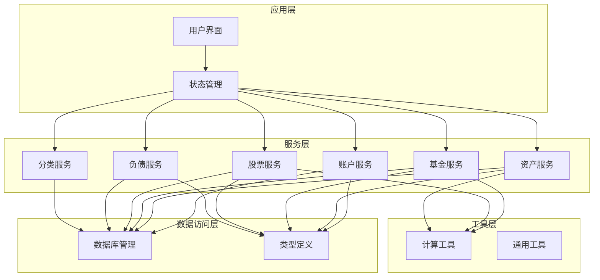

**图表来源**
- [src/services/account/accountService.ts:1-221](file://src/services/account/accountService.ts#L1-L221)
- [src/services/asset/assetService.ts:1-165](file://src/services/asset/assetService.ts#L1-L165)
- [src/services/asset/fundService.ts:1-508](file://src/services/asset/fundService.ts#L1-L508)
- [src/services/asset/stockService.ts:1-482](file://src/services/asset/stockService.ts#L1-L482)
- [src/services/liability/liabilityService.ts:1-182](file://src/services/liability/liabilityService.ts#L1-L182)
- [src/services/categoryService.ts:1-260](file://src/services/categoryService.ts#L1-L260)

**章节来源**
- [src/services/account/accountService.ts:1-221](file://src/services/account/accountService.ts#L1-L221)
- [src/services/asset/assetService.ts:1-165](file://src/services/asset/assetService.ts#L1-L165)
- [src/services/asset/fundService.ts:1-508](file://src/services/asset/fundService.ts#L1-L508)
- [src/services/asset/stockService.ts:1-482](file://src/services/asset/stockService.ts#L1-L482)
- [src/services/liability/liabilityService.ts:1-182](file://src/services/liability/liabilityService.ts#L1-L182)
- [src/services/categoryService.ts:1-260](file://src/services/categoryService.ts#L1-L260)

## 核心组件

### 数据库管理系统

数据库管理系统是整个应用的核心基础设施，提供了跨平台的数据持久化能力：

- **多平台支持**：同时支持Capacitor SQLite（移动端）和sql.js（Web环境）
- **性能优化**：实现连接池管理、查询缓存、批量操作等功能
- **事务处理**：提供原子性操作保证，确保数据一致性
- **索引优化**：为常用查询字段建立索引提升查询性能

### 服务层架构

每个业务领域都有独立的服务层，遵循单一职责原则：

- **账户服务**：处理银行账户、信用卡等支付工具的管理
- **资产服务**：管理定期收入资产（如租金、利息等）
- **基金服务**：提供完整的基金购买、赎回、持仓管理
- **股票服务**：实现股票交易的完整生命周期管理
- **负债服务**：跟踪各种负债的还款进度
- **分类服务**：维护收支分类体系

**章节来源**
- [src/database/index.js:1-884](file://src/database/index.js#L1-L884)
- [src/services/account/accountService.ts:1-221](file://src/services/account/accountService.ts#L1-L221)
- [src/services/asset/assetService.ts:1-165](file://src/services/asset/assetService.ts#L1-L165)
- [src/services/asset/fundService.ts:1-508](file://src/services/asset/fundService.ts#L1-L508)
- [src/services/asset/stockService.ts:1-482](file://src/services/asset/stockService.ts#L1-L482)
- [src/services/liability/liabilityService.ts:1-182](file://src/services/liability/liabilityService.ts#L1-L182)
- [src/services/categoryService.ts:1-260](file://src/services/categoryService.ts#L1-L260)

## 架构概览

应用采用分层架构设计，确保各层之间的清晰分离和职责明确：

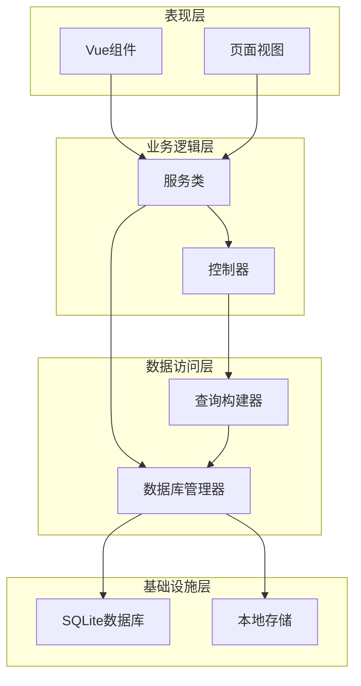

**图表来源**
- [src/database/index.js:21-374](file://src/database/index.js#L21-L374)
- [src/services/account/accountService.ts:6-8](file://src/services/account/accountService.ts#L6-L8)
- [src/services/asset/fundService.ts:6-16](file://src/services/asset/fundService.ts#L6-L16)

### 数据模型关系

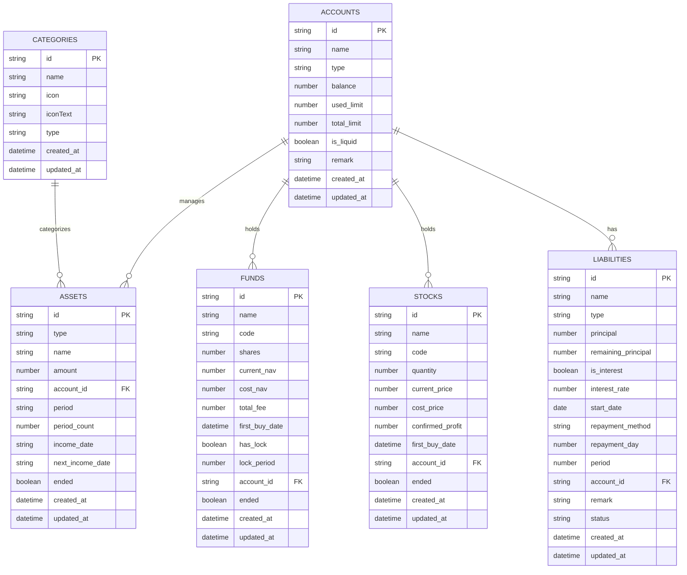

**图表来源**
- [src/database/index.js:434-696](file://src/database/index.js#L434-L696)
- [src/types/account/account.ts:6-17](file://src/types/account/account.ts#L6-L17)
- [src/types/asset/asset.ts:6-19](file://src/types/asset/asset.ts#L6-L19)
- [src/types/asset/fund.ts:6-21](file://src/types/asset/fund.ts#L6-L21)
- [src/types/asset/stock.ts:6-19](file://src/types/asset/stock.ts#L6-L19)
- [src/types/liability/liability.ts:6-23](file://src/types/liability/liability.ts#L6-L23)

## 详细组件分析

### 账户服务分析

账户服务提供了完整的账户生命周期管理功能：

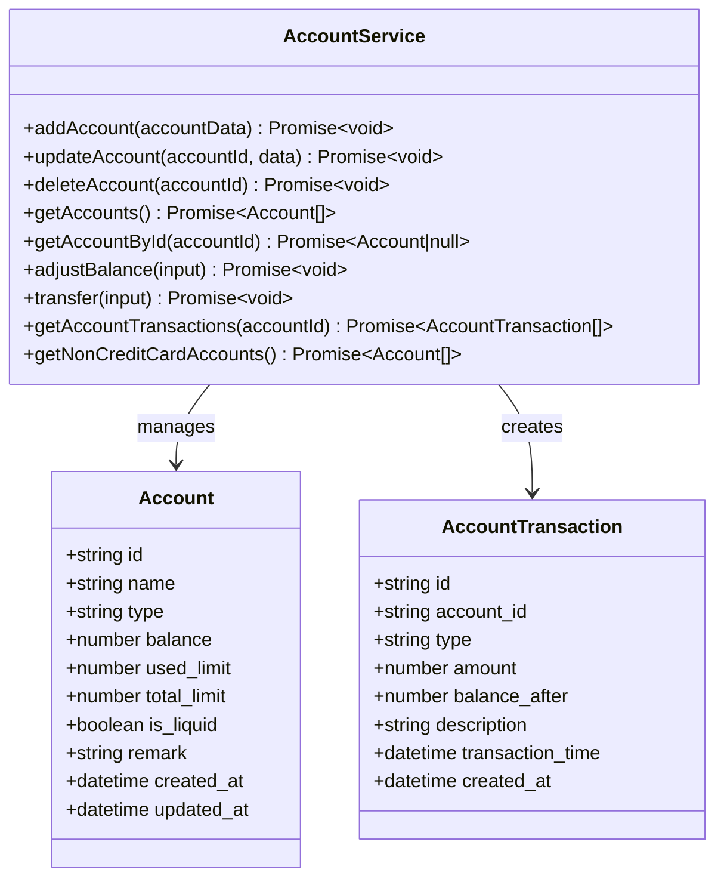

**图表来源**
- [src/services/account/accountService.ts:12-221](file://src/services/account/accountService.ts#L12-L221)
- [src/types/account/account.ts:6-29](file://src/types/account/account.ts#L6-L29)

#### 余额调整流程

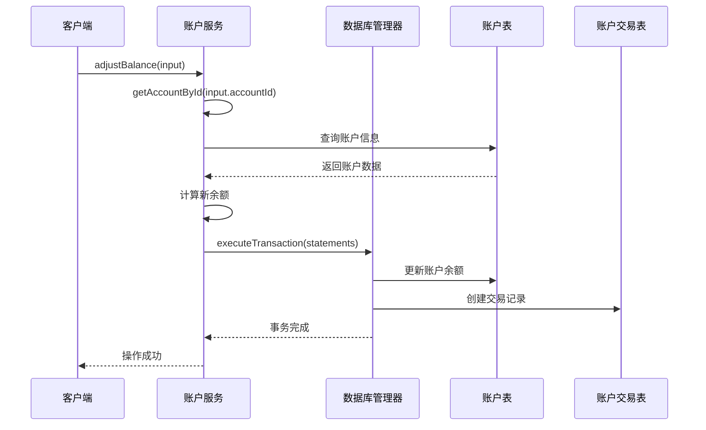

**图表来源**
- [src/services/account/accountService.ts:102-134](file://src/services/account/accountService.ts#L102-L134)

**章节来源**
- [src/services/account/accountService.ts:1-221](file://src/services/account/accountService.ts#L1-L221)
- [src/types/account/account.ts:1-57](file://src/types/account/account.ts#L1-L57)

### 基金服务分析

基金服务实现了复杂的金融产品管理：

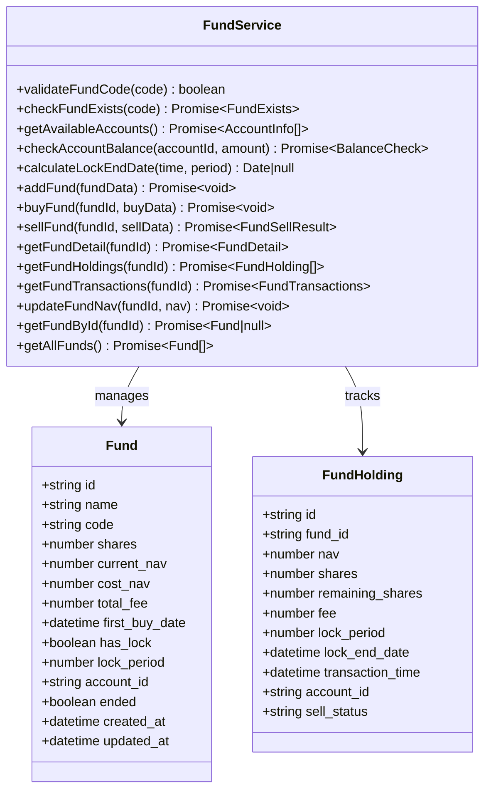

**图表来源**
- [src/services/asset/fundService.ts:71-508](file://src/services/asset/fundService.ts#L71-L508)
- [src/types/asset/fund.ts:6-105](file://src/types/asset/fund.ts#L6-L105)

#### 基金购买流程

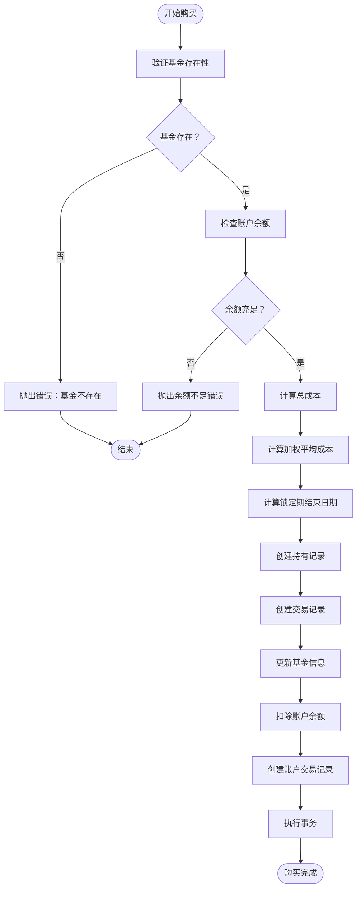

**图表来源**
- [src/services/asset/fundService.ts:169-264](file://src/services/asset/fundService.ts#L169-L264)

**章节来源**
- [src/services/asset/fundService.ts:1-508](file://src/services/asset/fundService.ts#L1-L508)
- [src/types/asset/fund.ts:1-105](file://src/types/asset/fund.ts#L1-L105)
- [src/utils/calculations.ts:1-102](file://src/utils/calculations.ts#L1-L102)

### 股票服务分析

股票服务提供了完整的股票交易管理功能：

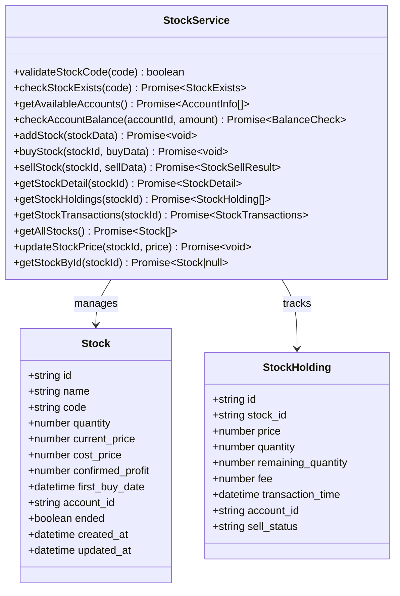

**图表来源**
- [src/services/asset/stockService.ts:61-482](file://src/services/asset/stockService.ts#L61-L482)
- [src/types/asset/stock.ts:6-95](file://src/types/asset/stock.ts#L6-L95)

#### 股票卖出算法

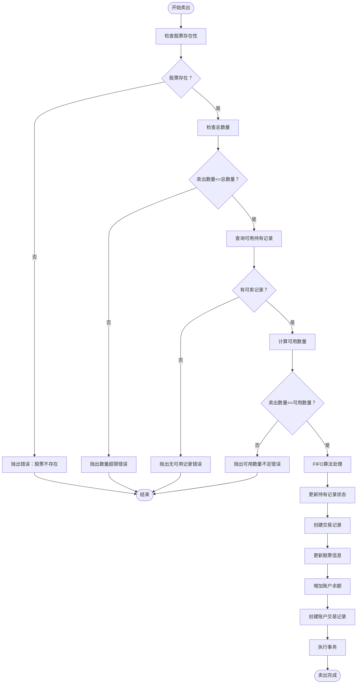

**图表来源**
- [src/services/asset/stockService.ts:249-373](file://src/services/asset/stockService.ts#L249-L373)

**章节来源**
- [src/services/asset/stockService.ts:1-482](file://src/services/asset/stockService.ts#L1-L482)
- [src/types/asset/stock.ts:1-95](file://src/types/asset/stock.ts#L1-L95)
- [src/utils/calculations.ts:1-102](file://src/utils/calculations.ts#L1-L102)

### 负债服务分析

负债服务管理各种类型的债务：

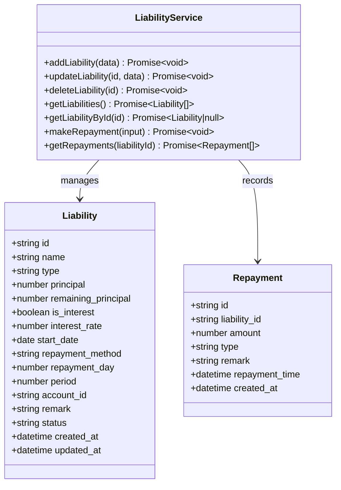

**图表来源**
- [src/services/liability/liabilityService.ts:12-182](file://src/services/liability/liabilityService.ts#L12-L182)
- [src/types/liability/liability.ts:6-34](file://src/types/liability/liability.ts#L6-L34)

**章节来源**
- [src/services/liability/liabilityService.ts:1-182](file://src/services/liability/liabilityService.ts#L1-L182)
- [src/types/liability/liability.ts:1-58](file://src/types/liability/liability.ts#L1-L58)

### 分类服务分析

分类服务提供灵活的收支分类管理：

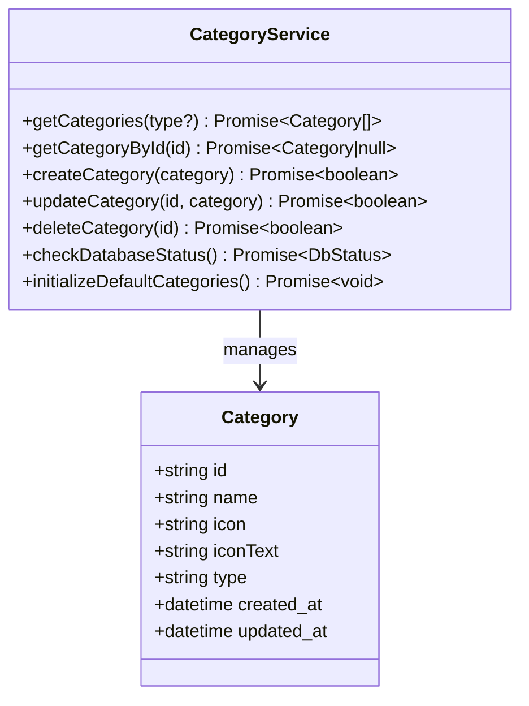

**图表来源**
- [src/services/categoryService.ts:8-260](file://src/services/categoryService.ts#L8-L260)
- [src/data/categories.ts:1-45](file://src/data/categories.ts#L1-L45)

**章节来源**
- [src/services/categoryService.ts:1-260](file://src/services/categoryService.ts#L1-L260)
- [src/data/categories.ts:1-45](file://src/data/categories.ts#L1-L45)

## 依赖关系分析

### 外部依赖

应用使用了现代化的前端技术栈：

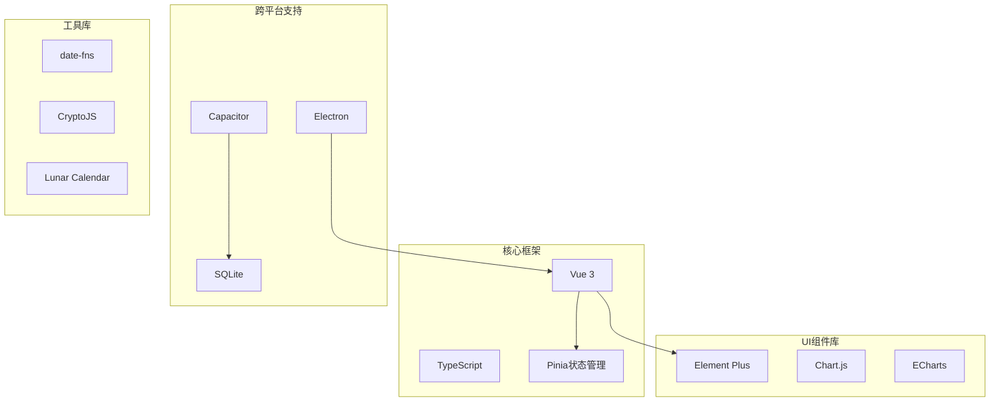

**图表来源**
- [package.json:19-36](file://package.json#L19-L36)

### 内部模块依赖

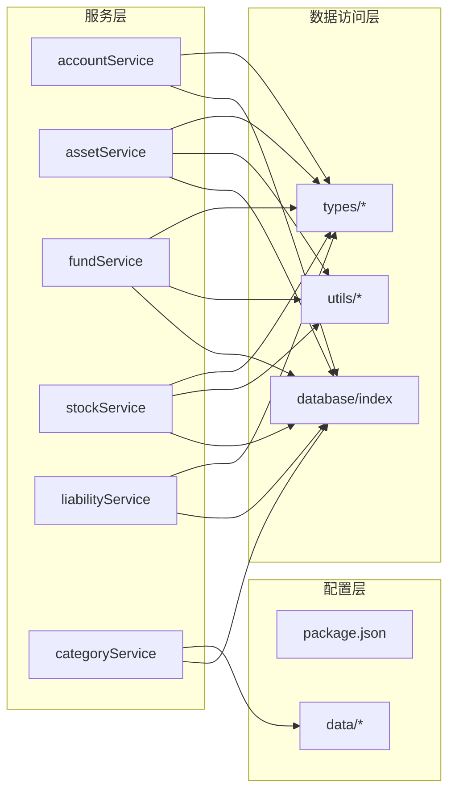

**图表来源**
- [src/services/account/accountService.ts:6-7](file://src/services/account/accountService.ts#L6-L7)
- [src/services/asset/fundService.ts:6-17](file://src/services/asset/fundService.ts#L6-L17)
- [src/services/asset/stockService.ts:6-17](file://src/services/asset/stockService.ts#L6-L17)
- [src/database/index.js:8-10](file://src/database/index.js#L8-L10)
- [src/utils/calculations.ts:1-3](file://src/utils/calculations.ts#L1-L3)

**章节来源**
- [package.json:1-72](file://package.json#L1-L72)

## 性能考虑

### 数据库性能优化

应用采用了多项数据库性能优化策略：

- **连接池管理**：避免频繁创建和销毁数据库连接
- **查询缓存**：对常用查询结果进行缓存，减少重复查询
- **批量操作**：支持批量插入和更新，提升大批量数据处理效率
- **索引优化**：为高频查询字段建立索引
- **事务处理**：使用事务确保数据一致性，避免部分更新

### 前端性能优化

- **懒加载**：组件按需加载，减少初始包大小
- **虚拟滚动**：大数据列表使用虚拟滚动提升渲染性能
- **防抖节流**：输入框和搜索功能使用防抖节流优化用户体验
- **响应式设计**：适配不同屏幕尺寸，提升移动端体验

### 移动端优化

- **原生性能**：使用Capacitor实现接近原生的性能表现
- **离线支持**：SQLite数据库支持离线数据访问
- **后台同步**：支持后台数据同步和推送通知

## 故障排除指南

### 数据库连接问题

**常见问题**：应用启动时数据库连接失败

**解决方案**：
1. 检查数据库初始化是否完成
2. 验证数据库文件权限
3. 确认SQLite驱动正确安装
4. 查看控制台错误日志

**章节来源**
- [src/database/index.js:184-190](file://src/database/index.js#L184-L190)

### 事务执行失败

**常见问题**：购买或转账操作部分成功

**解决方案**：
1. 检查事务中的每条SQL语句
2. 验证外键约束是否满足
3. 确认数据类型匹配
4. 查看具体的错误信息

**章节来源**
- [src/database/index.js:354-374](file://src/database/index.js#L354-L374)

### 业务逻辑错误

**常见问题**：余额不足、数量超限等业务规则错误

**解决方案**：
1. 检查输入参数的有效性
2. 验证账户余额和可用数量
3. 确认交易时间的合法性
4. 查看服务层的错误提示

**章节来源**
- [src/services/asset/fundService.ts:178-181](file://src/services/asset/fundService.ts#L178-L181)
- [src/services/asset/stockService.ts:163-166](file://src/services/asset/stockService.ts#L163-L166)

## 结论

这个财务应用展现了现代前端应用的最佳实践，具有以下特点：

**技术优势**：
- 采用模块化架构，职责清晰，易于维护
- 支持多平台部署，适应不同的使用场景
- 实现了完整的财务管理和投资跟踪功能
- 注重性能优化和用户体验

**业务价值**：
- 提供了全面的个人财务管理解决方案
- 支持多种投资产品的跟踪和管理
- 界面友好，操作简便
- 数据安全可靠，支持离线使用

**扩展性**：
- 模块化设计便于功能扩展
- 类型系统确保代码质量
- 跨平台架构支持未来平台扩展

该应用为个人财务管理提供了专业级的解决方案，适合不同技术水平的用户使用和二次开发。