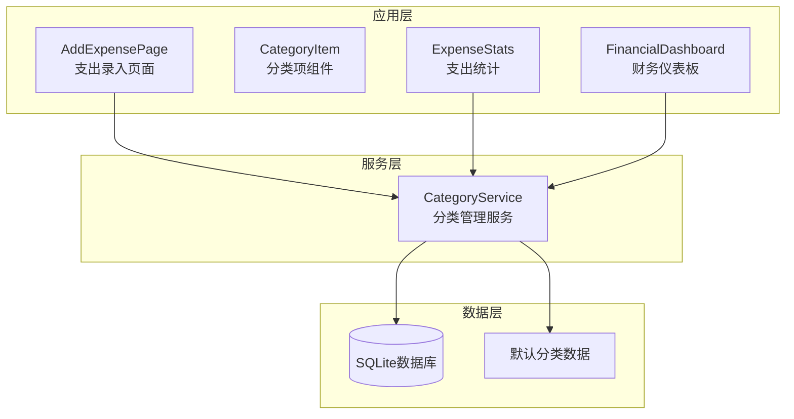
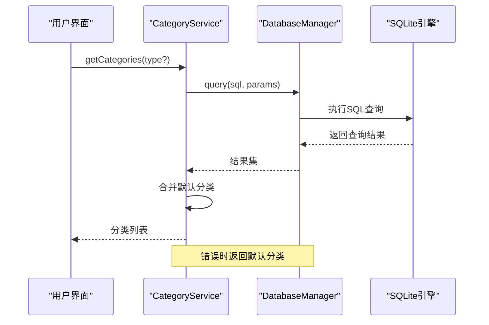
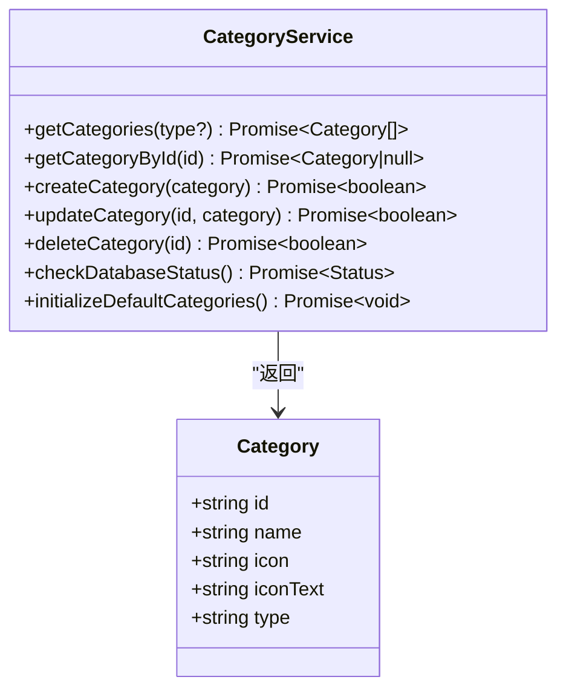
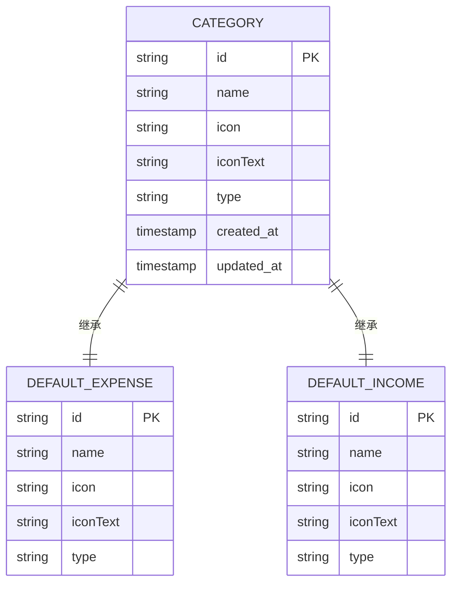
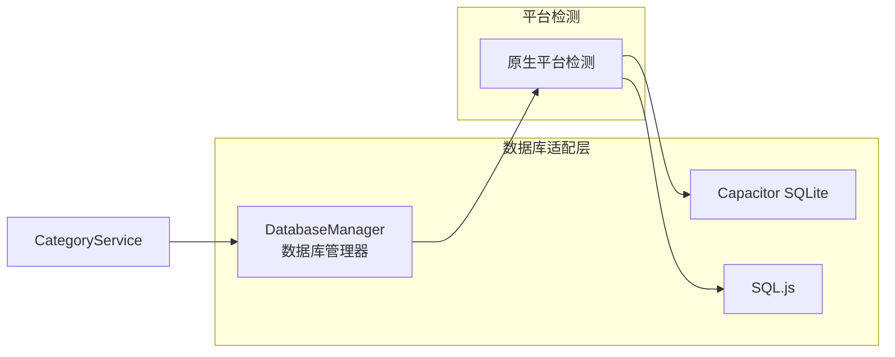
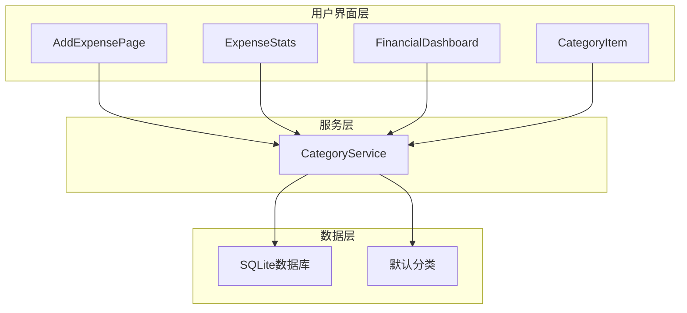

# 服务API

<cite>
**本文档引用的文件**
- [categoryService.ts](file://src/services/categoryService.ts)
- [categories.ts](file://src/data/categories.ts)
- [index.js](file://src/database/index.js)
- [adapter.js](file://src/database/adapter.js)
- [AddExpensePage.vue](file://src/components/mobile/expense/AddExpensePage.vue)
- [CategoryItem.vue](file://src/components/mobile/expense/CategoryItem.vue)
- [ExpenseStats.vue](file://src/components/mobile/expense/ExpenseStats.vue)
- [FinancialDashboard.vue](file://src/components/mobile/financial/FinancialDashboard.vue)
- [package.json](file://package.json)
</cite>

## 目录
1. [简介](#简介)
2. [项目结构](#项目结构)
3. [核心组件](#核心组件)
4. [架构概览](#架构概览)
5. [详细组件分析](#详细组件分析)
6. [依赖分析](#依赖分析)
7. [性能考虑](#性能考虑)
8. [故障排除指南](#故障排除指南)
9. [结论](#结论)
10. [附录](#附录)

## 简介
本文档详细说明了业务服务API中的分类管理服务，重点涵盖categoryService.ts中的分类管理API，包括分类的增删改查操作、分类树结构管理、分类统计等功能。文档为每个服务方法提供了详细的接口规范，包括参数类型、返回值结构、错误码定义等。同时解释了服务层的设计模式和业务逻辑封装，提供了服务调用的最佳实践和性能考虑，说明了与其他模块的集成方式和依赖关系，并包含了服务层的单元测试方法和验证指南。

## 项目结构
该项目采用Vue 3 + TypeScript + Vite的现代前端架构，主要目录结构如下：
- `src/services/` - 业务服务层，包含各种业务逻辑服务
- `src/database/` - 数据库抽象层，提供跨平台数据库访问
- `src/data/` - 数据模型定义和静态数据
- `src/components/` - Vue组件，包含移动端界面
- `src/stores/` - Pinia状态管理
- `src/utils/` - 工具函数和字典数据



**图表来源**
- [categoryService.ts:1-260](file://src/services/categoryService.ts#L1-L260)
- [index.js:1-935](file://src/database/index.js#L1-L935)

**章节来源**
- [categoryService.ts:1-260](file://src/services/categoryService.ts#L1-L260)
- [categories.ts:1-45](file://src/data/categories.ts#L1-L45)
- [index.js:1-935](file://src/database/index.js#L1-L935)

## 核心组件
分类管理服务是整个财务应用的核心业务组件，负责处理所有分类相关的业务逻辑。该服务采用静态类设计模式，提供完整的CRUD操作能力。

### 主要特性
- **统一的数据源管理**：结合数据库存储和默认分类数据
- **类型安全**：完整的TypeScript接口定义
- **错误处理**：完善的异常捕获和降级策略
- **性能优化**：数据库连接管理和查询缓存

**章节来源**
- [categoryService.ts:8-260](file://src/services/categoryService.ts#L8-L260)

## 架构概览
分类管理服务采用分层架构设计，通过数据库抽象层实现跨平台兼容性。



**图表来源**
- [categoryService.ts:14-69](file://src/services/categoryService.ts#L14-L69)
- [index.js:199-264](file://src/database/index.js#L199-L264)

## 详细组件分析

### CategoryService 类设计
CategoryService采用静态类设计，提供以下核心方法：



**图表来源**
- [categoryService.ts:8-260](file://src/services/categoryService.ts#L8-L260)
- [categories.ts:1-7](file://src/data/categories.ts#L1-L7)

#### getCategories 方法
获取所有分类的完整接口规范：

**方法签名**
```typescript
static async getCategories(type?: string): Promise<Category[]>
```

**参数说明**
- `type` (可选): 分类类型，支持 'expense' 或 'income'

**返回值**
- `Category[]`: 分类对象数组，包含合并后的默认分类和数据库分类

**业务逻辑**
1. 从数据库查询所有分类记录
2. 合并默认分类数据（支出和收入两类）
3. 使用Map去重，确保数据库中的分类优先
4. 可选按类型过滤结果

**错误处理**
- 数据库查询失败时返回默认分类
- 控制台输出详细错误信息

**章节来源**
- [categoryService.ts:14-69](file://src/services/categoryService.ts#L14-L69)

#### getCategoryById 方法
根据ID获取单个分类：

**方法签名**
```typescript
static async getCategoryById(id: string): Promise<Category | null>
```

**参数说明**
- `id`: 分类唯一标识符

**返回值**
- `Category | null`: 找到返回分类对象，未找到返回null

**章节来源**
- [categoryService.ts:76-94](file://src/services/categoryService.ts#L76-L94)

#### createCategory 方法
创建新分类：

**方法签名**
```typescript
static async createCategory(category: Omit<Category, 'id'>): Promise<boolean>
```

**参数说明**
- `category`: 分类对象，不包含id字段

**返回值**
- `boolean`: 操作成功返回true，失败返回false

**业务逻辑**
1. 生成唯一ID（cat_时间戳_随机数）
2. 插入数据库记录
3. 自动设置created_at和updated_at时间戳

**章节来源**
- [categoryService.ts:101-113](file://src/services/categoryService.ts#L101-L113)

#### updateCategory 方法
更新现有分类：

**方法签名**
```typescript
static async updateCategory(id: string, category: Partial<Category>): Promise<boolean>
```

**参数说明**
- `id`: 要更新的分类ID
- `category`: 部分分类对象，可包含任意字段

**返回值**
- `boolean`: 操作成功返回true，失败返回false

**业务逻辑**
1. 动态构建UPDATE语句
2. 仅更新提供的字段
3. 自动更新updated_at时间戳
4. 支持部分字段更新

**章节来源**
- [categoryService.ts:121-160](file://src/services/categoryService.ts#L121-L160)

#### deleteCategory 方法
删除分类：

**方法签名**
```typescript
static async deleteCategory(id: string): Promise<boolean>
```

**参数说明**
- `id`: 要删除的分类ID

**返回值**
- `boolean`: 操作成功返回true，失败返回false

**注意事项**
- 删除操作会移除数据库中的分类记录
- 不会影响默认分类数据

**章节来源**
- [categoryService.ts:167-175](file://src/services/categoryService.ts#L167-L175)

#### initializeDefaultCategories 方法
初始化默认分类：

**方法签名**
```typescript
static async initializeDefaultCategories(): Promise<void>
```

**业务逻辑**
1. 检查数据库中是否已有分类记录
2. 如无记录则插入默认分类数据
3. 包含28个预定义分类（17个支出分类 + 11个收入分类）

**默认分类详情**
- **支出分类** (17个): 三餐、零食、衣服、交通、旅行、孩子、宠物、话费网费、烟酒、学习、日用品、住房、美妆、医疗、发红包、汽车/加油、娱乐、请客送礼、电器数码、运动、其它、水电煤
- **收入分类** (11个): 工资、奖金、投资收益、兼职、礼金、其它

**章节来源**
- [categoryService.ts:199-259](file://src/services/categoryService.ts#L199-L259)

### 数据模型定义
分类数据模型采用TypeScript接口定义：



**图表来源**
- [categories.ts:1-45](file://src/data/categories.ts#L1-L45)

**章节来源**
- [categories.ts:1-45](file://src/data/categories.ts#L1-L45)

## 依赖分析

### 数据库集成
分类服务通过数据库抽象层实现跨平台兼容：



**图表来源**
- [index.js:21-32](file://src/database/index.js#L21-L32)
- [adapter.js:14-24](file://src/database/adapter.js#L14-L24)

### 组件集成关系
分类服务在应用中的使用场景：



**图表来源**
- [AddExpensePage.vue:114-228](file://src/components/mobile/expense/AddExpensePage.vue#L114-L228)
- [ExpenseStats.vue:262-294](file://src/components/mobile/expense/ExpenseStats.vue#L262-L294)

**章节来源**
- [AddExpensePage.vue:114-228](file://src/components/mobile/expense/AddExpensePage.vue#L114-L228)
- [ExpenseStats.vue:262-294](file://src/components/mobile/expense/ExpenseStats.vue#L262-L294)

## 性能考虑

### 数据库性能优化
1. **连接池管理**: 单例模式确保单一数据库连接
2. **查询缓存**: 内置Map缓存机制减少重复查询
3. **批量操作**: 支持批量SQL执行和事务处理
4. **索引优化**: 为常用查询字段建立索引

### 缓存策略
- **查询缓存**: 对重复查询结果进行缓存
- **去重机制**: 使用Map确保分类ID唯一性
- **智能降级**: 数据库故障时自动使用默认分类

### 平台适配性能
- **原生平台**: 使用Capacitor SQLite获得最佳性能
- **Web平台**: 使用SQL.js提供浏览器兼容性
- **懒加载**: 数据库连接按需建立

**章节来源**
- [index.js:12-18](file://src/database/index.js#L12-L18)
- [index.js:413-415](file://src/database/index.js#L413-L415)

## 故障排除指南

### 常见问题及解决方案

#### 数据库连接问题
**症状**: 分类加载失败，显示默认分类
**原因**: 数据库连接异常
**解决方法**:
1. 检查数据库初始化状态
2. 验证数据库文件完整性
3. 重新初始化数据库

#### 分类数据不一致
**症状**: 分类显示异常或重复
**原因**: 缓存或去重逻辑问题
**解决方法**:
1. 清除查询缓存
2. 重新加载分类数据
3. 检查数据库约束

#### 平台兼容性问题
**症状**: 在某些平台上无法正常工作
**原因**: 平台特定的数据库实现差异
**解决方法**:
1. 检查平台检测逻辑
2. 验证数据库适配器配置
3. 测试不同平台的兼容性

### 调试工具
1. **控制台日志**: 详细的错误信息输出
2. **状态检查**: 数据库连接状态监控
3. **性能监控**: 查询执行时间和缓存命中率

**章节来源**
- [categoryService.ts:61-68](file://src/services/categoryService.ts#L61-L68)
- [categoryService.ts:181-194](file://src/services/categoryService.ts#L181-L194)

## 结论
分类管理服务提供了完整的分类生命周期管理能力，通过统一的服务接口实现了数据的一致性和可靠性。服务采用现代化的设计模式，具有良好的可扩展性和维护性。通过合理的错误处理和性能优化，确保了在不同平台和环境下的稳定运行。

## 附录

### API使用示例
以下是一些常见的使用场景：

#### 获取所有分类
```typescript
// 获取所有分类
const allCategories = await CategoryService.getCategories()

// 获取支出分类
const expenseCategories = await CategoryService.getCategories('expense')

// 获取收入分类
const incomeCategories = await CategoryService.getCategories('income')
```

#### 创建新分类
```typescript
const newCategory = {
  name: '新分类名称',
  icon: 'icon-class',
  iconText: '📝',
  type: 'expense'
}

const success = await CategoryService.createCategory(newCategory)
```

#### 更新分类
```typescript
const success = await CategoryService.updateCategory('cat_123', {
  name: '更新后的名称',
  icon: 'updated-icon'
})
```

### 最佳实践建议
1. **错误处理**: 始终检查方法返回值
2. **数据验证**: 在调用前验证输入参数
3. **缓存策略**: 合理使用查询缓存
4. **平台适配**: 考虑不同平台的性能差异
5. **异步处理**: 正确处理异步操作和错误

### 扩展开发指导
1. **新增分类类型**: 修改默认分类数据和业务逻辑
2. **自定义图标系统**: 扩展icon和iconText字段
3. **分类权限控制**: 添加用户级别的分类管理
4. **批量操作**: 实现分类的批量导入导出功能

**章节来源**
- [categoryService.ts:14-259](file://src/services/categoryService.ts#L14-L259)