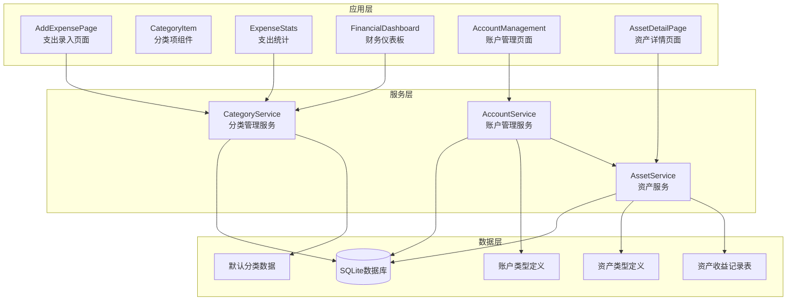
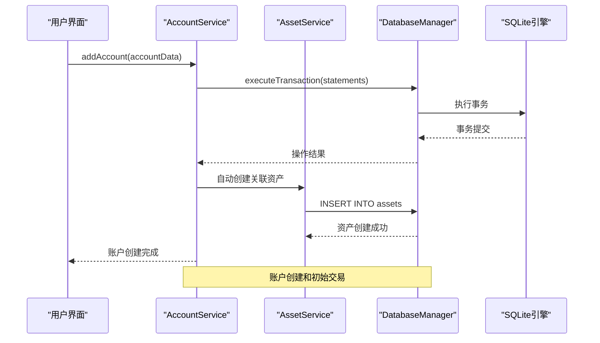
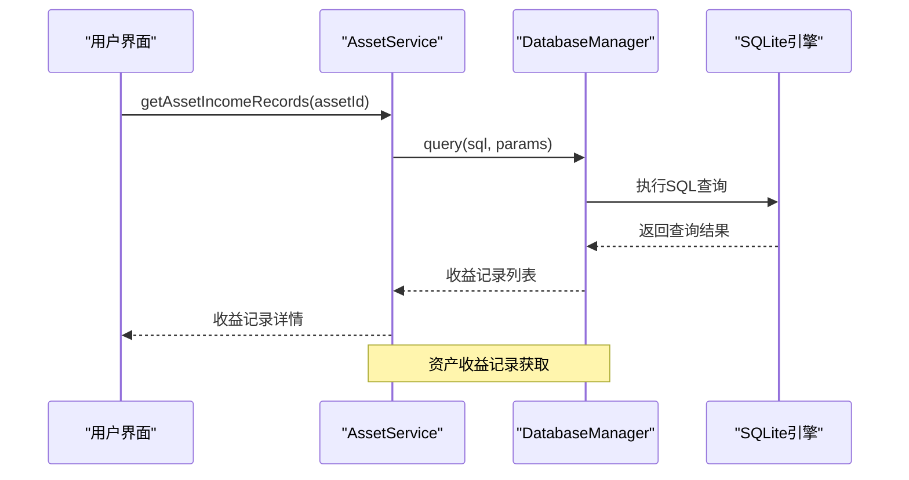
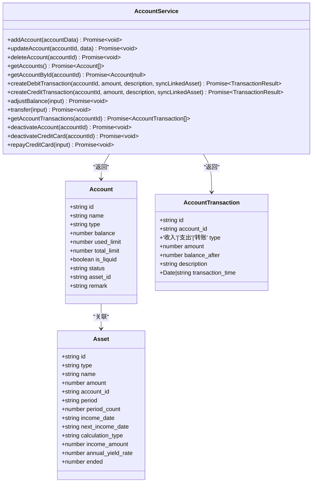
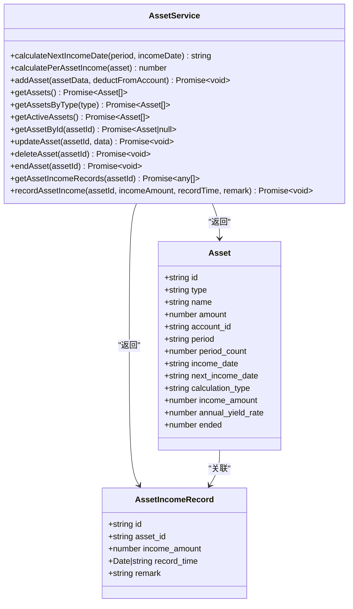
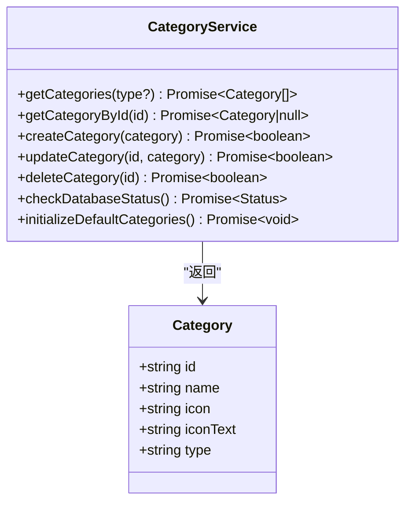
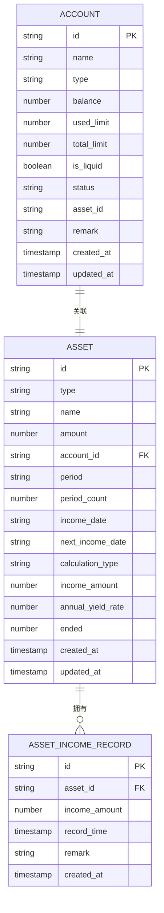
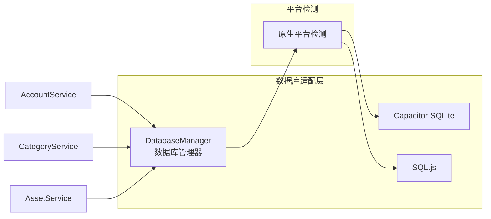
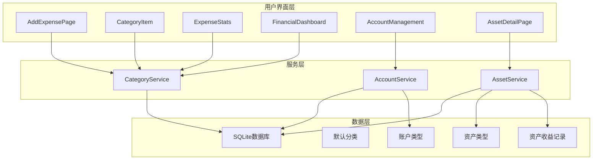

# 服务API

<cite>
**本文档引用的文件**
- [accountService.ts](file://src/services/account/accountService.ts)
- [account.ts](file://src/types/account/account.ts)
- [categoryService.ts](file://src/services/categoryService.ts)
- [categories.ts](file://src/data/categories.ts)
- [assetService.ts](file://src/services/asset/assetService.ts)
- [asset.ts](file://src/types/asset/asset.ts)
- [AssetDetailPage.vue](file://src/components/mobile/asset/AssetDetailPage.vue)
- [account.ts](file://src/stores/account.ts)
- [AccountManagement.vue](file://src/components/mobile/account/AccountManagement.vue)
- [index.js](file://src/database/index.js)
- [adapter.js](file://src/database/adapter.js)
- [AddExpensePage.vue](file://src/components/mobile/expense/AddExpensePage.vue)
- [CategoryItem.vue](file://src/components/mobile/expense/CategoryItem.vue)
- [ExpenseStats.vue](file://src/components/mobile/expense/ExpenseStats.vue)
- [FinancialDashboard.vue](file://src/components/mobile/financial/FinancialDashboard.vue)
- [package.json](file://package.json)
- [update.js](file://update.js)
</cite>

## 更新摘要
**变更内容**
- 新增完整的资产服务层架构，提供资产收益管理和计算功能
- 为账户服务新增asset_id关联支持，实现账户与资产的双向关联
- 扩展服务层API以支持资产收益记录获取和计算功能
- 新增资产收益记录数据库表和类型定义
- 增强服务层的计算能力和业务逻辑封装

## 目录
1. [简介](#简介)
2. [项目结构](#项目结构)
3. [核心组件](#核心组件)
4. [架构概览](#架构概览)
5. [详细组件分析](#详细组件分析)
6. [依赖分析](#依赖分析)
7. [性能考虑](#性能考虑)
8. [故障排除指南](#故障排除指南)
9. [结论](#结论)
10. [附录](#附录)

## 简介
本文档详细说明了业务服务API中的分类管理、账户管理和资产服务，重点涵盖三个核心服务层：categoryService.ts中的分类管理API、accountService.ts中的账户管理API和assetService.ts中的资产服务API。文档为每个服务方法提供了详细的接口规范，包括参数类型、返回值结构、错误码定义等。同时解释了服务层的设计模式和业务逻辑封装，提供了服务调用的最佳实践和性能考虑，说明了与其他模块的集成方式和依赖关系，并包含了服务层的单元测试方法和验证指南。

**更新** 项目现已引入全新的资产服务层，提供完整的资产收益管理和计算能力，包括资产收益记录获取、收益计算、资产生命周期管理等功能。同时增强了账户服务，新增asset_id关联支持，实现账户与资产的双向关联。

## 项目结构
该项目采用Vue 3 + TypeScript + Vite的现代前端架构，现已引入完整的服务层架构，主要目录结构如下：
- `src/services/` - 业务服务层，包含分类管理、账户管理和资产服务
- `src/database/` - 数据库抽象层，提供跨平台数据库访问
- `src/data/` - 数据模型定义和静态数据
- `src/components/` - Vue组件，包含移动端界面
- `src/stores/` - Pinia状态管理（保留传统store模式）
- `src/types/` - TypeScript类型定义
- `src/utils/` - 工具函数和字典数据



**图表来源**
- [accountService.ts:1-638](file://src/services/account/accountService.ts#L1-L638)
- [categoryService.ts:1-261](file://src/services/categoryService.ts#L1-L261)
- [assetService.ts:1-261](file://src/services/asset/assetService.ts#L1-L261)
- [index.js:1-935](file://src/database/index.js#L1-L935)

**章节来源**
- [accountService.ts:1-638](file://src/services/account/accountService.ts#L1-L638)
- [categoryService.ts:1-261](file://src/services/categoryService.ts#L1-L261)
- [assetService.ts:1-261](file://src/services/asset/assetService.ts#L1-L261)
- [categories.ts:1-45](file://src/data/categories.ts#L1-L45)
- [index.js:1-935](file://src/database/index.js#L1-L935)

## 核心组件
项目现已包含三个核心业务服务组件，提供完整的财务管理系统：

### 分类管理服务
分类管理服务是整个财务应用的核心业务组件，负责处理所有分类相关的业务逻辑。该服务采用静态类设计模式，提供完整的CRUD操作能力。

### 账户管理服务
账户管理服务是全新的业务服务层，提供完整的账户生命周期管理能力，包括账户CRUD操作、余额调整、内部转账、信用卡还款等高级功能。**更新** 新增asset_id关联支持，实现账户与资产的双向关联。

### 资产服务
资产服务是新增的业务服务层，提供完整的资产收益管理和计算能力，包括资产收益记录获取、收益计算、资产生命周期管理等功能。**更新** 新增资产收益记录数据库表和类型定义。

### 主要特性对比
**分类管理服务**
- 统一的数据源管理（数据库存储和默认分类数据）
- 类型安全的完整接口定义
- 错误处理和降级策略
- 性能优化的数据库连接管理

**账户管理服务**
- 完整的账户生命周期管理
- 事务性操作保证数据一致性
- 丰富的业务规则验证
- 支持多种账户类型（储蓄、信用卡、流动资金等）
- **新增** asset_id关联支持，实现账户与资产的双向关联

**资产服务**
- 完整的资产收益管理能力
- 动态收益计算功能
- 资产生命周期管理
- 收益记录追踪和统计
- **新增** 收益记录数据库表和类型定义

**章节来源**
- [categoryService.ts:1-261](file://src/services/categoryService.ts#L1-L261)
- [accountService.ts:1-638](file://src/services/account/accountService.ts#L1-L638)
- [assetService.ts:1-261](file://src/services/asset/assetService.ts#L1-L261)

## 架构概览
项目采用分层架构设计，通过服务层实现业务逻辑封装，通过数据库抽象层实现跨平台兼容。





**图表来源**
- [accountService.ts:15-106](file://src/services/account/accountService.ts#L15-L106)
- [assetService.ts:239-260](file://src/services/asset/assetService.ts#L239-L260)
- [index.js:199-264](file://src/database/index.js#L199-L264)

## 详细组件分析

### AccountService 类设计
AccountService提供完整的账户管理能力，采用函数式设计模式，每个方法都是独立的业务操作。



**图表来源**
- [accountService.ts:1-638](file://src/services/account/accountService.ts#L1-L638)
- [account.ts:6-70](file://src/types/account/account.ts#L6-L70)
- [asset.ts:7-40](file://src/types/asset/asset.ts#L7-L40)

#### 账户创建方法
**addAccount 方法**
```typescript
export async function addAccount(accountData: AccountInput): Promise<void>
```

**参数说明**
- `accountData`: 账户输入数据，包含名称、类型、余额等信息

**业务逻辑**
1. 生成唯一账户ID和交易ID
2. 创建账户记录，包含asset_id关联字段
3. 根据账户类型和余额创建初始交易记录
4. **新增** 自动创建关联资产（储蓄账户类型）
5. 使用事务保证数据一致性

**章节来源**
- [accountService.ts:15-106](file://src/services/account/accountService.ts#L15-L106)

#### 交易管理方法
**createDebitTransaction 方法**
```typescript
export async function createDebitTransaction(
  accountId: string, 
  amount: number, 
  description: string,
  syncLinkedAsset: boolean = true
): Promise<TransactionResult>
```

**新增参数**
- `syncLinkedAsset`: 是否同步修改关联资产金额，默认true

**业务规则**
- 非流动储蓄账户且非信用卡不允许出账
- 流动储蓄账户出账金额不能大于账户余额
- 信用卡出账金额不能大于剩余可用额度
- **新增** 当syncLinkedAsset为true且为储蓄账户时，同步修改关联资产金额

**章节来源**
- [accountService.ts:197-291](file://src/services/account/accountService.ts#L197-L291)

#### 余额调整方法
**adjustBalance 方法**
```typescript
export async function adjustBalance(input: BalanceAdjustInput): Promise<void>
```

**业务逻辑**
1. 验证账户存在性
2. 计算新余额
3. 更新账户余额
4. 创建余额调整交易记录
5. **新增** 同步修改关联资产金额

**章节来源**
- [accountService.ts:390-430](file://src/services/account/accountService.ts#L390-L430)

#### 转账方法
**transfer 方法**
```typescript
export async function transfer(input: TransferInput): Promise<void>
```

**业务逻辑**
1. 验证账户存在性和有效性
2. 使用出账入账接口处理转账
3. 创建双向交易记录
4. 使用事务保证原子性
5. **新增** 同步修改关联资产金额

**章节来源**
- [accountService.ts:435-476](file://src/services/account/accountService.ts#L435-L476)

### AssetService 类设计
AssetService提供完整的资产收益管理能力，采用函数式设计模式，每个方法都是独立的业务操作。



**图表来源**
- [assetService.ts:1-261](file://src/services/asset/assetService.ts#L1-L261)
- [asset.ts:7-40](file://src/types/asset/asset.ts#L7-L40)

#### 收益计算方法
**calculatePerAssetIncome 方法**
```typescript
export function calculatePerAssetIncome(asset: Asset): number
```

**计算逻辑**
1. **按金额计算**: 直接返回每期固定收益金额
2. **按年收益率计算**: 根据周期类型计算每期收益
   - 日周期：年收益率 ÷ 365
   - 月周期：年收益率 ÷ 12
   - 年周期：年收益率
3. **无计算类型**: 返回0

**章节来源**
- [assetService.ts:56-83](file://src/services/asset/assetService.ts#L56-L83)

#### 收益记录获取方法
**getAssetIncomeRecords 方法**
```typescript
export async function getAssetIncomeRecords(assetId: string): Promise<any[]>
```

**业务逻辑**
1. 查询指定资产的所有收益记录
2. 按记录时间降序排列
3. 返回收益记录列表

**章节来源**
- [assetService.ts:239-244](file://src/services/asset/assetService.ts#L239-L244)

#### 资产收益记录类型
**AssetIncomeRecord 接口**
```typescript
interface AssetIncomeRecord {
  id: string
  asset_id: string
  income_amount: number
  record_time: dayjs.Dayjs | string
  remark?: string
}
```

**字段说明**
- `id`: 收益记录ID
- `asset_id`: 关联资产ID
- `income_amount`: 收益金额
- `record_time`: 记录时间
- `remark`: 备注信息

**章节来源**
- [AssetDetailPage.vue:151-157](file://src/components/mobile/asset/AssetDetailPage.vue#L151-L157)

### CategoryService 类设计
CategoryService采用静态类设计，提供以下核心方法：



**图表来源**
- [categoryService.ts:1-261](file://src/services/categoryService.ts#L1-L261)
- [categories.ts:1-7](file://src/data/categories.ts#L1-L7)

#### getCategories 方法
获取所有分类的完整接口规范：

**方法签名**
```typescript
static async getCategories(type?: string): Promise<Category[]>
```

**参数说明**
- `type` (可选): 分类类型，支持 'expense' 或 'income'

**返回值**
- `Category[]`: 分类对象数组，包含合并后的默认分类和数据库分类

**业务逻辑**
1. 从数据库查询所有分类记录
2. 合并默认分类数据（支出和收入两类）
3. 使用Map去重，确保数据库中的分类优先
4. 可选按类型过滤结果

**错误处理**
- 数据库查询失败时返回默认分类
- 控制台输出详细错误信息

**章节来源**
- [categoryService.ts:15-70](file://src/services/categoryService.ts#L15-L70)

### 数据模型定义
账户管理服务采用完整的TypeScript接口定义：



**图表来源**
- [account.ts:6-70](file://src/types/account/account.ts#L6-L70)
- [asset.ts:7-40](file://src/types/asset/asset.ts#L7-L40)

**章节来源**
- [account.ts:6-70](file://src/types/account/account.ts#L6-L70)
- [asset.ts:7-40](file://src/types/asset/asset.ts#L7-L40)

## 依赖分析

### 数据库集成
三个服务都通过数据库抽象层实现跨平台兼容：



**图表来源**
- [index.js:21-32](file://src/database/index.js#L21-L32)
- [adapter.js:14-24](file://src/database/adapter.js#L14-L24)

### 组件集成关系
服务层在应用中的使用场景：



**图表来源**
- [AddExpensePage.vue:114-228](file://src/components/mobile/expense/AddExpensePage.vue#L114-L228)
- [ExpenseStats.vue:262-294](file://src/components/mobile/expense/ExpenseStats.vue#L262-L294)
- [AccountManagement.vue:158-415](file://src/components/mobile/account/AccountManagement.vue#L158-L415)
- [AssetDetailPage.vue:141-149](file://src/components/mobile/asset/AssetDetailPage.vue#L141-L149)

**章节来源**
- [AddExpensePage.vue:114-228](file://src/components/mobile/expense/AddExpensePage.vue#L114-L228)
- [ExpenseStats.vue:262-294](file://src/components/mobile/expense/ExpenseStats.vue#L262-L294)
- [AccountManagement.vue:158-415](file://src/components/mobile/account/AccountManagement.vue#L158-L415)
- [AssetDetailPage.vue:141-149](file://src/components/mobile/asset/AssetDetailPage.vue#L141-L149)

## 性能考虑

### 数据库性能优化
1. **连接池管理**: 单例模式确保单一数据库连接
2. **事务批量操作**: 使用executeTransaction保证原子性
3. **查询缓存**: 内置Map缓存机制减少重复查询
4. **批量操作**: 支持批量SQL执行和事务处理
5. **索引优化**: 为常用查询字段建立索引
6. **** 新增** 收益记录表索引优化

### 缓存策略
- **查询缓存**: 对重复查询结果进行缓存
- **去重机制**: 使用Map确保分类ID唯一性
- **智能降级**: 数据库故障时自动使用默认分类

### 平台适配性能
- **原生平台**: 使用Capacitor SQLite获得最佳性能
- **Web平台**: 使用SQL.js提供浏览器兼容性
- **懒加载**: 数据库连接按需建立

### 资产计算性能
- **收益计算缓存**: 计算结果可缓存到资产对象中
- **批量计算**: 支持批量资产收益计算
- **异步计算**: 收益计算不影响主流程性能

**章节来源**
- [index.js:12-18](file://src/database/index.js#L12-L18)
- [index.js:413-415](file://src/database/index.js#L413-L415)
- [assetService.ts:56-83](file://src/services/asset/assetService.ts#L56-L83)

## 故障排除指南

### 常见问题及解决方案

#### 数据库连接问题
**症状**: 分类加载失败，显示默认分类；账户操作失败；资产收益记录获取失败
**原因**: 数据库连接异常
**解决方法**:
1. 检查数据库初始化状态
2. 验证数据库文件完整性
3. 重新初始化数据库

#### 业务规则验证失败
**症状**: 账户操作被拒绝，如余额不足、额度超限；资产收益计算异常
**原因**: 业务规则验证失败
**解决方法**:
1. 检查账户余额和可用额度
2. 验证账户类型和状态
3. 确认操作金额的有效性
4. 检查资产计算类型和参数

#### 事务执行失败
**症状**: 部分操作成功，部分失败
**原因**: 事务执行过程中出现异常
**解决方法**:
1. 检查事务语句的正确性
2. 验证数据约束条件
3. 确认数据库事务支持

#### 资产关联问题
**症状**: 账户与资产关联失效；收益记录无法获取
**原因**: asset_id关联字段缺失或错误
**解决方法**:
1. 检查账户记录中的asset_id字段
2. 验证资产记录的account_id字段
3. 确认关联关系的一致性

### 调试工具
1. **控制台日志**: 详细的错误信息输出
2. **状态检查**: 数据库连接状态监控
3. **性能监控**: 查询执行时间和缓存命中率
4. **** 新增** 资产收益计算调试工具

**章节来源**
- [accountService.ts:214-216](file://src/services/account/accountService.ts#L214-L216)
- [categoryService.ts:62-69](file://src/services/categoryService.ts#L62-L69)
- [assetService.ts:239-244](file://src/services/asset/assetService.ts#L239-L244)

## 结论
项目现已建立了完整的业务服务层架构，通过AccountService、CategoryService和AssetService提供了强大的业务逻辑封装能力。服务层采用现代化的设计模式，具有良好的可扩展性和维护性。通过合理的错误处理和性能优化，确保了在不同平台和环境下的稳定运行。新的服务层架构为未来的功能扩展奠定了坚实的基础，特别是资产收益管理和账户关联功能的增强。

## 附录

### API使用示例
以下是一些常见的使用场景：

#### 账户管理使用示例
```typescript
// 创建新账户
const accountData = {
  name: '储蓄账户',
  type: '储蓄',
  balance: 10000,
  is_liquid: true
}
await AccountService.addAccount(accountData)

// 调整账户余额
await AccountService.adjustBalance({
  account_id: 'acc_123',
  type: '工资',
  amount: 5000,
  remark: '月工资'
})

// 账户间转账
await AccountService.transfer({
  from_account_id: 'acc_1',
  to_account_id: 'acc_2',
  amount: 1000,
  remark: '转账'
})
```

#### 资产管理使用示例
```typescript
// 创建新资产
const assetData = {
  name: '定期存款',
  type: '储蓄',
  amount: 50000,
  account_id: 'acc_123',
  period: '年',
  calculation_type: '按年收益率计算',
  annual_yield_rate: 0.03
}
await AssetService.addAsset(assetData)

// 计算资产收益
const asset = await AssetService.getAssetById('asset_123')
const income = AssetService.calculatePerAssetIncome(asset)
console.log(`每期收益: ¥${income.toFixed(2)}`)

// 获取资产收益记录
const records = await AssetService.getAssetIncomeRecords('asset_123')
```

#### 分类管理使用示例
```typescript
// 获取所有分类
const allCategories = await CategoryService.getCategories()

// 获取支出分类
const expenseCategories = await CategoryService.getCategories('expense')

// 创建新分类
const success = await CategoryService.createCategory({
  name: '新分类',
  icon: 'icon-class',
  iconText: '📝',
  type: 'expense'
})
```

### 最佳实践建议
1. **错误处理**: 始终检查方法返回值
2. **数据验证**: 在调用前验证输入参数
3. **事务使用**: 对于多步骤操作使用事务
4. **缓存策略**: 合理使用查询缓存
5. **平台适配**: 考虑不同平台的性能差异
6. **业务规则**: 严格遵守业务规则验证
7. **** 新增** 资产关联**: 确保账户与资产的关联一致性
8. **** 新增** 收益计算**: 合理使用收益计算缓存

### 扩展开发指导
1. **新增账户类型**: 扩展Account接口和业务逻辑
2. **自定义交易类型**: 添加新的交易类型支持
3. **批量操作**: 实现账户的批量导入导出功能
4. **报表统计**: 添加账户相关的统计分析功能
5. **** 新增** 资产类型**: 扩展Asset接口支持更多资产类型
6. **** 新增** 收益计算**: 添加新的收益计算算法
7. **** 新增** 收益记录**: 扩展AssetIncomeRecord支持更多字段

**章节来源**
- [accountService.ts:15-638](file://src/services/account/accountService.ts#L15-L638)
- [categoryService.ts:15-261](file://src/services/categoryService.ts#L15-L261)
- [assetService.ts:1-261](file://src/services/asset/assetService.ts#L1-L261)