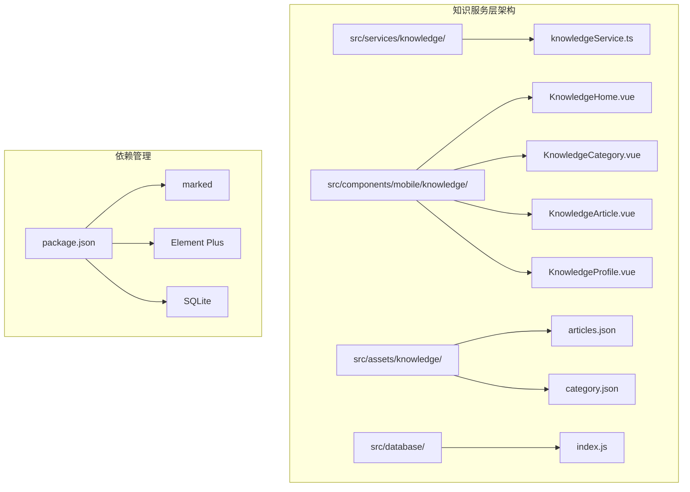
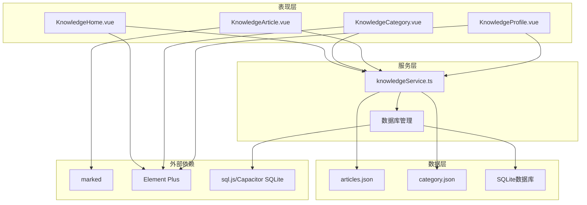
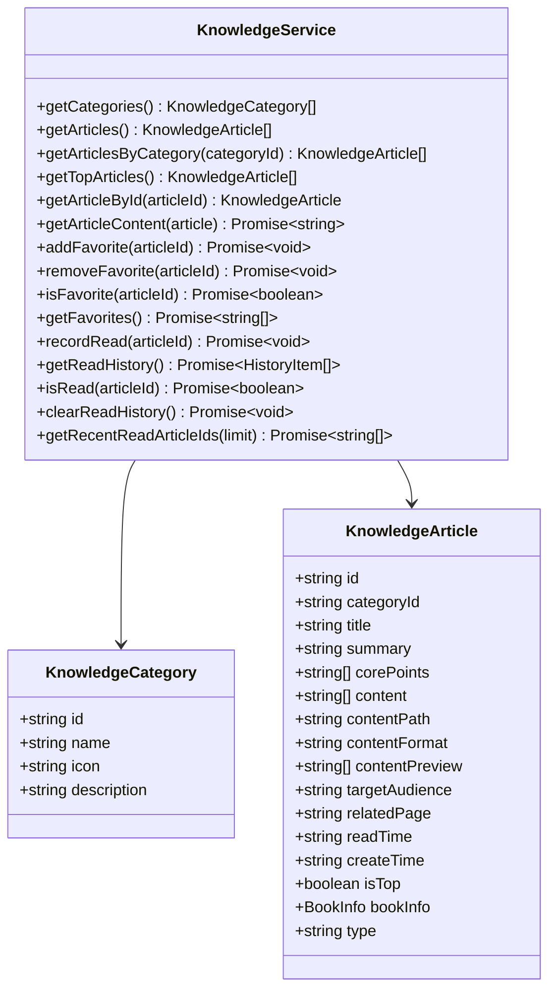
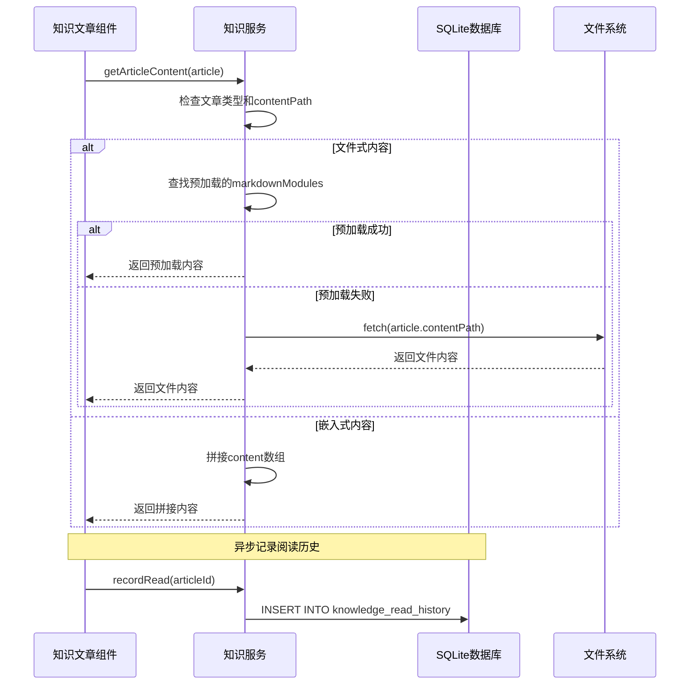
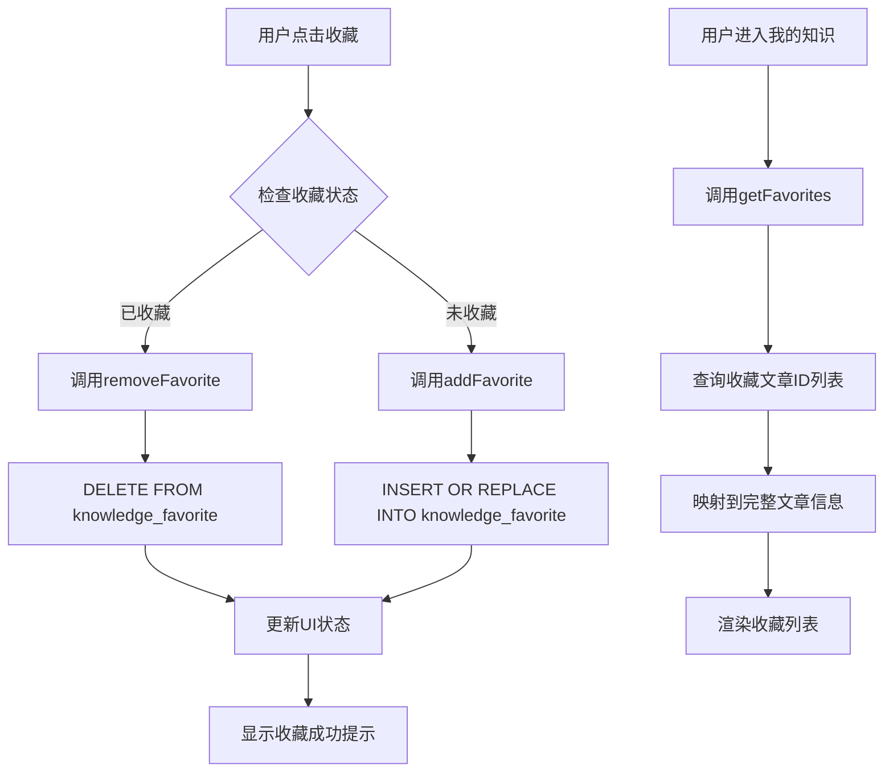
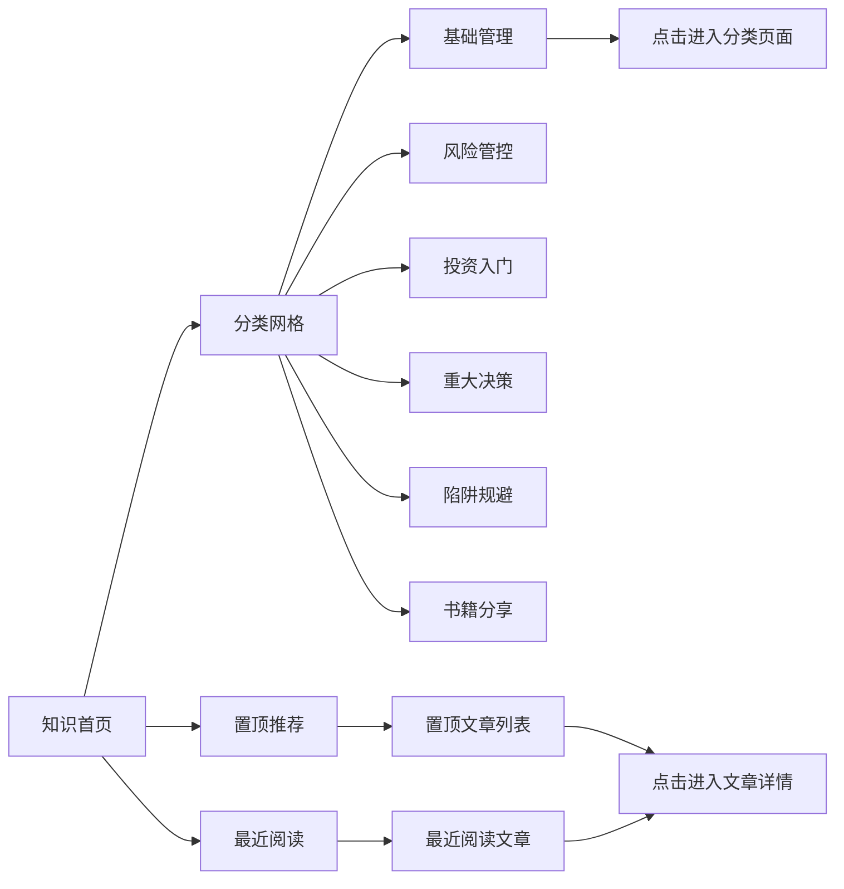
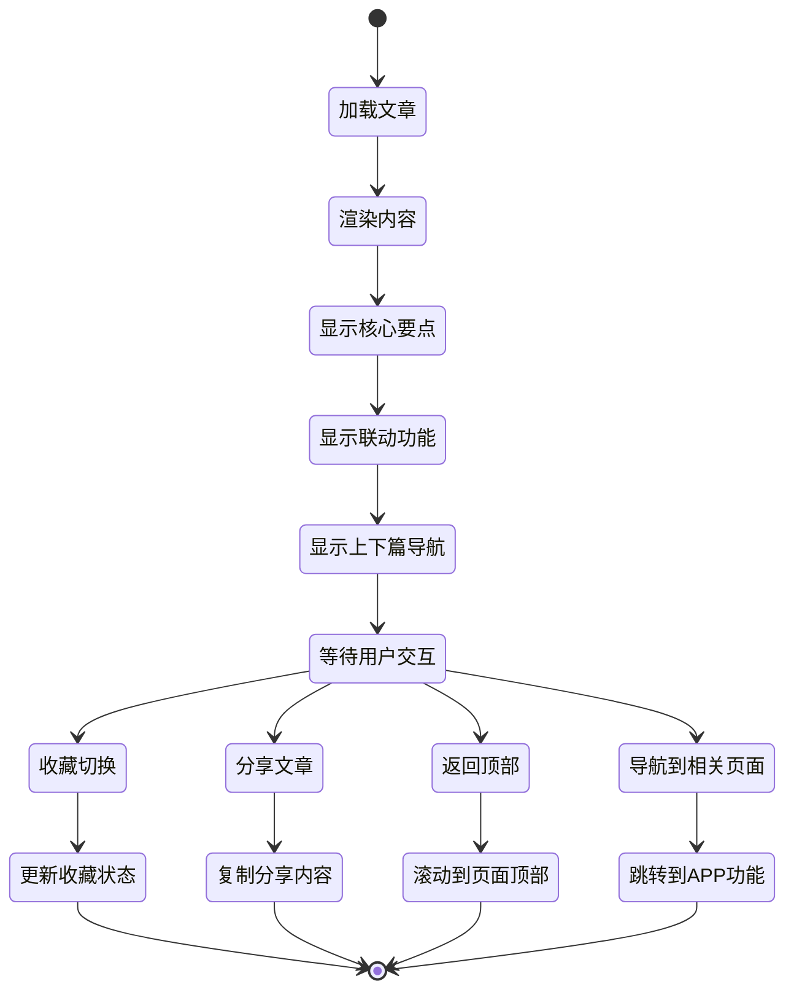
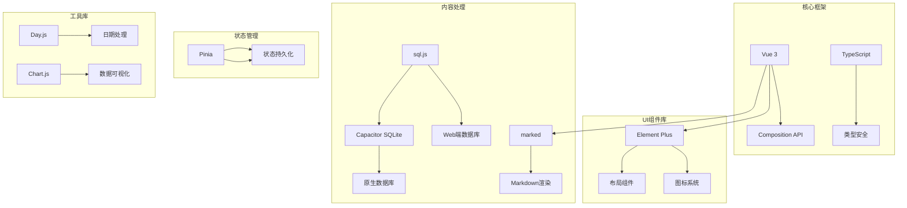
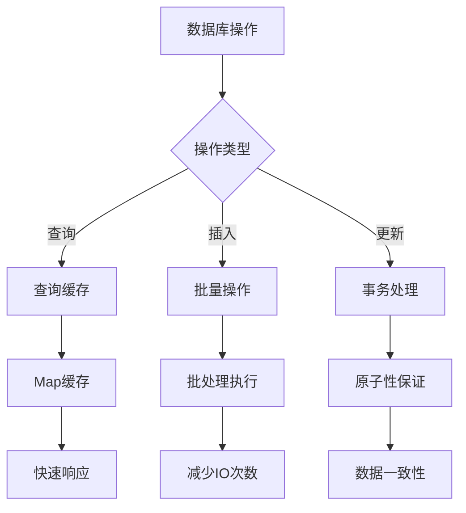

# 知识服务层

<cite>
**本文档引用的文件**
- [knowledgeService.ts](file://src/services/knowledge/knowledgeService.ts)
- [articles.json](file://src/assets/knowledge/articles.json)
- [category.json](file://src/assets/knowledge/category.json)
- [KnowledgeHome.vue](file://src/components/mobile/knowledge/KnowledgeHome.vue)
- [KnowledgeCategory.vue](file://src/components/mobile/knowledge/KnowledgeCategory.vue)
- [KnowledgeArticle.vue](file://src/components/mobile/knowledge/KnowledgeArticle.vue)
- [KnowledgeProfile.vue](file://src/components/mobile/knowledge/KnowledgeProfile.vue)
- [index.js](file://src/database/index.js)
- [package.json](file://package.json)
</cite>

## 目录
1. [简介](#简介)
2. [项目结构](#项目结构)
3. [核心组件](#核心组件)
4. [架构概览](#架构概览)
5. [详细组件分析](#详细组件分析)
6. [依赖分析](#依赖分析)
7. [性能考虑](#性能考虑)
8. [故障排除指南](#故障排除指南)
9. [结论](#结论)

## 简介

知识服务层是财务应用中的核心知识管理模块，为用户提供财务相关的学习内容和知识服务。该系统采用Vue 3 + TypeScript技术栈，结合SQLite数据库实现本地化知识存储，支持文章浏览、收藏管理、阅读历史追踪等功能。

系统包含六大知识分类：基础管理、风险管控、投资入门、重大决策、陷阱规避和书籍分享，涵盖从财务入门到专业投资的完整知识体系。通过Markdown内容渲染和响应式设计，为用户提供优质的移动端阅读体验。

## 项目结构

知识服务层采用模块化架构设计，主要包含以下核心目录结构：

**图表来源**
- [knowledgeService.ts:1-176](file://src/services/knowledge/knowledgeService.ts#L1-L176)
- [KnowledgeHome.vue:1-326](file://src/components/mobile/knowledge/KnowledgeHome.vue#L1-L326)

**章节来源**
- [knowledgeService.ts:1-176](file://src/services/knowledge/knowledgeService.ts#L1-L176)
- [KnowledgeHome.vue:1-326](file://src/components/mobile/knowledge/KnowledgeHome.vue#L1-L326)

## 核心组件

### 知识服务核心功能

知识服务层提供了完整的知识管理生态系统，包含以下核心功能模块：

#### 1. 知识分类管理
系统支持六大知识分类，每个分类都有独特的图标和描述：
- **基础管理**：财务入门核心，资产管理与负债管理
- **风险管控**：社保与保险配置，财务风险管理
- **投资入门**：投资逻辑与工具，资产配置技巧
- **重大决策**：房产、教育、养老等人生决策
- **陷阱规避**：金融骗局识别，信用管理
- **书籍分享**：经典财务书籍核心观点

#### 2. 文章内容管理
支持两种内容类型：
- **嵌入式内容**：直接在JSON中存储的Markdown内容
- **文件式内容**：通过contentPath引用的外部Markdown文件

#### 3. 用户交互功能
- **收藏管理**：用户可以收藏感兴趣的文章
- **阅读历史**：自动记录用户的阅读进度
- **置顶推荐**：突出显示重要内容
- **最近阅读**：展示用户最近浏览的文章

**章节来源**
- [category.json:1-39](file://src/assets/knowledge/category.json#L1-L39)
- [articles.json:1-228](file://src/assets/knowledge/articles.json#L1-L228)
- [knowledgeService.ts:6-34](file://src/services/knowledge/knowledgeService.ts#L6-L34)

## 架构概览

知识服务层采用分层架构设计，确保各组件职责清晰、耦合度低：

**图表来源**
- [knowledgeService.ts:1-176](file://src/services/knowledge/knowledgeService.ts#L1-L176)
- [KnowledgeHome.vue:88-144](file://src/components/mobile/knowledge/KnowledgeHome.vue#L88-L144)
- [KnowledgeArticle.vue:96-239](file://src/components/mobile/knowledge/KnowledgeArticle.vue#L96-L239)

## 详细组件分析

### 知识服务核心模块

#### 1. 知识服务接口设计

**图表来源**
- [knowledgeService.ts:6-34](file://src/services/knowledge/knowledgeService.ts#L6-L34)

#### 2. 文章内容加载流程

**图表来源**
- [knowledgeService.ts:75-98](file://src/services/knowledge/knowledgeService.ts#L75-L98)
- [knowledgeService.ts:134-141](file://src/services/knowledge/knowledgeService.ts#L134-L141)

#### 3. 收藏管理流程

**图表来源**
- [knowledgeService.ts:100-132](file://src/services/knowledge/knowledgeService.ts#L100-L132)
- [KnowledgeProfile.vue:115-127](file://src/components/mobile/knowledge/KnowledgeProfile.vue#L115-L127)

### 页面组件详细分析

#### 1. 知识首页组件

KnowledgeHome.vue作为知识服务的入口页面，提供了完整的知识浏览体验：

**图表来源**
- [KnowledgeHome.vue:14-85](file://src/components/mobile/knowledge/KnowledgeHome.vue#L14-L85)

#### 2. 文章详情组件

KnowledgeArticle.vue实现了完整的文章阅读体验，包含核心要点展示、Markdown内容渲染和智能导航：

**图表来源**
- [KnowledgeArticle.vue:96-239](file://src/components/mobile/knowledge/KnowledgeArticle.vue#L96-L239)

**章节来源**
- [KnowledgeHome.vue:88-144](file://src/components/mobile/knowledge/KnowledgeHome.vue#L88-L144)
- [KnowledgeArticle.vue:96-239](file://src/components/mobile/knowledge/KnowledgeArticle.vue#L96-L239)

## 依赖分析

### 技术栈依赖关系

知识服务层依赖于多种现代前端技术和库：

**图表来源**
- [package.json:20-40](file://package.json#L20-L40)
- [KnowledgeArticle.vue:98-108](file://src/components/mobile/knowledge/KnowledgeArticle.vue#L98-L108)

### 数据库集成分析

系统采用双数据库架构，支持Web和原生平台：

| 数据库类型 | 集成方式 | 用途 | 性能特点 |
|------------|----------|------|----------|
| SQLite.js | sql.js库 | Web环境本地存储 | 内存数据库，断电丢失 |
| Capacitor SQLite | 原生插件 | 移动端持久存储 | 文件系统存储，持久化 |
| 本地存储 | localStorage | 数据持久化 | 字符串存储，有限容量 |

**章节来源**
- [index.js:1-1064](file://src/database/index.js#L1-L1064)
- [package.json:20-40](file://package.json#L20-L40)

## 性能考虑

### 1. 内容加载优化

系统实现了多层次的内容加载策略：

- **预加载机制**：生产环境下预加载所有Markdown文件，提升首屏加载速度
- **懒加载策略**：开发环境下按需加载，减少初始包体积
- **缓存机制**：数据库查询结果缓存，避免重复查询
- **分页加载**：大量文章时采用分页策略，提升滚动性能

### 2. 数据库性能优化

**图表来源**
- [index.js:199-309](file://src/database/index.js#L199-L309)

### 3. 内存管理策略

- **组件卸载清理**：Vue组件销毁时自动清理事件监听器
- **定时器管理**：及时清除定时器，防止内存泄漏
- **图片懒加载**：避免一次性加载过多图片资源
- **虚拟滚动**：长列表采用虚拟滚动技术

## 故障排除指南

### 常见问题及解决方案

#### 1. 文章内容加载失败

**问题现象**：文章内容无法显示，出现空白页面

**可能原因**：
- Markdown文件路径错误
- 文件权限问题
- 网络请求超时

**解决步骤**：
1. 检查articles.json中的contentPath配置
2. 验证Markdown文件是否存在
3. 确认文件访问权限
4. 查看浏览器控制台错误信息

#### 2. 收藏功能异常

**问题现象**：收藏状态无法同步，收藏列表为空

**排查步骤**：
1. 检查knowledge_favorite表结构
2. 验证数据库连接状态
3. 确认事务执行结果
4. 查看控制台错误日志

#### 3. 阅读历史记录丢失

**问题现象**：阅读历史无法保存或丢失

**解决方法**：
1. 检查knowledge_read_history表初始化
2. 验证数据库持久化机制
3. 确认Web环境localStorage权限
4. 检查Capacitor SQLite配置

**章节来源**
- [knowledgeService.ts:75-98](file://src/services/knowledge/knowledgeService.ts#L75-L98)
- [index.js:417-429](file://src/database/index.js#L417-L429)

## 结论

知识服务层作为财务应用的重要组成部分，通过精心设计的架构和丰富的功能特性，为用户提供了完整的财务知识学习体验。系统采用现代化的技术栈，结合SQLite数据库实现本地化存储，确保了良好的性能和用户体验。

### 主要优势

1. **模块化设计**：清晰的组件分离和职责划分
2. **响应式架构**：支持移动端和桌面端的统一体验
3. **数据持久化**：双数据库架构确保数据可靠性
4. **性能优化**：多层次的缓存和加载策略
5. **扩展性强**：易于添加新的知识分类和功能模块

### 发展建议

1. **内容管理系统**：考虑添加后台管理系统，支持动态内容更新
2. **个性化推荐**：基于用户行为数据提供个性化内容推荐
3. **离线支持**：增强离线阅读功能，支持内容下载
4. **社交功能**：添加评论、分享等社交互动功能
5. **数据分析**：统计用户学习行为，优化内容质量

通过持续优化和功能扩展，知识服务层将成为财务应用中不可或缺的核心模块，为用户构建完整的财务知识体系提供强有力的支持。