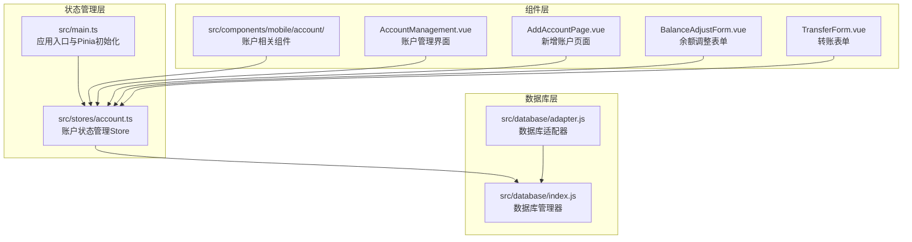
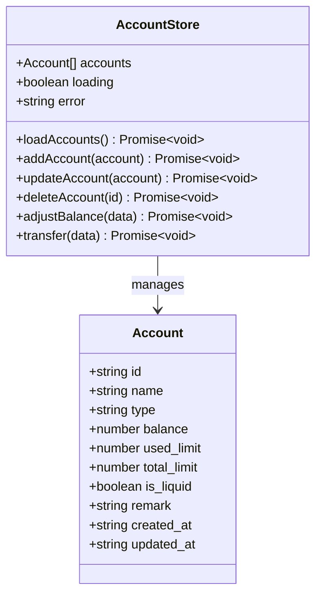
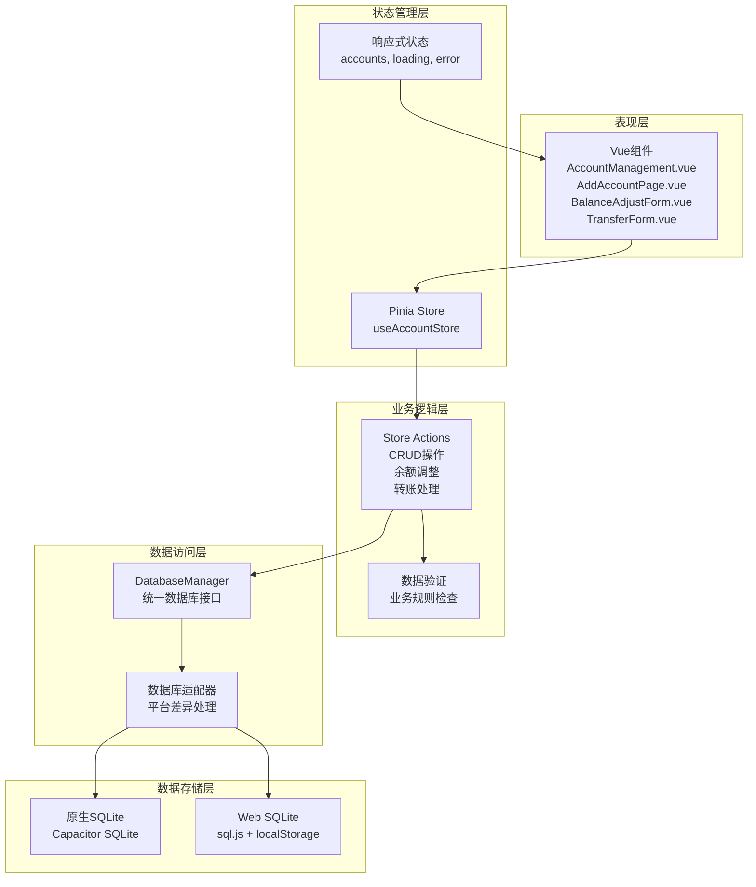
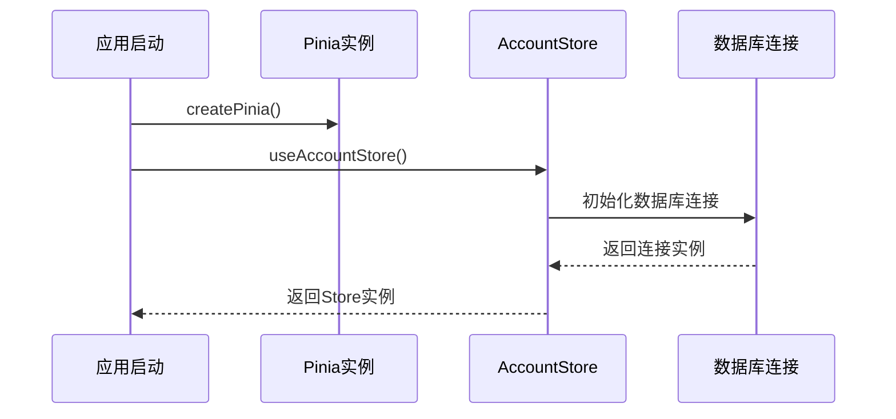
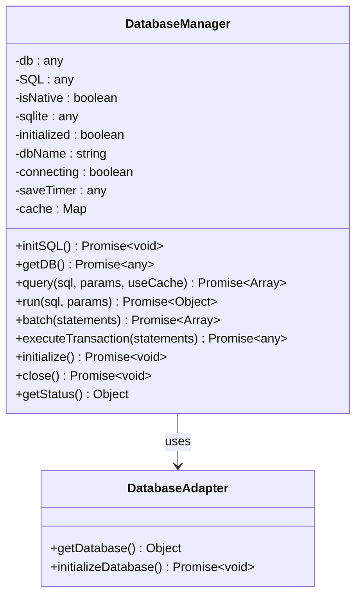
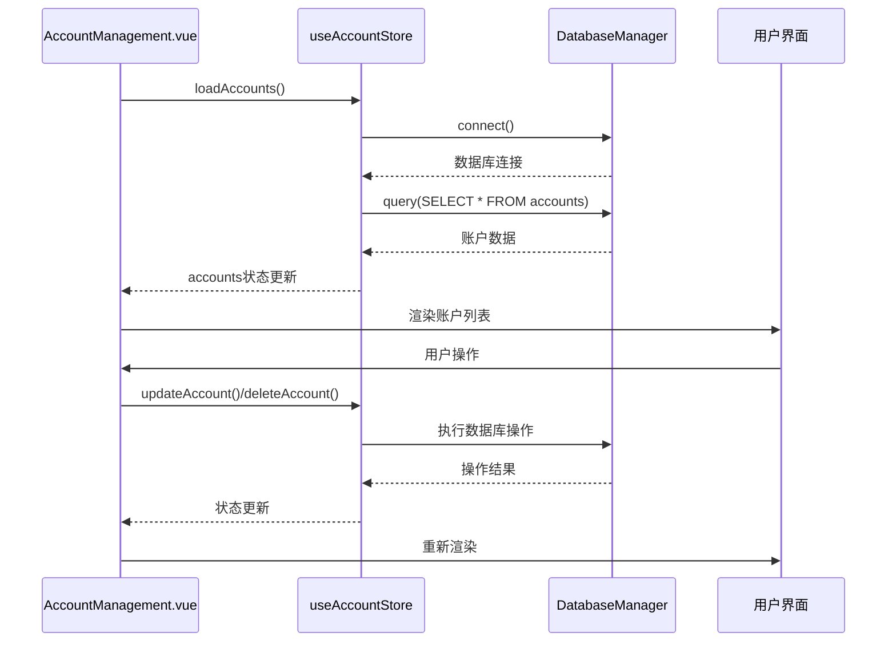
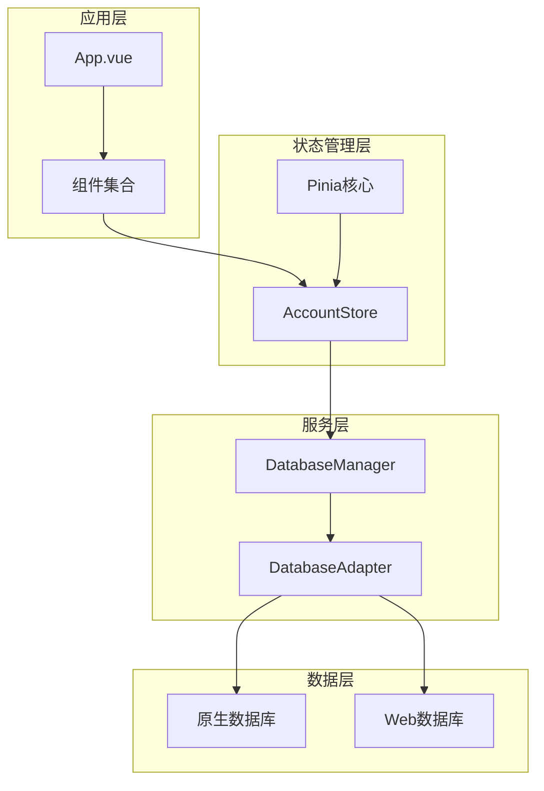

# 状态管理API

<cite>
**本文档引用的文件**
- [src/stores/account.ts](file://src/stores/account.ts)
- [src/main.ts](file://src/main.ts)
- [src/database/index.js](file://src/database/index.js)
- [src/database/adapter.js](file://src/database/adapter.js)
- [src/components/mobile/account/AccountManagement.vue](file://src/components/mobile/account/AccountManagement.vue)
- [src/components/mobile/account/AddAccountPage.vue](file://src/components/mobile/account/AddAccountPage.vue)
- [src/components/mobile/account/BalanceAdjustForm.vue](file://src/components/mobile/account/BalanceAdjustForm.vue)
- [src/components/mobile/account/TransferForm.vue](file://src/components/mobile/account/TransferForm.vue)
- [package.json](file://package.json)
</cite>

## 目录
1. [简介](#简介)
2. [项目结构](#项目结构)
3. [核心组件](#核心组件)
4. [架构概览](#架构概览)
5. [详细组件分析](#详细组件分析)
6. [依赖关系分析](#依赖关系分析)
7. [性能考虑](#性能考虑)
8. [故障排除指南](#故障排除指南)
9. [结论](#结论)
10. [附录](#附录)

## 简介

本项目采用Pinia作为状态管理解决方案，实现了完整的账户状态管理API。该系统负责管理用户的金融账户数据，包括账户的增删改查、余额调整和内部转账操作。系统通过Vue 3的响应式系统与Pinia Store深度集成，提供了实时的状态更新和持久化的数据存储。

系统的核心特性包括：
- 基于Pinia的响应式状态管理
- 支持原生平台和Web平台的双环境数据库访问
- 完整的事务支持和数据一致性保证
- 实时的状态订阅和组件绑定
- 高性能的查询缓存机制

## 项目结构

项目采用模块化的组织方式，状态管理相关的核心文件分布如下：



**图表来源**
- [src/stores/account.ts:1-273](file://src/stores/account.ts#L1-L273)
- [src/main.ts:1-16](file://src/main.ts#L1-L16)
- [src/database/index.js:1-935](file://src/database/index.js#L1-L935)

**章节来源**
- [src/stores/account.ts:1-273](file://src/stores/account.ts#L1-L273)
- [src/main.ts:1-16](file://src/main.ts#L1-L16)
- [src/database/index.js:1-935](file://src/database/index.js#L1-L935)

## 核心组件

### 账户状态管理Store

账户状态管理Store是整个系统的状态中心，负责维护账户数据的完整生命周期。该Store定义了完整的状态结构和操作方法。

#### 状态定义

Store包含以下核心状态属性：

| 状态属性 | 类型 | 描述 | 默认值 |
|---------|------|------|--------|
| accounts | Account[] | 账户列表数组 | [] |
| loading | boolean | 加载状态标志 | false |
| error | string \| null | 错误信息 | null |

#### 账户数据模型

Account接口定义了账户的完整数据结构：



**图表来源**
- [src/stores/account.ts:11-22](file://src/stores/account.ts#L11-L22)
- [src/stores/account.ts:27-32](file://src/stores/account.ts#L27-L32)

**章节来源**
- [src/stores/account.ts:11-22](file://src/stores/account.ts#L11-L22)
- [src/stores/account.ts:27-32](file://src/stores/account.ts#L27-L32)

## 架构概览

系统采用分层架构设计，各层职责明确，耦合度低：



**图表来源**
- [src/stores/account.ts:27-273](file://src/stores/account.ts#L27-L273)
- [src/database/index.js:21-891](file://src/database/index.js#L21-L891)
- [src/database/adapter.js:14-33](file://src/database/adapter.js#L14-L33)

## 详细组件分析

### Pinia Store实现

#### Store初始化与配置

Store通过`defineStore`函数创建，采用模块化命名空间管理：



**图表来源**
- [src/main.ts:14](file://src/main.ts#L14)
- [src/stores/account.ts:27-32](file://src/stores/account.ts#L27-L32)

#### 核心操作方法

##### 加载账户列表 (loadAccounts)

方法签名：`async loadAccounts(): Promise<void>`

功能描述：异步加载所有账户数据，支持数据库连接重试和错误处理。

参数说明：无参数

返回值：Promise<void> - 异步操作完成

执行流程：
1. 设置loading状态为true
2. 连接数据库
3. 执行SELECT查询
4. 更新accounts状态
5. 设置loading状态为false
6. 错误时设置error状态

##### 新增账户 (addAccount)

方法签名：`async addAccount(account: any): Promise<void>`

功能描述：创建新账户，包含完整的数据验证和事务处理。

参数说明：
- account: any - 账户数据对象，包含name、type、balance、used_limit、total_limit、is_liquid、remark等属性

返回值：Promise<void> - 异步操作完成

执行流程：
1. 连接数据库
2. 生成唯一账户ID
3. 准备账户数据（处理可选字段）
4. 执行INSERT语句
5. 重新加载账户列表
6. 错误时设置error状态并抛出异常

##### 更新账户 (updateAccount)

方法签名：`async updateAccount(account: any): Promise<void>`

功能描述：更新现有账户信息。

参数说明：
- account: any - 完整的账户数据对象，包含id字段用于定位

返回值：Promise<void> - 异步操作完成

执行流程：
1. 连接数据库
2. 执行UPDATE语句
3. 重新加载账户列表

##### 删除账户 (deleteAccount)

方法签名：`async deleteAccount(id: string): Promise<void>`

功能描述：删除指定ID的账户。

参数说明：
- id: string - 要删除的账户ID

返回值：Promise<void> - 异步操作完成

执行流程：
1. 连接数据库
2. 执行DELETE语句
3. 重新加载账户列表

##### 余额调整 (adjustBalance)

方法签名：`async adjustBalance(data: { accountId: string; type: string; amount: number; remark: string }): Promise<void>`

功能描述：调整账户余额，支持正负调整和事务保证。

参数说明：
- data: object - 调整数据对象
  - accountId: string - 目标账户ID
  - type: string - 调整类型
  - amount: number - 调整金额（正数为增加，负数为减少）
  - remark: string - 调整备注

返回值：Promise<void> - 异步操作完成

执行流程：
1. 连接数据库
2. 查找目标账户
3. 计算新余额并验证
4. 准备事务语句数组
5. 执行事务（更新余额 + 记录流水）
6. 重新加载账户列表

##### 内部转账 (transfer)

方法签名：`async transfer(data: { fromAccountId: string; toAccountId: string; amount: number; remark: string }): Promise<void>`

功能描述：在两个账户之间进行转账，确保数据一致性和完整性。

参数说明：
- data: object - 转账数据对象
  - fromAccountId: string - 转出账户ID
  - toAccountId: string - 转入账户ID
  - amount: number - 转账金额
  - remark: string - 转账备注

返回值：Promise<void> - 异步操作完成

执行流程：
1. 连接数据库
2. 验证账户ID不相同
3. 查找转出和转入账户
4. 检查转出账户余额充足
5. 开始事务
6. 更新转出账户余额
7. 更新转入账户余额
8. 记录转出流水
9. 记录转入流水
10. 提交事务
11. 重新加载账户列表
12. 错误时执行回滚

**章节来源**
- [src/stores/account.ts:38-53](file://src/stores/account.ts#L38-L53)
- [src/stores/account.ts:59-100](file://src/stores/account.ts#L59-L100)
- [src/stores/account.ts:106-121](file://src/stores/account.ts#L106-L121)
- [src/stores/account.ts:127-139](file://src/stores/account.ts#L127-L139)
- [src/stores/account.ts:145-185](file://src/stores/account.ts#L145-L185)
- [src/stores/account.ts:191-270](file://src/stores/account.ts#L191-L270)

### 数据库管理器

#### 数据库连接管理

DatabaseManager类实现了统一的数据库访问接口，支持原生平台和Web平台：



**图表来源**
- [src/database/index.js:21-891](file://src/database/index.js#L21-L891)
- [src/database/adapter.js:14-33](file://src/database/adapter.js#L14-L33)

#### 平台适配机制

系统通过适配器模式处理不同平台的数据库差异：

| 平台 | 实现方案 | 特性 |
|------|----------|------|
| 原生平台 | Capacitor SQLite | 原生性能，数据持久化 |
| Web平台 | sql.js + localStorage | 跨浏览器支持，数据备份 |
| Electron | sql.js | 桌面应用支持 |

**章节来源**
- [src/database/index.js:8-18](file://src/database/index.js#L8-L18)
- [src/database/index.js:81-189](file://src/database/index.js#L81-L189)
- [src/database/adapter.js:14-33](file://src/database/adapter.js#L14-L33)

### 组件集成

#### 账户管理界面

AccountManagement.vue组件展示了如何在Vue组件中使用Pinia Store：



**图表来源**
- [src/components/mobile/account/AccountManagement.vue:334-340](file://src/components/mobile/account/AccountManagement.vue#L334-L340)
- [src/stores/account.ts:38-53](file://src/stores/account.ts#L38-L53)

#### 表单组件

各个表单组件通过事件机制与Store交互：

| 组件 | 功能 | 交互方式 |
|------|------|----------|
| AddAccountPage.vue | 新增账户表单 | emit('navigate')事件 |
| BalanceAdjustForm.vue | 余额调整表单 | v-model双向绑定 |
| TransferForm.vue | 转账表单 | v-model双向绑定 + submit事件 |

**章节来源**
- [src/components/mobile/account/AccountManagement.vue:158-168](file://src/components/mobile/account/AccountManagement.vue#L158-L168)
- [src/components/mobile/account/AddAccountPage.vue:44-50](file://src/components/mobile/account/AddAccountPage.vue#L44-L50)
- [src/components/mobile/account/BalanceAdjustForm.vue:19-38](file://src/components/mobile/account/BalanceAdjustForm.vue#L19-L38)
- [src/components/mobile/account/TransferForm.vue:25-54](file://src/components/mobile/account/TransferForm.vue#L25-L54)

## 依赖关系分析

### 外部依赖

系统主要依赖以下外部库：

```mermaid
graph LR
subgraph "核心依赖"
Vue[Vue 3<br/>^3.5.32]
Pinia[Pinia<br/>^2.1.7]
ElementPlus[Element Plus<br/>^2.13.7]
end
subgraph "数据库依赖"
CapacitorSQLite[@capacitor-community/sqlite<br/>^6.0.1]
SQLJS[sql.js<br/>^1.10.3]
end
subgraph "工具库"
ChartJS[Chart.js<br/>^4.5.1]
DateFNS[date-fns<br/>^4.1.0]
CryptoJS[Crypto-js<br/>^4.2.0]
end
App[财务APP] --> Vue
App --> Pinia
App --> ElementPlus
App --> CapacitorSQLite
App --> SQLJS
App --> ChartJS
App --> DateFNS
App --> CryptoJS
```

**图表来源**
- [package.json:19-36](file://package.json#L19-L36)

### 内部依赖关系



**图表来源**
- [src/main.ts:13-16](file://src/main.ts#L13-L16)
- [src/stores/account.ts:5](file://src/stores/account.ts#L5)
- [src/database/index.js:894-935](file://src/database/index.js#L894-L935)

**章节来源**
- [package.json:19-36](file://package.json#L19-L36)
- [src/main.ts:13-16](file://src/main.ts#L13-L16)

## 性能考虑

### 缓存策略

系统实现了多层次的缓存机制：

1. **查询缓存**：DatabaseManager使用Map缓存查询结果
2. **连接缓存**：避免重复的数据库连接建立
3. **状态缓存**：Pinia Store的响应式状态缓存

### 性能配置

```javascript
const PERFORMANCE_CONFIG = {
  // Web环境持久化节流时间（毫秒）
  SAVE_THROTTLE_MS: 1000,
  // 启用详细日志
  DEBUG: false
}
```

### 优化建议

1. **批量操作**：使用batch方法执行多个SQL语句
2. **事务处理**：对于相关联的操作使用事务保证一致性
3. **懒加载**：按需加载数据，避免一次性加载大量数据
4. **索引优化**：为常用查询字段建立索引

## 故障排除指南

### 常见问题及解决方案

#### 数据库连接问题

**症状**：操作失败，显示连接错误

**可能原因**：
- 数据库初始化失败
- 平台适配器配置错误
- 权限问题

**解决步骤**：
1. 检查数据库连接状态
2. 验证平台适配器配置
3. 查看详细的错误日志

#### 事务回滚问题

**症状**：转账操作部分成功，部分失败

**解决步骤**：
1. 检查事务开始和提交的配对
2. 验证回滚逻辑的正确性
3. 查看具体的错误信息

#### 数据一致性问题

**症状**：账户余额显示不正确

**解决步骤**：
1. 检查余额计算逻辑
2. 验证事务的原子性
3. 确认数据同步机制

**章节来源**
- [src/database/index.js:354-374](file://src/database/index.js#L354-L374)
- [src/stores/account.ts:191-270](file://src/stores/account.ts#L191-L270)

## 结论

本项目的状态管理API设计合理，实现了以下关键特性：

1. **完整的CRUD操作**：支持账户的增删改查完整生命周期
2. **事务保证**：通过数据库事务确保数据一致性
3. **跨平台支持**：统一的API接口支持原生和Web平台
4. **响应式更新**：与Vue组件无缝集成，实现实时状态更新
5. **错误处理**：完善的错误捕获和处理机制
6. **性能优化**：多层缓存和性能配置

系统为财务应用提供了可靠的状态管理基础，开发者可以在此基础上扩展更多功能，如资产管理和负债跟踪等。

## 附录

### API参考

#### Store方法摘要

| 方法名 | 参数 | 返回值 | 描述 |
|--------|------|--------|------|
| loadAccounts | 无 | Promise<void> | 加载所有账户 |
| addAccount | account: any | Promise<void> | 新增账户 |
| updateAccount | account: any | Promise<void> | 更新账户 |
| deleteAccount | id: string | Promise<void> | 删除账户 |
| adjustBalance | data: object | Promise<void> | 调整余额 |
| transfer | data: object | Promise<void> | 账户间转账 |

#### 状态属性

| 属性名 | 类型 | 描述 |
|--------|------|------|
| accounts | Account[] | 账户列表 |
| loading | boolean | 加载状态 |
| error | string \| null | 错误信息 |

### 最佳实践

1. **状态设计**：保持状态的单一职责，避免状态污染
2. **错误处理**：始终包含try-catch块和错误状态设置
3. **性能优化**：合理使用缓存，避免不必要的数据库查询
4. **类型安全**：使用TypeScript接口确保类型安全
5. **测试覆盖**：为关键业务逻辑编写单元测试

### 扩展指导

1. **功能扩展**：基于现有的Store模式添加新的业务功能
2. **状态持久化**：利用数据库的持久化能力实现状态恢复
3. **监控集成**：添加状态变更的日志记录和监控
4. **性能监控**：集成性能指标收集和分析