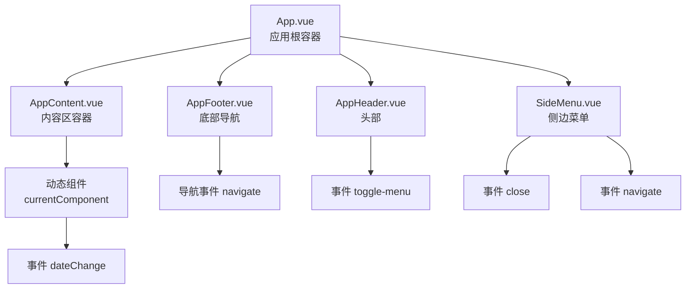
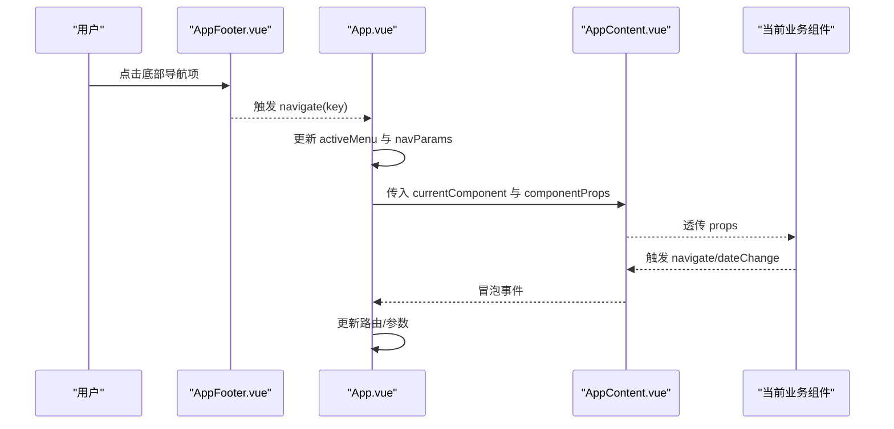
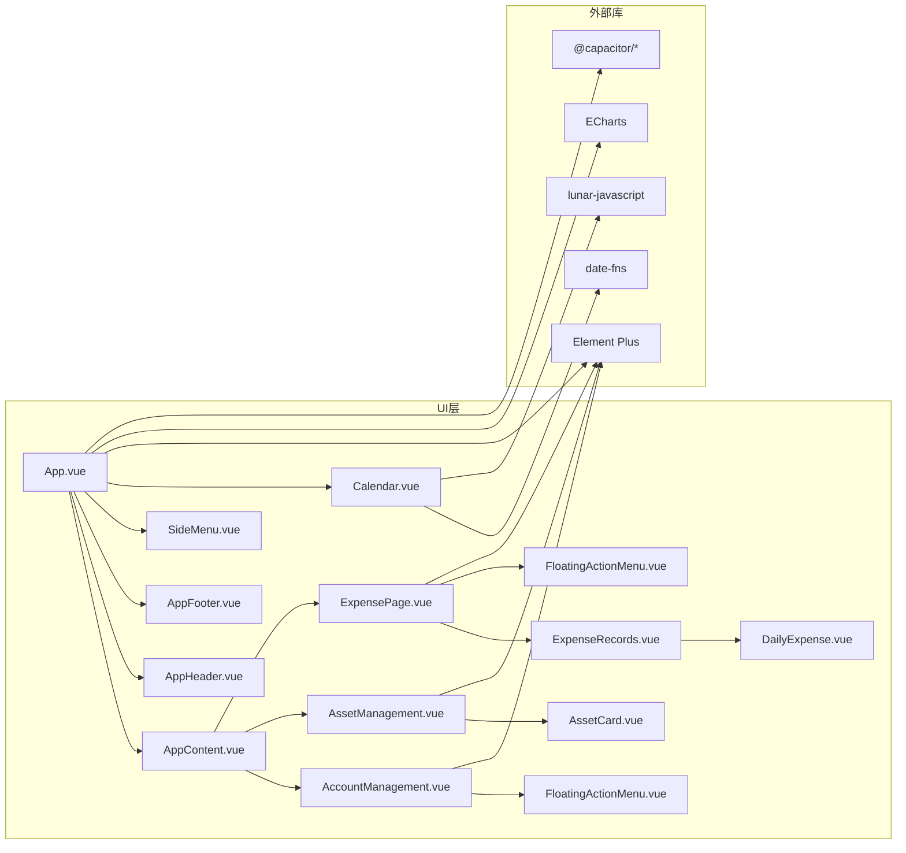
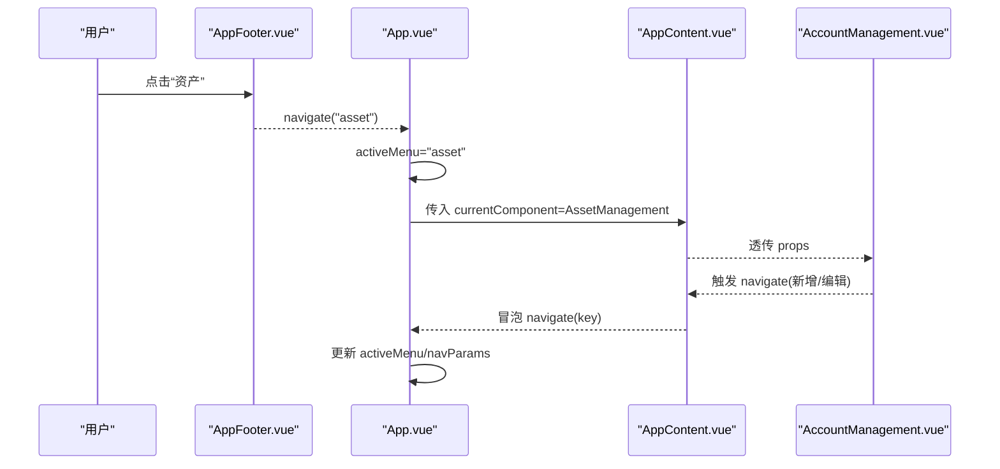

# 组件API

<cite>
**本文引用的文件**
- [App.vue](file://src/App.vue)
- [AppHeader.vue](file://src/components/common/AppHeader.vue)
- [PageHeader.vue](file://src/components/common/PageHeader.vue)
- [SideMenu.vue](file://src/components/common/SideMenu.vue)
- [FloatingActionMenu.vue](file://src/components/common/FloatingActionMenu.vue)
- [Calendar.vue](file://src/components/common/Calendar.vue)
- [AppContent.vue](file://src/components/common/AppContent.vue)
- [AppFooter.vue](file://src/components/common/AppFooter.vue)
- [AccountManagement.vue](file://src/components/mobile/account/AccountManagement.vue)
- [AssetManagement.vue](file://src/components/mobile/asset/AssetManagement.vue)
- [ExpensePage.vue](file://src/components/mobile/expense/ExpensePage.vue)
- [ExpenseRecords.vue](file://src/components/mobile/expense/ExpenseRecords.vue)
- [DailyExpense.vue](file://src/components/mobile/expense/DailyExpense.vue)
- [FinancialDashboard.vue](file://src/components/mobile/financial/FinancialDashboard.vue)
- [AccountForm.vue](file://src/components/mobile/account/AccountForm.vue)
- [AssetCard.vue](file://src/components/mobile/asset/AssetCard.vue)
- [package.json](file://package.json)
</cite>

## 目录
1. [简介](#简介)
2. [项目结构](#项目结构)
3. [核心组件](#核心组件)
4. [架构总览](#架构总览)
5. [组件详细API规范](#组件详细api规范)
6. [依赖关系分析](#依赖关系分析)
7. [性能考量](#性能考量)
8. [故障排查指南](#故障排查指南)
9. [结论](#结论)
10. [附录](#附录)

## 简介
本文件系统性梳理财务应用中的UI组件公共接口，涵盖 props 属性定义、事件触发机制、插槽使用方式、方法暴露、组件间通信与数据传递、生命周期与状态管理集成、样式定制与主题配置、可访问性与国际化适配、以及扩展与二次开发指导。目标是帮助开发者快速理解并正确使用各组件，同时提供最佳实践与性能优化建议。

## 项目结构
应用采用“页面容器 + 业务组件”分层组织，公共组件位于 common 目录，移动端业务组件按功能域划分在 mobile 下。页面容器 App.vue 通过 AppContent 动态渲染当前路由组件，底部 AppFooter 提供导航，左侧 SideMenu 提供菜单，顶部 AppHeader 提供头部交互。

图表来源
- [App.vue:1-195](file://src/App.vue#L1-L195)
- [AppContent.vue:1-51](file://src/components/common/AppContent.vue#L1-L51)
- [AppHeader.vue:1-135](file://src/components/common/AppHeader.vue#L1-L135)
- [AppFooter.vue:1-98](file://src/components/common/AppFooter.vue#L1-L98)
- [SideMenu.vue:1-255](file://src/components/common/SideMenu.vue#L1-L255)

章节来源
- [App.vue:1-195](file://src/App.vue#L1-L195)
- [AppContent.vue:1-51](file://src/components/common/AppContent.vue#L1-L51)

## 核心组件
- 页面容器与导航
  - App.vue：应用根容器，负责路由映射、组件切换、日期参数传递、键盘原生平台适配。
  - AppContent.vue：内容区容器，透传当前组件与 props，向上冒泡导航与日期变更事件。
  - AppHeader.vue：顶部头部，触发菜单开关；PageHeader.vue：页面级返回头部。
  - AppFooter.vue：底部导航，触发菜单项导航。
  - SideMenu.vue：侧边菜单，接收可见性控制，触发关闭与导航事件。
- 通用交互组件
  - FloatingActionMenu.vue：浮动动作菜单，接收按钮数组，展开/收起状态由组件内部维护。
  - Calendar.vue：日历组件，接收尺寸与费用映射，暴露点击事件并返回选中日期对象。
- 业务组件
  - AccountManagement.vue：账户管理页，聚合资产、负债、信用卡、资金等展示与交互。
  - AssetManagement.vue：资产管理页，网格布局资产卡片，支持新增资产/股票/基金导航。
  - ExpensePage.vue：支出页，组合月统计、周收支、支出记录与浮动按钮。
  - ExpenseRecords.vue：按月生成每日记录并渲染 DailyExpense.vue。
  - DailyExpense.vue：按日期查询并展示当日支出明细。
  - FinancialDashboard.vue：财务仪表盘，展示健康指标与折线图。
  - AccountForm.vue：账户表单，支持 v-model 模型双向绑定。
  - AssetCard.vue：资产卡片，支持标题、金额、副金额、图标、颜色与点击事件。

章节来源
- [App.vue:1-195](file://src/App.vue#L1-L195)
- [AppContent.vue:1-51](file://src/components/common/AppContent.vue#L1-L51)
- [AppHeader.vue:1-135](file://src/components/common/AppHeader.vue#L1-L135)
- [PageHeader.vue:1-57](file://src/components/common/PageHeader.vue#L1-L57)
- [AppFooter.vue:1-98](file://src/components/common/AppFooter.vue#L1-L98)
- [SideMenu.vue:1-255](file://src/components/common/SideMenu.vue#L1-L255)
- [FloatingActionMenu.vue:1-151](file://src/components/common/FloatingActionMenu.vue#L1-L151)
- [Calendar.vue:1-477](file://src/components/common/Calendar.vue#L1-L477)
- [AccountManagement.vue:1-650](file://src/components/mobile/account/AccountManagement.vue#L1-L650)
- [AssetManagement.vue:1-381](file://src/components/mobile/asset/AssetManagement.vue#L1-L381)
- [ExpensePage.vue:1-88](file://src/components/mobile/expense/ExpensePage.vue#L1-L88)
- [ExpenseRecords.vue:1-105](file://src/components/mobile/expense/ExpenseRecords.vue#L1-L105)
- [DailyExpense.vue:1-204](file://src/components/mobile/expense/DailyExpense.vue#L1-L204)
- [FinancialDashboard.vue:1-279](file://src/components/mobile/financial/FinancialDashboard.vue#L1-L279)
- [AccountForm.vue:1-44](file://src/components/mobile/account/AccountForm.vue#L1-L44)
- [AssetCard.vue:1-180](file://src/components/mobile/asset/AssetCard.vue#L1-L180)

## 架构总览
组件间通过事件与 props 实现松耦合通信：App.vue 作为中枢，根据 activeMenu 决定当前组件；AppContent.vue 仅负责承载与透传；AppFooter/SideMenu/AppHeader 通过事件驱动 App.vue 更新状态；业务组件通过 emit 向上反馈导航与日期变更。

图表来源
- [AppFooter.vue:1-98](file://src/components/common/AppFooter.vue#L1-L98)
- [App.vue:1-195](file://src/App.vue#L1-L195)
- [AppContent.vue:1-51](file://src/components/common/AppContent.vue#L1-L51)

## 组件详细API规范

### AppHeader
- 用途：应用头部，包含用户头像与应用 Logo，触发菜单开关。
- 事件
  - toggle-menu：无参数，用于通知父组件切换侧边菜单。
- 生命周期
  - onMounted：从 localStorage 加载用户名与修改标记。
- 方法
  - 无公开方法，内部保存用户信息至 localStorage。
- 样式与主题
  - 使用 scoped 样式，响应式适配不同屏幕尺寸。
- 可访问性与国际化
  - 图片提供 alt 描述；文本为固定文案，如需国际化可在父组件传入。

章节来源
- [AppHeader.vue:1-135](file://src/components/common/AppHeader.vue#L1-L135)

### PageHeader
- 用途：页面级返回头部，显示标题与返回按钮。
- Props
  - title: string，必填，页面标题。
- 事件
  - back：无参数，返回事件。
- 插槽
  - 无插槽。
- 方法
  - 无。
- 样式与主题
  - 使用 :deep 作用域穿透 Element 图标样式。

章节来源
- [PageHeader.vue:1-57](file://src/components/common/PageHeader.vue#L1-L57)

### SideMenu
- 用途：侧边菜单，提供用户信息与菜单项，支持主题、设置、帮助、反馈、夜间模式等入口。
- Props
  - visible: boolean，必填，控制菜单显隐。
- 事件
  - close：无参数，关闭菜单。
  - navigate(key: string)：导航到指定键值。
- 生命周期
  - onMounted：从 localStorage 加载用户名与修改标记。
- 方法
  - 无公开方法。
- 样式与主题
  - 使用 scoped 样式，动画与响应式适配。

章节来源
- [SideMenu.vue:1-255](file://src/components/common/SideMenu.vue#L1-L255)

### FloatingActionMenu
- 用途：浮动动作菜单，支持单按钮直显与多按钮展开。
- Props
  - buttons: ActionButton[]，必填，按钮定义数组。
    - text: string，按钮文字。
    - icon: any，图标组件。
    - action: () => void，点击回调。
- 事件
  - 无。
- 方法
  - 无。
- 样式与主题
  - 使用 scoped 样式，支持提示标签与动画。

章节来源
- [FloatingActionMenu.vue:1-151](file://src/components/common/FloatingActionMenu.vue#L1-L151)

### Calendar
- 用途：日历组件，支持年/月选择、节日与农历信息、今日高亮、休息日标记、费用标注。
- Props
  - width: string，默认 '500px'，日历容器宽度。
  - height: string，默认 '600px'，日历容器高度。
  - expenses: Record<string, number>，默认 {}，日期到费用的映射。
- 事件
  - click(dateObj)：点击日期时触发，返回当前选中日期对象。
- 方法
  - 无。
- 样式与主题
  - 使用 scoped + SCSS，渐变背景、网格布局、响应式字体与尺寸。

章节来源
- [Calendar.vue:1-477](file://src/components/common/Calendar.vue#L1-L477)

### AppContent
- 用途：内容区容器，动态渲染当前组件并透传 props。
- Props
  - currentComponent: any，必填，当前要渲染的组件构造器。
  - componentProps?: Record<string, any>，可选，透传给当前组件的属性。
- 事件
  - navigate(key: string)：向上冒泡导航事件。
  - dateChange(date: { year, month })：向上冒泡日期变更事件。
- 方法
  - 无。
- 样式与主题
  - 滚动条隐藏，响应式内边距。

章节来源
- [AppContent.vue:1-51](file://src/components/common/AppContent.vue#L1-L51)

### AppFooter
- 用途：底部导航，提供“支出/收入/资产/负债/更多”入口。
- 事件
  - navigate(key: string)：导航到对应键值。
- 方法
  - 无。
- 样式与主题
  - 响应式图标与文字大小。

章节来源
- [AppFooter.vue:1-98](file://src/components/common/AppFooter.vue#L1-L98)

### AccountManagement
- 用途：账户管理页，展示净资产、资产/负债趋势、信用卡、流动资金与其他资金。
- 事件
  - navigate(key: string | { key, params? })：导航事件，支持携带参数。
- Props
  - 无。
- 方法
  - 无。
- 样式与主题
  - 响应式布局与卡片阴影。

章节来源
- [AccountManagement.vue:1-650](file://src/components/mobile/account/AccountManagement.vue#L1-L650)

### AssetManagement
- 用途：资产管理页，网格展示通用资产、股票、基金卡片，支持新增导航。
- 事件
  - navigate(key: string | { key, params? })：导航事件。
- Props
  - 无。
- 方法
  - 无。
- 样式与主题
  - 响应式网格布局。

章节来源
- [AssetManagement.vue:1-381](file://src/components/mobile/asset/AssetManagement.vue#L1-L381)

### ExpensePage
- 用途：支出页，组合月统计、周收支、支出记录与浮动按钮。
- 事件
  - navigate(key: string)：导航事件。
- Props
  - 无。
- 方法
  - 无。
- 样式与主题
  - 背景色与相对定位。

章节来源
- [ExpensePage.vue:1-88](file://src/components/mobile/expense/ExpensePage.vue#L1-L88)

### ExpenseRecords
- 用途：按月生成每日记录并渲染 DailyExpense。
- Props
  - year: number，必填，年份。
  - month: number，必填，月份（1-12）。
- 事件
  - 无。
- 方法
  - 无。
- 样式与主题
  - 无。

章节来源
- [ExpenseRecords.vue:1-105](file://src/components/mobile/expense/ExpenseRecords.vue#L1-L105)

### DailyExpense
- 用途：按日期查询并展示当日支出明细。
- Props
  - date: string，必填，展示用日期字符串。
  - dateStr: string，必填，形如 MM.DD 的日期字符串。
  - year: number，必填，年份。
  - month: number，必填，月份。
- 事件
  - 无。
- 方法
  - 无。
- 样式与主题
  - 无。

章节来源
- [DailyExpense.vue:1-204](file://src/components/mobile/expense/DailyExpense.vue#L1-L204)

### FinancialDashboard
- 用途：财务健康评估与净资产增长趋势图。
- 事件
  - 无。
- Props
  - 无。
- 方法
  - 无。
- 样式与主题
  - ECharts 图表容器与状态标签样式。

章节来源
- [FinancialDashboard.vue:1-279](file://src/components/mobile/financial/FinancialDashboard.vue#L1-L279)

### AccountForm
- 用途：账户表单，支持 v-model 模型双向绑定。
- Props
  - modelValue: Partial<Account>，必填，表单初始值。
- 事件
  - update:modelValue(value: Partial<Account>)：双向绑定更新事件。
- 方法
  - 无。
- 样式与主题
  - 无。

章节来源
- [AccountForm.vue:1-44](file://src/components/mobile/account/AccountForm.vue#L1-L44)

### AssetCard
- 用途：资产卡片，支持标题、金额、副金额、图标、颜色与点击事件。
- Props
  - title: string，默认 '默认样式'。
  - amount: number，默认 0。
  - secondaryAmount: number，默认 0。
  - icon: string，默认 '💳'（支持图片URL或字符）。
  - color: string，默认 '#1890ff'。
  - assetId: string，默认 ''。
- 事件
  - click(assetId: string)：点击卡片触发。
- 方法
  - 无。
- 样式与主题
  - 使用 CSS 变量 --card-color 控制渐变色。

章节来源
- [AssetCard.vue:1-180](file://src/components/mobile/asset/AssetCard.vue#L1-L180)

## 依赖关系分析
- 组件依赖
  - App.vue 依赖所有业务组件并在运行时动态选择渲染。
  - AppContent.vue 仅依赖当前组件与透传 props。
  - 业务组件通过 emit 与 App.vue 通信。
- 外部依赖
  - Element Plus 图标与组件。
  - ECharts 图表。
  - date-fns、lunar-javascript 日历与农历工具。
  - @capacitor/* 原生键盘适配。
- 状态管理
  - 账户数据通过 Pinia store 管理（AccountManagement 使用 useAccountStore）。
  - App.vue 维护 activeMenu、navParams、selectedYear、selectedMonth 等全局状态。

图表来源
- [package.json:1-72](file://package.json#L1-L72)
- [App.vue:1-195](file://src/App.vue#L1-L195)
- [AccountManagement.vue:1-650](file://src/components/mobile/account/AccountManagement.vue#L1-L650)
- [AssetManagement.vue:1-381](file://src/components/mobile/asset/AssetManagement.vue#L1-L381)
- [ExpensePage.vue:1-88](file://src/components/mobile/expense/ExpensePage.vue#L1-L88)
- [ExpenseRecords.vue:1-105](file://src/components/mobile/expense/ExpenseRecords.vue#L1-L105)
- [DailyExpense.vue:1-204](file://src/components/mobile/expense/DailyExpense.vue#L1-L204)
- [FloatingActionMenu.vue:1-151](file://src/components/common/FloatingActionMenu.vue#L1-L151)
- [AssetCard.vue:1-180](file://src/components/mobile/asset/AssetCard.vue#L1-L180)
- [Calendar.vue:1-477](file://src/components/common/Calendar.vue#L1-L477)

章节来源
- [package.json:1-72](file://package.json#L1-L72)

## 性能考量
- 渲染优化
  - AppContent.vue 使用动态组件与 v-bind 透传，避免不必要的重渲染。
  - ExpenseRecords.vue 与 DailyExpense.vue 在 mounted/watch 中按需加载数据，减少首屏压力。
- 图表与动画
  - FinancialDashboard.vue 使用 ECharts，初始化与更新通过 watch 切换时间范围，避免重复初始化。
  - Calendar.vue 使用一次性定时器与窗口 resize 监听，组件卸载时清理定时器与监听器。
- 数据库访问
  - DailyExpense.vue 在每次挂载与年月变化时查询数据库，建议结合缓存策略与分页加载。
- 样式与布局
  - 使用 CSS Grid 与 Flex 布局，配合媒体查询实现响应式，减少 JS 计算。

[本节为通用性能建议，无需特定文件引用]

## 故障排查指南
- 事件未触发
  - 检查父组件是否正确绑定事件（如 App.vue 的 navigate、dateChange）。
  - 确认子组件是否通过 $emit 正确触发事件。
- 数据不更新
  - AccountManagement.vue 依赖 useAccountStore，确认 store 已初始化且数据已加载。
  - DailyExpense.vue 依赖数据库连接，检查 db.connect() 是否成功。
- 样式异常
  - 注意 :deep 作用域穿透与 scoped 样式优先级。
  - 响应式样式在小屏设备上可能影响布局，检查媒体查询断点。
- 原生键盘问题
  - App.vue 在 Capacitor 平台设置键盘 resize 模式，若出现遮挡，检查 Capacitor 版本与平台兼容性。

章节来源
- [App.vue:1-195](file://src/App.vue#L1-L195)
- [AccountManagement.vue:1-650](file://src/components/mobile/account/AccountManagement.vue#L1-L650)
- [DailyExpense.vue:1-204](file://src/components/mobile/expense/DailyExpense.vue#L1-L204)

## 结论
本文档系统化梳理了财务应用中常用UI组件的公共接口与使用规范，明确了事件、props、生命周期与样式主题的要点，并提供了性能优化与故障排查建议。建议在二次开发中遵循统一的事件命名与参数约定，保持组件职责单一，利用 App.vue 的路由映射与参数传递机制实现清晰的数据流。

[本节为总结，无需特定文件引用]

## 附录

### 组件间通信流程（序列图）

图表来源
- [AppFooter.vue:1-98](file://src/components/common/AppFooter.vue#L1-L98)
- [App.vue:1-195](file://src/App.vue#L1-L195)
- [AppContent.vue:1-51](file://src/components/common/AppContent.vue#L1-L51)
- [AccountManagement.vue:1-650](file://src/components/mobile/account/AccountManagement.vue#L1-L650)

### 事件与参数约定
- 导航事件
  - navigate(key: string | { key: string, params?: any }, params?: any)
  - 支持新旧两种格式，便于向后兼容。
- 日期变更事件
  - dateChange(date: { year: number; month: number })
- 点击事件
  - Calendar.vue：click(dateObj)
  - AssetCard.vue：click(assetId: string)

章节来源
- [App.vue:119-143](file://src/App.vue#L119-L143)
- [Calendar.vue:234](file://src/components/common/Calendar.vue#L234)
- [AssetCard.vue:51](file://src/components/mobile/asset/AssetCard.vue#L51)