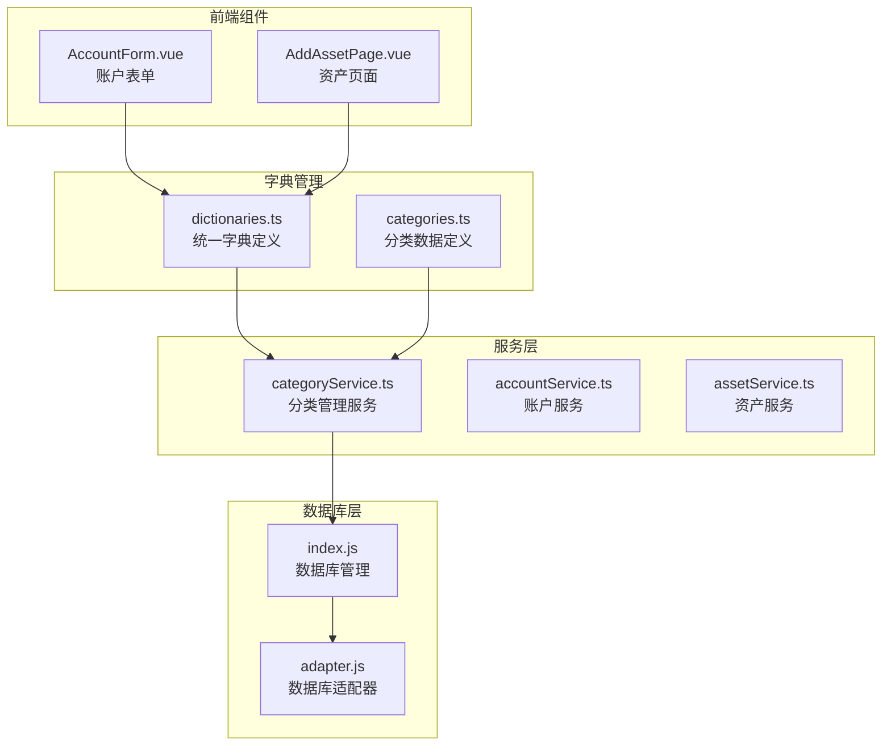
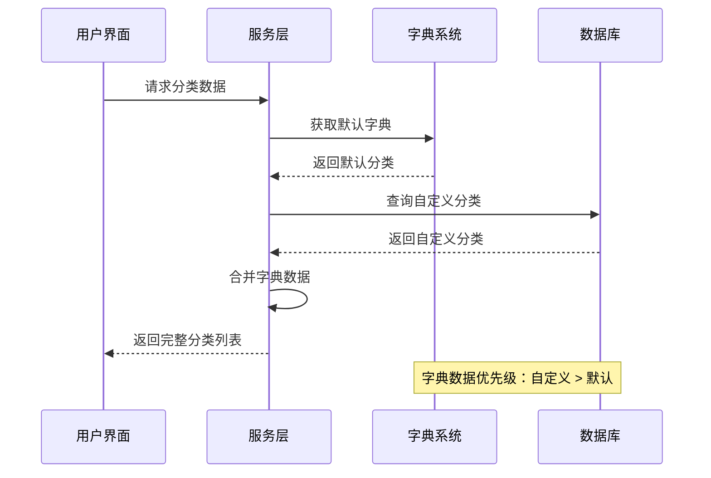
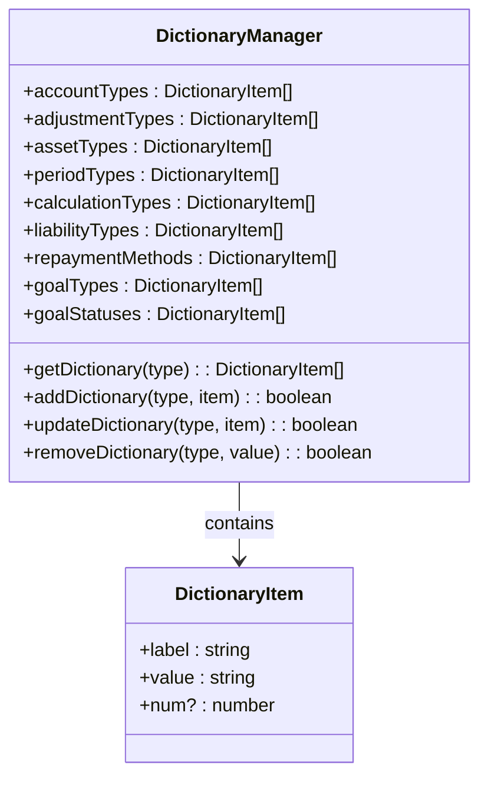
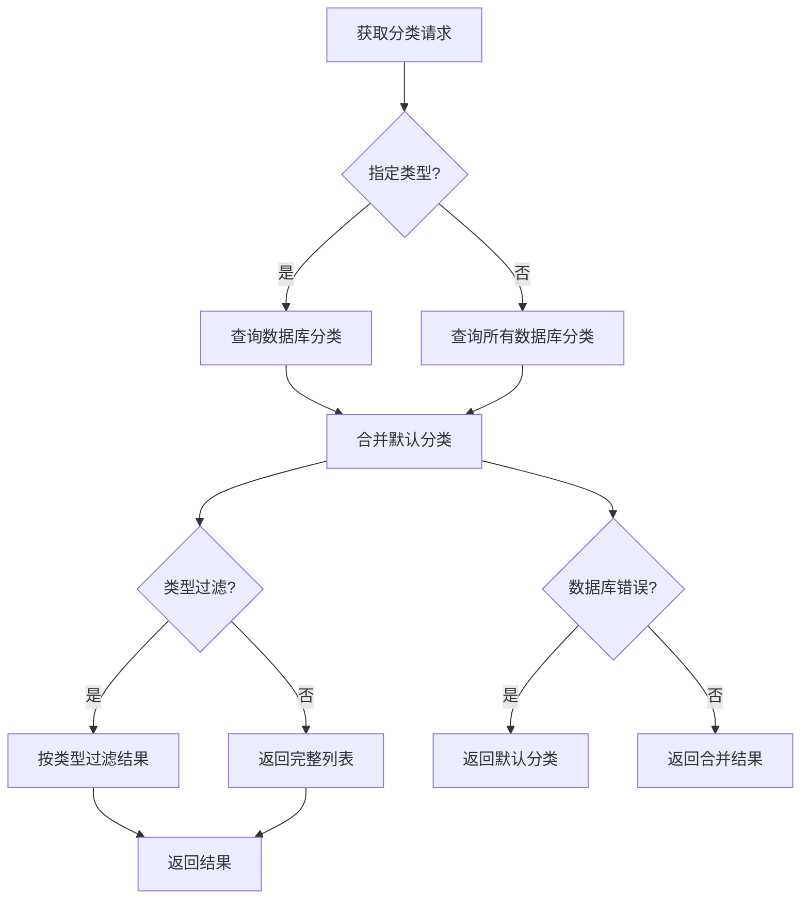
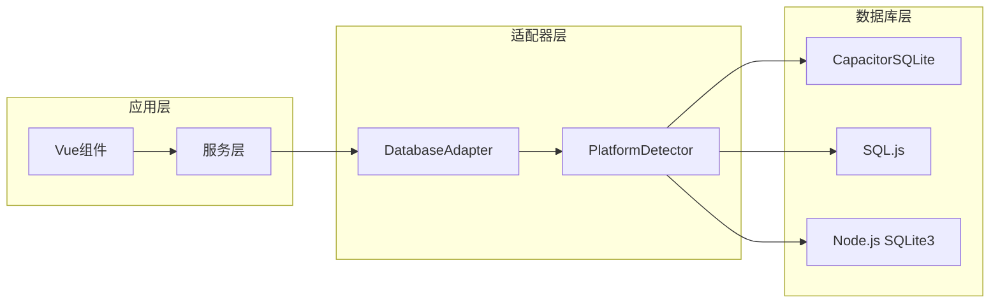
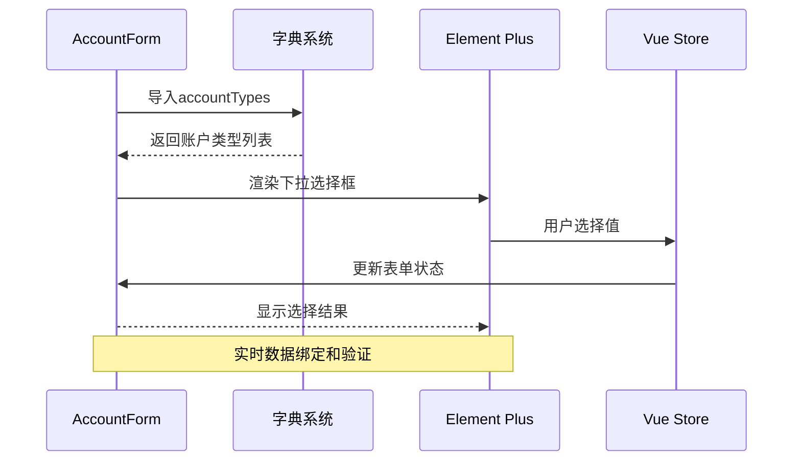
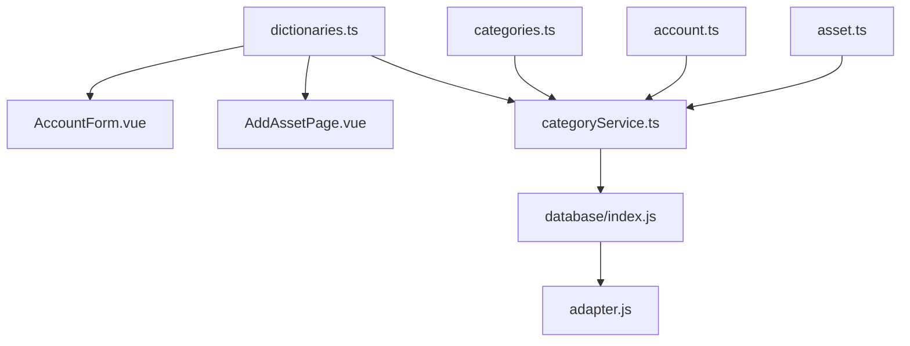

# 字典系统文档

<cite>
**本文档引用的文件**
- [dictionaries.ts](file://src/utils/dictionaries.ts)
- [categories.ts](file://src/data/categories.ts)
- [categoryService.ts](file://src/services/categoryService.ts)
- [account.ts](file://src/types/account/account.ts)
- [asset.ts](file://src/types/asset/asset.ts)
- [index.js](file://src/database/index.js)
- [adapter.js](file://src/database/adapter.js)
- [AccountForm.vue](file://src/components/mobile/account/AccountForm.vue)
- [AddAssetPage.vue](file://src/components/mobile/asset/AddAssetPage.vue)
- [package.json](file://package.json)
</cite>

## 目录
1. [简介](#简介)
2. [项目结构](#项目结构)
3. [核心组件](#核心组件)
4. [架构概览](#架构概览)
5. [详细组件分析](#详细组件分析)
6. [依赖关系分析](#依赖关系分析)
7. [性能考虑](#性能考虑)
8. [故障排除指南](#故障排除指南)
9. [结论](#结论)

## 简介

本项目采用统一的字典管理系统来管理各种业务枚举值和静态数据。字典系统通过集中化的数据结构提供了一致的业务规则定义，支持账户类型、资产类型、负债类型、财务目标类型等多种业务场景。

系统设计遵循以下原则：
- **集中管理**：所有字典数据统一存储在单一文件中
- **类型安全**：通过TypeScript接口确保数据结构的一致性
- **可扩展性**：支持动态添加和修改字典项
- **跨平台兼容**：支持Electron、移动端和Web环境

## 项目结构

字典系统主要分布在以下几个核心目录中：

**图表来源**
- [dictionaries.ts:1-115](file://src/utils/dictionaries.ts#L1-L115)
- [categoryService.ts:1-261](file://src/services/categoryService.ts#L1-L261)
- [index.js:1-972](file://src/database/index.js#L1-L972)

**章节来源**
- [dictionaries.ts:1-115](file://src/utils/dictionaries.ts#L1-L115)
- [categories.ts:1-45](file://src/data/categories.ts#L1-L45)

## 核心组件

### 字典数据结构

字典系统采用统一的数据结构定义，每个字典项包含以下属性：
- `label`: 显示标签
- `value`: 实际值
- `num`: 数值属性（用于周期类型）

### 主要字典类别

系统包含以下主要字典类别：

#### 账户相关字典
- **账户类型**: 现金、微信、支付宝、储蓄卡、社保卡、公积金、信用卡
- **余额调整类型**: 修正错误、现金赠与、资产盘盈

#### 资产相关字典
- **普通资产类型**: 储蓄、利息、租金、版权、社保、公积金、亲友借款
- **收益周期类型**: 每年、每月、每日
- **收益计算类型**: 无、按金额计算、按年收益率计算

#### 负债相关字典
- **负债类型**: 房贷、车贷、信用卡、消费贷、装修贷、助学贷款、网贷、电商分期、租金分期、亲友借款、经营贷、其他负债
- **还款方式**: 等额本息、等额本金、随借随还
- **负债状态**: 未结清、已结清
- **还款类型**: 正常还款、提前还款

#### 财务目标相关字典
- **目标类型**: 储蓄类、还款类、投资类、应急金类
- **目标状态**: 未开始、进行中、已完成、已终止

**章节来源**
- [dictionaries.ts:8-114](file://src/utils/dictionaries.ts#L8-L114)

## 架构概览

字典系统采用分层架构设计，确保数据的一致性和可维护性：

**图表来源**
- [categoryService.ts:15-70](file://src/services/categoryService.ts#L15-L70)
- [categories.ts:9-45](file://src/data/categories.ts#L9-L45)

## 详细组件分析

### 字典管理器 (Dictionary Manager)

字典管理器负责统一管理和提供各类业务字典数据：

**图表来源**
- [dictionaries.ts:8-114](file://src/utils/dictionaries.ts#L8-L114)

### 分类服务 (Category Service)

分类服务提供完整的CRUD操作和数据合并功能：

**图表来源**
- [categoryService.ts:15-70](file://src/services/categoryService.ts#L15-L70)

**章节来源**
- [categoryService.ts:1-261](file://src/services/categoryService.ts#L1-L261)

### 数据库集成

系统支持多种数据库后端，通过适配器模式实现统一接口：

**图表来源**
- [adapter.js:1-34](file://src/database/adapter.js#L1-L34)
- [index.js:1-972](file://src/database/index.js#L1-L972)

**章节来源**
- [adapter.js:1-34](file://src/database/adapter.js#L1-L34)
- [index.js:1-972](file://src/database/index.js#L1-L972)

### 前端组件集成

前端组件通过导入字典数据实现数据驱动的用户界面：

**图表来源**
- [AccountForm.vue:17-38](file://src/components/mobile/account/AccountForm.vue#L17-L38)
- [dictionaries.ts:8-17](file://src/utils/dictionaries.ts#L8-L17)

**章节来源**
- [AccountForm.vue:1-41](file://src/components/mobile/account/AccountForm.vue#L1-L41)
- [AddAssetPage.vue:1-200](file://src/components/mobile/asset/AddAssetPage.vue#L1-L200)

## 依赖关系分析

### 外部依赖

系统依赖以下关键包来支持字典功能：

| 依赖包 | 版本 | 用途 |
|--------|------|------|
| @capacitor-community/sqlite | ^6.0.1 | 移动端SQLite数据库 |
| sql.js | ^1.10.3 | Web环境SQLite实现 |
| element-plus | ^2.13.7 | UI组件库，支持字典选择 |
| vue | ^3.5.32 | 前端框架 |

### 内部模块依赖

**图表来源**
- [dictionaries.ts:1-115](file://src/utils/dictionaries.ts#L1-L115)
- [categoryService.ts:1-261](file://src/services/categoryService.ts#L1-L261)

**章节来源**
- [package.json:19-38](file://package.json#L19-L38)

## 性能考虑

### 缓存策略

数据库查询结果采用缓存机制以提升性能：
- 查询结果缓存，避免重复数据库访问
- 缓存键基于SQL语句和参数生成
- 自动清理机制防止内存泄漏

### 连接管理

数据库连接采用单例模式：
- 避免重复建立数据库连接
- 支持连接状态检测和恢复
- 异步连接管理，避免阻塞主线程

### 平台优化

针对不同平台的性能优化：
- 移动端使用原生SQLite，性能最优
- Web环境使用SQL.js，支持离线存储
- 自适应的持久化策略

## 故障排除指南

### 常见问题及解决方案

#### 数据库连接问题
**症状**: 分类数据无法加载
**原因**: 数据库连接失败或权限不足
**解决方案**: 
1. 检查数据库初始化状态
2. 验证平台适配器配置
3. 查看控制台错误日志

#### 字典数据不一致
**症状**: 显示的字典选项与预期不符
**原因**: 缓存数据过期或合并逻辑错误
**解决方案**:
1. 清除查询缓存
2. 重新初始化默认字典
3. 检查自定义字典的唯一性

#### 平台兼容性问题
**症状**: 在某些平台上无法正常工作
**原因**: 平台特定的数据库实现差异
**解决方案**:
1. 验证Capacitor插件安装
2. 检查Web环境的SQL.js初始化
3. 确认权限配置正确

**章节来源**
- [categoryService.ts:182-195](file://src/services/categoryService.ts#L182-L195)
- [index.js:200-264](file://src/database/index.js#L200-L264)

## 结论

本字典系统通过统一的数据管理和分层架构设计，为财务应用提供了灵活、可扩展的业务字典支持。系统的主要优势包括：

1. **统一管理**: 集中化的字典定义便于维护和更新
2. **类型安全**: TypeScript接口确保数据结构的一致性
3. **跨平台兼容**: 支持多种运行环境和数据库后端
4. **性能优化**: 缓存机制和连接管理提升系统响应速度
5. **易于扩展**: 模块化设计支持新字典类型的快速添加

通过合理的架构设计和完善的错误处理机制，该字典系统能够满足财务应用对数据一致性和可靠性的严格要求，为用户提供稳定、高效的使用体验。