# 收入统计分析

<cite>
**本文档引用的文件**
- [IncomeStats.vue](file://src/components/mobile/income/IncomeStats.vue)
- [MonthlyStats.vue](file://src/components/mobile/income/MonthlyStats.vue)
- [WeeklyIncome.vue](file://src/components/mobile/income/WeeklyIncome.vue)
- [accountService.ts](file://src/services/account/accountService.ts)
- [account.ts](file://src/stores/account.ts)
- [account.ts 类型定义](file://src/types/account/account.ts)
- [calculations.ts](file://src/utils/calculations.ts)
- [index.js 数据库管理](file://src/database/index.js)
- [categoryService.ts](file://src/services/categoryService.ts)
- [categories.ts](file://src/data/categories.ts)
- [Calendar.vue](file://src/components/common/calendar/Calendar.vue)
- [main.ts 应用入口](file://src/main.ts)
- [package.json](file://package.json)
</cite>

## 目录
1. [简介](#简介)
2. [项目结构](#项目结构)
3. [核心组件](#核心组件)
4. [架构概览](#架构概览)
5. [详细组件分析](#详细组件分析)
6. [依赖关系分析](#依赖关系分析)
7. [性能考虑](#性能考虑)
8. [故障排除指南](#故障排除指南)
9. [结论](#结论)

## 简介

这是一个基于Vue 3和Electron的跨平台财务管理应用，专注于提供全面的收入统计分析功能。该应用采用现代前端技术栈，支持桌面端和移动端部署，通过SQLite数据库实现数据持久化，提供直观的可视化图表来帮助用户理解和分析个人财务状况。

应用的核心特色包括：
- **多维度收入分析**：支持日、周、月、年的收入统计
- **可视化图表**：集成ECharts实现丰富的数据可视化
- **跨平台兼容**：同时支持Electron桌面应用和移动设备
- **实时数据同步**：通过Pinia状态管理实现组件间数据共享
- **灵活的分类系统**：支持自定义收入分类和标签管理

## 项目结构

该项目采用模块化的Vue 3单页应用架构，主要目录结构如下：

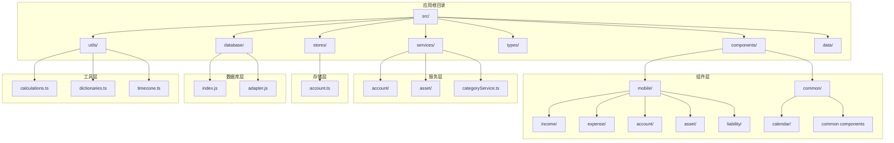

**图表来源**
- [main.ts:1-164](file://src/main.ts#L1-L164)
- [package.json:1-74](file://package.json#L1-L74)

**章节来源**
- [main.ts:1-164](file://src/main.ts#L1-L164)
- [package.json:1-74](file://package.json#L1-L74)

## 核心组件

### 收入统计主组件

收入统计功能由多个相互协作的组件构成，形成完整的统计分析体系：

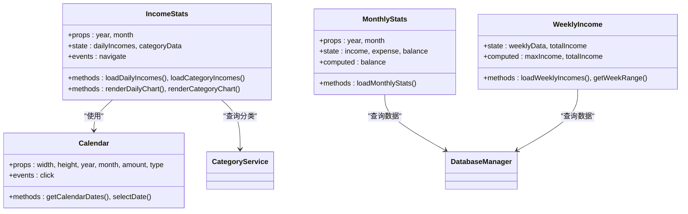

**图表来源**
- [IncomeStats.vue:77-466](file://src/components/mobile/income/IncomeStats.vue#L77-L466)
- [MonthlyStats.vue:9-90](file://src/components/mobile/income/MonthlyStats.vue#L9-L90)
- [WeeklyIncome.vue:21-154](file://src/components/mobile/income/WeeklyIncome.vue#L21-L154)
- [Calendar.vue:75-283](file://src/components/common/calendar/Calendar.vue#L75-L283)

### 数据库架构

应用采用SQLite作为主要数据存储，支持原生平台和Web平台两种部署方式：

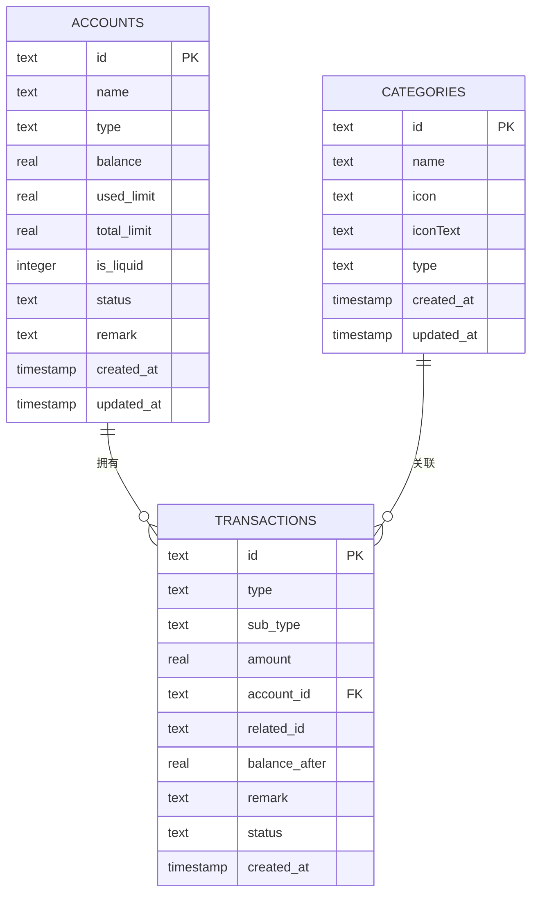

**图表来源**
- [index.js 数据库管理:433-754](file://src/database/index.js#L433-L754)

**章节来源**
- [IncomeStats.vue:131-260](file://src/components/mobile/income/IncomeStats.vue#L131-L260)
- [MonthlyStats.vue:41-79](file://src/components/mobile/income/MonthlyStats.vue#L41-L79)
- [WeeklyIncome.vue:77-149](file://src/components/mobile/income/WeeklyIncome.vue#L77-L149)

## 架构概览

应用采用分层架构设计，确保各层职责清晰分离：

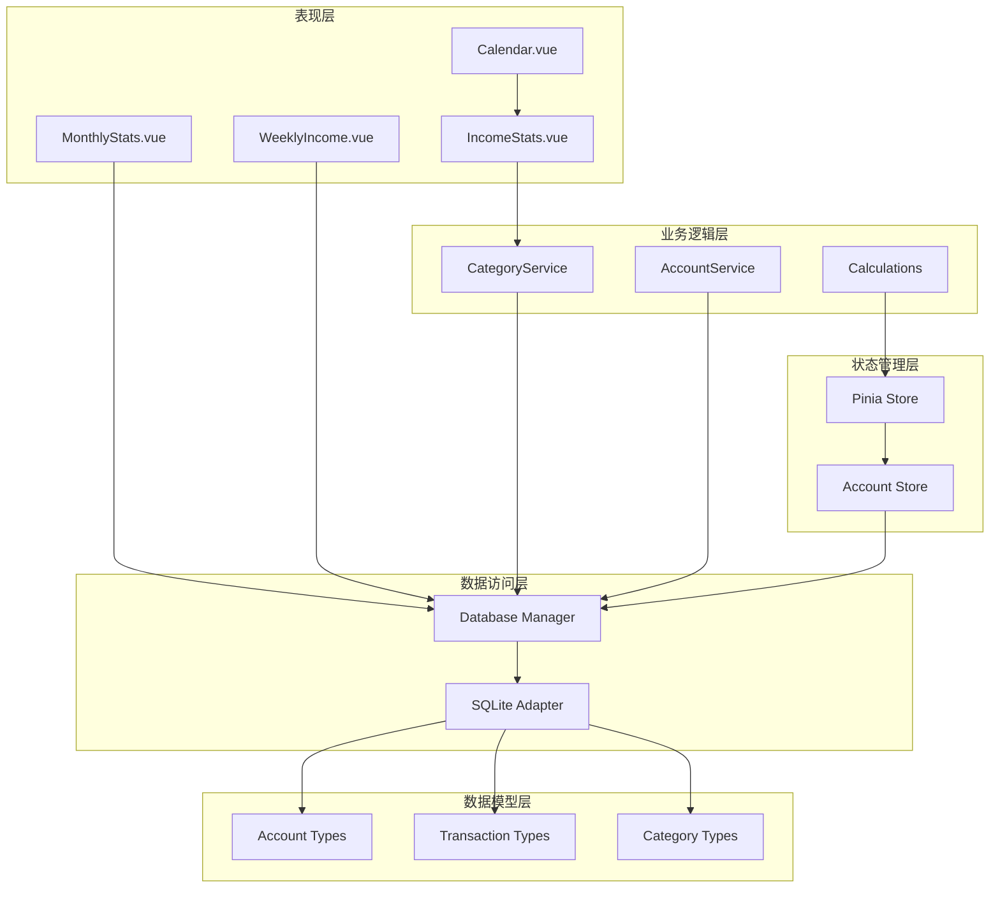

**图表来源**
- [main.ts:54-104](file://src/main.ts#L54-L104)
- [index.js 数据库管理:21-374](file://src/database/index.js#L21-L374)

### 技术栈特性

应用采用现代化技术栈，具备以下特性：

- **Vue 3 Composition API**：提供更好的类型推断和更清晰的代码组织
- **TypeScript**：增强代码质量和开发体验
- **Element Plus**：提供丰富的UI组件库
- **ECharts**：实现专业的数据可视化
- **Pinia**：现代化的状态管理方案
- **Capacitor**：实现跨平台原生功能
- **Electron**：支持桌面应用部署

**章节来源**
- [package.json:19-38](file://package.json#L19-L38)
- [main.ts:1-164](file://src/main.ts#L1-L164)

## 详细组件分析

### 收入统计组件 (IncomeStats)

IncomeStats组件提供了完整的收入统计分析功能，包括日历视图、趋势图表和分类分析：

#### 核心功能流程

```mermaid
sequenceDiagram
participant User as 用户
participant Component as IncomeStats组件
participant DB as 数据库
participant Chart as 图表渲染器
User->>Component : 访问收入统计页面
Component->>DB : 查询当月每日收入数据
DB-->>Component : 返回收入数据
Component->>Component : 处理数据并填充日历
Component->>Chart : 渲染日收入趋势图
Component->>Chart : 渲染收入分类饼图
User->>Component : 选择特定日期
Component->>DB : 查询该日期详细收入
DB-->>Component : 返回详细数据
Component-->>User : 显示日期详情
```

**图表来源**
- [IncomeStats.vue:131-466](file://src/components/mobile/income/IncomeStats.vue#L131-L466)

#### 数据处理算法

组件实现了高效的收入数据聚合算法：

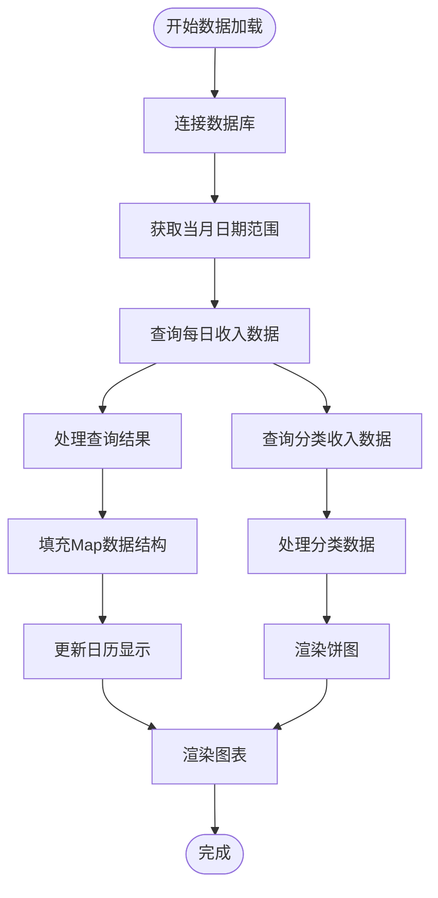

**图表来源**
- [IncomeStats.vue:131-260](file://src/components/mobile/income/IncomeStats.vue#L131-L260)

**章节来源**
- [IncomeStats.vue:77-466](file://src/components/mobile/income/IncomeStats.vue#L77-L466)

### 月度统计组件 (MonthlyStats)

MonthlyStats组件提供月度财务概览，展示收入、支出和结余情况：

#### 统计计算逻辑

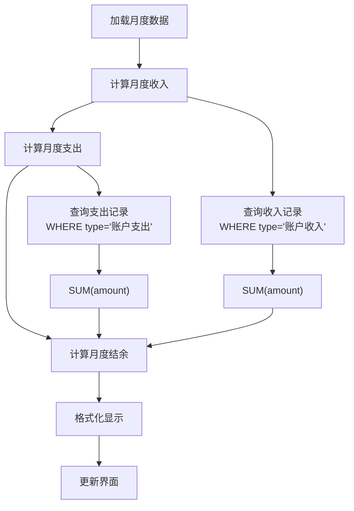

**图表来源**
- [MonthlyStats.vue:41-89](file://src/components/mobile/income/MonthlyStats.vue#L41-L89)

**章节来源**
- [MonthlyStats.vue:9-90](file://src/components/mobile/income/MonthlyStats.vue#L9-L90)

### 周度收入组件 (WeeklyIncome)

WeeklyIncome组件专注于一周内的收入趋势分析：

#### 周期计算算法

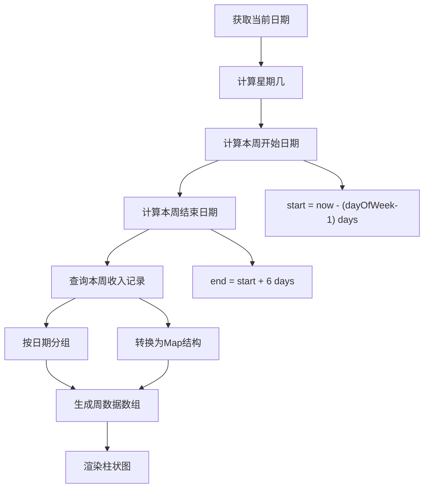

**图表来源**
- [WeeklyIncome.vue:59-135](file://src/components/mobile/income/WeeklyIncome.vue#L59-L135)

**章节来源**
- [WeeklyIncome.vue:21-154](file://src/components/mobile/income/WeeklyIncome.vue#L21-L154)

### 数据库管理系统

数据库管理器实现了跨平台的数据持久化解决方案：

#### 连接管理策略

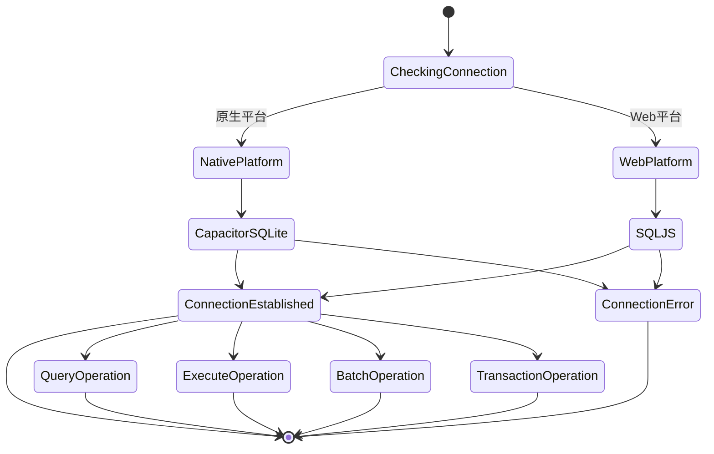

**图表来源**
- [index.js 数据库管理:56-190](file://src/database/index.js#L56-L190)

**章节来源**
- [index.js 数据库管理:21-374](file://src/database/index.js#L21-L374)

### 分类服务系统

分类服务提供了灵活的分类管理功能：

#### 分类数据合并逻辑

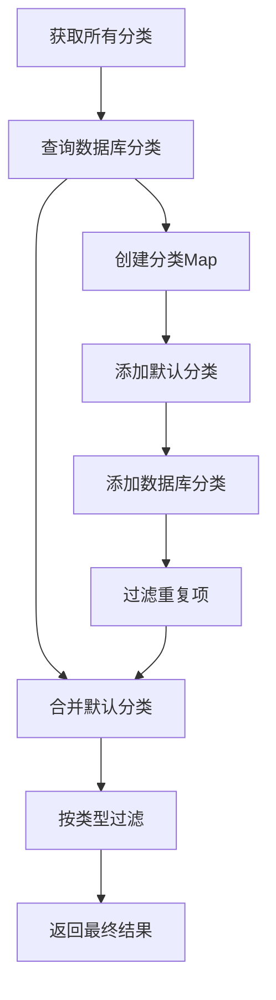

**图表来源**
- [categoryService.ts:15-70](file://src/services/categoryService.ts#L15-L70)

**章节来源**
- [categoryService.ts:9-261](file://src/services/categoryService.ts#L9-L261)

## 依赖关系分析

### 核心依赖关系

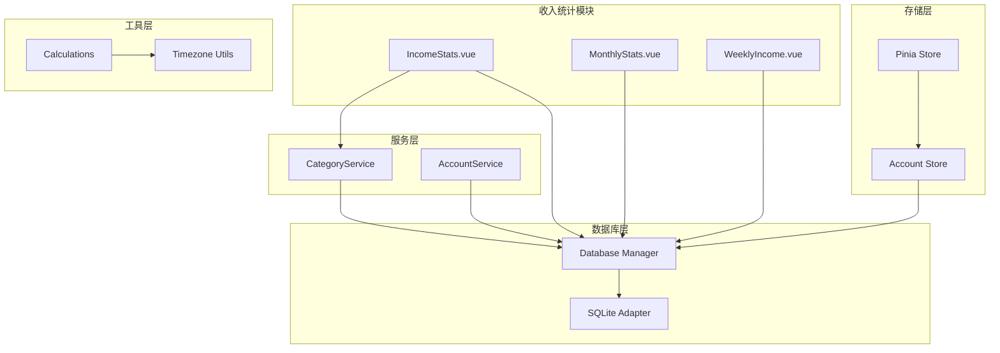

**图表来源**
- [main.ts:54-104](file://src/main.ts#L54-L104)
- [account.ts:28-273](file://src/stores/account.ts#L28-L273)

### 第三方库依赖

应用使用了多个关键的第三方库来实现核心功能：

| 依赖库 | 版本 | 主要用途 |
|--------|------|----------|
| vue | ^3.5.32 | 前端框架 |
| element-plus | ^2.13.7 | UI组件库 |
| echarts | ^6.0.0 | 数据可视化 |
| pinia | ^2.1.7 | 状态管理 |
| dayjs | ^1.11.20 | 日期处理 |
| @capacitor-community/sqlite | ^6.0.1 | 原生数据库 |
| sql.js | ^1.10.3 | Web数据库 |

**章节来源**
- [package.json:19-38](file://package.json#L19-L38)

## 性能考虑

### 数据库性能优化

应用实现了多项数据库性能优化措施：

1. **连接池管理**：避免重复建立数据库连接
2. **查询缓存**：缓存常用查询结果
3. **批量操作**：支持批量SQL执行
4. **索引优化**：为常用查询字段建立索引

### 图表渲染优化

ECharts图表组件采用了以下优化策略：

1. **懒加载**：按需加载图表库
2. **数据压缩**：减少传输数据量
3. **渲染节流**：避免频繁重绘
4. **内存管理**：及时清理图表实例

### 响应式设计

组件实现了良好的响应式设计：

1. **移动端优先**：针对移动设备优化布局
2. **自适应尺寸**：根据屏幕尺寸调整组件大小
3. **触摸友好**：优化触摸交互体验
4. **性能监控**：提供性能指标监控

## 故障排除指南

### 常见问题及解决方案

#### 数据库连接问题

**问题症状**：应用启动时数据库连接失败

**可能原因**：
1. 数据库文件损坏
2. 权限不足
3. 存储空间不足

**解决步骤**：
1. 检查数据库文件完整性
2. 验证应用存储权限
3. 清理存储空间
4. 重启应用服务

#### 图表渲染异常

**问题症状**：收入统计图表无法正常显示

**可能原因**：
1. ECharts库加载失败
2. 数据格式不正确
3. 内存不足

**解决步骤**：
1. 检查网络连接
2. 验证数据格式
3. 清理浏览器缓存
4. 重启应用

#### 性能问题

**问题症状**：应用运行缓慢或卡顿

**可能原因**：
1. 数据量过大
2. 内存泄漏
3. 图表渲染过多

**解决步骤**：
1. 优化查询条件
2. 实施数据分页
3. 减少同时渲染的图表数量
4. 清理无用数据

**章节来源**
- [index.js 数据库管理:214-264](file://src/database/index.js#L214-L264)
- [IncomeStats.vue:159-162](file://src/components/mobile/income/IncomeStats.vue#L159-L162)

## 结论

这个收入统计分析系统展现了现代前端应用的最佳实践，通过精心设计的架构和优化的性能策略，为用户提供了一个功能完整、性能优异的财务管理工具。

### 主要优势

1. **架构清晰**：分层设计确保了代码的可维护性和可扩展性
2. **性能优秀**：多项性能优化措施保证了流畅的用户体验
3. **跨平台支持**：统一的技术栈实现了多平台部署
4. **数据安全**：本地化存储确保了用户数据的安全性
5. **用户体验**：直观的界面设计和丰富的可视化功能

### 技术亮点

- **TypeScript集成**：提供了强大的类型安全和开发体验
- **ECharts集成**：实现了专业级的数据可视化效果
- **跨平台架构**：通过Capacitor实现了原生功能
- **状态管理**：使用Pinia提供了现代化的状态管理方案

### 发展方向

未来可以考虑的功能增强：
1. **实时数据同步**：支持多设备间的数据同步
2. **AI辅助分析**：提供智能财务建议
3. **导出功能**：支持数据导出和备份
4. **通知提醒**：提供财务提醒和预警功能

这个项目为财务管理应用的开发提供了优秀的参考模板，展示了如何在保持代码质量的同时实现复杂的功能需求。