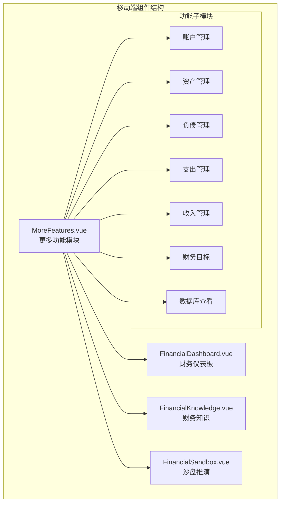
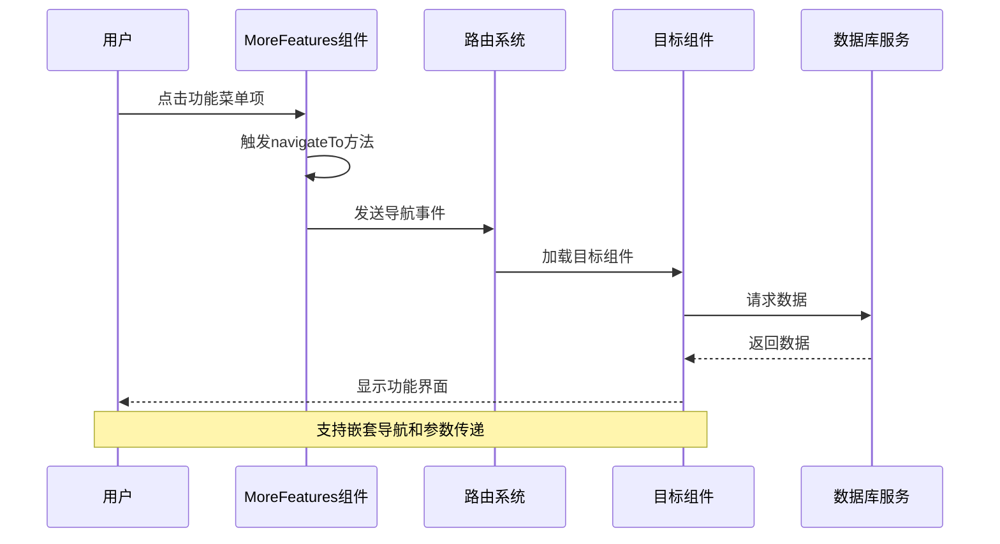
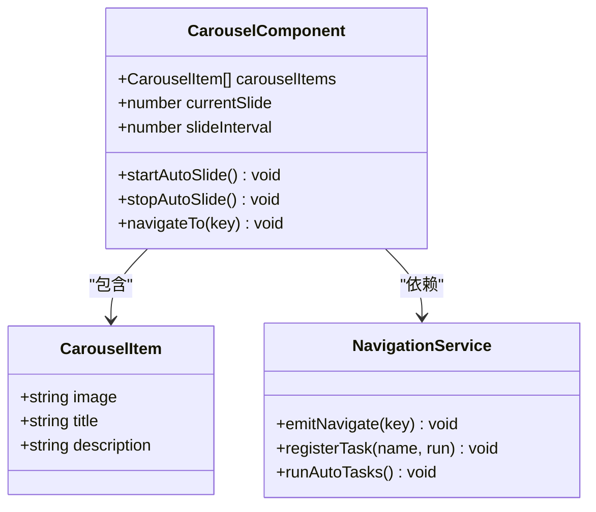
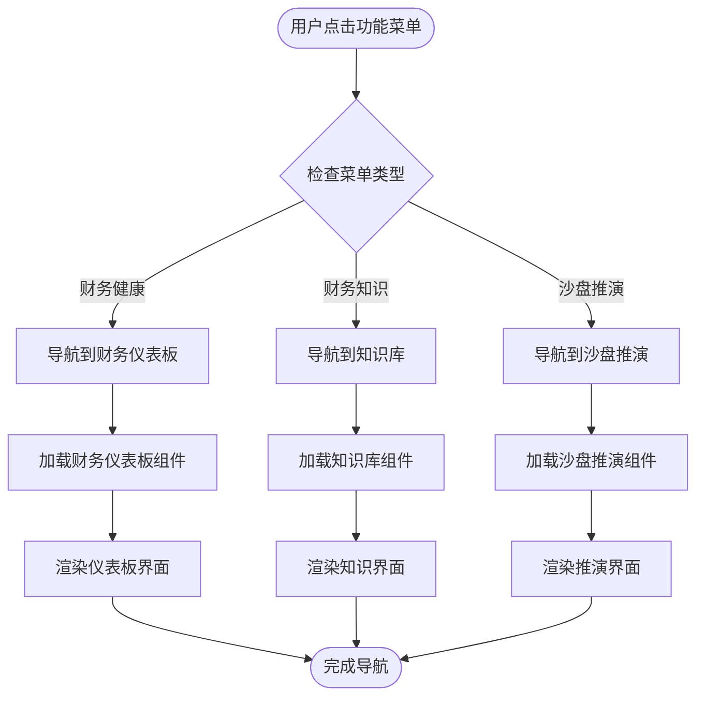
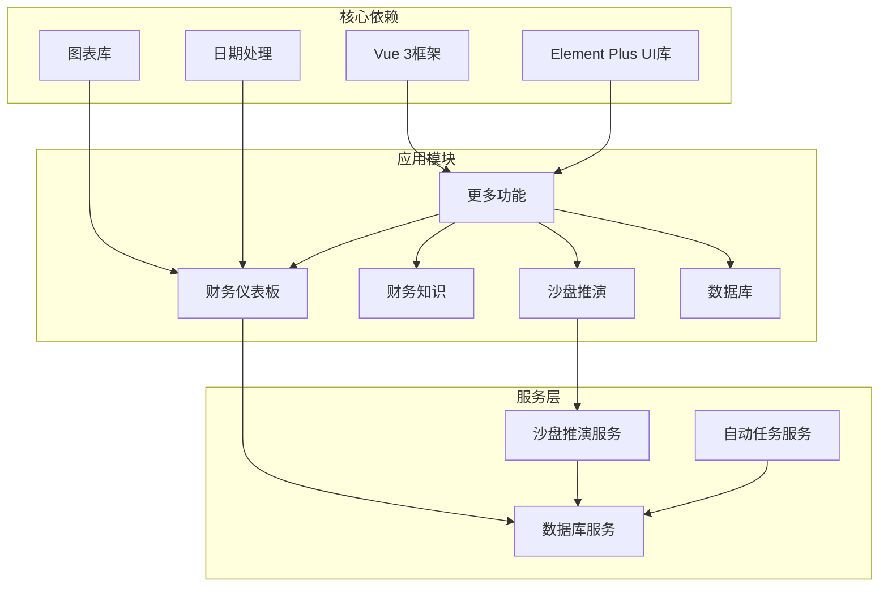

# 更多功能

<cite>
**本文档引用的文件**
- [MoreFeatures.vue](file://src/components/mobile/more/MoreFeatures.vue)
- [FinancialDashboard.vue](file://src/components/mobile/dashboard/FinancialDashboard.vue)
- [FinancialKnowledge.vue](file://src/components/mobile/knowledge/FinancialKnowledge.vue)
- [FinancialSandbox.vue](file://src/components/mobile/sandbox/FinancialSandbox.vue)
- [sandboxService.ts](file://src/services/sandbox/sandboxService.ts)
- [snapshotTask.ts](file://src/auto/tasks/snapshotTask.ts)
- [index.ts](file://src/auto/index.ts)
- [index.ts](file://src/auto/tasks/index.ts)
- [App.vue](file://src/App.vue)
- [main.ts](file://src/main.ts)
- [index.js](file://src/database/index.js)
- [package.json](file://package.json)
</cite>

## 目录
1. [简介](#简介)
2. [项目结构](#项目结构)
3. [核心组件](#核心组件)
4. [架构概览](#架构概览)
5. [详细组件分析](#详细组件分析)
6. [依赖关系分析](#依赖关系分析)
7. [性能考虑](#性能考虑)
8. [故障排除指南](#故障排除指南)
9. [结论](#结论)

## 简介

"更多功能"是裕安财务应用中的一个核心模块，为用户提供了一个集中的功能入口界面。该模块不仅展示了应用的主要功能特性，还集成了财务仪表板、知识库、沙盘推演等重要功能。通过轮播图展示和网格布局的功能菜单，用户可以快速访问应用的各种财务管理工具。

该模块的设计体现了现代财务管理应用的特点，将复杂的财务概念通过直观的界面呈现给用户，同时提供了智能化的财务分析和预测功能。

## 项目结构

裕安财务应用采用模块化的Vue 3架构设计，"更多功能"模块位于移动端组件结构中，与账户管理、资产管理、负债管理等功能模块并列。

**图表来源**
- [MoreFeatures.vue:1-297](file://src/components/mobile/more/MoreFeatures.vue#L1-L297)
- [App.vue:34-67](file://src/App.vue#L34-L67)

**章节来源**
- [MoreFeatures.vue:1-297](file://src/components/mobile/more/MoreFeatures.vue#L1-L297)
- [App.vue:34-113](file://src/App.vue#L34-L113)

## 核心组件

"更多功能"模块由三个主要部分组成：

### 1. 轮播图展示区
- **自动轮播功能**：每3秒自动切换一次，支持手动点击指示器进行切换
- **响应式设计**：针对不同屏幕尺寸提供优化的显示效果
- **动态内容**：展示财务目标、预算管理和投资分析等核心功能

### 2. 功能菜单区
采用3列网格布局，包含以下核心功能：
- **财务健康**：跳转到财务仪表板，查看综合财务评分和健康指标
- **财务知识**：访问财商知识库，包含书籍精华、科普内容、观点内容等
- **沙盘推演**：进入财务情景推演系统，进行各种财务假设测试

### 3. 导航系统
通过统一的导航接口与应用其他模块集成，实现平滑的功能切换。

**章节来源**
- [MoreFeatures.vue:24-50](file://src/components/mobile/more/MoreFeatures.vue#L24-L50)
- [MoreFeatures.vue:62-78](file://src/components/mobile/more/MoreFeatures.vue#L62-L78)

## 架构概览

"更多功能"模块采用MVVM架构模式，结合Vue 3的Composition API实现响应式数据绑定和组件通信。

**图表来源**
- [MoreFeatures.vue:104-107](file://src/components/mobile/more/MoreFeatures.vue#L104-L107)
- [App.vue:194-201](file://src/App.vue#L194-L201)

**章节来源**
- [main.ts:95-110](file://src/main.ts#L95-L110)
- [App.vue:194-201](file://src/App.vue#L194-L201)

## 详细组件分析

### 轮播图组件分析

轮播图组件实现了完整的图片展示和用户交互功能：

**图表来源**
- [MoreFeatures.vue:54-108](file://src/components/mobile/more/MoreFeatures.vue#L54-L108)

#### 轮播图功能特性

1. **自动播放控制**：使用setInterval实现3秒间隔的自动切换
2. **生命周期管理**：在组件挂载时启动，在卸载时清理定时器
3. **用户交互**：支持点击指示器进行手动切换
4. **响应式设计**：针对不同屏幕尺寸优化显示效果

#### 导航系统分析

**图表来源**
- [MoreFeatures.vue:26-49](file://src/components/mobile/more/MoreFeatures.vue#L26-L49)
- [App.vue:76-113](file://src/App.vue#L76-L113)

**章节来源**
- [MoreFeatures.vue:83-102](file://src/components/mobile/more/MoreFeatures.vue#L83-L102)
- [App.vue:76-113](file://src/App.vue#L76-L113)

### 财务仪表板集成

财务仪表板作为"更多功能"模块的重要组成部分，提供了全面的财务健康分析：

#### 综合评分系统
- **评分算法**：基于6个核心指标的加权计算
- **等级划分**：优秀(90+)、良好(70+)、一般(50+)、较弱(30+)、危险(<30)
- **实时更新**：根据最新财务数据动态计算

#### 财务健康指标
- **月度现金流**：收入减去日常支出
- **月度结余**：考虑投资亏损和月供后的净现金流
- **净资产**：总资产减去总负债
- **债务收入比**：月供占月收入的比例
- **资产负债率**：总负债占资产总额的比例
- **资产月增长率**：与上月相比的增长率

**章节来源**
- [FinancialDashboard.vue:302-358](file://src/components/mobile/dashboard/FinancialDashboard.vue#L302-L358)
- [FinancialDashboard.vue:421-511](file://src/components/mobile/dashboard/FinancialDashboard.vue#L421-L511)

### 沙盘推演系统

沙盘推演系统提供了14种不同的财务情景模拟：

#### 推演场景类型
1. **失业维持时长推演**：评估失业后的生存能力
2. **债务利率上涨推演**：分析利率上升对还款压力的影响
3. **股票/基金下跌推演**：评估投资组合下跌的影响
4. **每月多存流动资金推演**：测试定期储蓄的效果
5. **提前还清负债推演**：分析提前还款的财务影响
6. **收入上涨推演**：评估收入增长的长期效应
7. **大额一次性支出推演**：分析重大支出的影响
8. **收入下降推演**：评估收入减少的风险
9. **投资变现推演**：分析投资出售的后果
10. **新增负债推演**：评估新增债务的影响
11. **应急金不足推演**：测试应急资金缺口
12. **投资亏损推演**：分析投资损失的恢复
13. **固定支出增加推演**：评估固定支出增加的影响
14. **被动收入增加推演**：测试被动收入增长的效果

#### 计算引擎
每个推演场景都有专门的计算逻辑，包括：
- **参数验证**：确保输入数据的有效性
- **财务模型**：基于用户当前财务状况进行计算
- **结果分析**：提供详细的财务影响分析
- **可视化展示**：通过图表展示推演结果

**章节来源**
- [sandboxService.ts:57-155](file://src/services/sandbox/sandboxService.ts#L57-L155)
- [sandboxService.ts:279-704](file://src/services/sandbox/sandboxService.ts#L279-L704)

### 自动任务系统

应用集成了自动任务执行机制，确保关键功能的自动化运行：

#### 月度财务快照任务
- **执行时机**：应用启动时自动运行
- **数据收集**：汇总所有账户、资产、负债信息
- **计算逻辑**：计算总资产、总负债、净资产等关键指标
- **存储机制**：将结果保存到asset_monthly_snapshots表

#### 任务管理系统
- **注册机制**：通过registerTask函数注册新任务
- **执行顺序**：按注册顺序依次执行
- **错误处理**：单个任务失败不影响其他任务执行
- **调试支持**：提供任务名称列表查询功能

**章节来源**
- [snapshotTask.ts:12-121](file://src/auto/tasks/snapshotTask.ts#L12-L121)
- [index.ts:12-52](file://src/auto/index.ts#L12-L52)

## 依赖关系分析

"更多功能"模块与应用其他组件存在紧密的依赖关系：

**图表来源**
- [package.json:20-39](file://package.json#L20-L39)
- [main.ts:54-57](file://src/main.ts#L54-L57)

**章节来源**
- [package.json:20-53](file://package.json#L20-L53)
- [index.js:20-32](file://src/database/index.js#L20-L32)

### 数据库集成

应用使用统一的数据库管理器处理所有数据持久化：

#### 数据库适配器
- **原生平台**：使用Capacitor SQLite插件
- **Web平台**：使用sql.js库
- **自动检测**：根据运行环境选择合适的实现

#### 表结构设计
- **accounts**：账户信息表
- **assets**：资产信息表
- **stocks**：股票信息表
- **funds**：基金信息表
- **liabilities**：负债信息表
- **sandbox_history**：沙盘推演历史表
- **asset_monthly_snapshots**：月度财务快照表

**章节来源**
- [index.js:441-817](file://src/database/index.js#L441-L817)
- [adapter.js:14-33](file://src/database/adapter.js#L14-L33)

## 性能考虑

应用在设计时充分考虑了性能优化：

### 响应式设计优化
- **媒体查询**：针对不同屏幕尺寸提供优化的布局
- **弹性布局**：使用CSS Grid和Flexbox实现自适应
- **性能监控**：在开发环境中提供详细的性能日志

### 数据处理优化
- **查询缓存**：数据库查询结果缓存机制
- **批量操作**：支持批量SQL语句执行
- **事务处理**：确保数据一致性的事务管理

### 内存管理
- **组件销毁**：自动清理定时器和事件监听器
- **资源释放**：及时释放图表和数据库连接
- **垃圾回收**：避免内存泄漏的编程实践

## 故障排除指南

### 常见问题及解决方案

#### 轮播图不自动播放
1. **检查定时器状态**：确认slideInterval变量是否正确设置
2. **验证生命周期**：确保onMounted和onUnmounted钩子正确执行
3. **调试输出**：检查控制台是否有错误信息

#### 导航功能异常
1. **路由检查**：验证App.vue中的组件映射是否正确
2. **参数传递**：确认导航参数是否正确传递
3. **组件加载**：检查目标组件是否正确导入

#### 数据显示问题
1. **数据库连接**：验证数据库连接状态
2. **查询语句**：检查SQL查询语法
3. **数据格式**：确认数据类型转换正确

**章节来源**
- [MoreFeatures.vue:96-102](file://src/components/mobile/more/MoreFeatures.vue#L96-L102)
- [App.vue:194-201](file://src/App.vue#L194-L201)

## 结论

"更多功能"模块作为裕安财务应用的核心入口，成功地将复杂的功能整合到一个简洁直观的界面中。通过轮播图展示和网格布局的功能菜单，用户可以快速访问应用的各项核心功能。

该模块的设计体现了现代移动应用的最佳实践：
- **用户体验优先**：简洁直观的界面设计
- **功能完整性**：涵盖财务管理的主要方面
- **技术先进性**：采用最新的Vue 3技术和最佳实践
- **可扩展性**：模块化设计便于功能扩展

未来可以考虑的功能增强包括：
- 添加个性化推荐功能
- 集成更多财务分析工具
- 增强用户交互体验
- 优化性能表现