# UI组件

<cite>
**本文档引用的文件**
- [App.vue](file://src/App.vue)
- [main.ts](file://src/main.ts)
- [AppHeader.vue](file://src/components/common/AppHeader.vue)
- [AppContent.vue](file://src/components/common/AppContent.vue)
- [AppFooter.vue](file://src/components/common/AppFooter.vue)
- [PageHeader.vue](file://src/components/common/PageHeader.vue)
- [PageTemplate.vue](file://src/components/common/PageTemplate.vue)
- [SideMenu.vue](file://src/components/common/SideMenu.vue)
- [Calendar.vue](file://src/components/common/Calendar.vue)
- [FloatingActionMenu.vue](file://src/components/common/FloatingActionMenu.vue)
- [FloatingSwitchButton.vue](file://src/components/common/FloatingSwitchButton.vue)
- [StatOverview.vue](file://src/components/common/StatOverview.vue)
- [FinancialSandbox.vue](file://src/components/mobile/sandbox/FinancialSandbox.vue)
- [SandboxHistory.vue](file://src/components/mobile/sandbox/SandboxHistory.vue)
- [SandboxResultDetail.vue](file://src/components/mobile/sandbox/SandboxResultDetail.vue)
- [SandboxSimulationPage.vue](file://src/components/mobile/sandbox/SandboxSimulationPage.vue)
- [ExpensePage.vue](file://src/components/mobile/expense/ExpensePage.vue)
- [AccountManagement.vue](file://src/components/mobile/account/AccountManagement.vue)
- [AccountDetailPage.vue](file://src/components/mobile/account/AccountDetailPage.vue)
- [AssetDetailPage.vue](file://src/components/mobile/asset/AssetDetailPage.vue)
- [AssetManagement.vue](file://src/components/mobile/asset/AssetManagement.vue)
- [AssetCard.vue](file://src/components/mobile/asset/AssetCard.vue)
- [LiabilityManagement.vue](file://src/components/mobile/liability/LiabilityManagement.vue)
- [LiabilityDetailPage.vue](file://src/components/mobile/liability/LiabilityDetailPage.vue)
- [MonthlyStats.vue](file://src/components/mobile/expense/MonthlyStats.vue)
- [MoreFeatures.vue](file://src/components/mobile/more/MoreFeatures.vue)
- [sandboxService.ts](file://src/services/sandbox/sandboxService.ts)
- [assetService.ts](file://src/services/asset/assetService.ts)
- [stockService.ts](file://src/services/asset/stockService.ts)
- [fundService.ts](file://src/services/asset/fundService.ts)
- [asset.ts](file://src/types/asset/asset.ts)
- [stock.ts](file://src/types/asset/stock.ts)
- [fund.ts](file://src/types/asset/fund.ts)
- [package.json](file://package.json)
- [vite.config.ts](file://vite.config.ts)
- [tsconfig.json](file://tsconfig.json)
</cite>

## 更新摘要
**变更内容**
- AppHeader组件中的logo资源从远程API动态生成改为本地静态资源（@/assets/logo/app_logo.png）
- 移动端MoreFeatures组件的轮播图内容更新为本地图片资源（m3.jpg, m4.jpg, m5.jpg）
- 更换了对应的中文描述内容，提升了资源加载性能和应用稳定性

## 目录
1. [简介](#简介)
2. [项目结构](#项目结构)
3. [核心组件](#核心组件)
4. [架构总览](#架构总览)
5. [详细组件分析](#详细组件分析)
6. [依赖分析](#依赖分析)
7. [性能考虑](#性能考虑)
8. [故障排查指南](#故障排查指南)
9. [结论](#结论)
10. [附录](#附录)

## 简介
本文件面向财务应用程序的UI组件体系，系统性梳理通用布局组件（头部导航、页面内容、底部栏）、页面模板组件、侧边菜单、日历组件、浮动操作菜单以及新增的FloatingSwitchButton切换按钮组件的设计与实现要点。文档同时覆盖组件属性、事件、插槽、样式与主题适配、最佳实践与性能优化建议，并给出扩展与自定义指导，帮助开发者快速理解与高效使用这些组件。

**更新** 本次更新反映了应用的UI组件现代化升级，新增了FloatingSwitchButton浮动切换按钮组件，提供Material Design风格的绿色圆形按钮设计，支持历史推演与推演情景之间的快速切换。金融沙盒组件体系得到全面重构，包括FinancialSandbox沙盒首页、SandboxHistory历史记录、SandboxResultDetail结果详情、SandboxSimulationPage仿真页面四个核心组件，形成了完整的沙盒推演功能闭环。所有组件均采用统一的Material Design风格设计，显著提升了用户界面的一致性和专业性。

## 项目结构
应用采用"根组件 + 通用组件 + 移动端页面"的分层组织方式：
- 根组件负责全局布局与路由/状态协调
- 通用组件提供跨页面的基础UI能力，包括新增的FloatingSwitchButton切换按钮组件和重构的金融沙盒组件
- 移动端页面聚焦业务场景，组合通用组件完成具体页面

```mermaid
graph TB
subgraph "应用入口"
MAIN["main.ts<br/>初始化应用与插件"]
APP["App.vue<br/>全局布局与路由调度"]
end
subgraph "通用组件"
HEADER["AppHeader.vue<br/>头部导航"]
CONTENT["AppContent.vue<br/>内容区容器"]
FOOTER["AppFooter.vue<br/>底部导航"]
PHEADER["PageHeader.vue<br/>页面标题栏"]
PTEMPLATE["PageTemplate.vue<br/>页面模板"]
SIDEMENU["SideMenu.vue<br/>侧边菜单"]
CALENDAR["Calendar.vue<br/>日历"]
FAM["FloatingActionMenu.vue<br/>浮动操作菜单"]
FSB["FloatingSwitchButton.vue<br/>浮动切换按钮"]
STATOVERVIEW["StatOverview.vue<br/>财务统计组件"]
MOREFEATURES["MoreFeatures.vue<br/>更多功能页面"]
END
subgraph "金融沙盒组件"
FINANCIALSANDBOX["FinancialSandbox.vue<br/>沙盒首页"]
SANDBOXHISTORY["SandboxHistory.vue<br/>历史记录"]
SANDBOXRESULTDETAIL["SandboxResultDetail.vue<br/>结果详情"]
SANDBOXSIMULATIONPAGE["SandboxSimulationPage.vue<br/>仿真页面"]
END
subgraph "移动端页面"
EXPENSE["ExpensePage.vue<br/>支出页"]
ACCOUNTMGMT["AccountManagement.vue<br/>账户管理页"]
ACCOUNTDETAIL["AccountDetailPage.vue<br/>账户详情页"]
ASSETDETAIL["AssetDetailPage.vue<br/>通用资产详情页"]
ASSETMGMT["AssetManagement.vue<br/>资产管理页"]
ASSETCARD["AssetCard.vue<br/>资产卡片组件"]
LIABILITYMGMT["LiabilityManagement.vue<br/>负债管理页"]
LIABILITYDETAIL["LiabilityDetailPage.vue<br/>负债详情页"]
MONTHLYSTATS["MonthlyStats.vue<br/>月度统计页"]
end
MAIN --> APP
APP --> HEADER
APP --> CONTENT
APP --> FOOTER
APP --> SIDEMENU
CONTENT --> EXPENSE
CONTENT --> ACCOUNTMGMT
CONTENT --> ACCOUNTDETAIL
CONTENT --> ASSETMGMT
CONTENT --> ASSETDETAIL
CONTENT --> LIABILITYMGMT
CONTENT --> LIABILITYDETAIL
ASSETMGMT --> ASSETCARD
ASSETMGMT --> ASSETDETAIL
ASSETMGMT --> STATOVERVIEW
ACCOUNTMGMT --> FAM
ACCOUNTDETAIL --> FAM
LIABILITYMGMT --> STATOVERVIEW
LIABILITYDETAIL --> FAM
EXPENSE --> FAM
MONTHLYSTATS --> STATOVERVIEW
FINANCIALSANDBOX --> SANDBOXHISTORY
FINANCIALSANDBOX --> SANDBOXRESULTDETAIL
FINANCIALSANDBOX --> SANDBOXSIMULATIONPAGE
SANDBOXHISTORY --> SANDBOXRESULTDETAIL
SANDBOXSIMULATIONPAGE --> SANDBOXRESULTDETAIL
```

**图表来源**
- [main.ts:1-16](file://src/main.ts#L1-L16)
- [App.vue:1-223](file://src/App.vue#L1-L223)
- [AppHeader.vue:1-135](file://src/components/common/AppHeader.vue#L1-L135)
- [AppContent.vue:1-51](file://src/components/common/AppContent.vue#L1-L51)
- [AppFooter.vue:1-98](file://src/components/common/AppFooter.vue#L1-L98)
- [PageHeader.vue:1-57](file://src/components/common/PageHeader.vue#L1-L57)
- [PageTemplate.vue:1-103](file://src/components/common/PageTemplate.vue#L1-L103)
- [SideMenu.vue:1-255](file://src/components/common/SideMenu.vue#L1-L255)
- [Calendar.vue:1-477](file://src/components/common/Calendar.vue#L1-L477)
- [FloatingActionMenu.vue:1-151](file://src/components/common/FloatingActionMenu.vue#L1-L151)
- [FloatingSwitchButton.vue:1-59](file://src/components/common/FloatingSwitchButton.vue#L1-L59)
- [StatOverview.vue:1-119](file://src/components/common/StatOverview.vue#L1-L119)
- [MoreFeatures.vue:1-300](file://src/components/mobile/more/MoreFeatures.vue#L1-L300)
- [FinancialSandbox.vue:1-156](file://src/components/mobile/sandbox/FinancialSandbox.vue#L1-L156)
- [SandboxHistory.vue:1-179](file://src/components/mobile/sandbox/SandboxHistory.vue#L1-L179)
- [SandboxResultDetail.vue:1-334](file://src/components/mobile/sandbox/SandboxResultDetail.vue#L1-L334)
- [SandboxSimulationPage.vue:1-154](file://src/components/mobile/sandbox/SandboxSimulationPage.vue#L1-L154)

**章节来源**
- [App.vue:1-223](file://src/App.vue#L1-L223)
- [main.ts:1-16](file://src/main.ts#L1-L16)

## 核心组件
本节对通用组件进行概览式说明，涵盖职责、关键属性/事件/插槽及典型用法。

- AppHeader（头部导航）
  - 职责：展示应用Logo与用户头像，触发菜单开关
  - 事件：toggle-menu
  - 交互：点击头像触发事件；支持响应式尺寸
  - 适用：与App.vue配合实现侧边菜单开关
  - **更新**：Logo资源从远程API改为本地静态资源@/assets/logo/app_logo.png，提升加载性能和稳定性

- AppContent（页面内容容器）
  - 职责：动态渲染当前页面组件，透传导航与日期变更事件
  - 属性：currentComponent、componentProps
  - 事件：navigate、dateChange
  - 适用：承载各业务页面，统一事件转发

- AppFooter（底部导航）
  - 职责：提供底部快捷导航（支出/收入/资产/负债/更多）
  - 事件：navigate(key)
  - 适用：移动端底部Tab式导航

- PageHeader（页面标题栏）
  - 职责：返回按钮 + 标题
  - 事件：back
  - 适用：页面级返回

- PageTemplate（页面模板）
  - 职责：提供带标题与可选确认按钮的页面骨架
  - 插槽：默认插槽用于放置页面内容
  - 事件：back、confirm
  - 适用：快速搭建页面结构

- SideMenu（侧边菜单）
  - 职责：抽屉式菜单，支持用户信息展示与导航
  - 属性：visible
  - 事件：close、navigate(key)
  - 适用：全局菜单

- Calendar（日历）
  - 职责：月视图日历，支持农历、节假日、周末/节假日标记、今日高亮、费用标注
  - 属性：width、height、expenses
  - 事件：click(date)
  - 适用：日期选择与财务日程查看

- FloatingActionMenu（浮动操作菜单）
  - 职责：单按钮直显或展开多按钮菜单，支持提示标签
  - 属性：buttons（数组，包含text、icon、action）
  - 事件：无（通过action回调触发）
  - 适用：页面内快捷操作，**现已集成到所有主要业务页面中**

- FloatingSwitchButton（浮动切换按钮）
  - 职责：提供Material Design风格的圆形切换按钮，支持激活/非激活状态切换
  - 属性：active（布尔值）、activeText（激活文本）、inactiveText（非激活文本）
  - 事件：update:active（状态变更事件）
  - 适用：沙盒推演场景中的历史推演与推演情景切换

- StatOverview（财务统计组件）
  - 职责：提供卡片式统计界面，支持渐变覆盖层、响应式设计和自定义颜色方案
  - 属性：background、main、details
  - 适用：资产、负债、收支统计页面的统一展示

- MoreFeatures（更多功能页面）
  - 职责：移动端功能入口页面，包含轮播图和功能菜单
  - 事件：navigate(key)
  - 适用：应用功能导航入口
  - **更新**：轮播图内容更新为本地图片资源m3.jpg、m4.jpg、m5.jpg，提升加载速度和离线可用性

- FinancialSandbox（金融沙盒首页）
  - 职责：提供沙盒推演场景选择界面，支持场景卡片网格布局
  - 事件：navigate（场景选择导航）
  - 适用：沙盒推演入口页面

- SandboxHistory（沙盒历史记录）
  - 职责：展示沙盒推演历史记录，支持查看详情与删除操作
  - 事件：navigate（详情导航）
  - 适用：沙盒推演历史管理

- SandboxResultDetail（沙盒结果详情）
  - 职责：展示沙盒推演详细结果，包含指标卡片、图表和分析说明
  - 事件：navigate（返回导航）
  - 适用：沙盒推演结果展示

- SandboxSimulationPage（沙盒仿真页面）
  - 职责：提供沙盒推演参数配置界面，支持多种输入控件
  - 事件：navigate（结果详情导航）
  - 适用：沙盒推演参数配置

**章节来源**
- [AppHeader.vue:1-135](file://src/components/common/AppHeader.vue#L1-L135)
- [AppContent.vue:1-51](file://src/components/common/AppContent.vue#L1-L51)
- [AppFooter.vue:1-98](file://src/components/common/AppFooter.vue#L1-L98)
- [PageHeader.vue:1-57](file://src/components/common/PageHeader.vue#L1-L57)
- [PageTemplate.vue:1-103](file://src/components/common/PageTemplate.vue#L1-L103)
- [SideMenu.vue:1-255](file://src/components/common/SideMenu.vue#L1-L255)
- [Calendar.vue:1-477](file://src/components/common/Calendar.vue#L1-L477)
- [FloatingActionMenu.vue:1-151](file://src/components/common/FloatingActionMenu.vue#L1-L151)
- [FloatingSwitchButton.vue:1-59](file://src/components/common/FloatingSwitchButton.vue#L1-L59)
- [StatOverview.vue:1-119](file://src/components/common/StatOverview.vue#L1-L119)
- [MoreFeatures.vue:1-300](file://src/components/mobile/more/MoreFeatures.vue#L1-L300)
- [FinancialSandbox.vue:1-156](file://src/components/mobile/sandbox/FinancialSandbox.vue#L1-L156)
- [SandboxHistory.vue:1-179](file://src/components/mobile/sandbox/SandboxHistory.vue#L1-L179)
- [SandboxResultDetail.vue:1-334](file://src/components/mobile/sandbox/SandboxResultDetail.vue#L1-L334)
- [SandboxSimulationPage.vue:1-154](file://src/components/mobile/sandbox/SandboxSimulationPage.vue#L1-L154)

## 架构总览
应用通过根组件App.vue集中管理当前页面组件、导航参数与日期状态，并将事件向上/向下分发至通用组件与业务页面。通用组件之间通过事件与属性协作，形成稳定的UI基础设施。新增的FloatingSwitchButton切换按钮组件为沙盒功能提供统一的状态切换入口，所有沙盒相关组件采用Material Design风格设计，确保视觉一致性。**FloatingActionMenu组件已成为所有主要业务页面的标准操作入口，提供统一的用户体验。**

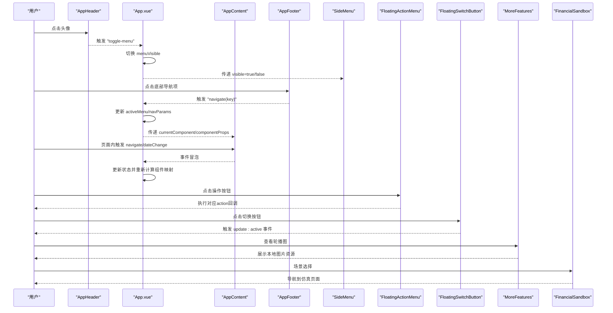

**图表来源**
- [App.vue:119-153](file://src/App.vue#L119-L153)
- [AppHeader.vue:45-47](file://src/components/common/AppHeader.vue#L45-L47)
- [AppFooter.vue:3-23](file://src/components/common/AppFooter.vue#L3-L23)
- [AppContent.vue:3-21](file://src/components/common/AppContent.vue#L3-L21)
- [FloatingActionMenu.vue:33-58](file://src/components/common/FloatingActionMenu.vue#L33-L58)
- [FloatingSwitchButton.vue:19-25](file://src/components/common/FloatingSwitchButton.vue#L19-L25)
- [MoreFeatures.vue:65-81](file://src/components/mobile/more/MoreFeatures.vue#L65-L81)
- [FinancialSandbox.vue:52-54](file://src/components/mobile/sandbox/FinancialSandbox.vue#L52-L54)

**章节来源**
- [App.vue:119-153](file://src/App.vue#L119-L153)

## 详细组件分析

### AppHeader 分析
- 设计要点
  - 左侧用户头像区域，点击触发菜单开关
  - 中央Logo与应用名称，**更新为本地静态资源@/assets/logo/app_logo.png**
  - 支持响应式字体与尺寸
- 状态与持久化
  - 使用本地存储保存用户名与修改状态，便于后续扩展
- 事件
  - 触发 toggle-menu 供父组件控制菜单显示
- **性能优化**
  - 本地静态资源加载更快，无需网络请求
  - 减少资源加载失败的风险
  - 提升应用启动速度和稳定性

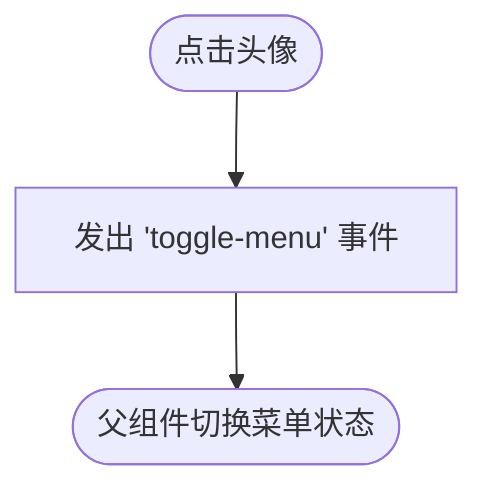

**图表来源**
- [AppHeader.vue:45-47](file://src/components/common/AppHeader.vue#L45-L47)

**章节来源**
- [AppHeader.vue:1-135](file://src/components/common/AppHeader.vue#L1-L135)

### AppContent 分析
- 设计要点
  - 动态组件渲染：通过 currentComponent 动态挂载页面
  - 事件透传：将 navigate 与 dateChange 向上传递
  - 属性透传：componentProps 透传给当前页面
- 适用场景
  - 作为页面容器，统一处理导航与日期事件

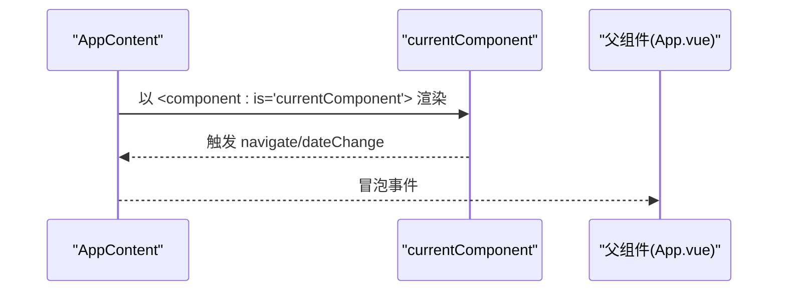

**图表来源**
- [AppContent.vue:3-21](file://src/components/common/AppContent.vue#L3-L21)

**章节来源**
- [AppContent.vue:1-51](file://src/components/common/AppContent.vue#L1-L51)

### AppFooter 分析
- 设计要点
  - 底部导航项：支出、收入、资产、负债、更多
  - 图标与文字组合，支持响应式
- 事件
  - 触发 navigate(key)，由父组件路由分发

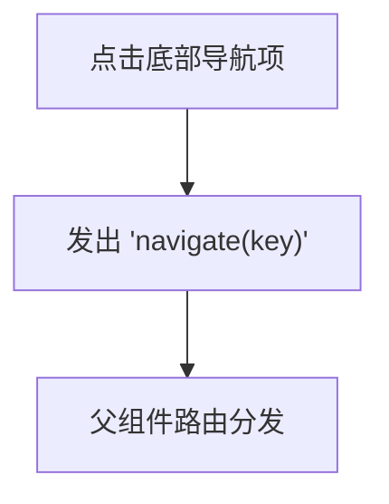

**图表来源**
- [AppFooter.vue:3-23](file://src/components/common/AppFooter.vue#L3-L23)

**章节来源**
- [AppFooter.vue:1-98](file://src/components/common/AppFooter.vue#L1-L98)

### PageHeader 分析
- 设计要点
  - 返回按钮 + 标题
  - 事件：back
- 适用场景
  - 页面级返回，常与 PageTemplate 搭配使用

**章节来源**
- [PageHeader.vue:1-57](file://src/components/common/PageHeader.vue#L1-L57)

### PageTemplate 分析
- 设计要点
  - 顶部 PageHeader + 中间内容插槽 + 底部可选确认按钮
  - 提供 confirmText、confirmDisabled 等配置
- 事件
  - back、confirm
- 插槽
  - 默认插槽用于放置页面内容

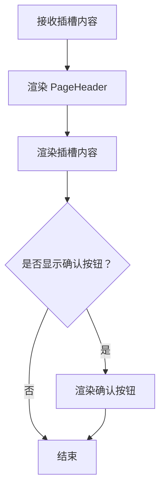

**图表来源**
- [PageTemplate.vue:4-21](file://src/components/common/PageTemplate.vue#L4-L21)

**章节来源**
- [PageTemplate.vue:1-103](file://src/components/common/PageTemplate.vue#L1-L103)

### SideMenu 分析
- 设计要点
  - 抽屉式菜单，支持遮罩层与滑入动画
  - 用户信息展示与菜单项点击
- 状态与事件
  - visible 控制显示/隐藏
  - close、navigate(key) 事件
- 本地存储
  - 加载/保存用户名与修改状态

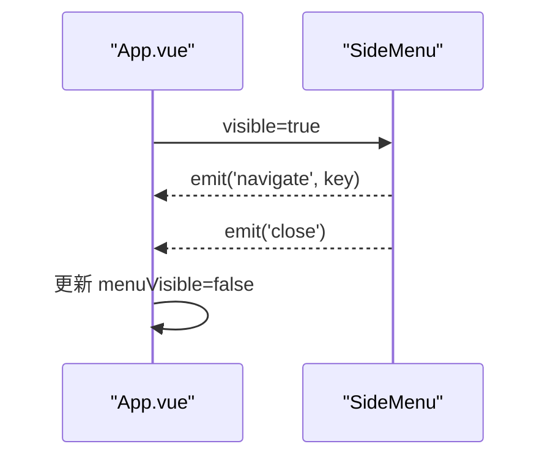

**图表来源**
- [SideMenu.vue:80-89](file://src/components/common/SideMenu.vue#L80-L89)
- [App.vue:150-153](file://src/App.vue#L150-L153)

**章节来源**
- [SideMenu.vue:1-255](file://src/components/common/SideMenu.vue#L1-L255)

### Calendar 分析
- 功能特性
  - 月视图网格，42格覆盖
  - 农历、节气、节假日标注
  - 今日高亮、周末/节假日背景色
  - 每日支出金额标注
  - 年/月选择器与"回到现在"
  - 宽屏模式下的右侧信息卡片
- 事件
  - click(date)：返回被点击日期对象
- 性能与复杂度
  - 生成42格日历数组，填充农历/节假日信息，时间复杂度 O(1)（固定格数）
  - 窗口尺寸监听与定时器需在卸载时清理

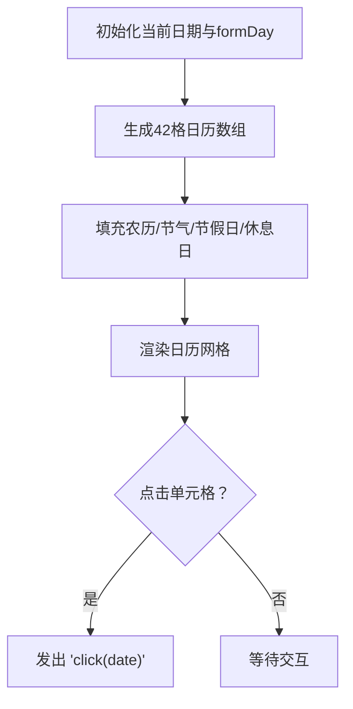

**图表来源**
- [Calendar.vue:160-217](file://src/components/common/Calendar.vue#L160-L217)
- [Calendar.vue:236-243](file://src/components/common/Calendar.vue#L236-L243)

**章节来源**
- [Calendar.vue:1-477](file://src/components/common/Calendar.vue#L1-L477)

### FloatingActionMenu 分析
- 设计要点
  - 单按钮直显或展开多按钮菜单
  - 悬停显示提示标签
  - 动画与阴影增强交互体验
- 事件
  - 通过按钮 action 回调触发，组件不直接发出事件
- 使用建议
  - buttons 数组按需传入，确保每个按钮包含 icon 与 action
- **集成现状**
  - 已集成到所有主要业务页面：资产管理和负债管理页面、账户管理页面、收支页面以及各类详情页面
  - 提供统一的操作入口体验，提升用户操作效率

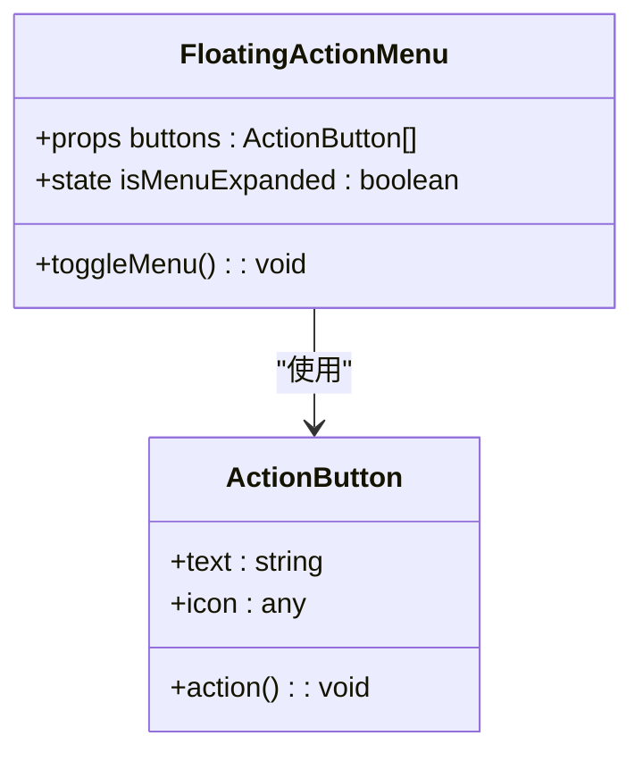

**图表来源**
- [FloatingActionMenu.vue:38-50](file://src/components/common/FloatingActionMenu.vue#L38-L50)

**章节来源**
- [FloatingActionMenu.vue:1-151](file://src/components/common/FloatingActionMenu.vue#L1-L151)

### FloatingSwitchButton 分析
- 设计要点
  - Material Design风格的绿色圆形按钮设计
  - 支持激活/非激活状态切换
  - 固定定位，底部80px，左侧20px
  - 包含开关图标与文本标签
  - 悬停放大效果，阴影增强立体感
- 属性配置
  - active: Boolean - 按钮激活状态，默认false
  - activeText: String - 激活状态下的显示文本
  - inactiveText: String - 非激活状态下的显示文本
- 事件
  - update:active - 状态变更事件，返回新的激活状态
- 样式特点
  - 24px圆角半径，48px直径
  - 绿色背景色 #67c23a，白色图标
  - 12px内边距，8px间距
  - 0.3秒过渡动画，悬停scale(1.05)
  - 固定z-index 1000，确保层级
- 适用场景
  - 沙盒推演场景中的历史推演与推演情景切换
  - 需要快速状态切换的界面元素

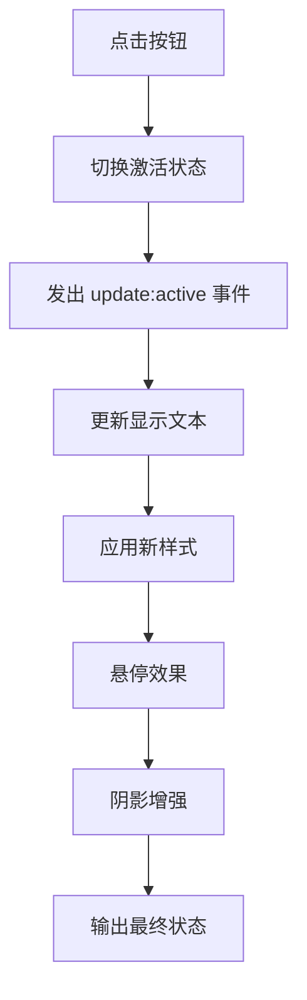

**图表来源**
- [FloatingSwitchButton.vue:21-25](file://src/components/common/FloatingSwitchButton.vue#L21-L25)
- [FloatingSwitchButton.vue:48-51](file://src/components/common/FloatingSwitchButton.vue#L48-L51)

**章节来源**
- [FloatingSwitchButton.vue:1-59](file://src/components/common/FloatingSwitchButton.vue#L1-L59)

### StatOverview 组件分析
- 设计要点
  - 卡片式统计界面，支持背景图片与渐变覆盖层
  - 主要统计项与详细统计项的双层布局
  - 自定义颜色方案支持，支持白色主题
  - 响应式设计，支持不同屏幕尺寸
- 属性配置
  - background: string - 背景图片URL
  - main: Array - 主要统计项数组，每项包含title、value、color
  - details: Array - 详细统计项数组，每项包含title、value、color
- 样式特点
  - 200px高度的统计卡片，支持圆角渐变背景
  - 主要统计项使用24px粗体字体，详细统计项使用12px字体
  - 支持媒体查询适配小屏设备
- 适用场景
  - 资产总额统计、负债统计、收支统计等财务概览页面
  - 需要突出显示关键财务指标的场景

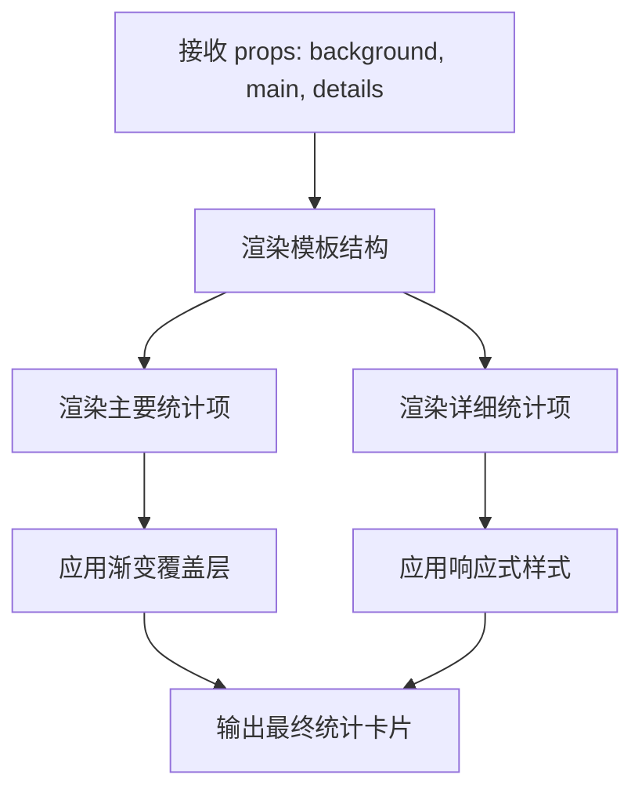

**图表来源**
- [StatOverview.vue:1-23](file://src/components/common/StatOverview.vue#L1-L23)
- [StatOverview.vue:29-35](file://src/components/common/StatOverview.vue#L29-L35)

**章节来源**
- [StatOverview.vue:1-119](file://src/components/common/StatOverview.vue#L1-L119)

### MoreFeatures 组件分析
- 设计要点
  - 移动端功能入口页面，包含轮播图和功能菜单
  - **轮播图内容更新为本地图片资源m3.jpg、m4.jpg、m5.jpg**
  - 功能菜单包含健康、知识、沙盒三个主要功能入口
  - 支持自动轮播和手动切换
- 功能特性
  - 轮播图自动播放，3秒间隔切换
  - 支持手动点击指示器切换
  - 功能菜单采用网格布局，3列1行
  - 每个功能项包含图标、背景色和文字说明
- 事件
  - navigate - 功能导航事件，传递功能类型参数
- 样式特点
  - 轮播图容器180px高度，支持渐变遮罩
  - 功能菜单网格布局，16px间距
  - 功能项卡片圆角8px，支持悬停动画
  - 响应式设计，适配小屏设备
- **资源优化**
  - 本地图片资源加载更快，无需网络请求
  - 减少资源加载失败的风险
  - 提升应用启动速度和离线可用性
- **内容更新**
  - 健康评估：个人财务健康状况评估
  - 知识分享：财务知识分享与学习
  - 沙盒模拟：模拟未来财务状况

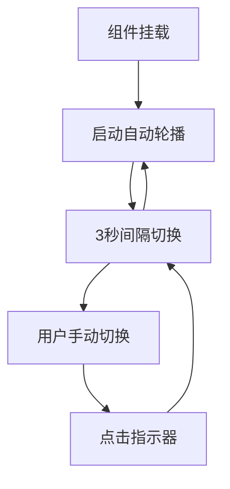

**图表来源**
- [MoreFeatures.vue:86-105](file://src/components/mobile/more/MoreFeatures.vue#L86-L105)
- [MoreFeatures.vue:108-110](file://src/components/mobile/more/MoreFeatures.vue#L108-L110)

**章节来源**
- [MoreFeatures.vue:1-300](file://src/components/mobile/more/MoreFeatures.vue#L1-L300)

### FinancialSandbox 组件分析
- 设计要点
  - 沙盒推演场景选择界面，采用2列网格布局
  - 场景卡片包含图标、名称、描述信息
  - 统一的Material Design风格设计
  - 固定的切换按钮位置，支持历史推演与推演情景切换
- 功能特性
  - 场景卡片点击选择推演场景
  - 场景图标动态映射，支持多种图标类型
  - 场景描述支持多行文本显示
  - 切换按钮支持历史推演与推演情景之间的快速切换
- 事件
  - navigate - 场景选择导航事件，传递场景类型参数
- 样式特点
  - 12px内边距，12px网格间距
  - 场景卡片圆角12px，阴影0 2px 8px rgba(0,0,0,0.06)
  - 场景图标容器圆角50%，背景#ecf5ff
  - 切换按钮固定定位，底部80px，左侧20px
- 适用场景
  - 沙盒推演功能入口页面
  - 场景选择与导航

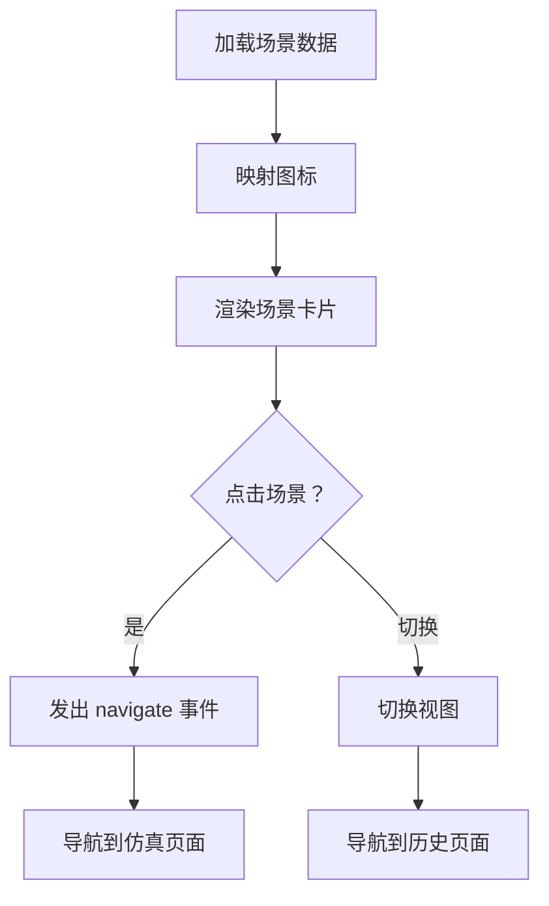

**图表来源**
- [FinancialSandbox.vue:48-50](file://src/components/mobile/sandbox/FinancialSandbox.vue#L48-L50)
- [FinancialSandbox.vue:52-54](file://src/components/mobile/sandbox/FinancialSandbox.vue#L52-L54)
- [FinancialSandbox.vue:129-143](file://src/components/mobile/sandbox/FinancialSandbox.vue#L129-L143)

**章节来源**
- [FinancialSandbox.vue:1-156](file://src/components/mobile/sandbox/FinancialSandbox.vue#L1-L156)

### SandboxHistory 组件分析
- 设计要点
  - 沙盒推演历史记录展示界面
  - 历史记录卡片包含场景名称、时间、描述和操作按钮
  - 支持加载状态与空状态显示
  - 统一的Material Design风格设计
  - 固定的切换按钮位置，支持推演情景与历史推演之间的快速切换
- 功能特性
  - 历史记录列表支持点击查看详情
  - 删除操作支持确认对话框
  - 异步加载历史数据，支持加载状态显示
  - 空状态显示，支持无记录时的友好提示
  - 切换按钮支持推演情景与历史推演之间的快速切换
- 事件
  - navigate - 导航事件，支持详情导航与视图切换
- 样式特点
  - 历史列表垂直排列，12px间距
  - 历史卡片圆角12px，阴影0 2px 8px rgba(0,0,0,0.06)
  - 操作按钮右对齐，间距8px
  - 切换按钮固定定位，底部80px，左侧20px
- 适用场景
  - 沙盒推演历史管理页面
  - 结果查看与管理

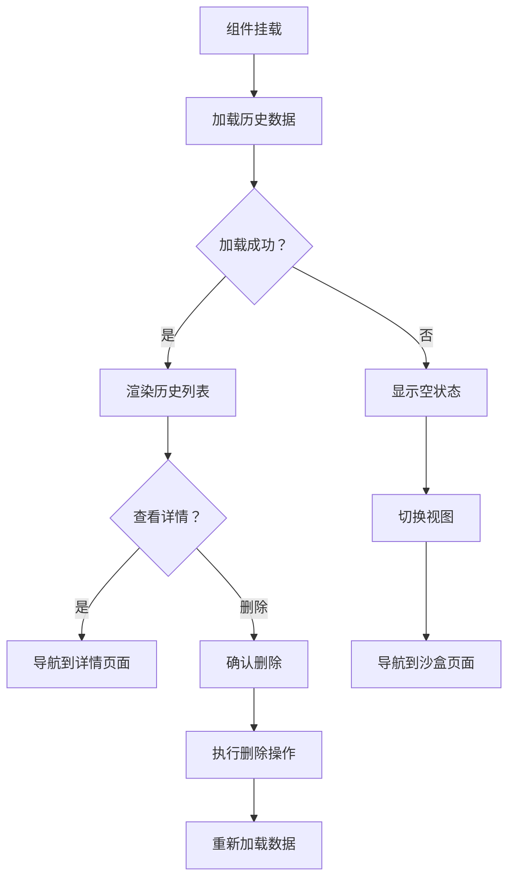

**图表来源**
- [SandboxHistory.vue:56-65](file://src/components/mobile/sandbox/SandboxHistory.vue#L56-L65)
- [SandboxHistory.vue:71-73](file://src/components/mobile/sandbox/SandboxHistory.vue#L71-L73)
- [SandboxHistory.vue:75-82](file://src/components/mobile/sandbox/SandboxHistory.vue#L75-L82)
- [SandboxHistory.vue:150-170](file://src/components/mobile/sandbox/SandboxHistory.vue#L150-L170)

**章节来源**
- [SandboxHistory.vue:1-179](file://src/components/mobile/sandbox/SandboxHistory.vue#L1-L179)

### SandboxResultDetail 组件分析
- 设计要点
  - 沙盒推演结果详情展示界面
  - 核心指标卡片展示净资产、月现金流、负债压力等关键指标
  - ECharts图表展示趋势分析
  - 参数说明与文字分析
  - 统一的Material Design风格设计
- 功能特性
  - 核心指标卡片支持正负值颜色区分
  - ECharts图表支持动态渲染
  - 参数列表支持多种数据类型格式化
  - 文字分析板块提供详细解释
  - 负债压力等级支持颜色编码
- 事件
  - navigate - 返回导航事件
- 样式特点
  - 指标卡片2列网格布局，10px间距
  - 图表容器240px高度，支持自适应宽度
  - 参数列表垂直排列，6px间距
  - 结论卡片背景#f0f9ff，圆角8px
- 适用场景
  - 沙盒推演结果详细展示页面
  - 数据分析与决策支持

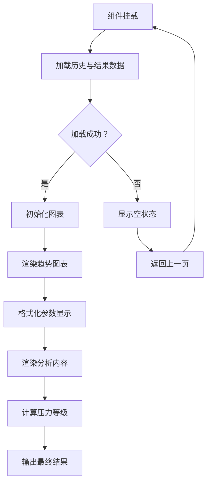

**图表来源**
- [SandboxResultDetail.vue:177-190](file://src/components/mobile/sandbox/SandboxResultDetail.vue#L177-L190)
- [SandboxResultDetail.vue:204-226](file://src/components/mobile/sandbox/SandboxResultDetail.vue#L204-L226)
- [SandboxResultDetail.vue:159-170](file://src/components/mobile/sandbox/SandboxResultDetail.vue#L159-L170)

**章节来源**
- [SandboxResultDetail.vue:1-334](file://src/components/mobile/sandbox/SandboxResultDetail.vue#L1-L334)

### SandboxSimulationPage 组件分析
- 设计要点
  - 沙盒推演参数配置界面
  - 根据场景类型动态生成参数表单
  - 支持多种输入控件：开关、选择框、数字输入、文本输入
  - 统一的Material Design风格设计
- 功能特性
  - 场景信息卡片展示场景描述
  - 参数表单根据场景定义动态生成
  - 默认值自动填充
  - 计算按钮支持异步计算与加载状态
  - 场景图标动态映射
- 事件
  - navigate - 结果详情导航事件
- 样式特点
  - 场景信息卡片居中显示，20px内边距
  - 参数卡片支持16px底部边距
  - 表单控件宽度100%，右对齐控制按钮
  - 动作区域支持24px底部边距
- 适用场景
  - 沙盒推演参数配置页面
  - 用户输入与参数设置

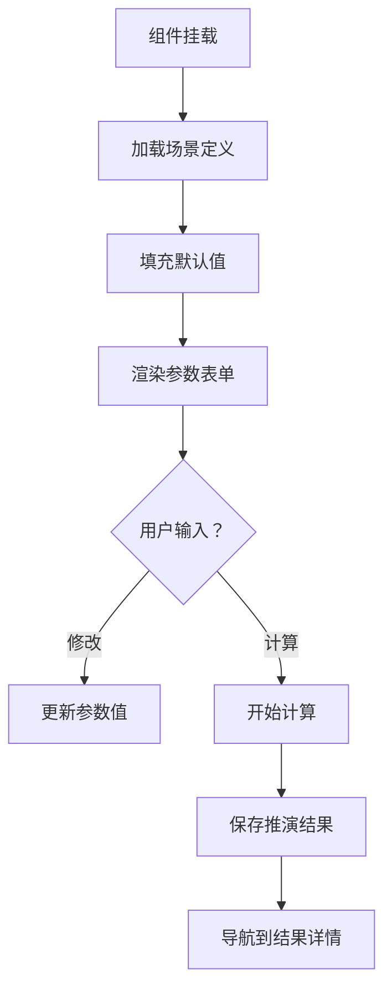

**图表来源**
- [SandboxSimulationPage.vue:86-94](file://src/components/mobile/sandbox/SandboxSimulationPage.vue#L86-L94)
- [SandboxSimulationPage.vue:100-112](file://src/components/mobile/sandbox/SandboxSimulationPage.vue#L100-L112)

**章节来源**
- [SandboxSimulationPage.vue:1-154](file://src/components/mobile/sandbox/SandboxSimulationPage.vue#L1-L154)

### 页面模板组件 PageTemplate 的使用
- 结构
  - 顶部 PageHeader + 中间插槽 + 底部确认按钮（可选）
- 事件
  - back：返回上级
  - confirm：确认提交（可禁用）
- 适用场景
  - 快速搭建表单类页面或需要统一标题与确认流程的页面

**章节来源**
- [PageTemplate.vue:1-103](file://src/components/common/PageTemplate.vue#L1-L103)

### 侧边菜单 SideMenu 的实现细节
- 菜单项
  - 账户、主题、设置、关于、收藏、帮助、反馈、夜间模式
- 状态管理
  - visible 由父组件控制
  - 关闭菜单时发出 close 事件
- 导航
  - 点击菜单项发出 navigate(key)，随后关闭菜单

**章节来源**
- [SideMenu.vue:1-255](file://src/components/common/SideMenu.vue#L1-L255)

### 日历组件 Calendar 的功能详解
- 日期选择
  - 点击任意单元格返回对应日期对象
- 农历与节假日
  - 农历、节气、节假日名称与宜忌信息
- 今日与休息日
  - 今日高亮与"今"标识；周末/节假日背景色
- 费用标注
  - expenses 对象按日期聚合，存在支出时高亮
- 响应式与宽屏
  - 宽屏显示右侧信息卡片，窄屏隐藏

**章节来源**
- [Calendar.vue:1-477](file://src/components/common/Calendar.vue#L1-L477)

### 浮动操作菜单 FloatingActionMenu 的交互逻辑
- 单按钮直显
  - 仅有一个按钮时直接展示
- 多按钮展开
  - more 按钮展开菜单，逐项悬停显示提示
- 动画与样式
  - 滑入动画、阴影、缩放与透明度过渡
- **集成优势**
  - 统一的用户体验，所有页面操作入口一致
  - 减少页面间的操作差异，提升学习成本

**章节来源**
- [FloatingActionMenu.vue:1-151](file://src/components/common/FloatingActionMenu.vue#L1-L151)

### 浮动切换按钮 FloatingSwitchButton 的交互逻辑
- 状态切换
  - 点击按钮切换激活/非激活状态
  - 支持双向数据绑定 update:active 事件
- 文本更新
  - 根据状态动态更新显示文本
  - 支持自定义激活与非激活文本
- Material Design风格
  - 绿色圆形设计，24px圆角半径
  - 固定定位，底部80px，左侧20px
  - 悬停放大效果，阴影增强立体感
- **集成优势**
  - 统一的视觉语言，提升界面专业性
  - 快速状态切换，提升用户体验
  - 固定位置设计，确保可用性

**章节来源**
- [FloatingSwitchButton.vue:1-59](file://src/components/common/FloatingSwitchButton.vue#L1-L59)

### 更多功能页面 MoreFeatures 的现代化设计
- 设计要点
  - 顶部轮播图 + 功能菜单网格布局
  - **轮播图内容更新为本地图片资源m3.jpg、m4.jpg、m5.jpg**
  - 支持自动轮播和手动切换
  - 功能菜单包含健康、知识、沙盒三个主要功能入口
- 功能特性
  - 轮播图自动播放，3秒间隔切换
  - 支持手动点击指示器切换
  - 功能菜单采用网格布局，3列1行
  - 每个功能项包含图标、背景色和文字说明
  - **本地图片资源加载更快，无需网络请求**
- 事件与交互
  - 返回上级：通过 navigate 事件返回上一页
  - 功能导航：点击功能项跳转到相应页面
  - 轮播控制：支持自动播放和手动切换
- **资源优化**
  - 本地静态资源提升加载性能
  - 减少网络依赖，提升应用稳定性
  - 支持离线使用
- **内容更新**
  - 健康评估：个人财务健康状况评估
  - 知识分享：财务知识分享与学习
  - 沙盒模拟：模拟未来财务状况

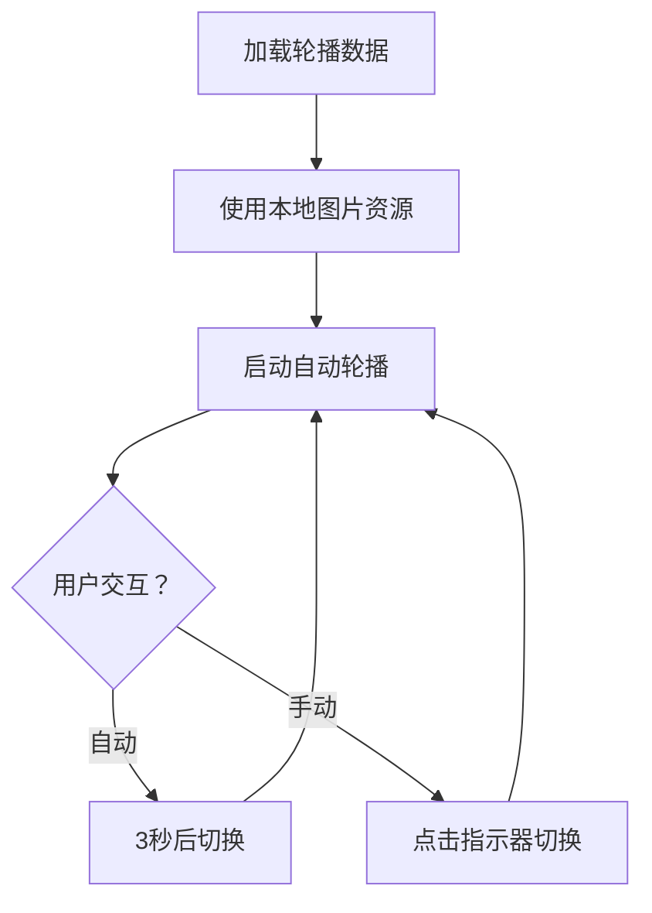

**图表来源**
- [MoreFeatures.vue:65-81](file://src/components/mobile/more/MoreFeatures.vue#L65-L81)
- [MoreFeatures.vue:86-105](file://src/components/mobile/more/MoreFeatures.vue#L86-L105)

**章节来源**
- [MoreFeatures.vue:1-300](file://src/components/mobile/more/MoreFeatures.vue#L1-L300)

### 金融沙盒组件体系的架构设计
- 组件关系
  - FinancialSandbox 作为入口页面，提供场景选择
  - SandboxSimulationPage 负责参数配置与计算
  - SandboxResultDetail 展示详细结果与分析
  - SandboxHistory 管理历史记录
- 数据流
  - 场景选择 → 参数配置 → 计算推演 → 结果展示 → 历史记录
- 事件传递
  - 组件间通过 navigate 事件进行页面导航
  - 状态变更通过 update:active 事件进行通信
- **设计优势**
  - 完整的推演流程闭环
  - 统一的Material Design风格
  - 清晰的组件职责分工
  - 良好的用户体验设计

**章节来源**
- [FinancialSandbox.vue:1-156](file://src/components/mobile/sandbox/FinancialSandbox.vue#L1-L156)
- [SandboxHistory.vue:1-179](file://src/components/mobile/sandbox/SandboxHistory.vue#L1-L179)
- [SandboxResultDetail.vue:1-334](file://src/components/mobile/sandbox/SandboxResultDetail.vue#L1-L334)
- [SandboxSimulationPage.vue:1-154](file://src/components/mobile/sandbox/SandboxSimulationPage.vue#L1-L154)

### 资产详情页面 AssetDetailPage 的现代化设计
- 设计要点
  - 顶部导航栏 + 资产基本信息展示 + 收益记录明细 + 悬浮操作按钮
  - 支持资产结束操作，未结束时显示操作按钮
  - 响应式布局，支持移动端与桌面端
- 功能特性
  - 资产基本信息：名称、类型、金额、周期、剩余期数、收益日等
  - 收益记录：支持收益记录的查看与管理
  - 操作按钮：结束资产功能
  - 数据加载：从服务层获取资产详情与收益记录
- 事件与交互
  - 返回上级：通过 navigate 事件返回资产页面
  - 结束资产：弹窗确认后调用服务层 endAsset 方法
  - 格式化显示：日期格式化、金额格式化
- **FloatingActionMenu集成**
  - 使用统一的操作入口，提供结束资产等操作
- **样式优化**
  - 收益记录头部间距调整，提升视觉层次感
  - 交易卡片间距优化，改善阅读体验

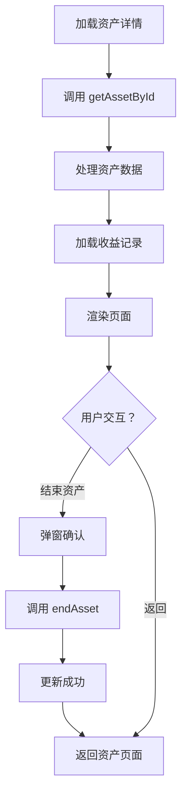

**图表来源**
- [AssetDetailPage.vue:189-229](file://src/components/mobile/asset/AssetDetailPage.vue#L189-L229)
- [AssetDetailPage.vue:137-158](file://src/components/mobile/asset/AssetDetailPage.vue#L137-L158)

**章节来源**
- [AssetDetailPage.vue:1-546](file://src/components/mobile/asset/AssetDetailPage.vue#L1-L546)

### 资产管理页面 AssetManagement 的现代化改进
- 设计要点
  - 当前资产与历史资产切换视图
  - 资产卡片网格布局，支持响应式
  - **浮动操作菜单，支持新增不同类型资产**
  - 资产卡片组件化设计
- 功能特性
  - 资产分类展示：通用资产、股票、基金
  - 资产状态管理：ended 状态过滤
  - 资产详情导航：点击卡片跳转到相应详情页面
  - 账户数据关联：显示账户相关信息
- 服务层集成
  - 使用 assetService、stockService、fundService 提供数据
  - 支持异步数据加载与错误处理
  - 模拟数据回退机制
- StatOverview 集成
  - 在非历史资产视图下显示总资产统计
  - 主要统计项显示资产金额
  - 详细统计项显示资产数量
- **FloatingActionMenu集成**
  - 提供新增普通资产、股票、基金的操作入口
  - 统一的新增操作体验

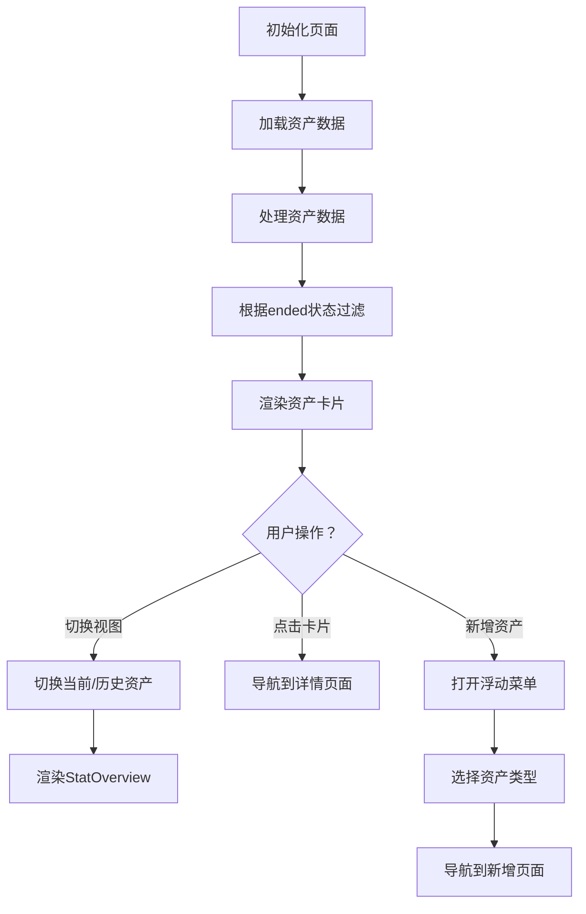

**图表来源**
- [AssetManagement.vue:189-231](file://src/components/mobile/asset/AssetManagement.vue#L189-L231)
- [AssetManagement.vue:249-262](file://src/components/mobile/asset/AssetManagement.vue#L249-L262)

**章节来源**
- [AssetManagement.vue:1-414](file://src/components/mobile/asset/AssetManagement.vue#L1-L414)

### 负债管理页面 LiabilityManagement 的统计集成
- 设计要点
  - 当前负债与历史负债切换视图
  - 负债卡片网格布局，支持响应式
  - **浮动操作菜单，支持新增负债**
  - 负债卡片组件化设计
- 功能特性
  - 负债类型分类展示：房贷、车贷、信用卡等
  - 负债状态管理：已结清状态过滤
  - 负债详情导航：点击卡片跳转到相应详情页面
- StatOverview 集成
  - 在非历史负债视图下显示剩余待还统计
  - 主要统计项显示剩余待还金额
  - 详细统计项显示剩余本金和负债笔数
- 服务层集成
  - 使用 liabilityService 提供负债数据
  - 支持异步数据加载与错误处理
  - 模拟数据回退机制
- **FloatingActionMenu集成**
  - 提供新增负债的操作入口
  - 统一的新增操作体验

**章节来源**
- [LiabilityManagement.vue:1-247](file://src/components/mobile/liability/LiabilityManagement.vue#L1-L247)

### 支出统计页面 MonthlyStats 的统计实现
- 设计要点
  - 月度收支统计概览
  - 使用 StatOverview 组件展示关键统计指标
  - 数据库查询与实时计算
- 功能特性
  - 月支出、月收入、本月结余的实时计算
  - 年月参数驱动的数据加载
  - 数据库连接与查询优化
- StatOverview 集成
  - 主要统计项显示月支出
  - 详细统计项显示月收入和本月结余
  - 结余颜色根据正负值动态调整
- 数据处理
  - 使用 dayjs 进行日期范围计算
  - Promise.all 并行查询支出和收入数据
  - 错误处理与默认数据回退

**章节来源**
- [MonthlyStats.vue:1-191](file://src/components/mobile/expense/MonthlyStats.vue#L1-L191)

### 收入统计页面 MonthlyStats 的统计实现
- 设计要点
  - 月度收支统计概览
  - 使用 StatOverview 组件展示关键统计指标
  - 数据库查询与实时计算
- 功能特性
  - 月支出、月收入、本月结余的实时计算
  - 年月参数驱动的数据加载
  - 数据库连接与查询优化
- StatOverview 集成
  - 主要统计项显示月收入
  - 详细统计项显示月支出和本月结余
  - 结余颜色根据正负值动态调整
- 数据处理
  - 使用 dayjs 进行日期范围计算
  - Promise.all 并行查询支出和收入数据
  - 错误处理与默认数据回退

**章节来源**
- [MonthlyStats.vue:1-192](file://src/components/mobile/income/MonthlyStats.vue#L1-L192)

### 股票详情页面 StockDetailPage 的完整实现
- 设计要点
  - 股票基本信息展示：名称、代码、成本、当前价格、数量等
  - 交易记录明细：持有记录、买入记录、卖出记录三标签页
  - 悬浮操作按钮：买入、修改价格、卖出功能
  - 响应式布局与美观的卡片设计
- 功能特性
  - 股票详情计算：持有收益、总收益等指标
  - 交易记录查询：支持三种类型的交易记录
  - 实时价格更新：支持修改股票价格
  - 交互式操作：导航到买卖页面
- 服务层集成
  - 使用 stockService 提供完整的股票数据服务
  - 支持价格更新、交易记录查询等功能
- **FloatingActionMenu集成**
  - 提供买入、修改价格、卖出等操作入口
- **样式优化**
  - 交易记录头部间距优化，提升视觉层次感
  - 交易卡片间距调整，改善阅读体验

**章节来源**
- [StockDetailPage.vue:1-553](file://src/components/mobile/asset/StockDetailPage.vue#L1-L553)

### 基金详情页面 FundDetailPage 的高级功能
- 设计要点
  - 基金基本信息展示：名称、代码、成本、当前净值、份额等
  - 详细的交易记录：持有记录、买入记录、卖出记录
  - 锁定期管理：支持锁定期显示与管理
  - 悬浮操作按钮：买入、修改净值、卖出功能
- 功能特性
  - 基金收益计算：确认收益、持有收益、总收益
  - 交易记录详情：支持净值、份额、手续费等详细信息
  - 锁定期处理：显示锁定期限与结束日期
  - 实时净值更新：支持修改基金净值
- 服务层集成
  - 使用 fundService 提供专业的基金数据服务
  - 支持净值更新、交易记录查询、锁定期管理
- **FloatingActionMenu集成**
  - 提供买入、修改净值、卖出等操作入口
- **样式优化**
  - 交易记录头部间距优化，提升视觉层次感
  - 交易卡片间距调整，改善阅读体验

**章节来源**
- [FundDetailPage.vue:1-796](file://src/components/mobile/asset/FundDetailPage.vue#L1-L796)

### 资产卡片组件 AssetCard 的模块化设计
- 设计要点
  - 渐变背景与圆角设计
  - 支持图片图标与文本图标
  - 响应式布局与动画效果
  - 可配置的颜色主题
- 功能特性
  - 标题显示：资产名称
  - 金额显示：主要金额与次要金额
  - 图标支持：支持图片URL与文本图标
  - 点击事件：支持卡片点击导航
- 适用场景
  - 资产列表展示
  - 资产详情页面
  - 资产管理页面

**章节来源**
- [AssetCard.vue:1-180](file://src/components/mobile/asset/AssetCard.vue#L1-L180)

### 账户管理页面 AccountManagement 的操作集成
- 设计要点
  - 账户分类展示：信用卡、流动资金、其他资金
  - 账户详情导航：点击卡片跳转到相应详情页面
  - **浮动操作菜单，支持新增账户、编辑账户、余额调整等操作**
- 功能特性
  - 账户类型分类：信用卡、储蓄、公积金等
  - 财务指标计算：总资产、总负债、净资产、负债率等
  - 账户状态管理：流动资金与非流动资金区分
- 服务层集成
  - 使用 accountService 提供完整的账户数据服务
  - 支持账户增删改查、余额调整等功能
- **FloatingActionMenu集成**
  - 提供新增账户、编辑账户、余额调整等操作入口
  - 统一的操作体验，提升用户效率

**章节来源**
- [AccountManagement.vue:1-689](file://src/components/mobile/account/AccountManagement.vue#L1-L689)

### 账户详情页面 AccountDetailPage 的操作集成
- 设计要点
  - 账户基本信息展示：类型、余额、额度等
  - 交易记录明细：收入、支出、信用卡还款等
  - **悬浮操作按钮：停用、编辑、还款等操作**
  - 响应式布局与美观的卡片设计
- 功能特性
  - 账户详情计算：余额、已用额度、可用额度等
  - 交易记录查询：支持多种类型的交易记录
  - 账户状态管理：停用、启用等状态控制
  - 交互式操作：导航到还款页面等
- 服务层集成
  - 使用 accountService 提供完整的账户数据服务
  - 支持账户详情、交易记录、停用等功能
- **FloatingActionMenu集成**
  - 提供停用、编辑、还款等操作入口
  - 根据账户类型动态调整操作按钮

**章节来源**
- [AccountDetailPage.vue:1-587](file://src/components/mobile/account/AccountDetailPage.vue#L1-L587)

### 支出页面 ExpensePage 的操作集成
- 设计要点
  - 支出记录列表：日期、金额、类别、备注
  - 支出统计概览：当日支出、当月支出等
  - **浮动操作菜单，支持新增支出、编辑、删除等操作**
- 功能特性
  - 支出记录管理：支持新增、编辑、删除操作
  - 统计分析：支持按日、周、月、年维度统计
  - 类别管理：支持自定义支出类别
- 服务层集成
  - 使用 expenseService 提供完整的支出数据服务
  - 支持支出记录增删改查、统计分析等功能
- **FloatingActionMenu集成**
  - 提供新增支出等操作入口
  - 简化用户的操作流程

**章节来源**
- [ExpensePage.vue:1-88](file://src/components/mobile/expense/ExpensePage.vue#L1-L88)

### 收入页面 IncomePage 的操作集成
- 设计要点
  - 收入记录列表：日期、金额、来源、备注
  - 收入统计概览：当日收入、当月收入等
  - **浮动操作菜单，支持新增收入、编辑、删除等操作**
- 功能特性
  - 收入记录管理：支持新增、编辑、删除操作
  - 统计分析：支持按日、周、月、年维度统计
  - 来源管理：支持自定义收入来源
- 服务层集成
  - 使用 incomeService 提供完整的收入数据服务
  - 支持收入记录增删改查、统计分析等功能
- **FloatingActionMenu集成**
  - 提供新增收入等操作入口
  - 统一的操作体验

**章节来源**
- [IncomePage.vue:1-15](file://src/components/mobile/income/IncomePage.vue#L1-L15)

### 负债详情页面 LiabilityDetailPage 的操作集成
- 设计要点
  - 负债基本信息展示：类型、本金、剩余本金、利率等
  - 还款计划明细：每月还款额、已还期数、剩余期数等
  - **悬浮操作按钮：提前还款、修改信息、结清等操作**
  - 响应式布局与美观的卡片设计
- 功能特性
  - 负债详情计算：剩余总额、总利息、月供等指标
  - 还款计划查询：支持详细的还款计划展示
  - 负债状态管理：未结清、已结清等状态控制
  - 交互式操作：导航到还款页面等
- 服务层集成
  - 使用 liabilityService 提供完整的负债数据服务
  - 支持负债详情、还款计划、提前还款等功能
- **FloatingActionMenu集成**
  - 提供提前还款、修改信息、结清等操作入口
  - 根据负债状态动态调整操作按钮
- **样式优化**
  - 标签页样式简化，提升界面简洁性
  - 动态标签选择逻辑改进，优化用户体验
  - 交易记录头部间距调整，改善视觉层次

**章节来源**
- [LiabilityDetailPage.vue:1-607](file://src/components/mobile/liability/LiabilityDetailPage.vue#L1-L607)

### 服务层架构的现代化升级
- 资产服务层
  - assetService：提供通用资产的增删改查、状态管理等功能
  - 支持周期计算、收益日期计算等业务逻辑
- 股票服务层
  - stockService：提供完整的股票交易服务，包括买入、卖出、价格更新等
  - 支持FIFO算法、成本价计算、利润计算等复杂业务逻辑
- 基金服务层
  - fundService：提供专业的基金交易服务，支持锁定期管理
  - 支持加权平均成本、收益计算、锁定期处理等功能
- 沙盒服务层
  - sandboxService：提供完整的沙盒推演服务，包括场景定义、参数配置、计算引擎、历史管理等
  - 支持14种不同的推演场景，每种场景包含参数定义、计算逻辑、结果展示
  - 提供完整的数据库操作：历史记录查询、结果详情获取、软删除等
- 类型定义
  - 提供完整的TypeScript类型定义，确保类型安全
  - 支持资产、股票、基金、沙盒场景的完整数据模型

**章节来源**
- [assetService.ts:1-165](file://src/services/asset/assetService.ts#L1-L165)
- [stockService.ts:1-482](file://src/services/asset/stockService.ts#L1-L482)
- [fundService.ts:1-508](file://src/services/asset/fundService.ts#L1-L508)
- [sandboxService.ts:1-730](file://src/services/sandbox/sandboxService.ts#L1-L730)
- [asset.ts:1-31](file://src/types/asset/asset.ts#L1-L31)
- [stock.ts:1-95](file://src/types/asset/stock.ts#L1-L95)
- [fund.ts:1-105](file://src/types/asset/fund.ts#L1-L105)

## 依赖分析
- 运行时依赖
  - Vue 3、Element Plus、Pinia、date-fns、lunar-javascript、echarts 等
- 构建与开发
  - Vite、TypeScript、Sass 等
- 平台集成
  - Capacitor（原生平台键盘插件）
- 服务层依赖
  - 数据库适配器、事务处理、类型安全
- **FloatingActionMenu组件依赖**
  - 无外部依赖，仅使用内置样式与Element Plus图标
  - 统一的图标系统，支持多种操作类型的图标
- **FloatingSwitchButton组件依赖**
  - Element Plus图标库，使用Switch图标
  - Material Design风格的绿色主题设计
- **沙盒组件依赖**
  - ECharts图表库，用于趋势图展示
  - Element Plus表单组件，用于参数配置
  - 统一的Material Design风格设计
- **MoreFeatures组件依赖**
  - **本地图片资源m3.jpg、m4.jpg、m5.jpg，提升加载性能**
  - Element Plus图标库，用于功能图标
  - 统一的Material Design风格设计
- StatOverview 组件依赖
  - 无外部依赖，仅使用内置样式与图片资源

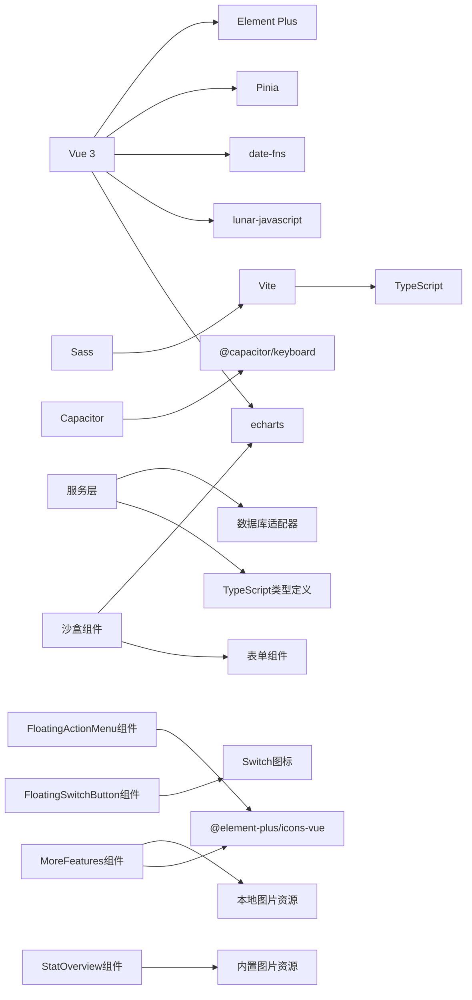

**图表来源**
- [package.json:19-36](file://package.json#L19-L36)
- [vite.config.ts:1-11](file://vite.config.ts#L1-L11)
- [tsconfig.json:1-25](file://tsconfig.json#L1-L25)
- [FloatingActionMenu.vue:35](file://src/components/common/FloatingActionMenu.vue#L35)
- [FloatingSwitchButton.vue:9](file://src/components/common/FloatingSwitchButton.vue#L9)
- [MoreFeatures.vue:57-59](file://src/components/mobile/more/MoreFeatures.vue#L57-L59)
- [SandboxResultDetail.vue:101](file://src/components/mobile/sandbox/SandboxResultDetail.vue#L101)
- [SandboxSimulationPage.vue:68](file://src/components/mobile/sandbox/SandboxSimulationPage.vue#L68)
- [StatOverview.vue:27](file://src/components/common/StatOverview.vue#L27)

**章节来源**
- [package.json:1-72](file://package.json#L1-L72)
- [vite.config.ts:1-11](file://vite.config.ts#L1-L11)
- [tsconfig.json:1-25](file://tsconfig.json#L1-L25)

## 性能考虑
- 日历组件
  - 42格固定数组，填充农历/节假日信息为O(1)；注意避免在渲染周期内做重计算
  - 窗口尺寸监听与定时器需在卸载时清理，防止内存泄漏
- 内容容器
  - AppContent 使用动态组件，建议保持组件映射稳定，减少不必要的重渲染
- 浮动菜单
  - 展开动画与阴影会带来一定开销，按钮数量较多时建议合并相似操作或延迟渲染
  - **FloatingActionMenu组件已集成到多个页面，需要注意组件实例的复用与销毁**
- **FloatingSwitchButton组件**
  - Material Design风格设计，渲染开销较小
  - 固定定位，避免频繁重排
  - 状态切换通过事件触发，性能影响可忽略
- **MoreFeatures组件**
  - **本地图片资源加载更快，无需网络请求，提升应用启动速度**
  - 自动轮播定时器需在组件卸载时清理，防止内存泄漏
  - 轮播图容器高度固定，避免布局抖动
- **沙盒组件体系**
  - ECharts图表渲染可能带来性能开销，建议在组件卸载时释放图表实例
  - 异步数据加载采用防抖处理，避免频繁请求
  - 图表数据序列化存储，减少重复计算
- StatOverview 组件
  - 卡片式布局，渲染开销较小
  - 响应式样式使用媒体查询，性能影响可忽略
  - 背景图片懒加载，避免阻塞页面渲染
- 资产详情页面
  - 使用虚拟滚动优化大量交易记录的渲染性能
  - 按需加载数据，避免一次性加载所有数据
  - **样式优化减少了不必要的间距计算，提升渲染性能**
- 服务层优化
  - 使用Promise.all并行加载多个数据源
  - 实现数据缓存机制，减少重复请求
  - 优化数据库查询，使用索引和适当的查询条件
  - **沙盒计算采用事务处理，确保数据一致性**

## 故障排查指南
- 事件未生效
  - 确认事件冒泡链路：子组件 -> AppContent -> App.vue -> SideMenu/AppFooter
  - 检查事件名拼写与参数传递
- 日历不更新
  - 确认 resize 监听与定时器在卸载时移除
  - 确认 expenses 对象键值与日期格式一致
- 菜单无法关闭
  - 确认 SideMenu 发出 close 事件后父组件正确更新 visible
- 样式异常
  - 检查 scoped 样式与 :deep 选择器使用
  - 确认 Element Plus 图标与主题样式加载顺序
  - 检查 StatOverview 组件的渐变覆盖层样式
  - **检查FloatingSwitchButton组件的Material Design样式**
  - **检查沙盒组件的ECharts图表渲染**
  - **检查交易记录头部间距样式是否正确应用**
  - **确认标签页样式简化后的兼容性**
  - **检查MoreFeatures组件的轮播图资源加载**
- **FloatingActionMenu操作无效**
  - 确认按钮数组格式正确，包含text、icon、action属性
  - 检查action回调函数是否正确绑定
  - 确认图标组件正确导入
- **FloatingSwitchButton状态不更新**
  - 确认update:active事件正确绑定
  - 检查active属性的双向绑定
  - 确认文本内容根据状态正确更新
- **MoreFeatures轮播图不显示**
  - **确认本地图片资源m3.jpg、m4.jpg、m5.jpg存在且路径正确**
  - 检查图片导入语句是否正确
  - 确认图片格式支持浏览器渲染
  - 验证轮播图定时器在组件卸载时正确清理
- **沙盒组件功能异常**
  - 确认场景定义正确加载
  - 检查参数表单的动态生成
  - 确认计算结果的数据库存储
  - 验证图表数据的正确渲染
- 资产详情加载失败
  - 检查服务层调用是否正确
  - 确认资产ID参数传递
  - 验证数据库连接与查询结果
- 股票/基金操作异常
  - 检查账户余额验证逻辑
  - 确认交易数量与可用数量匹配
  - 验证锁定期限制（基金）
  - **检查交易记录头部间距样式是否影响交互**
- StatOverview 统计数据不显示
  - 检查 main 和 details 数组格式是否正确
  - 确认 background 图片路径有效
  - 验证颜色值格式（支持十六进制、rgb等）
- 统计卡片样式问题
  - 检查媒体查询断点设置
  - 确认渐变背景层的 z-index 层级
  - 验证响应式字体大小设置
- **负债详情页面标签页问题**
  - 检查动态标签选择逻辑是否正确
  - 确认标签页样式简化后的显示效果
  - 验证标签切换功能的兼容性
- **沙盒历史记录删除失败**
  - 确认软删除SQL语句执行
  - 检查数据库事务处理
  - 验证历史记录重新加载
- **沙盒结果图表不显示**
  - 确认ECharts实例正确初始化
  - 检查图表数据格式
  - 验证图表容器尺寸
  - 确认图表选项配置正确

**章节来源**
- [Calendar.vue:88-94](file://src/components/common/Calendar.vue#L88-L94)
- [Calendar.vue:262-264](file://src/components/common/Calendar.vue#L262-L264)
- [SideMenu.vue:80-83](file://src/components/common/SideMenu.vue#L80-L83)
- [FloatingActionMenu.vue:45-50](file://src/components/common/FloatingActionMenu.vue#L45-L50)
- [FloatingSwitchButton.vue:19-25](file://src/components/common/FloatingSwitchButton.vue#L19-L25)
- [MoreFeatures.vue:57-59](file://src/components/mobile/more/MoreFeatures.vue#L57-L59)
- [MoreFeatures.vue:86-105](file://src/components/mobile/more/MoreFeatures.vue#L86-L105)
- [StatOverview.vue:29-35](file://src/components/common/StatOverview.vue#L29-L35)
- [AssetDetailPage.vue:189-225](file://src/components/mobile/asset/AssetDetailPage.vue#L189-L225)
- [StockDetailPage.vue:300-349](file://src/components/mobile/asset/StockDetailPage.vue#L300-L349)
- [FundDetailPage.vue:327-375](file://src/components/mobile/asset/FundDetailPage.vue#L327-L375)
- [LiabilityDetailPage.vue:228](file://src/components/mobile/liability/LiabilityDetailPage.vue#L228)
- [SandboxHistory.vue:75-82](file://src/components/mobile/sandbox/SandboxHistory.vue#L75-L82)
- [SandboxResultDetail.vue:204-226](file://src/components/mobile/sandbox/SandboxResultDetail.vue#L204-L226)

## 结论
本UI组件体系以通用布局组件为核心，结合页面模板与交互组件，形成可复用、可扩展的移动端财务应用界面框架。通过事件与属性的清晰边界、响应式与主题适配策略，以及合理的性能与可维护性设计，能够支撑多样化的业务页面需求。

**更新** 本次现代化升级显著提升了资产相关页面的功能完整性与用户体验，新增的FloatingSwitchButton浮动切换按钮组件提供Material Design风格的绿色圆形设计，支持历史推演与推演情景之间的快速切换。金融沙盒组件体系得到全面重构，包括FinancialSandbox沙盒首页、SandboxHistory历史记录、SandboxResultDetail结果详情、SandboxSimulationPage仿真页面四个核心组件，形成了完整的沙盒推演功能闭环。所有组件均采用统一的Material Design风格设计，显著提升了用户界面的一致性和专业性。

**新增组件成果**
- **FloatingSwitchButton浮动切换按钮组件**：提供Material Design风格的绿色圆形按钮设计，支持激活/非激活状态切换，统一沙盒功能的视觉语言
- **金融沙盒组件体系重构**：包括沙盒首页、历史记录、结果详情、仿真页面四个核心组件，形成完整的推演流程闭环
- **Material Design风格统一**：所有沙盒相关组件采用统一的Material Design设计语言，提升视觉一致性
- **ECharts图表集成**：沙盒结果详情页面集成图表展示，提供直观的数据可视化
- **MoreFeatures组件优化**：轮播图内容更新为本地图片资源，提升加载性能和应用稳定性

**组件集成成果**
- **FloatingActionMenu组件**：已集成到所有主要业务页面，提供统一的操作入口体验
- **FloatingSwitchButton组件**：集成到沙盒功能中，支持历史推演与推演情景的快速切换
- **沙盒组件体系**：四个核心组件协同工作，提供完整的推演功能体验
- **MoreFeatures组件**：本地图片资源优化，提升应用启动速度和离线可用性
- **样式优化**：资产详情页面、股票/基金详情页面、负债详情页面的样式优化成果显著

建议在实际使用中遵循事件冒泡规范、合理拆分组件职责，并根据业务场景扩展组件能力。对于新增的FloatingSwitchButton组件，建议重点关注Material Design风格的统一性和状态切换的用户体验。对于重构的沙盒组件体系，建议重点关注组件间的通信机制和数据流转的顺畅性，确保提供优质的用户体验。对于更新的MoreFeatures组件，建议重点关注本地资源的加载性能和离线可用性。

## 附录

### 组件属性、事件与插槽清单
- AppHeader
  - 事件：toggle-menu
- AppContent
  - 属性：currentComponent、componentProps
  - 事件：navigate、dateChange
- AppFooter
  - 事件：navigate(key)
- PageHeader
  - 事件：back
- PageTemplate
  - 属性：title、showConfirmButton、confirmText、confirmDisabled
  - 事件：back、confirm
  - 插槽：默认插槽
- SideMenu
  - 属性：visible
  - 事件：close、navigate(key)
- Calendar
  - 属性：width、height、expenses
  - 事件：click(date)
- FloatingActionMenu
  - 属性：buttons（数组，包含 text、icon、action）
- FloatingSwitchButton
  - 属性：active（布尔值）、activeText（字符串）、inactiveText（字符串）
  - 事件：update:active
- StatOverview
  - 属性：background、main、details
  - 事件：无
  - 插槽：无
- MoreFeatures
  - 事件：navigate
  - 插槽：无
- FinancialSandbox
  - 事件：navigate
  - 插槽：无
- SandboxHistory
  - 事件：navigate
  - 插槽：无
- SandboxResultDetail
  - 属性：historyId（必需）
  - 事件：navigate
  - 插槽：无
- SandboxSimulationPage
  - 属性：sceneType（必需）
  - 事件：navigate
  - 插槽：无
- AssetDetailPage
  - 属性：assetId（必需）
  - 事件：navigate
  - 插槽：无
- AssetManagement
  - 事件：navigate
  - 插槽：无
- LiabilityManagement
  - 事件：navigate
  - 插槽：无
- MonthlyStats
  - 属性：year、month（必需）
  - 事件：navigate
  - 插槽：无
- StockDetailPage
  - 属性：stockId（必需）
  - 事件：navigate
  - 插槽：无
- FundDetailPage
  - 属性：fundId（必需）
  - 事件：navigate
  - 插槽：无
- AssetCard
  - 属性：title、amount、secondaryAmount、icon、color、assetId
  - 事件：click
  - 插槽：无
- AccountManagement
  - 事件：navigate
  - 插槽：无
- AccountDetailPage
  - 属性：accountId（必需）
  - 事件：navigate
  - 插槽：无
- ExpensePage
  - 事件：navigate
  - 插槽：无
- IncomePage
  - 事件：navigate
  - 插槽：无
- LiabilityDetailPage
  - 属性：liabilityId（必需）
  - 事件：navigate
  - 插槽：无

**章节来源**
- [AppHeader.vue:16-18](file://src/components/common/AppHeader.vue#L16-L18)
- [AppContent.vue:13-21](file://src/components/common/AppContent.vue#L13-L21)
- [AppFooter.vue:29-31](file://src/components/common/AppFooter.vue#L29-L31)
- [PageHeader.vue:18-20](file://src/components/common/PageHeader.vue#L18-L20)
- [PageTemplate.vue:27-37](file://src/components/common/PageTemplate.vue#L27-L37)
- [SideMenu.vue:53-60](file://src/components/common/SideMenu.vue#L53-L60)
- [Calendar.vue:74-78](file://src/components/common/Calendar.vue#L74-L78)
- [FloatingActionMenu.vue:45-50](file://src/components/common/FloatingActionMenu.vue#L45-L50)
- [FloatingSwitchButton.vue:12-16](file://src/components/common/FloatingSwitchButton.vue#L12-L16)
- [MoreFeatures.vue:61-63](file://src/components/mobile/more/MoreFeatures.vue#L61-L63)
- [StatOverview.vue:29-35](file://src/components/common/StatOverview.vue#L29-L35)
- [FinancialSandbox.vue:40](file://src/components/mobile/sandbox/FinancialSandbox.vue#L40)
- [SandboxHistory.vue:44](file://src/components/mobile/sandbox/SandboxHistory.vue#L44)
- [SandboxResultDetail.vue:106](file://src/components/mobile/sandbox/SandboxResultDetail.vue#L106)
- [SandboxSimulationPage.vue:71-72](file://src/components/mobile/sandbox/SandboxSimulationPage.vue#L71-L72)
- [AssetDetailPage.vue:95-100](file://src/components/mobile/asset/AssetDetailPage.vue#L95-L100)
- [AssetManagement.vue:99](file://src/components/mobile/asset/AssetManagement.vue#L99)
- [LiabilityManagement.vue:58](file://src/components/mobile/liability/LiabilityManagement.vue#L58)
- [MonthlyStats.vue:17-21](file://src/components/mobile/expense/MonthlyStats.vue#L17-L21)
- [StockDetailPage.vue:185-190](file://src/components/mobile/asset/StockDetailPage.vue#L185-L190)
- [FundDetailPage.vue:200-205](file://src/components/mobile/asset/FundDetailPage.vue#L200-L205)
- [AssetCard.vue:24-49](file://src/components/mobile/asset/AssetCard.vue#L24-L49)
- [AccountManagement.vue:151-159](file://src/components/mobile/account/AccountManagement.vue#L151-L159)
- [AccountDetailPage.vue:208-213](file://src/components/mobile/account/AccountDetailPage.vue#L208-L213)
- [ExpensePage.vue:1-88](file://src/components/mobile/expense/ExpensePage.vue#L1-L88)
- [IncomePage.vue:1-15](file://src/components/mobile/income/IncomePage.vue#L1-L15)
- [LiabilityDetailPage.vue:1-607](file://src/components/mobile/liability/LiabilityDetailPage.vue#L1-L607)

### 样式定制与主题适配
- 主题色
  - 组件广泛使用统一主色，可通过CSS变量或覆盖类名进行主题定制
  - 资产卡片支持自定义颜色主题
  - StatOverview 组件支持自定义颜色方案，支持白色主题
  - **FloatingSwitchButton组件采用Material Design绿色主题 #67c23a**
  - **沙盒组件采用统一的Material Design风格设计**
  - **FloatingActionMenu组件使用Element Plus蓝色主题 #409eff**
  - **MoreFeatures组件使用Element Plus图标库，支持主题适配**
- 响应式
  - 多处媒体查询适配小屏设备，建议在新增样式时同步考虑断点
  - 资产管理页面支持网格布局的响应式调整
  - StatOverview 组件支持多种屏幕尺寸的自适应
  - **FloatingSwitchButton组件固定定位，适配各种屏幕尺寸**
  - **沙盒组件采用flex布局，支持响应式调整**
  - **FloatingActionMenu组件位置固定，适配各种屏幕尺寸**
  - **MoreFeatures组件采用网格布局，支持响应式调整**
- Element Plus
  - 图标与组件样式由 Element Plus 提供，建议统一引入其样式文件
  - **FloatingSwitchButton组件使用Element Plus Switch图标**
  - **FloatingActionMenu组件使用Element Plus图标库，确保图标一致性**
  - **MoreFeatures组件使用Element Plus图标库，支持功能图标展示**
- 资产详情页面
  - 支持深色主题适配
  - 响应式卡片布局设计
  - **样式优化提升了收益记录的视觉层次**
- StatOverview 组件
  - 渐变覆盖层支持透明度调节
  - 字体大小根据屏幕尺寸自动调整
  - 支持自定义背景图片与颜色方案
- **交易记录样式优化**
  - 统一的头部间距设计，提升视觉一致性
  - 优化的卡片间距，改善阅读体验
  - 简化的标签页样式，增强界面简洁性
  - 改进的动态标签选择逻辑，提升交互流畅性
- **浮动操作菜单样式优化**
  - 统一的蓝色主题设计，确保视觉一致性
  - 悬停动画效果，提升交互体验
  - 提示标签系统，增强可访问性
  - 固定定位，适配各种屏幕尺寸
- **沙盒组件样式优化**
  - 统一的Material Design风格，提升专业性
  - 场景卡片圆角设计，增强现代感
  - 图表容器适配，确保数据可视化效果
  - 固定切换按钮位置，提升可用性
- **MoreFeatures组件样式优化**
  - 轮播图容器圆角设计，增强现代感
  - 渐变遮罩效果，提升视觉层次
  - 功能菜单网格布局，支持响应式调整
  - 响应式设计，适配小屏设备

**章节来源**
- [AppHeader.vue:50-135](file://src/components/common/AppHeader.vue#L50-L135)
- [AppFooter.vue:34-98](file://src/components/common/AppFooter.vue#L34-L98)
- [FloatingActionMenu.vue:61-151](file://src/components/common/FloatingActionMenu.vue#L61-L151)
- [FloatingSwitchButton.vue:30-58](file://src/components/common/FloatingSwitchButton.vue#L30-L58)
- [MoreFeatures.vue:113-300](file://src/components/mobile/more/MoreFeatures.vue#L113-L300)
- [AssetCard.vue:68-180](file://src/components/mobile/asset/AssetCard.vue#L68-L180)
- [AssetDetailPage.vue:232-546](file://src/components/mobile/asset/AssetDetailPage.vue#L232-L546)
- [AssetManagement.vue:283-414](file://src/components/mobile/asset/AssetManagement.vue#L283-L414)
- [StatOverview.vue:37-119](file://src/components/common/StatOverview.vue#L37-L119)
- [StockDetailPage.vue:458-553](file://src/components/mobile/asset/StockDetailPage.vue#L458-L553)
- [FundDetailPage.vue:697-786](file://src/components/mobile/asset/FundDetailPage.vue#L697-L786)
- [LiabilityDetailPage.vue:501-607](file://src/components/mobile/liability/LiabilityDetailPage.vue#L501-L607)
- [FinancialSandbox.vue:69-156](file://src/components/mobile/sandbox/FinancialSandbox.vue#L69-L156)
- [SandboxHistory.vue:85-179](file://src/components/mobile/sandbox/SandboxHistory.vue#L85-L179)
- [SandboxResultDetail.vue:229-334](file://src/components/mobile/sandbox/SandboxResultDetail.vue#L229-L334)
- [SandboxSimulationPage.vue:115-154](file://src/components/mobile/sandbox/SandboxSimulationPage.vue#L115-L154)
- [main.ts:3-5](file://src/main.ts#L3-L5)

### 最佳实践与扩展建议
- 事件命名与参数
  - 保持事件名一致性，如 navigate/key、dateChange/year-month
  - 资产详情页面使用 navigate 事件进行页面跳转
  - **沙盒组件使用统一的navigate事件进行页面导航**
  - **FloatingSwitchButton使用update:active事件进行状态通信**
  - **MoreFeatures组件使用navigate事件进行功能导航**
- 组件职责
  - 通用组件只负责UI与交互，业务逻辑下沉到页面或store
  - 服务层负责数据处理与业务逻辑，页面组件负责展示
  - StatOverview 组件专门负责统计展示，不包含业务逻辑
  - **FloatingSwitchButton组件专门负责状态切换，不包含业务逻辑**
  - **沙盒组件体系采用分层设计，职责明确**
  - **MoreFeatures组件专门负责功能入口展示，不包含业务逻辑**
- 动态组件
  - 使用 computed 维护组件映射，避免在模板中直接分支过多
  - 资产详情页面使用 props 接收参数，支持灵活的数据传递
  - **沙盒组件通过sceneType参数动态加载场景定义**
  - **MoreFeatures组件通过本地资源直接加载轮播图内容**
- 性能
  - 避免在渲染周期内做重计算；及时清理定时器与监听器
  - 资产详情页面使用懒加载优化大数据量展示
  - 服务层使用并行加载提升数据获取效率
  - StatOverview 组件使用轻量级渲染，适合频繁更新
  - **FloatingSwitchButton组件渲染开销极小，性能影响可忽略**
  - **沙盒组件采用ECharts图表，注意内存释放**
  - **MoreFeatures组件使用本地图片资源，提升加载性能**
  - **样式优化减少了不必要的计算，提升了整体性能**
- 可访问性
  - 为图标与按钮提供语义化文本与键盘可达性
  - 资产卡片支持点击事件，提供明确的视觉反馈
  - StatOverview 组件提供清晰的统计信息层次结构
  - **FloatingSwitchButton组件提供悬停提示，提升可访问性**
  - **沙盒组件提供完整的键盘导航支持**
  - **FloatingActionMenu组件提供悬停提示，提升可访问性**
  - **MoreFeatures组件提供清晰的功能导航层次结构**
- 类型安全
  - 使用 TypeScript 类型定义确保数据结构正确性
  - 服务层返回值使用明确的类型注解
  - StatOverview 组件使用严格的 props 类型定义
  - **FloatingSwitchButton组件使用Boolean类型定义active属性**
  - **沙盒组件使用SceneDef和SandboxHistory等接口定义数据结构**
  - **FloatingActionMenu组件使用ActionButton接口定义按钮结构**
  - **MoreFeatures组件使用CarouselItem接口定义轮播图结构**
- 错误处理
  - 实现完善的错误处理机制，提供友好的用户反馈
  - 资产详情页面支持模拟数据回退，确保页面稳定性
  - StatOverview 组件支持空数据状态的优雅降级
  - **FloatingSwitchButton组件支持状态异常的默认处理**
  - **沙盒组件支持计算异常的错误提示**
  - **FloatingActionMenu组件支持按钮失效状态，提升用户体验**
  - **MoreFeatures组件支持轮播图加载失败的降级处理**
- 扩展建议
  - StatOverview 组件可扩展为支持更多统计维度
  - 支持动画过渡效果，提升用户体验
  - 可添加统计图表集成，提供更直观的数据展示
  - 支持主题切换，适配深色模式
  - **FloatingSwitchButton组件可扩展为支持更多状态类型**
  - **沙盒组件可扩展为支持更多推演场景**
  - 统一操作按钮的图标风格和交互效果
  - **交易记录样式可进一步优化，提升视觉一致性**
  - **标签页样式可继续简化，提升界面简洁性**
  - **浮动操作菜单可增加动画效果，提升用户体验**
  - **沙盒组件可增加更多图表类型，丰富数据可视化**
  - **FloatingSwitchButton组件可增加更多交互效果**
  - **MoreFeatures组件可扩展为支持更多功能入口**
  - **轮播图可增加无限循环播放功能**
  - **样式优化可继续提升组件的视觉一致性**

**章节来源**
- [App.vue:65-89](file://src/App.vue#L65-L89)
- [Calendar.vue:254-264](file://src/components/common/Calendar.vue#L254-L264)
- [AssetDetailPage.vue:189-225](file://src/components/mobile/asset/AssetDetailPage.vue#L189-L225)
- [AssetManagement.vue:189-231](file://src/components/mobile/asset/AssetManagement.vue#L189-L231)
- [statOverview.vue:29-35](file://src/components/common/StatOverview.vue#L29-L35)
- [FloatingActionMenu.vue:38-50](file://src/components/common/FloatingActionMenu.vue#L38-L50)
- [FloatingSwitchButton.vue:12-16](file://src/components/common/FloatingSwitchButton.vue#L12-L16)
- [MoreFeatures.vue:61-63](file://src/components/mobile/more/MoreFeatures.vue#L61-L63)
- [SandboxHistory.vue:56-65](file://src/components/mobile/sandbox/SandboxHistory.vue#L56-L65)
- [SandboxResultDetail.vue:177-190](file://src/components/mobile/sandbox/SandboxResultDetail.vue#L177-L190)
- [SandboxSimulationPage.vue:86-94](file://src/components/mobile/sandbox/SandboxSimulationPage.vue#L86-L94)
- [stockService.ts:154-244](file://src/services/asset/stockService.ts#L154-L244)
- [fundService.ts:169-264](file://src/services/asset/fundService.ts#L169-L264)
- [sandboxService.ts:280-704](file://src/services/sandbox/sandboxService.ts#L280-L704)