# UI组件

<cite>
**本文档引用的文件**
- [App.vue](file://src/App.vue)
- [main.ts](file://src/main.ts)
- [AppHeader.vue](file://src/components/common/AppHeader.vue)
- [AppContent.vue](file://src/components/common/AppContent.vue)
- [AppFooter.vue](file://src/components/common/AppFooter.vue)
- [PageHeader.vue](file://src/components/common/PageHeader.vue)
- [PageTemplate.vue](file://src/components/common/PageTemplate.vue)
- [SideMenu.vue](file://src/components/common/SideMenu.vue)
- [Calendar.vue](file://src/components/common/Calendar.vue)
- [FloatingActionMenu.vue](file://src/components/common/FloatingActionMenu.vue)
- [ExpensePage.vue](file://src/components/mobile/expense/ExpensePage.vue)
- [AccountManagement.vue](file://src/components/mobile/account/AccountManagement.vue)
- [AssetDetailPage.vue](file://src/components/mobile/asset/AssetDetailPage.vue)
- [AssetManagement.vue](file://src/components/mobile/asset/AssetManagement.vue)
- [StockDetailPage.vue](file://src/components/mobile/asset/StockDetailPage.vue)
- [FundDetailPage.vue](file://src/components/mobile/asset/FundDetailPage.vue)
- [AssetCard.vue](file://src/components/mobile/asset/AssetCard.vue)
- [assetService.ts](file://src/services/asset/assetService.ts)
- [stockService.ts](file://src/services/asset/stockService.ts)
- [fundService.ts](file://src/services/asset/fundService.ts)
- [asset.ts](file://src/types/asset/asset.ts)
- [stock.ts](file://src/types/asset/stock.ts)
- [fund.ts](file://src/types/asset/fund.ts)
- [package.json](file://package.json)
- [vite.config.ts](file://vite.config.ts)
- [tsconfig.json](file://tsconfig.json)
</cite>

## 目录
1. [简介](#简介)
2. [项目结构](#项目结构)
3. [核心组件](#核心组件)
4. [架构总览](#架构总览)
5. [详细组件分析](#详细组件分析)
6. [依赖分析](#依赖分析)
7. [性能考虑](#性能考虑)
8. [故障排查指南](#故障排查指南)
9. [结论](#结论)
10. [附录](#附录)

## 简介
本文件面向财务应用程序的UI组件体系，系统性梳理通用布局组件（头部导航、页面内容、底部栏）、页面模板组件、侧边菜单、日历组件以及浮动操作菜单的设计与实现要点。文档同时覆盖组件属性、事件、插槽、样式与主题适配、最佳实践与性能优化建议，并给出扩展与自定义指导，帮助开发者快速理解与高效使用这些组件。

**更新** 本次更新反映了应用的UI组件现代化升级，新增了 AssetDetailPage.vue 提供更丰富的通用资产详情展示，并更新了现有的资产相关组件以使用新的服务层架构。

## 项目结构
应用采用"根组件 + 通用组件 + 移动端页面"的分层组织方式：
- 根组件负责全局布局与路由/状态协调
- 通用组件提供跨页面的基础UI能力
- 移动端页面聚焦业务场景，组合通用组件完成具体页面

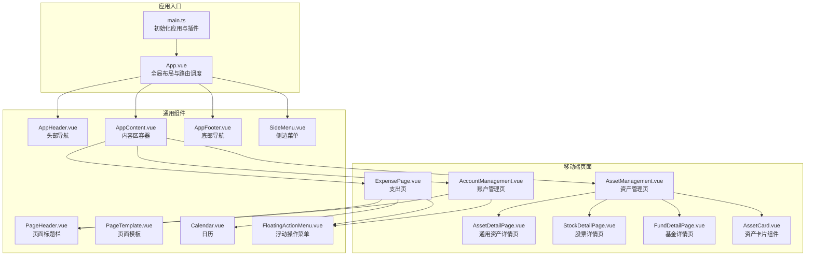

**图表来源**
- [main.ts:1-16](file://src/main.ts#L1-L16)
- [App.vue:1-223](file://src/App.vue#L1-L223)
- [AppHeader.vue:1-135](file://src/components/common/AppHeader.vue#L1-L135)
- [AppContent.vue:1-51](file://src/components/common/AppContent.vue#L1-L51)
- [AppFooter.vue:1-98](file://src/components/common/AppFooter.vue#L1-L98)
- [PageHeader.vue:1-57](file://src/components/common/PageHeader.vue#L1-L57)
- [PageTemplate.vue:1-103](file://src/components/common/PageTemplate.vue#L1-L103)
- [SideMenu.vue:1-255](file://src/components/common/SideMenu.vue#L1-L255)
- [Calendar.vue:1-477](file://src/components/common/Calendar.vue#L1-L477)
- [FloatingActionMenu.vue:1-151](file://src/components/common/FloatingActionMenu.vue#L1-L151)
- [ExpensePage.vue:1-88](file://src/components/mobile/expense/ExpensePage.vue#L1-L88)
- [AccountManagement.vue:1-650](file://src/components/mobile/account/AccountManagement.vue#L1-L650)
- [AssetDetailPage.vue:1-435](file://src/components/mobile/asset/AssetDetailPage.vue#L1-L435)
- [AssetManagement.vue:1-478](file://src/components/mobile/asset/AssetManagement.vue#L1-L478)
- [StockDetailPage.vue:1-558](file://src/components/mobile/asset/StockDetailPage.vue#L1-L558)
- [FundDetailPage.vue:1-796](file://src/components/mobile/asset/FundDetailPage.vue#L1-L796)
- [AssetCard.vue:1-180](file://src/components/mobile/asset/AssetCard.vue#L1-L180)

**章节来源**
- [App.vue:1-223](file://src/App.vue#L1-L223)
- [main.ts:1-16](file://src/main.ts#L1-L16)

## 核心组件
本节对通用组件进行概览式说明，涵盖职责、关键属性/事件/插槽及典型用法。

- AppHeader（头部导航）
  - 职责：展示应用Logo与用户头像，触发菜单开关
  - 事件：toggle-menu
  - 交互：点击头像触发事件；支持响应式尺寸
  - 适用：与App.vue配合实现侧边菜单开关

- AppContent（页面内容容器）
  - 职责：动态渲染当前页面组件，透传导航与日期变更事件
  - 属性：currentComponent、componentProps
  - 事件：navigate、dateChange
  - 适用：承载各业务页面，统一事件转发

- AppFooter（底部导航）
  - 职责：提供底部快捷导航（支出/收入/资产/负债/更多）
  - 事件：navigate(key)
  - 适用：移动端底部Tab式导航

- PageHeader（页面标题栏）
  - 职责：返回按钮 + 标题
  - 事件：back
  - 适用：页面级返回

- PageTemplate（页面模板）
  - 职责：提供带标题与可选确认按钮的页面骨架
  - 插槽：默认插槽用于放置页面内容
  - 事件：back、confirm
  - 适用：快速搭建页面结构

- SideMenu（侧边菜单）
  - 职责：抽屉式菜单，支持用户信息展示与导航
  - 属性：visible
  - 事件：close、navigate(key)
  - 适用：全局菜单

- Calendar（日历）
  - 职责：月视图日历，支持农历、节假日、周末/节假日标记、今日高亮、费用标注
  - 属性：width、height、expenses
  - 事件：click(date)
  - 适用：日期选择与财务日程查看

- FloatingActionMenu（浮动操作菜单）
  - 职责：单按钮直显或展开多按钮菜单，支持提示标签
  - 属性：buttons（数组，包含text、icon、action）
  - 事件：无（通过action回调触发）
  - 适用：页面内快捷操作

**章节来源**
- [AppHeader.vue:1-135](file://src/components/common/AppHeader.vue#L1-L135)
- [AppContent.vue:1-51](file://src/components/common/AppContent.vue#L1-L51)
- [AppFooter.vue:1-98](file://src/components/common/AppFooter.vue#L1-L98)
- [PageHeader.vue:1-57](file://src/components/common/PageHeader.vue#L1-L57)
- [PageTemplate.vue:1-103](file://src/components/common/PageTemplate.vue#L1-L103)
- [SideMenu.vue:1-255](file://src/components/common/SideMenu.vue#L1-L255)
- [Calendar.vue:1-477](file://src/components/common/Calendar.vue#L1-L477)
- [FloatingActionMenu.vue:1-151](file://src/components/common/FloatingActionMenu.vue#L1-L151)

## 架构总览
应用通过根组件App.vue集中管理当前页面组件、导航参数与日期状态，并将事件向上/向下分发至通用组件与业务页面。通用组件之间通过事件与属性协作，形成稳定的UI基础设施。

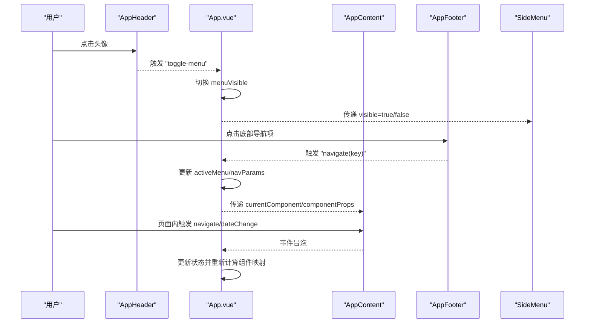

**图表来源**
- [App.vue:119-153](file://src/App.vue#L119-L153)
- [AppHeader.vue:45-47](file://src/components/common/AppHeader.vue#L45-L47)
- [AppFooter.vue:3-23](file://src/components/common/AppFooter.vue#L3-L23)
- [AppContent.vue:3-21](file://src/components/common/AppContent.vue#L3-L21)

**章节来源**
- [App.vue:119-153](file://src/App.vue#L119-L153)

## 详细组件分析

### AppHeader 分析
- 设计要点
  - 左侧用户头像区域，点击触发菜单开关
  - 中央Logo与应用名称
  - 支持响应式字体与尺寸
- 状态与持久化
  - 使用本地存储保存用户名与修改状态，便于后续扩展
- 事件
  - 触发 toggle-menu 供父组件控制菜单显示

**图表来源**
- [AppHeader.vue:45-47](file://src/components/common/AppHeader.vue#L45-L47)

**章节来源**
- [AppHeader.vue:1-135](file://src/components/common/AppHeader.vue#L1-L135)

### AppContent 分析
- 设计要点
  - 动态组件渲染：通过 currentComponent 动态挂载页面
  - 事件透传：将 navigate 与 dateChange 向上传递
  - 属性透传：componentProps 透传给当前页面
- 适用场景
  - 作为页面容器，统一处理导航与日期事件

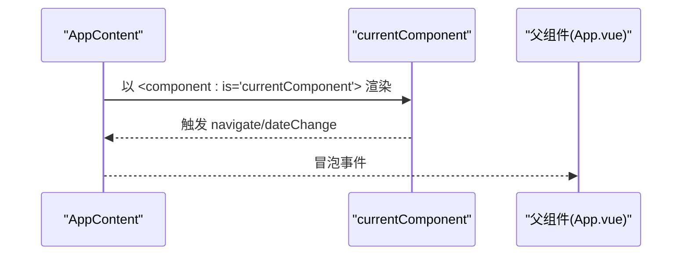

**图表来源**
- [AppContent.vue:3-21](file://src/components/common/AppContent.vue#L3-L21)

**章节来源**
- [AppContent.vue:1-51](file://src/components/common/AppContent.vue#L1-L51)

### AppFooter 分析
- 设计要点
  - 底部导航项：支出、收入、资产、负债、更多
  - 图标与文字组合，支持响应式
- 事件
  - 触发 navigate(key)，由父组件路由分发

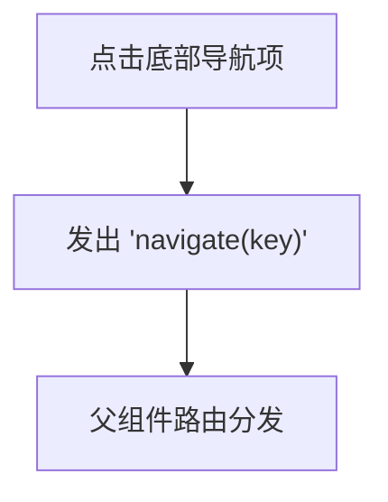

**图表来源**
- [AppFooter.vue:3-23](file://src/components/common/AppFooter.vue#L3-L23)

**章节来源**
- [AppFooter.vue:1-98](file://src/components/common/AppFooter.vue#L1-L98)

### PageHeader 分析
- 设计要点
  - 返回按钮 + 标题
  - 事件：back
- 适用场景
  - 页面级返回，常与 PageTemplate 搭配使用

**章节来源**
- [PageHeader.vue:1-57](file://src/components/common/PageHeader.vue#L1-L57)

### PageTemplate 分析
- 设计要点
  - 顶部 PageHeader + 中间内容插槽 + 底部可选确认按钮
  - 提供 confirmText、confirmDisabled 等配置
- 事件
  - back、confirm
- 插槽
  - 默认插槽用于放置页面内容

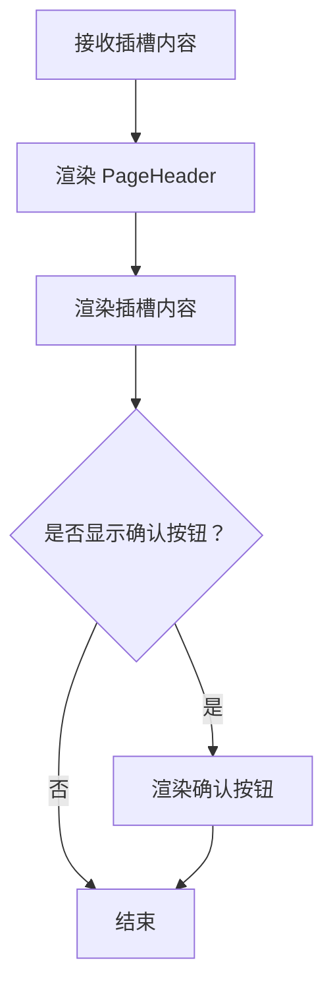

**图表来源**
- [PageTemplate.vue:4-21](file://src/components/common/PageTemplate.vue#L4-L21)

**章节来源**
- [PageTemplate.vue:1-103](file://src/components/common/PageTemplate.vue#L1-L103)

### SideMenu 分析
- 设计要点
  - 抽屉式菜单，支持遮罩层与滑入动画
  - 用户信息展示与菜单项点击
- 状态与事件
  - visible 控制显示/隐藏
  - close、navigate(key) 事件
- 本地存储
  - 加载/保存用户名与修改状态

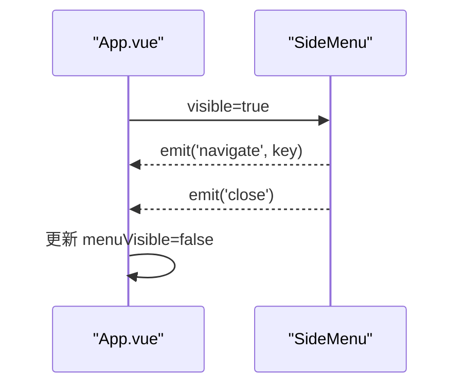

**图表来源**
- [SideMenu.vue:80-89](file://src/components/common/SideMenu.vue#L80-L89)
- [App.vue:150-153](file://src/App.vue#L150-L153)

**章节来源**
- [SideMenu.vue:1-255](file://src/components/common/SideMenu.vue#L1-L255)

### Calendar 分析
- 功能特性
  - 月视图网格，42格覆盖
  - 农历、节气、节假日标注
  - 今日高亮、周末/节假日背景色
  - 每日支出金额标注
  - 年/月选择器与"回到现在"
  - 宽屏模式下的右侧信息卡片
- 事件
  - click(date)：返回被点击日期对象
- 性能与复杂度
  - 生成42格日历数组，填充农历/节假日信息，时间复杂度 O(1)（固定格数）
  - 窗口尺寸监听与定时器需在卸载时清理

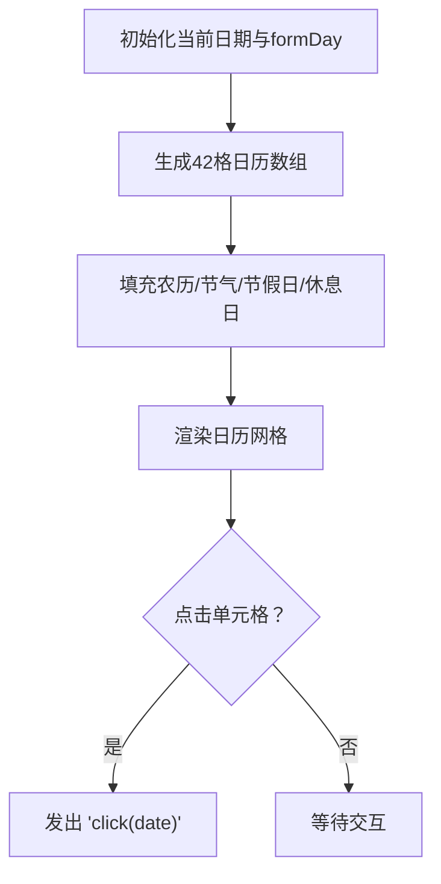

**图表来源**
- [Calendar.vue:160-217](file://src/components/common/Calendar.vue#L160-L217)
- [Calendar.vue:236-243](file://src/components/common/Calendar.vue#L236-L243)

**章节来源**
- [Calendar.vue:1-477](file://src/components/common/Calendar.vue#L1-L477)

### FloatingActionMenu 分析
- 设计要点
  - 单按钮直显或展开多按钮菜单
  - 悬停显示提示标签
  - 动画与阴影增强交互体验
- 事件
  - 通过按钮 action 回调触发，组件不直接发出事件
- 使用建议
  - buttons 数组按需传入，确保每个按钮包含 icon 与 action

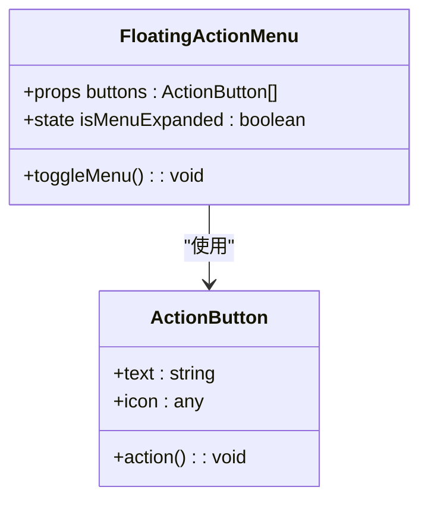

**图表来源**
- [FloatingActionMenu.vue:38-50](file://src/components/common/FloatingActionMenu.vue#L38-L50)

**章节来源**
- [FloatingActionMenu.vue:1-151](file://src/components/common/FloatingActionMenu.vue#L1-L151)

### 页面模板组件 PageTemplate 的使用
- 结构
  - 顶部 PageHeader + 中间插槽 + 底部确认按钮（可选）
- 事件
  - back：返回上级
  - confirm：确认提交（可禁用）
- 适用场景
  - 快速搭建表单类页面或需要统一标题与确认流程的页面

**章节来源**
- [PageTemplate.vue:1-103](file://src/components/common/PageTemplate.vue#L1-L103)

### 侧边菜单 SideMenu 的实现细节
- 菜单项
  - 账户、主题、设置、关于、收藏、帮助、反馈、夜间模式
- 状态管理
  - visible 由父组件控制
  - 关闭菜单时发出 close 事件
- 导航
  - 点击菜单项发出 navigate(key)，随后关闭菜单

**章节来源**
- [SideMenu.vue:1-255](file://src/components/common/SideMenu.vue#L1-L255)

### 日历组件 Calendar 的功能详解
- 日期选择
  - 点击任意单元格返回对应日期对象
- 农历与节假日
  - 农历、节气、节假日名称与宜忌信息
- 今日与休息日
  - 今日高亮与"今"标识；周末/节假日背景色
- 费用标注
  - expenses 对象按日期聚合，存在支出时高亮
- 响应式与宽屏
  - 宽屏显示右侧信息卡片，窄屏隐藏

**章节来源**
- [Calendar.vue:1-477](file://src/components/common/Calendar.vue#L1-L477)

### 浮动操作菜单 FloatingActionMenu 的交互逻辑
- 单按钮直显
  - 仅有一个按钮时直接展示
- 多按钮展开
  - more 按钮展开菜单，逐项悬停显示提示
- 动画与样式
  - 滑入动画、阴影、缩放与透明度过渡

**章节来源**
- [FloatingActionMenu.vue:1-151](file://src/components/common/FloatingActionMenu.vue#L1-L151)

### 资产详情页面 AssetDetailPage 的现代化设计
- 设计要点
  - 顶部导航栏 + 资产基本信息展示 + 收益记录明细 + 悬浮操作按钮
  - 支持资产结束操作，未结束时显示操作按钮
  - 响应式布局，支持移动端与桌面端
- 功能特性
  - 资产基本信息：名称、类型、金额、周期、剩余期数、收益日等
  - 收益记录：支持收益记录的查看与管理
  - 操作按钮：结束资产功能
  - 数据加载：从服务层获取资产详情与收益记录
- 事件与交互
  - 返回上级：通过 navigate 事件返回资产页面
  - 结束资产：弹窗确认后调用服务层 endAsset 方法
  - 格式化显示：日期格式化、金额格式化

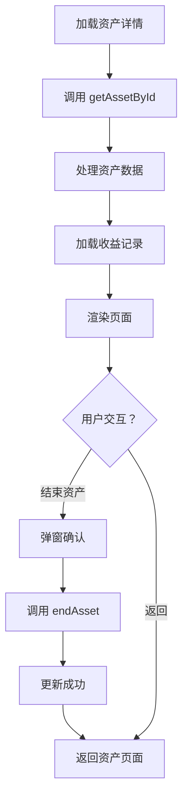

**图表来源**
- [AssetDetailPage.vue:189-229](file://src/components/mobile/asset/AssetDetailPage.vue#L189-L229)
- [AssetDetailPage.vue:137-158](file://src/components/mobile/asset/AssetDetailPage.vue#L137-L158)

**章节来源**
- [AssetDetailPage.vue:1-435](file://src/components/mobile/asset/AssetDetailPage.vue#L1-L435)

### 资产管理页面 AssetManagement 的现代化改进
- 设计要点
  - 当前资产与历史资产切换视图
  - 资产卡片网格布局，支持响应式
  - 浮动操作菜单，支持新增不同类型资产
  - 资产卡片组件化设计
- 功能特性
  - 资产分类展示：通用资产、股票、基金
  - 资产状态管理：ended 状态过滤
  - 资产详情导航：点击卡片跳转到相应详情页面
  - 账户数据关联：显示账户相关信息
- 服务层集成
  - 使用 assetService、stockService、fundService 提供数据
  - 支持异步数据加载与错误处理
  - 模拟数据回退机制

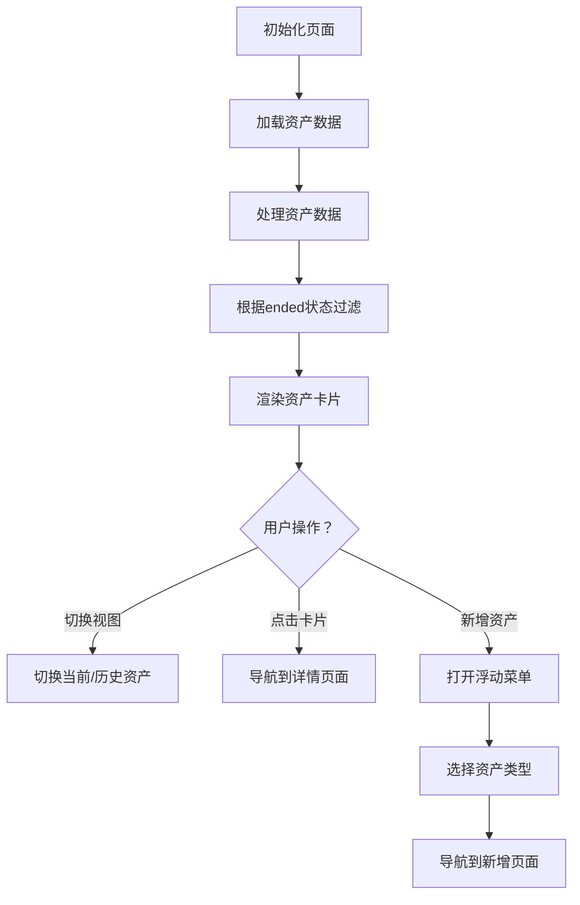

**图表来源**
- [AssetManagement.vue:189-231](file://src/components/mobile/asset/AssetManagement.vue#L189-L231)
- [AssetManagement.vue:249-262](file://src/components/mobile/asset/AssetManagement.vue#L249-L262)

**章节来源**
- [AssetManagement.vue:1-478](file://src/components/mobile/asset/AssetManagement.vue#L1-L478)

### 股票详情页面 StockDetailPage 的完整实现
- 设计要点
  - 股票基本信息展示：名称、代码、成本、当前价格、数量等
  - 交易记录明细：持有记录、买入记录、卖出记录三标签页
  - 悬浮操作按钮：买入、修改价格、卖出功能
  - 响应式布局与美观的卡片设计
- 功能特性
  - 股票详情计算：持有收益、总收益等指标
  - 交易记录查询：支持三种类型的交易记录
  - 实时价格更新：支持修改股票价格
  - 交互式操作：导航到买卖页面
- 服务层集成
  - 使用 stockService 提供完整的股票数据服务
  - 支持价格更新、交易记录查询等功能

**章节来源**
- [StockDetailPage.vue:1-558](file://src/components/mobile/asset/StockDetailPage.vue#L1-L558)

### 基金详情页面 FundDetailPage 的高级功能
- 设计要点
  - 基金基本信息展示：名称、代码、成本、当前净值、份额等
  - 详细的交易记录：持有记录、买入记录、卖出记录
  - 锁定期管理：支持锁定期显示与管理
  - 悬浮操作按钮：买入、修改净值、卖出功能
- 功能特性
  - 基金收益计算：确认收益、持有收益、总收益
  - 交易记录详情：支持净值、份额、手续费等详细信息
  - 锁定期处理：显示锁定期限与结束日期
  - 实时净值更新：支持修改基金净值
- 服务层集成
  - 使用 fundService 提供专业的基金数据服务
  - 支持净值更新、交易记录查询、锁定期管理

**章节来源**
- [FundDetailPage.vue:1-796](file://src/components/mobile/asset/FundDetailPage.vue#L1-L796)

### 资产卡片组件 AssetCard 的模块化设计
- 设计要点
  - 渐变背景与圆角设计
  - 支持图片图标与文本图标
  - 响应式布局与动画效果
  - 可配置的颜色主题
- 功能特性
  - 标题显示：资产名称
  - 金额显示：主要金额与次要金额
  - 图标支持：支持图片URL与文本图标
  - 点击事件：支持卡片点击导航
- 适用场景
  - 资产列表展示
  - 资产详情页面
  - 资产管理页面

**章节来源**
- [AssetCard.vue:1-180](file://src/components/mobile/asset/AssetCard.vue#L1-L180)

### 服务层架构的现代化升级
- 资产服务层
  - assetService：提供通用资产的增删改查、状态管理等功能
  - 支持周期计算、收益日期计算等业务逻辑
- 股票服务层
  - stockService：提供完整的股票交易服务，包括买入、卖出、价格更新等
  - 支持FIFO算法、成本价计算、利润计算等复杂业务逻辑
- 基金服务层
  - fundService：提供专业的基金交易服务，支持锁定期管理
  - 支持加权平均成本、收益计算、锁定期处理等功能
- 类型定义
  - 提供完整的TypeScript类型定义，确保类型安全
  - 支持资产、股票、基金的完整数据模型

**章节来源**
- [assetService.ts:1-165](file://src/services/asset/assetService.ts#L1-L165)
- [stockService.ts:1-482](file://src/services/asset/stockService.ts#L1-L482)
- [fundService.ts:1-508](file://src/services/asset/fundService.ts#L1-L508)
- [asset.ts:1-31](file://src/types/asset/asset.ts#L1-L31)
- [stock.ts:1-95](file://src/types/asset/stock.ts#L1-L95)
- [fund.ts:1-105](file://src/types/asset/fund.ts#L1-L105)

## 依赖分析
- 运行时依赖
  - Vue 3、Element Plus、Pinia、date-fns、lunar-javascript 等
- 构建与开发
  - Vite、TypeScript、Sass 等
- 平台集成
  - Capacitor（原生平台键盘插件）
- 服务层依赖
  - 数据库适配器、事务处理、类型安全

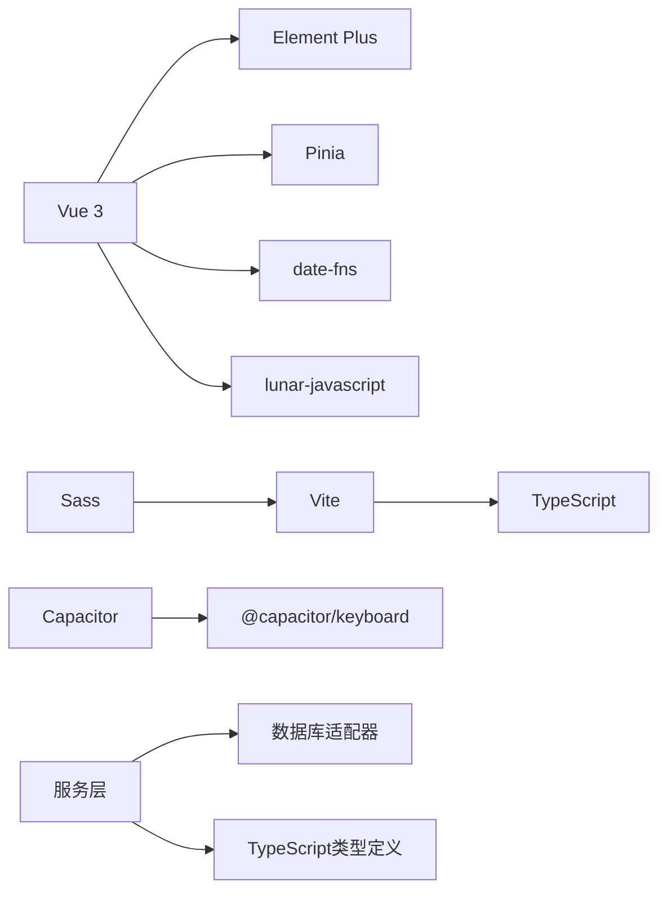

**图表来源**
- [package.json:19-36](file://package.json#L19-L36)
- [vite.config.ts:1-11](file://vite.config.ts#L1-L11)
- [tsconfig.json:1-25](file://tsconfig.json#L1-L25)

**章节来源**
- [package.json:1-72](file://package.json#L1-L72)
- [vite.config.ts:1-11](file://vite.config.ts#L1-L11)
- [tsconfig.json:1-25](file://tsconfig.json#L1-L25)

## 性能考虑
- 日历组件
  - 42格固定数组，填充农历/节假日信息为O(1)；注意避免在渲染周期内做重计算
  - 窗口尺寸监听与定时器需在卸载时清理，防止内存泄漏
- 内容容器
  - AppContent 使用动态组件，建议保持组件映射稳定，减少不必要的重渲染
- 浮动菜单
  - 展开动画与阴影会带来一定开销，按钮数量较多时建议合并相似操作或延迟渲染
- 资产详情页面
  - 使用虚拟滚动优化大量交易记录的渲染性能
  - 按需加载数据，避免一次性加载所有数据
- 服务层优化
  - 使用Promise.all并行加载多个数据源
  - 实现数据缓存机制，减少重复请求
  - 优化数据库查询，使用索引和适当的查询条件

## 故障排查指南
- 事件未生效
  - 确认事件冒泡链路：子组件 -> AppContent -> App.vue -> SideMenu/AppFooter
  - 检查事件名拼写与参数传递
- 日历不更新
  - 确认 resize 监听与定时器在卸载时移除
  - 确认 expenses 对象键值与日期格式一致
- 菜单无法关闭
  - 确认 SideMenu 发出 close 事件后父组件正确更新 visible
- 样式异常
  - 检查 scoped 样式与 :deep 选择器使用
  - 确认 Element Plus 图标与主题样式加载顺序
- 资产详情加载失败
  - 检查服务层调用是否正确
  - 确认资产ID参数传递
  - 验证数据库连接与查询结果
- 股票/基金操作异常
  - 检查账户余额验证逻辑
  - 确认交易数量与可用数量匹配
  - 验证锁定期限制（基金）

**章节来源**
- [Calendar.vue:88-94](file://src/components/common/Calendar.vue#L88-L94)
- [Calendar.vue:262-264](file://src/components/common/Calendar.vue#L262-L264)
- [SideMenu.vue:80-83](file://src/components/common/SideMenu.vue#L80-L83)
- [AssetDetailPage.vue:189-225](file://src/components/mobile/asset/AssetDetailPage.vue#L189-L225)
- [StockDetailPage.vue:300-349](file://src/components/mobile/asset/StockDetailPage.vue#L300-L349)
- [FundDetailPage.vue:327-375](file://src/components/mobile/asset/FundDetailPage.vue#L327-L375)

## 结论
本UI组件体系以通用布局组件为核心，结合页面模板与交互组件，形成可复用、可扩展的移动端财务应用界面框架。通过事件与属性的清晰边界、响应式与主题适配策略，以及合理的性能与可维护性设计，能够支撑多样化的业务页面需求。

**更新** 本次现代化升级显著提升了资产相关页面的功能完整性与用户体验，新增的 AssetDetailPage.vue 提供了丰富的通用资产详情展示，配合完善的股票、基金详情页面，形成了完整的资产管理UI体系。服务层架构的引入确保了数据处理的可靠性与可维护性，TypeScript类型定义提供了更好的开发体验与类型安全保障。

建议在实际使用中遵循事件冒泡规范、合理拆分组件职责，并根据业务场景扩展组件能力。对于新增的资产详情页面，建议重点关注数据加载性能与用户体验优化。

## 附录

### 组件属性、事件与插槽清单
- AppHeader
  - 事件：toggle-menu
- AppContent
  - 属性：currentComponent、componentProps
  - 事件：navigate、dateChange
- AppFooter
  - 事件：navigate(key)
- PageHeader
  - 事件：back
- PageTemplate
  - 属性：title、showConfirmButton、confirmText、confirmDisabled
  - 事件：back、confirm
  - 插槽：默认插槽
- SideMenu
  - 属性：visible
  - 事件：close、navigate(key)
- Calendar
  - 属性：width、height、expenses
  - 事件：click(date)
- FloatingActionMenu
  - 属性：buttons（数组，包含 text、icon、action）
- AssetDetailPage
  - 属性：assetId（必需）
  - 事件：navigate
  - 插槽：无
- AssetManagement
  - 事件：navigate
  - 插槽：无
- StockDetailPage
  - 属性：stockId（必需）
  - 事件：navigate
  - 插槽：无
- FundDetailPage
  - 属性：fundId（必需）
  - 事件：navigate
  - 插槽：无
- AssetCard
  - 属性：title、amount、secondaryAmount、icon、color、assetId
  - 事件：click
  - 插槽：无

**章节来源**
- [AppHeader.vue:16-18](file://src/components/common/AppHeader.vue#L16-L18)
- [AppContent.vue:13-21](file://src/components/common/AppContent.vue#L13-L21)
- [AppFooter.vue:29-31](file://src/components/common/AppFooter.vue#L29-L31)
- [PageHeader.vue:18-20](file://src/components/common/PageHeader.vue#L18-L20)
- [PageTemplate.vue:27-37](file://src/components/common/PageTemplate.vue#L27-L37)
- [SideMenu.vue:53-60](file://src/components/common/SideMenu.vue#L53-L60)
- [Calendar.vue:74-78](file://src/components/common/Calendar.vue#L74-L78)
- [FloatingActionMenu.vue:45-50](file://src/components/common/FloatingActionMenu.vue#L45-L50)
- [AssetDetailPage.vue:95-100](file://src/components/mobile/asset/AssetDetailPage.vue#L95-L100)
- [AssetManagement.vue:99](file://src/components/mobile/asset/AssetManagement.vue#L99)
- [StockDetailPage.vue:185-190](file://src/components/mobile/asset/StockDetailPage.vue#L185-L190)
- [FundDetailPage.vue:200-205](file://src/components/mobile/asset/FundDetailPage.vue#L200-L205)
- [AssetCard.vue:24-49](file://src/components/mobile/asset/AssetCard.vue#L24-L49)

### 样式定制与主题适配
- 主题色
  - 组件广泛使用统一主色，可通过CSS变量或覆盖类名进行主题定制
  - 资产卡片支持自定义颜色主题
- 响应式
  - 多处媒体查询适配小屏设备，建议在新增样式时同步考虑断点
  - 资产管理页面支持网格布局的响应式调整
- Element Plus
  - 图标与组件样式由 Element Plus 提供，建议统一引入其样式文件
- 资产详情页面
  - 支持深色主题适配
  - 响应式卡片布局设计

**章节来源**
- [AppHeader.vue:50-135](file://src/components/common/AppHeader.vue#L50-L135)
- [AppFooter.vue:34-98](file://src/components/common/AppFooter.vue#L34-L98)
- [FloatingActionMenu.vue:61-151](file://src/components/common/FloatingActionMenu.vue#L61-L151)
- [AssetCard.vue:68-180](file://src/components/mobile/asset/AssetCard.vue#L68-L180)
- [AssetDetailPage.vue:232-435](file://src/components/mobile/asset/AssetDetailPage.vue#L232-L435)
- [AssetManagement.vue:283-478](file://src/components/mobile/asset/AssetManagement.vue#L283-L478)
- [main.ts:3-5](file://src/main.ts#L3-L5)

### 最佳实践与扩展建议
- 事件命名与参数
  - 保持事件名一致性，如 navigate/key、dateChange/year-month
  - 资产详情页面使用 navigate 事件进行页面跳转
- 组件职责
  - 通用组件只负责UI与交互，业务逻辑下沉到页面或store
  - 服务层负责数据处理与业务逻辑，页面组件负责展示
- 动态组件
  - 使用 computed 维护组件映射，避免在模板中直接分支过多
  - 资产详情页面使用 props 接收参数，支持灵活的数据传递
- 性能
  - 避免在渲染周期内做重计算；及时清理定时器与监听器
  - 资产详情页面使用懒加载优化大数据量展示
  - 服务层使用并行加载提升数据获取效率
- 可访问性
  - 为图标与按钮提供语义化文本与键盘可达性
  - 资产卡片支持点击事件，提供明确的视觉反馈
- 类型安全
  - 使用 TypeScript 类型定义确保数据结构正确性
  - 服务层返回值使用明确的类型注解
- 错误处理
  - 实现完善的错误处理机制，提供友好的用户反馈
  - 资产详情页面支持模拟数据回退，确保页面稳定性

**章节来源**
- [App.vue:65-89](file://src/App.vue#L65-L89)
- [Calendar.vue:254-264](file://src/components/common/Calendar.vue#L254-L264)
- [AssetDetailPage.vue:189-225](file://src/components/mobile/asset/AssetDetailPage.vue#L189-L225)
- [AssetManagement.vue:189-231](file://src/components/mobile/asset/AssetManagement.vue#L189-L231)
- [stockService.ts:154-244](file://src/services/asset/stockService.ts#L154-L244)
- [fundService.ts:169-264](file://src/services/asset/fundService.ts#L169-L264)