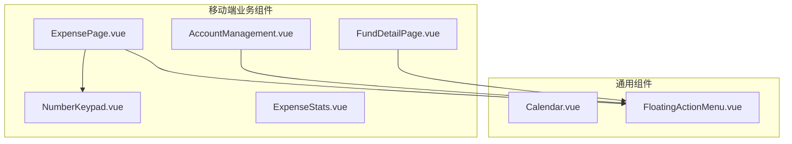
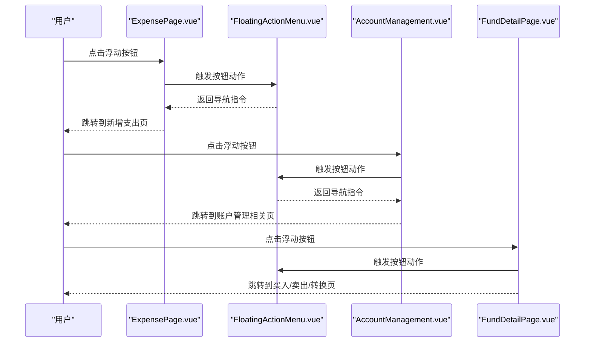
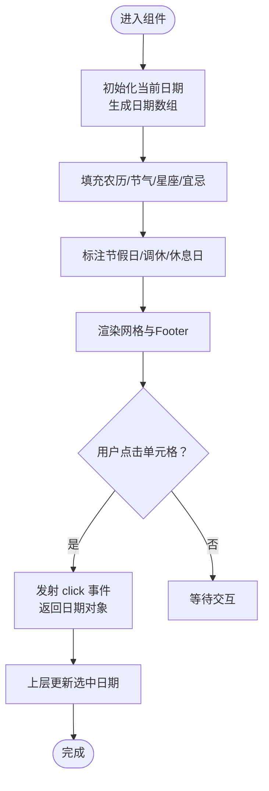
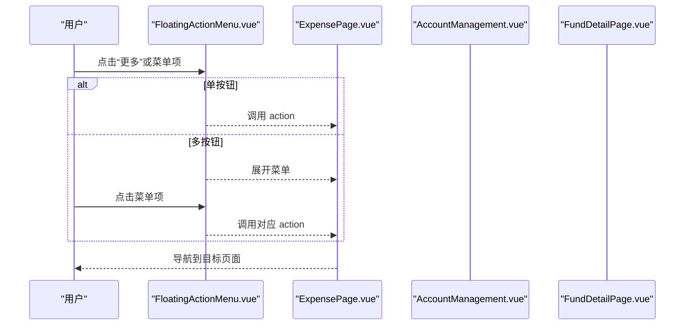
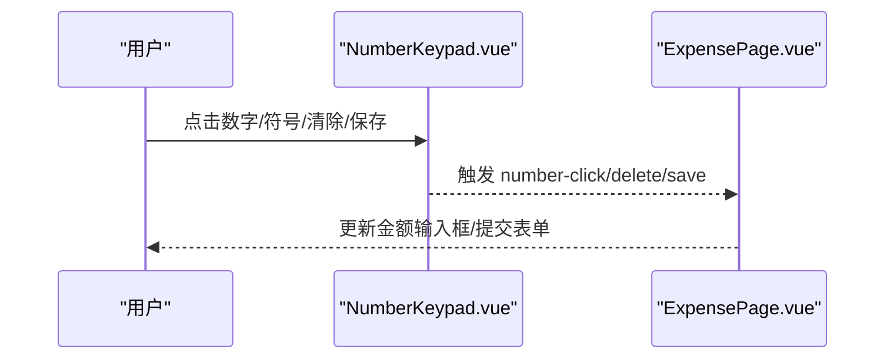
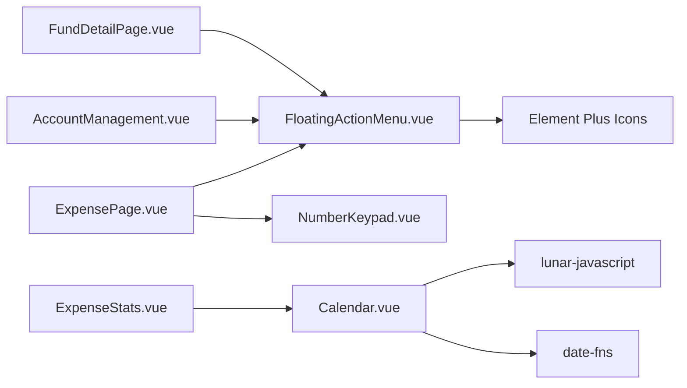

# 交互组件

<cite>
**本文引用的文件**
- [Calendar.vue](file://src/components/common/Calendar.vue)
- [FloatingActionMenu.vue](file://src/components/common/FloatingActionMenu.vue)
- [NumberKeypad.vue](file://src/components/mobile/expense/NumberKeypad.vue)
- [ExpensePage.vue](file://src/components/mobile/expense/ExpensePage.vue)
- [AccountManagement.vue](file://src/components/mobile/account/AccountManagement.vue)
- [FundDetailPage.vue](file://src/components/mobile/asset/FundDetailPage.vue)
- [ExpenseStats.vue](file://src/components/mobile/expense/ExpenseStats.vue)
</cite>

## 目录
1. [简介](#简介)
2. [项目结构](#项目结构)
3. [核心组件](#核心组件)
4. [架构概览](#架构概览)
5. [详细组件分析](#详细组件分析)
6. [依赖关系分析](#依赖关系分析)
7. [性能考虑](#性能考虑)
8. [故障排查指南](#故障排查指南)
9. [结论](#结论)
10. [附录](#附录)

## 简介
本文件聚焦于财务应用中的交互组件，系统性梳理以下三个组件的设计与实现：
- 日历组件（Calendar）：日期选择、月份切换、节假日标注、农历显示、节日节气提示等
- 浮动操作菜单组件（FloatingActionMenu）：按钮布局、动画效果、点击事件、菜单展开/收起
- 数字键盘组件（NumberKeypad）：数字输入、小数点处理、输入验证、键盘样式与响应式

同时，文档阐述事件处理机制、配置选项、样式定制、动画效果、用户体验与无障碍支持，并给出最佳实践与性能优化建议。

## 项目结构
交互组件主要分布在以下目录：
- 通用组件：src/components/common/
- 移动端业务组件：src/components/mobile/expense、src/components/mobile/account、src/components/mobile/asset 等

图表来源
- [Calendar.vue:1-65](file://src/components/common/Calendar.vue#L1-L65)
- [FloatingActionMenu.vue:1-31](file://src/components/common/FloatingActionMenu.vue#L1-L31)
- [NumberKeypad.vue:1-30](file://src/components/mobile/expense/NumberKeypad.vue#L1-L30)
- [ExpensePage.vue:1-21](file://src/components/mobile/expense/ExpensePage.vue#L1-L21)
- [AccountManagement.vue:86-87](file://src/components/mobile/account/AccountManagement.vue#L86-L87)
- [FundDetailPage.vue:182-183](file://src/components/mobile/asset/FundDetailPage.vue#L182-L183)
- [ExpenseStats.vue:643-719](file://src/components/mobile/expense/ExpenseStats.vue#L643-L719)

章节来源
- [Calendar.vue:1-65](file://src/components/common/Calendar.vue#L1-L65)
- [FloatingActionMenu.vue:1-31](file://src/components/common/FloatingActionMenu.vue#L1-L31)
- [NumberKeypad.vue:1-30](file://src/components/mobile/expense/NumberKeypad.vue#L1-L30)
- [ExpensePage.vue:1-21](file://src/components/mobile/expense/ExpensePage.vue#L1-L21)
- [AccountManagement.vue:86-87](file://src/components/mobile/account/AccountManagement.vue#L86-L87)
- [FundDetailPage.vue:182-183](file://src/components/mobile/asset/FundDetailPage.vue#L182-L183)
- [ExpenseStats.vue:643-719](file://src/components/mobile/expense/ExpenseStats.vue#L643-L719)

## 核心组件
- 日历组件（Calendar）
  - 功能：展示当月日历网格，标注节假日/节气、周末休息日、当日高亮、某日是否有支出等；支持通过年/月选择器切换月份；在宽屏设备显示农历与吉凶宜忌摘要
  - 关键属性：width、height、expenses（用于标注某日支出）
  - 事件：click（返回被选中的日期对象）
- 浮动操作菜单（FloatingActionMenu）
  - 功能：单按钮直显，多按钮时显示“更多”按钮并展开菜单；支持悬停提示文案、淡入动画
  - 关键属性：buttons（按钮数组，包含 text、icon、action）
- 数字键盘（NumberKeypad）
  - 功能：数字输入、小数点、加减、清除、保存；事件驱动输出
  - 事件：number-click、delete、save

章节来源
- [Calendar.vue:74-78](file://src/components/common/Calendar.vue#L74-L78)
- [Calendar.vue:234-243](file://src/components/common/Calendar.vue#L234-L243)
- [FloatingActionMenu.vue:44-50](file://src/components/common/FloatingActionMenu.vue#L44-L50)
- [FloatingActionMenu.vue:55-58](file://src/components/common/FloatingActionMenu.vue#L55-L58)
- [NumberKeypad.vue:32-37](file://src/components/mobile/expense/NumberKeypad.vue#L32-L37)

## 架构概览
三个组件在页面中的典型组合：页面容器组件通过 props 向交互组件注入数据与行为，交互组件通过事件向上层传递用户操作结果，上层再根据结果进行路由跳转、状态更新或数据持久化。

图表来源
- [ExpensePage.vue:65-72](file://src/components/mobile/expense/ExpensePage.vue#L65-L72)
- [FloatingActionMenu.vue:1-31](file://src/components/common/FloatingActionMenu.vue#L1-L31)
- [AccountManagement.vue:86-87](file://src/components/mobile/account/AccountManagement.vue#L86-L87)
- [FundDetailPage.vue:215-232](file://src/components/mobile/asset/FundDetailPage.vue#L215-L232)

## 详细组件分析

### 日历组件（Calendar）
- 设计要点
  - 42格网格布局：上月尾部、当月全部、下月开头，保证固定行列
  - 农历与节气：基于第三方库填充农历、节气、星座等信息
  - 节假日：使用节假日工具类标注法定节假日及调休
  - 交互：单元格点击触发事件，支持“回到今天”快捷入口
  - 响应式：监听窗口尺寸，宽屏显示农历与宜忌摘要
- 关键实现
  - 日期数组生成：计算当月第一天与最后一天，推导前后补位日期
  - 农历填充：对每个日期写入农历、节气、星座、宜忌等
  - 节假日标注：根据节假日工具类设置休息日与节日名
  - 事件发射：selectDate 将当前日期对象通过 click 事件回传
- 样式与动画
  - 网格容器、单元格、当前日高亮、休息日背景、有支出标记
  - 宽屏 Footer 展示农历与宜忌摘要，带图标与时钟提示
- 使用场景
  - 在统计页或记录页中作为日期选择器，结合上层组件的年/月筛选

图表来源
- [Calendar.vue:118-217](file://src/components/common/Calendar.vue#L118-L217)
- [Calendar.vue:234-243](file://src/components/common/Calendar.vue#L234-L243)
- [Calendar.vue:45-63](file://src/components/common/Calendar.vue#L45-L63)

章节来源
- [Calendar.vue:74-78](file://src/components/common/Calendar.vue#L74-L78)
- [Calendar.vue:118-217](file://src/components/common/Calendar.vue#L118-L217)
- [Calendar.vue:234-243](file://src/components/common/Calendar.vue#L234-L243)
- [Calendar.vue:45-63](file://src/components/common/Calendar.vue#L45-L63)

### 浮动操作菜单（FloatingActionMenu）
- 设计要点
  - 单按钮：直接展示按钮与可选文本
  - 多按钮：显示“更多”按钮，点击后展开菜单项，支持悬停提示
  - 动画：展开使用淡入动画，按钮 hover 放大与阴影增强
- 关键实现
  - 类型定义：ActionButton 接口包含 text、icon、action
  - 展开状态：isMenuExpanded 控制菜单可见
  - 事件：点击菜单项触发对应 action
- 样式与动画
  - 固定定位，右下角布局，z-index 提升
  - 按钮与菜单项统一圆角、阴影、过渡动画
- 使用场景
  - 页面顶部导航或卡片底部快速入口，如“新增支出”、“买入/卖出/转换”等

图表来源
- [FloatingActionMenu.vue:1-31](file://src/components/common/FloatingActionMenu.vue#L1-L31)
- [ExpensePage.vue:65-72](file://src/components/mobile/expense/ExpensePage.vue#L65-L72)
- [AccountManagement.vue:86-87](file://src/components/mobile/account/AccountManagement.vue#L86-L87)
- [FundDetailPage.vue:215-232](file://src/components/mobile/asset/FundDetailPage.vue#L215-L232)

章节来源
- [FloatingActionMenu.vue:37-50](file://src/components/common/FloatingActionMenu.vue#L37-L50)
- [FloatingActionMenu.vue:55-58](file://src/components/common/FloatingActionMenu.vue#L55-L58)
- [FloatingActionMenu.vue:61-151](file://src/components/common/FloatingActionMenu.vue#L61-L151)

### 数字键盘（NumberKeypad）
- 设计要点
  - 4行4列布局：数字1-9、清除、加减、AC、0、小数点、保存
  - 事件驱动：number-click、delete、save 三种事件
  - 响应式：在窄屏下自动缩小尺寸，保证触控友好
- 关键实现
  - 事件声明：defineEmits 声明事件签名
  - 样式：统一圆角、悬停态、保存按钮强调色
- 使用场景
  - 支出/收入金额录入、转账金额输入、资产买卖数量输入等

图表来源
- [NumberKeypad.vue:1-30](file://src/components/mobile/expense/NumberKeypad.vue#L1-L30)
- [NumberKeypad.vue:32-37](file://src/components/mobile/expense/NumberKeypad.vue#L32-L37)

章节来源
- [NumberKeypad.vue:32-37](file://src/components/mobile/expense/NumberKeypad.vue#L32-L37)
- [NumberKeypad.vue:40-106](file://src/components/mobile/expense/NumberKeypad.vue#L40-L106)

## 依赖关系分析
- 组件间依赖
  - ExpensePage、AccountManagement、FundDetailPage 三个页面均引入 FloatingActionMenu，并通过 props 注入按钮列表
  - ExpensePage 引入 NumberKeypad 用于金额输入
  - ExpenseStats 中对日历样式进行了补充（非组件内部实现，但体现了日历在统计页的样式扩展）
- 外部依赖
  - Calendar 依赖日期与农历工具库，用于生成日期数组、填充农历与节假日信息
  - Element Plus 图标组件用于菜单与按钮图标
- 潜在耦合
  - FloatingActionMenu 的按钮列表与具体页面业务强相关，需保持接口稳定
  - Calendar 的事件返回值为日期对象，上层需确保消费方能正确解析

图表来源
- [ExpensePage.vue:31-31](file://src/components/mobile/expense/ExpensePage.vue#L31-L31)
- [AccountManagement.vue:163-163](file://src/components/mobile/account/AccountManagement.vue#L163-L163)
- [FundDetailPage.vue:190-190](file://src/components/mobile/asset/FundDetailPage.vue#L190-L190)
- [NumberKeypad.vue:1-30](file://src/components/mobile/expense/NumberKeypad.vue#L1-L30)
- [ExpenseStats.vue:643-719](file://src/components/mobile/expense/ExpenseStats.vue#L643-L719)
- [Calendar.vue:69-72](file://src/components/common/Calendar.vue#L69-L72)

章节来源
- [ExpensePage.vue:31-31](file://src/components/mobile/expense/ExpensePage.vue#L31-L31)
- [AccountManagement.vue:163-163](file://src/components/mobile/account/AccountManagement.vue#L163-L163)
- [FundDetailPage.vue:190-190](file://src/components/mobile/asset/FundDetailPage.vue#L190-L190)
- [NumberKeypad.vue:1-30](file://src/components/mobile/expense/NumberKeypad.vue#L1-L30)
- [ExpenseStats.vue:643-719](file://src/components/mobile/expense/ExpenseStats.vue#L643-L719)
- [Calendar.vue:69-72](file://src/components/common/Calendar.vue#L69-L72)

## 性能考虑
- 日历组件
  - 42格固定渲染，避免动态增删 DOM；仅在月份切换或窗口尺寸变化时重算
  - 农历/节假日计算在组件内完成，建议在上层缓存 expenses 以减少重复计算
  - 定时器每秒更新时间，组件卸载时清理，避免内存泄漏
- 浮动操作菜单
  - 展开/收起使用 CSS 动画，尽量避免复杂 JS 动画；按钮数量较多时建议分组或懒加载
- 数字键盘
  - 事件驱动，无状态存储；建议在上层集中处理输入缓冲与格式化，避免频繁重渲染

## 故障排查指南
- 日历组件
  - 现象：点击无效或无法回到今天
  - 排查：确认 click 事件监听是否正确绑定；检查 selectDate 与 toNowEvent 的调用链
  - 现象：农历/节假日不显示
  - 排查：确认 lunar-javascript 与节假日工具类版本；检查 fillNongLi 与 getCalendarDates 的调用顺序
- 浮动操作菜单
  - 现象：菜单不展开或按钮无反应
  - 排查：确认 isMenuExpanded 状态切换；检查按钮 action 是否为空
  - 现象：样式错位
  - 排查：检查 scoped 样式与 :deep 选择器使用；确认 z-index 与定位
- 数字键盘
  - 现象：事件未触发或值异常
  - 排查：确认 defineEmits 声明与父组件监听一致；检查 number-click 参数类型

章节来源
- [Calendar.vue:234-243](file://src/components/common/Calendar.vue#L234-L243)
- [Calendar.vue:246-251](file://src/components/common/Calendar.vue#L246-L251)
- [FloatingActionMenu.vue:55-58](file://src/components/common/FloatingActionMenu.vue#L55-L58)
- [NumberKeypad.vue:32-37](file://src/components/mobile/expense/NumberKeypad.vue#L32-L37)

## 结论
上述交互组件在财务应用中承担了关键的用户输入与导航职责。Calendar 提供了丰富的日期与文化信息，FloatingActionMenu 实现了简洁高效的入口聚合，NumberKeypad 则满足了移动端高频的数值输入需求。通过事件驱动与 props 注入的方式，组件与页面之间保持低耦合、高内聚，便于扩展与维护。

## 附录

### 事件处理机制
- Calendar
  - 事件：click（返回日期对象）
  - 用途：上层根据返回值更新选中日期并刷新数据
- FloatingActionMenu
  - 事件：由按钮 action 直接触发导航或业务逻辑
  - 用途：页面级路由跳转或弹窗控制
- NumberKeypad
  - 事件：number-click、delete、save
  - 用途：上层集中处理输入缓冲、格式化与提交

章节来源
- [Calendar.vue:234-243](file://src/components/common/Calendar.vue#L234-L243)
- [FloatingActionMenu.vue:1-31](file://src/components/common/FloatingActionMenu.vue#L1-L31)
- [NumberKeypad.vue:32-37](file://src/components/mobile/expense/NumberKeypad.vue#L32-L37)

### 配置选项与样式定制
- Calendar
  - Props：width、height、expenses
  - 样式：网格、单元格、当前日、休息日、有支出标记、宽屏 Footer
- FloatingActionMenu
  - Props：buttons（text、icon、action）
  - 样式：固定定位、圆角、阴影、悬停放大、淡入动画、提示文案
- NumberKeypad
  - 事件：number-click、delete、save
  - 样式：响应式尺寸、悬停态、保存按钮强调色

章节来源
- [Calendar.vue:74-78](file://src/components/common/Calendar.vue#L74-L78)
- [Calendar.vue:274-475](file://src/components/common/Calendar.vue#L274-L475)
- [FloatingActionMenu.vue:44-50](file://src/components/common/FloatingActionMenu.vue#L44-L50)
- [FloatingActionMenu.vue:61-151](file://src/components/common/FloatingActionMenu.vue#L61-L151)
- [NumberKeypad.vue:40-106](file://src/components/mobile/expense/NumberKeypad.vue#L40-L106)

### 用户体验与无障碍支持
- 无障碍建议
  - Calendar：为单元格添加 aria-label（如日期、农历、节日），支持键盘导航（Tab/方向键）
  - FloatingActionMenu：为按钮添加 title 或 aria-label，支持键盘打开/关闭菜单
  - NumberKeypad：为按钮添加可读性更强的语义标签，提供键盘快捷键提示
- 交互优化
  - Calendar：点击当前日可快速回到今天；宽屏 Footer 提供农历与宜忌摘要
  - FloatingActionMenu：悬停提示文案、淡入动画提升反馈；按钮尺寸适配移动端
  - NumberKeypad：响应式布局、触摸友好尺寸、保存按钮视觉强调

### 最佳实践与性能优化建议
- 组件解耦
  - 通过 props 与事件分离业务逻辑，避免在组件内部硬编码导航或数据请求
- 输入处理
  - NumberKeypad 的输入应在上层统一处理，避免组件内做过多格式化
- 渲染优化
  - Calendar 固定网格渲染，避免频繁重排；合理缓存农历/节假日计算结果
- 动画与交互
  - FloatingActionMenu 使用 CSS 动画；避免在滚动/缩放时强制重绘
- 可维护性
  - 为按钮列表与事件命名清晰；为样式变量集中管理，便于主题切换