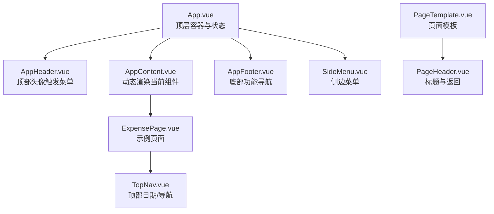
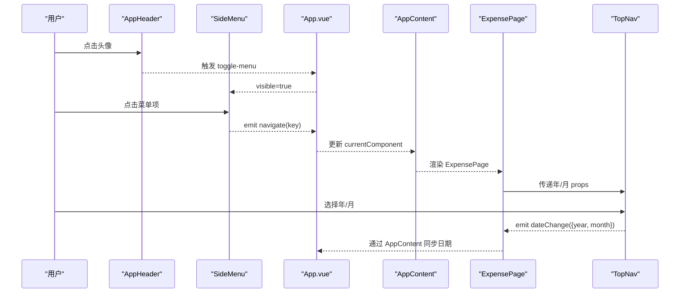
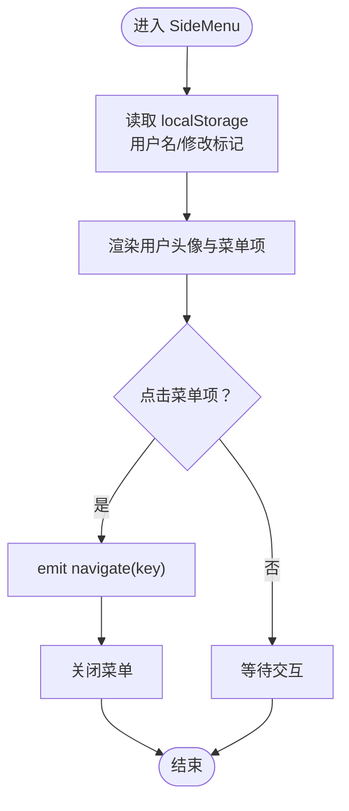
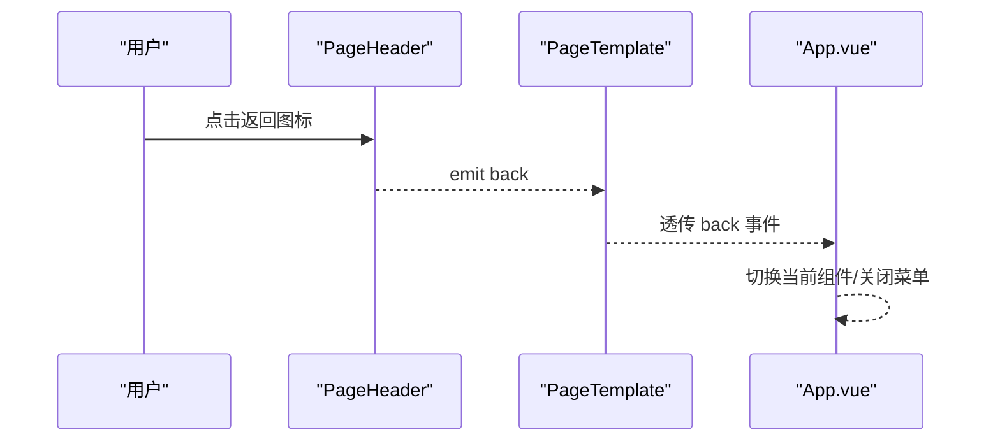
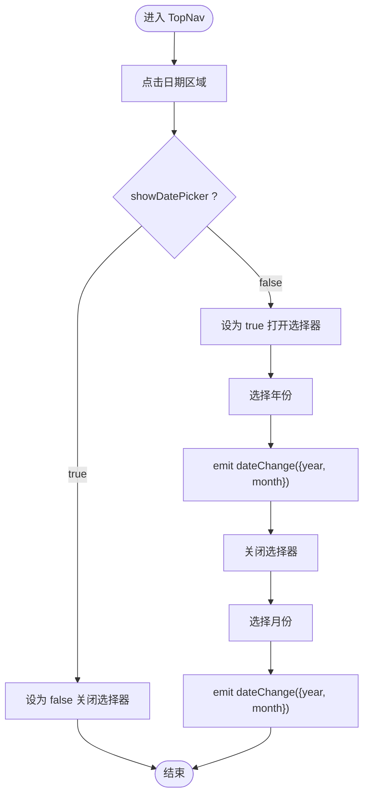
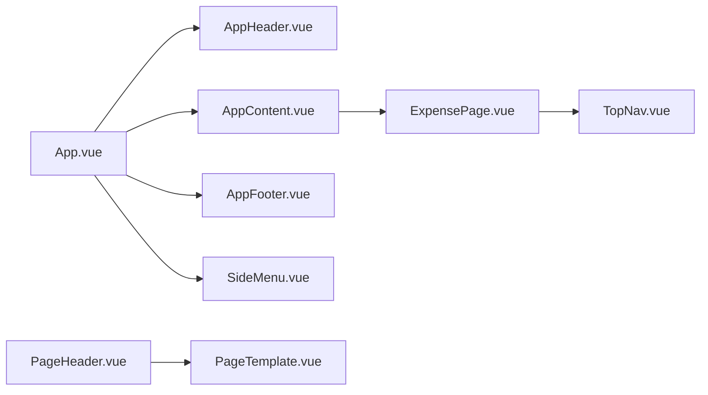

# 导航组件

<cite>
**本文引用的文件**
- [src/components/common/SideMenu.vue](file://src/components/common/SideMenu.vue)
- [src/components/common/PageHeader.vue](file://src/components/common/PageHeader.vue)
- [src/components/mobile/expense/TopNav.vue](file://src/components/mobile/expense/TopNav.vue)
- [src/components/common/PageTemplate.vue](file://src/components/common/PageTemplate.vue)
- [src/components/common/AppHeader.vue](file://src/components/common/AppHeader.vue)
- [src/components/common/AppContent.vue](file://src/components/common/AppContent.vue)
- [src/components/common/AppFooter.vue](file://src/components/common/AppFooter.vue)
- [src/App.vue](file://src/App.vue)
- [src/main.ts](file://src/main.ts)
- [src/components/mobile/expense/ExpensePage.vue](file://src/components/mobile/expense/ExpensePage.vue)
- [src/components/mobile/account/AccountManagement.vue](file://src/components/mobile/account/AccountManagement.vue)
</cite>

## 目录
1. [简介](#简介)
2. [项目结构](#项目结构)
3. [核心组件](#核心组件)
4. [架构总览](#架构总览)
5. [详细组件分析](#详细组件分析)
6. [依赖分析](#依赖分析)
7. [性能考虑](#性能考虑)
8. [故障排查指南](#故障排查指南)
9. [结论](#结论)
10. [附录](#附录)

## 简介
本文件系统性梳理财务应用中的导航体系，重点覆盖以下组件与能力：
- 侧边菜单组件（SideMenu）：菜单项配置、路由跳转、状态管理、用户信息持久化与响应式适配
- 页面头部组件（PageHeader）：标题显示、返回按钮交互
- 顶部导航组件（TopNav）：移动端日期选择、导航切换、状态同步
- 导航事件处理机制：点击事件、路由监听、状态更新
- 配置选项、样式定制与主题适配
- 响应式设计与无障碍访问支持
- 最佳实践与性能优化建议

## 项目结构
导航相关组件主要分布在 common 与 mobile 目录下，并通过应用根组件进行统一编排：
- 顶层容器与状态：App.vue
- 顶部与底部导航：AppHeader、AppFooter、AppContent
- 侧边菜单：SideMenu
- 页面模板与头部：PageTemplate、PageHeader
- 移动端顶部导航：TopNav
- 示例页面：ExpensePage、AccountManagement

图表来源
- [src/App.vue:1-195](file://src/App.vue#L1-L195)
- [src/components/common/AppHeader.vue:1-135](file://src/components/common/AppHeader.vue#L1-L135)
- [src/components/common/AppContent.vue:1-51](file://src/components/common/AppContent.vue#L1-L51)
- [src/components/common/AppFooter.vue:1-98](file://src/components/common/AppFooter.vue#L1-L98)
- [src/components/common/SideMenu.vue:1-255](file://src/components/common/SideMenu.vue#L1-L255)
- [src/components/mobile/expense/ExpensePage.vue:1-88](file://src/components/mobile/expense/ExpensePage.vue#L1-L88)
- [src/components/mobile/expense/TopNav.vue:1-211](file://src/components/mobile/expense/TopNav.vue#L1-L211)
- [src/components/common/PageTemplate.vue:1-103](file://src/components/common/PageTemplate.vue#L1-L103)
- [src/components/common/PageHeader.vue:1-57](file://src/components/common/PageHeader.vue#L1-L57)

章节来源
- [src/App.vue:1-195](file://src/App.vue#L1-L195)
- [src/components/common/AppHeader.vue:1-135](file://src/components/common/AppHeader.vue#L1-L135)
- [src/components/common/AppContent.vue:1-51](file://src/components/common/AppContent.vue#L1-L51)
- [src/components/common/AppFooter.vue:1-98](file://src/components/common/AppFooter.vue#L1-L98)
- [src/components/common/SideMenu.vue:1-255](file://src/components/common/SideMenu.vue#L1-L255)
- [src/components/mobile/expense/ExpensePage.vue:1-88](file://src/components/mobile/expense/ExpensePage.vue#L1-L88)
- [src/components/mobile/expense/TopNav.vue:1-211](file://src/components/mobile/expense/TopNav.vue#L1-L211)
- [src/components/common/PageTemplate.vue:1-103](file://src/components/common/PageTemplate.vue#L1-L103)
- [src/components/common/PageHeader.vue:1-57](file://src/components/common/PageHeader.vue#L1-L57)

## 核心组件
- 侧边菜单（SideMenu）
  - 功能：用户头像展示、菜单项列表、遮罩层、滑入动画、响应式宽度、本地存储用户信息
  - 事件：关闭菜单（close）、导航（navigate）
  - 状态：visible 控制显隐；用户名与修改标记来自 localStorage
- 页面头部（PageHeader）
  - 功能：标题显示、返回按钮（左箭头图标）
  - 事件：back
- 顶部导航（TopNav）
  - 功能：日期选择器（年/月）、统计入口图标、状态同步
  - 事件：dateChange、navigate
- 页面模板（PageTemplate）
  - 功能：统一标题、内容区插槽、可选确认按钮
  - 事件：back、confirm
- 顶部与底部导航容器（AppHeader、AppFooter、AppContent）
  - 功能：顶部头像触发菜单、底部五宫格导航、中间内容区域动态渲染

章节来源
- [src/components/common/SideMenu.vue:1-255](file://src/components/common/SideMenu.vue#L1-L255)
- [src/components/common/PageHeader.vue:1-57](file://src/components/common/PageHeader.vue#L1-L57)
- [src/components/mobile/expense/TopNav.vue:1-211](file://src/components/mobile/expense/TopNav.vue#L1-L211)
- [src/components/common/PageTemplate.vue:1-103](file://src/components/common/PageTemplate.vue#L1-L103)
- [src/components/common/AppHeader.vue:1-135](file://src/components/common/AppHeader.vue#L1-L135)
- [src/components/common/AppContent.vue:1-51](file://src/components/common/AppContent.vue#L1-L51)
- [src/components/common/AppFooter.vue:1-98](file://src/components/common/AppFooter.vue#L1-L98)

## 架构总览
导航体系采用“根容器 + 多层导航组件”的分层设计：
- 根容器负责全局状态（当前组件、导航参数、日期选择），并通过事件向子组件下发 props 或向上冒泡事件
- 顶部与底部导航负责平台级导航（菜单开关、底部功能入口）
- 侧边菜单负责应用内深度导航（账户、主题、设置、关于、收藏、帮助、反馈、夜间模式）
- 页面级导航（TopNav）负责业务维度的日期选择与统计入口
- 页面模板与页面头部提供统一的页面骨架

图表来源
- [src/App.vue:1-195](file://src/App.vue#L1-L195)
- [src/components/common/AppHeader.vue:1-135](file://src/components/common/AppHeader.vue#L1-L135)
- [src/components/common/SideMenu.vue:1-255](file://src/components/common/SideMenu.vue#L1-L255)
- [src/components/common/AppContent.vue:1-51](file://src/components/common/AppContent.vue#L1-L51)
- [src/components/mobile/expense/ExpensePage.vue:1-88](file://src/components/mobile/expense/ExpensePage.vue#L1-L88)
- [src/components/mobile/expense/TopNav.vue:1-211](file://src/components/mobile/expense/TopNav.vue#L1-L211)

## 详细组件分析

### 侧边菜单（SideMenu）
- 设计要点
  - 弹层结构：遮罩层点击关闭、菜单内容从左侧滑入、固定定位与 z-index 管理
  - 用户信息：顶部头像与用户名，支持从 localStorage 加载与保存
  - 菜单项：账户、主题、设置、关于、收藏、帮助、反馈、夜间模式
  - 响应式：在小屏设备上自动缩小宽度，字体与间距自适应
- 状态与事件
  - 输入：visible（布尔值）
  - 输出：close（关闭菜单）、navigate（携带 key 的导航）
  - 内部状态：用户名与修改标记（localStorage）
- 实现细节
  - 菜单项点击后先发出 navigate，再关闭菜单，保证交互一致性
  - 使用 Element Plus 图标库，菜单图标与文字对齐，悬停高亮
- 代码片段路径
  - [模板与事件绑定:1-47](file://src/components/common/SideMenu.vue#L1-L47)
  - [属性与事件定义:53-60](file://src/components/common/SideMenu.vue#L53-L60)
  - [生命周期与本地存储:66-78](file://src/components/common/SideMenu.vue#L66-L78)
  - [关闭与导航函数:80-89](file://src/components/common/SideMenu.vue#L80-L89)
  - [样式与响应式规则:92-255](file://src/components/common/SideMenu.vue#L92-L255)

图表来源
- [src/components/common/SideMenu.vue:66-89](file://src/components/common/SideMenu.vue#L66-L89)

章节来源
- [src/components/common/SideMenu.vue:1-255](file://src/components/common/SideMenu.vue#L1-L255)

### 页面头部（PageHeader）
- 设计要点
  - 左侧返回图标（点击触发 back 事件）、中间标题、右侧占位符保持布局一致
  - 图标悬停高亮，整体浅色背景与分割线
- 事件与属性
  - 属性：title（字符串）
  - 事件：back（无参）
- 代码片段路径
  - [模板与事件绑定:1-9](file://src/components/common/PageHeader.vue#L1-L9)
  - [属性与事件定义:14-21](file://src/components/common/PageHeader.vue#L14-L21)
  - [样式:23-56](file://src/components/common/PageHeader.vue#L23-L56)

图表来源
- [src/components/common/PageHeader.vue:1-21](file://src/components/common/PageHeader.vue#L1-L21)
- [src/components/common/PageTemplate.vue:1-22](file://src/components/common/PageTemplate.vue#L1-L22)
- [src/App.vue:1-20](file://src/App.vue#L1-L20)

章节来源
- [src/components/common/PageHeader.vue:1-57](file://src/components/common/PageHeader.vue#L1-L57)
- [src/components/common/PageTemplate.vue:1-103](file://src/components/common/PageTemplate.vue#L1-L103)
- [src/App.vue:1-195](file://src/App.vue#L1-L195)

### 顶部导航（TopNav）
- 设计要点
  - 日期选择器：点击“年-月”展开，支持年/月双列选择，激活态高亮
  - 统计入口：数据图标，点击导航到统计页
  - 定位：绝对定位在内容区上方，z-index 管理避免遮挡
- 状态与事件
  - 内部状态：showDatePicker、selectedYear、selectedMonth
  - 事件：dateChange（{ year, month }）、navigate（'expenseStats'）
- 交互流程
  - 点击日期区域切换 showDatePicker
  - 选择年份立即触发 dateChange
  - 选择月份后关闭选择器并触发 dateChange
  - 点击统计图标触发 navigate
- 代码片段路径
  - [模板与事件绑定:1-47](file://src/components/mobile/expense/TopNav.vue#L1-L47)
  - [事件定义与状态:49-89](file://src/components/mobile/expense/TopNav.vue#L49-L89)
  - [样式与选择器布局:91-211](file://src/components/mobile/expense/TopNav.vue#L91-L211)

图表来源
- [src/components/mobile/expense/TopNav.vue:49-89](file://src/components/mobile/expense/TopNav.vue#L49-L89)

章节来源
- [src/components/mobile/expense/TopNav.vue:1-211](file://src/components/mobile/expense/TopNav.vue#L1-L211)

### 页面模板（PageTemplate）与页面头部（PageHeader）
- PageTemplate 提供统一的页面骨架：PageHeader、插槽内容区、可选确认按钮
- PageHeader 提供标题与返回按钮，便于跨页面复用
- 代码片段路径
  - [PageTemplate 模板与事件透传:1-22](file://src/components/common/PageTemplate.vue#L1-L22)
  - [PageTemplate 属性与事件定义:24-38](file://src/components/common/PageTemplate.vue#L24-L38)
  - [PageTemplate 样式:40-102](file://src/components/common/PageTemplate.vue#L40-L102)
  - [PageHeader 模板与事件:1-21](file://src/components/common/PageHeader.vue#L1-L21)
  - [PageHeader 样式:23-56](file://src/components/common/PageHeader.vue#L23-L56)

章节来源
- [src/components/common/PageTemplate.vue:1-103](file://src/components/common/PageTemplate.vue#L1-L103)
- [src/components/common/PageHeader.vue:1-57](file://src/components/common/PageHeader.vue#L1-L57)

### 顶部与底部导航容器（AppHeader、AppFooter、AppContent）
- AppHeader：顶部头像区域，点击触发菜单开关
- AppFooter：底部五宫格导航（支出、收入、资产、负债、更多），点击触发 navigate
- AppContent：根据 currentComponent 动态渲染，透传 navigate 与 dateChange 事件
- 代码片段路径
  - [AppHeader 模板与事件:1-11](file://src/components/common/AppHeader.vue#L1-L11)
  - [AppHeader 样式与响应式:50-135](file://src/components/common/AppHeader.vue#L50-L135)
  - [AppFooter 模板与事件:1-24](file://src/components/common/AppFooter.vue#L1-L24)
  - [AppFooter 样式与响应式:34-98](file://src/components/common/AppFooter.vue#L34-L98)
  - [AppContent 模板与事件:1-10](file://src/components/common/AppContent.vue#L1-L10)
  - [AppContent 样式与滚动条隐藏:24-51](file://src/components/common/AppContent.vue#L24-L51)

章节来源
- [src/components/common/AppHeader.vue:1-135](file://src/components/common/AppHeader.vue#L1-L135)
- [src/components/common/AppFooter.vue:1-98](file://src/components/common/AppFooter.vue#L1-L98)
- [src/components/common/AppContent.vue:1-51](file://src/components/common/AppContent.vue#L1-L51)

### 示例页面（ExpensePage）与导航联动
- ExpensePage 顶部集成 TopNav，接收 dateChange 并更新内部年/月状态
- 通过 emit('navigate', key) 将页面级导航事件上抛至 App.vue
- 代码片段路径
  - [ExpensePage 模板与事件:1-21](file://src/components/mobile/expense/ExpensePage.vue#L1-L21)
  - [ExpensePage 日期处理与导航转发:45-77](file://src/components/mobile/expense/ExpensePage.vue#L45-L77)

章节来源
- [src/components/mobile/expense/ExpensePage.vue:1-88](file://src/components/mobile/expense/ExpensePage.vue#L1-L88)

## 依赖分析
- 组件耦合关系
  - App.vue 是全局状态中心，向下传递 currentComponent 与 componentProps，向上接收 navigate 与 dateChange
  - AppHeader 仅负责触发菜单开关；AppFooter 负责底部导航；AppContent 负责动态渲染
  - SideMenu 与 AppHeader 通过 App.vue 协同控制菜单显隐
  - ExpensePage 与 TopNav 通过事件完成日期选择与导航
- 外部依赖
  - Element Plus 图标库用于统一图标风格
  - Vue 响应式系统与生命周期钩子（onMounted、computed）

图表来源
- [src/App.vue:1-195](file://src/App.vue#L1-L195)
- [src/components/common/AppHeader.vue:1-135](file://src/components/common/AppHeader.vue#L1-L135)
- [src/components/common/AppContent.vue:1-51](file://src/components/common/AppContent.vue#L1-L51)
- [src/components/common/AppFooter.vue:1-98](file://src/components/common/AppFooter.vue#L1-L98)
- [src/components/common/SideMenu.vue:1-255](file://src/components/common/SideMenu.vue#L1-L255)
- [src/components/mobile/expense/ExpensePage.vue:1-88](file://src/components/mobile/expense/ExpensePage.vue#L1-L88)
- [src/components/mobile/expense/TopNav.vue:1-211](file://src/components/mobile/expense/TopNav.vue#L1-L211)
- [src/components/common/PageHeader.vue:1-57](file://src/components/common/PageHeader.vue#L1-L57)
- [src/components/common/PageTemplate.vue:1-103](file://src/components/common/PageTemplate.vue#L1-L103)

章节来源
- [src/App.vue:1-195](file://src/App.vue#L1-L195)
- [src/components/common/AppHeader.vue:1-135](file://src/components/common/AppHeader.vue#L1-L135)
- [src/components/common/AppContent.vue:1-51](file://src/components/common/AppContent.vue#L1-L51)
- [src/components/common/AppFooter.vue:1-98](file://src/components/common/AppFooter.vue#L1-L98)
- [src/components/common/SideMenu.vue:1-255](file://src/components/common/SideMenu.vue#L1-L255)
- [src/components/mobile/expense/ExpensePage.vue:1-88](file://src/components/mobile/expense/ExpensePage.vue#L1-L88)
- [src/components/mobile/expense/TopNav.vue:1-211](file://src/components/mobile/expense/TopNav.vue#L1-L211)
- [src/components/common/PageHeader.vue:1-57](file://src/components/common/PageHeader.vue#L1-L57)
- [src/components/common/PageTemplate.vue:1-103](file://src/components/common/PageTemplate.vue#L1-L103)

## 性能考虑
- 渲染优化
  - AppContent 使用动态组件渲染，避免不必要的整树重渲染
  - 侧边菜单仅在 visible 为真时挂载，减少 DOM 占用
- 事件传播
  - 事件逐层透传（AppContent -> App.vue -> SideMenu/TopNav），避免重复监听
- 本地存储
  - SideMenu 与 AppHeader 在 mounted 钩子读取 localStorage，避免每次渲染都访问
- 滚动与布局
  - AppContent 与 PageTemplate 隐藏滚动条但保留滚动能力，减少滚动条闪烁
- 响应式
  - 多处媒体查询针对窄屏设备优化尺寸与间距，降低重绘成本

## 故障排查指南
- 侧边菜单无法关闭
  - 检查 AppHeader 是否正确触发 toggle-menu，App.vue 是否将 menuVisible 与 SideMenu.visible 同步
  - 章节来源
    - [src/components/common/AppHeader.vue:44-47](file://src/components/common/AppHeader.vue#L44-L47)
    - [src/App.vue:145-153](file://src/App.vue#L145-L153)
- 菜单项点击无效
  - 确认 SideMenu.emit('navigate') 是否被 App.vue 接收并调用 navigateTo
  - 章节来源
    - [src/components/common/SideMenu.vue:85-89](file://src/components/common/SideMenu.vue#L85-L89)
    - [src/App.vue:119-137](file://src/App.vue#L119-L137)
- 日期选择不生效
  - 检查 TopNav 是否正确 emit dateChange，ExpensePage 是否接收并更新内部状态
  - 章节来源
    - [src/components/mobile/expense/TopNav.vue:72-83](file://src/components/mobile/expense/TopNav.vue#L72-L83)
    - [src/components/mobile/expense/ExpensePage.vue:45-49](file://src/components/mobile/expense/ExpensePage.vue#L45-L49)
- 返回按钮无效
  - 确认 PageHeader.back 事件是否由 PageTemplate 透传至 App.vue
  - 章节来源
    - [src/components/common/PageHeader.vue:18-20](file://src/components/common/PageHeader.vue#L18-L20)
    - [src/components/common/PageTemplate.vue:4-7](file://src/components/common/PageTemplate.vue#L4-L7)
- 底部导航点击无响应
  - 检查 AppFooter 是否正确 emit('navigate', key)，App.vue 是否映射到对应组件
  - 章节来源
    - [src/components/common/AppFooter.vue:29-31](file://src/components/common/AppFooter.vue#L29-L31)
    - [src/App.vue:65-89](file://src/App.vue#L65-L89)

## 结论
该导航体系通过清晰的分层与事件流实现了良好的可维护性与扩展性：
- 侧边菜单承担应用内深度导航，结合本地存储提升用户体验
- 页面头部与模板提供统一的页面骨架
- 顶部导航聚焦业务维度（日期选择），与页面联动紧密
- App.vue 作为状态中心，协调多组件协作，事件透传简洁高效

## 附录

### 配置选项与样式定制
- 侧边菜单（SideMenu）
  - 属性：visible（布尔）
  - 事件：close、navigate(key)
  - 自定义：可通过外部传入样式类名或在 scoped 样式中覆盖现有类
  - 响应式：在 375px 与 320px 下自动缩放宽度与字号
- 页面头部（PageHeader）
  - 属性：title（字符串）
  - 事件：back
  - 自定义：可替换图标、调整颜色与字体大小
- 顶部导航（TopNav）
  - 事件：dateChange({ year, month })、navigate('expenseStats')
  - 自定义：可替换图标、调整网格布局与激活态样式
- 页面模板（PageTemplate）
  - 属性：title、showConfirmButton、confirmText、confirmDisabled
  - 事件：back、confirm
  - 自定义：可替换确认按钮文本与禁用状态

章节来源
- [src/components/common/SideMenu.vue:53-60](file://src/components/common/SideMenu.vue#L53-L60)
- [src/components/common/PageHeader.vue:14-21](file://src/components/common/PageHeader.vue#L14-L21)
- [src/components/mobile/expense/TopNav.vue:58-59](file://src/components/mobile/expense/TopNav.vue#L58-L59)
- [src/components/common/PageTemplate.vue:27-38](file://src/components/common/PageTemplate.vue#L27-L38)

### 主题适配与无障碍支持
- 主题适配
  - 使用 Element Plus 图标库，确保图标风格一致
  - 通过 CSS 变量或覆盖类名实现主题切换（如夜间模式）
- 无障碍支持
  - 图标按钮具备可点击语义，建议为图标添加 aria-label 描述
  - 为返回按钮提供明确的文本提示（如“返回”），提升屏幕阅读器可用性

### 最佳实践与性能优化建议
- 事件命名与传递
  - 统一使用 navigate、dateChange 等语义化事件名，避免歧义
  - 事件逐层透传，避免在多个组件中重复监听同一事件
- 状态集中管理
  - 将菜单显隐、日期选择等状态集中在 App.vue，减少跨组件通信复杂度
- 组件懒加载
  - 对于非首屏组件，可考虑动态导入以减少初始包体
- 本地存储策略
  - 仅缓存必要字段（如用户名、是否修改），避免过度存储导致性能问题
- 响应式设计
  - 针对不同屏幕密度与尺寸进行测试，确保交互与视觉一致性