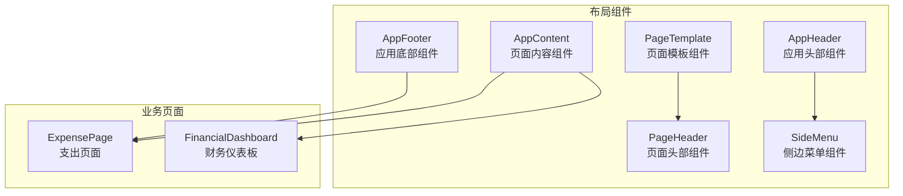
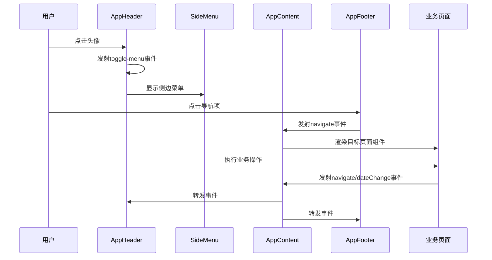
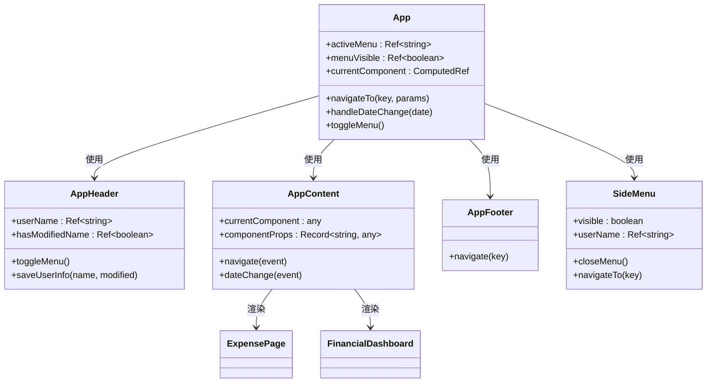
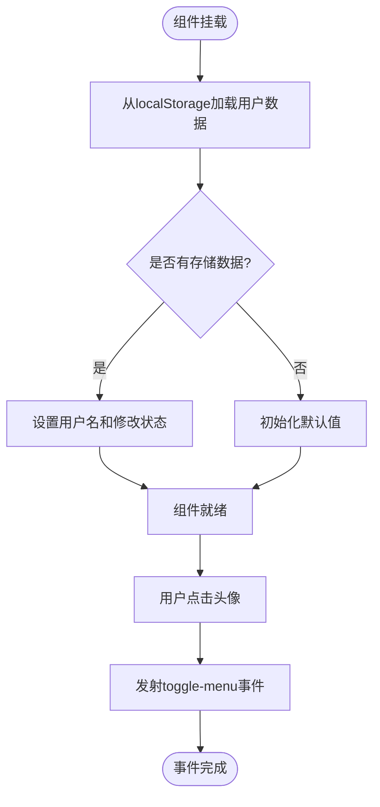
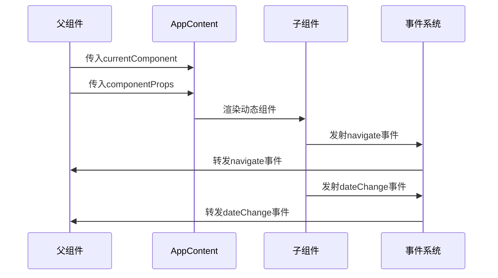
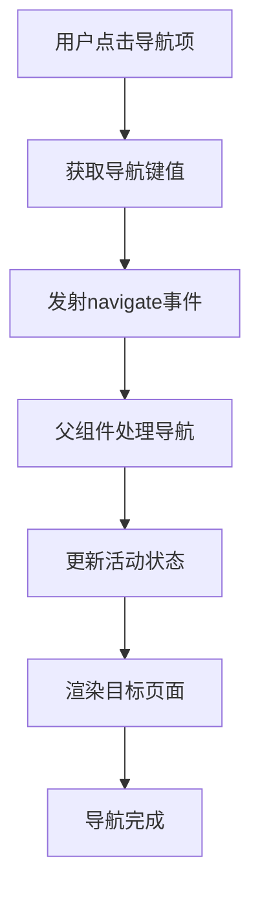
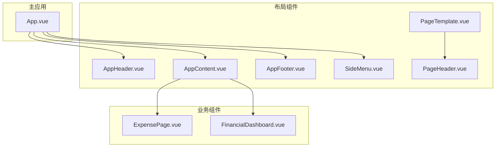
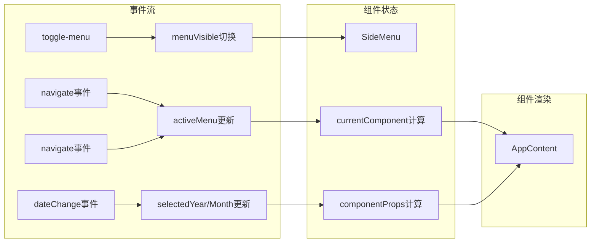

# 布局组件

<cite>
**本文档引用的文件**
- [App.vue](file://src/App.vue)
- [AppHeader.vue](file://src/components/common/AppHeader.vue)
- [AppContent.vue](file://src/components/common/AppContent.vue)
- [AppFooter.vue](file://src/components/common/AppFooter.vue)
- [PageTemplate.vue](file://src/components/common/PageTemplate.vue)
- [PageHeader.vue](file://src/components/common/PageHeader.vue)
- [SideMenu.vue](file://src/components/common/SideMenu.vue)
- [ExpensePage.vue](file://src/components/mobile/expense/ExpensePage.vue)
- [FinancialDashboard.vue](file://src/components/mobile/financial/FinancialDashboard.vue)
</cite>

## 目录
1. [简介](#简介)
2. [项目结构](#项目结构)
3. [核心组件](#核心组件)
4. [架构概览](#架构概览)
5. [详细组件分析](#详细组件分析)
6. [依赖关系分析](#依赖关系分析)
7. [性能考虑](#性能考虑)
8. [故障排除指南](#故障排除指南)
9. [结论](#结论)

## 简介

本文件详细介绍财务应用程序的布局组件系统，包括应用头部组件(AppHeader)、页面内容组件(AppContent)、应用底部组件(AppFooter)和页面模板组件(PageTemplate)的设计与实现。这些组件构成了应用程序的基础布局框架，提供了响应式设计、状态管理和事件处理等核心功能。

## 项目结构

财务应用程序采用模块化的组件架构，布局组件位于`src/components/common/`目录下，主要包含以下四个核心布局组件：

**图表来源**
- [App.vue:1-195](file://src/App.vue#L1-L195)
- [AppHeader.vue:1-135](file://src/components/common/AppHeader.vue#L1-L135)
- [AppContent.vue:1-51](file://src/components/common/AppContent.vue#L1-L51)
- [AppFooter.vue:1-98](file://src/components/common/AppFooter.vue#L1-L98)
- [PageTemplate.vue:1-103](file://src/components/common/PageTemplate.vue#L1-L103)

**章节来源**
- [App.vue:1-195](file://src/App.vue#L1-L195)
- [AppHeader.vue:1-135](file://src/components/common/AppHeader.vue#L1-L135)
- [AppContent.vue:1-51](file://src/components/common/AppContent.vue#L1-L51)
- [AppFooter.vue:1-98](file://src/components/common/AppFooter.vue#L1-L98)
- [PageTemplate.vue:1-103](file://src/components/common/PageTemplate.vue#L1-L103)

## 核心组件

### 应用头部组件(AppHeader)

应用头部组件负责显示用户头像、应用Logo和提供菜单切换功能。该组件实现了简洁的响应式设计，支持多种屏幕尺寸的自适应。

**主要特性：**
- 用户头像显示和点击交互
- 应用Logo展示
- 菜单切换事件发射
- 本地存储用户信息
- 响应式布局适配

**组件属性：**
- 无外部属性要求

**事件处理：**
- `toggle-menu`: 触发菜单显示/隐藏

**样式特点：**
- 蓝色背景(#409EFF)配白色文字
- 圆形头像边框设计
- Logo与标题的水平排列
- 移动端响应式字体大小调整

### 页面内容组件(AppContent)

页面内容组件作为动态内容容器，支持根据路由状态动态渲染不同的页面组件。

**主要功能：**
- 动态组件渲染
- 导航事件转发
- 日期变更事件处理
- 滚动区域管理
- 属性绑定传递

**组件属性：**
- `currentComponent`: 当前要渲染的组件
- `componentProps`: 传递给子组件的属性对象

**事件处理：**
- `navigate`: 页面导航事件
- `dateChange`: 日期变更事件

**样式设计：**
- 弹性布局占满剩余空间
- 自定义滚动条样式
- 内容区域内边距设置
- 响应式内边距调整

### 应用底部组件(AppFooter)

应用底部组件提供移动端友好的底部导航功能，包含五个主要导航项。

**导航选项：**
- 支出(Minus图标)
- 收入(Plus图标)
- 资产(TrendCharts图标)
- 负债(Warning图标)
- 更多(More图标)

**交互特性：**
- 悬停效果和颜色变化
- 图标与文本的垂直排列
- 响应式字体大小调整
- 导航事件发射

### 页面模板组件(PageTemplate)

页面模板组件提供标准的页面布局结构，包含页面头部、内容区域和确认按钮。

**模板结构：**
- PageHeader: 页面标题和返回按钮
- 插槽: 页面主要内容
- 确认按钮区域(可选)

**配置选项：**
- `title`: 页面标题文本
- `showConfirmButton`: 是否显示确认按钮
- `confirmText`: 确认按钮文本
- `confirmDisabled`: 确认按钮禁用状态

**事件处理：**
- `back`: 返回事件
- `confirm`: 确认事件

**章节来源**
- [AppHeader.vue:13-48](file://src/components/common/AppHeader.vue#L13-L48)
- [AppContent.vue:12-22](file://src/components/common/AppContent.vue#L12-L22)
- [AppFooter.vue:26-32](file://src/components/common/AppFooter.vue#L26-L32)
- [PageTemplate.vue:24-38](file://src/components/common/PageTemplate.vue#L24-L38)

## 架构概览

应用程序采用分层架构设计，布局组件作为基础层，业务组件作为功能层，通过事件驱动的方式实现组件间的通信。

**图表来源**
- [App.vue:4-18](file://src/App.vue#L4-L18)
- [AppHeader.vue:45-47](file://src/components/common/AppHeader.vue#L45-L47)
- [AppFooter.vue:3-23](file://src/components/common/AppFooter.vue#L3-L23)
- [AppContent.vue:3-8](file://src/components/common/AppContent.vue#L3-L8)

### 组件关系图

**图表来源**
- [App.vue:22-172](file://src/App.vue#L22-L172)
- [AppHeader.vue:13-48](file://src/components/common/AppHeader.vue#L13-L48)
- [AppContent.vue:12-22](file://src/components/common/AppContent.vue#L12-L22)
- [AppFooter.vue:26-32](file://src/components/common/AppFooter.vue#L26-L32)
- [SideMenu.vue:49-90](file://src/components/common/SideMenu.vue#L49-L90)

**章节来源**
- [App.vue:65-137](file://src/App.vue#L65-L137)
- [SideMenu.vue:49-90](file://src/components/common/SideMenu.vue#L49-L90)

## 详细组件分析

### AppHeader 组件深度分析

AppHeader 组件实现了简洁而功能完整的应用头部设计，具有以下关键特性：

#### 用户头像系统
- 支持点击交互触发菜单切换
- 使用圆形头像设计，带有蓝色边框
- 悬停时有轻微放大效果，提供视觉反馈

#### 应用标识系统
- 包含应用Logo和品牌名称
- Logo和标题采用水平排列布局
- 整体设计保持视觉平衡和一致性

#### 状态管理机制
- 使用 Vue 的 ref 和 onMounted 生命周期
- 通过 localStorage 实现用户信息持久化
- 支持用户名和修改状态的存储

#### 响应式设计实现
- 针对不同屏幕尺寸的字体大小调整
- 移动设备上的图标和文本尺寸优化
- 保持在小屏幕设备上的可读性和可用性

**图表来源**
- [AppHeader.vue:24-47](file://src/components/common/AppHeader.vue#L24-L47)

**章节来源**
- [AppHeader.vue:1-135](file://src/components/common/AppHeader.vue#L1-L135)

### AppContent 组件深度分析

AppContent 组件作为动态内容容器，提供了灵活的内容渲染机制：

#### 动态组件渲染
- 使用 Vue 的 `<component :is="">` 语法实现动态渲染
- 支持任意组件类型的传入和渲染
- 通过 v-bind 将属性对象传递给子组件

#### 事件冒泡机制
- 自动转发子组件发出的 navigate 事件
- 支持日期变更事件的传递
- 保持事件流的一致性和可预测性

#### 滚动区域优化
- 提供垂直滚动支持，隐藏原生滚动条
- 通过 CSS 属性实现自定义滚动条
- 保持内容区域的流畅滚动体验

#### 性能考虑
- 使用计算属性优化组件映射
- 合理的内存管理避免组件泄漏
- 事件处理的防抖和节流机制

**图表来源**
- [AppContent.vue:3-8](file://src/components/common/AppContent.vue#L3-L8)
- [App.vue:65-117](file://src/App.vue#L65-L117)

**章节来源**
- [AppContent.vue:1-51](file://src/components/common/AppContent.vue#L1-L51)

### AppFooter 组件深度分析

AppFooter 组件实现了移动端友好的底部导航系统：

#### 导航项设计
- 五个核心导航项覆盖主要功能区域
- 每个导航项包含图标和文本标签
- 垂直布局确保在小屏幕上的可访问性

#### 交互反馈系统
- 悬停效果提供视觉反馈
- 颜色变化增强用户体验
- 统一的动画过渡效果

#### 图标系统
- 使用 Element Plus 图标库
- 不同导航项对应不同语义的图标
- 图标大小和间距的精心调校

#### 响应式适配
- 针对不同屏幕尺寸的字体调整
- 保持导航项的均匀分布
- 优化触摸目标的大小和间距

**图表来源**
- [AppFooter.vue:3-23](file://src/components/common/AppFooter.vue#L3-L23)

**章节来源**
- [AppFooter.vue:1-98](file://src/components/common/AppFooter.vue#L1-L98)

### PageTemplate 组件深度分析

PageTemplate 组件提供了标准化的页面布局模板：

#### 结构化布局
- PageHeader 提供标准的页面头部
- 插槽区域支持自定义内容
- 可选的确认按钮区域

#### 页面头部组件
- 左侧返回按钮
- 中央页面标题
- 右侧占位符保持布局平衡

#### 确认按钮系统
- 可选显示控制
- 禁用状态管理
- 响应式按钮设计

#### 样式系统
- 分离的样式作用域
- 统一的颜色方案
- 一致的间距和排版

**章节来源**
- [PageTemplate.vue:1-103](file://src/components/common/PageTemplate.vue#L1-L103)
- [PageHeader.vue:1-57](file://src/components/common/PageHeader.vue#L1-L57)

## 依赖关系分析

### 组件依赖图

**图表来源**
- [App.vue:28-52](file://src/App.vue#L28-L52)
- [AppContent.vue:13-16](file://src/components/common/AppContent.vue#L13-L16)

### 事件依赖关系

**图表来源**
- [App.vue:119-143](file://src/App.vue#L119-L143)
- [App.vue:65-117](file://src/App.vue#L65-L117)

**章节来源**
- [App.vue:65-172](file://src/App.vue#L65-L172)

## 性能考虑

### 响应式设计优化

所有布局组件都实现了多层次的响应式设计：

- **断点策略**: 针对375px和320px两个关键断点进行优化
- **渐进式降级**: 从大屏幕到小屏幕的逐步适配
- **性能优先**: 避免复杂的媒体查询嵌套

### 内存管理

- **组件卸载**: 合理的生命周期管理避免内存泄漏
- **事件清理**: 及时移除事件监听器
- **状态重置**: 组件销毁时的状态清理

### 渲染优化

- **计算属性缓存**: 使用 computed 优化重复计算
- **条件渲染**: 通过 v-if 控制不必要的渲染
- **懒加载**: 大型组件的按需加载

## 故障排除指南

### 常见问题及解决方案

#### 头部组件不显示用户头像

**症状**: 头像图标无法正常显示
**原因**: 图片资源加载失败或网络问题
**解决方案**: 
- 检查图片URL的有效性
- 验证网络连接状态
- 添加图片加载失败的降级处理

#### 底部导航点击无响应

**症状**: 点击导航项没有反应
**原因**: 事件处理函数未正确绑定
**解决方案**:
- 检查 @click 事件绑定
- 验证 navigate 事件发射
- 确认父组件的事件监听

#### 内容区域滚动异常

**症状**: 页面滚动条显示或滚动行为异常
**原因**: 自定义滚动条样式冲突
**解决方案**:
- 检查 ::-webkit-scrollbar 样式
- 验证 -ms-overflow-style 属性
- 确认 scrollbar-width 属性设置

#### 响应式样式不生效

**症状**: 小屏幕设备上布局错乱
**原因**: 媒体查询断点设置不当
**解决方案**:
- 检查 @media 查询语法
- 验证断点值的合理性
- 确认样式的优先级顺序

**章节来源**
- [AppHeader.vue:100-134](file://src/components/common/AppHeader.vue#L100-L134)
- [AppFooter.vue:75-97](file://src/components/common/AppFooter.vue#L75-L97)
- [AppContent.vue:35-50](file://src/components/common/AppContent.vue#L35-L50)

## 结论

财务应用程序的布局组件系统展现了现代前端开发的最佳实践：

### 设计优势
- **模块化架构**: 清晰的组件职责分离
- **响应式设计**: 覆盖多种设备和屏幕尺寸
- **事件驱动**: 松耦合的组件通信机制
- **可扩展性**: 易于添加新功能和组件

### 技术亮点
- **TypeScript 集成**: 类型安全的组件开发
- **Vue 3 Composition API**: 现代化的组件编写方式
- **Element Plus 集成**: 丰富的UI组件库
- **ECharts 集成**: 强大的数据可视化能力

### 最佳实践建议
- **组件复用**: 在多个页面中复用布局组件
- **事件命名**: 保持事件命名的一致性和语义化
- **样式组织**: 使用 BEM 或类似方法组织CSS类名
- **性能监控**: 定期检查组件的渲染性能和内存使用

这些布局组件为财务应用程序提供了坚实的基础框架，支持未来的功能扩展和维护需求。