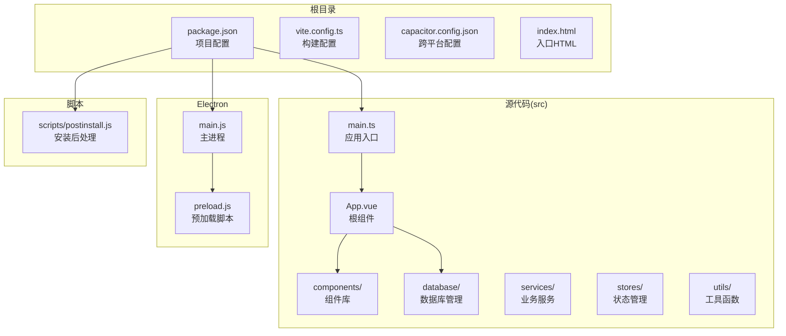
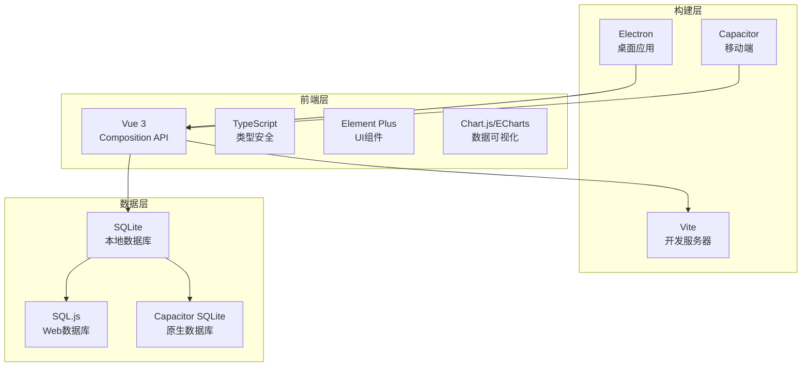
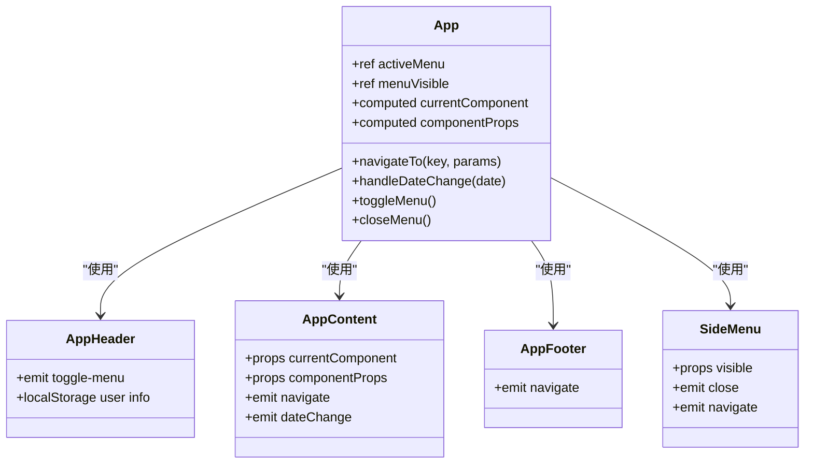
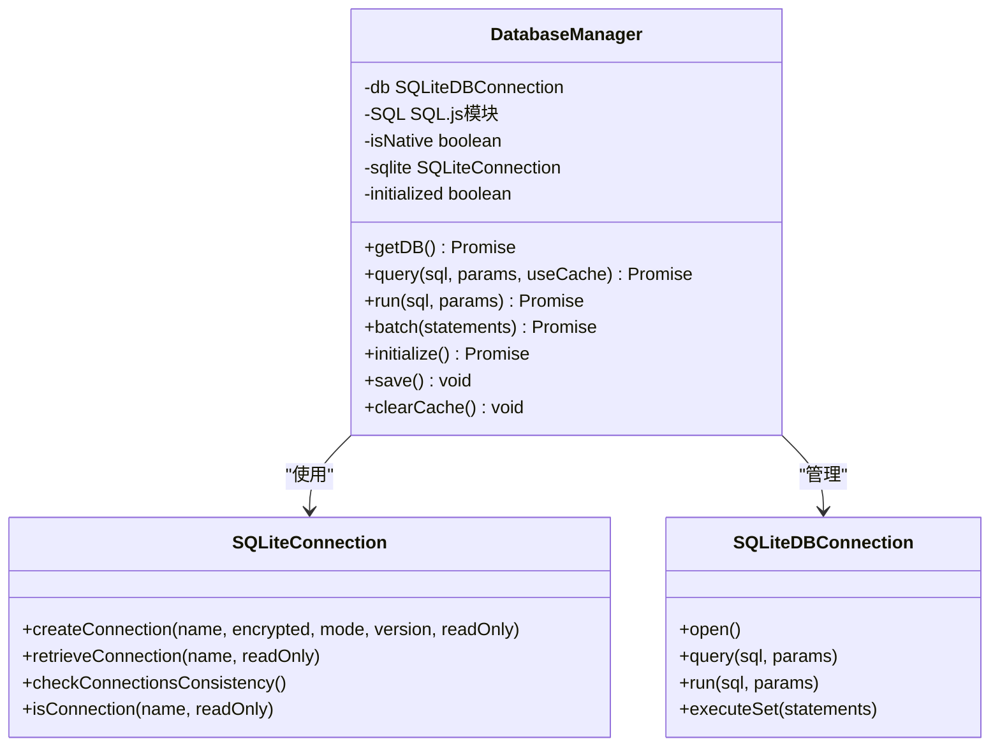
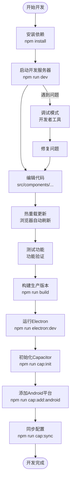
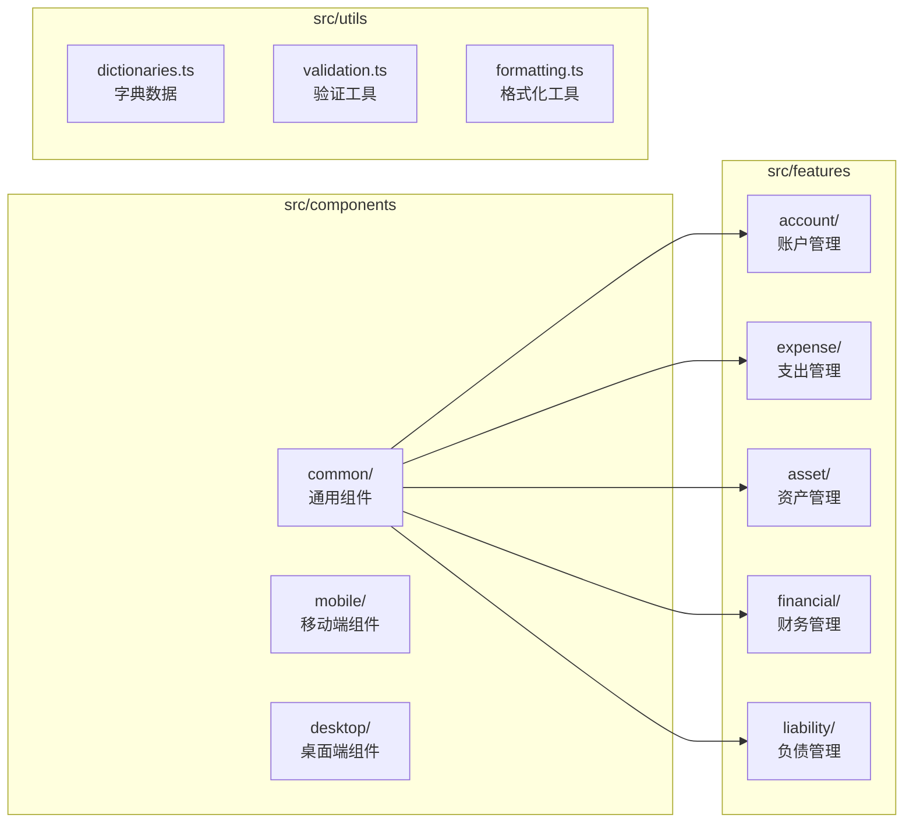
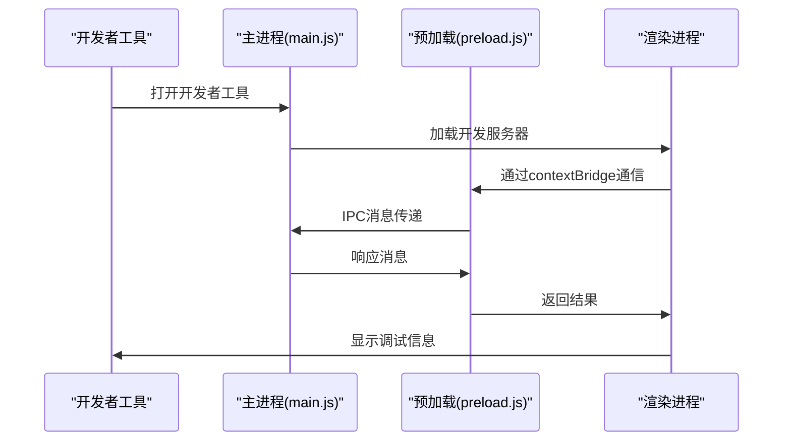

# 快速开始

<cite>
**本文引用的文件**
- [package.json](file://package.json)
- [capacitor.config.json](file://capacitor.config.json)
- [vite.config.ts](file://vite.config.ts)
- [electron/main.js](file://electron/main.js)
- [electron/preload.js](file://electron/preload.js)
- [scripts/postinstall.js](file://scripts/postinstall.js)
- [index.html](file://index.html)
- [src/main.ts](file://src/main.ts)
- [src/App.vue](file://src/App.vue)
- [src/components/common/AppHeader.vue](file://src/components/common/AppHeader.vue)
- [src/components/mobile/expense/ExpensePage.vue](file://src/components/mobile/expense/ExpensePage.vue)
- [src/database/index.js](file://src/database/index.js)
- [tsconfig.json](file://tsconfig.json)
- [tsconfig.node.json](file://tsconfig.node.json)
</cite>

## 目录
1. [简介](#简介)
2. [项目结构](#项目结构)
3. [系统要求](#系统要求)
4. [安装步骤](#安装步骤)
5. [开发服务器启动](#开发服务器启动)
6. [Electron桌面应用运行](#electron桌面应用运行)
7. [Capacitor跨平台初始化](#capacitor跨平台初始化)
8. [项目架构概览](#项目架构概览)
9. [核心组件分析](#核心组件分析)
10. [开发工作流程](#开发工作流程)
11. [调试技巧](#调试技巧)
12. [常见问题排查](#常见问题排查)
13. [总结](#总结)

## 简介

这是一个基于Vue 3构建的财务应用程序，支持多平台部署，包括Web浏览器、Electron桌面应用和Capacitor移动应用。项目采用现代化的技术栈，集成了数据库管理、图表展示、响应式设计等功能模块。

## 项目结构

项目采用模块化的目录结构，主要分为以下几个部分：



**图表来源**
- [package.json:1-72](file://package.json#L1-L72)
- [src/main.ts:1-16](file://src/main.ts#L1-L16)
- [electron/main.js:1-70](file://electron/main.js#L1-L70)

**章节来源**
- [package.json:1-72](file://package.json#L1-L72)
- [src/main.ts:1-16](file://src/main.ts#L1-L16)
- [electron/main.js:1-70](file://electron/main.js#L1-L70)

## 系统要求

在开始之前，请确保您的开发环境满足以下要求：

### Node.js环境
- **Node.js版本**: 16.x 或更高版本
- **包管理器**: npm 8.x 或 yarn 1.x
- **操作系统**: Windows、macOS 或 Linux

### 开发工具
- **IDE**: VS Code 或其他支持TypeScript的编辑器
- **浏览器**: Chrome 90+ 或 Firefox 88+
- **Git**: 2.20+

### 移动开发环境（可选）
- **Android Studio**: Android SDK 21+
- **JDK**: Java 17
- **Gradle**: 7.0+

**章节来源**
- [package.json:37-47](file://package.json#L37-L47)
- [capacitor.config.json:14-21](file://capacitor.config.json#L14-L21)

## 安装步骤

### 1. 克隆项目
```bash
git clone <repository-url>
cd finance_app
```

### 2. 安装依赖
```bash
npm install
```

**注意**: 项目使用了自定义的安装后处理脚本，会在安装完成后自动修改Android构建配置。

### 3. 验证安装
```bash
npm run dev
```

如果一切正常，您应该能看到开发服务器启动并打开浏览器窗口。

**章节来源**
- [package.json:7-17](file://package.json#L7-L17)
- [scripts/postinstall.js:1-145](file://scripts/postinstall.js#L1-L145)

## 开发服务器启动

### 启动开发服务器
```bash
npm run dev
```

开发服务器特性：
- **端口**: 默认使用Vite的开发端口
- **热重载**: 支持代码更改自动刷新
- **TypeScript支持**: 直接编译TypeScript文件
- **Vue SFC支持**: 单文件组件热重载

### 构建生产版本
```bash
npm run build
```

构建输出位于 `dist/` 目录，包含优化后的静态资源。

**章节来源**
- [package.json:8-10](file://package.json#L8-L10)
- [vite.config.ts:1-11](file://vite.config.ts#L1-L11)

## Electron桌面应用运行

### 同时启动前端和Electron
```bash
npm run electron:dev
```

这个命令会同时启动：
1. Vite开发服务器（前端）
2. Electron主进程（桌面应用）

### 独立运行Electron
```bash
npm run electron:dev
```

Electron特性：
- **窗口尺寸**: 1200x800像素
- **开发工具**: 自动打开开发者工具
- **预加载脚本**: 提供安全的IPC通信接口
- **原生平台检测**: 自动识别运行环境

### 构建Electron应用
```bash
npm run electron:build
```

支持的平台：
- **Windows**: NSIS安装程序和便携版
- **macOS**: DMG磁盘映像
- **Linux**: AppImage

**章节来源**
- [package.json:11-12](file://package.json#L11-L12)
- [electron/main.js:19-45](file://electron/main.js#L19-L45)
- [electron/preload.js:1-7](file://electron/preload.js#L1-L7)

## Capacitor跨平台初始化

### 初始化Capacitor项目
```bash
npm run cap:init
```

这会创建Capacitor配置文件并设置基础结构。

### 添加Android平台
```bash
npm run cap:add:android
```

此命令会：
- 添加Android平台支持
- 自动修改构建配置以兼容Java 17
- 处理SQLite插件的命名空间问题

### 同步配置
```bash
npm run cap:sync
```

同步过程包括：
1. 更新Web构建产物
2. 执行安装后处理脚本
3. 修复Android构建配置

### 打开Android项目
```bash
npm run cap:open:android
```

打开Android Studio进行原生开发。

**章节来源**
- [package.json:13-16](file://package.json#L13-L16)
- [capacitor.config.json:1-23](file://capacitor.config.json#L1-L23)
- [scripts/postinstall.js:1-145](file://scripts/postinstall.js#L1-L145)

## 项目架构概览

### 技术栈
项目采用现代化的全栈技术架构：



**图表来源**
- [package.json:19-36](file://package.json#L19-L36)
- [src/database/index.js:1-800](file://src/database/index.js#L1-L800)

### 核心架构特点
- **统一代码库**: 同一套Vue代码同时支持Web、Electron和移动平台
- **数据库抽象**: 通过适配器模式支持多种数据库后端
- **模块化设计**: 清晰的功能模块划分
- **响应式UI**: 基于Vue 3的响应式组件系统

**章节来源**
- [src/App.vue:1-195](file://src/App.vue#L1-L195)
- [src/database/index.js:21-32](file://src/database/index.js#L21-L32)

## 核心组件分析

### 应用入口组件



**图表来源**
- [src/App.vue:22-172](file://src/App.vue#L22-L172)
- [src/components/common/AppHeader.vue:13-47](file://src/components/common/AppHeader.vue#L13-L47)

### 数据库管理系统



**图表来源**
- [src/database/index.js:21-800](file://src/database/index.js#L21-L800)

**章节来源**
- [src/App.vue:33-89](file://src/App.vue#L33-L89)
- [src/database/index.js:21-800](file://src/database/index.js#L21-L800)

## 开发工作流程

### 日常开发流程



### 项目文件组织



**章节来源**
- [src/App.vue:33-89](file://src/App.vue#L33-L89)
- [src/components/common/AppHeader.vue:1-135](file://src/components/common/AppHeader.vue#L1-L135)

## 调试技巧

### 开发者工具使用

#### 浏览器调试
1. **Vue DevTools**: 安装Vue浏览器扩展
2. **网络面板**: 监控API请求和数据库操作
3. **应用面板**: 查看localStorage中的数据库状态

#### Electron调试


**图表来源**
- [electron/main.js:31-39](file://electron/main.js#L31-L39)
- [electron/preload.js:1-7](file://electron/preload.js#L1-L7)

#### 数据库调试
1. **SQLite浏览器**: 使用DB Browser for SQLite查看数据库
2. **localStorage检查**: 在浏览器控制台查看数据库导出
3. **日志输出**: 启用DEBUG模式查看更多详细信息

### 常用调试命令

```bash
# 启用详细日志
NODE_ENV=development npm run dev

# Electron开发模式
npm run electron:dev

# Capacitor调试
npm run cap:open:android
```

**章节来源**
- [src/database/index.js:12-18](file://src/database/index.js#L12-L18)
- [electron/main.js:31-39](file://electron/main.js#L31-L39)

## 常见问题排查

### 安装问题

#### 依赖安装失败
```bash
# 清理缓存
npm cache clean --force

# 删除node_modules重新安装
rm -rf node_modules package-lock.json
npm install

# 使用pnpm替代npm
pnpm install
```

#### Java版本问题
```bash
# 检查Java版本
java -version

# 设置JAVA_HOME环境变量
# Windows: set JAVA_HOME=C:\Program Files\Java\jdk-17
# macOS: export JAVA_HOME=/Library/Java/JavaVirtualMachines/jdk-17.jdk/Contents/Home
# Linux: export JAVA_HOME=/usr/lib/jvm/java-17-openjdk
```

### 运行问题

#### 开发服务器无法启动
```bash
# 检查端口占用
netstat -ano | findstr :5173

# 更换端口
set PORT=3000
npm run dev
```

#### Electron窗口空白
```bash
# 检查控制台错误
npm run electron:dev

# 验证入口文件
cat index.html
```

#### Capacitor构建失败
```bash
# 清理Capacitor缓存
npx cap clean android

# 重新初始化
npx cap init

# 重新添加平台
npx cap add android
```

### 数据库问题

#### 数据库连接失败
```javascript
// 检查数据库状态
const db = new DatabaseManager();
await db.getDB();

// 查看错误日志
// 在浏览器控制台查看详细错误信息
```

#### 数据持久化问题
```bash
# 检查localStorage
localStorage.getItem('sqlite_finance-app-db');

# 清理数据库缓存
localStorage.removeItem('sqlite_finance-app-db');
```

**章节来源**
- [scripts/postinstall.js:40-145](file://scripts/postinstall.js#L40-L145)
- [src/database/index.js:149-178](file://src/database/index.js#L149-L178)

## 总结

这个财务应用程序提供了完整的多平台开发解决方案，具有以下优势：

### 快速上手能力
- **30分钟启动**: 按照本指南操作，您可以在30分钟内成功运行项目
- **零配置**: 大多数配置已经预设，开箱即用
- **多平台支持**: 同一套代码支持Web、Electron和移动应用

### 技术优势
- **现代化技术栈**: Vue 3 + TypeScript + Vite
- **数据库抽象**: 统一的数据访问层
- **响应式设计**: 适配各种设备屏幕
- **开发体验**: 热重载、类型检查、代码提示

### 扩展性
- **模块化架构**: 易于添加新功能模块
- **插件系统**: 支持第三方库集成
- **构建优化**: 生产环境自动优化

建议新手开发者按照"安装步骤" → "开发服务器启动" → "Electron运行" → "Capacitor初始化"的顺序逐步学习，每个步骤都有详细的说明和故障排除指导。