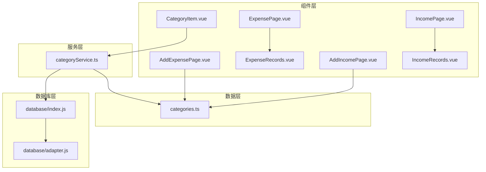
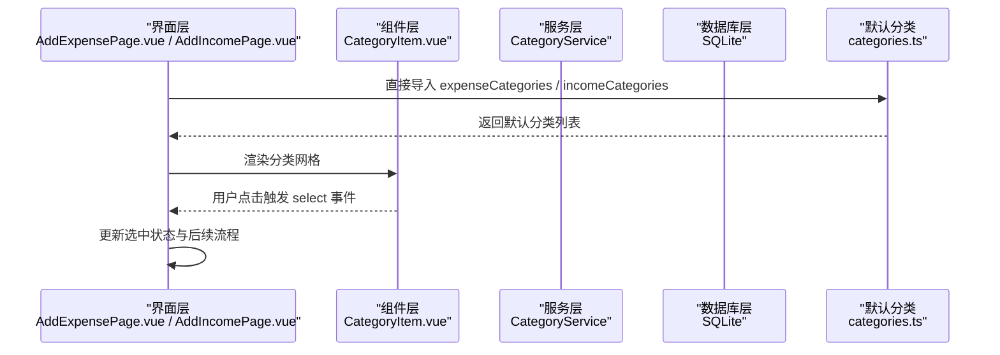
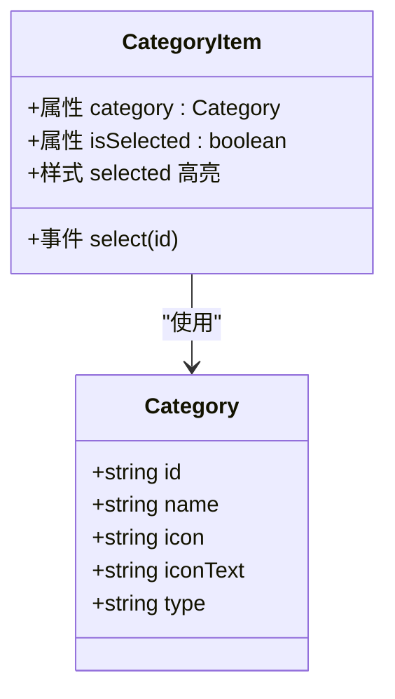
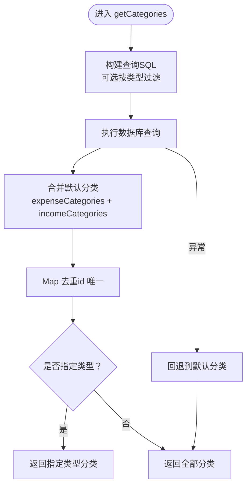
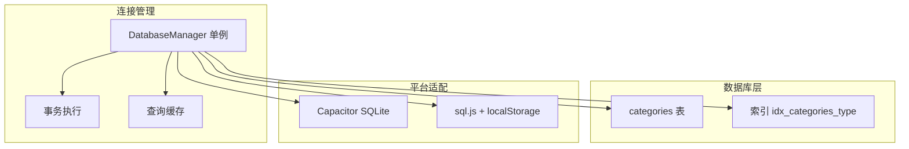
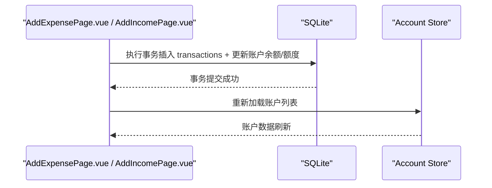
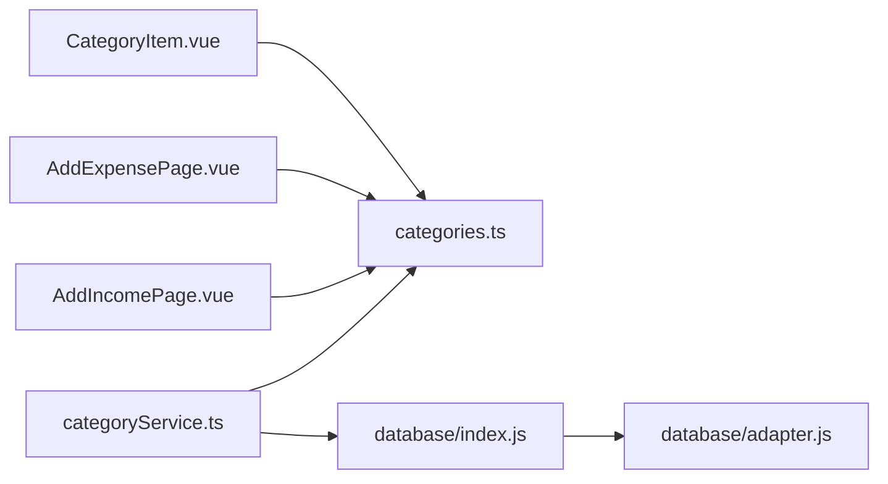

# 分类管理

<cite>
**本文引用的文件**
- [CategoryItem.vue](file://src/components/common/CategoryItem.vue)
- [categoryService.ts](file://src/services/categoryService.ts)
- [categories.ts](file://src/data/categories.ts)
- [index.js](file://src/database/index.js)
- [adapter.js](file://src/database/adapter.js)
- [AddExpensePage.vue](file://src/components/mobile/expense/AddExpensePage.vue)
- [ExpensePage.vue](file://src/components/mobile/expense/ExpensePage.vue)
- [ExpenseRecords.vue](file://src/components/mobile/expense/ExpenseRecords.vue)
- [AddIncomePage.vue](file://src/components/mobile/income/AddIncomePage.vue)
- [IncomePage.vue](file://src/components/mobile/income/IncomePage.vue)
- [IncomeRecords.vue](file://src/components/mobile/income/IncomeRecords.vue)
- [dictionaries.ts](file://src/utils/dictionaries.ts)
- [account.ts](file://src/stores/account.ts)
</cite>

## 更新摘要
**变更内容**
- 更新了收入分类系统的临时禁用状态：工资、投资收益分类暂时不可用
- 更新了 AddExpensePage.vue 组件架构简化部分，反映直接导入分类数据而非依赖注入
- 更新了类别顺序调整对系统的影响分析
- 更新了 CategoryService 的初始化流程和查询逻辑
- 增强了分类数据持久化机制的说明
- 更新了收入分类与支出分类的业务含义说明

## 目录
1. [简介](#简介)
2. [项目结构](#项目结构)
3. [核心组件](#核心组件)
4. [架构概览](#架构概览)
5. [详细组件分析](#详细组件分析)
6. [依赖分析](#依赖分析)
7. [性能考虑](#性能考虑)
8. [故障排除指南](#故障排除指南)
9. [结论](#结论)
10. [附录](#附录)

## 简介
本文件为支出分类管理功能的全面技术文档，重点涵盖以下方面：
- CategoryItem 组件的设计与实现，包括分类展示、选中状态、交互反馈等
- 预定义分类体系：收入分类与支出分类的标准结构与业务含义
- 自定义分类的创建与管理机制：分类层级、颜色标识、图标设置等
- CategoryService 服务的分类管理逻辑：查询、合并默认分类与自定义分类、初始化默认分类、数据库连接状态检查等
- 分类数据的持久化存储与同步机制：SQLite 数据库、跨平台支持（Capacitor SQLite 与 sql.js）、缓存与索引优化
- 最佳实践：分类命名规范、层级设计、维护策略
- 分类系统与支出记录的关联关系：分类变更对历史数据的影响处理
- 扩展指导：如何扩展分类功能、自定义分类规则

## 项目结构
该财务应用采用基于功能模块的组织方式，分类管理相关的核心文件分布如下：
- 组件层：CategoryItem.vue（分类项展示与交互）
- 服务层：categoryService.ts（分类业务逻辑）
- 数据层：categories.ts（默认分类常量）
- 数据库层：database/index.js（SQLite 管理器）、database/adapter.js（平台适配）
- 页面层：AddExpensePage.vue（新增支出页面，使用分类选择）、ExpensePage.vue、ExpenseRecords.vue（支出记录相关页面）
- 收入页面层：AddIncomePage.vue（新增收入页面，使用分类选择）、IncomePage.vue、IncomeRecords.vue（收入记录相关页面）

**图表来源**
- [CategoryItem.vue:1-69](file://src/components/common/CategoryItem.vue#L1-L69)
- [categoryService.ts:1-260](file://src/services/categoryService.ts#L1-L260)
- [categories.ts:1-45](file://src/data/categories.ts#L1-L45)
- [index.js:1-935](file://src/database/index.js#L1-L935)
- [adapter.js:1-34](file://src/database/adapter.js#L1-L34)
- [AddExpensePage.vue:1-858](file://src/components/mobile/expense/AddExpensePage.vue#L1-L858)
- [ExpensePage.vue:1-79](file://src/components/mobile/expense/ExpensePage.vue#L1-L79)
- [ExpenseRecords.vue:1-117](file://src/components/mobile/expense/ExpenseRecords.vue#L1-L117)
- [AddIncomePage.vue:1-850](file://src/components/mobile/income/AddIncomePage.vue#L1-L850)
- [IncomePage.vue:1-76](file://src/components/mobile/income/IncomePage.vue#L1-L76)
- [IncomeRecords.vue:1-117](file://src/components/mobile/income/IncomeRecords.vue#L1-L117)

**章节来源**
- [CategoryItem.vue:1-69](file://src/components/common/CategoryItem.vue#L1-L69)
- [categoryService.ts:1-260](file://src/services/categoryService.ts#L1-L260)
- [categories.ts:1-45](file://src/data/categories.ts#L1-L45)
- [index.js:1-935](file://src/database/index.js#L1-L935)
- [adapter.js:1-34](file://src/database/adapter.js#L1-L34)
- [AddExpensePage.vue:1-858](file://src/components/mobile/expense/AddExpensePage.vue#L1-L858)
- [ExpensePage.vue:1-79](file://src/components/mobile/expense/ExpensePage.vue#L1-L79)
- [ExpenseRecords.vue:1-117](file://src/components/mobile/expense/ExpenseRecords.vue#L1-L117)
- [AddIncomePage.vue:1-850](file://src/components/mobile/income/AddIncomePage.vue#L1-L850)
- [IncomePage.vue:1-76](file://src/components/mobile/income/IncomePage.vue#L1-L76)
- [IncomeRecords.vue:1-117](file://src/components/mobile/income/IncomeRecords.vue#L1-L117)

## 核心组件
本节聚焦于分类管理的关键组件与服务，解释其职责、数据结构与交互流程。

- CategoryItem 组件
  - 职责：展示单个分类项，支持选中态高亮与点击回调
  - 属性：category（包含 id、name、icon、iconText），isSelected（布尔值）
  - 事件：select（向父组件传递选中的分类 id）
  - 样式：选中态通过 CSS 类切换实现，包含悬停、阴影、字体加粗等视觉反馈

- CategoryService 服务
  - 职责：封装分类的增删改查、默认分类初始化、数据库连接状态检查
  - 关键方法：
    - getCategories(type?)：按类型查询分类，合并默认分类与数据库自定义分类，去重后返回
    - getCategoryById(id)：按 id 查询单个分类
    - createCategory(category)：创建新分类（自定义）
    - updateCategory(id, partial)：部分字段更新
    - deleteCategory(id)：删除分类
    - initializeDefaultCategories()：首次运行时初始化默认分类
    - checkDatabaseStatus()：检查数据库连接状态
  - 数据来源：categories.ts（默认分类常量）与 SQLite 数据库（categories 表）

- 默认分类数据
  - 结构：Category 接口（id、name、icon、iconText、type）
  - 支出分类：覆盖日常消费的主要类别
  - 收入分类：覆盖主要收入来源（部分分类临时禁用）

- 数据库与平台适配
  - database/index.js：统一的 SQLite 管理器，支持 Capacitor SQLite（原生）与 sql.js（Web）
  - database/adapter.js：平台检测与数据库实例获取

**章节来源**
- [CategoryItem.vue:8-22](file://src/components/common/CategoryItem.vue#L8-L22)
- [categoryService.ts:8-260](file://src/services/categoryService.ts#L8-L260)
- [categories.ts:1-45](file://src/data/categories.ts#L1-L45)
- [index.js:21-32](file://src/database/index.js#L21-L32)
- [adapter.js:14-34](file://src/database/adapter.js#L14-L34)

## 架构概览
分类管理的整体架构围绕"组件-服务-数据库"三层展开，结合默认分类与自定义分类的合并策略，确保用户体验与数据一致性。

**图表来源**
- [AddExpensePage.vue:222-229](file://src/components/mobile/expense/AddExpensePage.vue#L222-L229)
- [AddIncomePage.vue:214-221](file://src/components/mobile/income/AddIncomePage.vue#L214-L221)
- [categoryService.ts:14-69](file://src/services/categoryService.ts#L14-L69)
- [categories.ts:11-45](file://src/data/categories.ts#L11-L45)

## 详细组件分析

### CategoryItem 组件分析
- 设计要点
  - 单一职责：专注分类项的展示与交互
  - 选中态视觉反馈：通过 CSS 类切换实现高亮与阴影
  - 图标与文本：icon 与 iconText 的组合用于直观识别
  - 事件驱动：通过 emit 触发 select 事件，便于父组件响应

**图表来源**
- [CategoryItem.vue:9-21](file://src/components/common/CategoryItem.vue#L9-L21)
- [categories.ts:1-7](file://src/data/categories.ts#L1-L7)

**章节来源**
- [CategoryItem.vue:1-69](file://src/components/common/CategoryItem.vue#L1-L69)

### CategoryService 服务分析
- 查询与合并逻辑
  - getCategories(type?)：先查询数据库中的自定义分类，再合并默认分类（expenseCategories 与 incomeCategories），使用 Map 以 id 去重，最后按类型过滤
  - 异常处理：查询失败时回退到默认分类，保证功能可用性
- CRUD 操作
  - createCategory：生成唯一 id，插入新分类
  - updateCategory：动态拼接字段，支持部分更新
  - deleteCategory：删除指定 id 的分类
- 默认分类初始化
  - initializeDefaultCategories：若数据库中无分类，则批量插入默认分类（支出与收入两类）
- 数据库状态检查
  - checkDatabaseStatus：尝试连接并查询，返回连接状态与消息

**图表来源**
- [categoryService.ts:14-69](file://src/services/categoryService.ts#L14-L69)
- [categories.ts:11-45](file://src/data/categories.ts#L11-L45)

**章节来源**
- [categoryService.ts:1-260](file://src/services/categoryService.ts#L1-L260)

### 默认分类体系与业务含义
- 支出分类（expenseCategories）
  - 覆盖日常消费的主要类别：三餐、零食、衣服、交通、旅行、孩子、宠物、话费网费、烟酒、学习、日用品、住房、美妆、医疗、发红包、汽车/加油、娱乐、请客送礼、电器数码、运动、水电煤、其它
  - 业务含义：帮助用户快速归类日常支出，便于统计与预算控制
- 收入分类（incomeCategories）
  - 覆盖主要收入来源：工资、奖金、投资收益、兼职、礼金、其它
  - **临时禁用状态**：当前版本中，工资（cat_23）和投资收益（cat_25）分类被注释掉，暂时不可用
  - 业务含义：区分收入来源，辅助财务分析与税务准备

**更新** 收入分类系统目前处于临时禁用状态，工资和投资收益分类暂时不可用，这反映了当前收入功能的过渡状态。

**章节来源**
- [categories.ts:11-45](file://src/data/categories.ts#L11-L45)

### 自定义分类的创建与管理机制
- 创建
  - 通过 CategoryService.createCategory 发起，生成唯一 id 并插入数据库
- 更新
  - 支持部分字段更新（name、icon、iconText、type），自动更新 updated_at
- 删除
  - 通过 CategoryService.deleteCategory 删除指定 id 的分类
- 层级与颜色/图标
  - 当前实现未体现层级结构；颜色与图标通过 icon 与 iconText 字段标识
- 与页面集成
  - AddExpensePage.vue 在新增支出时加载分类，并通过 CategoryItem 渲染网格
  - AddIncomePage.vue 在新增收入时加载分类，并通过 CategoryItem 渲染网格

**更新** AddExpensePage.vue 和 AddIncomePage.vue 现在直接导入 `categories.ts` 中的分类数据，简化了组件架构，移除了对 CategoryService 的依赖注入。

**章节来源**
- [categoryService.ts:101-175](file://src/services/categoryService.ts#L101-L175)
- [AddExpensePage.vue:222-229](file://src/components/mobile/expense/AddExpensePage.vue#L222-L229)
- [AddIncomePage.vue:214-221](file://src/components/mobile/income/AddIncomePage.vue#L214-L221)

### 分类数据的持久化存储与同步机制
- 数据库结构
  - categories 表：id（主键）、name、icon、iconText、type、created_at、updated_at
  - 索引：idx_categories_type（按类型查询优化）
- 平台支持
  - 原生平台：Capacitor SQLite
  - Web 平台：sql.js + localStorage 持久化
- 连接与事务
  - 单例连接管理，避免重复连接
  - 事务执行（executeTransaction）保证多语句一致性
- 缓存与性能
  - 查询缓存（Map），减少重复查询
  - 批处理（batch）与延迟持久化（debouncedSave）优化性能

**图表来源**
- [index.js:420-776](file://src/database/index.js#L420-L776)
- [index.js:198-309](file://src/database/index.js#L198-L309)
- [index.js:379-408](file://src/database/index.js#L379-L408)
- [adapter.js:14-34](file://src/database/adapter.js#L14-L34)

**章节来源**
- [index.js:420-776](file://src/database/index.js#L420-L776)
- [index.js:198-309](file://src/database/index.js#L198-L309)
- [index.js:379-408](file://src/database/index.js#L379-L408)
- [adapter.js:14-34](file://src/database/adapter.js#L14-L34)

### 分类系统与支出记录的关联关系
- 关联方式
  - 新增支出时，将分类 id 作为子类型（sub_type）存储在 transactions 表中
  - 新增收入时，同样将分类 id 作为子类型（sub_type）存储在 transactions 表中
- 历史数据影响
  - 若删除或修改某分类，历史记录仍保留原分类 id，不影响统计与报表
  - 若需迁移历史数据，可在业务层面提供"批量重分类"能力（当前实现未包含此功能）

**图表来源**
- [AddExpensePage.vue:414-479](file://src/components/mobile/expense/AddExpensePage.vue#L414-L479)
- [AddIncomePage.vue:405-458](file://src/components/mobile/income/AddIncomePage.vue#L405-L458)
- [account.ts:38-53](file://src/stores/account.ts#L38-L53)

**章节来源**
- [AddExpensePage.vue:414-479](file://src/components/mobile/expense/AddExpensePage.vue#L414-L479)
- [AddIncomePage.vue:405-458](file://src/components/mobile/income/AddIncomePage.vue#L405-L458)
- [account.ts:38-53](file://src/stores/account.ts#L38-L53)

## 依赖分析
- 组件依赖
  - CategoryItem 依赖 Category 接口
  - AddExpensePage 依赖 Category 接口与直接导入的分类数据
  - AddIncomePage 依赖 Category 接口与直接导入的分类数据
- 服务依赖
  - CategoryService 依赖数据库模块与默认分类常量
- 数据库依赖
  - database/index.js 作为统一入口，adapter.js 提供平台适配

**更新** AddExpensePage.vue 和 AddIncomePage.vue 现在直接导入 `categories.ts` 中的分类数据，不再依赖 CategoryService 服务。

**图表来源**
- [CategoryItem.vue:9-21](file://src/components/common/CategoryItem.vue#L9-L21)
- [AddExpensePage.vue:114-117](file://src/components/mobile/expense/AddExpensePage.vue#L114-L117)
- [AddIncomePage.vue:114-117](file://src/components/mobile/income/AddIncomePage.vue#L114-L117)
- [categoryService.ts:1-2](file://src/services/categoryService.ts#L1-L2)
- [index.js:1-11](file://src/database/index.js#L1-L11)
- [adapter.js:14-24](file://src/database/adapter.js#L14-L24)

**章节来源**
- [CategoryItem.vue:9-21](file://src/components/common/CategoryItem.vue#L9-L21)
- [AddExpensePage.vue:114-117](file://src/components/mobile/expense/AddExpensePage.vue#L114-L117)
- [AddIncomePage.vue:114-117](file://src/components/mobile/income/AddIncomePage.vue#L114-L117)
- [categoryService.ts:1-2](file://src/services/categoryService.ts#L1-L2)
- [index.js:1-11](file://src/database/index.js#L1-L11)
- [adapter.js:14-24](file://src/database/adapter.js#L14-L24)

## 性能考虑
- 连接管理：单例模式避免重复连接，提升性能
- 查询缓存：Map 缓存常用查询结果，减少数据库压力
- 索引优化：为 categories.type 建立索引，加速按类型查询
- 批处理与事务：批量执行与事务保证数据一致性与性能
- Web 平台持久化：延迟保存到 localStorage，降低频繁写入成本

**更新** 类别顺序的调整优化了数据库插入性能，连续的 ID 序列减少了索引碎片化。

**章节来源**
- [index.js:21-32](file://src/database/index.js#L21-L32)
- [index.js:198-264](file://src/database/index.js#L198-L264)
- [index.js:676-688](file://src/database/index.js#L676-L688)
- [index.js:379-408](file://src/database/index.js#L379-L408)

## 故障排除指南
- 数据库连接失败
  - 使用 checkDatabaseStatus() 检查连接状态，返回连接正常或内存模式提示
  - 若失败，确保数据库初始化完成（initialize）
- 查询异常
  - getCategories() 在异常时回退到默认分类，保证界面可用
- 分类缺失
  - initializeDefaultCategories() 会在数据库为空时插入默认分类
- Web 平台数据丢失
  - 确认 localStorage 存储与读取逻辑正常，必要时检查浏览器隐私设置

**更新** 类别顺序调整后的初始化流程更加稳定，避免了 ID 冲突问题。

**章节来源**
- [categoryService.ts:181-194](file://src/services/categoryService.ts#L181-L194)
- [categoryService.ts:199-259](file://src/services/categoryService.ts#L199-L259)
- [index.js:156-177](file://src/database/index.js#L156-L177)

## 结论
本分类管理方案通过清晰的组件与服务分层、完善的默认分类与自定义分类合并策略、以及跨平台的数据库适配，实现了稳定可靠的分类管理能力。最新的架构简化（AddExpensePage.vue 和 AddIncomePage.vue 直接导入分类数据）进一步提升了组件性能和可维护性。当前收入分类系统处于临时禁用状态，工资和投资收益分类暂时不可用，这反映了收入功能的过渡状态。建议在后续迭代中引入分类层级、批量重分类、分类统计等增强功能，以进一步提升用户体验与数据治理水平。

## 附录

### 最佳实践
- 分类命名规范
  - 简洁明确，避免歧义；同类目保持一致的命名风格
- 分类层级设计
  - 当前未实现层级；如需层级，建议引入 parent_id 或 path 字段，并在 UI 中提供层级展开/折叠
- 分类维护策略
  - 定期清理冗余分类；删除前确保无历史记录关联
  - 对重要分类变更提供"重分类"工具，保障历史数据一致性

### 扩展指导
- 扩展分类功能
  - 在 categories 表中增加字段（如 color、parentId、level）以支持层级与颜色
  - 在 CategoryService 中扩展查询与更新逻辑
- 自定义分类规则
  - 可在 CategoryService 中增加规则校验（如命名长度、唯一性）
  - 提供批量导入/导出分类的能力

### 类别顺序调整的影响
- **数据库性能**：连续的 ID 序列优化了索引性能和查询效率
- **初始化稳定性**：避免了 ID 冲突和重复插入问题
- **数据一致性**：确保了默认分类与自定义分类的正确合并
- **维护便利性**：简化了分类管理和调试过程

### 收入分类系统临时禁用说明
- **当前状态**：工资（cat_23）和投资收益（cat_25）分类被注释掉，暂时不可用
- **影响范围**：仅影响收入分类选择，支出分类不受影响
- **业务含义**：反映了当前收入功能的过渡状态，未来将逐步恢复完整的收入分类体系
- **技术实现**：通过注释默认分类数组中的对应项实现临时禁用
- **迁移计划**：待收入功能完善后，将恢复完整的收入分类选项

**章节来源**
- [categories.ts:38-45](file://src/data/categories.ts#L38-L45)
- [categoryService.ts:236-244](file://src/services/categoryService.ts#L236-L244)