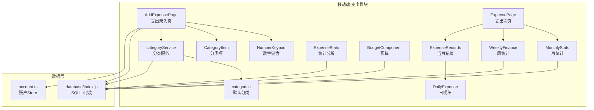
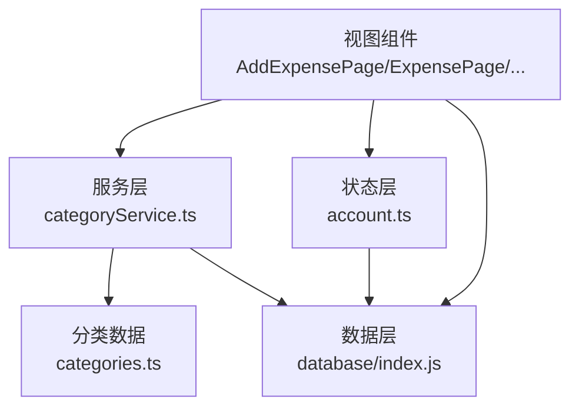
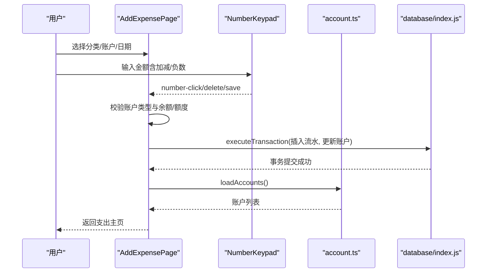
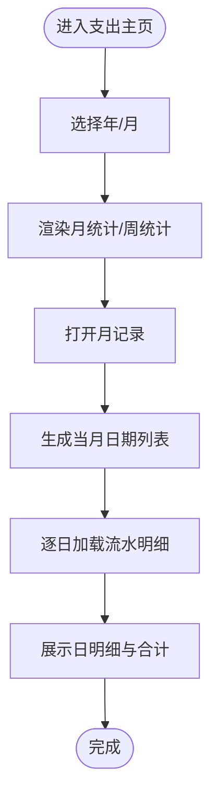
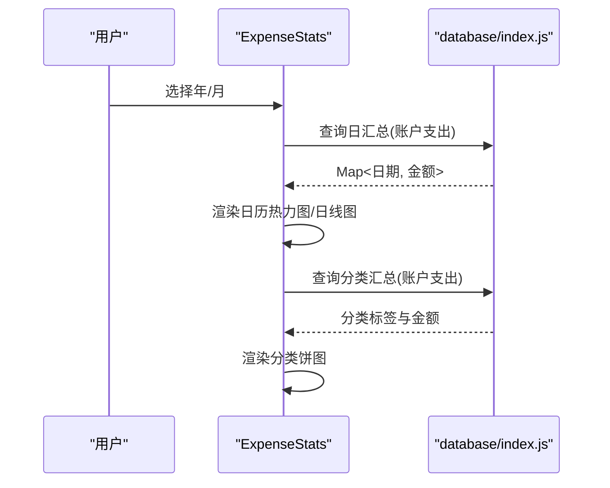
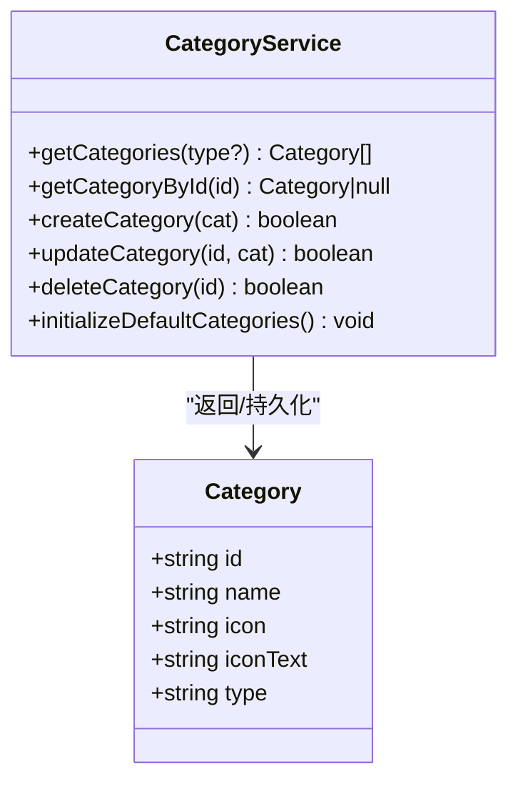
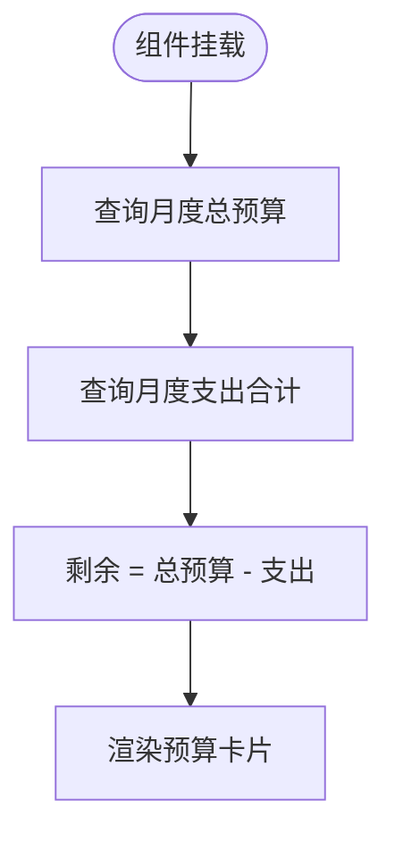
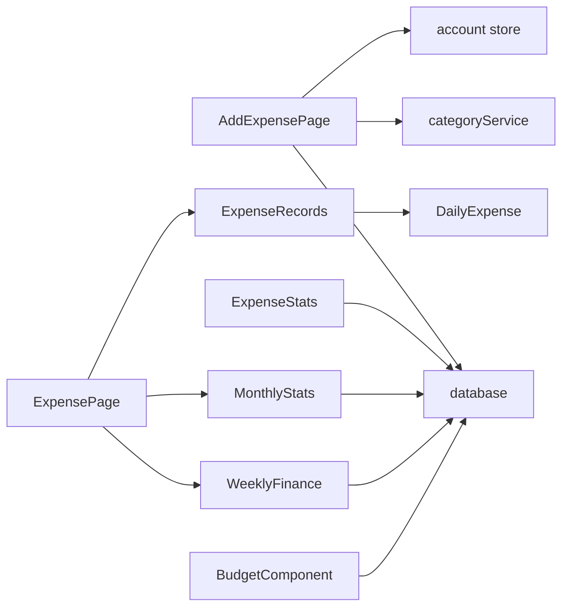

# 支出管理

<cite>
**本文引用的文件**   
- [AddExpensePage.vue](file://src/components/mobile/expense/AddExpensePage.vue)
- [ExpensePage.vue](file://src/components/mobile/expense/ExpensePage.vue)
- [ExpenseRecords.vue](file://src/components/mobile/expense/ExpenseRecords.vue)
- [DailyExpense.vue](file://src/components/mobile/expense/DailyExpense.vue)
- [ExpenseStats.vue](file://src/components/mobile/expense/ExpenseStats.vue)
- [MonthlyStats.vue](file://src/components/mobile/expense/MonthlyStats.vue)
- [WeeklyFinance.vue](file://src/components/mobile/expense/WeeklyFinance.vue)
- [BudgetComponent.vue](file://src/components/mobile/expense/BudgetComponent.vue)
- [NumberKeypad.vue](file://src/components/mobile/expense/NumberKeypad.vue)
- [CategoryItem.vue](file://src/components/mobile/expense/CategoryItem.vue)
- [categoryService.ts](file://src/services/categoryService.ts)
- [categories.ts](file://src/data/categories.ts)
- [index.js](file://src/database/index.js)
- [account.ts](file://src/stores/account.ts)
- [dictionaries.ts](file://src/utils/dictionaries.ts)
</cite>

## 目录
1. [简介](#简介)
2. [项目结构](#项目结构)
3. [核心组件](#核心组件)
4. [架构总览](#架构总览)
5. [详细组件分析](#详细组件分析)
6. [依赖分析](#依赖分析)
7. [性能考虑](#性能考虑)
8. [故障排查指南](#故障排查指南)
9. [结论](#结论)
10. [附录](#附录)

## 简介
本模块围绕“支出管理”展开，覆盖支出记录的创建、编辑、删除与查询；支出分类体系（预定义与自定义）；预算控制（月度预算与超支提醒）；统计分析（日/周/月统计）；移动端数字键盘与界面适配；以及与账户余额、资产等模块的集成关系。文档提供端到端业务流程说明、可视化架构图与序列图，并给出扩展与优化建议。

## 项目结构
支出管理模块位于移动端组件目录下，采用按功能域划分的组织方式：
- 录入与交互：AddExpensePage、NumberKeypad、CategoryItem
- 展示与汇总：ExpensePage、ExpenseRecords、DailyExpense、MonthlyStats、WeeklyFinance、ExpenseStats
- 分类与预算：categoryService、categories、BudgetComponent
- 数据与状态：database（SQLite封装）、account store

**图表来源**
- [AddExpensePage.vue:1-855](file://src/components/mobile/expense/AddExpensePage.vue#L1-L855)
- [ExpensePage.vue:1-88](file://src/components/mobile/expense/ExpensePage.vue#L1-L88)
- [ExpenseRecords.vue:1-105](file://src/components/mobile/expense/ExpenseRecords.vue#L1-L105)
- [DailyExpense.vue:1-204](file://src/components/mobile/expense/DailyExpense.vue#L1-L204)
- [MonthlyStats.vue:1-207](file://src/components/mobile/expense/MonthlyStats.vue#L1-L207)
- [WeeklyFinance.vue:1-250](file://src/components/mobile/expense/WeeklyFinance.vue#L1-L250)
- [ExpenseStats.vue:1-853](file://src/components/mobile/expense/ExpenseStats.vue#L1-L853)
- [BudgetComponent.vue:1-127](file://src/components/mobile/expense/BudgetComponent.vue#L1-L127)
- [NumberKeypad.vue:1-106](file://src/components/mobile/expense/NumberKeypad.vue#L1-L106)
- [CategoryItem.vue:1-69](file://src/components/mobile/expense/CategoryItem.vue#L1-L69)
- [categoryService.ts:1-260](file://src/services/categoryService.ts#L1-L260)
- [categories.ts:1-45](file://src/data/categories.ts#L1-L45)
- [index.js:1-935](file://src/database/index.js#L1-L935)
- [account.ts:1-273](file://src/stores/account.ts#L1-L273)

**章节来源**
- [AddExpensePage.vue:1-855](file://src/components/mobile/expense/AddExpensePage.vue#L1-L855)
- [ExpensePage.vue:1-88](file://src/components/mobile/expense/ExpensePage.vue#L1-L88)
- [ExpenseRecords.vue:1-105](file://src/components/mobile/expense/ExpenseRecords.vue#L1-L105)
- [DailyExpense.vue:1-204](file://src/components/mobile/expense/DailyExpense.vue#L1-L204)
- [MonthlyStats.vue:1-207](file://src/components/mobile/expense/MonthlyStats.vue#L1-L207)
- [WeeklyFinance.vue:1-250](file://src/components/mobile/expense/WeeklyFinance.vue#L1-L250)
- [ExpenseStats.vue:1-853](file://src/components/mobile/expense/ExpenseStats.vue#L1-L853)
- [BudgetComponent.vue:1-127](file://src/components/mobile/expense/BudgetComponent.vue#L1-L127)
- [NumberKeypad.vue:1-106](file://src/components/mobile/expense/NumberKeypad.vue#L1-L106)
- [CategoryItem.vue:1-69](file://src/components/mobile/expense/CategoryItem.vue#L1-L69)
- [categoryService.ts:1-260](file://src/services/categoryService.ts#L1-L260)
- [categories.ts:1-45](file://src/data/categories.ts#L1-L45)
- [index.js:1-935](file://src/database/index.js#L1-L935)
- [account.ts:1-273](file://src/stores/account.ts#L1-L273)

## 核心组件
- 支出录入页：负责分类选择、账户选择、日期时间选择、金额输入（含内置计算器）、保存为事务。
- 支出主页：聚合月统计、周统计、支出记录、浮动菜单。
- 记录展示：按月生成日维度，逐日加载流水明细。
- 统计分析：日历热力图、日线图、分类饼图。
- 分类系统：默认分类与数据库分类合并，支持增删改查。
- 预算组件：基于月度总预算与已支出计算剩余。
- 数字键盘：移动端专用，响应式布局。
- 数据层：统一SQLite封装，支持Capacitor SQLite与Web sql.js，提供事务、批处理、索引优化。

**章节来源**
- [AddExpensePage.vue:1-855](file://src/components/mobile/expense/AddExpensePage.vue#L1-L855)
- [ExpensePage.vue:1-88](file://src/components/mobile/expense/ExpensePage.vue#L1-L88)
- [ExpenseRecords.vue:1-105](file://src/components/mobile/expense/ExpenseRecords.vue#L1-L105)
- [DailyExpense.vue:1-204](file://src/components/mobile/expense/DailyExpense.vue#L1-L204)
- [ExpenseStats.vue:1-853](file://src/components/mobile/expense/ExpenseStats.vue#L1-L853)
- [MonthlyStats.vue:1-207](file://src/components/mobile/expense/MonthlyStats.vue#L1-L207)
- [WeeklyFinance.vue:1-250](file://src/components/mobile/expense/WeeklyFinance.vue#L1-L250)
- [BudgetComponent.vue:1-127](file://src/components/mobile/expense/BudgetComponent.vue#L1-L127)
- [NumberKeypad.vue:1-106](file://src/components/mobile/expense/NumberKeypad.vue#L1-L106)
- [categoryService.ts:1-260](file://src/services/categoryService.ts#L1-L260)
- [categories.ts:1-45](file://src/data/categories.ts#L1-L45)
- [index.js:1-935](file://src/database/index.js#L1-L935)
- [account.ts:1-273](file://src/stores/account.ts#L1-L273)

## 架构总览
支出管理模块遵循“视图-服务-数据层”的分层设计，视图组件通过服务访问数据库，账户余额变动由事务保证原子性。

**图表来源**
- [AddExpensePage.vue:1-855](file://src/components/mobile/expense/AddExpensePage.vue#L1-L855)
- [ExpensePage.vue:1-88](file://src/components/mobile/expense/ExpensePage.vue#L1-L88)
- [categoryService.ts:1-260](file://src/services/categoryService.ts#L1-L260)
- [account.ts:1-273](file://src/stores/account.ts#L1-L273)
- [index.js:1-935](file://src/database/index.js#L1-L935)
- [categories.ts:1-45](file://src/data/categories.ts#L1-L45)

## 详细组件分析

### 支出录入与保存流程
- 用户在录入页选择分类、账户、日期时间，通过数字键盘输入金额（内置计算器支持加减与负数），点击保存。
- 保存前进行账户类型校验（余额/可用额度），随后构造两条SQL语句：插入流水与更新账户余额/已用额度，使用事务一次性提交。
- 成功后刷新账户列表，回到支出主页。

**图表来源**
- [AddExpensePage.vue:364-482](file://src/components/mobile/expense/AddExpensePage.vue#L364-L482)
- [NumberKeypad.vue:1-106](file://src/components/mobile/expense/NumberKeypad.vue#L1-L106)
- [account.ts:34-53](file://src/stores/account.ts#L34-L53)
- [index.js:354-374](file://src/database/index.js#L354-L374)

**章节来源**
- [AddExpensePage.vue:364-482](file://src/components/mobile/expense/AddExpensePage.vue#L364-L482)
- [NumberKeypad.vue:1-106](file://src/components/mobile/expense/NumberKeypad.vue#L1-L106)
- [account.ts:34-53](file://src/stores/account.ts#L34-L53)
- [index.js:354-374](file://src/database/index.js#L354-L374)

### 支出记录展示与查询
- 支出主页按月渲染，包含月统计、周统计、支出记录。
- 月记录页生成当月所有日期，逐日加载流水明细。
- 日明细页根据日期范围查询流水，拼接账户名称与分类名称。

**图表来源**
- [ExpensePage.vue:1-88](file://src/components/mobile/expense/ExpensePage.vue#L1-L88)
- [ExpenseRecords.vue:28-97](file://src/components/mobile/expense/ExpenseRecords.vue#L28-L97)
- [DailyExpense.vue:52-106](file://src/components/mobile/expense/DailyExpense.vue#L52-L106)

**章节来源**
- [ExpensePage.vue:1-88](file://src/components/mobile/expense/ExpensePage.vue#L1-L88)
- [ExpenseRecords.vue:28-97](file://src/components/mobile/expense/ExpenseRecords.vue#L28-L97)
- [DailyExpense.vue:52-106](file://src/components/mobile/expense/DailyExpense.vue#L52-L106)

### 统计分析与图表
- 日历热力图：按月统计每日支出，填充日历单元格。
- 日线图：按自然日绘制支出折线，Y轴最大值动态计算。
- 分类饼图：按分类汇总支出，支持无数据时均分展示。
- 月度收支：查询账户收入/支出总和，计算结余。

**图表来源**
- [ExpenseStats.vue:125-255](file://src/components/mobile/expense/ExpenseStats.vue#L125-L255)
- [MonthlyStats.vue:55-94](file://src/components/mobile/expense/MonthlyStats.vue#L55-L94)
- [index.js:199-264](file://src/database/index.js#L199-L264)

**章节来源**
- [ExpenseStats.vue:125-255](file://src/components/mobile/expense/ExpenseStats.vue#L125-L255)
- [MonthlyStats.vue:55-94](file://src/components/mobile/expense/MonthlyStats.vue#L55-L94)
- [index.js:199-264](file://src/database/index.js#L199-L264)

### 分类系统设计
- 默认分类来自本地数据文件，首次使用时初始化到数据库。
- 分类服务提供增删改查与合并逻辑：优先使用数据库自定义分类，否则回退默认分类。
- 分类项组件负责UI交互与选中态。

**图表来源**
- [categoryService.ts:8-69](file://src/services/categoryService.ts#L8-L69)
- [categories.ts:1-45](file://src/data/categories.ts#L1-L45)

**章节来源**
- [categoryService.ts:8-69](file://src/services/categoryService.ts#L8-L69)
- [categories.ts:1-45](file://src/data/categories.ts#L1-L45)

### 预算控制
- 预算组件基于月度总预算与已支出计算剩余。
- 未实现预算表时使用模拟总预算，后续可扩展预算表并替换查询逻辑。

**图表来源**
- [BudgetComponent.vue:35-76](file://src/components/mobile/expense/BudgetComponent.vue#L35-L76)

**章节来源**
- [BudgetComponent.vue:35-76](file://src/components/mobile/expense/BudgetComponent.vue#L35-L76)

### 数字键盘与移动端适配
- 数字键盘提供基础数字、小数点、加减、清除与保存按钮。
- 响应式尺寸在不同屏幕宽度下调整按键大小与间距，提升移动端体验。

**章节来源**
- [NumberKeypad.vue:1-106](file://src/components/mobile/expense/NumberKeypad.vue#L1-L106)

### 与账户余额更新的集成
- 支出保存时，根据账户类型分别更新余额或已用额度，并记录流水。
- 账户Store提供统一查询与刷新能力，确保UI与数据一致。

**章节来源**
- [AddExpensePage.vue:410-453](file://src/components/mobile/expense/AddExpensePage.vue#L410-L453)
- [account.ts:34-53](file://src/stores/account.ts#L34-L53)

## 依赖分析
- 视图组件依赖服务层（分类）、数据层（数据库）、状态层（账户）。
- 统计组件依赖数据库查询与ECharts渲染。
- 数据层对Capacitor SQLite与Web sql.js提供统一接口，支持事务与批处理。

**图表来源**
- [AddExpensePage.vue:1-855](file://src/components/mobile/expense/AddExpensePage.vue#L1-L855)
- [ExpensePage.vue:1-88](file://src/components/mobile/expense/ExpensePage.vue#L1-L88)
- [ExpenseRecords.vue:1-105](file://src/components/mobile/expense/ExpenseRecords.vue#L1-L105)
- [DailyExpense.vue:1-204](file://src/components/mobile/expense/DailyExpense.vue#L1-L204)
- [MonthlyStats.vue:1-207](file://src/components/mobile/expense/MonthlyStats.vue#L1-L207)
- [WeeklyFinance.vue:1-250](file://src/components/mobile/expense/WeeklyFinance.vue#L1-L250)
- [ExpenseStats.vue:1-853](file://src/components/mobile/expense/ExpenseStats.vue#L1-L853)
- [BudgetComponent.vue:1-127](file://src/components/mobile/expense/BudgetComponent.vue#L1-L127)
- [categoryService.ts:1-260](file://src/services/categoryService.ts#L1-L260)
- [account.ts:1-273](file://src/stores/account.ts#L1-L273)
- [index.js:1-935](file://src/database/index.js#L1-L935)

**章节来源**
- [AddExpensePage.vue:1-855](file://src/components/mobile/expense/AddExpensePage.vue#L1-L855)
- [ExpensePage.vue:1-88](file://src/components/mobile/expense/ExpensePage.vue#L1-L88)
- [ExpenseRecords.vue:1-105](file://src/components/mobile/expense/ExpenseRecords.vue#L1-L105)
- [DailyExpense.vue:1-204](file://src/components/mobile/expense/DailyExpense.vue#L1-L204)
- [MonthlyStats.vue:1-207](file://src/components/mobile/expense/MonthlyStats.vue#L1-L207)
- [WeeklyFinance.vue:1-250](file://src/components/mobile/expense/WeeklyFinance.vue#L1-L250)
- [ExpenseStats.vue:1-853](file://src/components/mobile/expense/ExpenseStats.vue#L1-L853)
- [BudgetComponent.vue:1-127](file://src/components/mobile/expense/BudgetComponent.vue#L1-L127)
- [categoryService.ts:1-260](file://src/services/categoryService.ts#L1-L260)
- [account.ts:1-273](file://src/stores/account.ts#L1-L273)
- [index.js:1-935](file://src/database/index.js#L1-L935)

## 性能考虑
- 数据库层：使用索引优化（账户类型、账户流动性、流水账户外键、流水创建时间、分类类型）；事务与批处理减少往返；查询缓存降低重复查询成本。
- 视图层：按需渲染（月记录按日加载）、图表数据按月聚合、移动端响应式布局减少重排。
- 事务安全：支出保存使用executeTransaction，确保账户更新与流水插入原子性。

[本节为通用指导，无需特定文件引用]

## 故障排查指南
- 保存失败：检查账户余额/可用额度是否充足；查看事务回滚日志；确认数据库连接状态。
- 分类异常：确认默认分类初始化是否完成；检查分类服务返回的合并结果。
- 统计无数据：确认查询时间范围与类型过滤；检查数据库中是否存在对应记录。
- 预算显示异常：确认预算表结构与查询逻辑；若无预算表，组件使用模拟数据。

**章节来源**
- [AddExpensePage.vue:397-408](file://src/components/mobile/expense/AddExpensePage.vue#L397-L408)
- [categoryService.ts:199-260](file://src/services/categoryService.ts#L199-L260)
- [ExpenseStats.vue:125-211](file://src/components/mobile/expense/ExpenseStats.vue#L125-L211)
- [BudgetComponent.vue:35-76](file://src/components/mobile/expense/BudgetComponent.vue#L35-L76)

## 结论
支出管理模块以清晰的分层与事务保障为核心，结合移动端友好的交互与统计分析，形成从录入到洞察的完整闭环。通过默认分类与自定义分类的融合、预算控制的可扩展设计、以及数据库层的性能优化，模块具备良好的可维护性与扩展性。

[本节为总结性内容，无需特定文件引用]

## 附录

### 业务流程总览（从录入到分析）

[本图为概念流程，无需图表来源]

### 代码示例路径（不含具体代码内容）
- 支出保存事务示例路径：[AddExpensePage.vue:419-459](file://src/components/mobile/expense/AddExpensePage.vue#L419-L459)
- 月度收支查询示例路径：[MonthlyStats.vue:67-84](file://src/components/mobile/expense/MonthlyStats.vue#L67-L84)
- 日线图数据生成示例路径：[ExpenseStats.vue:213-255](file://src/components/mobile/expense/ExpenseStats.vue#L213-L255)
- 分类初始化示例路径：[categoryService.ts:199-260](file://src/services/categoryService.ts#L199-L260)
- 数据库事务封装示例路径：[index.js:354-374](file://src/database/index.js#L354-L374)